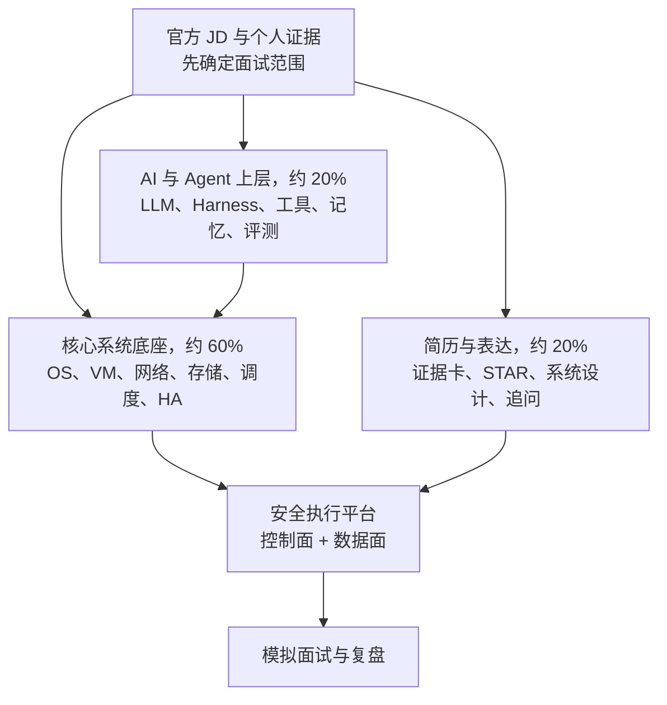

# DeepSeek AI Agent Infra 面试宝典

> 这本书面向第一次系统学习 AI、正在准备 DeepSeek Agent Infra 岗位的读者。它从最小 AI 直觉出发，一直走到 Agent Harness、DSec 类沙箱云平台、可靠性和个性化面试实战。

AI（人工智能）这个词很大。对零基础读者来说，最容易踩的坑是直接背模型名称、框架 API 和面试答案，却不知道一个模型为什么能学习、数据怎样变成输入、输出怎样被评估，以及系统上线后为什么可能失效。本篇将从直觉和最小数学开始，逐步走到机器学习、深度学习、Transformer 与大语言模型，再进入训练、推理、RAG、Agent、安全评测和系统设计。

本篇的目标不是让读者记住一串术语，而是建立一条可复述、可实现、可验证的知识链：**问题定义 → 数据 → 模型 → 训练 → 推理 → 评测 → 部署 → 风险边界**。面试时，你不仅要说“用了什么”，还要解释“为什么这样选、怎样证明有效、失败时怎样定位”。

如果面试就在眼前，先读[官方岗位要求与知识边界](orientation/role_map.md)，再读[候选人能力矩阵与面试定位](orientation/candidate_strategy.md)。主岗明确要求、相邻 Agent 岗位透露的 AI 边界、以及典型工程方案在书中会用不同措辞标注，避免把合理推断冒充 DeepSeek 内部事实。

## 1. 先看全局：这本书真正覆盖什么

为什么系统底座占最大比例？因为主岗 JD 直接点名 VM 集群、容器隔离、文件写入、临时块设备、共享卷、虚拟网络、调度、控制面和高可用。Transformer、Agent Loop、Tool Use、Memory 与 Multi-Agent 也值得准备，但它们主要来自相邻官方 Agent Harness 岗位。书中会一直保留这条证据边界。

## 2. 六部分与可以带走的产出

| 部分 | 已覆盖内容 | 学完后的可见产出 |
|---|---|---|
| 定位 | 官方职责、来源边界、个人能力矩阵 | 一段不夸大的自我定位与复习优先级 |
| AI/LLM 地基 | 最小数学直觉、数据泛化、Transformer、训练与推理 | 能用通俗话解释模型为何学习、首 Token 为何慢、KV Cache 为何吃内存 |
| Agent Harness | Loop、工具、MCP、Context/Memory、规划、多 Agent、持久执行、评测与 RAG | 能画出“模型提出意图，系统授权和执行”的闭环，并讲清失败归因 |
| Runtime | `write()` 到落盘、沙箱威胁、容器/VM、生命周期、存储、网络、控制面 | 能回答主 JD 最容易连续深挖的系统题 |
| Platform | 分布式取舍、观测、可靠性、容量与安全 | 能从故障、SLO、证据和恢复出发做取舍 |
| 面试实战 | 简历追问、白板设计、80 题、冲刺计划 | 一套可排练的答案骨架，以及必须由本人补真的事实卡 |

这是一本文字教材与面试手册，不伪装成传统机器学习或 GPU 编程的完整课程，也不提供已经跑好的 Notebook 实验。公式和数字算例用于建立直觉；真正的性能结论仍要用明确硬件、软件版本、数据和负载实测。若目标改为算法训练岗，还需要另补传统模型、完整训练实践、优化理论与 GPU kernel 等专题。

## 3. 建议学习顺序

若面试在两周内，按“核心系统 60% / Agent 上层 20% / 简历证据 20%”安排时间：

1. 先读岗位地图和候选人策略，知道什么是官方硬要求，什么只是相邻证据。
2. 先攻 Runtime 与 Platform，尤其是文件写入、隔离、存储、网络、租约/fencing、HA 和事故处理。
3. 再补最小 LLM 与 Agent Harness，使你能解释底座为何要支持工具、状态、权限和恢复。
4. 最后用题库闭卷回答，用真实简历事实填完测量卡、论文事实表和 STAR；空白项不能靠猜。

具体到每天的任务、Linux/Rust 实操和复盘节奏，见[冲刺计划](interview/study_plan.md)。

## 4. 本书采用的质量门槛

1. **对零基础友好**：先说问题和直觉，首次缩写尽量展开，再补机制。
2. **事实分层**：官方主岗、相邻岗位、工程推断和教学假设使用不同措辞。
3. **面试可用**：核心章包含 30 秒答法、追问、失败路径和速记。
4. **不编经历**：简历没有证明的大规模生产经验会明确写成缺口；待补数字保留为空白模板。
5. **能被反驳**：容量和性能结论写清假设，安全设计说明剩余风险，系统设计包含故障与恢复。
6. **资料可追溯**：优先引用 JD、论文、规范和官方项目文档；会变化的事实标日期。

## 5. 与现有 Rust 内容怎样连接

AI 系统不是只有模型。模型周围仍是普通的软件系统，而 Rust 篇提供了理解这些工程问题的地基：

- [所有权与生命周期](../rust-hft/rust_advanced/lifetimes.html)帮助理解零拷贝张量视图、缓冲区所有权和 FFI 借用边界。
- [Send 与 Sync](../rust-hft/rust_advanced/send_sync.html)与[并发模型选择](../rust-hft/foundations/concurrency.html)用于分析模型服务的 worker、队列、共享状态和异步 I/O。
- [内存布局与缓存效率](../rust-hft/foundations/memory_layout.html)帮助理解批处理、连续张量、量化表示和数据搬运，但具体收益必须实测。
- [Unsafe Rust](../rust-hft/foundations/unsafe_rust.html)为 SIMD、设备接口和底层运行时提供审计方法；`unsafe` 仍是证明责任，不是自动加速按钮。
- [错误处理](../rust-hft/rust_advanced/error_handling.html)可用于设计模型超时、检索失败、工具失败和降级路径，让错误成为协议的一部分。

本书始终把“模型逻辑”和“系统外壳”分层：Python 或主流训练框架适合快速验证算法，Rust 适合在边界明确时承担高可靠服务、数据处理或性能敏感组件。是否迁移到 Rust 应由维护成本、生态兼容和测量结果决定，而不是语言偏好。

## 6. 与现有 HFT 内容怎样连接

HFT 对时间、数据和风险的要求，会让很多通用 AI 假设失效。本书借用现有行情、策略、回放和风控知识，帮助你讨论以下接口：

- 数据接口：行情快照、增量更新、事件时间、缺失值和公司行为怎样变成不会偷看未来的训练样本。
- 验证接口：[事件回放](../rust-hft/simulation/replay.html)与时间顺序切分怎样帮助识别数据泄漏、市场制度变化和不可复现结果。
- 决策接口：模型分数如何经过确定性规则、仓位约束和[交易前风控](../rust-hft/engine/pre_trade_risk.html)，而不是直接变成订单。
- 运行接口：离线训练、盘中旁路推断、关键交易路径和控制面必须区分，各自采用不同的延迟预算与故障策略。
- 观测接口：同时记录输入版本、模型版本、特征版本、输出、后续结果与人工操作，才能进行归因和回滚。

## 7. AI × Rust × HFT 的边界

三者结合有价值，但不能默认组合后一定更快、更准或更赚钱。一个负责任的设计应先判断 AI 是否真的适合该问题：

- 可优先探索的区域包括离线研究辅助、日志归类、异常调查、文档检索、代码与运维助手，以及经过严格验证的旁路信号研究。
- 需要高度谨慎的区域包括盘中自动改参、不可解释的风险放行、由 Agent 自主操作生产环境，以及把非确定模型直接放进硬实时下单链路。
- Rust 能改善一部分系统可靠性、资源控制和执行效率，但不会修复错误标签、未来信息泄漏、概念漂移或不合理的交易假设。
- HFT 的回测结果不能单独证明上线收益；模型必须经过时间外验证、成本与容量建模、风险限制、影子运行和可回滚发布。
- 大语言模型输出默认是不可信输入。凡是会影响资金、权限或生产状态的操作，都必须经过结构校验、权限检查、确定性规则和审计记录。

这条边界也是面试中的高分点：成熟的候选人不会只画“模型 → 下单”的箭头，而会主动补上数据时间语义、风险闸门、人工权限、失败模式、监控和回滚。

## 8. 读完后，你应该能回答什么

读完并完成事实卡与实操后，你应能用通俗语言回答以下问题，并经得住追问：

- 一个 AI 问题从业务目标到离线指标是怎样定义的？指标什么时候会骗人？
- 模型为何会过拟合？训练、验证和测试数据应怎样分开？
- Transformer 的注意力在计算什么？上下文变长会影响哪些资源？
- 微调、RAG 和提示设计分别在改变什么，怎样选择而不是全部叠加？
- 推理服务如何在延迟、吞吐、成本、可靠性之间取舍？
- Agent 调用工具时，怎样限制权限、保证幂等并处理部分失败？
- 如何证明一个 AI 功能“值得上线”，又如何在结果恶化时发现并回滚？
- 在 Rust 与 HFT 系统中，模型应通过什么边界接入，哪些决策必须保持确定性？

真正的面试准备不是背完这些问题，而是能从第一原则推出答案：说清假设，画出链路，给出验证方法，承认未知，并为失败设计安全出口。
