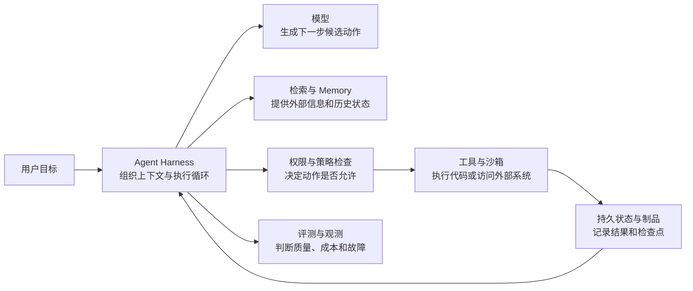
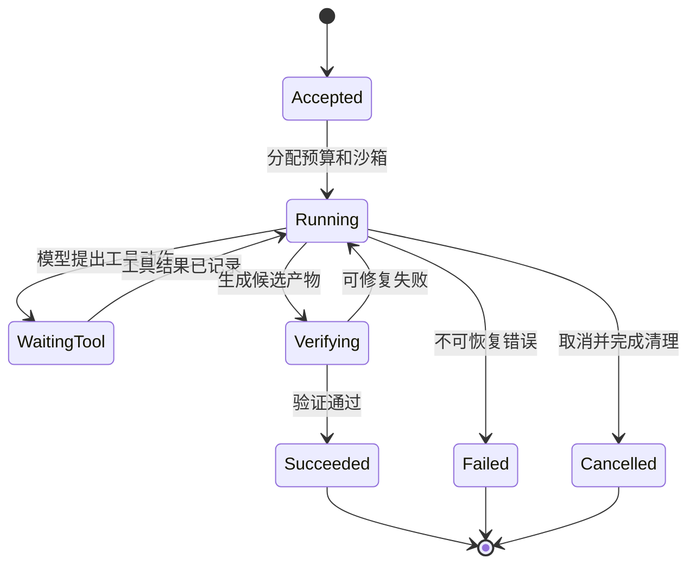

# AI 系统与 Agent Infra 基础宝典

一个能回答问题的大语言模型，还不是一个能可靠完成工作的 Agent。真正的 Agent 系统必须把模型接到上下文、检索、工具、沙箱、状态、权限和评测，并在超时、重试、进程崩溃或模型判断错误时仍能安全收场。

这本书从零解释 AI、LLM、核心系统与 Agent Infra。内容既覆盖模型怎样计算，也覆盖 PyTorch 怎样执行、GPU Kernel 怎样工作、多卡怎样通信、推理与训练怎样调度，以及 Agent 怎样在受控环境中调用工具。

图中的每个方框解决不同问题：模型提供非确定的推理与生成能力；Harness 维护控制流；权限层限制可执行动作；沙箱隔离不可信代码；存储保存能够恢复的事实；评测与观测回答“系统是否真的完成了任务”。把这些职责混在一个进程或一段提示词里，系统就很难审计、扩展和恢复。

## 1. AI 系统的四个层次

### 1.1 模型层：根据输入计算输出分布

机器学习模型通过数据调整参数，使某种损失函数下降。大语言模型接收 Token 序列，计算下一个 Token 的概率分布，再通过解码策略逐步生成文本或结构化动作。

这一层要回答：

- 数据、参数、损失和梯度分别是什么；
- Transformer 怎样让 Token 交换信息；
- 训练与推理为什么是两种不同工作负载；
- Prefill、Decode、KV Cache、批处理和量化怎样影响延迟、吞吐与显存；
- 模型输出为什么不能直接视为事实或授权。

### 1.2 核心系统层：把模型变成可运行的软件

模型公式最终要落到 Tensor、计算图、Kernel、显存、通信和存储。PyTorch Runtime 负责对象、自动微分与算子分派；GPU Kernel 把计算映射到线程和内存；分布式框架切分模型状态与数据；推理引擎管理请求和 KV Cache；集群与存储让大量设备能够调度、恢复和持续运行。

这一层要回答：

- Tensor 的 shape、stride、View 和 Storage 怎样决定真实数据；
- CUDA 的 block、warp、内存层次和 stream 怎样执行 Kernel；
- DDP、FSDP、TP、PP 与 EP 分别切什么、在哪里通信；
- 编译器怎样从计算图和 IR 生成并验证算子；
- 推理 Scheduler 怎样管理 Prefill、Decode、KV、抢占和版本；
- GPU 拓扑、健康、Checkpoint 与分布式存储怎样影响恢复。

### 1.3 Agent 层：把一次生成组织成可执行循环

**Agent Harness** 是连接模型与外部世界的系统外壳。它选择上下文，向模型声明可用工具，解析候选动作，执行策略检查，接收工具结果，再决定继续、结束、重试还是请求人工确认。

这一层要回答：

- 模型、Context 与 Harness 的职责怎样分开；
- Tool Use、Skills 与 MCP 解决了什么接口问题；
- 短期上下文和长期 Memory 保存什么，谁能修改；
- 规划、多 Agent 和子任务并行何时有收益，何时只会放大成本与错误；
- 长任务怎样使用幂等键、状态机和 Checkpoint 恢复。

### 1.4 Runtime 层：在强制边界内执行不可信动作

模型可能生成错误命令，工具也可能包含缺陷。**Agent Runtime** 因此要把一次执行放进明确的进程、文件、网络、身份和资源边界中。容器、用户态内核和虚拟机提供不同强度与成本的隔离；调度器、控制面和存储系统负责创建、分配、回收与恢复这些环境。

这一层要回答：

- 信任边界和威胁模型包含哪些主体、资产与攻击路径；
- namespace、cgroup、系统调用过滤、用户态内核和 VM 各隔离什么；
- 任务、执行尝试、沙箱和外部副作用为什么不能共用一个状态；
- 临时盘、共享卷、制品和 Checkpoint 的生命周期怎样定义；
- 虚拟网络怎样同时满足连通、租户隔离和出口控制。

### 1.5 Platform 层：让大量任务可运营

当系统同时运行许多 Agent，单机上的正确机制还要组合成分布式平台。平台必须处理副本、租约、重试、部分失败、过载、公平性、秘密、审计和事故恢复。

这一层要回答：

- 超时后为什么不能直接断定操作失败；
- 幂等、fencing、Outbox 和 reconciliation 分别收口什么失败；
- 指标、日志与 trace 怎样共同定位一次 run；
- SLI、SLO、错误预算和容量模型怎样约束发布与准入；
- 能力票据、工作负载身份和最小权限怎样限制合法但危险的动作。

## 2. 一次 Agent 任务怎样经过整套系统

假设用户要求 Agent 修改代码并运行测试：

1. 接入层创建一个 **Task**，记录目标、调用者身份、预算和允许使用的工具。
2. Harness 组装系统规则、仓库信息、历史消息和工具描述，形成本轮 Context。
3. 模型生成候选动作，例如读取文件或执行测试命令。候选动作只是建议，不是已经授权的操作。
4. 策略层校验工具名、参数、文件范围、网络目标、费用和是否需要人工批准。
5. Runtime 在受控沙箱中创建一次 **Attempt**，设置进程、内存、CPU、文件系统和网络边界。
6. 工具执行后返回结构化结果；Harness 把必要信息加入后续 Context，而不是无上限复制全部输出。
7. 每个有副作用的步骤记录操作标识、结果和不确定状态，使超时重试不会轻易重复提交。
8. 测试或 verifier 检查产物；失败时系统根据错误类别决定修复、重试、回滚或停止。
9. 观测系统把模型调用、工具、沙箱和存储事件关联到同一个 run，供评测和事故分析使用。

状态机必须以持久事实为准。进程已经退出、RPC 返回超时和业务动作已经失败是三件不同的事；外部支付、发信或写数据库等副作用还需要单独查询和对账。

## 3. 最容易混淆的职责边界

| 概念 | 它负责什么 | 它不自动保证什么 |
|---|---|---|
| 模型 | 根据输入生成内容或动作建议 | 事实正确、权限合法、执行成功 |
| Prompt / Context | 告诉模型当前规则和信息 | 强制隔离、持久状态、秘密安全 |
| Harness | 组织多轮控制流、工具和验证 | 内核级隔离、外部系统幂等 |
| MCP | 规范 AI 应用与工具/资源的连接方式 | 工具可信、调用已授权 |
| 沙箱 | 限制进程、文件、网络和资源影响范围 | 业务动作正确、外部 API 可回滚 |
| Checkpoint | 保存能够继续执行的状态 | 任意时刻复制内存就得到一致快照 |
| 评测 | 在定义的数据和指标上测量系统 | 自动代表所有线上用户与未来分布 |
| 可观测性 | 提供运行证据 | 单靠更多日志自动找到根因 |

## 4. 与系统基础子书的分工

AI 服务最终仍运行在普通计算机和操作系统上。通用机制只在<a href="../rust-hft/index.html">《系统、Rust、C++ 与 HFT 基础宝典》</a>主讲，本书只解释它们进入 AI/Agent 场景后新增的接口和失败语义。

- [一次程序怎样运行](../rust-hft/foundations/computer_execution.html)：理解 CPU、内存、内核、驱动和设备怎样连接。
- [进程、线程、文件描述符与管道](../rust-hft/foundations/processes_fds.html)：理解沙箱进程树、标准输入输出和资源引用。
- [CPU 调度](../rust-hft/foundations/cpu_scheduling.html)与[操作系统同步](../rust-hft/foundations/os_synchronization.html)：理解就绪、等待、竞态和唤醒。
- [虚拟内存](../rust-hft/foundations/virtual_memory.html)与[内存管理](../rust-hft/foundations/memory_management.html)：理解地址空间、缺页、工作集和 OOM。
- [网络基础](../rust-hft/network/network_overview.html)：理解分层、IP、TCP、DNS 和 Socket；本书再讨论工具 RPC、虚拟网络与出口控制。
- [文件系统](../rust-hft/foundations/file_systems.html)与[一次 `write`](../rust-hft/foundations/file_write_path.html)：理解页缓存、文件对象和持久化；本书再讨论 Checkpoint、共享卷和制品。
- [数据库基础](../rust-hft/databases/index.html)：理解关系模型、索引、事务、MVCC、WAL、恢复和复制；本书再讨论 Agent 控制状态与 Checkpoint。
- [分布式系统基础](../rust-hft/distributed/index.html)：理解部分失败、一致性、复制、共识、分片、幂等和跨服务事务；本书再讨论长任务与工具副作用。
- [计算机性能](../rust-hft/foundations/computer_performance.html)：理解响应时间、吞吐量和 Amdahl 定律；本书再建立模型推理与 Agent 任务的容量账本。

## 5. 本书覆盖的知识结构

| 部分 | 主问题 |
|---|---|
| AI 与学习基础 | 模型怎样从数据中学习，为什么会过拟合或漂移 |
| Transformer 与 LLM | Token 怎样计算，训练和生成怎样消耗算力与显存 |
| AI 核心系统 | PyTorch、CUDA、算子、编译、多卡通信、训推调度、GPU 集群与存储怎样协作 |
| Agent | 模型怎样连接工具、记忆、规划、检索和评测 |
| Runtime | 不可信代码怎样在隔离环境中启动、运行、通信和保存状态 |
| Platform | 大量任务怎样调度、观测、限流、恢复和审计 |
| 系统设计与问题库 | 怎样把定义、机制、数量级、失败路径和取舍组成完整回答 |

## 6. 贯穿全书的核心问题

1. 当前对象是什么：模型请求、Task、Attempt、工具操作、进程还是制品？
2. 谁拥有状态，哪个存储才是事实源？
3. 动作由谁提出、由谁授权、由谁执行、由谁验证？
4. 超时发生后，结果是成功、失败，还是暂时未知？
5. 重试会不会重复产生外部副作用？
6. 资源是否有上限，队列满时拒绝、等待还是降级？
7. 哪个边界阻止一个租户、工具或模型影响其他对象？
8. 怎样用指标、日志、trace 和可复现实验证明结论？
9. 数据或用户分布变化后，离线评测仍然代表线上吗？
10. 系统失败时，怎样停止扩散、恢复服务并防止同类事故再次发生？

能持续回答这些问题，就能把模型知识与系统工程连接起来，而不是把 AI、容器、数据库和分布式系统背成互不相关的术语表。
