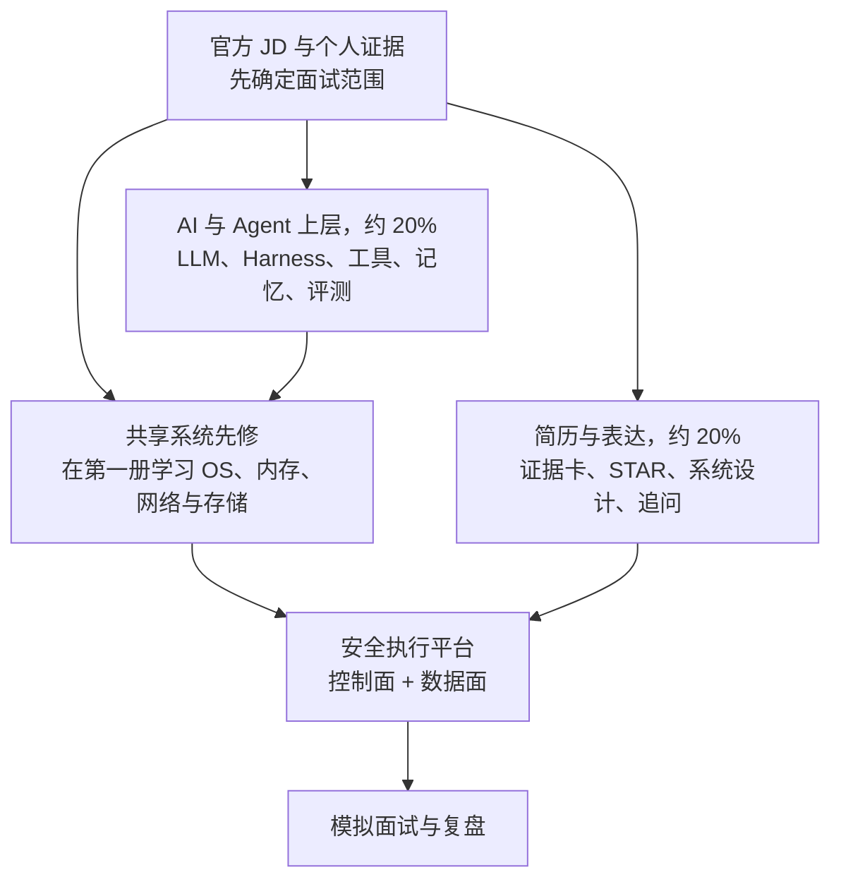

# AI 与 Agent Infra 面试宝典

> 这本书面向第一次系统学习 AI、正在准备 DeepSeek Agent Infra 岗位的读者。它从 AI 的最小学习基础出发，走到 LLM、Agent Harness、DSec 类沙箱平台、可靠性和个性化面试实战。

Agent Infra 横跨两个世界：上层是模型、上下文和工具，下层是 CPU、内存、Linux、网络、存储与分布式系统。为了避免同一个基础概念维护两套解释，通用计算机系统知识统一放在<a href="../rust-hft/index.html">《系统、Rust、C++ 与 HFT 基础宝典》</a>中。本书每次使用这些知识时，都会先说明当前问题和需要的先修，再给出准确链接；随后只讲 Agent 平台新增的隔离、调度、状态、权限和恢复问题。

本篇的目标不是让读者记住一串术语，而是建立一条可复述、可实现、可验证的知识链：**问题定义 → 数据 → 模型 → 训练 → 推理 → 评测 → 部署 → 风险边界**。面试时，你不仅要说“用了什么”，还要解释“为什么这样选、怎样证明有效、失败时怎样定位”。

如果面试就在眼前，先读[官方岗位要求与知识边界](orientation/role_map.md)，再读[候选人能力矩阵与面试定位](orientation/candidate_strategy.md)。主岗明确要求、相邻 Agent 岗位透露的 AI 边界、以及典型工程方案在书中会用不同措辞标注，避免把合理推断冒充 DeepSeek 内部事实。

## 1. 先看全局：这本书真正覆盖什么

为什么目录仍有大量系统内容？因为主岗 JD 直接点名 VM 集群、容器隔离、文件写入、临时块设备、共享卷、虚拟网络、调度、控制面和高可用。区别在于：第一册解释“进程、虚拟内存或一次 `write` 本身是什么”，本书解释“Agent 沙箱怎样利用这些机制并处理多租户、取消和恢复”。Transformer、Agent Loop、Tool Use、Memory 与 Multi-Agent 主要来自相邻官方 Agent Harness 岗位，书中会一直标清这条证据边界。

## 2. 七类学习产出

| 部分 | 已覆盖内容 | 学完后的可见产出 |
|---|---|---|
| 定位 | 官方职责、来源边界、个人能力矩阵 | 一段不夸大的自我定位与复习优先级 |
| 共享系统先修 | 用导航连接第一册的程序执行、进程、虚拟内存、并发、网络、文件写入与性能诊断 | 知道当前章节缺哪块基础、为什么要补，以及应该到哪里补 |
| AI/LLM 地基 | 最小数学直觉、神经网络积木、Transformer、GPU 数值、训练与推理 | 能解释模型为何学习、算子怎样执行、首 Token 为何慢、KV Cache 为何吃内存 |
| Agent Harness | Loop、工具、MCP、Context/Memory、规划、多 Agent、持久执行、评测与 RAG | 能画出“模型提出意图，系统授权和执行”的闭环，并讲清失败归因 |
| Runtime | 沙箱威胁、容器/VM、生命周期、存储、网络、控制面 | 能回答主 JD 最容易连续深挖的平台运行时题 |
| Platform | 分布式取舍、观测、可靠性、容量与安全 | 能从故障、SLO、证据和恢复出发做取舍 |
| 面试实战 | 简历追问、白板设计、120 题、分级冲刺计划 | 一套可排练的答案骨架，以及必须由本人补真的事实卡 |

这是一本文字教材与面试手册，不伪装成完整的计算机专业课程、传统机器学习课程或 CUDA 编程课。公式、命令和数字算例用于建立直觉；真正的性能结论仍要用明确硬件、软件版本、数据和负载实测。若目标改为算法训练岗或 GPU Kernel 岗，还需要另补传统模型、完整训练实践、优化理论与 CUDA 编程。

## 3. 两条学习路线：为什么顺序不同

这本书既是教材，也是面试手册，因此提供两条路线。它们不是互相矛盾，而是在回答不同问题：教材路线追求知识依赖完整，冲刺路线追求先覆盖主 JD 的高概率追问。

### 3.1 目录教材顺读路线

适合第一次完整学习、时间至少四周的读者。按左侧目录顺序阅读：

1. 先读岗位地图和候选人策略，明确事实边界。
2. 打开[共享系统先修导航](systems/index.html)，先补“程序执行、进程、虚拟内存、网络和文件写入”这条最短路线；已经掌握的章节可以用自测跳过。
3. 学本书第一部分的 Agent 增量，理解安全执行、内存隔离、取消、RPC、状态恢复和容量为什么不能只靠普通函数调用解决。
4. 学 AI/LLM 与 Agent：先补 AI/ML、数学、数据和神经网络积木，再按 **Transformer → 生成 → GPU → 推理 → 训练 → DeepSeek 综合架构** 学 LLM，最后进入 Agent Harness。
5. 再进入 Runtime、Platform 与面试实战，把上下两层组合成安全、可恢复的平台。

这条路线与 `SUMMARY` 的章节顺序一致。新人可以一直点击“下一页”，不用自己猜先修关系；完整节奏见[28 天零基础计划](interview/study_plan.md)。

### 3.2 临近面试冲刺路线

适合已经学过 OS/网络，或者只剩两周以内的读者。按“核心系统 60% / Agent 上层 20% / 简历证据 20%”分配时间：

1. 先按[共享系统先修导航](systems/index.html)闭卷自测，只补答不出的 P0 内容，不从两本书第一页平均重读。
2. 先攻第一册的文件写入，再攻本书的 Agent 增量、Runtime 与 Platform，重点覆盖隔离、VM、存储、网络、租约、fencing（阻止旧持有者继续写）、HA（高可用）和事故处理。
3. 再补最小 LLM 与 Agent Harness，解释底座为何要支持算力、工具、状态、权限和恢复。
4. 最后用题库、真实简历事实和白板做高压输出训练；空白项不能靠猜。

这条路线会暂时跳过目录中的一部分 P1/P2，因为主岗首先考系统底座。具体到每天的 Linux/Rust 实操和复盘节奏，见[14 天、7 天与最后 24 小时计划](interview/study_plan.md)。

## 4. 本书采用的质量门槛

1. **对零基础友好**：先说问题和直觉，首次缩写尽量展开，再补机制。
2. **分级而非全背**：P0 是理解后文与通过高频面试必须掌握的内容；P1 用于常见追问；P2 只在目标岗位或个人项目明确需要时学习。标题中出现的每个术语都必须服务当前问题，不能为了显得“深”而堆名词。
3. **事实分层**：官方主岗、相邻岗位、工程推断和教学假设使用不同措辞。
4. **面试可用**：核心章包含 30 秒答法、追问、失败路径和速记。
5. **不编经历**：简历没有证明的大规模生产经验会明确写成缺口；待补数字保留为空白模板。
6. **能被反驳**：容量和性能结论写清假设，安全设计说明剩余风险，系统设计包含故障与恢复。
7. **资料可追溯**：优先引用 JD、论文、规范和官方项目文档；会变化的事实标日期。

## 5. 与共享系统、Rust 内容怎样连接

AI 系统不是只有模型。模型周围仍是普通的软件系统，第一册提供共享地基：

- [一次程序怎样运行](../rust-hft/foundations/computer_execution.html)、[进程与文件描述符](../rust-hft/foundations/processes_fds.html)、[虚拟内存](../rust-hft/foundations/virtual_memory.html)和[一次 `write`](../rust-hft/foundations/file_write_path.html)组成最短系统先修链。

- [所有权与生命周期](../rust-hft/rust_advanced/lifetimes.html)帮助理解零拷贝张量视图、缓冲区所有权和 FFI 借用边界。
- [Send 与 Sync](../rust-hft/rust_advanced/send_sync.html)与[并发模型选择](../rust-hft/foundations/concurrency.html)用于分析模型服务的 worker、队列、共享状态和异步 I/O。
- [内存布局与缓存效率](../rust-hft/foundations/memory_layout.html)帮助理解批处理、连续张量、量化表示和数据搬运，但具体收益必须实测。
- [Unsafe Rust](../rust-hft/foundations/unsafe_rust.html)为 SIMD、设备接口和底层运行时提供审计方法；`unsafe` 仍是证明责任，不是自动加速按钮。
- [错误处理](../rust-hft/rust_advanced/error_handling.html)可用于设计模型超时、检索失败、工具失败和降级路径，让错误成为协议的一部分。

本书始终把“模型逻辑”和“系统外壳”分层：Python 或主流训练框架适合快速验证算法，Rust 适合在边界明确时承担高可靠服务、数据处理或性能敏感组件。是否迁移到 Rust 应由维护成本、生态兼容和测量结果决定，而不是语言偏好。

## 6. 与现有 HFT 内容怎样连接

HFT 对时间、数据和风险的要求，会让很多通用 AI 假设失效。本书借用现有行情、策略、回放和风控知识，帮助你讨论以下接口：

- 数据接口：行情快照、增量更新、事件时间、缺失值和公司行为怎样变成不会偷看未来的训练样本。
- 验证接口：[事件回放](../rust-hft/simulation/replay.html)与时间顺序切分怎样帮助识别数据泄漏、市场制度变化和不可复现结果。
- 决策接口：模型分数如何经过确定性规则、仓位约束和[交易前风控](../rust-hft/engine/pre_trade_risk.html)，而不是直接变成订单。
- 运行接口：离线训练、盘中旁路推断、关键交易路径和控制面必须区分，各自采用不同的延迟预算与故障策略。
- 观测接口：同时记录输入版本、模型版本、特征版本、输出、后续结果与人工操作，才能进行归因和回滚。

## 7. AI × Rust × HFT 的边界

三者结合有价值，但不能默认组合后一定更快、更准或更赚钱。一个负责任的设计应先判断 AI 是否真的适合该问题：

- 可优先探索的区域包括离线研究辅助、日志归类、异常调查、文档检索、代码与运维助手，以及经过严格验证的旁路信号研究。
- 需要高度谨慎的区域包括盘中自动改参、不可解释的风险放行、由 Agent 自主操作生产环境，以及把非确定模型直接放进硬实时下单链路。
- Rust 能改善一部分系统可靠性、资源控制和执行效率，但不会修复错误标签、未来信息泄漏、概念漂移或不合理的交易假设。
- HFT 的回测结果不能单独证明上线收益；模型必须经过时间外验证、成本与容量建模、风险限制、影子运行和可回滚发布。
- 大语言模型输出默认是不可信输入。凡是会影响资金、权限或生产状态的操作，都必须经过结构校验、权限检查、确定性规则和审计记录。

这条边界也是面试中的高分点：成熟的候选人不会只画“模型 → 下单”的箭头，而会主动补上数据时间语义、风险闸门、人工权限、失败模式、监控和回滚。

## 8. 读完后，你应该能回答什么

读完并完成事实卡与实操后，你应能用通俗语言回答以下问题，并经得住追问：

- 一个 AI 问题从业务目标到离线指标是怎样定义的？指标什么时候会骗人？
- 需要系统基础时，我应该先补哪一章；这个机制为什么会影响当前 Agent 问题？
- 进程、线程、虚拟地址、锁和异步 I/O 分别解决什么问题，又会怎样失败？
- 为什么平均延迟正常但 p99 爆炸，怎样用跨层证据定位第一个瓶颈？
- 模型为何会过拟合？训练、验证和测试数据应怎样分开？
- Transformer 的注意力在计算什么？上下文变长会影响哪些资源？
- GPU 上的算力、显存容量和显存带宽怎样分别限制模型？
- 微调、RAG 和提示设计分别在改变什么，怎样选择而不是全部叠加？
- 推理服务如何在延迟、吞吐、成本、可靠性之间取舍？
- Agent 调用工具时，怎样限制权限、保证幂等并处理部分失败？
- 如何证明一个 AI 功能“值得上线”，又如何在结果恶化时发现并回滚？
- 在 Rust 与 HFT 系统中，模型应通过什么边界接入，哪些决策必须保持确定性？

真正的面试准备不是背完这些问题，而是能从第一原则推出答案：说清假设，画出链路，给出验证方法，承认未知，并为失败设计安全出口。
