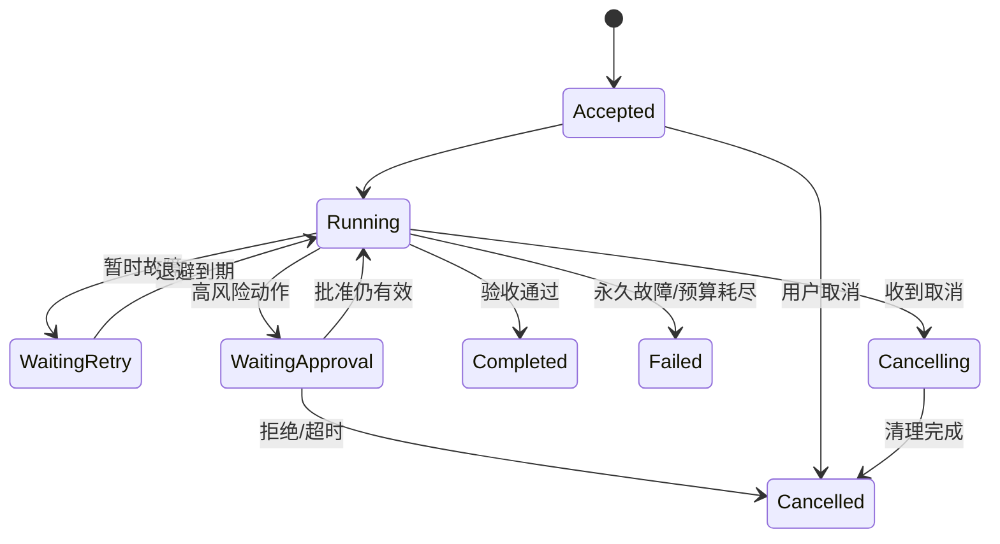

# Durable Execution：长任务不能靠“祈祷这次别断”

快递员送十个包裹，不会每送一个都只记在脑中。如果手机关机，他应能从配送记录知道哪件已签收、哪件仍在车上，而不是把十件重新送一遍。Agent 的长任务也是如此：模型调用、工具执行、人工审批和外部服务都可能在中途失败，系统必须知道“已经发生了什么”和“下一步还能安全做什么”。

Durable Execution（持久执行）不是让进程永不崩溃，而是让**任务在进程、节点或网络故障后，仍能从可信状态继续，并避免重复副作用**。

## 1. 先把任务写成状态机

一个最小长任务状态机可以是：



状态必须持久化到进程之外。若只存在内存里，节点重启后系统无法区分“从未开始”和“已经付款但响应丢失”。

## 2. 幂等：重复请求的效果像执行一次

幂等不等于“接口返回内容永远相同”，而是相同逻辑操作被重复提交时，不会重复产生不希望的副作用。

例如任务要创建一份报告。Harness 为逻辑动作生成稳定键：

```text
idempotency_key = task-42/create-report/v1
```

工具侧可以维护：

```text
第一次收到键：记录 running → 创建报告 → 记录 succeeded + artifact_id
再次收到同一键：返回已有 artifact_id，不再创建第二份
```

关键难点是“相同逻辑操作”怎样定义。若参数或输入版本变化，就不应复用旧结果；可以把请求摘要纳入记录并在冲突时拒绝。

### 一个数字例子

假设 1,000 个任务各执行一次有副作用的动作，网络超时率为 2%。如果超时一律盲目重试一次，约 20 个动作面临重复执行风险。幂等键不能消除超时，却能把“重试是否重复副作用”从概率问题变成协议问题。

## 3. 重试：只对正确的错误，在正确的位置重试

错误可以粗分为：

| 类型 | 例子 | 策略 |
|---|---|---|
| 输入错误 | 参数缺失、路径非法 | 不重试，修正请求 |
| 权限错误 | 身份无权访问 | 不自动重试，申请授权或停止 |
| 暂时故障 | 限流、短暂网络中断 | 有预算地退避重试 |
| 未知提交状态 | 请求超时，服务端可能已成功 | 先按幂等键查询状态 |
| 永久业务失败 | 余额不足、资源不存在 | 记录并重规划 |

常用退避可直觉表示为：

```text
第 n 次等待 ≈ min(上限, 基础等待 × 2^n) + 随机抖动
```

若 1,000 个任务同时失败，固定 1 秒后重试会再次制造 1,000 请求尖峰；随机抖动把请求摊开。还应有**重试预算**，例如每 100 个初始请求最多允许 10 个额外重试，否则下游已经故障时，重试会放大事故。

重试层级也要唯一。若 SDK、工具适配器、Harness 和工作流都**最多总尝试 3 次（初次 + 2 次重试）**，最坏可能尝试 `3 × 3 × 3 × 3 = 81` 次。若说的是“初次之外再重试 3 次”，则每层共 4 次，四层最坏是 256 次。

## 4. Checkpoint 保存什么

Checkpoint（检查点）应保存恢复所需的最小确定状态，例如：

- 任务和工作流版本；
- 已完成、运行中、待执行的步骤；
- 输入和 artifact 的内容地址或版本；
- 已提交副作用的幂等键及结果；
- 剩余预算、截止时间和取消状态；
- 事件日志读取位置；
- 必要的沙箱工作区快照引用。

不应把“模型上一轮写的一段总结”当成唯一 checkpoint。自然语言摘要可能遗漏精确状态；可恢复数据要结构化。

### Checkpoint 与外部副作用的一致性

最危险的窗口是：

```text
外部付款成功
  → 本地 checkpoint 尚未写入
  → 节点崩溃
  → 恢复后以为没付，再付一次
```

无法与外部系统做原子事务时，可采用稳定操作 ID、外部查询、outbox/inbox、补偿动作或人工对账。目标不是假装获得“恰好一次”魔法，而是让重复和不确定状态可检测、可收敛。

## 5. 事件日志：解释“为什么来到当前状态”

快照回答“现在是什么”，追加事件日志回答“怎样变成这样”。事件示例：

```text
0001 TaskAccepted
0002 SandboxCreated(image_digest=...)
0003 StepStarted(step=S1, attempt=1)
0004 ToolTimedOut(idempotency_key=...)
0005 ToolStatusConfirmed(result=success)
0006 StepCompleted(step=S1, artifact=...)
0007 ApprovalRequested(action_digest=...)
```

事件应有任务 ID、步骤 ID、尝试次数、时间、主体、输入/输出引用和追踪关联。敏感内容不能无脑写进日志；可保存脱敏摘要或加密 artifact 引用。

仅有日志也不够：日志顺序、重复投递、保留期和 schema 演进都要定义。回放逻辑必须能识别重复事件。

## 6. 取消不是把状态改成红色

取消分两步：

1. **协作取消**：通知模型调用、工具和子 Agent 停止，允许释放资源和写最终状态。
2. **强制回收**：超过宽限期后终止进程、断网、卸载卷并销毁沙箱。

取消还要沿任务树传播。父任务取消，默认应阻止新子任务，并处理仍在运行的后代。已经发生的外部动作不能靠“取消”自动撤销；需要补偿或人工处理。

例如订票流程已扣款但未出票，取消任务时要进入 `compensation_pending`，而不是直接标记 `cancelled` 后遗忘余额。

## 7. 人工审批是一种协议

高风险动作可进入 `WaitingApproval`。审批请求应绑定：

- 要执行的确切动作和参数摘要；
- 输入、工作区和策略版本；
- 风险解释和预计影响；
- 审批人身份与权限；
- 过期时间；
- 批准后允许执行几次。

若审批后参数发生变化，旧批准应失效。不能让人批准“删除这 3 个文件”，执行时却扩大成 300 个文件。

一个安全流程是：生成不可变动作摘要 → 人批准摘要 → 执行前重新计算并比对 → 使用一次性批准令牌 → 记录结果。

## 8. 工作流和环境版本

任务等待两天后恢复时，代码、工具或镜像可能已升级。恢复策略必须明确：

- 使用原工作流版本继续；
- 迁移状态到新版本；
- 因不兼容而停止并人工处理。

“直接用最新代码继续”可能让旧 checkpoint 的字段语义改变。镜像最好用不可变 digest 引用；工具和策略也要版本化。

## 9. 失败路径

### 9.1 Checkpoint 风暴

10,000 个任务每秒各写一次 100 KiB checkpoint，写入量约为 `10,000 × 100 KiB/s ≈ 0.95 GiB/s`，还没算副本和元数据。应按风险和状态变化选择增量、合并与频率，而非每个 token 都全量快照。

### 9.2 重试风暴

节点故障让大量任务同时超时，统一退避又在同一时刻重试。需要抖动、全局并发限制、优先级和下游健康门控。

### 9.3 幽灵任务

控制面认为任务失败并重新调度，旧 worker 实际仍在运行。租约、fencing token 或代际编号可以阻止旧实例继续提交结果。

### 9.4 审批对象漂移

人批准后工作区变化，动作含义已不同。审批必须绑定内容摘要和版本，执行时复核。

### 9.5 取消后仍有副作用

终止本地进程不能撤销已经发出的请求。必须查询外部状态，并进入补偿或人工对账流程。

## 10. DeepSeek Agent Infra 面试怎么问

### 典型问题

> 一个 Agent 工具调用超时，怎么安全重试？

### 30 秒答法

> 我先区分“服务端未执行”和“已执行但响应丢失”，超时本身不能说明状态。对副作用动作使用稳定幂等键，重试前先查询已有结果；错误分类后只对暂时故障做带抖动退避，并设置单一重试层和总预算。工作流把操作 ID、尝试次数和结果写入事件日志与 checkpoint。若状态仍未知，就停止自动重试，进入对账或人工处理，而不是冒险重复执行。

### 常见追问

- 幂等键保存多久？参数变化但键相同怎么办？
- “至少一次”“至多一次”和业务上的“效果一次”怎样区别？
- 父任务取消时，正在审批和正在运行的子任务怎么处理？
- checkpoint 与沙箱文件系统快照怎样保持一致？
- 旧 worker 复活后怎样阻止它覆盖新结果？

## 11. 本章速记

- Durable Execution 允许进程失败，但任务状态必须可恢复。
- 状态机要显式包含等待重试、等待审批、取消和失败。
- 幂等把重复副作用风险变成协议问题；超时不代表没执行。
- 重试要分类、退避、加抖动、有预算，并避免多层相乘。
- Checkpoint 保存确定状态，事件日志保存因果历史。
- 取消不能撤销外部事实；必要时需要补偿和人工对账。
- 审批绑定确切动作和版本，动作变化就应重新审批。

## 12. 一手资料

- [DeepSeek：Agent 后端方向招聘](https://app.mokahr.com/social-recruitment/high-flyer/140576#/job/2eb2e75d-29f3-47b5-bb10-39f12547d398)
- [RFC 9110：HTTP 的幂等方法语义](https://www.rfc-editor.org/rfc/rfc9110)
- [Amazon Builders' Library：Timeouts, Retries and Backoff with Jitter](https://aws.amazon.com/builders-library/timeouts-retries-and-backoff-with-jitter/)
- [Stripe：Idempotent Requests](https://docs.stripe.com/api/idempotent_requests)
- [OpenTelemetry：Tracing Specification](https://opentelemetry.io/docs/specs/otel/trace/)
