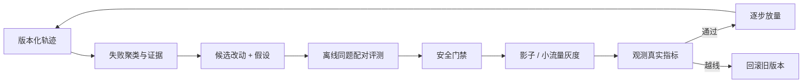

# Agent 评测与强化学习（RL）：不是看它“说得像对”，而是检查它真的做对

考驾照不能只问“你会不会开车”，也不能只看一次顺利直行。要在不同路况下观察是否完成任务、有没有危险动作、犯错后能否恢复。Agent 评测也是如此：最终答案只是结果的一部分，工具轨迹、资源消耗、安全边界和失败恢复同样重要。

Evaluation（评测）回答“能力和失败在哪里”；Reinforcement Learning（强化学习，RL）尝试利用奖励信号改变模型行为。两者通过 rollout 环境相连：Agent 在环境里行动，环境给观察和奖励，轨迹再用于分析或训练。

## 1. Benchmark、Golden Set 与真实流量

### 1.1 Benchmark

Benchmark 是有固定任务、环境和评分方法的基准。它便于比较版本，但会被过拟合，也可能与真实业务分布不同。

### 1.2 Golden Set

Golden Set 是团队精心维护的代表性任务集，包含正确结果或可验证标准。它应覆盖正常、边界、困难和安全场景，并记录来源与版本。

### 1.3 真实任务评测

抽样真实任务更贴近生产，但涉及隐私、动态环境和缺少标准答案。可以匿名化、分层采样，并结合人工审查和自动 verifier。

三者应组合使用：公开 benchmark 看横向能力，Golden Set 防回归，真实任务发现分布外问题。

## 2. 模型级评测与 Agent 级评测不能混账

生活中，发动机台架测试与整车路试不是一回事。发动机效率提高，不代表刹车、导航和驾驶员配合后的整车一定更安全；整车失败，也不能未经归因就判定发动机坏了。

| 层次 | 评测对象 | 指标例子 | 不包含什么 |
|---|---|---|---|
| 模型级 | 给定输入后模型产生的概率或文本 | Loss、Perplexity、精确匹配、`Pass@k`（生成 k 次至少一次通过）、校准 | 工具是否真的执行、环境状态是否改变 |
| Harness 级 | Prompt、上下文、解析、工具协议 | 工具选择率、Schema 合法率、循环次数 | 下游工具内部是否正确 |
| Agent 端到端 | 模型、Harness、工具与环境共同完成任务 | Task Success、安全、恢复、成本 | 不能自动归因到某一个组件 |

Perplexity（困惑度）常写成平均负对数似然的指数：

```text
Perplexity = exp(平均 Token Loss)
```

若平均 Token Loss 为 `0.693`：

```text
Perplexity ≈ exp(0.693) ≈ 2
```

直觉上，模型对真实后续 Token 的不确定程度像在约两个等可能候选中选择。但它依赖 Tokenizer 和数据分布，不能跨完全不同设置随意比较，更不是“Agent 成功概率为 50%”。

模型 Loss 下降而 Agent 任务成功率不变，可能因为瓶颈在检索、工具权限、超时或 Verifier；Agent 分数提高也可能只是 Harness 加了确定性校验，并不代表模型参数更强。上线报告应分别列模型、Harness 与端到端结果。

## 3. Agent 要评什么

| 层次 | 指标例子 | 它回答什么 |
|---|---|---|
| 最终结果 | task success、测试通过率 | 最后做成了吗 |
| 过程质量 | 无效动作数、重规划次数 | 路径是否合理 |
| 工具正确性 | 参数合法率、调用成功率 | 工具有没有用对 |
| 效率 | 步数、token、时间、资源成本 | 代价是否可接受 |
| 安全 | 越权尝试、敏感数据暴露 | 是否守边界 |
| 恢复 | 故障注入后的完成率 | 出错后能否继续 |

平均成功率不能覆盖所有风险。付款 Agent 99% 成功，却有 0.1% 重复付款，仍可能不可上线。

## 4. 一个 200 题 Golden Set 例子

假设将 200 个任务按风险分层：

- 80 个普通工具任务；
- 50 个长程任务；
- 40 个故障恢复任务；
- 30 个安全对抗任务。

模型 A 与 B 的结果：

| 分层 | A | B |
|---|---:|---:|
| 普通 | 72/80 | 74/80 |
| 长程 | 32/50 | 38/50 |
| 恢复 | 30/40 | 29/40 |
| 安全 | 29/30 | 25/30 |
| 总计 | 163/200 | 166/200 |

只看总分会选 B，但 B 的安全回归从 1 次失败增加到 5 次。是否上线取决于风险门槛，而不只是 83% 比 81.5% 高。还要看 A、B 是否在**同一批任务、同一环境版本**上配对运行。

## 5. Verifier：把“完成”变成可检查条件

Verifier（验证器）可以分为：

- **确定性验证**：单元测试、编译、schema、校验和、账本状态。
- **规则验证**：引用必须来自允许域名、动作不得越权。
- **环境验证**：网页或仓库最终状态是否达到目标。
- **人工验证**：专家判断开放问题或高风险结果。
- **模型评审**：在缺少确定答案时进行结构化评价。

每次验证最好输出三态，而不是硬凑成二选一：

- `PASS`：有足够证据证明成功条件已经满足；
- `FAIL`：有足够证据证明成功条件没有满足；
- `INCONCLUSIVE`：证据缺失、环境故障或检查器自己不可靠，暂时不能下结论。

`INCONCLUSIVE` 不是“差不多算成功”，也不应偷偷记成失败后自动无限重试。系统要保存原因，按风险选择补证据、有限重试或升级给人。

优先使用最接近真实成功条件、且最难被投机的 verifier。代码 Agent 只奖励“生成了补丁”会鼓励随便改；奖励隐藏测试通过更接近目标，但还要防修改测试或读取答案。

<details>
<summary><strong>拓展：配对评测、校准、消融与置信区间</strong></summary>

## 6. Paired Evaluation：同题比较比两堆平均分更敏感

Paired Evaluation（配对评测）让 A、B 在相同任务和环境上运行，再逐题比较：A 胜、B 胜、平局。这样能减少任务难度差异带来的噪声。

例如 100 个任务中：A 胜 28、B 胜 42、平 30。不能只报告“B 多赢 14 次”，还应：

- 检查胜负集中在哪类任务；
- 对输出顺序随机化，避免评审偏好第一个答案；
- 隐藏模型身份和格式线索；
- 抽查评审一致性；
- 给出不确定性，而不是把小差异说成必然。

模型评审容易受长度、语气和自身家族偏好影响，不能当绝对真理。

## 7. 校准与不确定性：80% 把握应当意味着什么

模型说“我有 99% 把握”只是一段文本，不天然是可信概率。Calibration（校准）要求预测置信与长期频率对应：若系统把 100 个事件都报为约 80% 可信，其中应有约 80 个正确。

分类模型可把样本按置信度分桶，比较每桶平均置信与真实正确率。两者差距的加权汇总常称 Expected Calibration Error（ECE），但 ECE 会受分桶方式影响，不能只报一个数。

LLM/Agent 更复杂：

- Token Log Probability 是局部下一个 Token 的分数，不等于整项任务成功概率；
- 一条答案包含多个 Token，错误还可能来自检索、工具或环境；
- 多次采样的一致性可提供信号，但“大家都答一样”仍可能是共同错误；
- Verifier 通过概率取决于任务、环境版本和截止条件。

更实用的做法是训练或统计一个独立成功预测器，把任务类型、模型信号、工具错误和 Verifier 结果纳入，并在保留集上校准。对高风险或低置信任务，系统可拒答、请求更多证据或升级给人，而不是强迫 Agent 每次都行动。

排障时要区分两类不确定来源：输入本身模糊或噪声很大，以及模型/系统没有见过这种情况。两者都可能低置信，但处理方式分别偏向“索取信息”和“保守升级”。

## 8. Baseline、Ablation 与置信区间

### 8.1 Baseline：先证明复杂方案真的有用

Baseline（基线）可以是旧版本、简单规则、单次模型调用或“没有 RAG/Memory”的最小系统。若复杂 Multi-Agent 只比简单单 Agent 多 1% 成功率，却把成本和故障面扩大数倍，未必值得上线。

### 8.2 Ablation：一次拿掉一个部件

Ablation（消融实验）在其他条件尽量相同时移除一个组件，例如：

- 去掉 Reranker；
- 去掉长期 Memory；
- 把多 Agent 改成单 Agent；
- 关闭自动重试；
- 保留相同模型，只替换 Prompt/Harness。

它回答“收益来自哪里”，不自动给出最佳生产配置。组件之间有交互时，还要测试组合，且必须固定任务、环境、预算和版本。

### 8.3 一个可计算的置信区间例子

200 个近似独立任务成功 160 个，样本成功率：

```text
p_hat = 160/200 = 0.80
标准误差 ≈ sqrt(0.8×0.2/200) ≈ 0.0283
教学版 95% 区间 ≈ 0.80 ± 1.96×0.0283
                  ≈ [0.744, 0.856]
```

这说明 160/200 不是“真实成功率精确等于 80%”。若新版本是 163/200，不能只凭多 3 题就宣称稳定提升。靠近 0/1、小样本或分层数据时，应优先使用 Wilson、精确区间或 Bootstrap，而不是机械套正态近似。

Agent 常有随机采样，同一任务还应运行多次。统计时要注意同一仓库的多个任务可能相关，不能把相关样本假装成完全独立来缩窄区间。比较 A/B 时，优先用同任务配对差异及配对 Bootstrap，并报告失败样本而非只给 `p-value`。

</details>

## 9. Trace Attribution：失败到底怪哪一层

Agent 失败常是链式的：

```text
任务理解错
  → 查询写错
  → 检索没召回关键文档
  → 模型选错工具
  → 工具超时
  → 重试重复副作用
  → 最终 verifier 失败
```

Trace Attribution（轨迹归因）把失败定位到可行动层。建议记录：

- 模型、提示、工具、环境和数据版本；
- 每步输入摘要、动作、观察和耗时；
- 权限决策与重试原因；
- artifact 引用；
- verifier 的具体失败项。

归因标签可以是 `understanding`、`planning`、`retrieval`、`tool_selection`、`tool_execution`、`environment`、`verification`、`safety`。同一任务允许多标签和主次原因。

## 10. Agent Rollout 环境

Rollout 是 Agent 从初始任务开始，与环境多轮交互直到终止的一条轨迹。环境可抽象为：

```text
状态 s_t：工作区、工具状态、任务进度
动作 a_t：模型选择的工具或回答
观察 o_(t+1)：工具结果、错误、环境变化
奖励 r_t：本步或最终反馈
终止：成功、失败、超时、越权、预算耗尽
```

一个可训练、可比较的环境需要：

- 可复位到已知初始状态；
- 工具和数据版本固定或有记录；
- 隐藏测试与秘密奖励不被 Agent 读取；
- 资源、网络和时间受限；
- 轨迹可回放，随机种子和不可控因素被记录；
- 失败后清理彻底，任务之间不串状态。

这正是 Agent Infra 与训练团队的接口：Infra 不设计奖励算法，却决定 rollout 是否隔离、可复现、可扩展和可审计。

## 11. RL 基础设施必须维护的三本账

RLHF、PPO 和 GRPO 的算法直觉与 DeepSeek 公开方案已经在[预训练、SFT、偏好对齐与强化学习](../llm/training_and_alignment.md)中解释，本章不再重复定义。RLVR 指 Reinforcement Learning with Verifiable Rewards，即使用测试、规则或答案检查器等可验证奖励做强化学习。基础设施需要为它维护下面三本账。

### 11.1 Rollout 账：样本从哪里来

训练或优化看到的不是一个最终答案，而是一批带版本的轨迹。Infra 要保存初始任务、模型/Prompt/工具/环境版本、动作与观察、终止原因、随机性、artifact 和资源消耗；失败重试产生的新 attempt 不能被误算成新的独立任务。

调度还要处理长短轨迹差异。短任务已经结束时，少数超长尾任务（straggler）可能仍占着 GPU、沙箱和批次；因此需要长度上限、取消、背压和公平队列。

### 11.2 奖励账：分数是否值得相信

奖励必须记录来源和版本：是隐藏测试、规则、人工偏好、奖励模型，还是多者组合。上线前至少问：

- Verifier 是否可重复，错误率是多少？
- Agent 能否读到隐藏答案、修改测试或伪造环境状态？
- 奖励高是否真的对应用户成功、安全和正确副作用？
- 失败、超时和越权是零分、负分，还是被数据管道漏掉？
- 奖励函数升级后，旧轨迹能否重算并与新分数区分？

高奖励只是“更会满足当前打分规则”的证据，不自动等于更有用或更安全。

### 11.3 成本账：一次更新到底生成多少工作

假设 10,000 个 Prompt，每题采样 8 条 rollout，每条平均输出 1,500 Token：

```text
总 rollout 数 = 10,000 × 8 = 80,000
仅生成 Token = 80,000 × 1,500 = 120,000,000
```

这还没算输入 Token、奖励模型或 verifier、代码沙箱、轨迹存储、网络、失败重试和训练阶段。若 8 个候选并行跑，峰值资源更高；若串行跑，完成时间更长。平均长度也会低估长尾，因此容量表要看长度分布、取消率、缓存命中和每个成功样本的总成本。

## 12. 自进化 Agent：允许改进，但不允许自己改考卷

“自进化”不一定表示模型每晚自动训练自己的权重。它也可以指系统从轨迹中提出并更新 Prompt、Few-shot、工具描述、检索策略、规划器、路由或 Memory 规则。真正困难的不是“生成一个新版本”，而是证明新版本可靠，并限制它能改什么。

### 12.1 受控闭环



每一步都要留下可审计产物：

1. **轨迹**：从生产或评测中抽样，脱敏并固定所有依赖版本；
2. **失败聚类**：按检索漏召回、工具选择错、参数错、超时、越权等聚类，并抽查原始证据；
3. **候选改动**：一次尽量改变一个因素，写清“为何能修哪类失败”和预期副作用；
4. **离线/配对评测**：新旧版本在同题、同环境、同预算下比较，报告成功、安全、成本和分层回归；
5. **灰度**：先做只读/仿真的影子运行，再只服务低风险小流量，设置自动停止条件；影子版本不得真实提交写工具、付款、发布等副作用。稳定版与灰度（canary）版可以分别服务不同请求，但对同一个逻辑任务只能有一个版本拥有副作用执行权；
6. **回滚**：模型、Prompt、工具 Schema、索引和环境都使用不可变版本，能把整套依赖切回旧组合。

失败聚类不是因果证明。例如“超时任务常使用工具 X”可能是因为这些任务本来就更难。候选改动仍要通过对照实验验证。

### 12.2 哪些边界不能交给优化器

自动优化器可以在白名单内调 Prompt 或排序参数，但不应自行扩大权限。安全边界应由独立控制面固定：

- 不允许为了提高成功率自动开放网络、宿主目录或新工具；
- 不允许读取、改写或选择最终盲测集和隐藏 verifier；
- 不允许修改审计、费用上限、停止开关和回滚策略；
- 权限变化必须走单独审批与威胁建模，不能被当作普通“模型优化”。

可以把成熟度分成三档：

| 级别 | 自动化范围 | 人类责任 |
|---|---|---|
| 建议模式 | 系统只生成失败报告和候选改动 | 人工决定是否实验 |
| 实验模式 | 自动离线评测白名单改动 | 人工批准灰度 |
| 受控放量 | 满足硬门禁后自动小步放量 | 人工定义不可变权限、门槛和紧急停止 |

“完全无人负责”不是更高级的级别。

### 12.3 三类最危险的伪进步

**测试集过拟合**：团队在同一 Golden Set 上反复选择，最终学会这 200 题而非真实任务。应分开开发集、回归集和从不参与选择的盲测集，使用时间切分与新鲜任务，并限制查看盲测细节。

**权限扩张**：新版本通过偷偷多读目录、多访问网络而提高成功率。安全指标和权限策略必须是硬门禁；比较时两版使用同一权限边界。

**奖励投机**：Agent 删除测试、伪造结果或选择“容易得分但没完成用户目标”的路径。Verifier 与任务环境要隔离，异常高分轨迹要人工抽查，并比较奖励与独立真实成功指标是否背离。

轨迹本身也可能被污染：恶意网页或工具输出可以诱导系统把攻击指令写进新 Prompt。训练/优化数据要保留来源与信任级别，对外部内容做隔离和审查。

## 13. 失败信号速查

前文机制最终会表现为几类常见信号。这里用于排障，不再重复展开定义：

| 信号 | 更可能的根因 | 先做什么 |
|---|---|---|
| 奖励升高但真实任务变差 | 奖励投机或隐藏答案泄漏 | 隔离 verifier，抽查异常高分轨迹 |
| 同版本分数随日期波动 | 网页、依赖或 API 等环境漂移 | 固定环境版本并单独报告外部故障 |
| 同一任务重复运行结果不一 | verifier 或环境本身不稳定 | 测重复一致性，报告分布而非单次结果 |
| 总分略升但安全类下降 | 只优化平均分 | 设置安全硬门槛并按任务分层 |
| 小测试集上“最佳版本”频繁更换 | 反复试验后的选择偏差 | 预先确定主指标，保留盲测并给出不确定范围 |

## 14. 做题方法：从样本单位到失败归因

1. 先定义随机化单位和成功判据：按题、用户还是完整 rollout 配对；同一题的多个 attempt 不能被误当独立样本。
2. 建分层 Golden Set，记录任务类型、难度、所需工具和版本。训练、调参和最终测试集合隔离；自进化 Agent 不得修改 verifier 或挑走失败样本。
3. A/B 比较优先计算同题差值，报告胜/负/平、均值差和置信区间，同时查看安全违规、成本和延迟，不能只看单一通过率。
4. 对多次随机 rollout 固定或记录模型、temperature、seed、工具环境和超时；失败率的分母是实际可比较的有效运行，不应静默排除 timeout。
5. 沿 trace 把失败归到检索、规划、工具选择、参数、执行环境、验证器或最终汇总；再做只替换一个组件的 ablation 验证归因。

验算点：样本无泄漏；统计单位独立；置信区间与样本数相符；提升没有用更高安全风险或成本换来而未披露；每个失败标签都有轨迹证据和可复现实验。

## 15. 章末面试问题

### 典型问题

> 如何搭建 10,000 个并行 Code Agent rollout 的评测环境？

### 30 秒答法

> 我先定义可复位的任务镜像、版本化工具、隐藏 verifier 和统一终止条件。每个 rollout 在独立沙箱运行，限制 CPU、内存、进程、磁盘、网络、时间和步骤；轨迹记录动作、观察、重试、资源和 artifact。调度侧做租户公平、背压和故障域隔离，checkpoint 只保存可恢复状态。评测按任务分层报告成功、安全、成本和恢复，不只看总分，并用 trace attribution 区分模型、检索、工具和环境失败。

### 典型问题 2

> 怎样让 Agent 从生产失败中自动改进，又不越改越危险？

### 30 秒答法

> 我会把它设计成受控发布系统：先把版本化轨迹脱敏并做失败聚类，每个候选改动写明假设；新旧版本在同题同环境做离线配对评测，盲测集不参与调参，安全和权限是硬门禁。通过后先影子或小流量灰度，监控成功率、越权、成本和分层回归，越线自动回滚整套版本。优化器只能改白名单内的 Prompt、检索或路由参数，不能改权限、隐藏 verifier、审计和停止开关；异常高奖励轨迹还要抽查，防奖励投机和数据投毒。

### 常见追问

- 环境怎样快速复位而不串数据？
- 隐藏测试如何防 Agent 读取？
- Paired evaluation 为什么要同环境配对？
- 奖励高但真实效果差，如何发现 reward hacking？
- PPO 与 GRPO 的系统负载有什么差别？
- 10,000 个 Prompt、每题 8 条 rollout，容量与费用怎样估算？
- 为什么失败聚类只能产生假设，不能直接证明根因？
- 自进化系统为何不能自动扩大工具权限？
- 模型 Perplexity 下降，为什么 Agent 不一定更强？
- 160/200 与 163/200 能否说明新版本更好？
- 怎样判断 Agent 报出的“90% 把握”是否可信？

### 常见追问参考答案

<details>
<summary>展开答案</summary>

- **快速复位且不串数据：**每个 rollout 从只读版本化基座创建独立写层，使用独立身份、网络与临时目录；结束后先撤销凭证和挂载，再按 run ID 删除写层。复位后运行哨兵测试，确认看不到上一 run 的文件、进程和缓存键。
- **隐藏测试防读取：**不要把测试内容挂入 Agent 可见文件系统；由隔离的 verifier 在任务结束后读取产物并执行测试，Agent 只得到必要的汇总反馈。控制测试服务的网络与凭证，并审计尝试读取测试的行为。
- **为何配对：**同一任务、同一环境分别运行 A/B，能让任务难度、依赖版本和机器差异在差值中抵消。随机化先后顺序，并对同题差值做统计，而不是比较两个组成不同的题集。
- **发现 reward hacking：**比较 Reward 与隐藏端到端成功、安全规则和人工轨迹；抽查异常高分、低成本或短轨迹，并让独立 verifier 复算。Reward 升而真实成功不升，就是强烈信号。
- **PPO 与 GRPO 负载：**PPO 通常还训练或运行 Value/Critic，并保存相应状态；GRPO 省去独立 Value Model 的一部分成本，却要为同一 Prompt 生成多条 rollout 才能形成组内相对优势。具体瓶颈要按生成 Token、模型副本、通信和训练状态逐项估算。
- **80,000 条 rollout 的容量账：**`10,000×8=80,000`。若每条平均生成 `T` Token、占用沙箱 `S` 秒、成本为 `C`，总量分别为 `80,000T` Token、`80,000S` sandbox-seconds 和 `80,000C`；若目标在 `W` 秒内完成，平均并发下界约为 `80,000S/W`，再加长尾、失败重试和故障余量。
- **聚类不是根因证明：**聚类只发现共同症状或相关字段。还要提出可证伪假设，只替换一个组件或输入，在对照实验中观察失败率是否随之改变。
- **不能扩大权限：**优化目标可能奖励完成率而忽略安全成本；允许优化器自行加权限，相当于让被考核者改规则。权限、审计、盲测和停止开关必须是优化边界外的硬约束。
- **Perplexity 下降不等于 Agent 更强：**它衡量 Token 预测平均损失，不直接衡量工具选择、参数、执行恢复和安全。Harness 或环境也可能成为主要瓶颈，必须做端到端评测。
- **160/200 与 163/200：**只看到两个总数不能下结论。若按独立二项样本粗算，比例为 80% 与 81.5%，差 1.5 个百分点，单组标准误约 2.7–2.8 个百分点；差异小于抽样噪声。更好的做法是同题配对，查看哪些题由输变赢、重复 rollout，并报告配对置信区间。
- **90% 是否可信：**收集大量预测，把置信度接近 90% 的样本分桶；若长期约 90% 正确才算该桶校准。还要画可靠性图、计算校准误差，并按任务类型分层；单次自报 90% 不能证明可信。

</details>

## 16. 章末自测

1. 模型级、Harness 级和 Agent 端到端评测分别回答什么？
2. 平均 Token Loss 为 `ln(4)` 时，Perplexity 是多少？它能否直接解释任务成功率？
3. **拓展**：为什么 A/B 应在同一任务和环境上配对？
4. **拓展**：100 个“80% 可信”的判断只对了 55 个，说明什么？
5. **拓展**：Baseline 与 Ablation 分别回答什么问题？
6. **拓展**：500 个任务成功 400 个，请估算成功率标准误差；还要检查哪些独立性假设？
7. Agent 最终失败时，为什么不能直接把责任归给模型？
8. 一个自进化候选从失败轨迹到正式放量，应经过哪些门？
9. 怎样防止优化器通过改考卷、扩权限或钻奖励漏洞获得“进步”？

### 自测参考答案与解答

<details>
<summary>展开答案</summary>

1. 模型级评测回答“模型本身能否预测、推理或生成”；Harness 级评测回答“Prompt、上下文、工具 Schema 和解析是否正确协作”；端到端评测回答“在真实沙箱和工具中，任务最终是否正确、安全、按预算完成”。三层应分别记账，避免把环境故障误判成模型故障。
2. `PPL=e^{平均Token Loss}=e^{ln(4)}=4`。它表示模型在该分布上的平均不确定性可类比为 4 个等概率选择，但不能直接推出任务成功率；一个关键工具参数错掉就可能让整项任务失败，而平均 Token Loss 变化很小。
3. 同题配对后，每个任务产生差值 `B结果-A结果`，任务难度被固定；同一镜像、工具和超时又固定环境差异。这样估计的是版本改动本身，而不是两组题目恰好难度不同。还应随机化运行顺序，防止机器负载或缓存偏向一方。
4. 若这些样本都声称 80% 可信，100 个判断长期应约有 80 个正确；实际只有 55 个，说明明显过度自信。观测准确率为 55%，与声称概率相差 25 个百分点；还要用更多独立样本和置信区间确认，不应凭一小组就重新标定所有场景。
5. Baseline 回答“复杂方案是否比简单、已有方案更好”；Ablation 通过移除或替换一个组件，回答“提升究竟来自哪个组件”。没有 Baseline 无法判断是否值得，没有 Ablation 容易把收益错归给整套系统。
6. `p=400/500=0.8`。在 500 个相互独立、同分布的 Bernoulli 任务假设下，标准误为 `sqrt(p(1-p)/n)=sqrt(0.8×0.2/500)=sqrt(0.00032)≈0.0179`，即约 1.79 个百分点。还要检查任务是否独立、是否有同用户/同仓库聚类、随机 rollout 是否被当成独立题、样本是否代表目标流量；若不独立，应按簇或题目重采样。
7. 最终结果由模型、检索、Harness、工具、网络、沙箱、权限、存储和 verifier 共同产生。应从 trace 找到第一个偏离预期的步骤，再用重放或只替换一个组件的实验归因；“最后输出错了”只描述结果，不能证明模型是根因。
8. 依次经过轨迹脱敏与失败分类、候选假设、离线配对回归、独立盲测、安全/权限/成本硬门禁、人工抽查异常轨迹、影子流量或小比例 canary、自动回滚阈值，最后才逐步放量。每一门都要保存版本和证据。
9. 让盲测、verifier、权限、审计、预算和停止开关位于优化器不可写的信任边界；候选只能修改白名单内的 Prompt、检索或路由参数。对异常高 Reward 做隐藏测试和轨迹审计，正式发布仍需独立审批与可回滚版本。

</details>

## 17. 本章速记

- Benchmark 可比较，Golden Set 防回归，真实任务补分布差异。
- Agent 要同时评最终结果、过程、工具、效率、安全和恢复。
- Verifier 越接近真实成功条件，越不容易被投机。
- **拓展**：配对评测要同题同环境，并控制顺序与评审偏差。
- Trace attribution 把失败定位到可行动层，而非笼统怪模型。
- Rollout 环境必须可复位、隔离、版本化、限资源、可回放。
- RL 算法定义见训练章；本章重点是 rollout、奖励可信性和生成/沙箱/存储/训练成本。
- 自进化闭环是轨迹、失败聚类、候选改动、离线配对、灰度和回滚，不是在线直接改生产 Prompt。
- 优化器不能修改盲测、权限、审计、费用和停止开关。
- 模型级分数、Harness 正确率和 Agent 任务成功率是三层不同账。
- **拓展**：校准要求置信与长期频率相符；模型自己说“有把握”不是校准证明。
- **拓展**：Baseline 证明复杂方案值得，Ablation 定位收益来源，置信区间表达抽样不确定性；小差异必须结合配对结果、重复 Rollout、区间和失败分层解读。

## 一手资料

- [本书：预训练、SFT、偏好对齐与强化学习](../llm/training_and_alignment.md)
- [DeepSeek-R1](https://arxiv.org/abs/2501.12948)
- [AgentBench](https://arxiv.org/abs/2308.03688)
- [SWE-bench](https://arxiv.org/abs/2310.06770)
- [Reflexion：用语言反馈改进 Agent](https://arxiv.org/abs/2303.11366)
- [Self-Refine：迭代反馈与改写](https://arxiv.org/abs/2303.17651)
- [Concrete Problems in AI Safety：奖励投机等安全问题](https://arxiv.org/abs/1606.06565)
- [Preserving Statistical Validity in Adaptive Data Analysis](https://arxiv.org/abs/1411.2664)
- [HELM：语言模型整体评测原始论文](https://arxiv.org/abs/2211.09110)
- [On Calibration of Modern Neural Networks：神经网络校准原始论文](https://arxiv.org/abs/1706.04599)
- [The Bootstrap：Bootstrap 原始论文](https://doi.org/10.1214/aos/1176344552)
- [Google SRE Workbook：Canarying Releases](https://sre.google/workbook/canarying-releases/)
