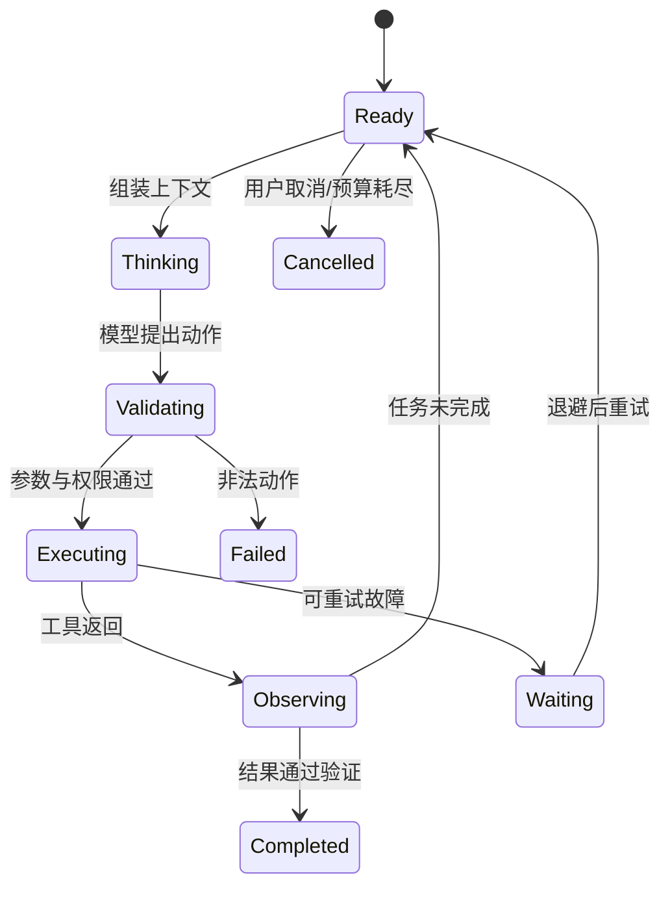

# Model + Harness = Agent：先把“模型”和“能做事的系统”分开

把大语言模型想成一个很聪明、但坐在空房间里的人。你问它问题，它能生成文字；可它没有钥匙、电话、日历，也不会自动记住上次关机前做到哪里。Harness 像工作台和操作规程：把任务交给它，准备上下文，允许它使用有限工具，记录每一步，在失败时重试或请人确认。

这组职责常被概括成：

```text
Model + Harness = Agent
```

这里不是数学等式，而是职责边界。**模型负责根据输入预测接下来应该输出什么；Harness 负责把多次模型调用、状态和现实动作组织成可控过程。**

## 1. 三层工程，不是一种“提示词技巧”

### 1.1 Prompt Engineering

Prompt Engineering（提示词工程）关注某次模型调用中怎样写清任务、约束和输出要求。例如：“只返回一个风险等级，并给出证据编号。”

它解决的是“这一次怎样问”，不能独自解决长期状态、工具权限、网络超时和恢复。

### 1.2 Context Engineering

Context Engineering（上下文工程）决定每一轮到底给模型看什么：系统规则、当前目标、对话摘要、检索文档、工具结果、剩余预算等。上下文窗口有限，塞得越多不一定越好；无关信息会抢占注意力，也可能破坏前缀复用。

### 1.3 Harness Engineering

Harness Engineering 负责整个运行系统：

- 什么时候调用模型；
- 模型如何选择工具；
- 参数怎样验证、权限怎样检查；
- 结果怎样写回上下文；
- 何时停止、重试、取消或请人审批；
- 状态怎样持久化和恢复；
- 每一步怎样记录、评测和审计。

一句话区分：**Prompt 写好一句指令，Context 组织好模型看到的材料，Harness 管好整场工作。**

## 2. Prompt 工程要做成可回滚的闭环

Prompt 不是聊天框里的一段“玄学咒语”，而是 Agent 的一个版本化组件。一个生产 Prompt 包通常包含：

| 组件 | 作用 | 常见失败 |
|---|---|---|
| 指令模板 | 写清目标、边界和优先级 | 规则互相矛盾、模板变量漏填 |
| Few-shot（少量示例） | 演示输入、动作与期望格式 | 示例覆盖太窄，模型机械模仿错误细节 |
| 工具描述 | 告诉模型工具用途、参数和返回语义 | 名称相似、描述含糊、错误状态没区分 |
| 输出 Schema | 约束字段、类型和枚举 | 语法合法但业务语义错误 |

例如一个删除工具不能只写“删除文件”，至少要说明它操作的是沙箱内相对路径、是否递归、成功与“文件不存在”怎样区分。工具描述是给模型看的**协议说明**，真正的路径校验和授权仍由 Harness/Infra 执行。

结构化输出也有两道门：

1. **结构校验**：JSON 能否解析，字段和类型是否符合 Schema；
2. **语义校验**：路径是否在工作区、金额是否在审批额度内、引用 ID 是否真实存在。

结构不合法时可以让模型有限次修复；权限不通过时不能靠“再提示一次要守规矩”放行。**Prompt 永远不能替代鉴权、沙箱、配额和确定性验证。**

### 2.1 一次改动怎样安全上线

一个最小闭环是：

```text
提出假设
  -> 修改模板 / Few-shot / 工具描述 / Schema
  -> 固定版本并在离线数据集重放
  -> 与旧版本做同题配对评测
  -> 小流量灰度
  -> 指标越线则回滚
```

每条轨迹至少记录：模型版本、Prompt 版本、工具 Schema 版本、上下文组装器版本和采样参数。这里 Schema 指字段、类型和约束组成的结构契约。否则分数变化时，团队不知道到底改了什么。

数据集要分层覆盖普通任务、边界输入、工具错误、安全对抗和真实失败样本。不要只看“回答更顺口”，还应看：

- 输出 Schema 合法率；
- 正确工具选择率和参数语义正确率；
- 端到端任务成功率；
- 越权尝试和敏感数据暴露；
- Token、延迟、工具次数和费用；
- 旧版本能完成但新版本失败的回归样本。

若连续用同一测试集挑 Prompt，团队会逐渐把答案“调进测试集”。应保留未参与调参的盲测集，定期加入新鲜真实失败，并预先写明上线门槛。灰度时同时保留旧版本和一键回滚路径；Prompt 改动和代码改动一样需要变更记录。

## 3. LLM API 是无记忆的计算边界

从系统角度，一次 LLM API 调用可以抽象为：

```text
输入：规则 + 上下文 + 可用动作描述
输出：文本，或一个结构化动作建议
```

模型服务通常不会自动替你的业务保存任务记忆。所谓“连续对话”，往往是 Harness 在下一轮重新携带必要历史。不同供应商的字段会变化，所以应掌握稳定概念，而不是背某个 SDK 的字段名：

- 请求可能流式返回，也可能一次返回；
- 需要超时、限流和错误分类；
- 输出是非确定的，应校验而不能直接信任；
- 模型版本和提示版本要进入审计记录；
- 敏感信息进入模型前应经过授权与最小化处理。

## 4. 模型网关：所有模型调用的共同控制点

模型网关位于 Harness 与一个或多个模型服务之间。它像机场塔台：不替飞机完成任务，却统一决定请求去哪里、能否起飞、怎样计费，以及出故障时如何停下来。

```text
Harness
  -> 身份与租户
  -> 准入、配额、路由
  -> 模型服务 A / 模型服务 B / 固定版本
  <- 流式事件、用量、错误类别
```

### 4.1 版本与能力路由

路由输入不应只有“找最便宜模型”，还应包含任务需要的能力：上下文长度、结构化输出、工具调用、图像输入、地区、数据保留策略和延迟等级。请求最好写明可接受的模型版本范围；网关保存能力矩阵，并把最终选中的**精确版本**写入 trace。

Fallback（主服务不可用时切到备用方案）不是把请求随便转给另一个模型。备用模型必须在以下契约上兼容：

- 能否理解同一工具 Schema 和角色规则；
- 上下文与输出长度是否足够；
- 结构化输出和流式事件语义是否一致；
- Tokenizer、采样参数和安全策略变化是否可接受；
- 质量、延迟和价格是否仍满足这类任务的门槛。

不兼容时，明确失败通常比“悄悄换模型后做错事”更安全。

### 4.2 配额、限流与过载保护

网关可以按租户、项目、模型和优先级限制：请求速率、并发数、输入/输出 Token、每日预算。交互任务与离线评测应分开配额，避免一批 rollout（从任务开始到结束的完整运行轨迹）吃光在线容量。

过载时要有界排队，并返回明确的可重试信息。重试采用退避、抖动和总预算；网关、SDK 与 Harness 不能各自无上限重试，否则一次请求会被乘成重试风暴。

### 4.3 流式、取消和不确定结果

流式输出要有单调事件序号或可检测的终止状态。用户取消后，取消信号应沿着 `Harness -> 网关 -> 模型服务` 传播，网关也要停止继续向客户端转发。但“发出取消”不等于模型端已经停算或停止计费：要分别记录本地已观测 Token、模型服务上报用量、取消确认状态和最终账单口径，再据此对账。

连接在半段断开时，调用方只知道“收到了一部分”，不知道完整输出是什么。对于工具调用，Harness 应等到结构完整且通过校验后再执行；不能把半个 JSON 猜成动作。若模型调用本身重试，要生成新的 call attempt，并避免把旧流和新流拼在一起。

### 4.4 重试与缓存必须隔离

重试模型生成不等于重试模型建议的工具副作用。网关只负责模型调用；工具是否可以重试由 Harness 根据幂等与外部状态判断。

缓存也至少分两类：

- **前缀/KV 缓存**减少推理重复计算；
- **响应缓存**直接复用某次模型输出，只有业务语义允许时才能使用。

缓存键至少要考虑租户、授权范围/ACL（访问控制规则）版本、模型精确版本、Prompt/上下文、工具 Schema 和采样配置。敏感内容、权限不同的上下文不能互相命中；模型升级后也不能误用旧版本结果。若非确定采样却返回旧响应，API 还要明确告诉调用方这次是缓存命中。

### 4.5 观测要能解释一次调用

一次调用至少关联：租户与任务 ID、模型请求/attempt ID、Prompt 和模型版本、路由原因、排队时间、TTFT、输出速度、输入/输出 Token、限流、重试、fallback、取消状态、错误类别与费用。

原始 Prompt 和输出可能含代码、凭据或用户数据，不能为了排障默认全量写日志。可使用脱敏摘要、内容哈希、受控采样和短保留期；有权限的审计路径与普通指标路径应分开。

## 5. Agent Loop：Agent 的心跳

一个最小 Agent Loop 可以写成与框架无关的伪代码：

```text
state = 接收任务()
while state.步骤数 < 上限:
    context = 组装上下文(state)
    proposal = 调用模型(context)
    if proposal 是“完成”:
        return 验证最终结果(proposal)
    action = 校验动作(proposal)
    observation = 在权限边界内执行(action)
    持久化(state, action, observation)
return “达到预算上限，安全停止”
```

它通常可画成状态机：



状态机比“让模型一直想”更可靠，因为停止、失败和取消都有明确位置。后文所说的 artifact（任务产物）指文件、报告或日志等保存在上下文之外、可用稳定引用再次读取的结果。

## 6. 一个带数字的运行例子

任务：在代码仓库中修复一个测试失败。Harness 给出：

- 最多 8 轮模型调用；
- 最长 90 秒；
- 最多执行 12 条命令；
- 工作区写入上限 50 MiB；
- 网络默认关闭；
- 修改后必须通过 20 个指定测试。

可能的轨迹是：

| 轮次 | 模型建议 | Harness 动作 | 结果 |
|---:|---|---|---|
| 1 | 查看失败测试 | 只读执行测试 | 2/20 失败 |
| 2 | 搜索相关函数 | 只读搜索 | 找到 3 处调用 |
| 3 | 修改边界条件 | 写入工作区 | 改 1 个文件 |
| 4 | 重跑测试 | 执行限定测试 | 20/20 通过 |
| 5 | 总结并完成 | 检查 diff 与预算 | 返回结果 |

模型提供每一步的候选决策；真正保证“只改允许的目录、命令没越权、测试确实通过”的是 Harness 和沙箱。

## 7. Harness 为什么需要理解 KV Cache

Transformer 生成新 token 时，需要使用先前 token 的注意力 Key/Value。KV Cache 保存这些中间结果，避免每生成一个 token 都重算完整前缀。

对 Harness 的影响有两层：

1. **单次生成内部**：缓存降低逐 token 解码的重复计算。
2. **多轮 Agent 调用**：如果系统支持前缀缓存，稳定且相同的前缀更容易复用；在上下文开头频繁插入内容可能降低命中率。

假设固定前缀有 8,000 token，每轮只新增 500 token，连续 6 轮。若每轮都把前缀改写到无法复用，处理的前缀规模粗略为 `6 × 8,000 = 48,000 token`；若服务能安全复用稳定前缀，重复工作可能显著减少。实际收益取决于模型服务实现、缓存容量、并发和租户隔离，不能只靠这个算式承诺性能。

KV Cache 也带来资源与安全问题：它占显存或其他存储；不同请求间不能错误共享；模型版本、位置编码或前缀变化可能让缓存失效。

## 8. Harness 与 Agent Infra 的接口

Harness 说“我要执行一段代码”时，Infra 需要把模糊需求变成明确契约：

```text
创建沙箱(镜像、CPU、内存、磁盘、网络策略、截止时间)
执行动作(命令、环境、幂等键)
返回观察(stdout、stderr、退出码、资源用量)
保存检查点(任务状态、工作区快照、事件位置)
销毁沙箱(原因、审计记录、残留清理)
```

Harness 不应该绕过 Infra 直接获得宿主机权限；Infra 也不应假定每个 Agent 都会礼貌停止。两者通过资源配额、身份、超时、取消、快照和审计协议协作。

## 9. 失败路径

### 9.1 无限循环

模型反复“搜索—没找到—再搜索”。解决方案不是只改提示词，还要设置步数、时间、费用和重复动作阈值，必要时切换策略或停止。

### 9.2 错误被当成观察事实

工具超时却返回空字符串，模型把它理解成“没有结果”。工具协议应区分成功、业务空结果、可重试故障和永久故障。

### 9.3 上下文越积越长

把全部终端输出原样追加，会挤掉目标和关键证据。应保留原始日志用于审计，同时向模型提供有来源指针的摘要。

### 9.4 模型说完成，但产物没完成

“完成”只是建议。代码任务要跑测试，文件任务要检查存在性和格式，支付任务要核对账本状态。最终条件应尽量由确定性 verifier（外部验证器）检查。

### 9.5 Fallback 兼容性不足

主模型过载，网关把请求切到不支持严格工具 Schema 的备用模型。它返回看似合理但字段含义不同的动作，Harness 仍然执行。修复方法是版本化能力矩阵、上线前契约测试、按任务声明最低能力，并在不兼容时失败关闭。

## 10. 章末面试问题

### 典型问题

> Model、Context 和 Harness 的边界是什么？

### 30 秒答法

> Model 是根据输入生成下一步内容的概率模型，本身不等于一个能可靠做事的 Agent。Context Engineering 决定每轮给模型哪些规则、历史、检索材料和工具结果；Harness Engineering 把多轮调用组织成带状态、权限、工具、预算、验证、重试和恢复的执行循环。Agent Infra 再为 Harness 提供隔离沙箱、网络、存储和控制面。可靠性主要来自这些边界共同约束，而不是模型“更聪明”就自动获得。

### 常见追问

- Agent Loop 如何检测没有进展，而不是只限制最大轮数？
- 流式输出中途断开，怎样判断模型调用是否产生了可执行动作？
- KV Cache 与业务记忆有什么区别？为什么不能把两者混为一谈？
- 最终完成条件由模型判断，还是由外部 verifier 判断？
- 如果模型服务重试，怎样避免一个工具动作被执行两次？
- 模型网关怎样判断 fallback 是兼容的，而不只是“API 能返回 200”？
- 流式请求取消后，怎样确认计算、费用和下游状态都已停止？

## 11. 本章速记

- Model 负责生成候选，Harness 负责把候选变成受控过程。
- Prompt 管一次指令，Context 管每轮材料，Harness 管完整生命周期。
- Prompt、Few-shot、工具描述和 Schema 都要版本化，用离线配对、灰度与回滚形成闭环。
- Prompt 不能代替权限、沙箱、配额和确定性验证。
- 模型网关统一做能力路由、配额、取消、兼容 fallback、重试隔离、缓存隔离和调用观测。
- Agent Loop 至少要有验证、执行、观察、停止、失败和取消状态。
- LLM API 输出默认不可信；参数、权限和结果都要外部验证。
- KV Cache 是推理中间状态，不是用户记忆，也不是任务 checkpoint。
- Harness 与 Infra 的接口应明确资源、身份、超时、幂等、审计和清理语义。

## 12. 一手资料

- [ReAct：Synergizing Reasoning and Acting in Language Models](https://arxiv.org/abs/2210.03629)
- [Attention Is All You Need](https://arxiv.org/abs/1706.03762)
- [Anthropic：Building Effective Agents](https://www.anthropic.com/engineering/building-effective-agents)
- [JSON Schema：规范与版本](https://json-schema.org/specification)
- [Google SRE：Handling Overload](https://sre.google/sre-book/handling-overload/)
- [Envoy：Circuit Breaking 与 Retry Budget](https://www.envoyproxy.io/docs/envoy/latest/intro/arch_overview/upstream/circuit_breaking)
- [gRPC：Cancellation](https://grpc.io/docs/guides/cancellation/)
- [OWASP：AI Agent Security Cheat Sheet](https://cheatsheetseries.owasp.org/cheatsheets/AI_Agent_Security_Cheat_Sheet.html)
