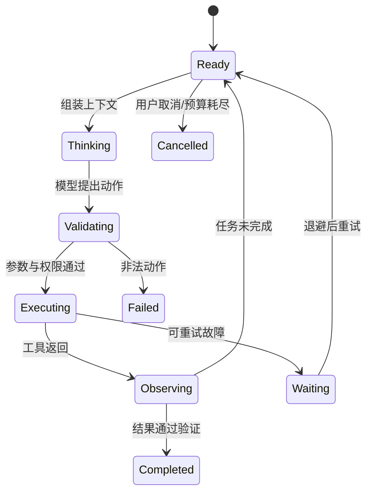

# Model + Harness = Agent：先把“模型”和“能做事的系统”分开

把大语言模型想成一个很聪明、但坐在空房间里的人。你问它问题，它能生成文字；可它没有钥匙、电话、日历，也不会自动记住上次关机前做到哪里。Harness 像工作台和操作规程：把任务交给它，准备上下文，允许它使用有限工具，记录每一步，在失败时重试或请人确认。

因此 DeepSeek Agent Harness 官方 JD 用了一个非常好记的式子：

```text
Model + Harness = Agent
```

这里不是数学等式，而是职责边界。**模型负责根据输入预测接下来应该输出什么；Harness 负责把多次模型调用、状态和现实动作组织成可控过程。**

## 1. 三层工程，不是一种“提示词技巧”

### 1.1 Prompt Engineering

Prompt Engineering（提示词工程）关注某次模型调用中怎样写清任务、约束和输出要求。例如：“只返回一个风险等级，并给出证据编号。”

它解决的是“这一次怎样问”，不能独自解决长期状态、工具权限、网络超时和恢复。

### 1.2 Context Engineering

Context Engineering（上下文工程）决定每一轮到底给模型看什么：系统规则、当前目标、对话摘要、检索文档、工具结果、剩余预算等。上下文窗口有限，塞得越多不一定越好；无关信息会抢占注意力，也可能破坏前缀复用。

### 1.3 Harness Engineering

Harness Engineering 负责整个运行系统：

- 什么时候调用模型；
- 模型如何选择工具；
- 参数怎样验证、权限怎样检查；
- 结果怎样写回上下文；
- 何时停止、重试、取消或请人审批；
- 状态怎样持久化和恢复；
- 每一步怎样记录、评测和审计。

一句话区分：**Prompt 写好一句指令，Context 组织好模型看到的材料，Harness 管好整场工作。**

## 2. LLM API 是无记忆的计算边界

从系统角度，一次 LLM API 调用可以抽象为：

```text
输入：规则 + 上下文 + 可用动作描述
输出：文本，或一个结构化动作建议
```

模型服务通常不会自动替你的业务保存任务记忆。所谓“连续对话”，往往是 Harness 在下一轮重新携带必要历史。不同供应商的字段会变化，所以应掌握稳定概念，而不是背某个 SDK 的字段名：

- 请求可能流式返回，也可能一次返回；
- 需要超时、限流和错误分类；
- 输出是非确定的，应校验而不能直接信任；
- 模型版本和提示版本要进入审计记录；
- 敏感信息进入模型前应经过授权与最小化处理。

## 3. Agent Loop：Agent 的心跳

一个最小 Agent Loop 可以写成与框架无关的伪代码：

```text
state = 接收任务()
while state.步骤数 < 上限:
    context = 组装上下文(state)
    proposal = 调用模型(context)
    if proposal 是“完成”:
        return 验证最终结果(proposal)
    action = 校验动作(proposal)
    observation = 在权限边界内执行(action)
    持久化(state, action, observation)
return “达到预算上限，安全停止”
```

它通常可画成状态机：



状态机比“让模型一直想”更可靠，因为停止、失败和取消都有明确位置。

## 4. 一个带数字的运行例子

任务：在代码仓库中修复一个测试失败。Harness 给出：

- 最多 8 轮模型调用；
- 最长 90 秒；
- 最多执行 12 条命令；
- 工作区写入上限 50 MiB；
- 网络默认关闭；
- 修改后必须通过 20 个指定测试。

可能的轨迹是：

| 轮次 | 模型建议 | Harness 动作 | 结果 |
|---:|---|---|---|
| 1 | 查看失败测试 | 只读执行测试 | 2/20 失败 |
| 2 | 搜索相关函数 | 只读搜索 | 找到 3 处调用 |
| 3 | 修改边界条件 | 写入工作区 | 改 1 个文件 |
| 4 | 重跑测试 | 执行限定测试 | 20/20 通过 |
| 5 | 总结并完成 | 检查 diff 与预算 | 返回结果 |

模型提供每一步的候选决策；真正保证“只改允许的目录、命令没越权、测试确实通过”的是 Harness 和沙箱。

## 5. KV Cache 为什么会出现在 Harness JD

Transformer 生成新 token 时，需要使用先前 token 的注意力 Key/Value。KV Cache 保存这些中间结果，避免每生成一个 token 都重算完整前缀。

对 Harness 的影响有两层：

1. **单次生成内部**：缓存降低逐 token 解码的重复计算。
2. **多轮 Agent 调用**：如果系统支持前缀缓存，稳定且相同的前缀更容易复用；在上下文开头频繁插入内容可能降低命中率。

假设固定前缀有 8,000 token，每轮只新增 500 token，连续 6 轮。若每轮都把前缀改写到无法复用，处理的前缀规模粗略为 `6 × 8,000 = 48,000 token`；若服务能安全复用稳定前缀，重复工作可能显著减少。实际收益取决于模型服务实现、缓存容量、并发和租户隔离，不能只靠这个算式承诺性能。

KV Cache 也带来资源与安全问题：它占显存或其他存储；不同请求间不能错误共享；模型版本、位置编码或前缀变化可能让缓存失效。

## 6. Harness 与 Agent Infra 的接口

Harness 说“我要执行一段代码”时，Infra 需要把模糊需求变成明确契约：

```text
创建沙箱(镜像、CPU、内存、磁盘、网络策略、截止时间)
执行动作(命令、环境、幂等键)
返回观察(stdout、stderr、退出码、资源用量)
保存检查点(任务状态、工作区快照、事件位置)
销毁沙箱(原因、审计记录、残留清理)
```

Harness 不应该绕过 Infra 直接获得宿主机权限；Infra 也不应假定每个 Agent 都会礼貌停止。两者通过资源配额、身份、超时、取消、快照和审计协议协作。

## 7. 失败路径

### 7.1 无限循环

模型反复“搜索—没找到—再搜索”。解决方案不是只改提示词，还要设置步数、时间、费用和重复动作阈值，必要时切换策略或停止。

### 7.2 错误被当成观察事实

工具超时却返回空字符串，模型把它理解成“没有结果”。工具协议应区分成功、业务空结果、可重试故障和永久故障。

### 7.3 上下文越积越长

把全部终端输出原样追加，会挤掉目标和关键证据。应保留原始日志用于审计，同时向模型提供有来源指针的摘要。

### 7.4 模型说完成，但产物没完成

“完成”只是建议。代码任务要跑测试，文件任务要检查存在性和格式，支付任务要核对账本状态。最终条件应尽量由确定性 verifier 验证。

## 8. DeepSeek Agent Infra 面试怎么问

### 典型问题

> Model、Context 和 Harness 的边界是什么？

### 30 秒答法

> Model 是根据输入生成下一步内容的概率模型，本身不等于一个能可靠做事的 Agent。Context Engineering 决定每轮给模型哪些规则、历史、检索材料和工具结果；Harness Engineering 把多轮调用组织成带状态、权限、工具、预算、验证、重试和恢复的执行循环。Agent Infra 再为 Harness 提供隔离沙箱、网络、存储和控制面。可靠性主要来自这些边界共同约束，而不是模型“更聪明”就自动获得。

### 常见追问

- Agent Loop 如何检测没有进展，而不是只限制最大轮数？
- 流式输出中途断开，怎样判断模型调用是否产生了可执行动作？
- KV Cache 与业务记忆有什么区别？为什么不能把两者混为一谈？
- 最终完成条件由模型判断，还是由外部 verifier 判断？
- 如果模型服务重试，怎样避免一个工具动作被执行两次？

## 9. 本章速记

- Model 负责生成候选，Harness 负责把候选变成受控过程。
- Prompt 管一次指令，Context 管每轮材料，Harness 管完整生命周期。
- Agent Loop 至少要有验证、执行、观察、停止、失败和取消状态。
- LLM API 输出默认不可信；参数、权限和结果都要外部验证。
- KV Cache 是推理中间状态，不是用户记忆，也不是任务 checkpoint。
- Harness 与 Infra 的接口应明确资源、身份、超时、幂等、审计和清理语义。

## 10. 一手资料

- [DeepSeek：Agent Harness 团队招聘](https://app.mokahr.com/social-recruitment/high-flyer/140576#/job/8d40c764-d2b2-49b1-826c-e3f2adb75c01)
- [ReAct：Synergizing Reasoning and Acting in Language Models](https://arxiv.org/abs/2210.03629)
- [Attention Is All You Need](https://arxiv.org/abs/1706.03762)
- [Anthropic：Building Effective Agents](https://www.anthropic.com/research/building-effective-agents)
