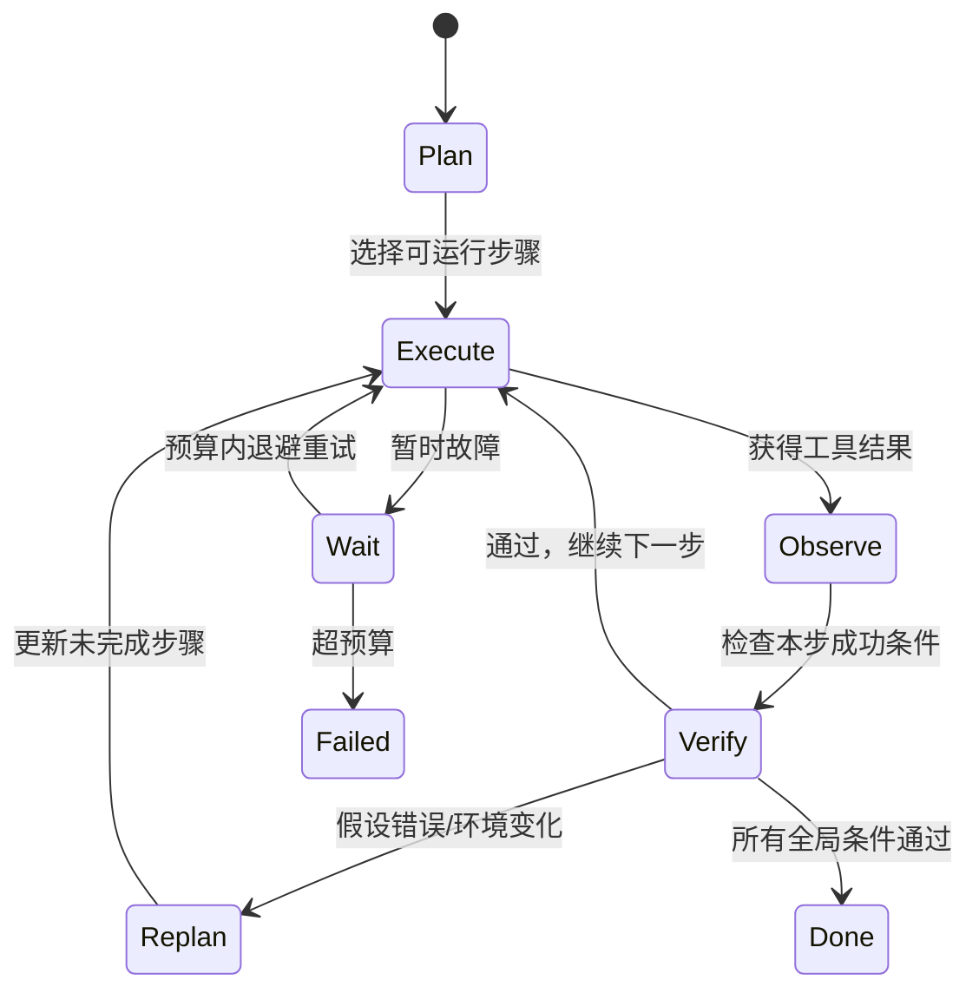

# Reasoning 与 Planning：会想下一步，也要知道什么时候改计划

去陌生城市办三件事时，你可能先画路线，再边走边根据堵车调整。Reasoning（推理）像判断“为什么先去车站”；Planning（规划）像把目标拆成顺序、依赖和完成条件；Tool Use 则是真的买票、导航和付款。

一个常见误区是把规划理解成模型开头生成的一张长清单。真实环境会变化，工具会失败，最初假设也可能错误。可靠 Agent 需要的是**计划—执行—观察—重规划**闭环，而不是把第一版计划当圣旨。

## 1. Reasoning 不等于展示全部思维过程

从工程视角，Reasoning 指模型为选择答案或动作所进行的推断能力。系统需要的通常是：

- 可验证的结论；
- 简短、面向证据的理由；
- 明确假设与不确定性；
- 下一步结构化动作。

不应把记录或展示模型完整隐藏思维链当作可靠性前提。冗长“思考文字”不自动更正确，也可能泄露敏感上下文。生产系统更应记录输入版本、动作、观察、证据和 verifier（外部验证器）结果。

## 2. 四种规划粒度

### 2.1 反应式

每轮只选下一步，适合短任务和环境变化快的场景。优点是灵活，缺点是容易绕圈。

### 2.2 先规划再执行

先列出完整步骤，再逐一执行。适合依赖稳定的任务，但计划容易过时。

### 2.3 分层规划

先拆里程碑，每到一个里程碑再细化局部步骤。它能控制上下文和计划长度，适合长任务。

### 2.4 多候选搜索

对高价值决策生成多个方案，用成本、风险或 verifier 评分再选择。它会增加调用量，不适合所有步骤。

## 3. 计划应该是一等数据

不要只把计划埋在自然语言里。至少应包含：

```text
step_id：稳定标识
goal：本步目标
dependencies：依赖哪些已完成步骤
action：预期动作类型
success_condition：怎样判定完成
status：pending/running/succeeded/failed/skipped
artifacts：产物引用
```

一个 5 步代码修复计划可能是：

```text
S1 复现失败                  无依赖          成功条件：得到稳定失败日志
S2 定位最小相关代码           依赖 S1         成功条件：形成带证据的候选原因
S3 修改实现                  依赖 S2         成功条件：diff 只触及允许文件
S4 运行目标测试              依赖 S3         成功条件：20/20 通过
S5 运行回归并总结            依赖 S4         成功条件：200/200 通过且产出报告
```

若 S4 只有 19/20 通过，状态应回到诊断，而不是因为计划写了“测试通过”就继续 S5。

## 4. 一个重规划状态机



重规划时不应偷偷改掉任务目标和安全约束。可以修改“怎么做”，不能无授权修改“做什么”和“允许做到哪一步”。

## 5. 数字例子：规划收益是否值得成本

假设直接反应式 Agent 完成任务的概率为 60%，平均调用 6 次；加入一次规划和最多一次重规划后，完成率在一组 100 个代表性任务上升到 72%，平均调用变为 9 次。

- 成功数从 60 增到 72，绝对提升 12 个百分点。
- 调用量从约 600 增到 900，增加 50%。
- 若任务价值高、失败代价大，可能值得；若是低价值查询，成本可能不划算。

还要检查任务难度分层、失败类型和置信区间（抽样结果可能落入的不确定范围）。不能因单次 100 题实验就宣布规划“普遍提升 12%”。

## 6. Reasoning 与 Verifier 分工

模型擅长提出候选和解释模糊问题，Verifier 擅长检查明确条件：

| 任务 | Reasoning | Verifier |
|---|---|---|
| 修复代码 | 猜测根因、提出补丁 | 编译、测试、静态检查 |
| 检索事实 | 生成查询、综合证据 | 引用是否存在、日期是否符合 |
| 数据变换 | 设计步骤 | Schema、行数、校验和 |
| 权限操作 | 解释目的 | 身份、策略、审批记录 |

让同一个模型既生成答案又只凭主观打分，容易形成“自己给自己批卷”。能用确定性规则时，优先用确定性 verifier；需要模型评审时，应隔离上下文、校准偏差并保留人工抽查。

## 7. 失败路径

### 7.1 循环而没有进展

Agent 连续三次执行语义相同的搜索。可用动作指纹、状态差异或 artifact 增量检测“无进展”，而不只看文字是否不同。

### 7.2 幻觉出的依赖

计划假定某数据库存在。执行前应做轻量探测，把假设变成已验证事实；不存在时重规划。

### 7.3 计划过时

子任务执行期间代码库更新，旧行号和测试结果失效。计划和 artifact 要绑定版本，继续执行前检查前置条件。

### 7.4 提前宣布完成

模型看到单元测试通过就跳过回归。完成条件应由 Harness 保存并强制检查，不允许模型随意删除。

### 7.5 过度规划

为两步任务生成 40 步计划，成本增加且每步都是潜在失败点。规划深度应随任务风险、可逆性和环境不确定性调整。

## 8. Agent Infra 如何支持规划

规划会转化成系统需求：

- 每个步骤有稳定 ID 和幂等语义；
- 依赖图可以调度，失败只重跑必要子图；
- 取消能向正在运行的沙箱传播；
- artifact 与代码/镜像版本绑定；
- 子任务有独立资源预算，又受总预算约束；
- 事件日志能回答“计划为什么改变”。

Infra 不判断模型推理内容是否聪明，但要保证步骤不会因为重复调度产生失控副作用。

## 9. 做题方法：把计划当作可验证状态

1. 把目标拆成带 ID 的节点，每个节点写前置条件、输入、预期产物、验证器和状态 `PENDING/RUNNING/DONE/BLOCKED/FAILED`；“研究一下”不是可验收节点。
2. 画依赖边并找当前 frontier，只有全部前置条件满足的节点才能运行。并行节点若写同一文件、账户或外部资源，要增加互斥边或明确合并协议。
3. 每次工具结果回来只更新直接受影响的节点，同时保存证据链接。`DONE` 必须由验证器或可检查产物触发，不能只由模型自报完成。
4. 预先定义重规划触发器：前提失效、新约束、预算不足、验证失败或更便宜路径出现。重规划要保留已完成且仍有效的产物，不应无条件从头开始。
5. 计算关键路径上的预计成本和剩余 deadline；若计划总成本超预算，先删低价值分支或请求决策，而不是让最后一步被动超时。

验算点：无节点在前置未满足时运行；同一节点不会被重复完成；失败节点的下游不会误标 DONE；重规划后仍能解释旧计划为何失效；终态目标由产物证据而不是思维文字证明。

## 10. 章末面试问题

### 典型问题

> Agent 的 Planning 是一次性生成任务列表吗？

### 30 秒答法

> 不是。可靠 Planning 应把目标拆成带依赖、状态和成功条件的步骤，然后形成计划、执行、观察、验证和重规划闭环。环境变化或 verifier 不通过时，只更新未完成部分，不能修改用户目标和安全约束。Infra 侧需要稳定 step ID、幂等执行、版本化 artifact、预算、取消传播和事件日志，才能让重规划不变成重复副作用。

### 常见追问

- 怎样检测 Agent 在原地打转？
- 什么时候反应式优于先规划再执行？
- 计划状态存在模型上下文里够不够？
- 两个步骤可并行时，怎样处理共享文件冲突？
- Verifier 也是模型时，如何降低偏差和自我确认？

### 常见追问参考答案

<details>
<summary>展开答案</summary>

- **检测原地打转：**为每一步记录输入版本、动作、观察和完成条件，计算“状态签名”。连续出现相同错误、相同工具参数或 artifact 无变化时增加停滞计数；先触发换方法、缩小任务或求助，达到预算后停止。仅看模型措辞不同会漏掉语义相同的循环。
- **何时反应式更好：**任务很短、环境变化快、每步反馈信息量高，或预先规划成本接近执行成本时，观察一步再行动更合适。长依赖链、昂贵副作用和可并行步骤则更需要先写依赖与验收条件；实际系统常把粗计划与局部反应结合。
- **上下文不够：**上下文会被截断、摘要或因服务重试丢失，也不适合并发条件更新。稳定 step ID、状态、artifact 版本和 operation ID 应写入外部持久状态；模型上下文只是本轮视图，可以从权威状态重建。
- **共享文件冲突：**先按文件或模块划分所有权；不能划分时，让并行步骤写独立工作区/分支和版本化 artifact，合并时使用预期旧版本的条件写并运行测试。检测到版本变化就重新读取和合并，不能最后写入者静默覆盖前者。
- **模型 verifier 的偏差：**优先加入可执行测试、Schema、哈希和业务不变量；需要语义评审时，用与生成器不同的 Prompt/模型、隐藏标准、多评审或人工抽样，并让评审看不到版本身份。持续用已知正反例校准，不能把同一模型的自我评价当独立证据。

</details>

## 11. 本章速记

- Reasoning 选择“为什么和下一步”，Planning 管目标、依赖和顺序。
- 计划要结构化，有稳定 ID、状态、成功条件和 artifact。
- 第一版计划会错，可靠 Agent 必须能观察、验证和重规划。
- 重规划可以改路径，不能擅自改目标和权限边界。
- 模型负责候选，外部 verifier 负责可验证完成条件。
- Infra 要让重复调度、取消和部分失败具有明确语义。

## 12. 一手资料

- [ReAct：Synergizing Reasoning and Acting in Language Models](https://arxiv.org/abs/2210.03629)
- [Plan-and-Solve Prompting](https://aclanthology.org/2023.acl-long.147/)
- [Tree of Thoughts](https://arxiv.org/abs/2305.10601)
- [Reflexion: Language Agents with Verbal Reinforcement Learning](https://arxiv.org/abs/2303.11366)
