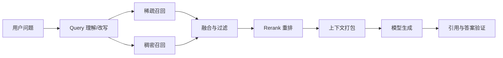

# Retrieval 与 RAG：先找到对的证据，再谈让模型回答

让一个聪明人回答“公司昨天更新了什么规则”，却不给他查资料，他只能凭旧记忆猜。Retrieval（检索）像图书馆员：理解问题、找候选书、挑出相关页；RAG（Retrieval-Augmented Generation，检索增强生成）再把这些证据交给模型组织答案。

RAG 失败时，最容易犯的错误是说“模型幻觉”。可能根本是文档没入库、查询写错、召回漏掉、重排选错、上下文装坏，或生成时没有遵守证据。可靠系统必须逐层归因。

## 1. 搜索流水线

DeepSeek 的 [AI 搜索算法/架构工程师](https://app.mokahr.com/social-recruitment/high-flyer/140576#/job/1df4597d-6039-4392-9954-0df72510f415)官方 JD 明确覆盖 query 理解、召回、排序、索引筛选、质量评估、多语言/多模态、离线索引和为 Agent 提供检索工具。

一个通用流水线是：



每层都应有独立指标，否则最终失败无法定位。

## 2. Query 理解：用户问的未必是检索语言

用户可能问：“上次那个磁盘问题后来怎么修的？” 系统需要解析：

- “上次”对应哪个时间范围；
- “磁盘问题”是容量、延迟还是损坏；
- “怎么修”要事故报告、代码提交还是操作手册；
- 用户有权访问哪个项目。

常见操作包括拼写归一、多查询改写、实体识别、时间过滤、任务拆分和意图分类。改写不能悄悄改变原意，最好保留原 query，并记录每个子查询的来源。

## 3. 稀疏、稠密和混合召回

### 3.1 稀疏检索

稀疏方法依赖词项匹配，BM25 是常见代表。它擅长精确术语、错误码、函数名和罕见实体。例如查询 `ENOSPC` 时，词面匹配非常有价值。

### 3.2 稠密检索

稠密检索把 query 和文档编码为向量，根据相似度找语义相关内容。它能匹配“磁盘写满”和“设备没有剩余空间”这类词面不同但含义接近的表达。

### 3.3 混合检索

两者互补。混合系统可以分别取 top-k，再做分数归一或基于名次融合。不要直接相加两个未经校准的分数。

一个常见的名次融合思想是：文档在多个列表中排名越靠前，综合得分越高。具体常数应由验证集选择，而不是照抄默认值。

## 4. Rerank：召回求“不漏”，重排求“排对”

第一阶段召回要快，可能取 100～1,000 个候选；Reranker 用更昂贵的交互模型或规则重新评分，只留下真正相关且权威的结果。

Rerank 特征不应只有语义相关度，还可包括：

- 文档权限；
- 来源权威性；
- 新鲜度和有效时间；
- 文档类型；
- 是否包含可引用证据；
- 多样性，避免 top 10 全是同一内容副本。

权限过滤通常应尽早做，防止未授权文档进入缓存、日志或模型上下文。

## 5. 一个带数字的端到端例子

假设语料有 1,000 万个片段，在线延迟预算 500 ms：

| 阶段 | 数量/预算 | 目标 |
|---|---:|---|
| Query 理解 | 30 ms | 生成原 query + 2 个安全改写 |
| 稀疏召回 | top 100，60 ms | 保住错误码和专有词 |
| 稠密召回 | top 100，80 ms | 保住语义近邻 |
| 融合去重 | 约 170 → 50，20 ms | 合并重复候选 |
| Rerank | 50 → 10，180 ms | 提升前排精度 |
| 上下文打包 | 10 → 6，30 ms | 控制 token 与多样性 |
| 生成与验证 | 100 ms | 教学预算，真实值依模型而异 |

关键离线指标可以是：

- `Recall@100`：标准证据是否进入前 100；
- `nDCG@10`：高相关文档是否排得更靠前；
- `MRR`：第一个正确结果出现得多早；
- 引用支持率：答案主张是否真被引用内容支持。

若 `Recall@100` 已经失败，调生成 Prompt 通常救不回来；应先修 query、索引或召回。

## 6. Chunk、索引与上下文打包

文档进入检索前要切分。片段太小会丢上下文，太大则混入无关内容并浪费 token。可以根据标题、段落、代码函数、表格等结构切分，并保留父文档和相邻片段关系。

索引记录至少要带：

- 内容与稳定 ID；
- 来源 URL/文件和版本；
- 标题、时间、语言、类型；
- 租户、ACL 和保密级别；
- 生成向量所用模型版本；
- 删除或失效状态。

上下文打包时要去重、按来源分组、控制每个来源占比，并为引用保留稳定锚点。不要把搜索结果网页中的指令当成系统指令。

## 7. RAG 失败归因树

面对错误答案，可以按顺序排查：

1. **需求层**：问题是否歧义，时间和实体是否解析正确？
2. **语料层**：正确资料是否存在、最新、已授权且成功入库？
3. **切分/索引层**：证据是否被切碎、字段或向量是否错误？
4. **召回层**：标准证据是否进 top-k？稀疏和稠密各自表现如何？
5. **重排层**：证据召回了却被错误压到后面吗？
6. **打包层**：正确片段是否因 token 预算、去重或权限被丢弃？
7. **生成层**：模型是否忽略证据、混合来源或添加无依据主张？
8. **验证层**：引用链接存在，但是否真的支持对应句子？

为每层保存可重放 trace，才能把“模型答错了”变成可修复工单。

## 8. Agentic Retrieval

普通 RAG 常是一次检索后生成；Agentic Retrieval 允许 Agent 根据结果继续行动：

```text
搜索概览
  → 发现缺少发布日期
  → 加时间过滤再次搜索
  → 打开权威原文
  → 对关键主张交叉验证
  → 在预算内完成
```

这会提高复杂任务能力，也新增循环、费用和网络安全风险。Harness 应限制查询次数、域名、下载大小、总时间和最终证据要求。搜索工具返回的网页是不可信数据，可能包含提示注入。

## 9. 失败路径

### 9.1 语料根本没有答案

检索器无法召回不存在的文档。系统应能回答“不足以确定”，并指出缺少什么来源。

### 9.2 旧文档排在新规则前

纯相关度忽略有效时间。查询理解和 rerank 都应使用日期，冲突时优先权威且有效版本。

### 9.3 Dense Retrieval 错过精确代码

向量语义相近却没保住哈希、错误码和符号名。用稀疏检索或字段索引补足。

### 9.4 引用存在但不支持结论

模型贴了一个相关链接，却从中推导出原文没有的数字。Verifier 要检查主张—证据对齐，而非只检查“有没有 URL”。

### 9.5 ACL 过滤太晚

未授权片段已经进入 rerank 服务或模型日志，即使最终不展示也已泄露。权限应尽早强制，并贯穿缓存与观测链路。

## 10. DeepSeek Agent Infra 面试怎么问

### 典型问题

> RAG 回答错误，怎样判断是检索问题还是模型问题？

### 30 秒答法

> 我会建立分层 trace。先确认权威答案是否在语料及正确版本中，再看 query 改写；用 Recall@k 检查标准证据是否被召回，用排序指标看它是否进前排，再看上下文打包是否保留，最后检查生成主张是否被引用支持。证据没进上下文就是语料、索引、召回或重排问题；证据已正确提供但模型忽略或歪曲，才主要是生成问题。权限、新鲜度和提示注入要贯穿检查。

### 常见追问

- BM25 与向量检索各自在哪些 query 上占优？
- 稀疏和稠密分数能直接相加吗？
- top-k 越大为什么不一定越好？
- 1,000 万片段、500 ms 延迟怎样分预算？
- Agent 多轮搜索怎样限制循环、费用和恶意网页影响？

## 11. 本章速记

- Retrieval 负责找证据，RAG 把证据交给模型生成。
- Query 理解、召回、融合、重排、打包、生成和验证要分层测。
- 稀疏擅长精确词，稠密擅长语义，混合通常更稳但需要校准。
- 召回求不漏，重排求前排准确；权限与新鲜度也是排序约束。
- `Recall@k` 失败时先修检索，不要只调 Prompt。
- 引用存在不等于支持结论，要做主张—证据验证。
- Agentic Retrieval 能迭代查询，也必须有预算、网络和注入边界。

## 12. 一手资料

- [DeepSeek：AI 搜索算法/架构工程师招聘](https://app.mokahr.com/social-recruitment/high-flyer/140576#/job/1df4597d-6039-4392-9954-0df72510f415)
- [Dense Passage Retrieval](https://aclanthology.org/2020.emnlp-main.550/)
- [Retrieval-Augmented Generation](https://arxiv.org/abs/2005.11401)
- [ColBERT](https://arxiv.org/abs/2004.12832)
- [BEIR：A Heterogeneous Benchmark for Information Retrieval](https://arxiv.org/abs/2104.08663)
