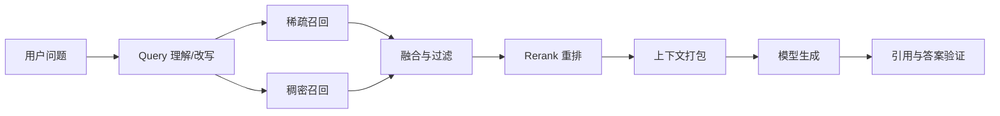

# Retrieval 与 RAG：先找到对的证据，再谈让模型回答

让一个聪明人回答“公司昨天更新了什么规则”，却不给他查资料，他只能凭旧记忆猜。Retrieval（检索）像图书馆员：理解问题、找候选书、挑出相关页；RAG（Retrieval-Augmented Generation，检索增强生成）再把这些证据交给模型组织答案。

RAG 失败时，最容易犯的错误是说“模型幻觉”。可能根本是文档没入库、查询写错、召回漏掉、重排选错、上下文装坏，或生成时没有遵守证据。可靠系统必须逐层归因。

## 学习优先级

| 优先级 | 先掌握什么 | 面试要求 |
|---|---|---|
| **P1：主线** | RAG 流水线、稀疏/稠密/混合召回、重排、权限、失败归因 | 能判断“证据在哪一层丢了”，并给出对应指标和修复方向 |
| **P2：搜索岗追问** | 精确检索与 ANN（近似最近邻）、常见向量索引、索引构建和切换 | 能解释用找回率、延迟和内存做取舍，不要求背引擎参数 |
| **暂不要求** | 某个向量数据库的产品命令、默认参数和内部类名 | 需要实际使用时查对应版本的官方文档 |

Agent Infra 面试先读 P1；只有目标岗位偏搜索、简历写过向量索引，或面试官继续追问千万级向量时，再展开 P2。

## 1. 搜索流水线

DeepSeek 的 [AI 搜索算法/架构工程师](https://app.mokahr.com/social-recruitment/high-flyer/140576#/job/1df4597d-6039-4392-9954-0df72510f415)官方 JD 明确覆盖 query 理解、召回、排序、索引筛选、质量评估、多语言/多模态、离线索引和为 Agent 提供检索工具。

一个通用流水线是：



每层都应有独立指标，否则最终失败无法定位。

## 2. Query 理解：用户问的未必是检索语言

用户可能问：“上次那个磁盘问题后来怎么修的？” 系统需要解析：

- “上次”对应哪个时间范围；
- “磁盘问题”是容量、延迟还是损坏；
- “怎么修”要事故报告、代码提交还是操作手册；
- 用户有权访问哪个项目。

常见操作包括拼写归一、多查询改写、实体识别、时间过滤、任务拆分和意图分类。改写不能悄悄改变原意，最好保留原 query，并记录每个子查询的来源。

## 3. 稀疏、稠密和混合召回

### 3.1 稀疏检索

稀疏方法依赖词项匹配，BM25 是常见代表。它擅长精确术语、错误码、函数名和罕见实体。例如查询 `ENOSPC` 时，词面匹配非常有价值。

### 3.2 稠密检索

稠密检索把 query 和文档编码为向量，根据相似度找语义相关内容。它能匹配“磁盘写满”和“设备没有剩余空间”这类词面不同但含义接近的表达。

### 3.3 混合检索

两者互补。混合系统可以分别取 top-k，再做分数归一或基于名次融合。不要直接相加两个未经校准的分数。

一个常见的名次融合思想是：文档在多个列表中排名越靠前，综合得分越高。具体常数应由验证集选择，而不是照抄默认值。

## 4. Rerank：召回求“不漏”，重排求“排对”

第一阶段召回要快，可能取 100～1,000 个候选；Reranker 用更昂贵的交互模型或规则重新评分，只留下真正相关且权威的结果。

Rerank 特征不应只有语义相关度，还可包括：

- 文档权限；
- 来源权威性；
- 新鲜度和有效时间；
- 文档类型；
- 是否包含可引用证据；
- 多样性，避免 top 10 全是同一内容副本。

权限过滤通常应尽早做，防止未授权文档进入缓存、日志或模型上下文。

## 5. 一个带数字的端到端例子

假设语料有 1,000 万个片段，在线延迟预算 500 ms：

| 阶段 | 数量/预算 | 目标 |
|---|---:|---|
| Query 理解 | 30 ms | 生成原 query + 2 个安全改写 |
| 稀疏召回 | top 100，60 ms | 保住错误码和专有词 |
| 稠密召回 | top 100，80 ms | 保住语义近邻 |
| 融合去重 | 约 170 → 50，20 ms | 合并重复候选 |
| Rerank | 50 → 10，180 ms | 提升前排精度 |
| 上下文打包 | 10 → 6，30 ms | 控制 token 与多样性 |
| 生成与验证 | 100 ms | 教学预算，真实值依模型而异 |

关键离线指标可以是：

- `Recall@100`：标准证据是否进入前 100；
- `nDCG@10`：高相关文档是否排得更靠前；
- `MRR`：第一个正确结果出现得多早；
- 引用支持率：答案主张是否真被引用内容支持。

若 `Recall@100` 已经失败，调生成 Prompt 通常救不回来；应先修 query、索引或召回。

<details>
<summary><strong>P2 选读：向量索引的实现与生命周期</strong></summary>

## 6. 索引层：精确检索与 ANN 怎么选

文档进入检索前要切分。片段太小会丢上下文，太大则混入无关内容并浪费 token。可以根据标题、段落、代码函数、表格等结构切分，并保留父文档和相邻片段关系。

切分和向量化之后，系统还要回答：“怎样从一千万个向量中快速找到最近的几个？”先分清两种搜索。

### 6.1 精确检索：把所有候选都比较一遍

精确向量检索在相同语料、过滤条件和距离度量下，计算 query 与每个候选向量的相似度，再取真正的 top-k。它适合小索引、严格评测、GPU 批量扫描，或权限过滤后只剩很少候选的场景。

代价是数据越大，计算和读取通常越多。若候选数为 `N`、向量维度为 `d`，朴素扫描的工作量可粗看成随 `N×d` 增长。精确结果很重要，因为它可以作为 ANN 的对照“答案”；但它只证明向量空间里的最近邻，不证明文档在语义上真的正确。

### 6.2 ANN：少看一些候选，换更低延迟

ANN（Approximate Nearest Neighbor，近似最近邻）使用额外索引结构，避免每次把所有向量都看一遍。它通常更快、更容易扩展，但可能漏掉精确 top-k 中的结果。

因此 ANN 的“召回率”常指：精确检索的 top-k 中，有多少也被 ANN 找到。它和前文“标准证据是否召回”的业务 `Recall@k` 不是同一层指标：

- **索引 recall**低：向量是对的，但 ANN 没把近邻找出来；
- **业务 recall**低：还可能是文档缺失、切分差、embedding 不合适或 query 写错。

不要用扩大 ANN 参数去掩盖错误 embedding；也不要因为最终答案错了就断言 ANN 有问题。

## 7. HNSW、IVF 与 PQ：只记住三个直觉

这些名称是索引“怎样少做工作”的不同办法，不是三个新的模型。

### 7.1 HNSW：多层近邻导航图

HNSW 可以想成城市道路：上层像高速公路，节点少但跨得远；下层像街道，节点多且连接局部邻居。查询先在上层快速接近目标区域，再到下层细找。

- 图连得更密、搜索时探索候选更多，通常 recall 更高；
- 代价通常是更多内存、构建时间和查询计算；
- 新向量可插入图中，但大量删除和长期更新可能使图质量下降，需要 tombstone（逻辑删除标记）、压缩或重建，具体取决于实现。

具体引擎的参数名应在实际使用时查对应版本。基础面试重点是：扩大搜索范围一般会用延迟换 recall，HNSW 的图边本身也占内存。

### 7.2 IVF：先找可能的桶

IVF（Inverted File Index，倒排文件索引）先用训练得到的中心把向量空间划成许多“片区”。文档向量进入相应桶；查询时先找最接近的几个片区，只扫描这些桶。

像在全国找一家店：先判断可能在哪几座城市，再查城内目录。探查的桶越多，通常越不容易漏，但延迟也越接近全量扫描。若训练样本不代表生产数据，桶可能严重不均衡，少数热门桶会成为延迟热点。

### 7.3 PQ：用短代码近似原向量

PQ（Product Quantization，乘积量化）把长向量分成几段，每段用一个有限码本中的编号表示。原本需要保存许多浮点数，现在只保存较短代码；距离也用查表近似计算。

它大幅减少内存和读取带宽，但压缩越强，距离误差通常越大。常见组合是 IVF 先缩小搜索片区，PQ 再压缩桶内向量；也可以先用压缩向量召回较多候选，再用原始全精度向量 rerank。

### 7.4 没有脱离数据集的“最好索引”

| 方案 | Recall | 查询延迟 | 内存 | 构建/更新 |
|---|---|---|---|---|
| 精确扫描 | 对同一向量空间是基准 | 大规模时通常较高 | 保存原向量 | 简单，新增直接可见 |
| HNSW | 常可做到较高 | 常较低 | 图边可能很占内存 | 构建较重，长期删除需治理 |
| IVF | 由探查桶数控制 | 可按探查范围调节 | 中心和桶有额外开销；IVFFlat 通常仍保存原向量与 ID | 需训练中心，注意桶倾斜 |
| PQ | 压缩越强越可能损失 | 读取少、距离近似 | 通常最低 | 需训练码本，升级要版本化 |

这些方法不是互斥套餐：IVF 常与 PQ 组合，HNSW 的节点也可以保存压缩向量。**IVF 的主要作用是少扫描候选桶，不会天然压缩桶内向量；真正的内存压缩来自另加的量化方案。**表中按常见简单形态比较，“高低”只是方向，不是保证。维度、数据分布、过滤选择性、硬件和实现都会改变结果。正确做法是在代表性 query 上画 recall—p95/p99 延迟—每向量内存曲线，再按业务 SLO（延迟等服务目标）选点。

## 8. 索引生命周期：建好只是第一天

索引记录至少要带：

- 内容与稳定 ID；
- 来源 URL/文件和版本；
- 标题、时间、语言、类型；
- 租户、ACL（访问控制规则）和保密级别；
- 生成向量所用模型版本；
- 删除或失效状态。

还要把整条构建配方作为一个版本：语料快照、解析/切分器、embedding 模型、距离度量与归一化、索引类型和参数、ACL 策略及构建代码。查询 trace 必须记录命中了哪个版本。

### 8.1 全量构建与切换

不要在正在服务的索引上原地换 embedding。更安全的流程是：

```text
固定语料快照
  -> 构建新版本索引
  -> 检查条数、权限、索引 recall 和业务 Recall@k
  -> 影子查询 / 小流量验证
  -> 原子切换读别名
  -> 保留旧版本用于回滚
```

只有新向量、query 向量、距离度量和归一化规则属于同一配方，分数才有可解释性。新旧 embedding 直接混在一个索引里，距离通常不可比。

### 8.2 增量更新

文档变化可以通过 CDC（Change Data Capture，捕获源数据变更）、事件流或定期扫描进入索引。每个事件应带稳定文档/片段 ID、内容版本和幂等键；消费者要处理重复、乱序和失败重放。监控“源数据提交到新索引可查询”的更新延迟，而不是只监控队列是否为空。

若切分规则改变，一个旧片段可能对应多个新片段。更新流程要先确定新版本的完整片段集合，再使旧集合失效，避免半新半旧。

### 8.3 删除不是从一个表删一行

删除通常要传播到稀疏索引、向量索引、文档库、rerank 缓存、回答缓存和副本。面向权限撤销时，应先在权威 ACL 层立即拒绝读取，再异步做物理清理；ANN 中的 tombstone 还可能等到压缩或重建才真正释放空间。

删除 SLO（服务目标）要分别说明“多久后不可查询”和“多久后物理清除”。备份的保留与销毁遵守单独的数据治理策略，不能承诺一次在线删除立即抹掉所有历史副本。

### 8.4 权限过滤必须贯穿索引

两种常见策略都有代价：

- **先过滤再近邻搜索**安全边界清楚，但高选择性过滤可能需要专门分区或过滤友好的索引；
- **先取候选再过滤**实现简单，但过滤后可能不足 top-k，还必须保证未授权内容不会离开受信任边界、进入日志或缓存。

缓存键要包含租户、ACL/权限版本和索引版本。权限变化后要失效相关缓存。最终授权判断由确定性服务执行，不能让 embedding 相似度或模型决定用户能看什么。

## 9. 用证据判断索引哪里坏了

调 ANN 参数前，先建立一小批代表性 query，用相同向量、过滤条件和距离度量跑精确检索作为基准。至少记录：

- ANN 相对精确 top-k 的 recall；
- p50/p95/p99 延迟与吞吐；
- 内存、索引字节数、构建时间；
- 增量更新和删除传播延迟；
- 不同 ACL 过滤选择性下返回结果是否足量；
- 分片、节点和索引版本。

几类证据很有区分度：

| 观察 | 更可能的问题 |
|---|---|
| 精确检索有标准近邻，ANN 没有 | ANN 参数、图/桶质量、分片或索引损坏 |
| 精确检索也没有标准证据 | 语料、切分、embedding、query 或标签问题 |
| 不加 ACL 能找到，加 ACL 后不足 top-k | 授权语料不足、过滤策略或候选预算问题 |
| 只有某个节点/分片漏结果 | 副本版本不一致、构建失败或路由错误 |
| 删除后仍能查到旧内容 | tombstone、缓存或更新传播失败 |
| 新文档一直不可见 | 事件丢失、乱序覆盖、embedding 失败或索引 lag |

为每次查询保留 query ID、索引精确版本、过滤条件、候选 ID/分数、各阶段耗时与最终上下文引用。敏感正文不必默认写日志，但版本与证据指针不能丢。

</details>

## 10. 上下文打包

召回和重排得到的是候选证据，还不能直接把所有结果塞给模型。上下文打包要去重、按来源分组、控制每个来源占比，并为引用保留稳定锚点；被 Token 预算截掉的文档也要留下原因。搜索结果中的文字只是外部数据，不能因为进入上下文就升级成系统指令。

## 11. RAG 失败归因树

面对错误答案，可以按顺序排查：

1. **需求层**：问题是否歧义，时间和实体是否解析正确？
2. **语料层**：正确资料是否存在、最新、已授权且成功入库？
3. **切分/索引层**：证据是否被切碎、字段或向量是否错误？
4. **召回层**：标准证据是否进 top-k？稀疏和稠密各自表现如何？
5. **重排层**：证据召回了却被错误压到后面吗？
6. **打包层**：正确片段是否因 token 预算、去重或权限被丢弃？
7. **生成层**：模型是否忽略证据、混合来源或添加无依据主张？
8. **验证层**：引用链接存在，但是否真的支持对应句子？

为每层保存可重放 trace，才能把“模型答错了”变成可修复工单。

## 12. Agentic Retrieval

普通 RAG 常是一次检索后生成；Agentic Retrieval 允许 Agent 根据结果继续行动：

```text
搜索概览
  → 发现缺少发布日期
  → 加时间过滤再次搜索
  → 打开权威原文
  → 对关键主张交叉验证
  → 在预算内完成
```

这会提高复杂任务能力，也新增循环、费用和网络安全风险。Harness 应限制查询次数、域名、下载大小、总时间和最终证据要求。搜索工具返回的网页是不可信数据，可能包含提示注入。

## 13. 失败路径

### 13.1 语料根本没有答案

检索器无法召回不存在的文档。系统应能回答“不足以确定”，并指出缺少什么来源。

### 13.2 旧文档排在新规则前

纯相关度忽略有效时间。查询理解和 rerank 都应使用日期，冲突时优先权威且有效版本。

### 13.3 Dense Retrieval 错过精确代码

向量语义相近却没保住哈希、错误码和符号名。用稀疏检索或字段索引补足。

### 13.4 引用存在但不支持结论

模型贴了一个相关链接，却从中推导出原文没有的数字。Verifier 要检查主张—证据对齐，而非只检查“有没有 URL”。

### 13.5 ACL 过滤太晚

未授权片段已经进入 rerank 服务或模型日志，即使最终不展示也已泄露。权限应尽早强制，并贯穿缓存与观测链路。

### 13.6 ANN recall 被误当成业务 recall

团队把 HNSW 的搜索范围调大，索引 recall 从 92% 提到 99%，最终答案却没改善。精确检索也找不到标准证据，说明根因更可能在语料、切分、embedding 或 query。索引参数只解决“没有找到向量空间中本来就近的点”。

## 14. DeepSeek Agent Infra 面试怎么问

### 典型问题

> RAG 回答错误，怎样判断是检索问题还是模型问题？

### 30 秒答法

> 我会建立分层 trace。先确认权威答案是否在语料及正确版本中，再看 query 改写；用 Recall@k 检查标准证据是否被召回，用排序指标看它是否进前排，再看上下文打包是否保留，最后检查生成主张是否被引用支持。证据没进上下文就是语料、索引、召回或重排问题；证据已正确提供但模型忽略或歪曲，才主要是生成问题。权限、新鲜度和提示注入要贯穿检查。

<details>
<summary><strong>P2 搜索岗追问：千万级向量怎样选择 ANN 索引</strong></summary>

### 典型问题 2

> 你会怎样为一千万个向量选择和验证 ANN 索引？

### 30 秒答法

> 我先用代表性 query 和精确检索建立 top-k 基准，再分别测 HNSW 或 IVF/PQ 的索引 recall、p95/p99、吞吐、每向量内存、构建和更新延迟，画 recall—延迟—内存曲线。HNSW 用图导航，通常以更多图边和搜索候选换 recall；IVF 先选桶，PQ 用压缩代码近似距离。索引版本要绑定语料、切分、embedding、距离、参数和 ACL；新版本影子验证后原子切换。删除先由权威权限层立即挡住，再清索引、缓存和副本。若 ANN 漏而精确不漏才优先查索引，否则先查语料或 embedding。

</details>

### 常见追问

- BM25 与向量检索各自在哪些 query 上占优？
- 稀疏和稠密分数能直接相加吗？
- top-k 越大为什么不一定越好？
- 1,000 万片段、500 ms 延迟怎样分预算？
- 精确检索与 ANN 各自适合什么规模和用途？
- HNSW、IVF、PQ 分别用什么换取速度或内存？
- embedding 模型升级时为什么不应把新旧向量直接混用？
- 文档权限撤销后，怎样保证旧索引和缓存不再泄露？
- Agent 多轮搜索怎样限制循环、费用和恶意网页影响？

## 15. 本章速记

- Retrieval 负责找证据，RAG 把证据交给模型生成。
- Query 理解、召回、融合、重排、打包、生成和验证要分层测。
- 稀疏擅长精确词，稠密擅长语义，混合通常更稳但需要校准。
- **P2**：精确检索是 ANN 的对照基准；索引 recall 和业务 Recall@k 是两层指标。
- **P2**：HNSW 用多层图导航，IVF 先选桶，PQ 压缩向量；选择取决于 recall—延迟—内存曲线。
- **P2**：索引版本要绑定语料、切分、embedding、距离、参数和 ACL，并支持影子构建与回滚；增量、删除、权限撤销和缓存失效都属于索引正确性。
- 召回求不漏，重排求前排准确；权限与新鲜度也是排序约束。
- `Recall@k` 失败时先修检索，不要只调 Prompt。
- 引用存在不等于支持结论，要做主张—证据验证。
- Agentic Retrieval 能迭代查询，也必须有预算、网络和注入边界。

## 16. 一手资料

- [DeepSeek：AI 搜索算法/架构工程师招聘](https://app.mokahr.com/social-recruitment/high-flyer/140576#/job/1df4597d-6039-4392-9954-0df72510f415)
- [Dense Passage Retrieval](https://aclanthology.org/2020.emnlp-main.550/)
- [Retrieval-Augmented Generation](https://arxiv.org/abs/2005.11401)
- [ColBERT](https://arxiv.org/abs/2004.12832)
- [BEIR：A Heterogeneous Benchmark for Information Retrieval](https://arxiv.org/abs/2104.08663)
- [HNSW 原始论文](https://arxiv.org/abs/1603.09320)
- [Product Quantization for Nearest Neighbor Search](https://doi.org/10.1109/TPAMI.2010.57)
- [Faiss：高效相似度搜索系统论文](https://arxiv.org/abs/1702.08734)
- [Faiss 官方索引说明](https://github.com/facebookresearch/faiss/wiki/Faiss-indexes)
