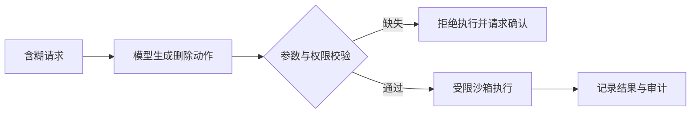

# AI、机器学习与大语言模型：先分清“谁在学习，谁在运行”

想象一家新开的餐厅。老板说“我要让餐厅更聪明”，这句话就像“我要做 AI”一样宽泛：可以是让收银台自动找零，也可以是让学徒看过一万份订单后学会预测备菜量，还可以是让一位语言能力很强的店员负责回答顾客问题。三者都可能被叫作“智能”，但实现方法、成本和失败方式完全不同。

AI、机器学习、深度学习、LLM 和 Agent 描述不同层次的对象。下面沿“数据、训练、模型、推理、Agent 执行”这条链路逐一解释。

## 1. 五个容易混在一起的概念

| 概念 | 通俗解释 | 例子 |
|---|---|---|
| AI（人工智能） | 让机器完成通常需要人类判断的任务，是最大的集合 | 搜索、推荐、语音识别、机器人 |
| ML（机器学习） | 不把所有规则手写出来，而是让程序从数据中调整参数 | 根据历史邮件判断垃圾邮件 |
| 深度学习 | 使用多层神经网络学习复杂表示，是机器学习的一类 | 图像识别、语音识别、语言模型 |
| LLM（大语言模型） | 在大量文本或代码上训练、按 Token 生成序列的模型 | 补全代码、总结文档、回答问题 |
| Agent（智能体） | 把模型放进“观察—决策—行动—反馈”的系统循环 | 读取 issue、修改代码、运行测试并汇报 |

这里最重要的边界是：**模型是一个计算组件，Agent 是包含模型、工具、状态、权限和失败恢复的系统。** 模型能写出一段像命令的文字，不等于系统就应当执行它。

## 2. 一个机器学习系统怎样诞生

最小闭环可以写成：


以垃圾邮件分类为例：

1. 输入是一封邮件，输出是“垃圾”或“正常”。
2. 数据包含邮件和人工标签。
3. 模型接收数字化后的邮件，输出两个类别的分数。
4. 训练过程比较预测和标签，用误差更新参数。
5. 推理过程冻结参数，只对新邮件计算一次结果。

问题定义错了，后面的模型再强也救不回来。例如业务真正关心“不能漏掉钓鱼邮件”，却只优化总体准确率，就可能得到一个看似高分、实际危险的系统。

## 3. 训练与推理不是同一件事

训练像学徒做题并根据答案订正；推理像考试时拿已经学好的方法解一道新题。

| 维度 | 训练（Training） | 推理（Inference） |
|---|---|---|
| 参数 | 反复更新 | 通常冻结 |
| 输入 | 大批训练样本和目标答案 | 用户请求及上下文 |
| 主要计算 | 前向计算、损失、反向传播、优化器更新 | 前向计算和生成 |
| 主要目标 | 学到可泛化的参数 | 在 SLO（服务目标，例如延迟和可用性门槛）内给出结果 |
| 常见资源压力 | 算力、显存、跨卡梯度通信、检查点 | KV Cache（生成时保存的历史注意力中间量）、批处理、排队和尾延迟 |
| 典型失败 | Loss 发散、过拟合、数据污染 | 超时、显存不足、输出不合法、结果不可靠 |

### 一个带数字的小例子

假设模型只有一个参数 `w`，预测公式是：

```text
预测值 = w × 输入
```

训练样本是“输入 3，正确答案 6”。初始 `w = 1`，模型预测 3，误差很大。训练算法把 `w` 往 2 的方向调整。经过很多样本和更新后，得到 `w ≈ 2`。

上线推理时，输入 5，系统直接计算 `2 × 5 = 10`。这次请求不会因为答案好坏而自动修改 `w`。因此，把用户在上下文里给的几个例子称为“训练了模型”通常不准确；这更接近**上下文学习**，参数并没有被梯度更新。

## 4. LLM 到底在学什么

自回归语言模型的核心训练任务是：给定前面的 Token，预测下一个 Token。

例如句子：

```text
北京是中国的 ___
```

模型可能给出：

| 候选 Token | 概率 |
|---|---:|
| 首都 | 0.80 |
| 城市 | 0.12 |
| 省份 | 0.05 |
| 其他 | 0.03 |

正确 Token 是“首都”时，这一步的交叉熵损失可写成：

```text
Loss = -ln(0.80) ≈ 0.223
```

如果模型只给正确答案 0.10 的概率，损失会变成 `-ln(0.10) ≈ 2.303`。训练就是让大量正确后续 Token 的概率整体提高，而不是把事实逐条存进一张可查询的数据库。

这也解释了两个重要现象：

- LLM 擅长生成“在上下文中看起来合理”的序列，但合理不保证真实。
- 同一个模型可以通过 Prompt 表现出许多任务能力，却未必拥有外部世界的最新状态。

## 5. 参数、上下文和外部状态

Agent Infra 面试中，要把三类信息分开：

| 信息放在哪里 | 怎样改变 | 适合什么 | 风险 |
|---|---|---|---|
| 模型参数 | 预训练、微调、强化学习 | 稳定的语言和任务能力 | 更新昂贵，可能遗忘旧能力 |
| 上下文窗口 | Prompt、历史消息、RAG（检索增强生成）文档 | 当前任务的临时信息 | 有长度上限，可能被注入恶意指令 |
| 外部状态 | 数据库、文件、工具、工作流存储 | 最新事实、任务进度、可恢复状态 | 要做权限、并发和一致性控制 |

一个编码 Agent 不应只靠对话历史记住“测试已经运行到第几步”。可靠做法是把任务状态写入可审计的外部存储，把模型输出当作建议或结构化动作，再由运行时校验和执行。

## 6. 模型能力不等于系统能力

模型说“我已经发送邮件”，可能只是生成了一句话。真正的系统至少还需要：

1. 一个有明确输入输出 Schema（字段、类型和约束）的邮件工具；
2. 调用方身份和权限检查；
3. 收件人、正文和附件校验；
4. 幂等键，让同一逻辑请求重试时不会重复发送；
5. 超时、部分失败和审计记录；
6. 高风险操作的人工确认。

因此，评测 Agent 不能只看最终回答“像不像成功”，还要检查工具轨迹、状态变化和副作用。

## 7. 一条典型失败路径

假设一个运维 Agent 收到“帮我清理测试环境磁盘”，模型生成了删除命令：



危险实现会从模型输出直接走到执行。成熟实现会在中间加入确定性校验：路径必须位于允许范围、动作必须匹配权限、删除目标必须解析为明确对象，必要时还要人工批准。

排查失败时可以沿这条链问：

1. 用户目标是否定义清楚？
2. 模型是否选择了正确工具？
3. 参数解析和 Schema 是否正确？
4. 工具是否成功产生预期副作用？
5. 最终回答是否忠实反映工具结果？

## 8. 章末面试问题

### 30 秒答法

> AI 是大范围目标，机器学习通过数据更新参数，深度学习是其中使用多层神经网络的一类，LLM 则用大规模序列训练来预测后续 Token。训练会通过 Loss 和梯度更新参数，推理冻结参数并服务请求。Agent 不是单个 LLM，而是模型加工具、状态、权限、评测和恢复机制；Infra 的职责是让这个非确定组件在确定的安全边界内可靠运行。

### 追问 1：把示例放进 Prompt，算不算训练？

通常不算参数训练。它是上下文学习：示例只在当前上下文中影响前向计算，请求结束后参数不变。若通过梯度持久修改了权重，才是通常所说的训练或微调。

### 追问 2：为什么 LLM 会“自信地说错”？

训练目标主要鼓励预测统计上合理的后续 Token，而不是在每句话生成前查询一个权威事实库。缺少证据、分布外输入或解码策略都可能放大错误，所以系统需要检索、引用、校验和拒答边界。

### 追问 3：Agent Infra 最先保护什么？

先保护权限和外部状态。模型输出默认不可信；工具调用必须经过 Schema 校验、授权、幂等控制、超时和审计，高风险副作用还应有人类确认或确定性策略闸门。

## 9. 本章速记

- AI 是目标集合；ML 从数据学参数；深度学习使用多层网络；LLM 生成 Token；Agent 把模型放入行动循环。
- 训练更新参数，推理使用冻结参数；二者的计算、显存和 SLO 完全不同。
- LLM 学的是条件概率，不是天然可靠的事实数据库。
- Prompt 中的例子通常不更新权重。
- 模型能力、工具能力和系统可靠性必须分开评测。
- 模型输出默认不可信，副作用前要做确定性校验和权限控制。

## 一手资料

- [Attention Is All You Need：Transformer 原始论文](https://arxiv.org/abs/1706.03762)
- [Language Models are Few-Shot Learners：参数学习与上下文学习的重要案例](https://arxiv.org/abs/2005.14165)
- [DeepSeek LLM 技术报告](https://arxiv.org/abs/2401.02954)
- [DeepSeek-V2 技术报告](https://arxiv.org/abs/2405.04434)
