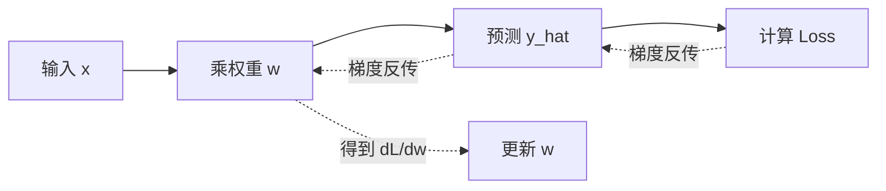

# 数学与学习：Loss、Gradient 和模型怎样“改错”

把训练模型想成蒙着一点雾下山。你站在山坡上，看不见整座山，只能感受脚下哪边更陡。山的高度是 Loss（损失），坡度是 Gradient（梯度），每一步走多远是 Learning Rate（学习率）。沿下坡方向走通常能降低高度，但步子太大可能直接跨过山谷，步子太小又可能天黑还没走到。

> 本章目标：不依赖高等数学背景，理解向量、概率、Loss、梯度、反向传播和优化器，并能根据训练曲线判断几类常见故障。

## 1. 为什么模型世界里到处是向量

计算机最终只能处理数字。一个对象常被表示成一组有顺序的数字，这组数字就是向量。

例如把一个服务请求表示为：

```text
x = [输入 Token 数, 期望输出 Token 数, 优先级]
  = [1000, 200, 2]
```

一个简单打分器有权重：

```text
w = [0.002, 0.01, 0.5]
```

点积把对应位置相乘后相加：

```text
w · x = 0.002×1000 + 0.01×200 + 0.5×2 = 5
```

这个 5 可以再被解释成预计成本、排队权重或某个分类分数。真实神经网络做的是规模大得多的矩阵乘法，但基本积木仍是“数字按维度组合”。

## 2. 从 Logit 到概率

模型通常先输出 Logit，也就是还没有归一化的分数。Softmax 把一组 Logit 变成总和为 1 的概率：

```text
p_i = exp(z_i) / Σ exp(z_j)
```

假设三个候选 Token 的 Logit 是 `[2, 1, 0]`：

| Token | Logit | Softmax 概率（约） |
|---|---:|---:|
| A | 2 | 0.665 |
| B | 1 | 0.245 |
| C | 0 | 0.090 |

Logit 相差 1 并不表示概率也只相差 1；指数函数会放大相对差异。实现 Softmax 时通常先减去最大 Logit，避免 `exp(很大的数)` 溢出。这不会改变最终概率，因为分子和分母同时乘了同一个比例。

## 3. Loss 是“错得多严重”的标尺

分类和语言模型常用交叉熵。若正确答案的预测概率为 `p`，单样本损失是：

```text
Loss = -ln(p)
```

| 正确答案概率 | Loss（约） | 直觉 |
|---:|---:|---|
| 0.90 | 0.105 | 很有把握且答对 |
| 0.50 | 0.693 | 犹豫 |
| 0.10 | 2.303 | 很不相信正确答案 |

Loss 是训练算法可以优化的代理目标，不等于业务价值。一个 Agent 的 Token Loss 下降，不保证它更少调用危险工具，也不保证用户任务成功率上升。生产系统还要单独评测工具选择、参数正确性、权限违规和端到端完成率。

## 4. 梯度告诉参数往哪边改

先看一个只有一个参数的模型：

```text
预测 y_hat = w × x
Loss L = (y_hat - y)²
```

给定 `x = 2`、正确答案 `y = 8`、初始 `w = 3`：

```text
y_hat = 3 × 2 = 6
L = (6 - 8)² = 4
```

用链式法则计算梯度：

```text
dL/dw = 2(y_hat - y) × x
      = 2(6 - 8) × 2
      = -8
```

若学习率 `η = 0.1`，梯度下降更新为：

```text
w_new = w - η × dL/dw
      = 3 - 0.1 × (-8)
      = 3.8
```

新预测为 `3.8 × 2 = 7.6`，新 Loss 为 `0.16`，确实比 4 小。负梯度并不是“坏梯度”，它只是说明增加 `w` 能让 Loss 下降。

## 5. 反向传播是怎样工作的

神经网络由许多小计算组成，前向传播从输入算到 Loss，反向传播则从 Loss 反向应用链式法则。



自动微分框架会记录计算图和每个算子的局部导数。它不需要符号化地“理解整条公式”，只需把局部梯度按链式法则相乘和累加。

需要分清三个阶段：

1. `forward`：得到预测和 Loss；
2. `backward`：计算每个可训练参数的梯度；
3. `optimizer.step`：根据梯度真正修改参数。

只调用反向传播而不执行优化器更新，参数不会变化；忘记清空累计梯度，则下一批次可能混入上一批的梯度。

## 6. Batch、Step 和 Epoch

假设训练集有 10,000 条样本，Batch Size 是 100：

- 一个 Batch：100 条样本共同计算一次梯度；
- 一个 Step：通常指进行一次参数更新；
- 一个 Epoch：完整看完 10,000 条样本；
- 每个 Epoch 约有 `10,000 / 100 = 100` 个 Step。

更大 Batch 往往能提高硬件利用率并减小梯度噪声，却需要更多内存，也不保证泛化更好。梯度累积可以用多个小 Batch 模拟更大的有效 Batch，但参数更新频率和数值行为仍要明确记录。

## 7. 学习率与优化器

最简单的随机梯度下降写成：

```text
θ_new = θ_old - η × gradient
```

其中 `θ` 表示所有参数，`η` 是学习率。Adam 一类优化器还会维护梯度的一阶、二阶统计，让不同参数获得自适应步长。它不是“永远比 SGD 好”的魔法；优化器、学习率、Warmup、衰减计划和 Batch Size 是相互作用的。

| 现象 | 可能原因 | 首先检查 |
|---|---|---|
| Loss 几乎不动 | 学习率太小、参数冻结、数据或标签错 | 梯度范数、可训练参数、单批过拟合 |
| Loss 剧烈振荡 | 学习率太大、Batch 太小、数值不稳 | 降学习率、检查异常样本和精度 |
| Loss 变成 NaN | 溢出、除零、坏输入、梯度爆炸 | 第一个非有限值出现在哪个算子 |
| 训练 Loss 降、验证变差 | 过拟合或数据分布不同 | 数据切分、正则化、训练时长 |

## 8. 一条典型失败路径：学习率过大

仍用前面的单参数例子，但把学习率改为 `η = 1`：

```text
w: 3 → 11
预测: 6 → 22
Loss: 4 → 196
```

更新方向原本正确，步子却跨过了最优点。下一步梯度会反向且更大，参数可能在山谷两边越来越远，最终溢出为 NaN。

工程上不要只看到 NaN 就“把所有值裁剪掉”。更可靠的排查顺序是：

1. 固定随机种子和最小可复现 Batch；
2. 定位第一个非有限的激活、Loss 或梯度；
3. 检查输入范围、除法、对数和混合精度缩放；
4. 比较降低学习率、梯度裁剪前后的曲线；
5. 确认修复没有掩盖错误数据。

## 9. DeepSeek Agent Infra 面试怎么问

### 30 秒答法

> Loss 把预测质量变成可优化的标量；梯度表示 Loss 对每个参数的局部变化率；反向传播用链式法则从 Loss 向前面的算子传播梯度；优化器再按学习率更新参数。训练故障不能只看一个 Loss 数字，要同时看训练与验证曲线、梯度范数、数值稳定性和真正的业务评测。

### 追问 1：为什么正确 Token 概率越低，交叉熵越大？

因为 `-ln(p)` 在 `p` 接近 0 时快速增大，它会强烈惩罚“很自信但把正确答案概率压得很低”的预测。

### 追问 2：反向传播和梯度下降有什么区别？

反向传播负责算梯度；梯度下降或 Adam 负责使用梯度更新参数。前者是求导过程，后者是优化策略。

### 追问 3：训练 Loss 下降，为什么线上 Agent 仍可能变差？

Loss 只对应训练目标和训练分布。工具成功率、长任务恢复、安全违规、延迟和成本不是自动包含在 Token Loss 中的，必须用独立数据和端到端指标验证。

### 追问 4：Batch 越大越好吗？

不是。它可能提升吞吐和梯度稳定性，但增加显存与排队，更新次数减少，还可能改变泛化。应在目标硬件和评测集上联合选择 Batch、学习率和累积步数。

## 10. 本章速记

- 向量是一组有含义的数字；矩阵运算是神经网络的基本积木。
- Logit 是原始分数，Softmax 把它变成概率。
- 交叉熵重点惩罚正确答案概率过低。
- 梯度给局部方向，学习率控制步长。
- 反向传播算梯度，优化器更新参数，两者不是同义词。
- 一个 Epoch 看完一次训练集；一个 Step 通常更新一次参数。
- Loss 下降不是业务成功证明，训练指标和系统指标要分层评测。

## 一手资料

- [Learning representations by back-propagating errors：经典反向传播论文](https://doi.org/10.1038/323533a0)
- [PyTorch 官方 Autograd 机制说明](https://docs.pytorch.org/docs/stable/notes/autograd.html)
- [Deep Learning 教材：数值计算、优化与深度网络](https://www.deeplearningbook.org/)
- [Adam 原始论文](https://arxiv.org/abs/1412.6980)
