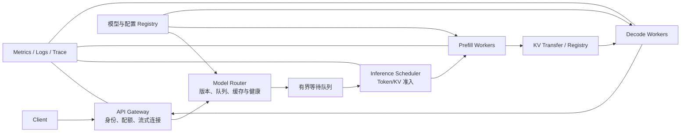
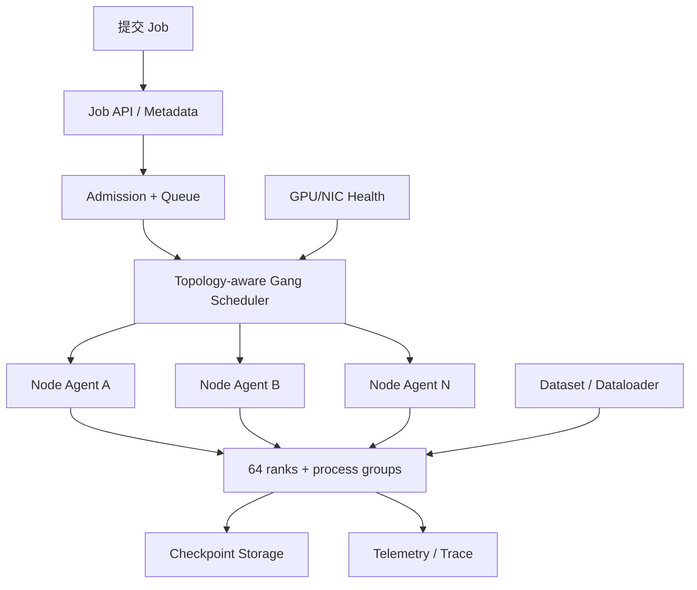
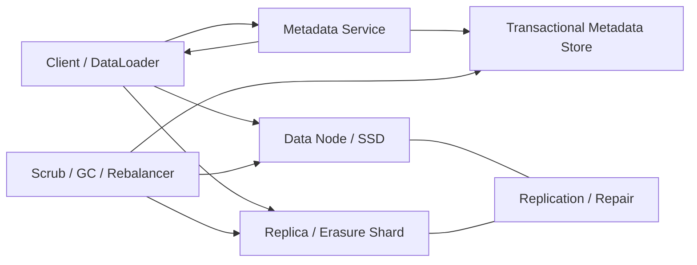

# AI 核心系统设计：推理服务、训练平台与分布式存储

系统设计题不是比谁能在白板上写更多组件名。面试官通常给一个目标，再逐步追问容量、状态、故障和取舍。本章用三个完整案例，把[推理系统](../llm/inference.md)、[分布式训练系统](../llm/distributed_training_systems.md)、[GPU 集群](../platform/gpu_cluster_reliability.md)和[AI 分布式存储](../platform/ai_distributed_storage.md)的机制组合起来；这些章节负责解释原理，本章负责把原理用于需求澄清、估算和故障推演。

每道题都按同一骨架推演：

```text
需求与边界 → 数量级 → 数据/控制流 → 权威状态 → 过载 → 故障恢复 → 验证
```

这不是要求三个岗位使用同一架构，而是建立一种不会漏掉关键问题的思考顺序。

## 1. 案例一：设计一个多租户 LLM 推理服务

### 1.1 先把模糊需求变成可计算条件

题目：为内部产品提供流式 LLM API，支持多个租户、长短 Prompt 和模型滚动发布。

先向面试官确认：

- 模型与精度、单副本需要几张 GPU；
- 峰值请求率、Prompt/输出 Token 分布，而不只是平均值；
- TTFT（首 Token 时间）、TPOT（后续 Token 间隔）和可用性目标；
- 是否支持流式取消、优先级、Adapter 和 Prefix Cache；
- 单区域还是多区域，是否允许降级到其他模型；
- 数据保留、租户隔离与内容审计要求。

下面使用教学数字：假设高峰窗口内，系统稳定接纳 40 请求/秒；平均 Prompt 1,000 Token，平均输出 200 Token；一个已接纳请求从进入生成到结束平均占用 8 秒。它们不是任何公司真实流量。

### 1.2 先算三本账

**并发账**使用 Little 定律。该定律要求到达率和停留时间使用同一个观察边界，并且窗口内系统近似稳定；这里计算的是高峰窗口平均活跃请求，不是瞬时尖峰上限：

```text
高峰窗口平均活跃请求 L = 到达率 λ × 停留时间 W
                     = 40 request/s × 8 s
                     = 320 request
```

**Token 账**分开 Prefill 与 Decode：

```text
Prefill 输入速率 = 40 × 1,000 = 40,000 token/s
Decode 输出速率  = 40 × 200   = 8,000 token/s
```

**KV 账**假设目标模型每 Token KV 为 128 KiB，并进一步假设这 320 个活跃请求在 0～200 个已生成 Token 之间大致均匀分布，所以平均已生成约 100 Token。这里只做平均值粗算：

```text
单请求平均 KV = (1,000 + 已生成平均约100) × 128 KiB
              = 140,800 KiB ≈ 137.5 MiB
320 请求约需 42.97 GiB KV
```

这仍不是采购量：需要按高分位长度、调度碎片、Prefix 共享、权重、工作区和故障余量重新计算。关键是不要把请求/秒直接当成 Token/s，也不要只用总显存除平均 KV。

### 1.3 总体架构



小规模服务可以让同一 Worker 同时做 Prefill 与 Decode；图中分离只是为了展示需要讨论的边界。若分离带来的 KV 网络成本大于调度收益，就应使用合并部署。

### 1.4 每层拥有的状态

| 组件 | 权威状态 | 不能依赖的假设 |
|---|---|---|
| Gateway | 调用身份、租户配额、连接与 request ID | 连接断开不等于 GPU 已取消 |
| Router | 模型版本、副本健康与粗粒度负载 | 路由信息到达 Worker 时仍完全新鲜 |
| Scheduler | 请求阶段、Token/KV 预算、优先级、块所有权 | 排队请求可以无限增长 |
| Worker | 当前 batch、CUDA stream、模型 shard、KV 块 | Kernel 提交成功等于结果已返回 |
| Registry | 可发布模型、Tokenizer、量化与校验信息 | 同名路径内容永远不变 |

请求 ID 用于串联 trace；若客户端对同一逻辑请求重试，还应有稳定的幂等/计费身份。生成本身通常可以重新执行，却可能产生不同 Token 和重复计费，因此不能把重试当透明网络重传。

### 1.5 调度与过载

Scheduler 每一轮按 Token Budget 选择 Prefill chunk 和 Decode 请求，同时检查可用 KV Block。长 Prompt 不能一次垄断设备，Decode 也不能永久饿死新请求。

过载时按顺序保护系统：

1. 按租户和请求长度做准入；
2. 队列达到上限后返回明确的可重试/不可重试状态；
3. 限制最大输入、输出和并发流；
4. 为交互式、批量和控制请求分队列；
5. 只有兼容时才降级模型，并把变化返回调用者；
6. 重试采用预算、退避和抖动，不能由网关无界放大。

### 1.6 发布与模型加载

新副本经历 `Loading → Warming → Ready → Draining → Stopped`。Ready 至少要求：所有 shard 校验通过、进程组建立、代表性 shape 预热、数值 smoke test 和流式取消测试通过。

Router 只把新请求送到 Ready 副本；旧版本先停止接新请求，再让在途序列完成或按明确期限取消。Prefix/KV key 绑定模型版本，因此新旧缓存不会混用。回滚应使用已经验证的旧不可变制品，而不是现场覆盖新文件。

### 1.7 故障推演：Decode Worker 消失

Worker 失联后，控制面先把它标为 Suspect 并停止新路由。正在生成的请求有三种选择：

- KV 只在该 Worker：向客户端返回中断；若选择恢复，就用“原 Prompt + 已经生成的输出 Token”重新 Prefill，只向客户端继续发送尚未返回的新后缀；
- KV 有可靠副本或外部层：在兼容 Worker 恢复，但验证 Token 位置和采样状态；
- 高价值请求：保存生成状态并执行受限恢复。

“在另一张卡继续”不是免费动作。采样随机状态、模型版本、已有输出、KV 布局和计费都要一致。多数在线系统宁可明确中断并重试，也不为所有请求同步复制昂贵 KV。

### 1.8 验证方案

- 正确性：同版本基线、流式顺序、停止原因、取消与一次性释放；
- 容量：按 Prompt/输出二维分布压测，不只固定长度；
- 性能：TTFT、TPOT、Token/s、排队、KV 占用与拒绝率；
- 故障：杀 Worker、断 KV 传输、模型加载失败、Router 信息陈旧；
- 发布：新旧版本并行、排空、回滚与缓存隔离；
- 安全：租户配额、日志内容、模型/Adapter 权限与数据保留。

## 2. 案例二：设计一个 64-GPU 训练平台

### 2.1 需求与对象

题目：用户提交训练代码和配置，平台为一次 64-GPU 作业分配资源，支持日志、Checkpoint、失败恢复和版本追踪。

先定义对象：

- **Job**：用户的一次逻辑训练目标；
- **Attempt**：一次具体启动，失败后可有新 Attempt；
- **Worker/Rank**：参与分布式执行的进程；
- **Resource Lease**：本次 Attempt 对 GPU/CPU/NIC 的有期限所有权；
- **Checkpoint**：可恢复训练状态的已验证版本；
- **Artifact**：代码、镜像、配置、日志和最终模型等不可变制品。

Job 与 Attempt 分开后，第二次启动不会把第一次迟到的心跳或 Checkpoint 当成当前状态。

### 2.2 控制面与数据面



控制面保存期望状态、租约、放置和当前 generation（执行代次）。generation 是每次重启时递增的整数，也可作为 fencing token（隔离令牌）：只有携带当前代次的进程才能续租或发布状态。Node Agent 启动并监督本机进程；训练进程直接走高速数据/通信路径，不让大 Tensor 经过调度数据库。

### 2.3 为什么必须成组调度

64 个 rank 若只启动 56 个，已启动进程会在 rendezvous 等待并占住 GPU。调度器先为满足拓扑的整组资源建立带过期的 Reservation，全部确认后才提交启动；任一节点失败则释放整组，或创建执行代次更高的新 Attempt。

过滤条件包括 GPU 型号/显存/健康、节点内拓扑、RNIC、CPU/内存、软件版本和故障域；打分再考虑数据位置、碎片、网络路径和公平性。不能先按 GPU 数量随机选 8 台机器，再期望通信库修复糟糕拓扑。

### 2.4 并行配置与通信账

假设 `DP=8, TP=4, PP=2`：

```text
总 rank = DP × TP × PP = 8 × 4 × 2 = 64
```

调度器需要把 rank 坐标映射到物理 GPU。频繁 TP 通信通常优先留在高速节点内；DP 组可跨节点；PP 相邻阶段需考虑激活传输。这不是绝对规则，要由模型张量大小和真实拓扑验证。

若一个 8-rank DP 组中，每 rank 都有 4 GiB 梯度，使用理想 ring All-Reduce 时，每 rank 的发送量近似为：

```text
2 × (p-1)/p × N
= 2 × 7/8 × 4 GiB
= 7 GiB
```

每 rank 的接收量也约 7 GiB，因此发送加接收的端点流量约 14 GiB。这只是算法字节近似，不包含协议、分块、拓扑绕路和与计算重叠；它能帮助判断网络是否可能成为下界。

### 2.5 Checkpoint 协议

64 个 rank 不应各自写完一个文件就宣布成功。Checkpoint Controller 为 `(job_id, attempt_id, step)` 创建 WRITING 清单；每个 rank 上传 shard 与 checksum；全部完成后验证模型、优化器、随机数、数据位置和并行元数据，再原子发布 READY。

假设逻辑 Checkpoint 为 1 TiB，目标 120 秒完成：

```text
最低逻辑净写吞吐 = 1024 GiB / 120 s ≈ 8.53 GiB/s
```

两副本时后端物理写入近似 2 TiB，平均约 17.07 GiB/s，尚未算其他流量。平台要把 Checkpoint 带宽纳入准入，避免多个大作业同时写爆共享存储。

### 2.6 慢 rank 与卡死排障

对每一步按 rank 记录：取数据、forward、backward、collective、optimizer 和 Checkpoint 时间。若一张卡最早在 forward 变慢，查降频、Kernel、输入 shape；若所有卡同时卡在 collective，先核对调用顺序与参与者，再查 NIC/链路；若在数据阶段分叉，查 shard、解析和存储热点。

看集群平均 GPU 利用率会丢失最慢参与者。诊断数据必须包含 job/attempt/rank、节点、GPU、NIC、拓扑和软件版本，才能把应用时间线与硬件错误关联。

### 2.7 恢复和旧 Attempt 隔离

Scheduler 判定 Attempt 1 失效并启动 Attempt 2 时，要递增 generation。Node Agent、Checkpoint 发布和状态更新都要求匹配当前 generation。Attempt 1 的旧进程稍后恢复，只能被拒绝，不能覆盖新进度。

恢复选择最新 READY Checkpoint；WRITING 版本不可用。若新资源 mesh 不同，只有 Checkpoint 格式明确支持 reshard 才能转换。否则应等待兼容资源或使用离线转换工具，不能让进程猜分片。

### 2.8 验证方案

- 小规模正确性：单卡、少卡与 64 卡 Loss/梯度对齐；
- 通信：collective 顺序、不同消息大小、拓扑与故障注入；
- 调度：部分预留失败、超时、队列公平、节点上下线；
- Checkpoint：每个崩溃点、坏 shard、空间不足、恢复和 reshard；
- 硬件：慢卡、Xid、ECC、链路降级与隔离—验证—返场；
- 发布：驱动/框架/通信库版本矩阵和逐批节点升级。

## 3. 案例三：设计训练数据与 Checkpoint 存储

### 3.1 先给工作负载，而不是先画存储节点

题目给出：

- 10 PiB 不可变训练数据，以 64–512 MiB shard 保存；
- 峰值 5,000 个训练 worker 并发随机读；
- 每小时约 20 个作业写 Checkpoint，每个逻辑大小 1 TiB；
- 希望单节点/单盘故障不丢已确认 READY Checkpoint；
- 需要按数据集和租户授权，支持版本化与删除。

必须继续确认读取块大小、预期聚合吞吐、小文件比例、恢复时间、机架/地域故障模型、复制或纠删码政策和预算。10 PiB 容量本身不能推出节点数。

### 3.2 API 与数据模型

不可变训练 shard 和 Checkpoint 内容适合对象/内容寻址；为兼容 DataLoader，也可以在上层提供文件接口。权威元数据记录：

```text
Dataset(id, version, manifest, acl, state)
Object(hash, logical_size, encoding, placement, checksum)
Checkpoint(job, attempt, step, manifest, state)
Lease/Capability(subject, object/range, rights, expiry)
```

Capability 是限制了主体、对象范围、操作权限和过期时间的访问凭证。数据对象可先上传，Dataset/Checkpoint manifest 验证后再把状态切到 READY。路径只是名字，恢复以不可变 ID、版本和 checksum 为准。

### 3.3 元数据与数据路径



元数据服务进行身份、版本、放置和 capability 检查；客户端拿到映射后直接访问数据节点。缓存可位于客户端和本地 NVMe，但 key 必须包含内容/数据集版本与授权域。

### 3.4 容量与带宽账

若 10 PiB 逻辑数据使用 2 副本，先忽略元数据和临时空间：

```text
物理数据约 = 10 PiB × 2 = 20 PiB
```

若改用 `k=8, m=2` 纠删码，理想编码开销：

```text
(k+m)/k = 10/8 = 1.25
物理数据约 = 12.5 PiB
```

纠删码节省容量，却会增加编码、故障重建、小写和读取多个 shard 的成本。训练数据不可变、对象较大时更容易适用；写入中的 Checkpoint 是否直接编码，要看恢复与突发写路径。

Checkpoint 逻辑写入平均量为：

```text
20 job/hour × 1 TiB = 20 TiB/hour
平均仅约 5.69 GiB/s
```

但平均值掩盖同时写入。若 5 个作业都要在 120 秒完成：

```text
5 TiB / 120 s ≈ 42.67 GiB/s 逻辑净写
```

系统必须按突发准入和限速，而不是用全天平均容量承诺。

### 3.5 一致性与故障

读不可变 READY 对象很直接；复杂点在名字发布、删除、放置更新和故障修复。元数据更新使用条件版本或事务，防止两个写者覆盖 manifest。数据节点返回对象版本与 checksum，客户端不能把旧副本当新版本。

节点失败后，系统先保证仍能从足够副本/片段读取，再后台重建到新故障域。重建流量受限，避免与训练争满网络。若剩余冗余已低于安全阈值，可暂停低优先写入并提高修复优先级。

删除采用标记—保护窗口—物理回收。训练运行、审计保留或 Checkpoint manifest 仍引用的对象不能删；上传失败的 orphan 另按年龄清理。

### 3.6 热点和小读

5,000 个 worker 在 epoch 开始同时打开同一 manifest，会制造元数据热点；随机打散若偏向少数 shard，也会制造数据节点热点。处理方式包括客户端缓存不可变 manifest、对 shard 做足够分散、批量/预取读取、本地 NVMe 缓存和按真实 key 分布扩展元数据。

优化后同时测：聚合 GB/s、每 worker p50/p99、元数据 QPS、设备队列、缓存命中、GPU 等数据时间和失败重试。只看存储服务器峰值读带宽无法证明训练更快。

### 3.7 验证方案

- 语义：并发发布、旧版本读取、ACL、删除与引用；
- 完整性：写入中断、坏 checksum、静默损坏巡检和修复；
- 性能：大块顺序读、随机小读、元数据热点、Checkpoint 突发；
- 故障：盘/节点/机架、元数据 leader、网络分区和慢副本；
- 恢复：达到 RPO（Recovery Point Objective，可接受最多丢失多少时间的数据）与 RTO（Recovery Time Objective，允许多久恢复服务），且修复不压垮前台；
- 容量：复制/编码、临时上传、重建余量、保留与 GC。

## 4. 三道题共同的失分点

- 未确认模型、shape、流量或故障模型就给固定机器数；
- 只画正常流量，不写权威状态、取消、超时和迟到结果；
- 把队列写成无限缓冲，把重试写成万能恢复；
- 只报平均吞吐或利用率，不看 Token/长度分布与最慢 rank；
- 一说 Kubernetes、NCCL、RDMA 或 3FS 就停止解释机制；
- 性能方案没有正确性基线、同步计时、故障演练和回滚。

## 5. 做题方法：每个组件都回答七个问题

1. 它解决哪个明确需求？
2. 它拥有什么权威状态？
3. 输入、输出和完成信号是什么？
4. 容量满时等待、拒绝、抢占还是降级？
5. 超时后结果是失败还是未知？
6. 崩溃重启后从哪里恢复，怎样拒绝旧执行者？
7. 用什么数字、日志、trace 或实验验证它？

如果一个框只会回答“提高性能”或“保证高可用”，它还不是设计。

## 6. 章末问题

1. 推理服务为什么要分别计算请求并发、Prefill Token/s、Decode Token/s 与 KV 容量？
2. 推理副本进入 Ready 前为什么要加载、校验、预热和数值检查？
3. 训练 Job 与 Attempt 为什么要分开？旧 Attempt 怎样被阻止？
4. `DP=8, TP=4, PP=2` 需要多少 rank？为什么 rank 映射要考虑拓扑？
5. 10 PiB 数据使用 2 副本和 `8+2` 纠删码时，理想物理容量分别是多少？
6. 每小时 20 TiB Checkpoint 的平均写入不高，为什么仍可能压垮存储？

## 7. 参考答案与解答

<details>
<summary>展开答案</summary>

1. 请求并发决定在途状态和连接，Prefill Token/s 决定输入计算，Decode Token/s 决定持续生成，KV 随序列长度和并发占显存。相同 40 request/s 在 Prompt 100 与 100K Token 下是完全不同负载；只算一个量会错误估容。
2. 端口只说明进程可连接。分片可能缺失或损坏，进程组可能未建立，首次 JIT/工作区会造成尖峰，数值路径也可能不兼容。Ready 是“这个确定版本已能正确服务代表性请求”的承诺，因此需要完整门禁。
3. Job 是逻辑目标，Attempt 是一次执行。失败重启会产生新 Attempt，并递增 generation；租约、心跳、状态更新和 Checkpoint 发布都检查当前 generation。旧进程恢复后因执行代次过期而被资源服务拒绝，不能覆盖新状态。
4. `8×4×2=64` rank。TP 常每层通信，通常偏好更近的节点内高速链接；PP 相邻阶段搬激活，DP 同步梯度。物理映射影响通信路径、带宽和故障域，不能只给 rank 编连续号码。
5. 2 副本约 `10×2=20 PiB`。`8+2` 纠删码理想开销 `(8+2)/8=1.25`，约 `10×1.25=12.5 PiB`。实际还需元数据、临时对象、修复和安全余量；纠删码也增加计算与重建成本。
6. `20 TiB/hour` 平均约 `5.69 GiB/s`，但多个作业可能同步到同一步骤并在几分钟内同时写入。5 个 1 TiB Checkpoint 若都要求 120 秒完成，逻辑写入约 `42.67 GiB/s`，复制后更高；还会与数据读取共享网络、设备和元数据。因此要按突发而非小时平均准入。

</details>

## 8. 本章小结

- 推理设计要把请求、Token、KV、版本与流式生命周期同时建模。
- 训练平台要把 Job/Attempt、成组调度、rank 拓扑、Checkpoint 和硬件健康连成状态机。
- AI 存储从数据集、权重、Checkpoint 与 KV 的访问模式出发，而不是先选产品。
- 所有容量题都区分平均与突发、逻辑与物理、总量与可组合资源。
- 所有故障题都找权威状态、未知结果、旧执行者和恢复来源。
- 架构只有经过正确性、容量、性能、故障和发布验证，才从白板变成可交付设计。

## 一手资料

- [DeepSeek 官方招聘](https://talent.deepseek.com/)：训练/推理框架、超算集群、高性能存储与 Agent Infra 的公开职责。
- [PyTorch Distributed Overview](https://docs.pytorch.org/tutorials/beginner/dist_overview.html)：分布式并行接口与选择。
- [NCCL Collective Operations](https://docs.nvidia.com/deeplearning/nccl/user-guide/docs/usage/collectives.html)：集合通信正式语义。
- [Kubernetes Device Plugins](https://kubernetes.io/docs/concepts/extend-kubernetes/compute-storage-net/device-plugins/)：GPU 等扩展设备的节点接口。
- [DeepSeek 3FS](https://github.com/deepseek-ai/3FS)：训练数据、Checkpoint 与 KV Cache 存储的公开案例。
- [Orca（OSDI 2022）](https://www.usenix.org/conference/osdi22/presentation/yu)与[PagedAttention/vLLM](https://arxiv.org/abs/2309.06180)：连续批处理与 KV 块管理。
