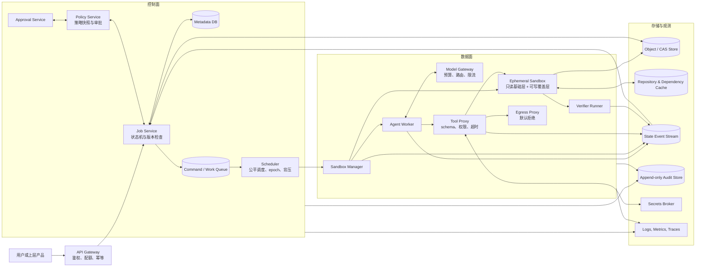
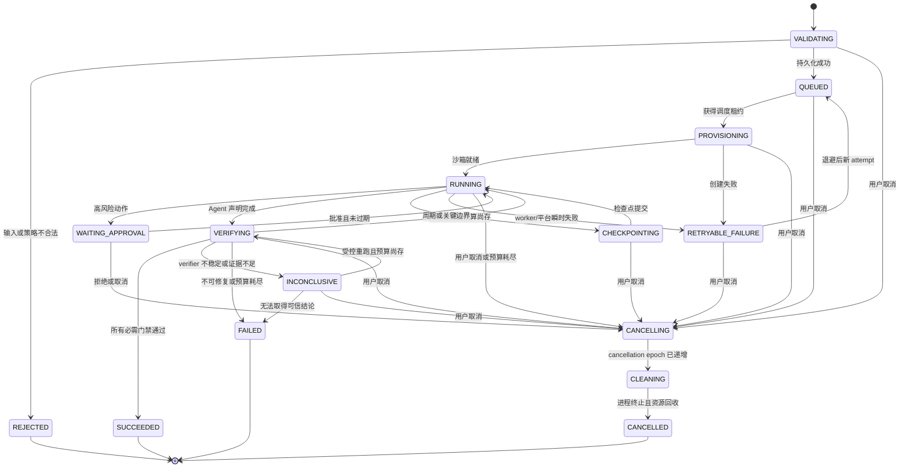

# 系统设计白板：DSec Coding Agent 安全沙箱平台

> **重要声明**：DSec 是 DeepSeek 官方 Agent Infra JD 中出现的平台名称，公开材料没有给出它的英文全称或内部实现。下文把它当作系统设计题来练习；需求、流量、架构、API、SLO 和取舍都是教学假设，不是 DeepSeek 或任何公司的内部事实，也不表示候选人过去已经实现过整套平台。

## 1. 先用人话理解题目

假设用户把一个代码仓库交给 Coding Agent，并说：“修复这个 bug，运行测试，把补丁给我。”模型会读取不可信代码、生成命令、修改文件、联网下载依赖，还可能请求凭证。问题不只是“模型能不能写对代码”，更是：

- 它能看到哪些文件？
- 它能执行哪些命令？
- 恶意仓库能否借机读取别人的数据？
- Agent 陷入循环或命令挂死时，谁来停止？
- worker 崩溃后，任务怎样恢复而不是重做一切？
- 用户如何知道每一步发生了什么？
- 最终补丁如何经过测试和人工批准？

所以 DSec 不是一个聊天页面，而是一个**不可信任务执行平台**。模型给出意图；策略系统决定是否允许；沙箱执行动作；状态机记录进度；验证器检查结果；人类在高风险边界作最终决定。

如果上面一串名词还像“组件拼盘”，先用系统地基补因果链：从[一次程序怎样跑起来](../systems/computer_execution.md)开始，再读[进程与系统调用](../systems/process_threads_syscalls.md)、[网络与 RPC](../systems/network_rpc.md)、[文件系统与数据库](../systems/filesystem_database.md)和[分布式系统地基](../systems/distributed_foundations.md)。白板中的每条箭头都应能继续下钻到线程、内存、协议、持久化或共识，而不是停在产品名。

## 2. 30 秒答法

> 我会先把模型和仓库都视为不可信输入，把平台拆成控制面和数据面。控制面负责鉴权、配额、任务状态机、策略版本、调度和审批；高频的模型与工具请求走数据面。一次性沙箱中的所有动作都经过 Tool Proxy，接受 schema、最小权限、网络、预算和审计检查。任务用持久状态、事件和快照恢复；队列允许至少一次投递，调度租约携带单调递增的 fencing epoch，让旧 worker 不能提交。step 的 attempt 用于追踪，外部副作用则使用跨 attempt 稳定的 logical_effect_id。模型输出不能直接改变生产状态，平台规定的 verifier 和必要人工审批才决定结果。

这段开场后，要立刻问需求和流量，不要直接堆组件名。

## 3. 需求澄清

### 3.1 用户故事

本题先支持四类任务：

1. 读取指定仓库快照并回答代码问题。
2. 修改工作区，运行构建、测试和静态检查，输出补丁与报告。
3. 在用户许可的网络范围内下载依赖或访问工单、代码托管等工具。
4. 任务中途暂停等待人工批准，随后继续、取消或从检查点重试。

### 3.2 功能需求

- 创建、查询、流式观察、取消和重试任务。
- 固定仓库快照、模型、Skill、工具和策略版本。
- 每个任务拥有隔离工作区、CPU/内存/磁盘/时间预算。
- 工具调用经过 allowlist、参数 schema、权限和风险检查。
- 网络默认拒绝，只允许声明的目标和协议。
- 支持模型调用、命令执行、文件读写、补丁生成和 verifier。
- 保存结构化轨迹：输入、决策、工具参数、返回摘要、文件变化、策略结果。
- 对部署、凭证使用、外部写操作等高风险动作要求人工审批。
- worker 失败后从已提交检查点恢复；重复消息不重复产生外部副作用。
- 最终产物包括 patch、测试结果、日志摘要和风险说明。

### 3.3 非功能需求

- **隔离**：不同租户、任务和尝试之间不能读取彼此数据。
- **可审计**：谁在什么策略下允许了什么动作，可以追溯。
- **可取消**：用户取消后，正在运行的进程和后续工具调用都应停止。
- **可恢复**：控制面或 worker 短暂故障不应丢任务状态。
- **可扩展**：高峰时可水平增加沙箱 worker 和模型网关容量。
- **成本可控**：限制模型 token、执行时间、并发和存储保留期。
- **结论可验证**：最终成功不由模型自报，而由 verifier 与策略决定。

### 3.4 暂不支持

- 不训练基础模型。
- 不允许 Agent 绕过审批直接操作生产环境。
- 不承诺任意程序都能确定性重放；外部网络、时钟和随机数需要记录或替身。
- 第一版不支持在同一可写目录中运行多个并行 Agent；先用独立分支工作区和显式合并。

### 3.5 练习 SLO

以下数字只为完成白板推导：

- 控制面 API 月可用性目标 99.9%。
- 99% 的已接受任务在 2 秒内进入持久队列。
- 发出取消后，99% 的沙箱在 5 秒内停止新动作并开始回收。
- 已被 API 确认接收的任务状态事件，在单区域故障假设内目标 RPO 为 0；跨区域灾难的 RPO/RTO 另行声明并演练。审计事件按租户至少保存 30 天。
- 数据面不承诺单个任务必然成功，因为仓库、模型和外部工具都可能失败；应分别报告平台成功与任务成功。

## 4. 容量估算

系统设计里的数字不是竞猜。先声明假设，再用它暴露瓶颈。

### 4.1 假设

- 每天 10 万个任务，平均约 1.16 个任务/秒。
- 高峰为平均的 10 倍，按 12 个任务/秒设计。
- 每任务平均 20 个 Agent step。
- 每 step 平均一次模型调用，模型等待 4 秒、工具执行 2 秒；先按串行估算。
- 平均每 step 产生 25 KB 结构化轨迹。
- 每任务最终 patch、报告和必要日志平均 5 MB。
- 一次模型调用平均消耗 2,000 个输入 token 和 500 个输出 token。

### 4.2 推导

1. **并发任务数**

   平均任务时长约为：

   ```text
   20 × (4 秒模型等待 + 2 秒工具执行) = 120 秒
   ```

   根据“小餐馆同时有多少桌客人 ≈ 每秒进店人数 × 每桌停留时间”的直觉，高峰活跃任务约：

   ```text
   12 任务/秒 × 120 秒 = 1,440 个任务
   ```

   加上抖动和故障重试，可先把 2,000 当作**并发任务数量级**，不能直接等同于 2,000 个同规格沙箱。实际还要看任务是否在模型等待时继续占用沙箱，以及 CPU、内存、临时盘和 I/O 的资源向量。

2. **模型调用峰值**

   ```text
   12 任务/秒 × 20 次调用/任务 = 240 次模型调用/秒
   ```

   这要求模型网关做配额、排队、路由和背压，不能让所有 worker 无限制重试。

3. **每日 token 量**

   ```text
   100,000 × 20 × 2,500 = 5,000,000,000 token/天
   ```

   5B token/天说明上下文裁剪、前缀缓存、较小模型路由和减少无效 step 可能比省几个 API 请求更重要。

4. **轨迹存储**

   ```text
   100,000 × 20 × 25 KB ≈ 50 GB/天
   ```

   30 天原始轨迹约 1.5 TB，尚未计索引和副本。热查询保存结构化摘要，完整 stdout/stderr 和大文件转对象存储并设置生命周期。

5. **产物存储**

   ```text
   100,000 × 5 MB = 500 GB/天
   ```

   不能每天复制完整仓库。应固定 commit 或内容哈希，使用只读仓库缓存、写时复制工作层和内容寻址存储；长期只保留 patch 与必要证据。

### 4.3 再把“任务数”换成资源向量

只算 2,000 个任务，就像只知道餐厅有 2,000 位客人，却不知道有人只喝水、有人要占一张大桌。面试时可先构造下面的**练习分类**，再说明生产值必须从 trace 与压测取得：

| workload class | 并发占比假设 | 每个运行沙箱的练习 request | 还要单独测什么 |
|---|---:|---|---|
| 只读/轻工具 | 35% | 1 vCPU、2 GiB、5 GiB 临时盘 | 模型等待时能否休眠或释放计算槽 |
| 普通编译测试 | 50% | 2 vCPU、6 GiB、20 GiB 临时盘 | 冷/热依赖缓存、随机 IOPS、日志写入 |
| 重型构建 | 15% | 8 vCPU、24 GiB、80 GiB 临时盘 | p95 时长、启动突发、网络与镜像带宽 |

计算节点数时，对 CPU、内存、临时盘容量、IOPS、网络带宽和启动并发分别求上限，最后取最紧的那一项；再为单节点故障、一个故障域下线、重试和长尾留下余量。不要用平均时长掩盖 p95 重型任务，也不要默认模型等待时沙箱一定可以销毁。

### 4.4 估算后的架构结论

- 模型网关和沙箱槽位是两套不同资源池，必须分别限流。
- 仓库与依赖缓存要去重，但可写工作层必须按任务隔离。
- 轨迹和产物保留策略是核心成本问题，不是上线后的清理工作。
- 队列等待时间、模型等待时间和工具执行时间必须分开观测。

## 5. API 设计

### 5.1 创建任务

```http
POST /v1/jobs
Idempotency-Key: 8d0c...client-generated...
Authorization: Bearer <token>
Content-Type: application/json

{
  "repository": {
    "uri": "repo://tenant/project",
    "revision": "immutable-commit-or-snapshot"
  },
  "task": "修复给定问题并运行允许的测试",
  "execution_profile": "untrusted-code-standard",
  "model_policy": "coding-balanced-v3",
  "tool_policy": "repo-read-write-test-no-public-egress",
  "budgets": {
    "wall_time_seconds": 1800,
    "model_tokens": 200000,
    "cpu_seconds": 3600,
    "memory_mb": 8192,
    "disk_mb": 20480
  },
  "requested_additional_checks": ["project-lint"]
}
```

返回值只表示平台已经接收并持久化任务，不表示任务成功：

```json
{
  "job_id": "job_01...",
  "state": "QUEUED",
  "policy_snapshot": "sha256:...",
  "verifier_snapshot": "sha256:platform-signed-profile...",
  "created_at": "..."
}
```

`Idempotency-Key` 使客户端超时重试时不会创建两个任务。服务端必须把它与租户绑定，并保存请求摘要，防止同一个 key 被用于不同请求。

`compile`、隐藏测试、patch policy 等**必需 verifier 由平台签名的 execution profile 决定**，客户端不能把它们删掉或换成更弱版本。用户只能追加检查。verifier 的代码、测试快照和 runner 与 Agent 的可写工作区分离，并按哈希固定；否则恶意仓库可能修改“裁判”。

### 5.2 查询与流式事件

```http
GET /v1/jobs/{job_id}
GET /v1/jobs/{job_id}/events?after=<cursor>
GET /v1/jobs/{job_id}/artifacts
```

事件应是结构化类型，如 `MODEL_REQUESTED`、`TOOL_DENIED`、`FILE_DIFF_CREATED`、`VERIFIER_FAILED`，而不是只有一大段文本日志。敏感工具输出存储前必须脱敏。

### 5.3 取消、审批与重试

```http
POST /v1/jobs/{job_id}:cancel
POST /v1/jobs/{job_id}/approvals/{approval_id}:decide
POST /v1/jobs/{job_id}:retry
POST /v1/jobs/{job_id}:replay
```

- `cancel` 是幂等操作；终态再次取消仍返回当前状态。
- 审批请求携带动作摘要、资源范围、过期时间和文件 diff，不把完整秘密暴露给审批页面。
- `retry` 创建新 attempt，保留旧轨迹；不能覆盖原失败证据。
- `replay` 默认使用相同仓库、模型、Skill、工具和策略版本。外部依赖无法固定时应标注“非确定重放”。

### 5.4 内部工具协议

模型不直接访问 shell、网络或任何能力票据，只提交**无凭证的结构化意图**：

```json
{
  "job_id": "job_01...",
  "step_id": 17,
  "attempt": 1,
  "tool": "run_command",
  "arguments": {
    "argv": ["cargo", "test", "-p", "target_package"],
    "cwd_handle": "workspace-root",
    "timeout_seconds": 300
  }
}
```

可信 Orchestrator 根据当前策略、租约和预算做授权，再在模型与沙箱都看不到的服务间信道中附加短期执行信封：

```json
{
  "intent_digest": "sha256:...",
  "logical_effect_id": "effect_stable_across_attempts",
  "fencing_epoch": 42,
  "cancellation_epoch": 3,
  "capability": "short-lived-proxy-only-capability"
}
```

Tool Proxy 验证 capability 的 audience、tenant、job、tool、resource、epoch、expiry 和一次性 nonce。使用 `argv` 数组而不是拼接 shell 字符串，可以减少转义和注入风险，但仍需检查命令、路径、环境、网络和子进程。

## 6. 总体架构



### 6.1 为什么拆控制面与数据面

- 控制面做“决定”：任务是否允许、给谁执行、策略是哪一版、状态怎样迁移。
- 数据面做“动作”：启动沙箱、调用模型、执行命令、修改文件、运行 verifier。
- 数据面处理不可信内容，爆炸半径应尽量小；它不能自行放宽控制面策略。
- 控制面负载较轻但状态重要；数据面负载重、波动大、需要快速扩缩。

### 6.2 数据所有权

- Metadata DB 保存任务当前状态、版本号、租约、预算和索引，是控制状态的事实来源。
- Command/Work Queue 传递“要执行什么”，采用至少一次投递、短到中等保留期，并按负载背压。
- State Event Stream 传递“发生了什么”，用于状态归并、追踪和有限期重放；它不承担 worker 抢任务的语义。
- Object/CAS Store 保存仓库快照引用、patch、检查点和大日志。
- Audit Store 保存不可篡改的责任证据，保留期和访问控制不同于工作队列及普通日志。

共享 CAS 与依赖缓存按租户或信任域授权：先鉴权再查缓存，敏感租户使用独立加密域；对象必须绑定来源、内容哈希和签名/构建 provenance。接口不能向未授权调用者暴露“某哈希是否命中”，否则全局去重会变成存在性侧信道。可写层永不跨租户复用。

为了避免“数据库已提交但消息没发出去”，Job Service 可使用事务 outbox：状态变更和待发送事件同事务写入，再由 relay 投递。消费者按 event id 幂等处理。

## 7. 任务状态机与执行语义



### 7.1 单写者与租约

同一 attempt 只允许一个 worker 推进状态。Scheduler 每次分配都在数据库事务中递增单调 `fencing_epoch`，并发放带过期时间的租约；worker 定期续租。状态提交同时检查版本、epoch、取消代数和数据库看到的租约有效期：

```text
UPDATE job
SET state = ?, version = version + 1
WHERE job_id = ?
  AND version = ?
  AND lease_owner = ?
  AND fencing_epoch = ?
  AND cancellation_epoch = ?
  AND lease_expires_at > database_now()
```

只检查 `lease_owner` 不够：租约过期后、接管前，旧 worker 仍可能写。数据库、Tool Proxy、卷服务与结果服务都记录已经见过的最高 fencing epoch，拒绝更小 epoch；租约过期后也拒绝当前 epoch。取消先递增 `cancellation_epoch`，使排队中和在途的旧能力立即失效，再终止进程组和清理资源。单靠数据库锁仍挡不住已经发往外部系统的副作用。

### 7.2 step 幂等

`(job_id, attempt, step_id, tool_call_id)` 用于追踪一次具体尝试，但**不能充当外部副作用的幂等身份**，因为新 attempt 会改变它。Orchestrator 在第一次执行前持久化跨 attempt 稳定的 `logical_effect_id`：

- 重复的纯读取可以返回缓存结果。
- 文件写入在任务覆盖层内按预期旧哈希做 compare-and-swap。
- 外部写操作若目标 API 支持 idempotency key，则透传 `logical_effect_id`；接管后的新 worker 查询同一个动作收据，而不是生成新 key。
- 不支持幂等的高风险外部动作默认禁止，或需要人工确认并采用“执行前/执行后对账”。

这提供的是“至少一次消息投递 + 效果去重/对账”，不是脱离外部系统配合的神奇 exactly-once。

### 7.3 取消的规范规则

所有非终态都接受取消。尚未创建资源的任务仍先递增取消代数，再移出队列；持有资源的状态经过 `CANCELLING → CLEANING → CANCELLED`。只有完成进程终止、Tool Proxy 拒绝旧代数、挂载卸载和临时资源回收后，才进入 `CANCELLED`。属性测试至少证明：取消代数递增后不能出现新的外部可见提交；终态不能返回运行态；旧 epoch 永远不能覆盖新 epoch。

### 7.4 检查点

检查点至少包含：

- 固定的仓库基础快照与当前文件 diff；
- Agent 的结构化状态摘要，而不是无限增长的完整上下文；
- 已完成 step、预算、工具结果引用和策略版本；
- 随机种子、模型/Skill/工具版本等可复现信息；
- 未完成外部动作的对账状态。

提交顺序应为“产物写入内容存储并获得哈希 → 元数据原子指向新检查点”。否则元数据可能引用一个不存在的对象。

## 8. 一次任务怎样运行

1. API Gateway 验证身份、租户配额和幂等键。
2. Job Service 校验不可变仓库引用、预算和策略，保存状态并写 outbox。
3. Scheduler 按租户公平性、优先级和资源画像选择 worker 池。
4. Sandbox Manager 从只读镜像与仓库缓存创建一次性可写覆盖层，挂载最小设备与文件路径。
5. Agent Worker 向数据面的 Model Gateway 请求下一步结构化动作；控制面只下发路由、预算和模型策略快照。
6. 可信 Orchestrator 为模型意图附加当前 epoch 的短期能力，Tool Proxy 再校验 schema、capability、路径、网络、预算和风险等级。
7. 允许的动作在沙箱执行；输出限长、脱敏并写入轨迹，大输出转对象存储。
8. 每个关键 step 提交事件和必要检查点；失败按分类决定重试、修复、审批或终止。
9. Agent 声明完成后，Verifier Runner 在与可写工作区分离的环境中，加载平台签名的测试/策略快照，执行必需的编译、隐藏测试、静态检查和 patch policy；用户检查只能追加。
10. 所有必需门禁通过才标记 `SUCCEEDED`；返回 patch、验证证据和限制说明，随后回收沙箱。

关键点：验证环境与必需 verifier 的来源必须可信，不能只靠“看起来干净”。Agent 可以提供自己的测试作为证据，但不能修改平台的裁判、隐藏测试或放行规则。

## 9. 安全设计

### 9.1 威胁模型

平台同时面对五类不可信输入：

1. 用户任务可能要求越权动作。
2. 仓库中的 README、代码注释或测试可包含 prompt injection。
3. 模型可能误解、幻觉或生成危险命令。
4. 依赖、编译脚本和测试本身可能恶意执行。
5. 外部工具返回内容也可能诱导后续 Agent 泄露数据。

### 9.2 隔离层

- 基础镜像只读；任务使用一次性写时复制层。
- 进程使用非 root 身份，禁用 privileged 模式和宿主 socket。
- 使用 namespace、cgroup、seccomp 或同等级机制限制进程、内存、CPU、磁盘、系统调用和设备。
- 高风险多租户场景可用 microVM 提高内核隔离；代价是启动时间、内存和运维复杂度。
- 工作区路径由服务端句柄解析，拒绝 `..`、符号链接逃逸和未授权挂载。
- 沙箱销毁前收集指定产物；不能把整个可写磁盘无筛选上传。

### 9.3 工具与网络权限

- Tool Proxy 是唯一受支持的动作出口；模型没有主机凭证。
- 可信 Orchestrator 在模型输出之后生成能力令牌；令牌不进入 Prompt、模型响应或沙箱，绑定 audience、租户、job、tool、资源、动作、fencing/cancellation epoch、过期时间和调用上限。
- 网络默认拒绝，经 Egress Proxy 按域名、解析后 IP、端口和方法允许；重复校验 DNS，阻止访问实例元数据和内网保留地址。
- 下载内容要限制大小、类型并记录哈希；依赖安装脚本仍在沙箱内执行。
- 外部写 API 与只读 API 分开权限；删除、发布、部署、发送消息等动作要求审批或完全禁用。

### 9.4 凭证

- 凭证保存在 Secrets Broker，不写进提示、环境快照或普通日志。
- worker 获取短期、最小范围的代理能力，而不是长期主密钥。
- 工具请求由代理代签或代发，使 Agent 不必看到原始秘密。
- 日志脱敏是补救措施，不是主要边界；真正边界是秘密根本不进入不可信进程。

### 9.5 Prompt injection 的正确认识

“忽略仓库中的恶意指令”不是可靠安全控制。仓库内容只是数据，但模型可能把它当指令。系统必须在模型外强制：

- 仓库文本不能修改策略。
- 模型提出的工具调用必须重新鉴权。
- 工具输出不能自动扩大后续权限。
- 高风险动作需要独立策略或人类批准。
- verifier 检查产物，而不是信任模型声称“测试通过”。

## 10. 故障处理

| 故障 | 检测 | 处理 | 防止扩大 |
|---|---|---|---|
| 模型超时或 429 | 模型调用 trace、错误码 | 有上限的指数退避；可按策略切换模型 | 全局并发限制、重试预算、熔断 |
| Agent 无限循环 | step、token、墙钟和重复动作计数 | 中止或请求人工；保存最后检查点 | 重复调用检测、总预算硬限制 |
| 工具命令挂死 | 心跳、超时、无输出窗口 | 先终止进程组，再回收沙箱 | cgroup、进程数限制、不可屏蔽取消 |
| worker 崩溃 | 租约停止续期 | 租约过期后新 attempt 从检查点恢复 | fencing epoch、稳定 effect id、对账 |
| 队列重复投递 | event id 已存在 | 返回已处理结果 | 至少一次投递 + 消费端幂等 |
| Metadata DB 短暂不可用 | 健康检查、错误率 | 停止领取新任务；仅在最后确认的本地租约期限内继续可丢弃计算 | Tool Proxy 禁止外部可见提交和卷提交，过期即停 |
| 对象存储写失败 | 未获得内容哈希 | 不提交检查点指针，稍后重试 | 元数据后提交、校验和 |
| verifier 不稳定 | 同输入结果不一致 | 标记 `INCONCLUSIVE`，不自动放行 | 固定依赖、隔离环境、flake 分类 |
| 外部写结果未知 | 超时但对端可能已执行 | 用幂等键查询或对账，禁止盲目重试 | 审批、动作收据、补偿流程 |
| 租户资源耗尽 | 配额指标、队列等待 | 降低优先级、拒绝新任务或排队 | 租户级并发、token、存储配额 |
| 大量恶意输出 | 输出大小、压缩比、日志速率 | 截断并存摘要，必要时终止 | 字节预算、防压缩炸弹、流式限速 |

### 10.1 为什么失败要分类

如果所有失败都叫 `FAILED`，平台无法决定是否重试：

- 平台瞬时失败通常可以新 attempt 重试。
- 用户代码编译失败可能交给 Agent 修复。
- 策略拒绝不是系统故障，不能靠重试绕过。
- verifier 不稳定应是 `INCONCLUSIVE`，不能算成功。
- 预算耗尽说明任务需要改变计划或人工决定。

### 10.2 HA 与灾难恢复不能只写一个 99.9%

下面仍是白板练习目标，不是 DeepSeek 内部数据：

| 故障范围 | 练习设计 | 目标口径 |
|---|---|---|
| 单 worker/节点 | 任务事件已持久化；租约过期后用更高 epoch 接管；节点进入隔离和清理 | 已确认状态 RPO 0；恢复受租约超时约束 |
| 单故障域 | Metadata DB 使用跨故障域同步 quorum；工作队列与状态流多副本；对象存储跨域冗余 | 已确认状态 RPO 0；控制面演练 RTO 15 分钟以内 |
| 整个区域 | 第二地域保存异步事件副本、对象副本和独立备份；DNS/流量切换需人工或自动门禁 | 例如 RPO 5 分钟、RTO 60 分钟，必须明确写进产品承诺 |
| 逻辑误删/坏数据 | 时间点恢复、不可变审计、对象版本、定期离线备份 | 恢复演练验证，而不是“有备份”就算完成 |

同步复制解决不了操作者误删，异步异地复制也不等于 RPO 0。每季度可用故障注入验证数据库 failover、队列副本切换、对象恢复和控制面重建；同时检查恢复时是否出现双 worker、旧 epoch 写入或审计缺口。

## 11. 可观测性与审计

### 11.1 三层信号

1. **Metrics** 看整体健康：
   - 接收率、拒绝率、队列长度、排队时间；
   - 活跃沙箱、启动时延、回收失败、资源超限；
   - 模型请求率、首 token/总延迟、token、429、路由比例；
   - 工具成功率、p50/p95/p99、超时、策略拒绝；
   - verifier 通过率、修复轮数、人工审批等待；
   - 每成功任务的模型、计算和存储成本。

2. **Trace** 看一项任务的因果链：
   - 根 span 是 job；子 span 是 attempt、model call、tool call、checkpoint、verifier。
   - 传播 job_id、step_id、attempt、policy hash 和 sandbox id。
   - 模型输入输出默认不作为普通可检索标签，避免高基数和敏感数据泄露。

3. **Audit** 回答责任问题：
   - 谁提交任务、哪版策略允许或拒绝、谁审批、调用了哪个外部资源、产物哈希是什么。
   - 审计记录追加写、访问受控、保留期明确；普通 debug 日志不能代替审计。

### 11.2 业务成功与平台成功分开

至少区分：

- 平台执行成功：沙箱、模型和工具链按协议完成。
- verifier 成功：固定版本、可审计的必需门禁通过；不稳定结果进入 `INCONCLUSIVE`。
- 用户任务成功：最终改动真正解决问题，可由人工、隐藏测试或线上反馈判断。

如果只看“Agent 自己说完成”，成功率会严重失真。这与 SkillFuzz 先做参考解准入、再配对和轨迹审查的思想相通。

## 12. 调度、背压与多租户

- Scheduler 按租户使用加权公平队列，避免一个大客户占满所有沙箱。
- 模型 token、沙箱槽位、CPU/内存和网络出口分别计费与限额，不能只限任务数。
- 资源画像区分只读问答、普通构建、大内存测试和需要特定架构的任务。
- 保持小规模预热沙箱池降低启动时间；租户敏感数据进入后绝不回到公共池复用。
- 当模型服务拥塞时，先停止领取新 step，再对低优先任务排队或降级；不要让每个 worker 自行高速重试。
- 队列长度只是结果，真正的背压信号还包括预计等待、token 速率、worker 饱和和依赖服务错误。

## 13. 关键取舍

### 13.1 容器还是 microVM

- 容器启动快、密度高、生态成熟，但共享宿主内核。
- microVM 隔离更强，启动和资源开销更高。
- 可按风险分层：可信内部只读任务用加固容器；执行任意第三方构建脚本的多租户任务用更强隔离。

### 13.2 一个任务一个沙箱，还是共享池

- 独立沙箱边界清楚、清理简单，但冷启动和缓存成本高。
- 共享可提高利用率，却容易残留进程、文件和秘密。
- 推荐共享只读镜像和内容缓存，不共享租户可写层。

### 13.3 事件溯源还是只存当前状态

- 只存当前状态简单省钱，但难以审计、回放和定位第一个错误 step。
- 全量事件昂贵且包含敏感数据。
- 折中是结构化追加事件 + 周期快照 + 大内容外置 + 分级保留。

### 13.4 强确定性还是高成功率

- 固定模型、温度、依赖、网络与随机种子有助重放，但外部模型和工具仍可能变化。
- 生产上应追求“证据可追溯、动作可幂等、结果可验证”，不要承诺无法实现的逐 token 完全确定性。

### 13.5 更长上下文还是更小成本

- 把全部仓库和历史塞进每次请求既贵又可能稀释关键信息。
- 使用仓库索引、按需读取、稳定前缀缓存、结构化状态摘要和检查点。
- 摘要可能丢信息，因此关键约束、未完成动作和证据引用不能只靠自由文本压缩。

### 13.6 自动重试还是人工介入

- 瞬时只读失败适合自动重试。
- 权限拒绝、结果未知的外部写、重复 verifier 失败适合停止并请求人工。
- 重试本身有成本和风险，必须有次数、时间和 token 预算。

## 14. 发布与验证计划

### 14.1 测试金字塔

- 单元测试：状态迁移、策略匹配、路径规范化、预算扣减。
- 属性测试：任意事件序列都不能从终态回到运行态；取消后不能再批准新动作。
- 集成测试：队列重复、worker 崩溃、对象存储失败、租约接管。
- 安全测试：路径逃逸、符号链接、SSRF、fork bomb、压缩炸弹、秘密外泄、恶意构建脚本。
- 端到端测试：固定小仓库、参考 patch 和 verifier，检查正常与对抗任务。
- 混沌演练：杀 worker、断网络、延迟数据库，观察是否双执行或丢审计。

### 14.2 渐进发布

1. 只读代码问答，网络全禁。
2. 允许工作区修改和本地测试，但只输出 patch。
3. 开放受控依赖下载。
4. 接入只读外部工具。
5. 对少数高风险写操作加入双重审批和小流量试点。

每阶段都要有回滚开关、策略版本固定和旧版本兼容。模型升级、Skill 更新、工具升级和策略更新是四类独立变更，不应一次捆绑发布。

## 15. 面试官继续追问时怎么答

### “为什么不用 Kubernetes Job 就结束？”

Kubernetes 可以承担资源编排，但本题还需要任务级状态机、模型预算、工具策略、审批、幂等外部动作、轨迹、verifier 和租户审计。可以用 Kubernetes 实现部分数据面，不能把业务语义全部交给它。

### “怎样保证绝对安全？”

不能承诺绝对安全。应说明威胁模型、分层控制、剩余风险和应急响应。沙箱逃逸、供应链零日、策略误配仍可能发生，所以还需补丁管理、检测、隔离域和最小爆炸半径。

### “为什么不用模型自己判断命令是否危险？”

模型可以提供风险信号，但不能作为最终授权者。权限、路径、网络、预算和审批必须由确定性策略系统执行，否则同一输入可能因采样而获得不同权限。

### “如何与候选人的经历连接？”

可以说这是练习设计，并把方法来源讲清：HFT replay 提供逐事件回放思维；rustc 工作提供不变量和回归门禁；SkillFuzz 提供 reference/verifier/trace 的归因方法；Reaper 提供“边界背后的实现也需要审计”的安全视角。不能说过去已经实现 DSec。

## 16. 常见失分点

- 不问需求和流量，直接画十几个方框。
- 把“模型服务”和“Agent 执行器”混成一个进程。
- 只说 Docker，却不讲租户、内核、网络、凭证和可写层。
- 声称 exactly-once，却没有幂等键、单写者、对账或外部 API 配合。
- 任务状态只有 running/success/fail，无法表达审批、取消、恢复和结果未知。
- verifier 与 Agent 共用可随意修改的环境，导致测试可能被篡改。
- 网络默认开放，再试图靠 Prompt 阻止数据外泄。
- 重试没有上限，故障时形成 token 和请求风暴。
- 指标只有 CPU 和错误率，没有队列、模型、工具、verifier、成本和策略拒绝。
- 把本章练习架构说成 DeepSeek 内部事实，或说成本人已经上线的系统。

## 17. 本章速记

- 一句话：**模型提意图，策略做授权，沙箱做执行，verifier 判结果，人类管高风险。**
- 分两面：控制面管状态、策略、调度；数据面管模型、工具和沙箱。
- 三类身份：`job/attempt/step/tool_call` 用于追踪，`fencing_epoch` 阻止旧 worker，跨 attempt 的 `logical_effect_id` 用于外部效果去重和对账。
- 四种证据：状态事件、工具轨迹、文件 diff、verifier 结果。
- 五类边界：租户、文件、进程、网络、凭证。
- 故障原则：至少一次投递 + 消费幂等；租约单写；检查点先写对象、后提交指针。
- 成功分层：平台成功、verifier 成功、用户任务成功。
- 白板顺序：**需求 → 估算 → API → 架构 → 状态机 → 故障 → 安全 → 观测 → 取舍。**
- 继续练习可使用[题库](question_bank.md)，复习节奏见[学习计划](study_plan.md)。
