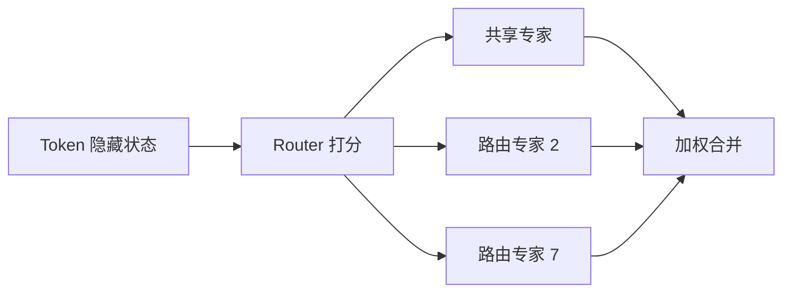
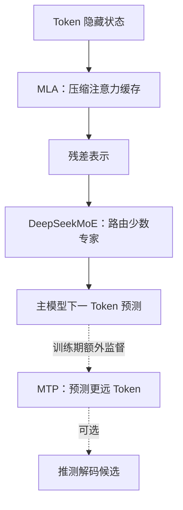

# DeepSeek 架构：MoE、MLA 与 MTP 怎样共同影响系统

想象一家很大的技术支持中心。所有问题都先经过公共前台，但“数据库慢”“GPU 报错”“账号权限”会被分给不同专家；这是 MoE。历史对话若把每句话的完整副本都堆在每位专家桌上，很快就没地方坐，于是前台保存一份可恢复重点的压缩档案；这是 MLA 的直觉。培训时还要求员工不只猜下一句话，也预判再下一步走向；这是 MTP 的直觉。

DeepSeek-V2 和 DeepSeek-V3 的公开技术报告给出了 DeepSeekMoE、MLA 和 MTP 的定义。本章只依据这些已公开版本解释机制、收益、代价与服务含义，不讨论未公开版本。

## 1. 先锁定版本与事实边界

以下数字来自各版本官方报告，不能脱离版本混用：

| 模型 | 总参数 | 每 Token 激活参数 | 上下文长度 | 本章关注的公开架构 |
|---|---:|---:|---:|---|
| DeepSeek-V2 | 236B | 21B | 128K | DeepSeekMoE、MLA |
| DeepSeek-V3 | 671B | 37B | 128K | 延续 DeepSeekMoE、MLA；加入 MTP 训练目标和新的负载均衡方法 |

`B` 表示十亿。671B 总参数不等于每处理一个 Token 都计算 671B 参数；37B 激活参数也不等于模型只需要存储 37B 权重。**计算激活量、权重驻留量、KV Cache 和通信量是四本不同的账。**

## 2. Dense 与 MoE：全员开会还是按题派专家

普通 Dense FFN（Dense Feed-Forward Network，稠密前馈网络）会让每个 Token 经过同一组完整参数。MoE（Mixture of Experts，混合专家）把 FFN 换成多个 Expert（专家前馈网络），再由 Router（路由器）为每个 Token 选择少数专家。



### 一个教学算例

假设有 8 个路由专家，每个专家有 1B 参数；每个 Token 只选 2 个，另有 1 个始终激活的 0.5B 共享专家。忽略注意力等其他模块：

```text
专家总参数 = 8 × 1B + 0.5B = 8.5B
每 Token 激活专家参数 = 2 × 1B + 0.5B = 2.5B
```

这说明 MoE 能让“模型容量”增长得比“每 Token 计算量”更快。但若 8 个专家分布在不同 GPU，权重仍要驻留，路由后的 Token 还要跨设备发送。

## 3. DeepSeekMoE 的两个核心直觉

DeepSeekMoE 报告强调两类设计。

### 3.1 Fine-grained Expert Segmentation：把大专科拆成小专科

在大致相同计算量下，把少量大专家细分成更多小专家，并让每个 Token 激活其中更多个，可以形成更灵活的专家组合。

类比医院：只有“内科”和“外科”两个大科室时，分工较粗；拆成心内、呼吸、消化等小组后，一个复杂病例可以组合多个更专门的判断。

### 3.2 Shared Expert Isolation：公共知识不必反复学

部分专家作为共享专家，对所有 Token 激活，负责较通用的能力；其他路由专家可以更专注于差异化模式。这样做的目标是减少不同路由专家重复学习公共知识。

“某专家一定负责数学、某专家一定负责中文”不是架构保证。专家分工由训练形成，必须用路由统计和干预实验观察，不能只凭几个样本命名。

## 4. MoE 的系统账单

MoE 节省一部分算术计算，却带来新的分布式系统问题：

| 问题 | 为什么发生 | Infra 要观测什么 |
|---|---|---|
| All-to-All（全互换）通信 | 多个设备彼此交换 Token，把它们送到专家所在设备 | 每层发送字节、链路利用率、通信等待 |
| 专家热点 | Router 可能集中选择少数专家 | 每专家 Token 数、最大/平均负载比 |
| 容量溢出 | 专家一次能接收的 Token 有限 | 丢弃、重路由、用占位补齐（Padding）或等待 |
| 小 Batch（批次）利用率低 | 每个专家拿到的 Token 太少 | 每专家 Batch、Kernel（GPU 上的一次算子程序）启动开销 |
| 权重内存大 | 总参数仍要保存或分片 | HBM（High Bandwidth Memory，高带宽显存）占用、加载时间、并行布局 |
| 故障域扩大 | 一次请求跨多设备 | 超时、节点失效、重试边界 |

<details>
<summary><strong>拓展：V3 的版本特定负载均衡边界</strong></summary>

DeepSeek-V3 报告描述了面向负载均衡的辅助损失免除策略，并保留序列级的补充平衡约束。它的目标是：**避免为了均匀路由而让主要语言建模目标承受过强干扰，同时仍防止专家长期失衡。** 这是 V3 报告中的版本特定设计，不应反推所有 MoE 都这样实现。

</details>

## 5. 为什么普通注意力会被 KV Cache 卡住

自回归 Decode 时，每生成一个新 Token，都需要关注所有历史 Token。为避免每一步重算历史表示，服务会在每一层缓存历史 Key 和 Value。

一个纯教学配置：32 层、32 个 KV 头、每头 128 维、Key/Value 各一份、每元素 2 bytes：

```text
每 Token KV = 32层 × 32头 × 128维 × 2(K和V) × 2 bytes
             = 524,288 bytes
             = 512 KiB
```

2,048 个历史 Token 就约为 1 GiB/请求；KiB 和 GiB 是按 1024 进位的二进制容量单位。真实模型可能使用 MQA（多个 Query 头共享一组 K/V）、GQA（成组共享较少 K/V 头）、MLA 或低精度缓存，数字会不同；这个算例只说明为什么 KV Cache 会限制并发。

## 6. MLA：缓存压缩后的潜在表示

MLA（Multi-head Latent Attention，多头潜在注意力）的核心是对 Key 和 Value 做联合低秩压缩。直觉上，不为每个历史 Token 缓存所有头的完整 K/V，而是缓存一个较小的潜在向量，需要时通过学习到的投影参与注意力计算。

<details>
<summary><strong>拓展：MLA 缓存里不只有一句“压缩向量”</strong></summary>

DeepSeek-V2 还把与位置有关的 RoPE（旋转位置编码）部分解耦。更精确地说，推理缓存不是一句“只存一个向量”就能概括：它包含压缩后的 KV 潜在表示，以及位置编码所需的相关部分。报告还利用矩阵吸收等推导减少显式恢复完整 K/V 的开销。

</details>

### 一个只解释比例的算例

假设普通单层缓存为：

```text
32头 × 128维 × 2(K/V) × 2 bytes = 16 KiB/Token/层
```

教学版压缩方案缓存 512 维潜在向量，再加 64 维位置部分：

```text
(512 + 64) × 2 bytes = 1,152 bytes/Token/层 ≈ 1.125 KiB
```

这个虚构配置约缩小到原来的 7%。它不是 DeepSeek 的实际配置或实测结论，只帮助理解：**压缩维度决定缓存占用，而压缩/投影计算和 Kernel 实现决定能否把内存收益变成吞吐收益。** DeepSeek-V2 官方报告给出的版本实测结论应直接查原表，不应拿本算例替代。

## 7. MLA 对 Agent Infra 有什么意义

Agent 经常携带长系统提示、工具说明、检索文档和历史轨迹。KV Cache 更省可能带来：

- 同一 GPU 容纳更多并发序列；
- 更长上下文下更少的缓存压力；
- Prefix Cache 更容易留下更多共享前缀；
- Decode 读取的数据减少，有机会提高吞吐。

但“缓存变小”不自动等于端到端更快。系统还可能受排队、网络、专家通信、采样、Tokenization 或客户端消费速度限制。推理引擎还必须有针对 MLA 的高效 Kernel；用通用实现硬跑，论文层面的结构优势可能没有充分兑现。

## 8. MTP：训练时多看几步

普通下一 Token 训练在位置 `t` 只监督 `t+1`。MTP（Multi-Token Prediction，多 Token 预测）增加顺序预测模块，让同一位置还学习更远的未来 Token。

```text
主模型：根据 ≤t 的上下文预测 t+1
MTP 模块：结合主模型表示与真实/前序表示，继续预测更远 Token
```

DeepSeek-V3 采用 MTP 目标，并在公开权重说明中给出一个额外预测深度的模块。它不是说 API 一次就必然返回多个已确认 Token，也不是把自回归依赖彻底消除。

### 一个训练 Loss 算例

假设主头预测下一个 Token 的 Loss 为 `1.0`，额外 MTP 目标 Loss 为 `1.4`，权重 `λ=0.3`：

```text
总教学 Loss = 1.0 + 0.3 × 1.4 = 1.42
```

额外监督可以让表示包含更丰富的未来预测信号，但也增加训练模块、激活和计算。具体权重与结构以报告为准。

## 9. MTP 与推理加速的关系

训练完成后可以只用主模型正常自回归生成；MTP 模块也可以作为 Speculative Decoding（推测解码）的候选生成器：先猜后续 Token，再由主模型验证。

假设草稿一次提出 3 个 Token：

| 轮次 | 草稿 | 主模型接受 | 实际前进 |
|---|---|---|---:|
| 1 | A B C | A、B 通过主模型验证，C 被拒 | 2 Token |
| 2 | D E F | 仅 D 通过主模型验证 | 1 Token |

“通过验证”不是与人工标准答案比较：贪心解码可检查草稿是否与主模型选择一致；随机采样则要使用能保持目标分布的接受与修正算法。加速取决于接受率、验证 Kernel、批处理和额外模块成本。接受率低时，草稿工作可能白做。因此正确表述是“MTP 可支持推测解码”，不是“有 MTP 就固定快 N 倍”。官方仓库也明确把 MTP 推理支持视为需要推理框架配合的能力。

## 10. 三种技术放在同一张图里



- MLA 主要改变注意力与缓存；
- MoE 主要改变 FFN 的容量、计算和通信；
- MTP 主要改变训练目标，并可为推测解码提供能力。

它们解决的不是同一个瓶颈，不能互相替代。

## 11. 一条典型失败路径：专家热点拖垮整批请求

某类代码请求集中路由到少数专家。平均 GPU 利用率只有 55%，团队却发现 TPOT 突然上升：

1. 热门专家所在设备先达到容量；
2. 其他设备等待 All-to-All 中的慢参与者；
3. 动态批中的所有请求被该层拖慢；
4. 队列增长，新的 Prefill 又增加压力；
5. 最终出现尾延迟和超时，而不是简单的“GPU 满载”。

排查时应关联每层专家负载、通信时间、Token 丢弃/重路由、Batch 构成和请求类型。只看整卡平均利用率会掩盖不均衡。

MLA 也有对应故障：缓存布局或 RoPE 处理与权重不匹配时，服务可能能运行却输出质量异常。必须用官方权重转换、已知样例和逐层数值对齐验证，不能只看进程没有崩溃。

## 12. 章末面试问题

### 30 秒答法

> DeepSeekMoE 把 FFN 拆成共享专家和路由专家，每个 Token 只激活少数专家，以较小激活计算获得较大参数容量，但付出权重驻留、All-to-All 和负载均衡成本。MLA 对 K/V 做联合低秩压缩，并处理位置编码部分，以降低 Decode 的 KV Cache 压力。V3 的 MTP 在训练时增加更远 Token 的监督，也可为推测解码提供草稿，但真实加速取决于接受率和引擎实现。三者分别侧重计算容量、缓存和训练/解码。

### 追问 1：671B 总参数、37B 激活参数意味着什么？

表示每 Token 只经过一部分路由专家，所以主要算术计算接近激活部分；但模型权重仍按总参数存储或分片，设备间还要传 Token，不能把 37B 当作完整内存需求。

### 追问 2：MLA 和 MQA/GQA 的共同目标是什么？

都试图降低注意力侧 KV Cache 或带宽压力。MQA/GQA 通过让多个 Query 头共享较少的 K/V 头，MLA 通过学习联合低秩潜在表示；布局、质量与 Kernel 路径不同。

### 追问 3：MoE 为什么可能通信受限？

Router 选择的专家分布在不同设备，Token 需要 All-to-All 派发并收回。小而不均匀的专家 Batch、热点和跨节点带宽都会让通信盖过节省的算术量。

### 追问 4：MTP 是否让模型一次生成多个 Token？

训练目标会预测更远 Token，但标准服务仍可逐 Token 自回归。若推理引擎实现推测解码，MTP 才能提出多个候选并由主模型验证；候选不是未经验证的最终输出。

## 13. 本章速记

- 总参数决定容量与权重规模的一部分，激活参数更接近每 Token 的 MoE 计算量。
- DeepSeekMoE 使用更细粒度专家和共享专家隔离的思路。
- MoE 省计算不省全部内存，并引入 All-to-All、热点和负载均衡问题。
- MLA 联合压缩 K/V；实际缓存还要正确处理位置相关部分。
- KV Cache 变小能提高并发潜力，但端到端收益必须实测。
- MTP 是额外训练目标，可选地支持推测解码，不是 API 自动并行吐 Token。
- V2、V3 的参数和机制要按报告版本陈述；不要杜撰未公开架构。

## 一手资料

- [DeepSeekMoE：Towards Ultimate Expert Specialization in Mixture-of-Experts Language Models](https://arxiv.org/abs/2401.06066)
- [DeepSeek-V2 官方技术报告：MLA 与 DeepSeekMoE](https://arxiv.org/abs/2405.04434)
- [DeepSeek-V2 官方代码与模型说明](https://github.com/deepseek-ai/DeepSeek-V2)
- [DeepSeek-V3 官方技术报告：MTP、MoE 训练与负载均衡](https://arxiv.org/abs/2412.19437)
- [DeepSeek-V3 官方权重说明：主模型与 MTP 模块](https://github.com/deepseek-ai/DeepSeek-V3/blob/main/README_WEIGHTS.md)
