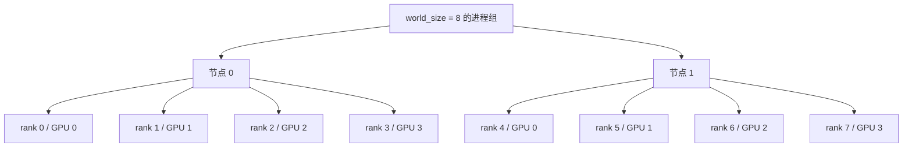
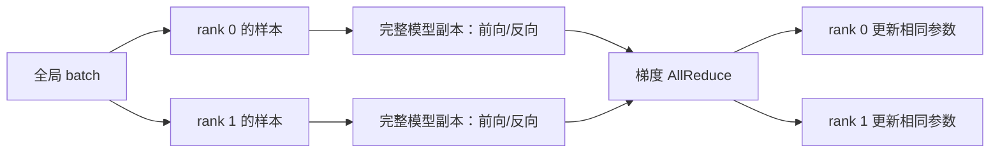
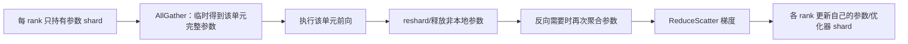
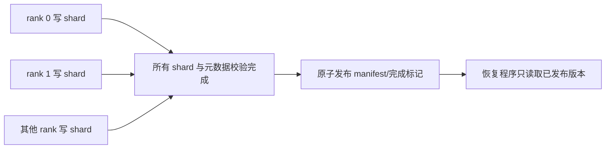

# 分布式训练系统：模型、数据和状态怎样放到多张 GPU

单张 GPU 的训练过程很直观：读一个 batch，做前向，计算 loss，反向得到梯度，再更新参数。分布式训练没有改变这条数学主线，而是把模型、数据、激活和优化器状态分散到多个进程与设备，并在需要共同结果的位置通信。

最容易混淆的地方是把所有“并行”都理解成“多卡一起算”。准确的问题应该是：切分对象是什么，谁保存完整副本，哪一步必须交换什么数据，交换多少字节，失败后哪些状态能恢复。

## 1. 从单卡训练到多个 Rank

分布式训练常让一个 OS 进程控制一张 GPU。每个参与进程称为一个 rank：

- `rank`：当前进程在某个进程组中的编号；
- `world_size`：该进程组共有多少个 rank；
- `local_rank`：当前节点内的本地编号，常用来选择本机 GPU；
- process group（进程组）：参与同一组集合通信的 rank 集合；
- backend（通信后端）：执行集合通信的实现，例如 GPU 场景常用 NCCL。

两台机器、每台四张 GPU 时，可以有八个全局 rank：



这里“GPU 0”是各节点自己的设备编号，因此节点 0 的 GPU 0 和节点 1 的 GPU 0 不是同一张卡。日志中只打印 `local_rank=0` 无法唯一定位全局进程，排障至少要带 hostname、global rank、local rank 和 step。

### 1.1 为什么需要 Rendezvous

进程启动后要先互相发现并建立一致的世界观：谁是 rank 0、world size 是多少、连接到哪里。这类会合过程常称为 rendezvous。若某个节点没启动、地址不可达或所有进程的 world size 配置不同，训练可能在第一次集合通信前就等待。

Rendezvous 只解决加入与建立组的问题，不等于持续容错。训练期间的成员变化、失败检测和重启还需要调度器、弹性运行时与 checkpoint 协作。

## 2. DDP：每个 Rank 一份完整模型

DistributedDataParallel（DDP，分布式数据并行）的基本做法是：

1. 每个 rank 保存同样的完整模型和优化器；
2. 每个 rank 读取不同的本地 mini-batch；
3. 各自执行前向和反向；
4. 对相同参数的梯度做 AllReduce，使所有 rank 得到一致梯度；
5. 每个 rank 独立执行相同 optimizer step，参数继续保持一致。



如果初始化参数相同、输入划分正确、每个 rank 以同样顺序归约相同梯度，并且 optimizer 状态相同，那么更新后参数仍相同。DDP 不需要在每一步“把参数从 rank 0 广播给所有人”来维持一致。

### 2.1 全局 Batch Size 怎样计算

当每个 rank 的本地 batch 都是 `B`，数据并行 rank 数是 `D`，每次参数更新前累积 `K` 个 micro-batch 时：

```text
global batch size = B × D × K
```

例如 8 个 DDP rank，每 rank 每轮处理 4 个样本，累积 2 轮才更新，则全局 batch 是 `8×4×2=64` 个样本。

公式假设每个 micro-batch 大小相等、所有 rank 都参与。最后一个不满 batch、样本过滤或某 rank 提前结束时，简单平均可能给出错误权重。工程上常通过丢弃尾批、补齐采样或按有效样本数加权来维持定义。

### 2.2 AllReduce 后是和还是平均

数学上，AllReduce 可以使用 sum、max 等归约操作。PyTorch DDP 对梯度进行通信，并让结果与各 rank 梯度的平均相符。若本地 loss 是本地 batch 的均值，且各 rank batch 等大，那么 DDP 梯度等价于全局 batch 的均值梯度。

设两个 rank 的同一参数本地梯度分别为 `2` 和 `6`，平均后每个 rank 得到：

```text
(2 + 6) / 2 = 4
```

如果 rank 0 有 2 个有效样本、rank 1 有 6 个有效样本，直接平均两个“本地均值”会让两个 rank 权重相同，并不等于 8 个样本的总体均值。这时应先按样本数形成加权和，再除以总有效样本数。

## 3. DDP 怎样把通信藏在反向计算后面

反向传播从后层向前层逐渐产生梯度。若等全部梯度算完再做一次巨大 AllReduce，GPU 会出现“先只算、后只通信”的长尾。DDP 通常把参数梯度按固定顺序装入 bucket（桶）：某个 bucket 的梯度都 ready 后，就可异步启动它的 AllReduce，同时继续计算更早层的反向。

```mermaid
gantt
    title 反向计算与梯度通信重叠（示意）
    dateFormat X
    axisFormat %L
    section 计算
    反向 bucket 3 :a, 0, 3
    反向 bucket 2 :b, 3, 3
    反向 bucket 1 :c, 6, 3
    section 通信
    AllReduce 3 :d, 3, 4
    AllReduce 2 :e, 6, 4
    AllReduce 1 :f, 9, 4
```



图中最后一个通信尾巴无法被后续反向隐藏。bucket 太大，启动晚；bucket 太小，集合通信次数和固定开销增加。最优值依赖模型计算顺序、链路和张量大小，应看时间线。

### 3.1 为什么 collective 顺序必须一致

集合通信要求参与 rank 对“第几次操作”达成一致。若 rank 0 先对梯度 A 做 AllReduce，rank 1 却先对梯度 B 做 AllReduce，两边等待的是不同数据，可能挂死或产生错误。

动态分支、某些参数只在部分 rank 使用、异常后只有部分进程继续，都可能打乱 ready 顺序。DDP 提供 unused-parameter 检测等机制，但它有额外遍历成本；更重要的是理解模型图为何在各 rank 不一致。

## 4. 一次 Ring AllReduce 要传多少字节

collective 的语义与底层算法要分开。AllReduce 的语义是“把各 rank 输入归约，并把完整结果交给每个 rank”；ring 只是实现它的一种算法。

对 `N` 个 rank、每 rank 有 `S` byte 梯度，理想 ring 常拆为 ReduceScatter 和 AllGather 两阶段。每阶段有 `N-1` 轮，每轮发送约 `S/N` byte：

```text
每 rank 发送量 = 2 × (N-1)/N × S
每 rank 接收量 = 2 × (N-1)/N × S
发送+接收总端点流量 = 4 × (N-1)/N × S
```

例如 `N=8`、`S=1 GiB`：

```text
每 rank 发送 = 2 × 7/8 × 1 GiB = 1.75 GiB
每 rank 接收 = 1.75 GiB
发送+接收 = 3.5 GiB
```

面试中必须说明报的是“发送量”还是“双向端点流量”。这也不是交换机全网累计字节数，更没有包含协议头、重传、对齐和拓扑绕路。

用简化的延迟—带宽模型，ring 时间可以写成：

```text
T ≈ 2(N-1)α + 2(N-1)/N × S/β
```

`α` 是每轮固定延迟，`β` 是有效单向带宽。大消息时带宽项占主导，ring 容易充分利用链路；小消息时 `2(N-1)` 个轮次的固定延迟会更明显，tree 一类算法可能更合适。真实 NCCL 会按消息、拓扑和版本选择协议与算法，详见[《GPU 集合通信与 RDMA》](gpu_collectives_rdma.md)。

## 5. 为什么 DDP 仍会显存不足

DDP 只分了数据，没有分模型状态。每个 rank 仍保存：

- 完整参数；
- 完整梯度；
- 完整优化器状态；
- 本 rank 前向保存的激活；
- 通信 bucket、临时工作区和框架开销。

以 Adam 类优化器作概念估算：若有 `P` 个参数，参数和梯度是 BF16（各 2 byte），还保留 FP32 master weight（4 byte）以及两个 FP32 moment（各 4 byte），仅这几项约为：

```text
参数 2P + 梯度 2P + master weight 4P + 两个 moment 8P = 16P byte
```

一百亿参数仅这些理论项就是约 160 GB，还没算激活、碎片和 workspace。具体混合精度实现可能不同，所以答题必须列假设。要继续扩展，就需要分片模型状态或模型计算。

## 6. ZeRO 与 FSDP：把模型状态分片

ZeRO（Zero Redundancy Optimizer）按“消除哪类数据并行冗余”分阶段：

| 阶段 | 每个 data-parallel rank 分片什么 | 每 rank 仍完整保存什么 |
|---|---|---|
| ZeRO-1 | optimizer states | 参数、梯度 |
| ZeRO-2 | optimizer states、梯度 | 参数 |
| ZeRO-3 | optimizer states、梯度、参数 | 只在计算需要时临时聚合参数 |

若 `D` 个 rank 均匀分片，某一类可分状态的稳态份额理想上约降到 `1/D`。但通信 buffer、当前计算单元临时 all-gather 的参数、激活和碎片不会同时除以 D，峰值显存不能只按总状态除卡数。

FSDP（Fully Sharded Data Parallel）是 PyTorch 的全分片数据并行机制。它和 ZeRO-3 有相似的“参数、梯度、优化器状态分片”思想，但 FSDP 的 wrap 单元、状态表示、调度和 API 是自己的实现。面试中可以说思想相近，不要说它们是完全相同的名字替换。

### 6.1 一个 FSDP 单元怎样执行

以某个被包裹的 Module 单元为例：



这里的关键权衡是：

- wrap 单元太大，单次聚合和峰值临时参数大；
- wrap 单元太小，collective 次数多，固定开销高；
- 提前 prefetch 下一个单元的参数可以隐藏通信，却增加同时驻留的显存；
- backward 后尽快 reshard 省显存，但后续若又需要参数会多一次通信。

FSDP 节省的是模型状态冗余，不自动消除激活。长序列或大 micro-batch 的激活仍可能是主要显存账，需要 activation checkpointing、序列类并行或减小 batch。

## 7. 六类并行到底切了什么

不同并行方式解决不同资源瓶颈：

| 并行方式 | 切分对象 | 每个 rank 主要持有什么 | 典型通信位置 |
|---|---|---|---|
| DP（Data Parallel） | 样本/batch | 完整模型，部分样本 | 反向梯度 AllReduce，或分片状态的 ReduceScatter/AllGather |
| TP（Tensor Parallel） | 单层中的权重/矩阵维度 | 每层的一部分权重与中间结果 | 层内 AllReduce、AllGather 或 ReduceScatter |
| PP（Pipeline Parallel） | 连续层/stage | 一段模型层 | stage 边界发送激活，反向发送激活梯度 |
| EP（Expert Parallel） | MoE experts | 一部分 expert 参数 | token dispatch/combine 常用 AllToAll 类通信 |
| CP（Context Parallel） | 序列/context 维度 | 一段 token 对应的激活/KV | Attention 所需 K/V 或部分结果在 context 组内交换 |
| SP（Sequence Parallel） | 某些激活的序列维度 | 一部分序列激活 | 与 TP 配合的 AllGather/ReduceScatter 等；具体定义依框架 |

它们可以组合。例如 `DP=8, TP=4, PP=2` 需要 `8×4×2=64` 个 rank；若再 `EP=8`，是否额外相乘取决于 EP 维度是独立 mesh 维度，还是复用了某个已有组，不能只看缩写相乘。

### 7.1 DP：切样本

每个 rank 对不同样本执行相同模型。优点是实现和数值语义较直接；限制是普通 DDP 每卡都要放下完整模型状态，且梯度通信量随参数规模增长。

### 7.2 TP：切一层里的矩阵

当单层权重都放不下一卡，TP 可按行或列切分矩阵。假设线性层 `Y=XW`，把 `W` 按输出列切成 `[W0,W1]`：

```text
rank 0 算 Y0 = XW0
rank 1 算 Y1 = XW1
完整 Y = concat(Y0, Y1)
```

若下一步能直接消费分片 `Y`，可推迟聚合；若需要完整 `Y`，就要 AllGather。另一种按输入维切法会让各 rank 得到对完整输出的部分和，需要 AllReduce/ReduceScatter。TP 通信位于层内部，频率高，通常更适合放在高速互联紧密的 GPU 组内。

### 7.3 PP：切连续层

把层 1–10 放 stage 0、层 11–20 放 stage 1。stage 0 把中间激活发送给 stage 1；反向时 stage 1 再把该激活的梯度发回 stage 0。

为了让多个 stage 同时工作，把 global batch 切成 `m` 个 micro-batch。最简单的 fill-drain 调度中，假设每 stage 前向时间相同、只考虑前向，`p` 个 stage 处理 `m` 个 micro-batch 需要 `m+p-1` 个时间槽，其中流水线填充/排空占 `p-1` 个槽：

```text
简化 bubble fraction = (p-1) / (m+p-1)
```

例如 `p=4,m=8`，bubble fraction 是 `3/11≈27.3%`。增加 micro-batch 可降低比例，却可能增加激活保存、调度复杂度或 optimizer step 延迟。真实训练还有前向/反向交错、stage 不均衡和通信，公式只用于理解简单理想模型。

### 7.4 EP：切 experts

Mixture-of-Experts 层中，每个 token 只路由到一部分 expert。EP 让不同 rank 保存不同 experts。路由后，token 激活要送到 expert 所在 rank，计算后再把结果送回原顺序，这常表现为两次 AllToAll 类数据重排。

EP 的难点不只是总字节数：热门 expert 可能收到更多 token，形成负载不均；小消息和 many-to-many 流量对网络更敏感；容量限制与丢弃/重路由还会影响模型语义。本章不展开路由算法，只说明系统通信位置。

### 7.5 CP 与 SP：都切序列，但目的和定义不同

CP 常指把长 context 的 token/激活沿序列维分给多个 rank，让单卡不用保存完整长序列的相关状态。Attention 计算仍需要跨分片的信息，因此要交换 K/V 块或局部结果。

SP 在一些 TP 框架中，特指把原本在 TP rank 间重复保存的非 TP 区域激活沿 sequence 维切开，并在算子边界 AllGather/ReduceScatter。不同项目也可能用 sequence parallel 指更宽泛的长序列切分。

所以面试先问清所用框架的定义，再回答“切的是哪种 Tensor、哪个维度、在哪个算子边界聚合”。只背 CP/SP 的英文全称不能避免术语冲突。

## 8. Device Mesh：给并行组建立坐标系

混合并行时，同一 rank 会同时属于多个进程组。DeviceMesh 用多维坐标组织设备。例如 16 张 GPU 可组织为 `DP=4 × TP=2 × PP=2`：

```text
mesh[dp][tp][pp]
```

对固定的 `(dp, pp)`，改变 `tp` 得到一个 TP 组；固定 `(tp, pp)`，改变 `dp` 得到 DP 组。这样可以从“我是 rank 11”转成“我在 dp/tp/pp 三个维度分别是谁”，减少手工计算 group 的错误。

### 8.1 逻辑 Mesh 要映射到物理拓扑

逻辑维度的通信模式不同：

- TP 每层频繁通信，通常需要最低延迟、最高带宽链路；
- DP 梯度消息大，但较容易与反向重叠；
- PP 主要在相邻 stage 传激活；
- EP 可能产生密集 many-to-many 流量。

因此常把 TP 放在同节点 NVLink/NVSwitch 域，把 DP 或 PP 扩展到跨节点网络。但这不是绝对规则：模型 shape、链路拓扑和故障域都会改变选择。需要用通信基准和端到端 trace 验证 placement。

## 9. Activation Checkpoint 与训练 Checkpoint 不是一回事

两个都叫 checkpoint，却解决完全不同的问题：

| 名称 | 保存在哪里、保存多久 | 解决什么 | 代价 |
|---|---|---|---|
| activation checkpointing | 训练内存中，只跨本轮前向到反向 | 少保存中间激活，降低峰值显存 | 反向时重新执行部分前向，增加计算 |
| persistent training checkpoint | 本地盘或分布式存储，跨进程/机器故障 | 失败后恢复训练进度 | 写入带宽、存储容量、一致性和恢复复杂度 |

Activation checkpointing 也常叫 gradient checkpointing。它不把训练状态写到磁盘，机器掉电后无法靠它恢复。

## 10. 一个可恢复 Checkpoint 要包含什么

仅保存模型参数可以用于推理或重新开始微调，却不保证从同一步继续训练。可恢复 checkpoint 通常需要：

- 模型参数与 buffer；
- optimizer states；
- learning-rate scheduler、gradient scaler 等状态；
- global step、epoch、已消费样本或 sampler 状态；
- CPU 与各 GPU 随机数状态；
- 数据版本、模型配置、并行布局和代码版本；
- 必要时保存 dataloader/rollout 等上游系统进度。

若漏掉 Adam 的 moment，恢复后参数虽然相同，下一步更新却不同；漏掉 sampler 位置，可能重复或跳过数据；漏掉随机数状态，Dropout 和采样序列改变。

### 10.1 分片 Checkpoint 怎样提交

大模型状态本来分布在多个 rank，通常让每个 rank 并行写自己的 shard，而不是先全部聚合到 rank 0。可靠写入要区分“分片文件已出现”和“整个 checkpoint 完整可用”：



如果任务在只写完一半时失败，没有最终完成标记的目录不能被当作有效 checkpoint。还应有校验和、版本清单、保留策略和写后验证。

### 10.2 换 World Size 恢复为什么需要 Reshard

旧任务用 8 个 rank 保存参数 shard，新任务只用 4 个 rank 时，“旧 rank 6 的文件”没有同名新进程直接接管。恢复系统要根据全局 Tensor 元数据，把旧 shards 重新切片并路由到新的 placement，这叫 reshard。

正确性依赖：

1. checkpoint 记录全局 Tensor 的 shape、dtype 和每个 shard 的 offset；
2. 新并行 mesh 能为参数和 optimizer state 定义目标切片；
3. 读取路径能合并/拆分旧 shard，并验证没有重叠或缺口；
4. 不可分或与 rank 绑定的状态有明确转换策略。

PyTorch Distributed Checkpoint 提供分布式保存、加载和 reshard 能力，但应用仍需正确管理模型/优化器状态和兼容性。

## 11. Straggler：所有人都在等最慢的 Rank

同步训练中，一次 collective 或下一轮计算通常必须等所有参与 rank。因此某个 rank 慢 20%，整个 step 可能都接近慢 20%。慢 rank 称为 straggler（拖尾进程）。

常见来源：

- 数据样本长度或预处理不均衡；
- 某 GPU 降频、纠错、温度或功耗限制；
- 同节点 CPU、内存、PCIe 或存储被其他任务争用；
- expert/token 路由不均；
- 网络链路拥塞、重传或错误；
- stage 切分不均，某个 PP stage 计算更久；
- checkpoint 或日志只让少数 rank 承担大量 I/O。

定位不能只看 step 平均时间。要按 rank 对齐同一个 step，分别记录 dataloader、前向、反向、每个 collective、optimizer、checkpoint 的开始和结束；再找“哪个 rank 最先进入等待、哪个 rank 最后到达”。最后到达者才更可能是上游慢源，最先在 collective 中等待者往往只是受害者。

## 12. Hang、失败与重启

### 12.1 为什么 collective 会挂死

常见原因包括：

- 某 rank 已 OOM、崩溃或被调度器杀死，其余 rank 仍等待；
- 各 rank 调用 collective 的顺序、Tensor shape、count 或 dtype 不一致；
- 某个动态分支只在部分 rank 进入通信；
- GPU kernel 在通信前发生异步错误，错误尚未被主线程看见；
- 网络、NIC、交换机或 GPU 链路故障；
- process group 使用错误，参与者集合不同。

“卡在 NCCL”不一定说明 NCCL 是根因。它只可能是第一个把所有 rank 进度对齐、从而暴露某个 rank 缺席的位置。

### 12.2 一份有用的挂死证据包

每个 rank 至少记录：

```text
job/run id, hostname, global/local rank
global step, micro-batch, collective sequence number
process group id, op type, tensor count/dtype
enqueue time, completion/timeout time
最近一次成功的前向/反向阶段
GPU 错误、OOM、NIC/链路计数器和进程退出原因
```

诊断顺序是：先确认所有 rank 是否活着；再比较最后成功 step 和 collective 序列；检查第一处不一致；最后进入 GPU、通信库、NIC 和交换机层。集合通信/RDMA 的对象和工具见下一章。

### 12.3 重启不是“重新跑命令”

可靠恢复流程应：

1. 调度器确认旧成员退出，避免旧新进程同时写同一输出；
2. 选择最新且完整发布、校验通过的 checkpoint；
3. 建立新的 world/mesh，加载并必要时 reshard；
4. 恢复 optimizer、随机数和数据进度；
5. 用小范围一致性检查确认参数、step 和样本位置；
6. 恢复训练，并记录此次失败与丢失的计算窗口。

checkpoint 间隔是成本权衡。设平均每 `I` 分钟保存一次，故障随机发生，则仅考虑回滚时，平均丢失工作约 `I/2`；间隔越短，回滚少，但正常训练写盘开销越大。

<details>
<summary><strong>选读：DeepSeek DualPipe 展示了什么系统思想</strong></summary>

DeepSeek-V3 技术报告和官方 DualPipe 仓库描述了一种用于流水线并行的双向调度：来自流水线两端的 micro-batch 在不同方向推进，目标是让前向、反向以及通信获得更多重叠机会，并减少传统流水线 bubble。

这里值得掌握的是通用分析方法，而不是背具体时间表：

1. 画每个 stage 的前向、输入梯度反向、参数梯度反向与点对点通信时间线；
2. 检查同一时段 GPU 资源能否真正重叠，而不是图上矩形恰好重叠；
3. 计算 steady-state bubble、额外 activation memory 和通信需求；
4. 检查 stage 对称映射是否符合物理拓扑；
5. 比较复杂调度带来的吞吐收益与实现、恢复、调试成本。

DualPipe 是特定系统设计实例，不表示所有训练任务都应采用双向流水线。层数、micro-batch、显存、网络和框架支持不同，最佳调度也不同。

</details>

## 13. 怎样选择并行组合

不要从“流行方案”倒推配置，而要从放不下或跑不快的资源账开始：

1. **单卡是否放得下状态和激活**：放得下且吞吐需要扩展，先考虑 DP；状态放不下，考虑 FSDP/ZeRO；单层都放不下，必须 TP 或算子级切分；激活主导时，考虑 activation checkpoint、CP/SP 或减小 micro-batch。
2. **通信在什么频率发生**：TP 是层内高频，PP 是 stage 边界，DP 多在反向；把高频小延迟通信映射到更近拓扑。
3. **全局 batch 是否还能接受**：增加 DP 和 micro-batch accumulation 会扩大 global batch，可能改变训练语义，不能只为设备利用率无限增大。
4. **负载能否平衡**：PP 看 stage 时间，EP 看 token 分布，DP 看样本长度，任何一个最慢 rank 都会拖住同步点。
5. **失败与 checkpoint 是否可操作**：复杂 mesh 要能保存全局元数据、reshard，并在部分节点故障后定位责任域。

一个好的方案会列出每 rank 的参数、梯度、优化器、激活峰值，以及每个通信组每 step 的消息大小、次数和可重叠窗口，再由实测验证。

## 14. 做题方法：先画切分，再算字节

### 14.1 并行方式判断题

依次回答四句：切的是样本、层、层内矩阵、expert 还是序列？每 rank 是否有完整参数？哪一步需要完整结果？使用 AllReduce、AllGather、ReduceScatter、AllToAll 还是 point-to-point？

### 14.2 通信量题

1. 先写 collective 语义和张量总大小 `S`；
2. 明确算法，例如 ring，而不是把 AllReduce 当固定实现；
3. 明确计算的是每 rank 发送、接收、二者之和，还是全网总量；
4. 大小统一用 byte/GiB，带宽统一为 byte/s；
5. 说明还未包含协议、对齐和拓扑额外流量。

### 14.3 显存题

参数、梯度、master weights、optimizer moments、激活、通信 buffer、workspace 逐项列账；再按 ZeRO/FSDP 阶段只除掉真正分片的项；最后加临时 AllGather 峰值，不能把所有项统一除以 rank 数。

### 14.4 Pipeline 题

先写采用哪种 schedule。只有在题目明确“等时 stage、简单 fill-drain、忽略通信”等假设时，才使用 `(p-1)/(m+p-1)`。真实题若给每 stage 时间，应画甘特图找关键路径。

### 14.5 Hang 题

不要从环境变量开始。按 rank 对齐最后成功 step、collective sequence 和存活状态，找第一个分叉点；再沿 compute → collective → GPU link/NIC → fabric 分层收证据。

## 15. 章末面试问题

### 30 秒答法

> DDP 让每个 rank 保存完整模型、处理不同样本，并在反向对梯度通信；FSDP/ZeRO 进一步分片优化器、梯度和参数，计算某个单元时临时聚合。TP 切层内矩阵，PP 切连续层，EP 切 experts，CP/SP 切序列相关状态，各自的通信点不同。混合并行要用 device mesh 映射物理拓扑，并同时核算状态、激活、通信和负载。可靠训练还必须有原子发布的分片 checkpoint、reshard、按 rank 追踪 straggler 和 collective 顺序的能力。

### 常见追问

**DDP 为什么不等同于模型并行？**

DDP 的每个 rank 仍有完整模型，只切样本；模型并行会把一层或多层模型本身切到不同 rank。

**FSDP 为什么更省显存却可能通信更多？**

参数不再长期完整驻留，每个单元计算前要 AllGather，梯度再 ReduceScatter；省下常驻冗余的代价是更频繁的状态通信和临时峰值。

**训练卡住在 AllReduce，第一结论是什么？**

只能得出“各 rank 没有共同完成这个同步点”。根因可能是某 rank 更早 OOM、调用顺序不一致、GPU 异步错误或网络故障，需要按 rank 找第一个进度分叉。

**activation checkpoint 和磁盘 checkpoint 有什么区别？**

前者用反向重算换显存，只在一次训练迭代内存在；后者把训练状态持久化，用于故障恢复。

## 16. 章末自测

1. 16 个 DDP rank，每 rank 每个 micro-batch 3 个样本，累计 4 个 micro-batch 更新一次。全局 batch size 是多少？
2. 两个 rank 的本地 batch 分别有 2、6 个样本，本地平均梯度分别是 2、6。直接平均两个 rank 得多少？按全部 8 个样本加权的正确平均是多少？
3. 8 个 rank 对 4 GiB 梯度执行理想 ring AllReduce。每 rank 发送多少、接收多少、端点发送加接收多少？
4. 某模型状态中参数 20 GB、梯度 20 GB、optimizer state 80 GB。忽略激活和临时 buffer，4-way ZeRO-1、ZeRO-2、ZeRO-3 的每 rank 稳态状态分别是多少？
5. 简单 fill-drain 流水线有 8 个等时 stage、32 个 micro-batch。按教学公式，bubble fraction 是多少？
6. TP、PP 和 EP 分别在哪个位置通信，为什么 TP 通常更偏好节点内高速互联？
7. 为什么一个只包含参数的 checkpoint 通常不能精确继续 Adam 训练？
8. 所有 rank 日志都显示“等待 AllReduce”，怎样找到真正最慢或先失败的 rank？

### 参考答案与解答

<details>
<summary>展开答案</summary>

1. `global batch = local batch × data-parallel ranks × accumulation = 3×16×4=192` 个样本。这里假设每个 micro-batch 等大且所有 rank 都完成四次累积。

2. 直接把 rank 均值平均得到 `(2+6)/2=4`。正确样本加权平均是 `(2个×2 + 6个×6)/(2+6)=(4+36)/8=5`。两者不同，说明 batch 大小不等时不能给每个 rank 相同权重。

3. 每 rank 发送量为 `2×(8-1)/8×4 GiB=7 GiB`，接收量也为 `7 GiB`，发送加接收为 `14 GiB`。这是假设 ring 的算法数据量，不含协议与拓扑额外流量；若面试官只问通信量，必须说明采用哪种口径。

4. ZeRO-1 只把 80 GB optimizer state 分成四份，所以每 rank 是 `20+20+80/4=60 GB`。ZeRO-2 再分梯度，所以是 `20+20/4+80/4=45 GB`。ZeRO-3 再分参数，所以是 `(20+20+80)/4=30 GB`。真实峰值还要加参数 AllGather、通信 buffer、激活、workspace、对齐与碎片，不能据此断言 30 GB 显存一定能跑。

5. `bubble=(p-1)/(m+p-1)=7/(32+8-1)=7/39≈17.95%`。它只适用于题设的简单等时、fill-drain 模型；加入反向、交错调度和通信后要重画时间线。

6. TP 在单层内部对分片矩阵输出做 AllReduce/AllGather/ReduceScatter，几乎每层都会发生，频率高且常在关键路径，所以偏好低延迟、高带宽的节点内 NVLink/NVSwitch 域。PP 在相邻 stage 边界发送激活及其梯度；EP 在路由前后对 token 激活做 AllToAll 类 dispatch/combine。三者消息形状和频率不同。

7. Adam 的下一步不仅依赖当前参数和新梯度，还依赖一阶、二阶 moment、step 计数以及学习率调度等状态。只恢复参数会把这些状态重置，更新轨迹改变。随机数、数据 sampler 位置缺失还会改变输入和 Dropout，因此也不能精确续跑。

8. 先确认每个进程是否仍存活并收集 hostname/rank；再按相同 global step 和 collective sequence 对齐日志，比较每个 rank 进入 AllReduce 前最后成功的阶段与到达时间。最早进入等待的 rank 往往只是受害者，最后到达或根本没到达的 rank 才是重点。随后查该 rank 的 dataloader、kernel/OOM/异步错误、GPU 状态和网络计数器，再比较 collective 的 group、count、dtype 与顺序是否一致。

</details>

## 17. 本章小结

- rank 是参与分布式工作的进程身份，process group 定义谁共同通信。
- DDP 切样本、保留完整模型，并用梯度通信保持副本一致；bucket 可让通信与反向重叠。
- ZeRO/FSDP 分片模型状态，用 AllGather 与 ReduceScatter 换取较低常驻显存。
- DP、TP、PP、EP、CP、SP 切分对象和通信位置不同，术语必须落到具体 Tensor 与维度。
- Device Mesh 把多个并行维度组成坐标系，逻辑通信组还要匹配物理拓扑。
- Activation checkpoint 用重算换显存；持久 checkpoint 用存储换故障恢复，分片保存还要原子发布和 reshard。
- straggler 与 hang 要按 rank 和 collective 序列找第一处分叉，不能把同步点直接当成根因。

## 一手资料

- [PyTorch：DistributedDataParallel](https://docs.pytorch.org/docs/stable/generated/torch.nn.parallel.DistributedDataParallel.html)
- [PyTorch：Distributed communication package](https://docs.pytorch.org/docs/stable/distributed.html)
- [PyTorch：FullyShardedDataParallel](https://docs.pytorch.org/docs/stable/fsdp.html)
- [PyTorch：Tensor Parallel tutorial](https://docs.pytorch.org/tutorials/intermediate/TP_tutorial.html)
- [PyTorch：Pipeline Parallelism](https://docs.pytorch.org/docs/stable/distributed.pipelining.html)
- [PyTorch：DeviceMesh](https://docs.pytorch.org/docs/stable/distributed.html#devicemesh)
- [PyTorch：Distributed Checkpoint](https://docs.pytorch.org/docs/stable/distributed.checkpoint.html)
- [Microsoft Research：ZeRO paper](https://www.microsoft.com/en-us/research/publication/zero-memory-optimizations-toward-training-trillion-parameter-models/)
- [DeepSpeed：ZeRO documentation](https://deepspeed.readthedocs.io/en/latest/zero3.html)
- [DeepSeek-V3 Technical Report](https://arxiv.org/abs/2412.19437)
- [DeepSeek：DualPipe 官方仓库](https://github.com/deepseek-ai/DualPipe)
