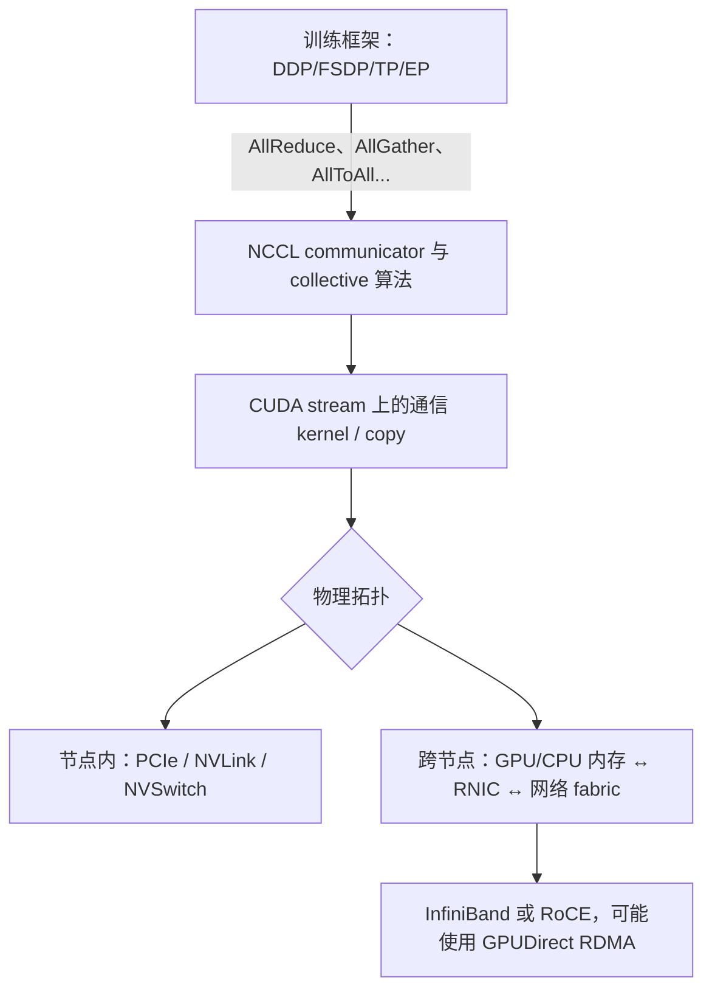
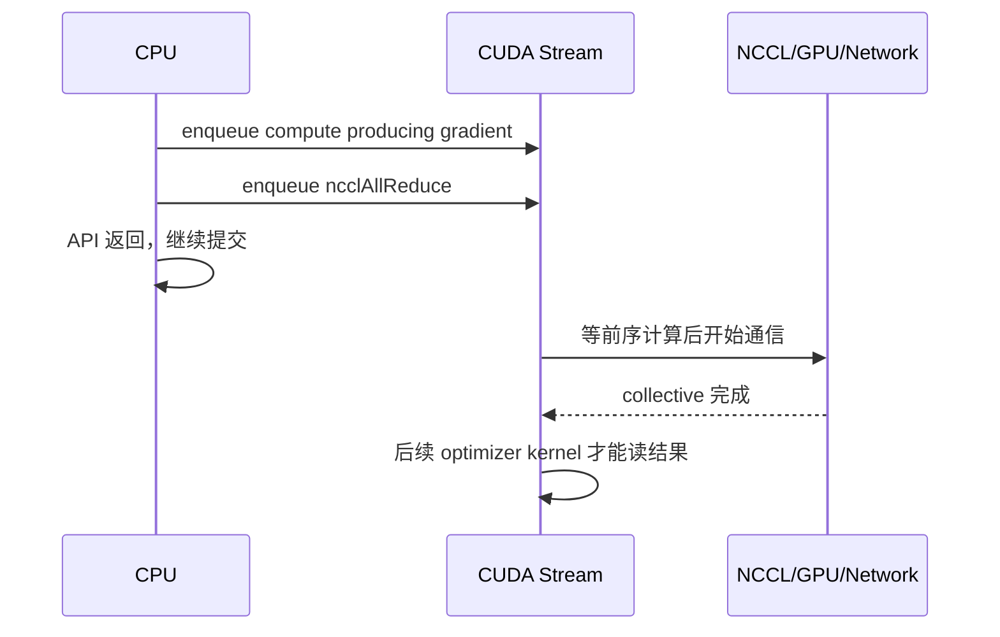
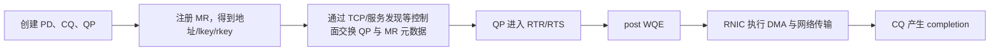
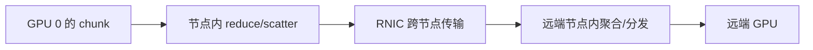

# GPU 集合通信与 RDMA：多张卡怎样交换数据

分布式程序调用一次 `all_reduce(gradient)` 时，看起来只有一个函数。实际数据可能经过框架进程组、NCCL、CUDA stream、GPU 内存、PCIe/NVLink、网卡和交换网络。任何一层的参与者、顺序、大小或完成语义不一致，都可能表现为“通信很慢”或“所有进程卡住”。

先把整条路径分层：



这张图也是排障顺序：先确认 collective 语义和各 rank 调用一致，再看 CUDA 是否完成，随后看 GPU/NIC 拓扑与网络，而不是一开始就修改一组不理解的环境变量。

## 1. 点对点通信与集合通信

Point-to-point（点对点）通信只有明确的发送方和接收方，例如 pipeline stage 0 把激活发给 stage 1。Collective（集合通信）让一个进程组中的所有 rank 按同一种操作协作。

设进程组有 `P` 个 rank，每个 rank 输入 Tensor 有 `N` 个元素。常见 collective 如下：

| 操作 | 输入与输出直觉 | 常见用途 |
|---|---|---|
| Broadcast | root 有 `N`，所有 rank 最终都有 root 的 `N` | 发布初始化参数或配置 Tensor |
| Reduce | 每 rank 有 `N`，归约后只有 root 有 `N` | 汇总到一个 rank |
| AllReduce | 每 rank 有 `N`，归约后每 rank 都有同一个 `N` | DDP 梯度求和/平均 |
| AllGather | 每 rank 有不同的 `N`，每 rank 得到拼接后的 `P×N` | 聚合分片参数或激活 |
| ReduceScatter | 每 rank 输入总长常为 `P×N`，归约后每 rank 得到不同的 `N` shard | FSDP/ZeRO 梯度分片 |
| AllToAll | 每 rank 把输入切成 P 份，分别交换给所有 rank | EP token dispatch、数据重排 |
| Gather / Scatter | 多个 rank 与一个 root 之间聚合/分发 | 控制面、小规模收集 |
| Barrier | 各 rank 到达后共同放行；不承载业务 Tensor 结果 | 阶段对齐、诊断；不应滥用 |

表中的 shape 是教学常见形式。很多 API 支持不等长分片或列表形式，但所有 rank 仍必须对 count、dtype、参与组和语义达成一致。

### 1.1 AllReduce 可以拆成什么

AllReduce 的结果可理解为：

```text
AllReduce = ReduceScatter + AllGather
```

第一阶段把归约后的不同 shard 分给各 rank，第二阶段再让每个 rank 收集全部 shards。这是许多算法的构造方式，不表示框架一定真的调用两个公开 API，也不限定只能用 ring。

### 1.2 AllToAll 为什么对网络更难

AllReduce 的数据可沿 ring 或 tree 规律流动；AllToAll 中每个 rank 都可能同时向所有其他 rank 发送不同数据。它容易产生：

- 大量并发连接或传输队列；
- 小消息固定延迟；
- 热点链路和交换机端口竞争；
- 输入分片不均导致的不同消息大小；
- 接收端缓冲与 token 重排开销。

因此 EP 的性能不能只用“总字节数和 AllReduce 差不多”推断。

## 2. 延迟、带宽与消息大小

一次消息的简化时间模型是：

```text
T ≈ α + S/β
```

- `α`：固定启动延迟，包括软件、排队和协议开销；
- `S`：消息字节数；
- `β`：可持续有效带宽，单位 byte/s。

小消息中 `α` 占比大，合并消息可能有益；大消息中 `S/β` 主导，应提高链路利用率并减少额外搬运。把一百万个 4-byte 值逐个发送，和一次发送 4 MB，业务数据量相同，固定开销完全不同。

### 2.1 Ring AllReduce 的算法数据量

对 `P` 个 rank 和每 rank `S` byte 输入，理想 ring 的 ReduceScatter 与 AllGather 各有 `P-1` 轮，每轮约传 `S/P`：

```text
每 rank 发送 = 2(P-1)/P × S
每 rank 接收 = 2(P-1)/P × S
```

教学时间模型：

```text
T_ring ≈ 2(P-1)α + 2(P-1)/P × S/β
```

它说明两件事：rank 数增加时带宽项趋近 `2S/β`，但固定轮次延迟随 `P` 增长。协议头、分块流水、双向链路、拓扑和软件实现会改变实测。

### 2.2 Tree 为什么不是永远更快

tree 可用较少的 `O(log P)` 轮次完成归约与广播，适合固定延迟重要的消息；但树的不同层和根附近可能无法像 ring 一样均匀使用所有链路，大消息带宽利用率取决于拓扑与实现。

NCCL 可能根据 GPU 拓扑、消息大小、rank 数和版本选择 ring、tree 或其他算法/协议。面试中应该比较“轮次数、每轮数据、链路并行度”，而不是背诵“ring 大消息、tree 小消息”后宣称没有例外。

## 3. NCCL 是什么

NCCL（NVIDIA Collective Communications Library）为 NVIDIA GPU 提供 collective 和 point-to-point 通信。它接收 GPU buffer、count、dtype、operation、communicator 和 CUDA stream，然后在支持的互联路径上搬运/归约数据。

NCCL 不是网络硬件，也不是分布式训练框架：

- PyTorch 等框架决定何时、在哪个 process group 调用什么 collective；
- NCCL 建立 communicator，选择通信路径并执行 GPU 集合操作；
- CUDA 提供 stream 和设备执行；
- PCIe/NVLink/NIC/fabric 负责物理传输。

### 3.1 Communicator 保存什么关系

NCCL communicator（通信器）定义一组参与者及其 NCCL rank。初始化通常先生成或共享唯一标识，然后每个进程用相同的总 rank 数、各自唯一 rank 加入。

同一进程可以属于多个 communicator，例如：

- 一个 64-rank 的 data-parallel 组；
- 节点内 8-rank tensor-parallel 组；
- 跨节点同位置 GPU 组成的另一个组。

NCCL rank 是 communicator 内的编号，不必等于操作系统进程号、全局训练 rank 或 GPU device id。日志要同时记录它们，避免“rank 3”指代不清。

## 4. Collective 的匹配契约

一个 communicator 中，各 rank 必须以一致顺序调用相匹配的 collective。至少要匹配：

- operation 类型，例如都是 AllReduce；
- count 和 dtype；
- reduce op，例如 sum/max；
- communicator 及参与 rank；
- root（对有 root 的操作）；
- API 所要求的 buffer shape/有效地址。

例如：

```text
rank 0: AllReduce(A) → Broadcast(B)
rank 1: Broadcast(B) → AllReduce(A)
```

两个 rank 都调用了同样的两种操作，但顺序不同，仍可能互相等待。动态控制流必须保证 communicator 内所有 rank 的 collective 序列相同。

### 4.1 Group Calls 解决什么

有时同一线程要为多个设备发起操作，或要批量提交一组 point-to-point send/recv。NCCL group API 可以把若干调用作为一组提交，帮助避免逐个调用时的启动或相互等待问题。它不是数据库事务：不能把它理解成“组内任意失败都会自动回滚所有 GPU 内存”。

## 5. NCCL 调用返回不等于数据已经到达

NCCL collective 通常被排入调用者提供的 CUDA stream。API 成功返回主要表示操作已成功 enqueue；只有相关 stream 进度走过该操作，输出 buffer 才能被后续消费者安全使用。



同一 stream 自然保持“生产梯度 → collective → 消费结果”的顺序。若计算和通信使用不同 stream，就需要 CUDA event 或框架提供的依赖机制，避免通信读到未完成梯度，或 optimizer 过早读取结果。

CPU 想知道完成状态时，可查询 CUDA event/stream 或 NCCL async error 状态。每次 collective 后立刻让 CPU 全局同步虽然容易理解，却会破坏通信与计算重叠。

### 5.1 异步错误为什么会晚出现

网络故障、远端进程退出或设备 kernel 错误可能在 NCCL API 已返回后才发生。错误可能直到查询 communicator、stream 同步或 watchdog 超时才被看到。

因此诊断要保留两类时间：

- enqueue 时刻：CPU 何时把第 `k` 个 collective 排入哪个 stream；
- completion 时刻：设备或 watchdog 何时确认完成/失败。

只有 enqueue 日志不能证明通信实际执行完。

### 5.2 超时后为什么常要销毁整个 Communicator

一个 rank 中途退出后，其余 rank 可能停留在不同 collective 或 transport 状态。简单“跳过这次操作继续下一步”无法让所有参与者重新获得相同序列。可靠做法通常是让失败传播到整个 job，abort/销毁相关 communicator，由上层从一致 checkpoint 建立新成员组。

具体 API、blocking/nonblocking 模式和错误处理规则会随 NCCL 版本改变，应依据部署版本文档实现。

## 6. 节点内拓扑：PCIe、NVLink 与 NVSwitch

GPU 之间并不共享一条速度相同的“总线”。先区分三类互联：

| 互联 | 连接关系 | 主要作用 |
|---|---|---|
| PCIe | GPU、CPU、NIC 等连接到 PCIe switch/root complex | 通用 I/O 与设备互联，路径可能经过多级 switch 或 CPU socket |
| NVLink | NVIDIA GPU 间或特定 GPU—CPU 间的高速互联 | 更高带宽、较低延迟的 peer 路径，数量和代际依硬件 |
| NVSwitch | 在一个系统/域内为多 GPU 提供交换式 NVLink 连接 | 提高多 GPU 任意对通信的可用带宽与拓扑均匀性 |

“两张卡在同一台机器”不代表它们一定有直接 NVLink。它们可能：

- 共享同一个 PCIe switch；
- 跨不同 PCIe root complex；
- 靠近不同 CPU NUMA node；
- 通过 NVLink 直连；
- 通过 NVSwitch 域互连。

### 6.1 Scale-up 与 Scale-out

- scale-up 通常指一个节点或高带宽 GPU 域内扩展，主要使用 NVLink/NVSwitch/PCIe；
- scale-out 指跨服务器扩展，经过 NIC 与外部交换 fabric。

一次 collective 可以同时使用两层：先在节点内 ReduceScatter，再让各节点代表通过网络归约，最后节点内分发。分层算法能减少跨节点流量或匹配拓扑，但是否更快取决于节点数、每层带宽和消息大小。

### 6.2 为什么 GPU 与 NIC 的“距离”重要

GPU 和 NIC 若挂在同一 PCIe switch/root complex 下，peer-to-peer 数据路径通常更直接；若跨 CPU socket，流量可能经过 CPU interconnect，带宽和延迟都受影响。进程的 CPU affinity、NUMA 内存位置和 NIC 选择也会影响控制面与 host buffer 路径。

部署前应读取系统拓扑，例如 `nvidia-smi topo -m`、NCCL 拓扑日志和 NIC/NUMA 信息，再把高频通信组映射到合适设备，不应只按 GPU 编号猜相邻关系。

## 7. RDMA 解决什么问题

传统网络收发常由内核协议栈处理，并把数据在应用 buffer、内核 buffer 和网卡之间多次排队/复制。RDMA（Remote Direct Memory Access，远程直接内存访问）允许网卡在预先登记和授权的内存区域之间执行直接数据传输，减少远端 CPU 对每个数据包的参与，并支持较低延迟、高吞吐通信。

“direct” 不表示没有任何软件：

- 进程仍要创建资源、登记内存、交换地址与 key；
- CPU 或 GPU 仍要提交 work request；
- NIC 执行 DMA、传输与协议；
- 应用仍要轮询或等待完成，并管理对象生命周期和错误恢复。

RDMA 也不等于“零拷贝必然更快”。小消息、注册开销、PCIe 拓扑、拥塞、队列深度和同步都可能主导。

## 8. RDMA 的核心对象

把 RDMA 想成一个需要先登记仓库、建立运输队列、再提交运输单的系统：

| 对象 | 全称 | 通俗作用 |
|---|---|---|
| HCA/RNIC | Host Channel Adapter / RDMA NIC | 能执行 RDMA 的网卡 |
| Context | device context | 进程访问 RDMA 设备的上下文 |
| PD | Protection Domain | 把 MR、QP 等资源放进同一保护边界 |
| MR | Memory Region | 已向 NIC 登记、固定并授权访问的一段内存 |
| lkey/rkey | local/remote key | 本地提交与远端访问时使用的权限令牌 |
| QP | Queue Pair | 一对 Send Queue 与 Receive Queue，承载工作请求 |
| WQE | Work Queue Element | NIC 队列中的一张具体工作单 |
| CQ | Completion Queue | NIC 投递完成通知的队列 |
| CQE/WC | Completion entry / Work Completion | 某个已请求操作的完成状态 |

### 8.1 为什么必须 Memory Registration

NIC 做 DMA 时，需要知道虚拟地址对应的物理页在传输期间稳定存在，并检查访问权限。注册 MR 会：

1. 固定或登记一段内存；
2. 建立给 NIC 使用的地址映射；
3. 绑定 PD 与访问权限；
4. 返回本地 `lkey`，若允许远端访问还提供 `rkey`。

注册和撤销可能很贵，所以高性能系统常复用长期 buffer 或 registration cache。代价是 pinned memory、key 与生命周期更难管理。内存释放或重新分配后，旧地址/rkey 不能继续被远端使用。

### 8.2 QP 为什么叫 Queue Pair

一个 QP 逻辑上包含：

- Send Queue：提交 Send、RDMA Read/Write、Atomic 等发送侧工作；
- Receive Queue：预先放置接收 buffer，供对端 Send 消费。

应用创建 work request，驱动把它变成 WQE 放入队列，NIC 异步执行；完成后在 CQ 产生 completion。多个 QP 可以共享 CQ，应用按 `wr_id` 区分是哪个请求完成。

对常见 RC（Reliable Connection，可靠连接）QP，建立通信还要把状态从 RESET 推到 INIT、RTR（Ready to Receive）、RTS（Ready to Send），并交换 QP number、路径、packet sequence 等连接信息。具体字段属于 verbs/设备配置细节，核心是“两端必须先交换控制面元数据，数据面才能直接传输”。



## 9. Send/Recv 与 RDMA Read/Write 有何不同

### 9.1 Send/Recv：接收方预先提供 buffer

发送方 post Send 前，接收方通常要先在 Receive Queue post Recv buffer。Send 到达后，RNIC 把 payload 写入其中，并在接收方 CQ 产生完成。

接收方若没有足够 Recv WQE，可能出现 RNR（Receiver Not Ready）重试或错误。Send/Recv 适合消息语义：接收方通过 completion 知道“收到一条消息”，但要管理 receive credits 与 buffer 补充。

### 9.2 RDMA Write：发送方直接写远端地址

远端先把 MR 的地址与 rkey 通过控制面告诉发送方。发送方 WQE 指定：

```text
本地 buffer + lkey
远端 virtual address + rkey
length
```

RNIC 把本地数据写入远端 MR。普通 RDMA Write 不消费对端 Receive Queue，远端 CPU 也未必自动得到“新数据已到”的 CQE。应用需要额外通知协议，例如：

- Write with Immediate，让远端收到带 immediate data 的 completion；
- 另发 Send/doorbell；
- 写入带版本/ready 字段的数据结构，并遵循规定的顺序。

### 9.3 RDMA Read：发起方拉取远端数据

发起方提供远端 address/rkey，RNIC 从远端 MR 读取并写入本地 MR。远端 CPU 通常不为每次 Read 执行业务处理。Read 适合“消费者知道要读哪里”，但会有请求—响应往返，过多小 Read 可能受延迟限制。

### 9.4 Atomic：对远端小字段做原子更新

verbs/硬件可支持 compare-and-swap、fetch-and-add 等远程原子操作，常用于计数或协议元数据。支持的数据宽度、对齐和能力依设备。它们不能替代大型数据传输，也不能自动构成完整事务。

## 10. Completion 到底证明了什么

“操作完成”必须说明观察者与范围。发送方看到本地 CQE，通常表示本地 buffer 可按该传输语义复用、NIC 已完成相应工作；它不必然表示远端应用线程已经读取或处理数据。

几个不同事件不能混为一谈：

1. WQE 已 post：工作单进入队列；
2. 本地 completion：本地 RNIC 报告操作完成或失败；
3. 远端内存已按协议可见：依 transport 与操作/排序规则；
4. 远端应用已收到通知；
5. 远端业务逻辑已消费并持久化。

例如“客户端 RDMA Write 完成，所以服务端已经把数据写进 SSD”显然缺少后续通知、处理和持久化确认。面试回答完成语义时要一路说到业务需要的确认点。

### 10.1 Signaled 与 Unsignaled Completion

若每个 WQE 都请求 CQE，高吞吐下 CQ 处理开销很大；若大量 WQE 不请求 completion，又难以及时回收 buffer 和发现错误。常见做法是每隔若干请求发一个 signaled WQE，利用队列有序性批量确认此前工作。

但必须保证 CQ 不溢出、未确认 WQE 数不超过 QP 资源，并理解错误如何上报。具体阈值属于系统实现配置，不应背成通用数字。

## 11. InfiniBand 与 RoCE

RDMA 是能力/编程模型，InfiniBand 和 RoCE 是承载它的两类网络技术。

### 11.1 InfiniBand

InfiniBand 定义了专门的链路、交换 fabric、传输和管理体系。子网管理器配置路径，HCA 与交换机实现相应协议。它不是“普通 TCP 网络上安装一个库”。

### 11.2 RoCE

RoCE（RDMA over Converged Ethernet）让 RDMA transport 运行在以太网上。RoCE v2 把数据封装在 UDP/IP 中，因此可以在三层 IP 网络路由；应用仍通过 RDMA verbs/QP/MR 使用它，而不是改为普通 UDP socket。

RDMA transport 的拥塞与丢包处理和 TCP 不同。生产 RoCE 网络通常要一起设计：

- traffic class 与 QoS；
- ECN 标记与端侧拥塞控制；
- PFC 等优先级流控是否使用、作用范围和死锁风险；
- buffer、路由、ECMP 与负载均衡；
- 遥测、丢包、pause、CNP/ECN 和队列计数器。

“RoCE 必须全网绝对无损”过于简单；“UDP 会丢，所以 RoCE 不可靠”也不对。具体可靠性由 RDMA transport、NIC 与网络配置共同实现。面试应说清版本、transport 和部署条件。

## 12. Bandwidth-Delay Product：链路上要有多少在途数据

Bandwidth-Delay Product（BDP，带宽时延积）表示要填满链路，理论上至少要有多少尚未完成的数据在途：

```text
BDP = bandwidth × round-trip time
```

假设链路为 200 Gbit/s，往返时间为 10 μs：

```text
200 Gbit/s ÷ 8 = 25 GB/s
BDP = 25 GB/s × 10×10⁻⁶ s = 250,000 byte ≈ 250 KB
```

若每个请求只有 64 KiB，忽略协议和队列限制，至少要：

```text
ceil(250,000 / 65,536) = 4
```

个请求在途，才可能接近填满链路。只有一个同步 Read、等完成后再发下一个，会受 RTT 限制。提高 queue depth 或增大消息可以增加在途字节，但过深队列会增加排队延迟和内存占用，也可能掩盖拥塞。

## 13. GPUDirect RDMA 怎样改变数据路径

没有 GPU Direct 的一种跨节点路径可能是：

```text
GPU memory → CPU pinned buffer → RNIC → network
```

接收端再从 RNIC 写 CPU buffer，随后复制到 GPU。GPUDirect RDMA 允许兼容 RNIC 对注册过的 GPU memory 执行 peer DMA，减少 host staging copy。RNIC 通常仍通过平台的 PCIe peer-to-peer 路径访问 GPU；具体路径由服务器互联决定：

```text
GPU memory ↔ 平台 peer-DMA 路径（通常是 PCIe）↔ RNIC ↔ network
```

它省掉的是数据面 host bounce，不是把 CPU 和软件全部删掉。CPU/框架仍负责建立 communicator、注册/映射 GPU memory、交换 key、提交传输、处理完成与错误。

### 13.1 使用 GPUDirect 要满足什么

- GPU、RNIC、驱动、CUDA 与通信库组合支持；
- GPU memory 能被正确 pin/register，并在传输期间保持有效；
- PCIe 拓扑允许或高效支持 peer path；
- IOMMU、ACS、虚拟化和安全配置符合平台要求；
- GPU kernel、NIC DMA 与 CUDA stream 之间有正确的 ordering/visibility 协议；
- 失败、进程退出和 buffer 回收不会留下远端仍在使用的地址/key。

所以“开启 GPUDirect”不是单个布尔开关。应从 NCCL 日志、拓扑、实际 NIC bytes、PCIe 流量与端到端时间确认路径是否生效。

### 13.2 GPU 与 NIC 同时访问 buffer 的风险

如果 GPU kernel 正在写梯度，RNIC 同时开始读取，会发送未完成数据；如果 RNIC 还在写入，GPU kernel 就消费，也会读到不完整结果。需要通信库、CUDA stream/event 和驱动提供的同步机制建立生产—传输—消费顺序。

不要把 CPU 对某个 flag 的普通读取当成 GPU/NIC 全系统内存屏障。跨设备可见性是平台规定的协议问题，应使用 CUDA/NCCL/GPUDirect 文档支持的原语。

## 14. NCCL 怎样利用多种链路

NCCL 会发现 GPU、NIC、PCIe、NVLink 等拓扑，并建立 channels/paths 执行通信。一次跨节点 AllReduce 可能把大 Tensor 分块，让不同 chunk 形成流水：



影响路径的因素包括：

- GPU/NIC 的物理亲和性；
- communicator rank 排列；
- 节点内/节点间带宽比例；
- message size 和 collective 类型；
- 可用 NIC 数量与 rail；
- NCCL 版本、算法和 transport 插件；
- 并发计算、其他 communicator 和网络流量。

环境变量可以用于实验性固定算法、协议、接口或日志级别，但错误强制设置可能禁用更优路径。调参记录要包含原值、假设、基准和回退方式。

## 15. Hang 怎样分层定位

### 15.1 先确认 collective 序列

为每个 communicator 分配可比较的 operation sequence number，并记录：

```text
job id / host / process rank / NCCL rank
communicator id / sequence
op / count / dtype / root
CUDA device / stream
enqueue time / completion time / error
```

把所有 rank 对齐后，常见模式是：

- 某 rank 根本没有 sequence 105：它更早崩溃、卡在计算或走了不同分支；
- rank 对 sequence 105 的 op/count 不同：collective mismatch；
- 所有 rank 都一致 enqueue，但都不完成：继续查 GPU kernel、transport、NIC/fabric；
- 只有某些 rank 慢：查对应链路、拓扑、拥塞或设备健康。

### 15.2 再检查 GPU 与进程状态

- 是否有 CUDA illegal access、assert、OOM 或 GPU Xid/重置；
- stream 上前序 kernel 是否永远未完成；
- 进程是否被 OOM killer、调度器或信号终止；
- watchdog 是否只在一个 rank 先超时；
- 是否错误使用 device/stream，buffer 已释放或 dtype/count 错。

异步 GPU 错误可能在 NCCL 等待处才暴露，因此要找“第一条设备错误”，不是只看最后一个 Python 栈。

### 15.3 最后进入拓扑与网络

常用证据按层次包括：

- `nvidia-smi topo -m`：GPU、NIC 与 NUMA 的静态邻接；
- NCCL debug/topology 日志：实际选了哪些 NIC、transport、channel/path；
- `nccl-tests`：在相同节点/rank/消息大小下测 collective correctness 与 bus bandwidth；
- RDMA 设备/端口状态与基础连通测试；
- NIC counters：丢包、重传、ECN/CNP、pause、错误与拥塞；
- switch telemetry：端口利用率、队列、丢弃、PFC 和路由；
- GPU/NIC/PCIe 健康与错误计数。

`nccl-tests` 很快只能证明合成 collective 路径可用，不能证明训练没有错误顺序、数据加载拖尾或多个 job 竞争。基准 shape、rank mapping 和并发条件要尽量接近生产。

## 16. 慢而不挂怎样分析

一次通信总时长可以粗分为：

```text
等待输入 ready + enqueue/launch + 实际传输/归约 + 等待最慢 rank + 输出同步
```

逐层检查：

1. **到达偏斜**：各 rank 何时进入同一 collective？若相差很大，先查上游计算/数据，而不是网络。
2. **消息效率**：消息是否太小太碎，固定延迟占主导？能否 bucket/fuse？
3. **带宽利用**：大消息时有效算法带宽离基准多远？是否走错 NIC/PCIe path？
4. **拓扑竞争**：多个 TP/DP/EP group 是否挤同一链路？
5. **网络拥塞**：是否有 ECN/CNP、重传、pause 或热点队列？
6. **重叠是否真实**：通信 stream 与计算 stream 的时间线是否并发，还是被依赖/资源竞争串行？

对 collective 报告带宽时说明口径。`algbw = message_bytes/time` 只是应用数据除时间；`busbw` 会按 collective 算法的数据移动因子换算，两者不能直接与物理单链路标称带宽混比。

<details>
<summary><strong>选读：DeepEP 展示的工程问题</strong></summary>

DeepSeek 官方 DeepEP 仓库提供针对 MoE expert parallel 的通信库，覆盖 token dispatch/combine，并分别关注常规训练/推理吞吐和低延迟推理场景。它会面对节点内 NVLink 与跨节点 RDMA、不同 token 数、rank 数、buffer 管理和计算—通信重叠等问题。

从面试角度，应该抽象出以下通用问题：

1. dispatch 是不均匀 AllToAll：每个 rank 发给不同 peer 的 token 数可能不同；
2. 先交换 count/offset，才能让接收方规划 buffer 和排列；
3. 节点内和跨节点带宽差异大，适合分层或不同 kernel/transport；
4. 吞吐模式可以允许更深流水和更大 batch，低延迟模式更在乎启动、排队和固定开销；
5. buffer 注册、stream/event、远端完成、错误和 rank 退出必须形成完整协议。

DeepEP 是特定实现，不应从仓库中的某个 buffer 大小、SM 数或硬件要求推导成所有 EP 通信的通用常数。需要时查与部署 commit 对应的 README、代码与兼容矩阵。

</details>

## 17. 安全与隔离不能被“高性能”省略

RDMA 让设备直接访问已登记内存，因此 key、地址和生命周期就是安全边界的一部分：

- 只授予实际需要的 local/remote read/write/atomic 权限；
- 不在日志或不可信控制面泄漏 remote address/rkey；
- 进程退出、租户切换或 buffer 释放时撤销 MR/key；
- PD、QP、IOMMU/虚拟化隔离与容器权限要匹配多租户模型；
- 控制面交换元数据要鉴权并防重放；
- 网络层还要限制谁能加入 fabric、使用哪些 VLAN/traffic class/partition。

rkey 不是长期密码，也不能单独替代网络与主机隔离。性能测试若为了方便给容器过宽设备权限，不能直接照搬到多租户生产环境。

## 18. 做题方法：从语义一直算到物理链路

### 18.1 Collective 题

1. 写每 rank 的输入和最终输出 shape；
2. 判断是否有 root、是否归约、是否每 rank 得完整结果；
3. 再选择 ring/tree/分层算法，不能从 API 名直接推出实现；
4. 明确发送、接收、双向端点或全网哪一种字节口径；
5. 小消息看轮次/`α`，大消息看字节/`β`。

### 18.2 RDMA 对象题

按“保护—内存—队列—工作单—完成”回答：PD 隔离资源，MR 登记内存并给 key，QP 提交 send/recv WQE，RNIC 异步执行，CQ/CQE 报告完成。若是跨主机 one-sided 操作，再说明地址/rkey 怎样通过控制面交换。

### 18.3 完成语义题

逐个问：只是 post 了吗？本地 NIC 完成了吗？远端内存可见了吗？远端应用收到通知了吗？业务持久化了吗？回答停在哪一层，就只承诺到哪一层。

### 18.4 带宽题

先把 Gbit/s 除以 8 变 GB/s；将 μs 乘 `10^-6` 变秒；BDP 用 byte/s × s 得 byte。消息并发数向上取整，并说明实际还受窗口、QP depth 和协议影响。

### 18.5 Hang 题

先比较所有 rank 的 communicator、sequence、op、count、dtype 和 enqueue/completion；再看 CUDA 第一处错误；最后查 NIC/fabric。这个顺序能把“调用错了”和“链路坏了”分开。

## 19. 章末面试问题

### 30 秒答法

> 集合通信先定义所有 rank 的数据语义，NCCL 再根据 communicator、消息和拓扑选择算法，并把工作异步排入 CUDA stream。节点内可能走 PCIe、NVLink 或 NVSwitch，跨节点经 RNIC 和 InfiniBand/RoCE。RDMA 要先在 PD 中注册 MR 得到 key，通过 QP 提交 WQE，由 RNIC 执行并在 CQ 报完成；Send/Recv 与 one-sided Read/Write 的通知和完成语义不同。GPUDirect RDMA 省去 host staging copy，但仍需要 CPU 控制面、内存注册、拓扑和跨设备同步。挂死时先对齐 collective 序列，再查 CUDA 和网络。

### 常见追问

**AllReduce 与 ReduceScatter 的差别是什么？**

AllReduce 让每个 rank 获得完整归约结果；ReduceScatter 把归约结果切成不同 shard，每个 rank 只得到其中一份。

**NCCL API 返回后能立即让 CPU 读结果吗？**

通常不能。返回表示工作已入 CUDA stream，必须等待相关 stream/event 完成并进行正确的 device-to-host 同步。

**RDMA Write 完成为何不等于远端业务完成？**

本地 completion 只覆盖传输协议承诺的完成范围；远端应用可能还没被通知、没解析数据，更没写入持久存储。协议要另有通知和 acknowledgement。

**GPUDirect RDMA 为什么还需要 CPU？**

它优化数据面路径；communicator/QP/MR 建立、key 交换、提交、完成、错误与资源回收仍需要 host 软件参与。

## 20. 章末自测

1. 4 个 rank 各有 256 MiB 输入，执行理想 ring AllReduce。每 rank 的发送量和接收量各是多少？
2. 8 个 rank 各有长度 100 的 Tensor。AllGather 和 ReduceScatter 的常见输入/输出长度分别怎样变化？
3. rank 0 的 collective 序列是 AllReduce(count=1024) 后 Broadcast，rank 1 是 Broadcast 后 AllReduce。为什么会挂死？
4. 一个 NCCL 调用在 CPU 上 20 μs 返回，stream 上 3 ms 后才完成。输出 buffer 从什么时候起才可被依赖它的另一个 stream 安全读取？
5. 解释 PD、MR、lkey/rkey、QP、WQE、CQ 之间的关系。
6. 普通 RDMA Write 与 Send/Recv 在接收方 buffer 和通知方式上有什么区别？
7. 400 Gbit/s 链路 RTT 为 8 μs，BDP 是多少 byte？若每个在途请求为 128 KiB，至少需要几个请求覆盖 BDP？
8. 所有 rank 的 collective sequence、count、dtype 都一致，但操作不完成。列出下一步至少四类证据。

### 参考答案与解答

<details>
<summary>展开答案</summary>

1. ring 每 rank 发送 `2(P-1)/P×S = 2×3/4×256 MiB = 384 MiB`，接收也为 `384 MiB`。发送加接收为 `768 MiB`。这是算法业务数据量，不含协议、对齐和拓扑额外流量。

2. AllGather 中每 rank 输入长度 100，输出通常拼接为 `8×100=800`，并且每个 rank 都得到 800。ReduceScatter 的常见等长形式中，每 rank 输入总长度 800；先跨 rank 对对应元素归约，再把结果切分，因此每 rank 输出不同的长度 100 shard。API 的具体维度与列表形式可能不同，但元素总量关系如此。

3. communicator 中第一个 collective 必须由所有 rank 以匹配语义参加。rank 0 在等 rank 1 加入 AllReduce，rank 1 却在等 rank 0 加入 Broadcast，双方等待不同操作。即使后面都包含同样两种 API，顺序不一致也不匹配。

4. 20 μs 只表示 CPU enqueue 返回。另一个 stream 必须等待 NCCL 所在 stream 在约 3 ms 时达到完成点，例如等待一个在 NCCL 后记录的 CUDA event；建立这一依赖之后才能安全读取。若两个操作本就在同一 stream，stream 内顺序自动保证。CPU 要读还需相应同步与 D2H 语义。

5. PD 是保护域，把可协作的 MR 和 QP 隔离起来。应用把 buffer 注册成 MR，获得本地 WQE 引用的 lkey；若允许远端 Read/Write，还把地址和 rkey 安全交给对端。QP 包含发送/接收工作队列，应用 post 的 work request 变成 WQE；RNIC 异步执行后向 CQ 放入 completion，应用据此回收 buffer或处理错误。

6. Send/Recv 要求接收方预先 post 一个 Recv WQE，Send payload 到达后填入该 buffer，并通常在接收 CQ 产生完成；没有 receive credit 可能 RNR。普通 RDMA Write 由发起方携带远端 address/rkey，直接写远端 MR，不消费 Recv WQE，远端应用也不一定得到通知，因此常需 Write with Immediate、额外 Send 或显式 ready/ack 协议。

7. `400 Gbit/s÷8=50 GB/s`。`BDP=50×10^9 byte/s×8×10^-6 s=400,000 byte`，约 400 KB。128 KiB 是 `131,072 byte`，所以请求数为 `ceil(400000/131072)=ceil(3.052)=4`。这只是填充链路的理论在途数据估算。

8. 继续收集：第一，所有进程是否存活，是否有 OOM/信号/调度器退出；第二，各 GPU stream 的前序 kernel 是否完成、是否有 illegal access/assert/Xid；第三，NCCL 拓扑/transport 日志实际选择的 GPU—NIC path；第四，RDMA 端口状态、NIC 错误/重传/ECN/CNP/pause 计数；还应看交换机端口/队列遥测、PCIe/GPU/NIC 健康以及同拓扑的 `nccl-tests`。先找第一处异常时间，而不是只看最终 timeout。

</details>

## 21. 本章小结

- collective 定义数据语义，ring/tree 等算法决定数据怎样流动；两者不能混为一谈。
- NCCL communicator 定义参与者，所有 rank 必须匹配操作顺序、count、dtype、root 和组。
- NCCL 通常异步排入 CUDA stream；API 返回、设备完成、远端应用处理是不同事件。
- 节点内 PCIe/NVLink/NVSwitch 与跨节点 RNIC/fabric 共同决定实际路径，逻辑 rank 要映射物理拓扑。
- RDMA 通过 MR、QP、WQE、CQ 等对象让 RNIC 直接访问已授权内存；Send/Recv 和 Read/Write 的 buffer 与通知语义不同。
- RoCE v2 在 UDP/IP 以太网上承载 RDMA，需要拥塞、QoS、路由和遥测共同设计。
- GPUDirect RDMA 减少 CPU staging copy，但不移除控制面、注册、同步、错误和安全责任。
- hang 先对齐 collective 序列，再查 GPU 异步错误，最后进入 NIC 与交换 fabric。

## 一手资料

- [NVIDIA NCCL User Guide](https://docs.nvidia.com/deeplearning/nccl/user-guide/docs/)
- [NVIDIA NCCL：Collective Operations](https://docs.nvidia.com/deeplearning/nccl/user-guide/docs/usage/collectives.html)
- [NVIDIA NCCL：Communicator Creation and Management](https://docs.nvidia.com/deeplearning/nccl/user-guide/docs/usage/communicators.html)
- [NVIDIA NCCL：Group Calls](https://docs.nvidia.com/deeplearning/nccl/user-guide/docs/usage/groups.html)
- [NVIDIA NCCL Tests 官方仓库](https://github.com/NVIDIA/nccl-tests)
- [NVIDIA GPUDirect RDMA Documentation](https://docs.nvidia.com/cuda/gpudirect-rdma/)
- [NVIDIA DOCA RDMA Programming Guide](https://docs.nvidia.com/doca/sdk/rdma-programming-guide/)
- [NVIDIA Networking：RDMA over Converged Ethernet](https://docs.nvidia.com/networking/display/mlnxofedv24070610/rdma+over+converged+ethernet+(roce))
- [Linux Kernel：Userspace verbs access](https://docs.kernel.org/infiniband/user_verbs.html)
- [NVIDIA DCGM：Topology and Links](https://docs.nvidia.com/datacenter/dcgm/latest/learn/core-services/topology-and-links.html)
- [DeepSeek：DeepEP 官方仓库](https://github.com/deepseek-ai/DeepEP)
