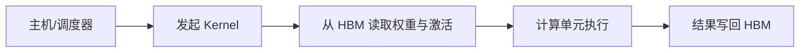

# GPU、显存与数值精度：模型为什么“算得动”却“喂不饱”

把 GPU 想成一家有上万名厨师的大厨房。厨师同时切菜很快，但食材必须从远处仓库运来；如果每做一步都等货车，厨师再多也只能空等。LLM 的矩阵乘法像批量做同一道菜，HBM（High Bandwidth Memory，高带宽显存）像近处仓库，Kernel 像一次下达的工单，而量化像用更小的包装运送食材。

> 本章目标：建立 GPU、HBM、Kernel、算力/带宽瓶颈和数值精度的共同心智模型；能解释 BF16/FP8/量化为何可能省资源，又为何不保证更快或同样准确。

## 学习优先级

| 优先级 | 先掌握什么 | 面试要求 |
|---|---|---|
| P1 | GPU 并行、HBM、Kernel、算力受限/带宽受限、FP32/BF16/FP16、量化 | 能从请求阶段判断主要资源账 |
| P2 | Tensor Core、Kernel Fusion、FP8、Roofline、Per-channel 量化 | 能讲收益成立的前提与风险 |
| 暂不展开 | CUDA 指令编码、手写汇编、特定 GPU 微架构细节 | 除非岗位明确要求 Kernel 开发 |

## 1. GPU 为什么适合 LLM

CPU 核心少而灵活，适合分支多、控制复杂的任务；GPU 有大量并行计算单元，适合对许多元素重复执行类似运算。LLM 的 Linear 与 Attention 包含大量矩阵乘法，因此能利用 GPU 的并行性。

这不表示“任何代码放到 GPU 都快”。下面几类工作可能让 GPU 等待：

- Batch 太小，没有足够并行任务；
- 数据还在 CPU 或网络上；
- Kernel 很碎，启动次数太多；
- 算子分支复杂或内存访问不连续；
- 多卡通信等待最慢参与者。

## 2. 一次 GPU 运算经过什么

教学上可以看成：



Kernel 是在 GPU 上执行的一段并行程序。一次模型前向不是“一个 Kernel”，通常包含矩阵乘、归一化、Attention、采样等许多 Kernel。

Tensor Core 是 NVIDIA GPU 中针对矩阵乘累加优化的硬件单元。能否使用它取决于数据类型、形状、布局和软件实现；仅把配置名改成低精度，不保证自动走到最快路径。

## 3. 显存不是一个速度相同的大桶

GPU 有多级存储：寄存器和片上共享存储很快但很小，HBM 容量较大但访问成本更高。模型权重、激活和 KV Cache 主要驻留 HBM，Kernel 会把当前需要的数据搬到更靠近计算单元的位置。

因此要区分：

| 指标 | 它问什么 |
|---|---|
| 容量 | 数据放不放得下 |
| 带宽 | 每秒能搬多少数据 |
| 算力 | 每秒能做多少算术 |
| 延迟 | 一次请求多久有结果 |
| 吞吐 | 单位时间完成多少工作 |

“显存还有 20GB 空闲”不能证明请求快；“GPU 利用率 90%”也不能单独说明真正瓶颈。

## 4. 算力受限与带宽受限

Arithmetic Intensity（算术强度）的直觉是：

```text
算术强度 = 做了多少次运算 / 搬了多少字节
```

- 同一批数据被重复利用很多次，可能更偏算力受限；
- 每搬一个数只做少量运算，可能更偏带宽受限。

Roofline 模型用硬件峰值算力和内存带宽给出性能上界。它是定位起点，不是脱离实测的判决书。

在 LLM 服务中，Prefill 会一次处理整段输入，Decode 则逐 Token 生成输出。大 Batch Prefill 的矩阵乘往往更容易提高算术强度；小 Batch Decode 每轮反复读取大量权重和 KV，常更容易受带宽影响。但模型、Batch、并行方式和 Kernel 都会改变结论，应结合性能分析工具验证。下一章会完整解释两个阶段。

## 5. 一个可计算的带宽例子

假设某 Decode 步为了生成一批 Token，需要从 HBM 读取约 100GB 数据，只做一次近似估算。若可持续带宽为 2TB/s，忽略计算和其他开销：

```text
理论搬运下界 = 100GB / 2000GB/s = 0.05s = 50ms
```

若实际耗时 80ms，说明仅数据搬运就已占很大比例。此时把矩阵算力翻倍不一定让 80ms 减半；减少读取字节、提高复用或扩大有效 Batch 可能更重要。

这个例子不是任何 DeepSeek 服务的真实测量，也没有包含缓存命中、通信和并发竞争。

## 6. FP32、FP16、BF16 与 FP8 在换什么

浮点数用有限位数表示实数。位数越少，通常越省容量和带宽，也可能获得更高硬件吞吐，但可表示范围或精细程度会下降。

| 类型 | 每元素字节 | 常见直觉 | 主要风险 |
|---|---:|---|---|
| FP32 | 4 | 范围和精度较充足 | 占带宽与容量较多 |
| FP16 | 2 | 精度和吞吐友好 | 数值范围较窄，容易溢出/下溢 |
| BF16 | 2 | 保留接近 FP32 的指数范围 | 有效精度比 FP32 粗 |
| FP8 | 1 | 进一步省传输并提高潜在吞吐 | 格式、缩放、算子支持和误差更敏感 |

“BF16 比 FP16 更精确”不是严谨的通用说法。BF16 的主要优势是更大的数值范围；FP16 在一部分范围内有更多尾数精度。选择要看训练/推理路径和硬件支持。

DeepSeek-V3 官方报告描述了其训练中的 FP8 混合精度框架。这是 V3 报告的具体事实，不应推断所有 DeepSeek 模型、所有算子或 Agent 沙箱都使用同一种精度。

## 7. Mixed Precision：不是全模型只用一种类型

混合精度会让不同数据或算子使用不同类型。例如矩阵乘用低精度提高吞吐，部分累加、归一化或优化器状态保留较高精度。

训练中的 Loss Scaling 会把 Loss 与梯度临时放大，减少 FP16 小梯度下溢，再在更新前缩回并检查非有限值。它解决特定数值问题，不是“Loss 越大越好”。

推理没有反向传播，但仍可能因低精度出现：

- Logit 排名在非常接近时改变；
- 长上下文累积误差；
- Softmax、Normalization 或 RoPE 数值异常；
- 不同 Kernel/并行归约产生细小差异。

所以温度 0 也不等于跨硬件逐 Token 完全复现。

## 8. Quantization：用刻度尺压缩数值

量化把连续浮点值映射到有限整数格点。简化的非对称公式是：

```text
q = clamp(round(x / scale) + zero_point)
x_hat = (q - zero_point) × scale
```

若 `scale=0.1`、`zero_point=0`、`x=0.37`：

```text
q = round(3.7) = 4
x_hat = 4 × 0.1 = 0.4
误差 = 0.03
```

格子更密，误差通常更小但需要更多位；格子更粗则更省空间，但离群值可能挤压大多数普通值的有效分辨率。

<details>
<summary><strong>P2 选读：量化命名与 Kernel Fusion</strong></summary>

## 9. 量化方案名字怎样读

- W8A8：权重 8 bit、激活 8 bit；
- W4A16：权重 4 bit、激活常以 16 bit 路径计算；
- KV Quantization：压缩 KV Cache；
- PTQ（Post-Training Quantization）：模型训练后校准并量化；
- QAT（Quantization-Aware Training）：训练时模拟量化误差，让模型适应。

Per-tensor 使用一套刻度，元数据少但容易受离群值影响；Per-channel 或 Per-group 使用多套刻度，误差通常更可控，却增加元数据与 Kernel 复杂度。

权重文件缩小不等于端到端等比例提速。运行时可能要反量化；若硬件和 Kernel 不支持目标格式，转换开销反而抵消收益。

## 10. Kernel Fusion：少跑几趟仓库

若三个小算子分别读取和写回 HBM，数据可能往返多次。Kernel Fusion 把兼容步骤合并，让中间结果留在更近的存储中，并减少启动开销。

FlashAttention 的核心贡献之一，就是以分块方式减少注意力对 HBM 的读写和大中间矩阵存储，同时保持精确注意力语义。它没有把注意力的所有逻辑计算免费化。

Fusion 也有代价：寄存器压力、复杂编译、形状适配和调试难度。一个在长序列快的融合 Kernel，未必在小 Batch 上也最好。

</details>

## 11. 训练和推理的显存账

训练通常包含：权重、梯度、优化器状态、激活、通信缓冲和临时工作区。推理通常包含：权重、KV Cache、临时激活、批处理元数据和工作区。

模型量化主要先减少权重账；KV 量化减少长上下文和高并发的缓存账；PagedAttention 主要减少分配碎片。它们解决的不是同一个问题。

## 12. 常见失败与排障

### 12.1 低精度后出现 NaN

先定位第一个非有限算子；检查输入范围、缩放、累加类型和溢出统计；再对比 FP32/BF16 基线。不要只在最终输出上替换 NaN。

### 12.2 量化模型变小，却没有变快

检查目标 GPU 是否有对应 Kernel、是否频繁反量化、Batch/形状是否受支持、瓶颈是否原本在网络或调度。分别测模型加载、TTFT（首 Token 延迟）、TPOT（后续每个输出 Token 的平均间隔）和吞吐。

### 12.3 平均指标正常，少数任务质量暴跌

按语言、长度、任务和 Logit 间隔分层评测；保留高风险 Golden Set（固定的关键回归任务集）；比较逐层误差或关键激活。平均困惑度可能掩盖工具参数和代码 Token 的局部回归。

### 12.4 GPU 很忙，吞吐仍低

“忙”可能是等待内存、通信或低效 Kernel。查看 Kernel 时间线、HBM 带宽、矩阵形状、通信等待和队列，而不是只看单一利用率百分比。

## 13. DeepSeek Agent Infra 面试怎么问

### 30 秒答法

> GPU 适合并行矩阵运算，但性能同时受算力、HBM 带宽、容量和 Kernel 效率限制。Prefill 在足够 Batch 下常更容易利用算力，Decode 则可能反复读取权重和 KV 而偏带宽受限，但必须实测。BF16、FP8 和整数量化可减少字节并提高潜在吞吐，代价是范围、精度、缩放和 Kernel 兼容风险；模型变小不等于服务必然等比例加速。

### 常见追问

**为什么 Decode 常比 Prefill 更像带宽问题？**

每轮只生成少量 Token，却要读取大量权重和历史 KV，数据复用可能不足；更大 Batch 可改善复用，但会影响 TPOT。

**BF16 与 FP16 最大的直觉差别是什么？**

BF16 用较少尾数精度换取接近 FP32 的指数范围；FP16 的指数范围更窄。不能只用“谁更精确”概括。

**W4 权重为什么不一定比 BF16 快四倍？**

端到端还有激活、KV、反量化、Kernel、通信和调度；硬件还必须高效支持该格式。

**如何验证一次量化上线？**

先锁定浮点基线，再比较分层质量、安全任务、TTFT、TPOT、吞吐、显存和成本，并做同请求、同环境的配对评测。

## 14. 章末自测

1. 读取 60GB 数据，可持续带宽 1.5TB/s，忽略其他成本时理论下界是多少？
2. 为什么“权重放得下”不能证明目标并发跑得动？
3. BF16、FP16 和 FP8 各自主要在换什么？
4. W8A8、W4A16 和 KV Quantization 分别压缩什么？
5. 量化后文件减半而 TPOT 不变，你会先查哪三项？

## 15. 本章小结

- GPU 的优势来自大规模并行，不是所有代码自动加速。
- 性能要同时看容量、带宽、算力、Kernel、通信和调度。
- 算术强度帮助判断更像算力瓶颈还是数据搬运瓶颈。
- 低精度减少字节和潜在计算成本，也引入范围、舍入和兼容风险。
- 量化可作用于权重、激活或 KV；不同方案解决不同账。
- 优化必须用质量、TTFT、TPOT、吞吐和成本共同验证。

## 一手资料

- [NVIDIA CUDA C++ Programming Guide：GPU 执行与内存模型](https://docs.nvidia.com/cuda/cuda-c-programming-guide/)
- [Roofline：算力与带宽上界模型原始论文](https://doi.org/10.1145/1498765.1498785)
- [Mixed Precision Training 原始论文](https://arxiv.org/abs/1710.03740)
- [FP8 Formats for Deep Learning 原始论文](https://arxiv.org/abs/2209.05433)
- [SmoothQuant：权重与激活量化原始论文](https://arxiv.org/abs/2211.10438)
- [GPTQ：大模型训练后权重量化原始论文](https://arxiv.org/abs/2210.17323)
- [FlashAttention：面向 I/O 的精确注意力](https://arxiv.org/abs/2205.14135)
- [DeepSeek-V3 官方技术报告：FP8 训练与系统事实边界](https://arxiv.org/abs/2412.19437)
