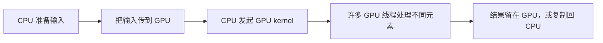
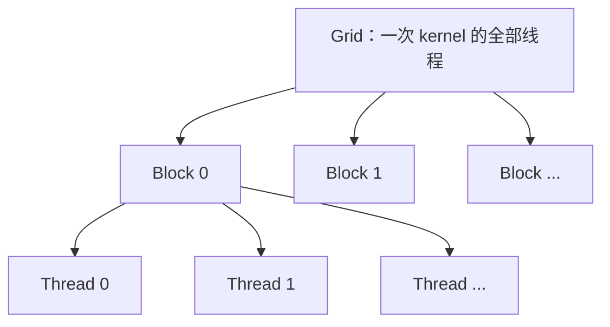
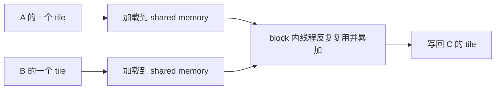
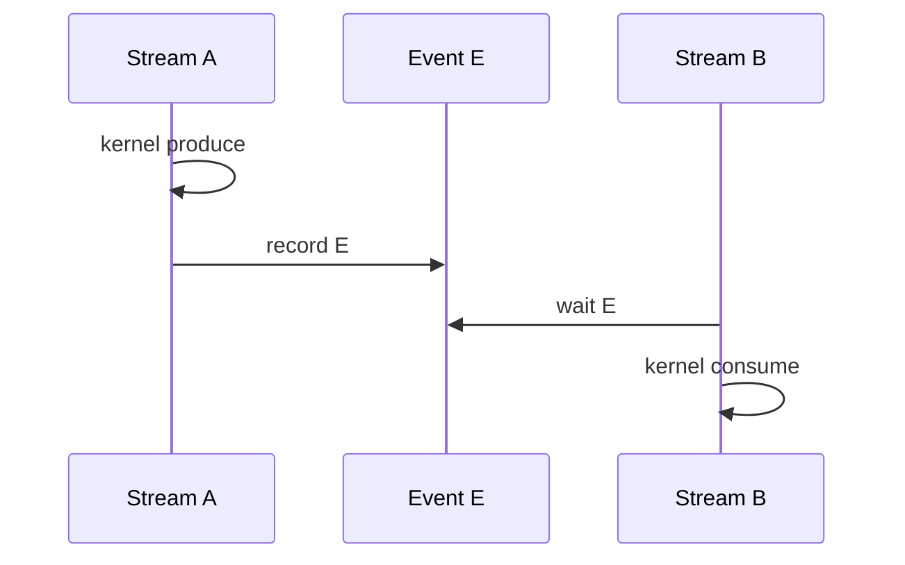

# GPU 并行编程：从一个线程到一个高效 Kernel

CPU 擅长让少量强大的核心处理复杂控制；GPU 擅长让大量较轻的线程对许多数据执行相似工作。这个区别解释了 GPU 为什么适合矩阵、图像和科学计算，也解释了“把循环改成 CUDA”为什么不一定更快：并行任务是否足够、线程怎样访问内存、是否频繁同步，都会决定最终性能。

本章只讨论通用 GPU/CUDA 编程机制。PyTorch 怎样选择并调用 CUDA 算子，见[《PyTorch 运行时》](pytorch_runtime.md)；低精度、量化与 Roofline 的模型侧直觉，见[《GPU、显存与数值精度》](gpu_numerics.md)。

## 1. Host 与 Device 各自做什么

在 CUDA 术语中：

- host 通常指 CPU 及其内存；
- device 指 GPU 及其显存；
- kernel 指由 host 发起、在 device 上由许多线程并行执行的函数；
- kernel launch 指 CPU 配置执行规模并把 kernel 排入 CUDA stream。

一次最简单的 GPU 计算包含四步：



若只计算十个整数，数据传输、launch 和同步成本可能比计算本身更大。GPU 的优势来自把足够多的工作批量提交，并让设备持续执行，而不是某一个线程比 CPU 核心更强。

## 2. Grid、Block 与 Thread 怎样组织

CUDA 把一次 kernel 的线程分成三层：



- grid 由多个 block（线程块）组成；
- block 由多个 thread（线程）组成；
- thread、block 和 grid 最多可用三维坐标表示，便于映射一维数组、二维图像或三维体数据；
- 同一 block 的线程可以使用 shared memory（共享内存）并做块内同步；
- 不同 block 必须能够独立执行，调度器可能以任意顺序、并发度把它们放到 SM 上。

SM（Streaming Multiprocessor，流式多处理器）是 GPU 上调度和执行线程块的一类硬件单元。一个 GPU 有多个 SM；一个 block 在其生命周期内驻留在一个 SM 上，但一个 SM 可以同时驻留多个 block，只要线程、寄存器和共享内存资源允许。

### 2.1 一维数组的全局线程编号

对于一维 grid 和 block，线程处理的全局下标通常是：

```text
i = blockIdx.x × blockDim.x + threadIdx.x
```

- `threadIdx.x` 是线程在本 block 内的编号；
- `blockIdx.x` 是 block 在 grid 内的编号；
- `blockDim.x` 是每个 block 的线程数。

若数组有 `n` 个元素，每 block 取 `T` 个线程，block 数使用向上取整：

```text
blocks = ceil(n / T) = (n + T - 1) / T   // 整数除法
```

最后一个 block 往往有多余线程，所以 kernel 必须检查 `i < n`。

### 2.2 一个向量相加 Kernel

```cuda
__global__ void add(const float* a, const float* b, float* c, int n) {
    int i = blockIdx.x * blockDim.x + threadIdx.x;
    if (i < n) {
        c[i] = a[i] + b[i];
    }
}

int threads = 256;
int blocks = (n + threads - 1) / threads;
add<<<blocks, threads>>>(a, b, c, n);
```

如果 `n=1000`、每 block 256 个线程，则需要 `ceil(1000/256)=4` 个 block，共发起 1024 个线程。最后 24 个线程因 `i>=1000` 不读写数组。边界判断不是性能装饰，而是防止越界访问。

### 2.3 二维映射怎样算

处理宽为 `W`、高为 `H` 的图像时，可让 `x` 对应列、`y` 对应行：

```cuda
int x = blockIdx.x * blockDim.x + threadIdx.x;
int y = blockIdx.y * blockDim.y + threadIdx.y;
if (x < W && y < H) {
    int linear = y * W + x;
    output[linear] = f(input[linear]);
}
```

二维只是编号方式更直观，Storage 最终仍常按一维地址访问。考试题先把每一维的 grid 大小分别向上取整，再检查边界。

## 3. Warp 与 SIMT：线程并不是完全各走各的

CUDA 让程序员写“每个线程执行一份标量程序”，硬件则把相邻线程组成 warp，以 SIMT（Single Instruction, Multiple Threads，单指令多线程）方式调度。同一 warp 的线程通常在同一时刻执行同一条指令，但每个线程有自己的寄存器、下标和数据。

NVIDIA 当前 CUDA 架构中，一个 warp 含 32 个线程。正确程序应优先使用 CUDA 提供的 warp size 与 active mask 语义，不应把“所有未来设备和所有 GPU 厂商都一定是 32”写进算法正确性。

### 3.1 分支分歧为什么会浪费执行槽位

考虑：

```cuda
if (value[i] >= 0) {
    output[i] = sqrtf(value[i]);
} else {
    output[i] = 0;
}
```

若一个 warp 内一部分线程走 `if`，另一部分走 `else`，硬件要在 active mask 控制下分别执行两条路径：走第一条路径时屏蔽第二组线程，走第二条时屏蔽第一组线程。这叫 branch divergence（分支分歧）。

```text
全部线程走 A：执行 A 一次，32 个线程槽位都有用
一半 A、一半 B：先执行 A（约一半槽位被屏蔽），再执行 B（另一半被屏蔽）
```

分歧发生在 warp 内；不同 warp 走不同分支通常不是同一种损失。边界判断只影响最后少量 warp 时，成本可能很小，不能为了消除一个 `if` 就引入复杂或不安全代码。

循环次数因线程数据不同也会造成分歧。优化思路是让同一 warp 处理控制路径更相似的数据，或用掩码/无分支表达，但替换后指令数可能上升，所以要测量。

### 3.2 独立线程调度不等于可以省略同步

较新的 CUDA 架构允许 warp 内线程在分歧时更独立地推进。这不会把数据竞争变正确。只要一个线程读取另一个线程写的数据，就仍需文档规定的同步和内存可见性机制。依赖“warp 内天然锁步”的旧式技巧可能在新架构上失效。

## 4. GPU 的内存层次

GPU 上的数据位置不同，容量、作用域和访问成本也不同：

| 层次 | 典型作用域 | 生命周期 | 主要用途与风险 |
|---|---|---|---|
| register（寄存器） | 单线程 | 线程执行期间 | 最靠近执行单元；数量有限，压力过大会 spill |
| local memory（局部内存） | 逻辑上单线程 | 线程执行期间 | 大数组、动态索引或寄存器 spill 常落到设备内存，名字“local”不表示片上很快 |
| shared memory（共享内存） | 同一 block | block 执行期间 | 线程协作与数据复用；容量有限，存在 bank conflict |
| L1/L2 cache | SM 或全设备共享层次 | 硬件管理 | 缓存近期访问；命中率受访问模式和竞争影响 |
| global memory / HBM | 全设备 | 分配到释放 | 容量大、带宽高但访问延迟远高于寄存器；需合并访问和复用 |
| constant memory | 全 grid 可读 | host 管理 | 适合 warp 内读取同一小型只读数据；不适合任意大表 |

“寄存器最快、global memory 最慢”只是起点。一次 kernel 的真正速度取决于访问是否合并、缓存命中、复用次数、并发请求数和计算能否遮蔽延迟。

## 5. 合并访存：相邻线程应尽量访问相邻地址

GPU 的 global memory 以一定粒度完成内存事务。一个 warp 发起读写时，硬件会把线程请求合并成尽可能少的事务。若相邻线程访问相邻且对齐的数据，通常需要的事务较少；若每个线程跨很大步长，可能要发许多事务并搬运大量未使用字节。

### 5.1 连续访问与跨列访问

设二维矩阵以行优先方式保存，地址为 `A[row * width + col]`。

若 warp 中线程编号映射到连续的 `col`：

```cuda
float x = A[row * width + col];
```

相邻线程读相邻 float，通常容易 coalesce（合并）。

若线程编号映射到 `row`，而列固定：

```cuda
float x = A[row * width + fixed_col];
```

相邻线程地址相差 `width` 个元素，可能形成跨步访问，内存事务利用率较低。

这不表示所有转置访问都应禁止。常见方法是把一个 tile（小块）合并读入 shared memory，在片上完成布局变换，再合并写回。

### 5.2 用“请求字节”和“实际搬运字节”判断

假设 32 个线程各读一个 4-byte float，请求数据共 `32×4=128 byte`。若地址连续且对齐，硬件可能用少量事务覆盖这些字节；若每个线程落在不同内存段，实际搬运可能远大于 128 byte。

分析题不要只数 load 指令数量。需要问：

1. 一个 warp 的地址分别是什么；
2. 地址是否连续、对齐；
3. 映射到多少内存事务；
4. 实际使用的字节占搬运字节多少。

具体事务粒度受架构、缓存层次和访问宽度影响，应以目标 GPU 的 profiler 指标验证，不要死背某一代固定数字。

## 6. Shared Memory 与 Bank Conflict

shared memory 位于 SM 上，由同一 block 的线程共享。它常用于两件事：

- 把 global memory 数据分块加载后重复使用，减少 HBM 流量；
- 让线程交换中间结果，例如归约或矩阵转置。

shared memory 被划分为多个 bank（存储体），不同 bank 可并行服务访问。若一个 warp 的多个线程在同一条指令中访问同一 bank 的不同地址，请求通常要分批处理，这叫 bank conflict（bank 冲突）。若所有线程读取同一地址，硬件可使用广播语义，不应误判为普通冲突。

### 6.1 为什么二维 tile 常多加一列

经典转置会声明：

```cuda
__shared__ float tile[TILE][TILE + 1];
```

若二维数组每行宽度恰好与 bank 数形成不利整倍数，按列访问时许多线程可能落到同一 bank。多加一列改变每行起点的 bank 映射，让连续行错开，从而减少冲突。

`+1` 不是普遍魔法：元素宽度、bank 组织和访问模式都会影响结果。做题时应按地址到 bank 的映射计算；工程中用 shared-load/store 的 bank conflict 指标确认。

## 7. 同步、内存可见性与数据竞争

数据竞争发生在多个线程并发访问同一位置，至少一个是写，并且没有足够同步来规定顺序。结果可能随调度变化，甚至每次运行不同。

### 7.1 `__syncthreads()` 能保证什么

`__syncthreads()` 是 block 级 barrier（屏障）：

1. 同一 block 中参与的线程都到达屏障后才能继续；
2. 屏障前的 shared/global memory 写入，对屏障后的本 block 线程按 CUDA 规定可见。

典型分块过程是：

```cuda
shared[threadIdx.x] = global[input_index];
__syncthreads();
// 现在本 block 的线程才能安全读取彼此写入的 shared 元素
float x = shared[other_index];
```

如果 `__syncthreads()` 位于并非全 block 一致的条件分支中，部分线程到达、部分线程不来，可能死锁或产生未定义行为。安全写法要保证整个 block 对该分支作出一致决定。

普通 kernel 内没有便宜的全 grid 屏障，因为不同 block 可能没有同时驻留，等待未调度 block 会死锁。跨 block 阶段通常拆成两个 kernel；前一个 kernel 完成后，同一 stream 中后一个 kernel 才开始。Cooperative Groups 提供受约束的 grid 同步，但需要满足驻留和启动条件，不能当通用替代。

### 7.2 memory fence 不是 barrier

memory fence 主要约束内存操作的可见顺序，不保证其他线程已经到达某个执行点。barrier 同时协调参与者进度，常还带可见性语义。面试中若问“加 fence 能否代替所有线程同步”，答案通常是否：还需说明谁等待谁、完成信号怎样发布。

### 7.3 Atomic 解决更新丢失，但不自动解决一切

多个线程执行：

```text
counter = counter + 1
```

它实际包含读、加、写。两个线程可能都读到 5，最后都写 6，丢掉一次更新。`atomicAdd(&counter, 1)` 把这次 read-modify-write 作为原子操作，避免更新丢失。

原子操作仍可能成为热点：大量线程争用同一地址时会排队。常见优化是先在 warp 或 block 内局部归约，再让少量线程原子更新全局结果。

原子性也不等于完整协议正确。若线程先写数据、再原子设置 ready flag，消费者还需要满足相应的内存顺序与可见性要求，不能只看到一个 atomic 就认为所有字段都安全。

浮点原子加的并行顺序可能变化，而浮点加法不满足严格结合律，因此结果可能有微小非确定差异。这不等于原子实现错误。

## 8. 用分块矩阵乘理解数据复用

设 `C = A×B`，其中：

```text
C[i,j] = Σ A[i,k] × B[k,j]
```

朴素做法让每个线程计算一个 `C[i,j]`，并从 global memory 反复读取整行 A 和整列 B。相邻输出会重复需要许多相同输入。

分块方法让一个 block 负责 C 的一个 tile：



简化伪代码：

```cuda
for (int tile = 0; tile < num_tiles; ++tile) {
    cooperative_load(A_tile, B_tile);
    __syncthreads();
    for (int k = 0; k < TILE; ++k) {
        accumulator += A_tile[local_row][k] * B_tile[k][local_col];
    }
    __syncthreads();
}
```

第一处同步保证 tile 已全部加载；第二处保证所有线程用完当前 tile 后才能覆盖它。收益来自 global memory 数据被多个线程复用，代价是 shared memory、同步、边界处理与寄存器累加器。

这段只解释通用 tiling 思路。生产 GEMM 还会考虑向量化访问、层级分块、流水化、Tensor Core、布局转换和尾块等，通常应优先使用成熟库而不是手写替代。

## 9. Occupancy、延迟隐藏与寄存器 Spill

occupancy（占用率）通常指一个 SM 上实际驻留的 active warp 数，相对于硬件允许最大 active warp 数的比例。多个 warp 驻留的价值是：一个 warp 等待内存时，调度器可执行另一个已就绪 warp，从而隐藏延迟。

一个 block 能否驻留受多种资源共同限制：

```text
受线程数限制的 blocks = floor(SM 最大线程数 / 每 block 线程数)
受寄存器限制的 blocks = floor(SM 寄存器总数 / 每 block 使用寄存器数)
受共享内存限制的 blocks = floor(SM 共享内存 / 每 block 共享内存)
实际驻留 blocks = 上述限制与硬件 block 上限中的最小值
```

每 block 使用寄存器数还要考虑“每线程寄存器数 × block 线程数”及硬件分配粒度。

### 9.1 一个资源计算例子

为教学简化，假设某 SM 最多 2048 个线程、65536 个寄存器、64 KiB shared memory、最多 16 个 block。某 kernel 每 block 256 线程、每线程 32 个寄存器、每 block 16 KiB shared memory：

```text
线程限制：floor(2048/256) = 8 blocks
寄存器限制：floor(65536/(256×32)) = 8 blocks
共享内存限制：floor(64/16) = 4 blocks
block 数上限：16 blocks

所以最多驻留 min(8,8,4,16) = 4 blocks
active threads = 4×256 = 1024
简化 occupancy = 1024/2048 = 50%
```

真实工具会纳入寄存器与 shared memory 分配粒度、架构限制等细节；手算的价值是找到主限制资源，这里是 shared memory。

### 9.2 高 occupancy 为什么不一定更快

- kernel 若已充分隐藏延迟，更多 warp 不再带来收益；
- 为提高 occupancy 强行降低寄存器上限，可能让活跃值 spill 到 local/global memory，额外访存反而更慢；
- 更大的 tile 可能降低 occupancy，却提高数据复用和算术强度；
- 计算依赖链、指令吞吐或内存带宽已饱和时，occupancy 不是唯一瓶颈。

register spill（寄存器溢出）是编译器无法把所有线程私有值保存在寄存器中，只能把一部分放到 local memory。local memory 逻辑上属于线程，物理上通常位于设备内存层次，会增加 load/store 与缓存压力。用编译器资源报告和 profiler 的 local memory 指标验证，不要仅从源代码变量个数猜。

## 10. Stream、Event 与 CUDA Graph

CUDA stream 是一条按顺序执行的设备工作队列。同一 stream 中，后入队操作要等前面依赖完成；不同 stream 可在资源和依赖允许时重叠 kernel、H2D/D2H copy 等工作。

### 10.1 Event 是设备时间线上的标记

event 被记录到某个 stream 后，只有该 stream 之前的工作完成，event 才算完成。用途包括：

- 让另一个 stream 等待该 event，表达跨流依赖；
- 让 CPU 查询或等待设备进度；
- 记录两个 event 之间的设备时间。



没有 `wait E` 时，B 可能在 A 写完前读取结果，形成跨流数据竞争。

### 10.2 CUDA Graph 减少重复 launch 开销

很多工作负载每轮执行同一串 kernel。普通方式每轮都由 CPU 和驱动逐个提交；CUDA Graph 可以先 capture（捕获）一段操作和依赖，再用一次 graph launch 重放，以减少 CPU launch 开销并稳定调度。

它不是把 kernel 自动优化成更快算法。捕获与重放通常要求地址、控制流和资源行为满足限制；输入 shape 经常变化、运行中动态分配或 CPU 逻辑参与时，需要分桶、预分配或多个 graph。适合与否应看时间线中 launch gap 是否显著。

## 11. 一次 Kernel 到底受算力还是数据搬运限制

先做两个下界估算：

```text
计算时间下界 = 总 FLOP / 可持续计算吞吐
内存时间下界 = 必需搬运字节 / 可持续内存带宽
```

两者较大者给出主要物理下界，实际还包括 launch、依赖、缓存未命中和低效指令等。

以向量加 `c[i]=a[i]+b[i]` 为例，每元素：

- 读取 `a` 4 byte；
- 读取 `b` 4 byte；
- 写 `c` 4 byte；
- 做 1 次浮点加法。

忽略 write allocate 等细节，算术强度约为：

```text
1 FLOP / 12 byte ≈ 0.083 FLOP/byte
```

它的数据复用极少，通常更容易受内存带宽而非浮点算力限制。把加法换成更快的执行单元不会自动减少 12 byte 流量。

## 12. 性能分析：先定位层次，再优化

NVIDIA 的两类工具回答不同问题：

| 工具 | 主要观察范围 | 适合回答的问题 |
|---|---|---|
| Nsight Systems | CPU 线程、CUDA API、stream、kernel、copy、通信时间线 | GPU 为什么有空洞？是否频繁同步？通信与计算是否重叠？ |
| Nsight Compute | 单个或一组 CUDA kernel 的硬件指标与源码关联 | 这个 kernel 为何慢？访存是否合并？occupancy、stall、bank conflict 如何？ |

推荐顺序：

1. 固定可复现输入，保留正确性基线；
2. 预热，避免首次 JIT、模块加载、缓存建立干扰；
3. 用 CUDA Event 或 profiler 测稳定分布，而不是只测一次；
4. 先用 Systems 找到耗时 kernel、空洞、copy 与同步；
5. 再用 Compute 检查少数热点 kernel 的内存、执行单元和调度指标；
6. 提出一个可验证假设，例如“跨步访问导致过多内存事务”；
7. 只改一项，重新测时间、吞吐和结果误差。

### 12.1 指标不能脱离分母

- “GPU utilization 高”可能只是设备持续有 kernel，不表示执行单元高效；
- “occupancy 低”不证明它就是瓶颈；
- “缓存命中率高”也可能总请求量过大；
- “kernel 加速 2 倍”若只占端到端 5%，整体最多改善很少；
- profiler 本身有采样或 replay 开销，采集结果不一定等于无分析时的延迟。

优化报告至少要写硬件、软件版本、输入 shape/dtype、warm-up、重复次数、同步边界、正确性容差与统计量。

## 13. 正确性与故障定位

### 13.1 非法内存访问

先查全局下标和边界；再查 host 分配大小、dtype/对齐、对象生命周期。异步执行会让错误在后续同步点才上报，可临时改为同步启动以定位首个失败 kernel，并使用 Compute Sanitizer 的 memcheck。

### 13.2 只在大输入或高优化级别出错

常见原因包括数据竞争、遗漏同步、整数下标溢出、错误的尾块处理、未初始化 shared memory、对齐假设不成立。用极小确定样例、CPU 参考实现、随机形状和 sanitizer 缩小范围。

### 13.3 结果偶尔有微小差异

并行浮点归约的加法顺序可能变化，而浮点舍入使 `(a+b)+c` 不一定等于 `a+(b+c)`。先判断误差是否在合理容差内，再区分“数值非确定性”和“真正竞态”。整数计数也变化通常更可疑。

### 13.4 Kernel 比 CPU 还慢

检查输入规模、传输是否计入、launch 是否过碎、是否每步同步、并行度、访存合并与算术强度。CPU 与 GPU 比较必须说明数据最初和最终位于哪里；若数据本来就在 GPU，强行算上一次不必要的往返并不公平，反之亦然。

<details>
<summary><strong>选读：硬件代际相关的矩阵与异步搬运能力</strong></summary>

不同 NVIDIA GPU 代际提供不同 Tensor Core 数据类型、矩阵指令形状，以及异步 global-to-shared 搬运机制。较新的架构还可能提供更复杂的批量张量搬运与 warp-group 矩阵指令。

这些能力的共同目的可以用三句话概括：

1. 用专门硬件提高矩阵乘加吞吐；
2. 让数据搬运与前一批计算重叠，形成多级流水；
3. 让一组线程协作完成更大的矩阵 tile。

但具体指令、对齐、shape、shared-memory layout 和同步协议会随 compute capability 改变。面试若岗位不是 CUDA kernel/编译器方向，讲清“分块—复用—流水—资源权衡”通常比背某条指令编码更重要。实际实现应根据目标架构查 CUDA Programming Guide、PTX ISA 和库文档，并保留普通 CUDA 或成熟库回退路径。

</details>

## 14. 做题方法：把线程、地址、资源、时间线分开画

### 14.1 线程编号题

1. 每个维度分别写 `global = blockIdx×blockDim+threadIdx`；
2. 每个维度用向上取整算 grid；
3. 计算总 launch 线程数；
4. 最后写边界条件，避免把多余线程算作有效工作。

### 14.2 访存题

1. 固定一个 warp，列出相邻线程的地址表达式；
2. 把元素下标乘元素字节数；
3. 看地址是否连续、对齐、跨步；
4. 对 shared memory 再把地址映射到 bank；
5. 结论写成“可能增加事务/冲突，需以目标架构指标验证”，不要凭函数名判断。

### 14.3 同步题

1. 列出谁写、谁读、读写哪块内存；
2. 画出期望的先发生关系；
3. 确定参与范围是 warp、block、grid 还是不同 kernel/stream；
4. barrier、event、atomic 和 fence 各自只解决相应问题；
5. 检查是否所有需要到达 barrier 的线程都会到达。

### 14.4 Occupancy 题

分别按线程、warp、寄存器、shared memory 和 block 数计算上限，取最小值。若题目没给分配粒度，应注明“教学简化”。找到限制资源后，还要说明 occupancy 只影响延迟隐藏，不能单独推出性能。

### 14.5 优化题

先给证据，再给改动：时间线确认是 launch gap，才考虑 graph/fusion；内存事务利用率低，才改布局；bank conflict 高，才改 padding；stall 来自依赖或执行吞吐时，盲目提高 occupancy 可能无效。

## 15. 章末面试问题

### 30 秒答法

> CUDA 用 grid、block、thread 把数据映射给大量线程，硬件按 warp 以 SIMT 调度。高效 kernel 要让相邻线程合并访问 global memory，用 shared memory 分块复用数据并避免 bank conflict；跨线程读写必须用正确的 barrier、atomic 或 stream event 建立依赖。性能还受寄存器、shared memory 和 occupancy 权衡影响。我会先用 Nsight Systems 找端到端空洞，再用 Nsight Compute 检查热点 kernel，而不是只看 GPU 利用率。

### 常见追问

**block 为什么必须能独立执行？**

硬件不保证 block 的执行顺序，也不保证所有 block 同时驻留。普通 kernel 若让已驻留 block 等待尚未调度 block，可能无法前进。

**shared memory 为什么可能更快？**

它位于 SM 上，可让 block 内线程复用已从 global memory 搬来的数据。但容量有限，访问不当还会 bank conflict，所以不是把所有数组放进去就快。

**occupancy 从 50% 提高到 100% 会快一倍吗？**

不会这样线性推导。若 50% 已遮蔽延迟，或瓶颈在带宽/指令吞吐，额外 warp 没有相同比例收益；为提高 occupancy 导致 spill 甚至会更慢。

**CUDA Graph 优化了什么？**

它主要减少重复工作流的 CPU/driver 提交开销，并固定依赖图；不会自动改变单个 kernel 的算法和内存访问效率。

## 16. 章末自测

1. 处理 `n=10,000` 个元素，每 block 256 个线程。需要多少个 block？总共发起多少线程？多少线程因边界检查不工作？
2. 一个 warp 中，线程 `t` 读取 `a[base+t]`；另一版本读取 `a[base+t×1024]`。哪一种通常更容易合并访存，为什么？
3. 32 个线程各把同一个全局计数器执行一次普通 `counter++`。为什么结果可能小于 32？原子加解决了什么，又没有解决什么性能问题？
4. 某 block 先让前 128 个线程写 shared memory，再让后 128 个线程读取，却把 `__syncthreads()` 放在 `if (threadIdx.x<128)` 内。问题在哪里？
5. 教学硬件每 SM 有 2048 线程、65536 寄存器、96 KiB shared memory、最多 16 block。kernel 每 block 256 线程、每线程 40 寄存器、每 block 24 KiB shared memory。忽略分配粒度，最多驻留多少 block？简化 occupancy 是多少？
6. 向量加处理一亿个 float 元素，每元素读 8 byte、写 4 byte。若可持续内存带宽为 600 GB/s，忽略其他开销，数据搬运时间下界是多少？
7. CPU 计时显示一个 kernel 只需 0.03 ms，但 CUDA Event 显示 2.4 ms。哪个结果分别测到了什么？
8. 一个 kernel 的 occupancy 较低。列出至少三项证据，用来判断是否值得提高它。

### 参考答案与解答

<details>
<summary>展开答案</summary>

1. `blocks=ceil(10000/256)=ceil(39.0625)=40`。总线程数是 `40×256=10,240`，多余线程是 `10,240-10,000=240`。kernel 必须用 `if(i<n)` 让这 240 个线程不访问数组。

2. `a[base+t]` 让相邻线程访问相邻元素，32 个 float 请求覆盖连续 128 byte，通常可合并为较少的内存事务。`a[base+t×1024]` 让相邻线程相隔 4096 byte，往往落在不同内存段，需要更多事务并搬运大量未使用数据。确切事务数取决于对齐、缓存和架构，但第一种访问模式通常更友好。

3. `counter++` 是读—改—写三步。多个线程可能读到相同旧值，各自加一后又覆盖彼此，所以更新丢失。`atomicAdd` 让每次 read-modify-write 不可分割，保证计数正确；但 32 个线程仍争用同一地址，硬件可能串行处理热点，因此原子性没有消除争用成本。可先做 warp/block 局部汇总，再少量原子写全局。

4. 只有前 128 个线程进入条件并到达 barrier，后 128 个不进入。`__syncthreads()` 要求整个 block 以一致方式参与，否则可能死锁或产生未定义行为。应让所有线程先按各自角色写入或空操作，再在条件外统一同步，之后再让消费者读取。

5. 线程限制是 `floor(2048/256)=8` blocks。每 block 寄存器为 `256×40=10,240`，寄存器限制是 `floor(65536/10240)=6` blocks。shared memory 限制是 `floor(96/24)=4` blocks，硬件 block 上限为 16。因此最多驻留 `min(8,6,4,16)=4` blocks。active threads 为 `4×256=1024`，简化 occupancy 为 `1024/2048=50%`。限制资源是 shared memory。

6. 每元素搬运 `12 byte`，总字节为 `100,000,000×12=1.2×10^9 byte=1.2 GB`。下界 `1.2 GB÷600 GB/s=0.002 s=2 ms`。这是十进制单位下的理想搬运下界；launch、地址效率、计算和其他流量会让实际更慢。

7. 没有同步的 CPU 计时主要测 kernel launch/入队，大约 0.03 ms；CUDA Event 在设备 stream 上记录起止，等待完成后测得约 2.4 ms 的设备执行时间。若要端到端延迟，还要定义是否包含输入复制、排队和输出同步。

8. 至少检查：第一，profiling 的 warp stall 是否主要来自需要更多 active warp 才能隐藏的长延迟；第二，kernel 是否已把内存带宽或某执行单元打满；第三，提高 occupancy 要牺牲多少寄存器/shared memory，是否造成 spill 或降低 tile 复用；还可检查当前 active warps、eligible warps、block 数、指令依赖链和 kernel 在端到端的占比。只有证据指向驻留并行度不足，才应围绕 occupancy 调参。

</details>

## 17. 本章小结

- grid、block 和 thread 决定工作映射；越界检查保护最后一个不满 block。
- 硬件按 warp 执行 SIMT，warp 内分支分歧会屏蔽一部分线程。
- global memory 要关注合并访问与实际事务；shared memory 用于复用和交换数据，但要避免 bank conflict。
- barrier、fence、atomic 和 event 解决不同层次的顺序问题，不能互相随意替代。
- occupancy 由线程、寄存器、shared memory 等共同限制；更高不等于必然更快，spill 可能抵消收益。
- stream 支持异步和并发，event 表达设备依赖，CUDA Graph 主要减少重复提交开销。
- 性能优化应先用 Systems 找全局瓶颈，再用 Compute 检查热点 kernel，并用正确性与统计结果验证。

## 一手资料

- [NVIDIA CUDA C++ Programming Guide](https://docs.nvidia.com/cuda/cuda-c-programming-guide/)
- [NVIDIA CUDA Programming Guide：Programming Model](https://docs.nvidia.com/cuda/cuda-programming-guide/01-introduction/programming-model.html)
- [NVIDIA CUDA Programming Guide：Memory Hierarchy](https://docs.nvidia.com/cuda/cuda-programming-guide/02-basics/understanding-memory.html)
- [NVIDIA CUDA Programming Guide：Asynchronous Execution](https://docs.nvidia.com/cuda/cuda-programming-guide/02-basics/asynchronous-execution.html)
- [NVIDIA PTX ISA](https://docs.nvidia.com/cuda/parallel-thread-execution/)
- [NVIDIA CUDA Best Practices Guide](https://docs.nvidia.com/cuda/cuda-c-best-practices-guide/)
- [NVIDIA Nsight Systems Documentation](https://docs.nvidia.com/nsight-systems/)
- [NVIDIA Nsight Compute Documentation](https://docs.nvidia.com/nsight-compute/)
- [NVIDIA Nsight Compute Profiling Guide](https://docs.nvidia.com/nsight-compute/ProfilingGuide/)
- [NVIDIA Compute Sanitizer](https://docs.nvidia.com/compute-sanitizer/ComputeSanitizer/)
