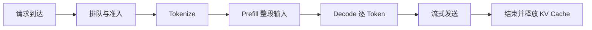

# LLM 推理系统：Prefill、Decode、KV Cache 与连续批处理

把 LLM 服务想成机场。Prefill 像旅客一次性办理值机：要读完护照、行李和行程，单次工作较大但可以并行处理许多资料；Decode 像登机口逐个放行，每一轮每位旅客只向前走一步，却要反复读取已有记录。值机队伍和登机队伍若共用有限柜台，怎样排班就决定了首响应、持续速度和总吞吐。

LLM 推理要分别计算 Prefill、Decode、KV Cache、TTFT、TPOT 和连续批处理。PagedAttention、量化、Prefix Cache 和模型并行则针对不同的显存、计算或调度成本。

## 1. 一次请求经历哪些阶段



线上指标必须写清测量边界。例如 TTFT 从“网关收到最后一个请求字节”开始，还是从“GPU Scheduler 接收任务”开始，会得到完全不同的数值。

## 2. Prefill 与 Decode 为什么像两种工作负载

### 2.1 Prefill

Prefill 一次处理全部输入 Token，为每层计算隐藏状态，并建立历史 KV Cache。序列内部有因果关系，但已知整段输入，因此 GPU 可以对许多位置并行做矩阵运算。

典型特征：

- 单次计算量随输入长度明显增长；
- 大矩阵乘法较容易利用 GPU 算力；
- 长 Prompt 会推高首 Token 延迟；
- 一个超长 Prefill 可能干扰正在 Decode 的请求。

### 2.2 Decode

Decode 每轮为每个活跃请求生成一个新 Token，并把新 K/V 加入缓存。下一轮必须等本轮 Token 确定，所以单个序列通常难以沿时间维并行。

典型特征：

- 每轮计算粒度较小；
- 要读取模型权重和历史 KV；
- 常受显存带宽与调度开销影响；
- 通过把多个请求组成 Batch 才更容易提高硬件利用率。

| 对比 | Prefill | Decode |
|---|---|---|
| 一次处理 | 整段输入 | 每请求通常一个新 Token |
| 并行性 | 序列位置可批量计算 | 单序列时间方向串行 |
| 关键资源 | 计算、激活、注意力 I/O | 权重/KV 读取、显存容量、调度 |
| 用户感知 | 主要影响 TTFT | 主要影响连续输出速度 |

“Prefill 一定算力受限、Decode 一定带宽受限”是有用起点，不是跨模型、Batch 和硬件的定律；最终要用 Roofline、Profiler 和实测确认。

## 3. KV Cache 为什么存在

生成第 `t+1` 个 Token 时，历史 Token 的 Key 和 Value 不会改变。若每一步都从头重算整个前缀，会重复大量工作。KV Cache 把每层历史 K/V 留在显存中，新 Token 只计算自己的 K/V，再与历史缓存做注意力。

缓存代价随这些量近似线性增长：

```text
KV bytes ≈ 层数 × KV头数 × 每头维度 × 2(K和V)
           × 每元素字节数 × 已缓存Token数 × 活跃序列数
```

### 一个带数字的教学算例

假设 32 层、32 个 KV 头、每头 128 维、BF16 每元素 2 bytes：

```text
每 Token 每请求
= 32 × 32 × 128 × 2 × 2
= 524,288 bytes
= 512 KiB
```

若上下文已有 2,048 Token：

```text
512 KiB × 2,048 = 1 GiB/请求
```

这不是某个 DeepSeek 模型的真实配置。GQA/MQA、[MLA](deepseek_architecture.md)、缓存量化和层配置都可大幅改变结果。面试计算的价值是展示影响项，而不是背一个通用“每 Token 内存”。

## 4. 结构、量化与数值精度怎样进入推理账单

### 4.1 MLA、GQA 与缓存结构优化

- MQA 让许多 Query 头共享一组 K/V 头；
- GQA 让一组 Query 头共享较少的 K/V 头；
- MLA 学习 K/V 的联合低秩潜在表示，并处理位置相关部分；
- KV Cache 量化用更少字节保存元素，但需验证质量和 Kernel 支持。

这些方法共同降低缓存或读取压力，但模型结构和权重必须匹配。不能把一个普通 MHA（Multi-Head Attention，多头注意力）权重在服务配置中简单声明成 MLA。

Prefix Caching 还能复用多个请求共同的系统提示或文档前缀。缓存键必须包含模型、Tokenizer、Chat Template 和影响结果的配置；权限敏感前缀还要隔离租户，避免跨租户信息泄露。

### 4.2 权重、激活和 KV 量化不是同一件事

量化把数值映射到更少的 bit。名字通常写成 `W位数A位数`：W8A8 表示权重与激活都以 8 bit 为主要量化目标；W4A16 表示权重更低位、激活通常走 16 bit 路径。

| 量化对象 | 首先减少什么 | 主要风险 |
|---|---|---|
| 权重 | 模型驻留容量与权重读取字节 | 反量化开销、模型质量、Kernel 支持 |
| 激活 | 算子中间传输及潜在低精度计算 | 离群值、累积误差、校准失配 |
| KV Cache | 长上下文请求的缓存容量与读取字节 | 注意力质量、动态范围、专用 Kernel |

一个 16GB 的纯权重张量若从 16 bit 压到 4 bit，只看位数的理想存储是：

```text
16GB × 4/16 = 4GB
```

真实服务还需要 Scale/Zero-point 等元数据、未量化层、工作区与对齐空间，所以进程显存不会严格从 16GB 变成 4GB。更重要的是，KV Cache 和临时激活没有因权重量化自动缩小。

### 4.3 为什么模型变小不保证同比例加速

若 Decode 主要在搬权重，减少权重字节有机会改善 TPOT；若瓶颈在 KV、网络、采样、排队或客户端背压，收益会小得多。硬件若没有高效的 4-bit Kernel，还可能先解包到高精度再算，额外工作抵消带宽收益。

因此量化上线至少要配对比较：

- 任务质量与安全回归；
- 模型加载时间和峰值显存；
- 不同 Prompt/输出长度下的 TTFT、TPOT；
- 不同 Batch 的聚合吞吐；
- 每请求成本和失败率。

量化公式、FP16/BF16/FP8 与 Kernel 的基础见 [GPU、显存与数值精度](gpu_numerics.md)。

### 4.4 Prefill、Decode 与算力/带宽的联系

Prefill 能在已知输入的多个位置上做较大的矩阵乘，Batch 足够时常更容易提高数据复用和计算单元利用率。Decode 每轮每请求只前进一个 Token，却要读取权重与历史 KV，常更容易受 HBM 带宽影响。

这是诊断假设，不是定律：

| 变化 | 可能让瓶颈改变的原因 |
|---|---|
| Batch 变大 | 权重复用提高，但单轮变长、KV 读取增加 |
| Prompt 变长 | Prefill 算量与 Attention I/O 增加 |
| KV 变长 | Decode 每轮历史读取增加 |
| Tensor/Expert Parallel 增大 | 单卡计算减少，通信比例上升 |
| 量化或融合 Kernel | 数据字节和算子路径改变 |

判断时应使用 Kernel 时间线、HBM 带宽、算术吞吐和通信等待验证，而不是只凭 GPU 利用率猜测。

### 4.5 数值精度也是服务正确性

低精度和并行归约可能让接近的 Logit 交换次序。对普通文本，这可能只改变措辞；对工具参数、停止 Token 或结构化输出，单个 Token 的变化可能改变外部动作。

可靠上线应：

1. 锁定浮点基线、模型和 Tokenizer；
2. 在相同请求上做配对回归，不只看平均困惑度；
3. 分层检查代码、数字、长上下文、工具 JSON 和安全任务；
4. 记录精度、量化配置、Kernel 与引擎版本；
5. 为非法结构和高风险动作保留确定性校验。

## 5. 三个核心延迟指标

### 5.1 TTFT：Time To First Token

从约定起点到用户收到第一个输出 Token 的时间。若从网关入口测量，可粗略拆成：

```text
TTFT = 排队 + Tokenize/预处理 + Prefill（含首 Token 计算与采样）+ 传输
```

这里按主流 serving 口径，把 Prefill 末端产生首个输出 Token 计入 Prefill；之后第一次独立 Decode 迭代通常产生第二个输出 Token。不同框架对阶段的命名可能不同，所以排查前要先确认指标边界，避免把首 Token 计算算两次。

### 5.2 TPOT：Time Per Output Token

首 Token 之后，每个输出 Token 的平均间隔。也常看到 ITL/TBT（Inter-Token Latency / Time Between Tokens）。团队必须写清是否包含网络发送、是否用平均值、怎样处理流式背压。

### 5.3 端到端延迟

生成 `N` 个输出 Token 时，可用教学近似：

```text
总延迟 ≈ TTFT + (N - 1) × TPOT
```

若 `TTFT=300ms`、`TPOT=25ms`、输出 `N=100`：

```text
总延迟 ≈ 300 + 99×25 = 2,775ms
```

这也说明优化方向取决于任务：短回答更受 TTFT 影响，长回答会积累 TPOT。

## 6. 吞吐不等于单请求更快

假设 Decode Batch 中有 8 个请求，一轮耗时 40ms，每个请求产生 1 个 Token：

```text
聚合吞吐 = 8 / 0.040 = 200 output tokens/s
每个请求的 Token 间隔约 = 40ms
```

把 Batch 扩到 16 后一轮若耗时 60ms：

```text
聚合吞吐 = 16 / 0.060 ≈ 267 tokens/s
单请求 TPOT 却从 40ms 变成约 60ms
```

因此系统要在吞吐、TTFT、TPOT、公平性和显存间取舍。通用批处理与背压机制见第一册的[吞吐量优化：批处理、流水线与背压](../../rust-hft/infrastructure/throughput.html)；LLM 服务在这些机制上增加了逐 Token 迭代、KV 容量和 Prefill/Decode 干扰。

## 7. 为什么静态批处理浪费资源

假设 A 要生成 100 Token，B 只生成 10 Token。静态 Batch 必须等 A 完成才整体结束：B 在第 10 轮后已经完成，其位置却可能一直空着，新请求 C 也只能等待。

Continuous Batching（连续批处理，也称迭代级调度）每轮重新组成活跃 Batch：

| Decode 轮次 | 活跃请求 | 事件 |
|---:|---|---|
| 1–10 | A、B | 两者各前进一步 |
| 11 | A、C | B 完成并释放；C 加入 |
| 12–30 | A、C、D | 新请求按容量加入 |
| 31 | A、D | C 完成并移除 |

这样能减少空槽并让新请求更早进入，但 Scheduler 必须管理每个序列不同的长度、缓存块、优先级、停止和取消状态。

## 8. Prefill 与 Decode 怎样共处

如果一个 100K Token 的 Prefill 整块占用 GPU，正在流式输出的短请求可能很久拿不到下一轮，TPOT 出现尖刺。反过来，永远优先 Decode 又可能让新请求 TTFT 饥饿。

常见思路包括：

- 给每轮设 Token Budget，而不只设请求数；
- Chunked Prefill：把长 Prefill 切块，与 Decode 交错；
- 分离 Prefill 和 Decode Worker，再设计 KV 传输；
- 请求优先级与最大等待时间；
- 限制单请求输入和输出长度；
- 为交互式与批任务设不同队列。

切块会增加调度与部分重复开销，分离 Worker 会增加网络和 KV 传输；选择必须由负载分布验证。

## 9. PagedAttention：像虚拟内存一样管理 KV

每个请求的输出长度不同，提前预留最大连续 KV 空间会严重浪费；要求连续扩容又会产生碎片和搬移。PagedAttention 的系统直觉是把 KV Cache 切成固定大小 Block，用逻辑块表映射到非连续物理块，类似操作系统分页。

```text
请求逻辑块：[0] [1] [2]
                │   │   │
物理KV块：     [9] [3] [14]
```

收益包括更低碎片、按需增长、便于共享前缀或 Beam 的部分块。代价是块表管理、Kernel 地址映射和引用计数正确性。请求取消、异常结束或 Worker 失败时必须可靠回收块，否则会出现缓慢的“缓存泄漏”。

## 10. 模型并行与通信

单卡放不下模型时，常见并行方式包括：

| 方式 | 怎样切 | 主要通信/风险 |
|---|---|---|
| Tensor Parallel | 同一层矩阵切到多卡 | 每层集合通信，受低延迟带宽影响 |
| Pipeline Parallel | 不同层放不同阶段 | 流水线气泡、阶段不均衡 |
| Expert Parallel | MoE 专家分到不同卡 | Token All-to-All、专家热点 |
| Data Parallel Serving | 多副本服务不同请求 | 路由、缓存命中和副本负载 |

并行度越高不一定单请求越快。更多设备可能降低每卡计算，却增加通信和故障面；模型副本数又影响吞吐、KV 容量与路由公平。

### 10.1 模型加载不是“读一个文件”

一个多卡副本启动时，控制面先固定模型、Tokenizer、量化格式和代码版本，再把 Checkpoint 的 shard（分片）映射到每个 rank。Worker 要完成：

1. 读取并校验自己负责的权重分片；
2. 转换到运行时 dtype/layout，分配通信与 Kernel 工作区；
3. 建立进程组和设备拓扑；
4. 运行代表性 shape 的 warm-up，触发必要的 JIT/图捕获；
5. 通过数值、通信和健康检查后才进入 Ready。

进程端口已监听不表示模型已经可服务。若路由在权重加载中就导入请求，会同时放大磁盘、网络和 GPU 内存压力。Ready 条件应绑定模型版本与完整预热结果。

### 10.2 Prefix Cache 必须绑定完整语义

许多请求共享系统 Prompt 或文档前缀时，可以复用已经计算的前缀 KV。但 key 不能只有原始字符串，至少要包含模型权重、Adapter、Tokenizer、Token 序列、位置/注意力语义、KV dtype 与并行布局。否则“命中”可能返回不兼容缓存。

前缀块可由多个请求引用，因此回收需要引用计数或等价所有权协议。更新模型时，旧缓存可以自然按版本隔离并逐步淘汰；直接原地把同一个 key 指向新模型结果，会让运行中请求混用版本。

### 10.3 抢占时可以交换、重算或拒绝

KV 空间不足时，调度器可能：

- **swap**：把部分 KV 移到主存/本地盘，恢复时再搬回；
- **recompute**：丢弃 KV，恢复时从已有 Token 重新 Prefill；
- **preempt and reject**：终止低优先级请求并返回明确状态；
- **不准入新请求**：保护已经承诺的在途请求。

选择取决于 KV 字节数、搬运带宽、重新 Prefill 计算量、请求 deadline 和缓存层排队。把 KV 换出并不免费：若 PCIe 或主存已经拥塞，swap 可能比重算更慢。

### 10.4 Prefill/Decode 分离需要 KV 传输协议

分离两类 Worker 可以让 Prefill 和 Decode 使用不同批处理与设备配置，但 Prefill 生成的 KV 必须传给正确的 Decode 副本。协议至少要携带：请求与模型版本、每层/分片布局、Token 范围、块身份、长度、完整性校验信息（若启用）、传输完成状态，以及取消、重试和资源释放规则。

路由器还要选择同时具备 Decode 容量和 KV 可达性的目标；只看“哪台 GPU 空闲”会把请求送到需要昂贵跨网搬运的位置。传输失败后的状态可能是“对方已经收到但确认丢失”，因此块注册与释放要幂等，旧请求取消后迟到 KV 不能占用新请求空间。

### 10.5 跨副本路由要同时看队列和缓存

最短请求队列不一定是最快目标：另一个副本可能已缓存目标模型或前缀。常见路由信号包括模型版本、排队 Token、预计 Prefill 工作量、可用 KV Block、前缀命中、租户配额和健康状态。

这些信号可能在网络传输时变旧，所以路由只能做估计，Worker 仍要执行最终准入。被拒绝后应有限次重新选择，不能在所有副本间无限弹跳。发布新模型时还要保证一个请求全程使用同一兼容版本，并能把旧副本排空。

## 11. Scheduler 要维护哪些状态

每个请求至少需要：

- 请求/租户 ID、优先级和到达时间；
- Prompt Token 数、已生成 Token 数和长度上限；
- KV Block 映射与前缀引用；
- 当前阶段：Waiting、Prefill、Decode、Finished、Cancelled；
- 采样配置和随机状态；
- Deadline、客户端连接与背压状态；
- 停止原因和计费统计。

状态转换必须幂等。例如客户端取消与 EOS 同时发生，只能释放一次缓存、只产生一个最终计费记录。

## 12. 一条典型失败路径：KV OOM（显存耗尽）雪崩

流量突然出现大量长 Prompt 和长输出：

1. Scheduler 按请求数而非 Token/缓存预算准入；
2. KV Cache 接近满载，新请求仍开始 Prefill；
3. 分配失败或频繁抢占，TPOT 上升；
4. 请求更久不结束，缓存占用时间进一步增长；
5. 网关重试产生重复请求，最终雪崩。

成熟的处理方式是：

- 准入时估计 Prompt、输出上限和 KV 预算；
- 队列有界，过载明确返回或降级；
- 监控已用/可用 KV Block、最老请求、队列 Token 数；
- 取消能穿透网关、Scheduler 和 Worker，并立即回收；
- 重试带幂等键和退避，不能无条件放大流量；
- 保留小流量或优先级通道用于健康检查和控制面。

只增加 GPU 可能延后问题，却不会修复无限队列和错误重试语义。

## 13. 做题方法：把请求拆成时间账、缓存账和调度账

1. **延迟题先画时间线**：区分排队、Tokenize、Prefill、首轮 Decode 和网络。生成 `N` 个 Token 时，可先用 `总延迟 ≈ TTFT + (N-1)×TPOT` 做教学估算，再注明 TPOT 可能随批次变化。
2. **KV Cache 逐因子计算**：每 Token 字节数通常按 `层数 × KV头数 × 头维 × K/V两份 × 每元素字节数` 估算；再乘序列长度和并发。使用 GQA、MQA 或 MLA 时必须替换成实际 KV 结构。
3. **容量题先扣固定账**：从可用显存中扣权重、工作区和安全余量，剩余部分才能放 KV 与临时激活。用总显存直接除以每请求缓存会过度承诺。
4. **吞吐题同时写代价**：更大 Batch 可能提高 Token/s，却延长一轮计算并恶化 TPOT。答案至少同时给吞吐、TTFT、TPOT、队列长度和拒绝率中的相关指标。
5. **调度故障沿状态回收**：请求完成、取消、超时或抢占后，检查队列项、KV Block 和流式连接是否全部释放；只停止客户端读取并不等于 GPU 侧已经回收。

## 14. 章末面试问题

### 30 秒答法

> LLM 推理分 Prefill 和 Decode：Prefill 并行处理整段输入并建立 KV Cache，主要影响 TTFT；Decode 自回归逐 Token 前进，反复读取权重和历史 KV，主要影响 TPOT。KV Cache 避免重算但限制并发。连续批处理在每个迭代加入新请求、移除完成请求；PagedAttention 用非连续块降低缓存碎片。Scheduler 应按 Token 和 KV 预算准入，并处理长 Prefill 干扰、取消、背压和公平性。

### 追问 1：为什么增加 Batch 能提高吞吐却恶化 TPOT？

更多请求共同摊销权重读取和 Kernel 开销，提高设备利用率；但一轮计算变长，每个请求要更久才能得到下一 Token。应画吞吐—延迟曲线，而不是只找最大 Batch。

### 追问 2：TTFT 高应该先查什么？

按边界拆分排队、Tokenize、Prefill、首次 Decode 和网络；再按 Prompt 长度、Batch、租户和时间分层。没有队列时间时很容易把过载误判成模型变慢。

### 追问 3：KV Cache 为什么是容量规划核心？

它随层数、KV 维度、精度、序列长度和并发数增长，并在请求整个生成期间占用显存。权重放得下不等于还能容纳目标并发的缓存。

### 追问 4：怎样避免超长 Prefill 卡住流式请求？

可以按 Token Budget 调度、做 Chunked Prefill、设置长度限制或分离 Prefill/Decode。每种方案都有调度、KV 传输或利用率代价，需在真实负载下测 TTFT、TPOT 和吞吐。

## 15. 本章速记

- Prefill 处理整段输入并建立缓存；Decode 每轮生成一个 Token。
- TTFT 主要暴露排队与 Prefill，TPOT 主要暴露 Decode 调度和带宽。
- `总延迟 ≈ TTFT + (N-1)×TPOT` 是有用的教学近似。
- KV Cache 省去历史重算，却消耗与序列长度、并发数线性相关的显存。
- 连续批处理按迭代增删请求，比静态 Batch 更适合不同输出长度。
- PagedAttention 用块表管理非连续 KV，降低碎片但要求正确回收。
- 吞吐提高不保证单请求更快；调度必须同时看延迟、公平和成本。
- 队列、输出和缓存都要有上界；取消与重试必须贯穿整条链路。
- 权重、激活和 KV 量化减少的是不同资源账；模型文件缩小不代表 TPOT 同比例下降。
- Prefill/Decode 的算力或带宽判断必须结合 Batch、长度、并行和 Kernel 实测。
- 数值精度变化可能改变 Token 与工具动作，必须做配对质量和安全回归。

## 16. 章末自测

1. 为什么 Prefill 与 Decode 常表现成两种不同负载？
2. 用公式估算 24 层、8 个 KV 头、头维 128、BF16 时每 Token KV 字节数。
3. 16-bit 权重降到 4-bit 后，为什么进程显存不一定变成四分之一？
4. 权重量化、激活量化与 KV 量化分别先影响哪本账？
5. 吞吐上升、TPOT 变差是否矛盾？请给一个带 Batch 的解释。
6. 量化后工具调用成功率下降，但平均文本指标不变，你会怎样定位？
7. 为什么“进程端口已监听”不能作为模型副本 Ready 的唯一条件？
8. Prefix Cache 的 key 为什么不能只有 Prompt 字符串？
9. KV 不足时，swap 和 recompute 应怎样比较？
10. Prefill/Decode 分离后，路由器与 KV 传输协议至少要保存哪些状态？

### 参考答案与解答

<details>
<summary>展开答案</summary>

1. Prefill 一次处理整段 Prompt，序列位置之间有较多可并行矩阵计算，并建立全部历史 KV；Decode 每轮通常只为每个请求生成一个新 Token，却要读取权重和既有 KV，并把这一轮完成后才能进入下一轮。因此二者的并行度、算术强度、主要时延指标和调度方式都不同。
2. 教学估算为 `层数 × KV头数 × 头维 × K/V两份 × 每元素字节数`。代入得到 `24×8×128×2×2 = 98,304 byte`，即 `98,304÷1024=96 KiB/Token`。若序列有 2048 Token，单请求约为 `96 KiB×2048=192 MiB`；这仍未算分块元数据、对齐和其他激活。不同模型使用 GQA、MQA 或 MLA 时必须代入真实 KV 结构。
3. 四分之一只适用于“同一批权重从 16 bit 变为 4 bit”的理想字节数。进程显存还包含激活、KV Cache、工作区、通信缓冲、量化 scale/zero point 和内存碎片；部分层也可能保持高精度。因此总显存是各项之和，只有权重那一项接近缩为四分之一。
4. 权重量化首先减少模型权重容量和权重读取带宽；激活量化首先减少中间张量及相应计算/通信字节；KV 量化首先减少随序列长度和并发增长的 KV Cache。三者都可能影响 Kernel、质量和临时缓冲，不能只看名义位宽。
5. 不矛盾。假设 Batch 从 1 增至 16 后，单轮从 2 ms 变为 12 ms：每轮处理的 Token 从 1 增至 16，吞吐从 `1/0.002=500 Token/s` 增至 `16/0.012≈1333 Token/s`；但每个请求约每 12 ms 才得到一个 Token，TPOT 从约 2 ms 变为约 12 ms。更高设备利用率提高总体产出，却拉长了单轮等待。
6. 先按同一 Prompt、工具环境和解码配置做浮点版与量化版配对回放，比较第一次分歧出现在哪个 Token、工具名、参数字段或停止原因；再看该处候选 Logit 的间隔，判断量化误差是否翻转了接近的选择。随后分别统计 Schema 解析、工具选择、参数正确率和最终任务成功率，并对敏感层保留高精度做 ablation。平均文本指标可能没有覆盖结构化调用，不能据此否定回归。
7. 监听只证明网络进程存在。权重可能仍未加载或校验，进程组可能未建立，JIT/工作区可能尚未准备，数值或健康测试也可能失败。Ready 应绑定模型/Tokenizer/量化版本、所有 rank、权重完整性、通信和代表性 warm-up；否则第一批用户请求会替系统承担初始化风险。
8. 同一字符串在不同 Tokenizer 下 Token 序列可能不同；模型权重、Adapter、位置语义、KV dtype 和并行布局改变时，缓存内容也不兼容。key 应绑定这些语义和租户权限。共享块还要维护引用与版本，避免一个请求释放仍被别人使用的前缀。
9. 先估算 KV 搬出和搬回的字节除以可用层级带宽，并加入排队；再估算从已保留 Token 重新 Prefill 的计算与调度时间。短前缀或拥塞 PCIe 下重算可能更好，超长前缀且主存链路空闲时 swap 可能更好。还要检查 deadline、主存容量、取消成本和质量语义，最终用真实分布测量。
10. 路由器要知道模型版本、Prefill/Decode 队列、KV 容量、拓扑/可达性、健康和租户预算。传输协议要绑定请求、版本、Token 范围、每层/分片布局、块 ID、长度、完整性校验信息（若启用）和完成状态，并明确取消、重试与释放规则；注册、确认、重试与释放均应幂等。接收方做最终准入，防止路由信息变旧后超卖。

</details>

## 一手资料

- [Orca：迭代级调度与选择性批处理，OSDI 2022](https://www.usenix.org/conference/osdi22/presentation/yu)
- [PagedAttention 与 vLLM 原始论文](https://arxiv.org/abs/2309.06180)
- [Sarathi-Serve：Chunked Prefill 与吞吐—延迟权衡，OSDI 2024](https://www.usenix.org/conference/osdi24/presentation/agrawal)
- [FlashAttention：注意力 I/O 优化](https://arxiv.org/abs/2205.14135)
- [DeepSeek-V2：MLA 与 KV Cache](https://arxiv.org/abs/2405.04434)
- [SmoothQuant：权重—激活量化原始论文](https://arxiv.org/abs/2211.10438)
- [GPTQ：大模型训练后权重量化原始论文](https://arxiv.org/abs/2210.17323)
- [FP8 Formats for Deep Learning：低精度格式原始论文](https://arxiv.org/abs/2209.05433)
- [vLLM：Automatic Prefix Caching](https://docs.vllm.ai/en/stable/design/prefix_caching/)：前缀块哈希、共享与隔离语义的官方设计说明。
- [vLLM：Disaggregated Prefilling](https://docs.vllm.ai/en/v0.21.0/features/disagg_prefill/)：Prefill/Decode 分离和 KV 传输的官方说明；该功能页明确标注为 experimental，生产使用仍需按版本验证。
- [DeepSeek 开源推理系统概览](https://github.com/deepseek-ai/open-infra-index/blob/main/202502OpenSourceWeek/day_6_one_more_thing_deepseekV3R1_inference_system_overview.md)：公开的 Prefill/Decode 部署与负载均衡案例。
