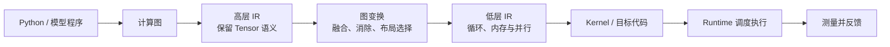
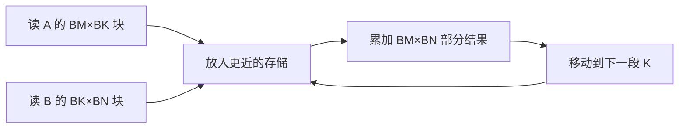
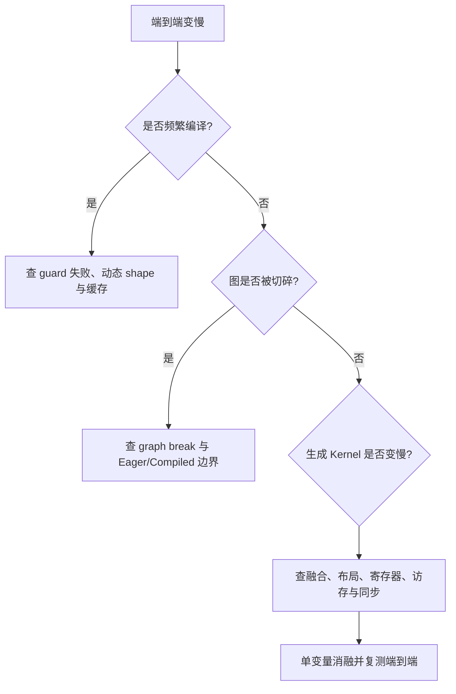

# AI 编译器与算子：从计算图到可执行 Kernel

写下 `y = softmax(x @ w)` 时，程序表达的是“要算什么”；GPU 最终需要的却是具体指令、线程分工、内存地址和同步关系。AI 编译器负责把前一种描述逐步变成后一种执行方案，算子开发则负责实现和优化其中的计算单元。

这条路径可以先看成七步：



**IR（Intermediate Representation，中间表示）**是编译器内部表示程序的数据结构。它既不是原始 Python，也不是最终机器码；它存在的原因是让不同优化阶段使用比源代码更明确、又比机器指令更容易分析的对象。

本章讲开发岗需要理解的共同机制。CUDA 线程与内存模型见[GPU 并行编程](gpu_parallel_programming.md)，Tensor、View 和 Autograd 见[PyTorch 运行时](pytorch_runtime.md)。

## 1. 为什么不能只调用现成算子库

成熟框架会优先调用经过优化的矩阵乘、卷积和归一化库。大多数业务开发也应该先复用这些实现，而不是手写 Kernel。但是只依赖固定算子边界会遇到四类问题：

1. 一串小算子反复读写显存，启动和搬运成本可能大于计算；
2. 新模型结构暂时没有现成实现；
3. 输入形状、数据类型或硬件与通用实现的最佳工作区间不同；
4. 框架还要同时支持自动微分、动态形状、量化和不同设备。

编译器可以观察一段更大的计算图，合并兼容步骤、选择布局并为具体形状生成代码。自定义算子则为框架补充一个带明确契约的新操作。二者不是互斥方案：自定义算子也可以进入编译图，其内部 Kernel 仍可由 DSL（Domain-Specific Language，领域专用语言）或编译器生成。

## 2. Eager 执行与图执行

**Eager（即时）执行**看到一个操作就立刻调度它，容易调试，也允许普通 Python 控制流随时参与。**图执行**先得到一组操作及依赖，再对整体变换和编译。

例如：

```text
a = x + bias
b = relu(a)
y = b * scale
```

Eager 模式可能依次启动三个 Kernel，并把中间结果 `a`、`b` 写入显存。图编译器若证明三步逐元素计算可以安全合并，就可能生成一个 Kernel：每个线程读取 `x`、`bias` 和 `scale`，在寄存器中完成三步，再只写一次 `y`。

融合并非永远更快。过大的融合 Kernel 可能使用太多寄存器、降低并发驻留能力，或让不同形状复用同一实现变得困难。因此编译器需要成本模型，最终仍要测量。

## 3. 捕获图时到底要记录什么

编译器不能只记录函数名，还要知道每个 Tensor 的契约：

| 信息 | 为什么需要 |
|---|---|
| shape | 判断矩阵维度是否合法，规划循环范围与并行切分 |
| dtype | 决定运算语义、精度、字节数和可用硬件指令 |
| device | 决定代码在哪类设备运行，数据是否需要搬运 |
| stride / layout | 把逻辑下标转换为真实地址，判断访问是否连续 |
| alias | 判断两个 Tensor 是否共享底层存储 |
| mutation | 判断操作会不会原地修改输入 |
| requires-grad 语义 | 训练时决定反向传播需要什么结果与公式 |

别名和修改尤其重要。若编译器把一个写操作错误地当成纯函数，它可能重排该操作，导致其他 View 看见错误值。因此框架注册自定义算子时，需要准确声明哪些输入会被修改、输出是否与输入共享存储，而不是只提供一段能运行的代码。

## 4. Guard、动态形状与重新编译

Python 程序中的形状、类型和控制流可能每次调用都不同。编译器常为一次捕获建立 **guard（守卫条件）**，例如：

```text
rank(x) == 2
x.dtype == bf16
x.shape[1] == 4096
x is contiguous
```

调用满足 guard 时复用已编译结果；不满足时可能重新编译、选择另一个缓存版本，或回退到 Eager。

静态特化可以针对固定形状生成更激进的代码，却可能因请求长度频繁变化造成“重编译风暴”。动态 Kernel 能接受更宽的形状范围，但可能失去一部分固定边界优化。工程上应先统计真实形状分布，再选择少量 bucket、动态范围或明确回退，而不是把 `dynamic=true` 当成免费能力。

## 5. IR 为什么常分很多层

模型图关心 `matmul`、`softmax` 和 Tensor 形状；GPU 代码关心 tile、线程、共享内存和地址。若直接从最上层跳到机器指令，中间优化很难复用。

多层 IR 可以逐步降低抽象：

```text
Tensor 运算：  C = matmul(A, B)
循环表示：     for m, n, k: C[m,n] += A[m,k] * B[k,n]
分块表示：     每次处理 BM×BN，K 维每次 BK
并行表示：     block 负责一个 tile，thread 负责部分元素
目标表示：     load / multiply-accumulate / store / barrier
```

**lowering（逐层降低）**不是简单翻译同一句话，而是在每一层补上新决定。高层决定哪些数学操作等价；中层决定循环、布局和融合；低层决定并行、内存与目标指令。

MLIR（Multi-Level Intermediate Representation，多层中间表示）使用 **dialect（方言）**组织不同层的操作、类型和属性。方言让一个编译基础设施同时保存高层 Tensor 语义和较低层 GPU/LLVM 语义，再通过 pass（遍历并变换 IR 的编译阶段）逐步转换。

## 6. SSA 与数据依赖

许多 IR 使用 **SSA（Static Single Assignment，静态单赋值）**形式：每个值只定义一次。下面是教学伪 IR：

```text
%0 = matmul %x, %w
%1 = add %0, %bias
%2 = relu %1
return %2
```

`%1` 明确依赖 `%0`，`%2` 明确依赖 `%1`。这让编译器容易建立 def-use（定义—使用）关系，并判断：

- 一个结果完全没人使用，可否删除；
- 两个表达式是否重复；
- 操作能否交换顺序；
- 哪些值必须跨 Kernel 或循环保存。

SSA 不会自动证明所有优化正确。内存修改、异常、随机数、通信和外部调用都可能形成隐藏副作用，必须进入操作契约和依赖分析。

## 7. 常见图优化分别解决什么

| 优化 | 做法 | 成立条件或代价 |
|---|---|---|
| constant folding | 编译期计算常量表达式 | 输入确实固定，语义与目标一致 |
| dead-code elimination | 删除结果不可观察的操作 | 不能删有副作用的操作 |
| common subexpression elimination | 复用相同计算 | 输入与副作用语义相同 |
| operator fusion | 合并兼容操作，减少中间读写与启动 | 资源压力、形状与数值顺序可能限制 |
| layout propagation | 让相邻操作采用兼容布局 | 转换成本与下游收益要一起算 |
| quantization lowering | 把高层量化语义变成缩放、整数或低精度操作 | scale、饱和和累加类型必须保持语义 |

浮点加法不满足实数意义上的严格结合律。把归约树从 `((a+b)+c)+d` 改成 `(a+b)+(c+d)` 可能改变末位舍入。优化器需要遵守所声明的数值语义；测试也应使用与业务相符的容差，而不是既要求任意重排，又要求每一 bit 完全相同。

## 8. 从 GEMM 理解 tiling

GEMM（General Matrix Multiplication，通用矩阵乘）计算：

```text
A[M,K] × B[K,N] = C[M,N]
```

朴素实现要为每个 `C[m,n]` 遍历 K。若每次都从较慢的全局内存重新读取 A、B，同一元素会被重复搬运。

**tiling（分块）**把 C 划成小块。例如一个程序块计算 `BM×BN` 的 C，并沿 K 以 `BK` 前进：



同一 A 子块可复用于多个 N 位置，同一 B 子块可复用于多个 M 位置。块太小会降低复用并增加调度开销；块太大可能超过共享内存或寄存器预算，反而减少能同时运行的块数。

因此 `BM/BN/BK` 是调度参数，不是数学答案。Triton、TileLang 等 GPU DSL 允许开发者用块级程序表达数据切片与计算，再由编译器生成低层代码；库或 autotuner（自动调优器）可以针对形状和硬件搜索候选配置。

## 9. Fusion、reduction 与 Softmax

Softmax 对一行输入 `x` 做三步：

```text
m = max(x)
e_i = exp(x_i - m)
s = sum(e)
y_i = e_i / s
```

减去最大值用于避免指数溢出。实现难点不在公式名字，而在两个 reduction（归约）：求最大值和求和需要多个线程合并部分结果，并在正确位置同步。

若拆成多个 Kernel，中间的 `m`、`e` 和 `s` 可能多次写回显存。融合实现可分块读取一行，在片上完成归约并写结果。但当一行很长、形状不规则或寄存器不足时，仍可能需要多阶段算法。正确性测试至少包含：极大/极小值、非整块长度、不同 dtype、非连续输入、空维边界与参考实现对比。

## 10. 算子、Kernel 和 Library 的区别

- **算子（operator）**定义框架可观察的语义，例如输入输出、shape、dtype、别名、修改与梯度规则；
- **Kernel**是某个设备、dtype、布局和形状下执行算子的具体实现；
- **Library**收集许多算子或 Kernel，并负责选择、调度和兼容性。

同一个 `matmul` 算子可以有 CPU、CUDA、不同精度和稀疏布局的多份 Kernel。框架的 dispatcher（分派器）根据设备、dtype 等条件选择实现。自定义 Kernel 若没有正确注册 schema、Fake/Meta 形状推导和 Autograd 公式，就可能“单次前向能跑”，却在编译、训练或变换中失败。

## 11. 什么时候选库、DSL 或底层 CUDA

| 选择 | 适合情况 | 主要成本 |
|---|---|---|
| 现成框架/厂商库 | 标准算子和常见形状 | 可定制空间较小 |
| 图编译器自动生成 | 有较大可捕获图，形状与语义可分析 | graph break、guard、编译时间与缓存 |
| Triton / TileLang 等 DSL | 需要自定义块调度，又不想手管全部底层细节 | 仍要懂布局、同步、数值与性能测量 |
| CUDA C++ / 专用模板库 | 需要最细控制或使用特定硬件能力 | 开发、验证、移植和维护成本最高 |

正确顺序通常是先找到经过验证的基线，再证明瓶颈确实在目标算子，最后选择最低复杂度且能达到目标的实现。职位描述中出现 CUDA、Triton、TileLang、MLIR，并不表示每个问题都应该从最低层重写。

## 12. Autotuning 在搜索什么

自动调优会为同一语义尝试不同 tile、warp 数、流水阶段或算法，并在目标设备和代表性形状上测量。一个基本流程是：

1. 生成满足资源约束的候选配置；
2. 对每个候选先做正确性检查；
3. 预热并同步测量多次；
4. 按形状、dtype、布局和设备保存选择；
5. 未命中时使用安全基线或重新调优。

只保存“最快配置名”不够，还要绑定编译器、驱动、硬件与 Kernel 版本。输入分布变化后，旧最优点可能不再最优。调优本身也会消耗时间，因此在线服务需要控制首次编译和搜索开销。

## 13. 怎样证明算子正确

高性能不能代替语义契约。测试应分四层：

1. **结构**：输出 shape、dtype、device、stride、别名和修改行为正确；
2. **数值**：与高精度或可信实现比较，容差说明 dtype 与归约规模；
3. **梯度**：训练算子用数值差分或框架 `gradcheck` 核对反向公式；
4. **组合**：在 Eager、编译、自动微分、不同设备和动态形状路径中运行。

随机输入之外还要构造边界：零长度、1、不能整除 tile 的质数尺寸、极值、NaN/Inf 政策、非连续 View、别名输入和不同对齐。对 PyTorch 自定义算子，可用 `torch.library.opcheck` 检查 schema、Autograd 注册、FakeTensor 和编译组合，再用 `gradcheck` 检查梯度的数学正确性；二者解决的问题不同。若算子声称确定性，还要在目标并行归约和原子路径下专门验证。

## 14. 怎样测量算子性能

GPU 调度通常是异步的：CPU 发起 Kernel 后可能立刻继续。若只在 CPU 侧包一层普通时钟，测到的可能只是提交时间。可靠测量至少要：

- 在计时边界使用正确的 GPU event 或同步；
- 先预热，排除首次 JIT、缓存和分配；
- 固定 shape、dtype、layout、device 和并发；
- 报告中位数与尾部分布，不只取最好一次；
- 同时检查正确性，防止“少算了所以更快”；
- 与可信库和理论带宽/算力上界比较；
- 用 profiler 检查时间花在计算、访存、同步还是启动。

GEMM 的乘加工作量常按 `2MNK` FLOP 估算。假设 `M=N=K=1024`，则约为：

```text
2 × 1024³ = 2,147,483,648 FLOP ≈ 2.15 GFLOP
```

若一次执行用 0.20 ms，教学上的有效吞吐为：

```text
2.147 GFLOP / 0.00020 s ≈ 10.74 TFLOP/s
```

这个数字只有在同步正确、计算完整且单位一致时才有意义。它也不等于设备峰值，因为输入形状、精度、数据搬运和 Kernel 实现都会影响可达到比例。

## 15. 编译问题怎样排查

一个“编译后反而变慢”的问题可按证据链拆开：



常见证据包括图、guard 日志、重编译计数、IR dump、生成代码、Kernel 时间线、寄存器/共享内存使用量和内存吞吐。先做 ablation（消融）：禁用某个 pass、某个融合或某个自定义 Kernel，判断回归是否随它消失，再缩成最小复现。

## 16. 做题方法：沿“语义—变换—执行—证据”推演

1. **写语义契约**：输入输出 shape、dtype、layout、别名、修改、梯度与特殊值；缺一项都可能让优化非法。
2. **画依赖图**：标出纯计算、归约、随机、通信和副作用；只有证明依赖允许，才能删除、融合或重排。
3. **逐层 lowering**：从 Tensor 操作写到循环、tile、并行单元和内存位置；每降低一层，说明新决定是什么。
4. **算两本账**：FLOP 账说明计算量，byte 账说明最少搬运量；再对照硬件算力/带宽上界。
5. **验证正确性**：先参考实现和边界输入，再测梯度、动态形状、别名和非连续布局。
6. **验证性能**：预热、同步、重复、报告分布和环境；性能提升必须回到端到端请求复验。

## 17. 章末问题

1. 为什么 AI 编译器需要 IR，而不直接把 Python 逐行翻成 GPU 指令？
2. 一个编译结果为什么需要 guard？guard 失败会发生什么？
3. Operator、Kernel 和 Library 有什么区别？
4. `x + bias → relu → scale` 为什么可能适合融合？融合为什么也可能变慢？
5. GEMM tiling 在复用什么？tile 是否越大越好？
6. 自定义算子为什么必须声明 alias 和 mutation？
7. 怎样测试一个训练用 Softmax 自定义算子？
8. 一个 `512×1024` 矩阵乘 `1024×2048` 矩阵，计算量约多少 FLOP？若用时 0.5 ms，有效吞吐约多少 TFLOP/s？
9. `torch.compile` 服务突然出现 CPU 尖峰和请求抖动，你怎样区分重编译、graph break 与慢 Kernel？

## 18. 参考答案与解答

<details>
<summary>展开答案</summary>

1. Python 包含动态对象、普通控制流和副作用，而 GPU 指令必须落实并行、地址和同步。IR 先把已捕获部分变成带 shape、dtype、依赖与副作用契约的结构，让多个 pass 能分析和变换；多层 IR 再分别承接图优化、循环/布局优化和目标代码生成。直接逐行翻译既看不到跨算子优化机会，也很难安全处理动态语义。
2. 已编译代码通常只对某些 shape、dtype、device、layout 或 Python 条件成立。guard 在复用前验证这些假设；失败时框架可能选择另一个缓存版本、重新编译，或回退 Eager。形状分布过散会不断触发失败和编译，所以需观察 guard 日志、编译次数与缓存命中，并通过 bucket、动态范围或明确回退控制版本数。
3. Operator 是框架可观察的语义合同；Kernel 是某一设备、类型、布局和形状下的具体执行实现；Library 管理许多算子/Kernel并进行选择。同一 operator 可以由多份 Kernel 实现，框架 dispatcher 按输入条件选择。
4. 三步都是逐元素操作，若合并后中间值留在寄存器，可减少 Kernel 启动和对显存中间结果的读写。但融合后 live value、寄存器或共享内存需求可能增加，降低并发驻留；复杂控制、不同最佳 tile 或重复计算也可能使它更慢。必须比较生成 Kernel 和端到端测量。
5. tiling 让读入的一块 A 在多个 N 输出上复用，让一块 B 在多个 M 输出上复用，并让部分 C 累加停留在更近的存储。tile 过小复用不足，过大则可能超过寄存器/共享内存预算并降低 occupancy；最佳值依 shape、dtype 和硬件而变。
6. View 可能共享同一 Storage，原地修改会影响别的名字。编译器只有知道别名与修改，才能判断是否能重排、删除或并行执行；错误合同可能让单次前向看似可用，却在图编译、functionalization 或自动微分中产生静默错误。
7. 先核对输出 shape/dtype/device、非连续输入和别名政策；用高精度稳定 Softmax 参考实现比较正常、极值、NaN/Inf、零长和不能整除 tile 的尺寸；训练路径使用数值差分或框架 gradcheck 核对梯度；再覆盖 Eager/compiled、前向/反向和多种 dtype。性能测试必须预热、GPU 同步并确保没有少算。
8. GEMM 计算量约为 `2MNK`：`2×512×1024×2048 = 2,147,483,648 FLOP ≈ 2.147 GFLOP`。`0.5 ms = 0.0005 s`，有效吞吐约 `2.147 GFLOP ÷ 0.0005 s = 4294 GFLOP/s ≈ 4.29 TFLOP/s`。结果没有说明是否接近峰值，还需给出 dtype、硬件、布局和计时方法。
9. 先把请求抖动与编译事件、graph break 计数、guard 失败和 Kernel 时间线关联。若 CPU 尖峰伴随新编译和 guard 失败，检查动态 shape 与缓存；若编译次数稳定但图被切成许多小段，检查 graph break 和 Eager/compiled 边界；若图稳定而 GPU 时间增加，再比较生成 Kernel、融合、布局、寄存器、带宽和同步。逐项禁用或固定形状做消融，最后复测端到端。

</details>

## 19. 本章小结

- AI 编译器把模型程序逐层变成图、IR、Kernel 与目标代码。
- IR 保存 shape、dtype、layout、依赖和副作用，使优化可分析、可验证。
- guard 在复用编译结果前验证假设；动态形状可能引发重新编译。
- fusion、tiling、layout 和 autotuning 都是在计算、搬运与资源之间做取舍。
- Operator 是语义，Kernel 是实现，Library 管理多份实现。
- 算子开发必须同时证明结构、数值、梯度、组合语义和性能。

## 一手资料

- [MLIR Language Reference](https://mlir.llvm.org/docs/LangRef/)：多层 IR、operation、region、block 与 value 的正式定义。
- [MLIR Dialects](https://mlir.llvm.org/docs/Dialects/)：方言及不同抽象层操作的官方文档。
- [PyTorch `torch.compile` Programming Model](https://docs.pytorch.org/docs/stable/user_guide/torch_compiler/compile/programming_model.html)：图捕获、graph break、guard、重编译与动态形状。
- [PyTorch `torch.library`](https://docs.pytorch.org/docs/stable/library.html)：自定义算子的 schema、alias、mutation、FakeTensor 与测试契约。
- [Triton Tutorials](https://triton-lang.org/main/getting-started/tutorials/)：从向量加法、Softmax 到矩阵乘和 Attention 的官方教程。
- [NVIDIA CUDA Programming Guide](https://docs.nvidia.com/cuda/cuda-programming-guide/)：Kernel、执行、内存和异步编程模型。
- [DeepSeek DeepGEMM](https://github.com/deepseek-ai/DeepGEMM)：JIT GEMM Kernel 与公开实现案例；仓库中的硬件性能数字只适用于其声明环境。
