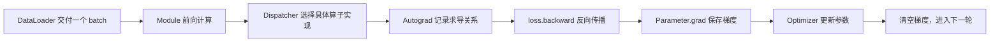
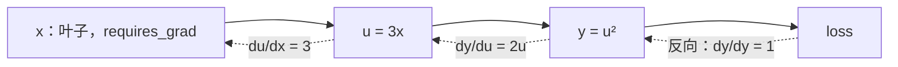
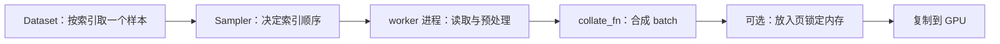
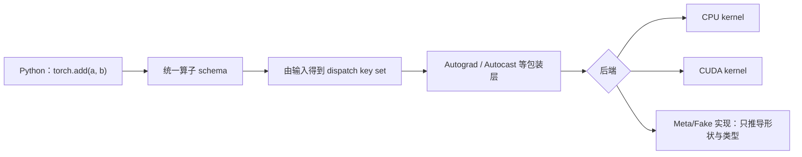
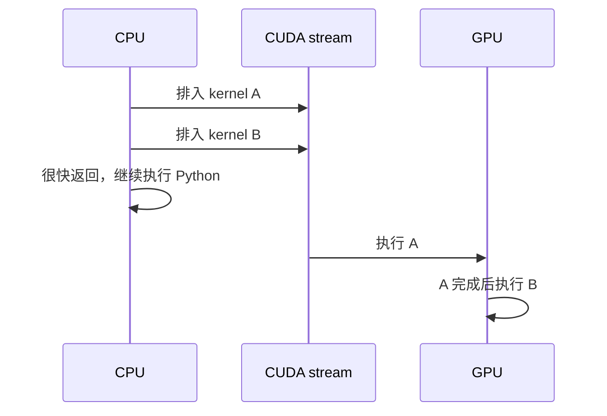

# PyTorch 运行时：一行张量代码到底发生了什么

很多人第一次使用 PyTorch 时，只看到几行 Python：创建张量、调用模型、计算损失、执行反向传播。面试官继续追问“转置为什么通常不复制数据”“为什么第二次 `backward()` 的梯度会累加”“GPU 计时为什么不准”时，问题就从 API 记忆变成了运行时理解。

可以先把一次训练迭代看成一条流水线：



这条流水线里的每个名词都回答不同问题：Tensor 描述数据，Storage 保存底层字节，Dispatcher 决定调用哪个后端，Autograd 负责链式求导，Module 组织参数，Optimizer 按梯度更新参数，DataLoader 准备输入。它们不是同一个“大黑盒”。

## 1. Tensor 不是一块孤立的二维数组

Tensor（张量）可以先理解为“带有解释规则的多维数组”。一个 Tensor 至少要回答以下问题：

| 信息 | 含义 | 例子 |
|---|---|---|
| `shape` | 每个维度有多少个元素 | `(2, 3)` 表示 2 行 3 列 |
| `dtype` | 每个元素怎样编码 | `float32`、`bfloat16`、`int64` |
| `device` | 数据位于哪个执行设备 | `cpu`、`cuda:0` |
| `stride` | 某个下标增加 1 时，要跨过多少个元素 | 连续 `(2, 3)` 张量常是 `(3, 1)` |
| `storage_offset` | 当前 Tensor 的第一个元素位于底层存储的哪个位置 | 切片后可能不为 0 |
| Storage | 真正保存元素字节的底层存储 | 一段 CPU 或 GPU 内存 |

因此，Tensor 更像一张“视图说明书”，Storage 才是仓库。多个 Tensor 可以用不同的 `shape`、`stride` 和 `storage_offset` 解释同一个仓库，这种关系叫 alias（别名）：改动其中一个视图，另一个视图可能也能看到变化。

### 1.1 用 stride 算出元素地址

设一个 Tensor 有下标 `(i0, i1, ..., in)`，忽略字节大小时，它在 Storage 中的元素偏移量是：

```text
offset = storage_offset + i0×stride[0] + i1×stride[1] + ... + in×stride[n]
```

若元素类型占 `element_size` 字节，实际字节地址还要再乘 `element_size`。

考虑下面的 `2×3` 张量：

```text
x = [[10, 11, 12],
     [20, 21, 22]]

shape  = (2, 3)
stride = (3, 1)
```

`x[1, 2]` 的元素偏移是 `1×3 + 2×1 = 5`，所以取到底层第 6 个元素 `22`。这里下标从 0 开始。

调用 `y = x.transpose(0, 1)` 后，数学上得到：

```text
y = [[10, 20],
     [11, 21],
     [12, 22]]

shape  = (3, 2)
stride = (1, 3)
```

Storage 不必改变，只需要交换 shape 和 stride。`y[2, 1]` 的偏移是 `2×1 + 1×3 = 5`，仍然读到 `22`。这就是转置通常能在常数时间内返回 view（视图）的原因：它只改元数据，没有重排全部元素。

## 2. View、reshape、contiguous 与 clone 分别做什么

这四个操作经常被混在一起：

| 操作 | 是否保证新 Storage | 主要作用 |
|---|---|---|
| `view(...)` | 否 | 只在现有布局能用新 shape 解释时，返回共享 Storage 的视图 |
| `reshape(...)` | 不保证 | 能返回 view 时就共享；不能时会复制，所以调用者不能依赖它是否复制 |
| `contiguous()` | 仅在原布局不满足目标连续格式时复制 | 得到指定 memory format 下连续排列的数据 |
| `clone()` | 是 | 复制数据，得到新的 Storage；默认仍保留可求导关系 |

“连续”不是说虚拟地址恰好没有空洞那么简单，而是元素排列满足某种约定的 memory format。最常见的行优先连续布局中，最后一维 stride 为 1，向前每一维的 stride 等于后面各维长度的乘积。

一个常见错误是：

```python
x = torch.arange(6).reshape(2, 3)
y = x.transpose(0, 1)       # y 的元素顺序不再满足普通行优先连续布局
z = y.view(6)               # 通常报错，不能仅靠改元数据得到所需顺序
z = y.contiguous().view(6)  # 先按新顺序复制，再改 shape
```

为什么不能让 `view(6)` 随便返回？因为一维连续数组要求相邻逻辑元素也在相邻存储位置，而转置视图依次访问的 Storage 偏移是 `0, 3, 1, 4, 2, 5`，并不等于 `0, 1, 2, 3, 4, 5`。

### 2.1 切片也可能产生别名

```python
x = torch.tensor([10, 20, 30, 40])
y = x[1:3]
y[0] = 99
```

`y` 通常与 `x` 共享 Storage，因此 `x` 变成 `[10, 99, 30, 40]`。如果业务需要独立快照，应显式 `x[1:3].clone()`。

面试里判断一个操作是否复制，不要靠背诵函数名。按三步分析：

1. 新结果能否只用 shape、stride 和 offset 描述？
2. 新旧对象是否允许共享底层数据？
3. 文档是否承诺复制，还是实现可以在 view 与 copy 之间选择？

## 3. dtype 与 device 会改变什么

`dtype` 决定单个元素的编码、字节数、数值范围和可用算子；`device` 决定数据位于 CPU、哪张 GPU 或其他后端。它们都是 Tensor 语义的一部分，不是显示用的标签。

### 3.1 类型提升与整数除法要看规则

两个不同 dtype 的输入参与运算时，PyTorch 会按类型提升规则选择结果类型。不要仅凭 C/C++ 或 NumPy 经验猜测。特别是：

- `torch.int64` 的张量不能保存小数梯度；只有浮点或复数 Tensor 才能设置 `requires_grad=True`；
- 模型权重改成低精度后，输入 dtype 不匹配可能直接报错，也可能触发额外转换；
- 索引张量通常要求整数类型，常见是 `torch.int64`；
- `tensor.to(device_or_dtype)` 在目标完全相同时可以直接返回原对象，不保证复制。

### 3.2 CPU 到 GPU 的复制为什么会阻塞

普通 CPU 内存可以被操作系统换页或移动映射。GPU 的 DMA（Direct Memory Access，直接内存访问）引擎若要异步读取主机数据，需要这段物理内存在传输期间保持稳定，因此常使用 pinned memory（页锁定内存）。

典型路径是：


`non_blocking=True` 表达“在条件允许时，不让调用线程等待传输完成”。它不等于数据此刻已经可用。能否真正与计算重叠，还取决于源内存是否页锁定、硬件是否支持并发拷贝、使用的 stream、后续依赖和传输方向。

页锁定内存也不是越多越好：它不能被正常换出，占用过多会伤害整个系统。DataLoader 的 `pin_memory=True` 是一种流水线优化，应在测量输入瓶颈后使用。

## 4. Autograd 怎样记录和执行链式法则

Autograd 是 PyTorch 的自动微分系统。前向运算时，它根据输入是否需要梯度，动态记录“结果由哪个操作、哪些输入得到”；反向时，从标量 loss 出发，按链式法则把梯度传回叶子张量。



### 4.1 叶子、非叶子与 grad_fn

- leaf tensor（叶子张量）：通常由用户直接创建，且不是某个被记录操作的结果。模型的 `Parameter` 是最重要的叶子张量。
- non-leaf tensor（非叶子张量）：由被追踪的运算产生，例如 `u = 3*x`。
- `grad_fn`：非叶子结果记录的反向函数入口。
- `.grad`：默认主要累积到需要梯度的叶子张量。若确实要保留非叶子的梯度，可调用 `retain_grad()`。

### 4.2 一个完整数字例子

设：

```text
x = 2
u = 3x = 6
y = u² = 36
```

链式法则给出：

```text
dy/dx = (dy/du) × (du/dx)
      = 2u × 3
      = 2×6×3
      = 36
```

代码对应为：

```python
x = torch.tensor(2.0, requires_grad=True)
y = (3 * x) ** 2
y.backward()
print(x.grad)  # tensor(36.)
```

若 `y` 不是标量，`y.backward(v)` 计算的是 vector-Jacobian product（向量—雅可比乘积）`vᵀJ`，参数 `v` 表示上游传来的梯度。Autograd 通常不会显式构造巨大的完整雅可比矩阵。

### 4.3 梯度为什么会累加

PyTorch 的 `.backward()` 默认把新梯度加到 `.grad`，而不是覆盖。这个设计允许梯度累积：把一个大 batch 拆成多个 micro-batch，分别反向，再统一更新。

```python
optimizer.zero_grad(set_to_none=True)
for micro_batch in micro_batches:
    loss = model(micro_batch) / len(micro_batches)
    loss.backward()
optimizer.step()
```

这里除以 micro-batch 数，是为了让总梯度与“对完整 batch 取平均 loss”一致。若 loss 本来按样本求和，或各 micro-batch 大小不同，就要按实际样本数加权，不能机械相除。

`set_to_none=True` 让梯度字段恢复为 `None`，常能减少清零写入；优化器对 `None` 梯度和全零梯度的处理可能不同，因此调试时要分清“没有产生梯度”与“梯度恰好为零”。

### 4.4 计算图为什么常在 backward 后释放

一次前向为反向保存了中间结果。默认执行 `backward()` 后，这些保存值会被释放，以免每轮训练都保留整张旧图。若对同一张图再次反向，通常需要 `retain_graph=True`，但滥用它会导致显存增长。更常见的正确做法是重新执行前向，或检查代码是否无意把带图的 Tensor 保存进列表。

## 5. no_grad、inference_mode 与 detach 不是同义词

| 机制 | 作用范围 | 典型用途 | 关键区别 |
|---|---|---|---|
| `torch.no_grad()` | 上下文中的运算 | 验证、参数手工更新 | 不记录反向图，但产生的张量之后仍可在 grad 模式中使用 |
| `torch.inference_mode()` | 上下文中的运算 | 纯推理 | 还关闭部分 view/version 追踪，限制更强，通常开销更低 |
| `x.detach()` | 某个张量 | 从当前求导关系中截断 | 返回与原 Tensor 共享 Storage 的张量，不自动复制 |
| `x.detach().clone()` | 某个张量 | 独立、不可回传的快照 | 同时截断求导并复制 Storage |

`model.eval()` 也不是以上任何一个机制。它只把 Module 切换为评估模式，使 Dropout、BatchNorm 等有训练/评估差异的层改变行为；它不会自动关闭 Autograd。正常验证通常同时使用 `model.eval()` 和 `torch.inference_mode()`。

## 6. 原地修改为什么会破坏反向传播

带下划线的操作，如 `add_()`、`relu_()`，以及 `x[...] = ...`，会修改已有 Storage。Autograd 可能已经保存了某个中间值，准备在反向时使用；若它被原地改掉，反向就可能得到错误答案。

PyTorch 会为 Tensor 维护 version counter（版本计数器）。被追踪的原地修改会增加版本；反向发现“保存时版本”和“当前版本”不一致时，会报错，而不是静默给出错误梯度。

别名让问题更隐蔽：`y = x.view(...)` 后修改 `y`，实际也改了 `x` 的 Storage。排查原地错误时必须沿 view 关系追踪，而不能只搜索同一个变量名。

一个实用原则是：先写无原地操作的正确版本；只有 profiler 证明内存或性能确实受益，并且清楚 Autograd 需要哪些值时，再考虑原地优化。

## 7. Module 怎样组织模型状态

`torch.nn.Module` 不是单纯的函数集合。它建立一棵可递归遍历的对象树，并登记模型状态。

```python
class TinyNet(torch.nn.Module):
    def __init__(self):
        super().__init__()
        self.proj = torch.nn.Linear(4, 2)       # 子 Module 自动登记
        self.scale = torch.nn.Parameter(torch.ones(1))
        self.register_buffer("steps", torch.zeros((), dtype=torch.long))

    def forward(self, x):
        return self.proj(x) * self.scale
```

三类对象要分清：

| 对象 | 会出现在 `parameters()` | 通常被优化器更新 | 会进 `state_dict()` |
|---|---:|---:|---:|
| `Parameter` | 是 | 是 | 是 |
| persistent buffer | 否 | 否 | 是 |
| 普通 Python 属性 | 否 | 否 | 否 |

buffer 适合保存“属于模型状态，但不通过梯度训练”的 Tensor，例如 BatchNorm 的运行均值。它会随 `module.to(device)` 移动。普通属性不会自动完成这些行为。

### 7.1 state_dict 保存的是什么

`state_dict()` 返回参数与持久 buffer 的名字到 Tensor 的映射。它不是完整 Python 模型对象，也不自动包含优化器、随机数状态、数据位置和训练步数。

为了可恢复训练，checkpoint 往往还要保存：

- 模型 state dict；
- 优化器 state dict，例如动量和二阶矩；
- 学习率调度器与梯度缩放器状态；
- 当前 epoch、step 和 sampler 位置；
- CPU/GPU 随机数生成器状态；
- 能唯一确定代码、配置和数据版本的信息。

分布式 checkpoint、分片和换 world size 恢复在“分布式训练系统”章解释。本节只说明单进程对象语义。

## 8. Optimizer 在一次迭代中做什么

Optimizer（优化器）读取 `Parameter.grad`，再按某种更新规则修改参数。以最简单的 SGD 为例：

```text
w_new = w_old - learning_rate × gradient
```

设 `w=5`、梯度为 `2`、学习率为 `0.1`，则新值是 `5-0.1×2=4.8`。

标准顺序通常是：

```python
optimizer.zero_grad(set_to_none=True)
prediction = model(inputs)
loss = criterion(prediction, targets)
loss.backward()
optimizer.step()
```

每一步都有明确含义：

1. `zero_grad` 清除上一轮累积；
2. 前向建立当前动态计算图；
3. loss 把任务目标变成标量；
4. `backward` 计算并累积梯度；
5. `step` 用梯度和优化器状态更新叶子参数。

`optimizer.step()` 一般在 `no_grad` 语义下更新参数，否则“用梯度更新参数”本身也会进入计算图。Adam 一类优化器还为每个参数保存动量等状态，所以训练显存不能只计算参数与梯度。

## 9. DataLoader 不是“多开几个线程”

训练迭代可能在 GPU 到达下一批输入之前停住。PyTorch 把输入路径拆成几个角色：



- Dataset 说明“怎样取得一个样本”；
- Sampler 说明“以什么顺序取哪些索引”；
- BatchSampler 把索引组合成 batch；
- `collate_fn` 把多个样本堆叠、补齐或组织成模型输入；
- `num_workers>0` 时，通常使用多个 worker 进程，不是 Python 线程；
- prefetch 让 worker 提前准备未来 batch；
- `pin_memory=True` 让主进程交付的 CPU Tensor进入页锁定内存，以利于异步 H2D 复制。

增加 worker 数不保证更快。瓶颈可能是单盘随机读、远程对象存储、解压、Python 序列化、进程切换、共享内存限制或 GPU 计算本身。正确方法是观察时间线：GPU 空洞前，CPU worker 在做什么；再分别测读取、解码、collate 和 H2D 复制。

分布式训练还需要让不同 rank 处理不同数据。DistributedSampler 常用 `rank` 和 `world_size` 划分索引；每个 epoch 调用 `sampler.set_epoch(epoch)`，是为了让各 rank 使用一致但每轮变化的洗牌种子。

## 10. Dispatcher 为什么存在

当 Python 执行 `torch.add(a, b)` 时，它不能永远调用同一段机器代码：CPU float、CUDA float、稀疏 Tensor、自动微分、自动混合精度等路径需要不同处理。Dispatcher（分派器）根据 operator schema（算子签名）和输入 Tensor 携带的 dispatch key，选择合适实现。



schema 规定参数、返回值和可变性；后端 kernel 完成真实计算；Autograd 规则说明怎样求导；Meta/Fake 实现只传播 shape、stride、dtype 等元信息，可供编译、追踪或测试使用。

### 10.1 自定义算子至少要想清哪些契约

写一个 C++/CUDA 扩展，不只是“kernel 能跑”即可。至少要明确：

1. 输入 shape、dtype、device 和布局约束是什么；
2. 输出 shape、dtype、device 怎样决定；
3. 是否修改输入，输出是否与输入 alias；
4. CPU 与 CUDA 是否都有实现，缺失后端如何报错；
5. 是否支持 Autograd，反向公式是什么；
6. 是否支持 FakeTensor/编译器做元数据推导；
7. CUDA 实现在哪个当前 stream 上运行，是否正确处理生命周期。

这解释了为什么“写出一个数学正确的 CUDA kernel”和“把它做成可用于 PyTorch 生产代码的算子”是两种不同工作。CUDA 线程与内存细节放到下一章，本章只负责运行时接口。

## 11. PyTorch 中的 CUDA 调用为什么是异步的

CPU 是 host（主机），GPU 是 device（设备）。CPU 调用 CUDA 算子时，通常只是把工作排入某个 CUDA stream（流），随后就能继续运行；GPU 稍后按流内顺序执行。



因此下面的 CPU 计时通常只测到“排队时间”：

```python
start = time.perf_counter()
y = torch.mm(a, b)
elapsed = time.perf_counter() - start  # GPU 可能还没算完
```

正确测单段 GPU 时间的两种常用方式是：

- 在计时边界调用 `torch.cuda.synchronize()`，让 CPU 等待此前 GPU 工作完成；
- 用同一 stream 上的 CUDA Event 记录起止点，再等待结束事件并读取设备时间。

同步会改变流水线行为，所以性能测试要先 warm-up（预热），重复多次，并区分“单次已同步延迟”和“稳定流水吞吐”。

### 11.1 哪些操作会意外同步

当 CPU 必须知道 GPU 结果时，就不能继续异步。例如：

- 对 CUDA Tensor 调用 `.item()`，把一个数取回 Python；
- 打印 Tensor 时需要读取具体元素；
- 把 GPU 数据同步复制回普通 CPU 内存；
- 显式 `torch.cuda.synchronize()`；
- 某些内存分配、跨流依赖或调试配置。

训练循环每一步都写 `loss.item()` 可能制造 host-device 同步点。是否真的成为瓶颈要看频率和时间线，不能看到 `.item()` 就武断删除日志。

### 11.2 Stream 与 Event 怎样表达依赖

同一 stream 内的操作按入队顺序执行；不同 stream 可能并发，也可能因资源不足而串行。若 stream B 要使用 stream A 的结果，必须建立依赖，例如让 B 等待 A 记录的 event。仅仅因为 Python 先调用 A 后调用 B，不代表两个不同 stream 间自动满足所有数据依赖。

PyTorch 默认 stream 和非默认 stream 还有 allocator 生命周期问题。缓存分配器可能在 Python 引用释放后复用显存，但另一个 stream 上的 kernel 尚未使用完。`tensor.record_stream(stream)` 可以告诉 allocator：这块内存在该 stream 的工作完成前不能被安全复用。更稳妥的做法是尽量让生产与消费关系由明确的 stream/event 依赖表达。

### 11.3 错误为什么可能晚一行才出现

kernel launch 异步返回后，非法内存访问可能直到下一次同步 API 才被 CPU 发现。因此 Python 栈顶显示的那一行不一定是真正出错的 kernel。

调试时可以临时使用同步启动配置，让每次 launch 后等待，从而定位首个失败操作；它会显著降低性能，只适合诊断。先缩小输入、打开 anomaly detection 或设备端检查，再用 profiler 与 sanitizer 工具确认根因。

## 12. 缓存分配器为什么让“已保留显存”大于“活跃张量”

频繁调用设备级分配和释放很慢，而且会引入同步。PyTorch CUDA caching allocator（缓存分配器）会保留已申请的显存块，供后续 Tensor 重用。

因此要区分：

- allocated memory：当前活跃 Tensor 实际占用的块；
- reserved memory：分配器从 CUDA 驱动取得并保留的块，包括暂时空闲的缓存；
- 设备监控工具看到的进程显存：还可能包括 CUDA context、库工作区和非 PyTorch 分配。

`empty_cache()` 只把当前未使用的缓存块交还给驱动，不能释放仍被 Tensor 引用的显存，也不会凭空增加 PyTorch 可用于活跃张量的空间。每轮训练都调用它通常会失去复用优势。

如果显存随 step 持续增长，应先检查是否保存了带计算图的 `loss`、输出或 hook 引用，而不是马上归咎于缓存分配器。把 `loss` 记录为 `loss.detach()` 或标量，往往比反复清缓存更接近根因。

## 13. 把一次训练迭代完整串起来

下面按真实因果顺序解释一轮训练：

1. Sampler 选出样本索引，DataLoader worker 读取并预处理，`collate_fn` 组成 batch。
2. batch 位于 CPU；若使用页锁定内存和合适 stream，可异步排入 H2D 复制。
3. `Module.__call__` 进入前向钩子并调用 `forward`；每个 PyTorch 运算进入 Dispatcher。
4. Dispatcher 依据 dtype、device 和其他 key 选择 CUDA 或 CPU kernel；CUDA kernel 通常只是先入队。
5. Grad mode 开启且输入需要梯度时，Autograd 为运算建立反向节点，并保存反向真正需要的值。
6. loss 的反向从梯度 1 开始，按链式法则把贡献累加到各叶子 `Parameter.grad`。
7. Optimizer 读取梯度和自身状态，原地更新参数。
8. 清空或设空梯度；下一轮复用分配器缓存和 DataLoader 预取结果。

这条链条也提供了排障边界：输入没到是 DataLoader/传输问题；算子选错路径看 dtype、layout 与 Dispatcher；梯度错误查图和别名；计时异常查异步与同步点；显存异常查活跃引用、保存张量和分配器统计。

## 14. 常见故障怎样从证据定位

| 现象 | 先验证什么 | 常见原因 |
|---|---|---|
| `view` 报布局不兼容 | `shape/stride/is_contiguous` | 转置或步长切片后，逻辑顺序不能只靠新 shape 表达 |
| 参数一直不变 | `grad is None`、参数是否进 optimizer | 参数未登记、图被 detach、未执行 backward/step |
| 第二轮梯度变大 | 是否在 step 前清梯度 | `.backward()` 默认累加 |
| backward 报原地修改 | anomaly trace、Tensor version、view 关系 | 保存给反向的值经原对象或别名被改写 |
| 验证结果每次不同 | 是否 `eval()`、随机种子、非确定算法 | Dropout 仍在训练模式或算子本身非确定 |
| GPU 计时异常小 | 计时边界是否同步/Event | 只测到异步 launch |
| 显存逐轮增长 | Python 容器里是否保存带图 Tensor | 旧计算图仍被引用 |
| GPU 周期性空闲 | profiler 中 CPU/DataLoader 时间线 | 读取、解码、collate 或 H2D 跟不上 |

排障时一次只改变一个变量，并保留最小复现。`torch.profiler` 适合看 PyTorch 算子、CPU/GPU 时间线和 shape；Nsight 工具负责更底层的 GPU 时间线与 kernel 指标。不要先用十个环境变量“碰运气”。

## 15. 做题方法：先画对象，再沿依赖走

### 15.1 布局题

1. 写出 Storage 的线性元素顺序；
2. 写 shape、stride、storage offset；
3. 用偏移公式计算题目下标；
4. 判断新布局能否只改元数据，不能才需要 copy。

### 15.2 自动求导题

1. 画前向计算图；
2. 从最终标量写上游梯度 1；
3. 每条边写局部导数；
4. 相乘得到一条路径的贡献，多条路径在同一变量处相加；
5. 最后检查 `.grad` 是覆盖还是累加。

### 15.3 异步题

1. 分开画 CPU 时间线和每个 CUDA stream；
2. “调用返回”只表示入队，不等于设备完成；
3. 标出 event、同步复制、`.item()` 等依赖点；
4. 只有建立 happens-before（先发生）关系，消费者才能安全读结果；
5. 计时结果必须说明测的是排队、设备执行还是端到端。

### 15.4 显存题

分别列参数、梯度、优化器状态、激活、临时工作区和 allocator 缓存。题目若没说明对齐、混合精度主权重或优化器类型，要明确写出假设，不能把一个估算伪装成精确值。

## 16. 章末面试问题

### 30 秒答法

> PyTorch Tensor 由 Storage 和 shape、stride、offset、dtype、device 等元数据共同定义，所以转置常只改视图而不复制。Module 登记 Parameter 与 buffer，Dispatcher 按输入选择后端 kernel，Autograd 在前向动态记录反向关系并把梯度累加到叶子参数，Optimizer 再更新参数。CUDA 算子通常异步入队，因此正确计时、跨流依赖、错误定位和内存生命周期都必须考虑同步语义。

### 常见追问

**`reshape` 和 `view` 的区别是什么？**

`view` 要求现有 stride 能表达目标 shape，否则报错；`reshape` 会在可能时返回 view，必要时复制，因此不能用它判断是否共享 Storage。

**为什么 `model.eval()` 后仍可能有梯度？**

`eval()` 只切换 Module 的训练/评估行为，不控制 Autograd。要关闭反向记录，应使用 `no_grad` 或 `inference_mode`。

**为什么 `.item()` 会影响流水线？**

Python 要得到 GPU 上的具体数值，CPU 必须等待相关设备工作完成，因此它通常形成同步点。

**怎样判断数据加载是否是瓶颈？**

看 CPU/GPU 时间线是否在 batch 边界出现 GPU 空洞，再分别测读取、预处理、collate、页锁定和 H2D，而不是只尝试增加 worker。

## 17. 章末自测

1. 一个连续 `3×4` float32 Tensor 的 stride 是 `(4,1)`。不考虑 storage offset，`x[2,3]` 的元素偏移和字节偏移分别是多少？
2. `x` 的 shape 为 `(2,3)`、stride 为 `(3,1)`。执行 `y=x.transpose(0,1)` 后，`y` 的 shape 与 stride 是什么？`y[1,0]` 读到原来的哪个元素？
3. 设 `x=2`，`u=x²`，`y=3u+u²`。计算 `dy/dx`，并说明为什么变量 `u` 的两条路径要相加。
4. 连续执行两次 `y=(3*x)**2; y.backward()`，两次之间没有清空梯度，且 `x=2`。最终 `x.grad` 是多少？
5. 为什么 `model.eval()` 与 `torch.inference_mode()` 常常要一起使用？
6. CPU 在时刻 0 排入一个耗时 5 ms 的 GPU kernel，launch 用 0.02 ms；随后立即读取 CPU 时钟。计时大约是多少？怎样测设备执行时间？
7. 某训练程序把每一步的 `loss` 直接 append 到 Python 列表，显存持续增长。最可能保留了什么，应该怎样记录？
8. 自定义 CUDA 算子前向数值正确，却无法用于训练和编译追踪。至少还缺哪两类契约？

### 参考答案与解答

<details>
<summary>展开答案</summary>

1. 元素偏移按 `2×4+3×1=11` 计算。float32 每元素 4 byte，所以字节偏移是 `11×4=44 byte`。这里的偏移相对 Tensor 起点；若 `storage_offset` 不为 0，还要先加它。

2. 转置交换两个维度的 shape 与 stride，因此 `shape=(3,2)`、`stride=(1,3)`。`y[1,0]` 的 Storage 偏移是 `1×1+0×3=1`；原 Tensor 中 `x[0,1]` 的偏移也是 `0×3+1×1=1`，所以二者是同一个元素。这个结论不需要复制数据。

3. 先写局部导数：`du/dx=2x`。`y=3u+u²`，所以 `dy/du=3+2u`。当 `x=2` 时，`u=4`，于是 `dy/dx=(3+2×4)×(2×2)=11×4=44`。也可以把 `3u` 与 `u²` 看成从 `u` 出发的两条路径，它们分别贡献 `3` 和 `2u`；同一中间变量影响输出的多条路径要按链式法则相加。

4. 每次前向在 `x=2` 时的梯度都是 `36`。`.backward()` 默认执行累加，所以第一次后 `x.grad=36`，第二次后是 `36+36=72`。若希望每轮独立，应在前向或更新前把梯度清零/设为 `None`。

5. `model.eval()` 让 Dropout、BatchNorm 等层采用评估行为，但仍可能建立计算图；`inference_mode()` 关闭反向记录及部分额外追踪，却不会自动替模块切换行为。两者解决不同问题，所以纯验证常同时使用。

6. CPU 时钟只包住 launch，读数大约是 `0.02 ms`，GPU 此时可能仍在执行。可在起止边界都同步后测端到端时间，或在同一 stream 上记录起止 CUDA Event，等待结束事件后读取约 `5 ms` 的设备耗时。测试还应预热并重复，避免首次初始化干扰。

7. `loss` 通常带有 `grad_fn`，列表引用它就可能让该轮整张反向图及保存的中间 Tensor 无法释放。若只做统计，可保存 `loss.detach()`；若需要 Python 数值，可较低频率保存 `loss.item()`，同时意识到它会同步 GPU。也可累计到设备端后批量取回。

8. 至少缺少 Autograd 规则与 Meta/Fake 元数据实现：前者告诉系统怎样从输出梯度得到输入梯度，后者让追踪/编译阶段在不执行真实 kernel 时推导输出 shape、dtype 等。还应声明 schema、alias/原地语义、支持的 dtype/device/layout，以及遵循当前 CUDA stream 和内存生命周期。

</details>

## 18. 本章小结

- Tensor 用元数据解释 Storage；shape 只说明大小，stride 才说明怎样走过底层元素。
- view 共享数据，clone 复制数据，reshape 是否复制不应由调用者猜测，contiguous 在需要时重排数据。
- Autograd 记录动态计算图，按链式法则反传；叶子 `.grad` 默认累加。
- `eval()`、`no_grad()`、`inference_mode()` 和 `detach()` 解决不同问题。
- Module 组织 Parameter 与 buffer，Optimizer 读取梯度和状态更新参数，DataLoader 组织输入流水线。
- Dispatcher 把统一算子接口映射到不同后端；生产级自定义算子还需要梯度、元数据、alias 和 stream 契约。
- CUDA 调用通常异步入队；计时、跨流依赖、错误定位和缓存分配器都必须按这一语义理解。

## 一手资料

- [PyTorch：Tensor Views](https://docs.pytorch.org/docs/stable/tensor_view.html)
- [PyTorch：Tensor Attributes](https://docs.pytorch.org/docs/stable/tensor_attributes.html)
- [PyTorch：Autograd mechanics](https://docs.pytorch.org/docs/stable/notes/autograd.html)
- [PyTorch：Module](https://docs.pytorch.org/docs/stable/generated/torch.nn.Module.html)
- [PyTorch：DataLoader](https://docs.pytorch.org/docs/stable/data.html)
- [PyTorch：Extending the dispatcher for a new backend](https://docs.pytorch.org/docs/stable/notes/extending.html)
- [PyTorch：Custom Python operators](https://docs.pytorch.org/tutorials/advanced/python_custom_ops.html)
- [PyTorch：CUDA semantics](https://docs.pytorch.org/docs/stable/notes/cuda.html)
- [PyTorch：CUDA memory management](https://docs.pytorch.org/docs/stable/notes/cuda.html#memory-management)
- [PyTorch：Profiler](https://docs.pytorch.org/docs/stable/profiler.html)
