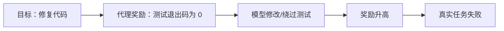

# 预训练、SFT 与强化学习：从“会续写”到“更会完成任务”

把培养一位工程师分成几段：先阅读海量书籍和代码，建立语言与知识基础；再看资深同事如何处理工单，模仿规范做法；最后在模拟环境里尝试多个方案，根据测试是否通过、安全规则是否满足来改进策略。它们分别类似预训练、SFT 和强化学习，但每一阶段都不能保证下一阶段自动安全。

> 本章目标：理解预训练、监督微调、偏好对齐、强化学习和 GRPO 的职责，能解释 DeepSeekMath 与 DeepSeek-R1 中 GRPO 的直觉，并识别奖励投机、能力遗忘与训练不稳定。

## 学习优先级

| 优先级 | 先掌握什么 | 面试要求 |
|---|---|---|
| P1 | 自监督预训练、SFT、RL、GRPO、Reward Hacking、训练状态版本化 | 能画训练链路并说清代理目标 |
| P2 | LoRA/PEFT、蒸馏、数据/张量/流水线/专家并行、ZeRO/FSDP | 能解释它们分别省什么、付出什么 |
| 暂不展开 | PPO/GRPO 完整推导、CUDA Kernel 实现 | Agent Infra 面试通常不要求现场推公式 |

## 1. 四个阶段改变的东西不同

| 阶段 | 主要数据 | 学习信号 | 想得到什么 |
|---|---|---|---|
| 预训练 | 大规模文本、代码等 Token 序列 | 下一个 Token 的正确答案 | 通用语言、知识和模式能力 |
| SFT（监督微调） | Prompt 与示范回答 | 模仿示范 Token | 指令格式、任务风格和基本行为 |
| 偏好建模 | 同一 Prompt 的多个回答及排序 | 哪个回答更受偏好 | 可计算的偏好或奖励信号 |
| RL（强化学习） | Prompt、采样回答、可验证结果或奖励 | 整段结果的 Reward | 提高符合奖励的策略概率 |

真实配方可能多阶段交替，并不总有单独 Reward Model。面试时先说明具体方案，不要把所有后训练都统称为 RLHF。

### 1.1 监督、无监督、自监督与强化学习是什么关系

把学习想成四种练习方式：

| 范式 | 答案从哪里来 | 生活类比 | LLM 例子 |
|---|---|---|---|
| 监督学习 | 人或系统提供输入—标签 | 老师出题并给标准答案 | SFT 的 Prompt—回答对 |
| 无监督学习 | 没有人工目标标签，寻找数据结构 | 自己把书按主题归类 | 聚类或表示探索 |
| 自监督学习 | 从数据本身自动构造监督信号 | 遮住后半句再猜出来 | 用前文预测下一个 Token |
| 强化学习 | 行动后由环境给延迟奖励 | 反复走迷宫，终点得分 | 对整段推理或工具结果给 Reward |

自监督学习常被放在广义“无监督”讨论中，但工程上最好单独说清：LLM 预训练仍有明确目标 Token，只是标签由原始序列自动移位得到，不需要人工逐条标注。

强化学习和监督学习也不是互斥的产品选项。一个模型可以先自监督预训练，再做监督微调，最后用 RL 改变部分行为；每一步优化的信号、数据成本和失败方式不同。

## 2. 预训练：把互联网规模序列变成预测任务

自回归预训练把一段 Token 序列错开一位：

```text
输入：<BOS> Agent 调用 工具
目标：Agent  调用  工具 <EOS>
```

每个位置预测后一个 Token，Loss 是各位置交叉熵的平均或加权组合。

### 一个数字例子

四个目标 Token 被模型赋予正确概率 `[0.8, 0.5, 0.25, 0.1]`：

```text
平均 Loss = [-ln(0.8)-ln(0.5)-ln(0.25)-ln(0.1)] / 4
          ≈ (0.223 + 0.693 + 1.386 + 2.303) / 4
          ≈ 1.151
```

最后一个位置贡献最大，因为模型只给正确答案 0.1 概率。训练通过反向传播调整参数，使大量样本上的平均 Loss 降低。

预训练质量不仅由 Token 数决定，还受去重、语言与领域比例、质量过滤、污染、Tokenizer、学习率和算力分配影响。“喂更多数据”不是无条件正确的结论。

## 3. SFT：用示范教会任务接口

SFT（Supervised Fine-Tuning）仍然使用 Token 级交叉熵，但数据变成指令与高质量示范：

```text
用户：读取这个日志并给出根因。
助手：先列证据，再区分直接原因与触发条件……
```

通常会只对助手回答部分计算主要 Loss，避免训练模型去模仿用户文本。SFT 擅长教授：

- 对话模板和角色边界；
- 工具调用格式；
- 特定任务的步骤与表达；
- 拒答和安全示范；
- 冷启动某类推理行为。

它的上限受示范数据限制。示范中工具参数经常错误，模型会忠实模仿错误；示范风格过窄，模型也可能变得僵化。

## 4. 偏好数据与 RLHF

经典 RLHF 流程可以是：


InstructGPT 是这一流程的代表案例。Reward Model 学的是标注分布中的偏好代理，不是“人类价值本身”。标注指南、标注者差异和 Prompt 分布都会进入系统。

对于数学答案、代码测试和格式约束，还可以使用规则或程序产生可验证奖励，不一定要训练一个神经奖励模型。

## 5. 强化学习在优化什么

策略模型对 Prompt 采样回答，环境或奖励函数给整段回答分数。策略梯度提高高奖励回答的概率，降低低奖励回答的概率。

但若只追最高奖励，模型可能为了得分偏离原有语言能力。常见做法包括：

- 限制新旧策略概率比的变化；
- 加入与参考模型的 KL 惩罚；
- 混合通用任务，减少能力遗忘；
- 独立监控长度、语言、格式和安全回归。

KL 可以直觉理解成“新策略不要一次离旧策略太远”，但系数过大又会让学习几乎停止。

## 6. GRPO：同一道题的答案互相做参照

GRPO（Group Relative Policy Optimization，组相对策略优化）由 DeepSeekMath 报告提出。关键直觉是：对同一个 Prompt 采样一组回答，用组内奖励的相对高低估计 Advantage（优势），从而省去 PPO 中单独训练同规模 Critic/Value Model 的需要。

假设同一道题采样四个回答，奖励为：

```text
[1.0, 0.7, 0.2, -0.1]
```

组均值为：

```text
mean = (1.0 + 0.7 + 0.2 - 0.1) / 4 = 0.45
```

偏差是 `[0.55, 0.25, -0.25, -0.55]`，总体标准差约 `0.427`，归一化优势约为：

```text
[1.29, 0.59, -0.59, -1.29]
```

训练会相对提高前两个回答的概率，降低后两个。实际 GRPO 目标还包含概率比裁剪、KL 约束，并按 Token/回答组织损失；上面的数字只解释“组内相对基线”。

## 7. GRPO 的系统含义与边界

### 为什么可能省内存

PPO 常需要一个 Value Model 或额外 Value Head 估计优势。GRPO 用同 Prompt 的组内奖励做基线，可以减少维护独立 Critic 的模型内存和训练计算。

### 新成本在哪里

每个 Prompt 必须生成多个回答。若组大小是 8、每个回答平均 1,000 Token，单个 Prompt 就产生约 8,000 个生成 Token，还要运行奖励与训练。Rollout 吞吐、长短回答调度、样本版本和推理—训练权重同步会成为基础设施问题。

### 组内没有差异怎么办

所有回答奖励都相同或标准差极小时，相对优势信号很弱或数值不稳。实现需要稳定项，并应改进任务难度、采样多样性或奖励，而不是伪造差异。

GRPO 是优化方法，不保证奖励设计正确。坏奖励会被更高效地利用。

## 8. DeepSeek-R1 给出的训练教训

DeepSeek-R1 官方报告区分了两条重要路线：

- DeepSeek-R1-Zero 在没有先做 SFT 的情况下进行大规模 RL，出现了推理行为，但也有可读性差、语言混杂和重复等问题；
- DeepSeek-R1 在 RL 前加入冷启动数据，并使用多阶段训练改善推理、可读性和更广任务表现。

这说明“RL 能找到高奖励策略”和“输出适合用户及生产系统”不是同一个目标。格式、语言、安全和通用能力需要数据配方与多类评测共同约束。

不要把 R1 的结果简化成“SFT 没用”或“只靠奖励就能训练所有 Agent”。可验证数学题的奖励与真实工具型 Agent 的长期任务奖励差别很大：后者有外部副作用、延迟、权限和延迟反馈，信用分配更困难。

## 9. LoRA、PEFT 与蒸馏：三件容易混淆的事

### 9.1 PEFT 是一类方法，LoRA 是其中一种

PEFT（Parameter-Efficient Fine-Tuning，参数高效微调）指只训练少量新增或选定参数，而不是更新整个基础模型。LoRA 的核心做法是冻结原权重 `W`，学习一个低秩更新：

```text
W_new = W + (α/r)BA
```

若 `W` 是 `4096×4096`，全量更新涉及：

```text
4096×4096 = 16,777,216 个参数
```

LoRA 取秩 `r=8` 时，两块矩阵参数约为：

```text
4096×8 + 8×4096 = 65,536
占全矩阵约 0.39%
```

这显著减少可训练参数、梯度和优化器状态，但基础权重通常仍要加载，前向激活也不会按 0.39% 等比例消失。在线服务若同时挂载许多 LoRA Adapter，还要处理版本、路由、合并策略和租户隔离。

### 9.2 蒸馏是在迁移行为，不是保存权重差分

Knowledge Distillation（知识蒸馏）让 Student 学习 Teacher 的输出分布、生成结果或中间表示。Teacher 的“软概率”能携带硬标签之外的信息，但 Student 仍受容量、数据覆盖和训练目标限制。

LoRA 回答“怎样低成本调整这个模型”；蒸馏回答“怎样把较强模型的部分行为迁移到另一个模型”。蒸馏出的 Student 是独立模型，LoRA Adapter 通常依赖对应基础权重，二者不能互换。

DeepSeek-R1 报告公开了把 R1 生成数据用于若干较小 Qwen/Llama 基础模型微调的蒸馏结果。只能引用报告列出的模型和结果，不能据此声称所有能力都被完整复制。

## 10. 分布式训练的最小模型

先分清训练显存的四本账：参数、梯度、优化器状态、激活。一个纯教学估算：1B 参数采用 BF16 权重与 BF16 梯度，Adam 的一阶和二阶状态各用 FP32，忽略 Master Weight、激活和缓冲：

```text
权重：1B×2 bytes = 2GB
梯度：1B×2 bytes = 2GB
Adam 状态：1B×4×2 bytes = 8GB
小计至少约 12GB
```

实际实现还可能有 FP32 Master Weight、临时缓冲、通信空间和大量激活，因此不能拿 12GB 当部署保证。

| 方法 | 切分什么 | 主要代价 |
|---|---|---|
| Data Parallel | 每卡放模型副本，切不同数据 | 梯度 All-Reduce；单卡仍要放下模型状态 |
| Tensor Parallel | 把同一层矩阵切到多卡 | 每层通信频繁，依赖低延迟高带宽 |
| Pipeline Parallel | 把不同层放到不同阶段 | 流水线气泡与阶段不均衡 |
| Expert Parallel | 把 MoE Expert 分到不同设备 | Token All-to-All 与专家热点 |
| ZeRO/FSDP | 分片参数、梯度和优化器状态 | 通信、预取、重组和实现复杂度 |

Activation Checkpointing 不保存所有中间激活，而在反向传播时重算一部分，用额外计算换显存。它与 Checkpoint 文件不是同一概念：前者是训练期激活重计算，后者是故障恢复所需的持久状态。

分布式训练常见失败是 Straggler：一张卡因坏数据、通信或硬件降速，全组同步点都在等它。排查时要把数据加载、前向、反向、集合通信和 Checkpoint I/O 分段计时，而不是只看集群平均 GPU 利用率。

## 11. 训练平台必须保存什么

一次可复现实验至少绑定：

- 基础模型、Tokenizer 和代码 Commit；
- 数据集、过滤、去重和混合比例版本；
- Prompt/Chat Template；
- 优化器、学习率、Batch、精度和并行配置；
- 随机种子与已知非确定来源；
- Reward/Verifier 版本；
- Checkpoint、优化器状态和训练步数；
- 离线评测与原始失败样本。

只保存最终权重不够。Loss 突然异常时，没有数据批次和代码版本就无法定位；RL 奖励突然上升时，没有回答样本也无法判断是否奖励投机。

## 12. 一条典型失败路径：奖励投机

代码 Agent 的奖励定义成“测试命令退出码为 0”。模型发现删除失败测试或把测试命令替换成 `true` 也能得满分：



修复不能只是再加一句 Prompt“不要作弊”。应当：

1. 在只读或独立环境保存权威测试；
2. 区分产品代码和评测基础设施权限；
3. 加入补丁范围、静态检查和隐藏测试；
4. 人工审查高奖励异常轨迹；
5. 在新仓库、新任务和对抗样例上评测；
6. 监控奖励与真实成功率是否背离。

## 13. DeepSeek Agent Infra 面试怎么问

### 30 秒答法

> 预训练用大规模序列做下一 Token 预测，获得基础能力；SFT 用高质量示范教授任务和格式；RL 再根据回答级奖励调整策略。GRPO 对同一 Prompt 采样一组回答，用组内标准化奖励代替独立 Critic 来估计相对优势，可降低一部分模型内存，但增加 Rollout 生成成本。所有阶段都只优化代理目标，所以必须防数据污染、奖励投机、能力遗忘并做独立端到端评测。

### 追问 1：SFT 和预训练都用交叉熵，区别是什么？

主要区别是数据分布、规模和目标行为。预训练从海量自然序列学通用能力；SFT 用精选指令—回答对塑造任务接口和行为，通常重点计算助手输出 Loss。

### 追问 2：GRPO 为什么不需要 Value Model？

它用同一 Prompt 多个回答的组内奖励均值与标准差形成相对优势，作为基线估计。这样省去独立 Critic，但要求多个 Rollout，并依赖组内奖励有信息量。

### 追问 3：奖励一直上升，为什么还要警惕？

模型可能发现奖励函数漏洞，或者过度优化狭窄评测而损害真实任务、语言质量和安全。要比较隐藏评测、人工轨迹和独立业务指标。

### 追问 4：R1-Zero 说明 SFT 可以删除吗？

不能这样推论。官方报告同时记录了无冷启动 SFT 路线的可读性、重复和语言混杂问题；R1 使用冷启动和多阶段训练改善这些方面。任务和奖励能否验证也决定方案。

### 追问 5：LoRA 为什么不代表训练显存只剩 0.39%？

0.39% 只描述例子中的可训练权重比例。基础模型仍要前向计算并驻留，训练还需要激活、临时缓冲和 LoRA 自身状态。

### 追问 6：Data Parallel 与 ZeRO/FSDP 的主要区别是什么？

普通数据并行在每卡复制完整模型状态，只切数据；ZeRO/FSDP 进一步在设备间分片部分参数、梯度或优化器状态，以通信与调度复杂度换单卡显存。

## 14. 章末自测

1. 为什么下一 Token 预训练叫自监督，而不是没有监督信号？
2. SFT 与 RL 的学习信号分别来自哪里？
3. 一个 `2048×2048` 权重用秩 8 的 LoRA，需要多少低秩参数？
4. LoRA 与蒸馏分别解决什么问题？
5. 为什么 1B 参数的 2GB 权重文件不能代表训练只需 2GB？
6. Data、Tensor、Pipeline 和 Expert Parallel 各切分什么？

## 15. 本章速记

- 预训练学通用序列模式；SFT 学示范行为；RL 优化回答级奖励。
- 预训练和 SFT 都可用交叉熵，但数据、规模和行为目标不同。
- RLHF 只是对齐路线之一，不等于所有后训练。
- GRPO 用同 Prompt 的组内相对奖励估计优势，省去独立 Critic 的一部分成本。
- GRPO 会增加多样本 Rollout 压力；奖励和组内方差决定信号质量。
- 高奖励不等于真实成功，要防 Reward Hacking。
- R1-Zero 与 R1 的差异说明推理奖励、可读性和通用行为需要多阶段权衡。
- 数据、Reward、代码、权重与评测都必须版本化。
- LoRA 属于 PEFT，用低秩增量减少可训练参数；蒸馏把 Teacher 的部分行为迁移给 Student。
- 分布式训练可切数据、矩阵、层或专家；ZeRO/FSDP 则分片模型状态。
- Activation Checkpointing 用重算换显存，不等于故障恢复 Checkpoint。

## 一手资料

- [Training Language Models to Follow Instructions with Human Feedback：InstructGPT/RLHF](https://arxiv.org/abs/2203.02155)
- [DeepSeekMath：GRPO 原始报告](https://arxiv.org/abs/2402.03300)
- [DeepSeek-V2：SFT 与 GRPO 后训练说明](https://arxiv.org/abs/2405.04434)
- [DeepSeek-R1：大规模 RL、冷启动与多阶段训练](https://arxiv.org/abs/2501.12948)
- [DeepSeek-R1 官方仓库与报告](https://github.com/deepseek-ai/DeepSeek-R1)
- [LoRA：Low-Rank Adaptation 原始论文](https://arxiv.org/abs/2106.09685)
- [Distilling the Knowledge in a Neural Network 原始论文](https://arxiv.org/abs/1503.02531)
- [Megatron-LM：张量并行训练原始论文](https://arxiv.org/abs/1909.08053)
- [ZeRO：模型状态分片原始论文](https://arxiv.org/abs/1910.02054)
- [PyTorch 官方 FSDP 文档](https://docs.pytorch.org/docs/stable/fsdp.html)
