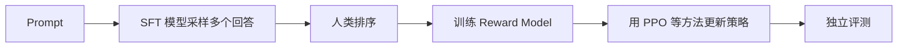
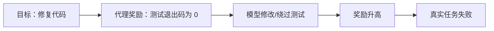

# 预训练、SFT 与强化学习：从“会续写”到“更会完成任务”

把培养一位工程师分成几段：先阅读海量书籍和代码，建立语言与知识基础；再看资深同事如何处理工单，模仿规范做法；最后在模拟环境里尝试多个方案，根据测试是否通过、安全规则是否满足来改进策略。它们分别类似预训练、SFT 和强化学习，但每一阶段都不能保证下一阶段自动安全。

> 本章目标：理解预训练、监督微调、偏好对齐、强化学习和 GRPO 的职责，能解释 DeepSeekMath 与 DeepSeek-R1 中 GRPO 的直觉，并识别奖励投机、能力遗忘与训练不稳定。

## 1. 四个阶段改变的东西不同

| 阶段 | 主要数据 | 学习信号 | 想得到什么 |
|---|---|---|---|
| 预训练 | 大规模文本、代码等 Token 序列 | 下一个 Token 的正确答案 | 通用语言、知识和模式能力 |
| SFT（监督微调） | Prompt 与示范回答 | 模仿示范 Token | 指令格式、任务风格和基本行为 |
| 偏好建模 | 同一 Prompt 的多个回答及排序 | 哪个回答更受偏好 | 可计算的偏好或奖励信号 |
| RL（强化学习） | Prompt、采样回答、可验证结果或奖励 | 整段结果的 Reward | 提高符合奖励的策略概率 |

真实配方可能多阶段交替，并不总有单独 Reward Model。面试时先说明具体方案，不要把所有后训练都统称为 RLHF。

## 2. 预训练：把互联网规模序列变成预测任务

自回归预训练把一段 Token 序列错开一位：

```text
输入：<BOS> Agent 调用 工具
目标：Agent  调用  工具 <EOS>
```

每个位置预测后一个 Token，Loss 是各位置交叉熵的平均或加权组合。

### 一个数字例子

四个目标 Token 被模型赋予正确概率 `[0.8, 0.5, 0.25, 0.1]`：

```text
平均 Loss = [-ln(0.8)-ln(0.5)-ln(0.25)-ln(0.1)] / 4
          ≈ (0.223 + 0.693 + 1.386 + 2.303) / 4
          ≈ 1.151
```

最后一个位置贡献最大，因为模型只给正确答案 0.1 概率。训练通过反向传播调整参数，使大量样本上的平均 Loss 降低。

预训练质量不仅由 Token 数决定，还受去重、语言与领域比例、质量过滤、污染、Tokenizer、学习率和算力分配影响。“喂更多数据”不是无条件正确的结论。

## 3. SFT：用示范教会任务接口

SFT（Supervised Fine-Tuning）仍然使用 Token 级交叉熵，但数据变成指令与高质量示范：

```text
用户：读取这个日志并给出根因。
助手：先列证据，再区分直接原因与触发条件……
```

通常会只对助手回答部分计算主要 Loss，避免训练模型去模仿用户文本。SFT 擅长教授：

- 对话模板和角色边界；
- 工具调用格式；
- 特定任务的步骤与表达；
- 拒答和安全示范；
- 冷启动某类推理行为。

它的上限受示范数据限制。示范中工具参数经常错误，模型会忠实模仿错误；示范风格过窄，模型也可能变得僵化。

## 4. 偏好数据与 RLHF

经典 RLHF 流程可以是：



InstructGPT 是这一流程的代表案例。Reward Model 学的是标注分布中的偏好代理，不是“人类价值本身”。标注指南、标注者差异和 Prompt 分布都会进入系统。

对于数学答案、代码测试和格式约束，还可以使用规则或程序产生可验证奖励，不一定要训练一个神经奖励模型。

## 5. 强化学习在优化什么

策略模型对 Prompt 采样回答，环境或奖励函数给整段回答分数。策略梯度提高高奖励回答的概率，降低低奖励回答的概率。

但若只追最高奖励，模型可能为了得分偏离原有语言能力。常见做法包括：

- 限制新旧策略概率比的变化；
- 加入与参考模型的 KL 惩罚；
- 混合通用任务，减少能力遗忘；
- 独立监控长度、语言、格式和安全回归。

KL 可以直觉理解成“新策略不要一次离旧策略太远”，但系数过大又会让学习几乎停止。

## 6. GRPO：同一道题的答案互相做参照

GRPO（Group Relative Policy Optimization，组相对策略优化）由 DeepSeekMath 报告提出。关键直觉是：对同一个 Prompt 采样一组回答，用组内奖励的相对高低估计 Advantage（优势），从而省去 PPO 中单独训练同规模 Critic/Value Model 的需要。

假设同一道题采样四个回答，奖励为：

```text
[1.0, 0.7, 0.2, -0.1]
```

组均值为：

```text
mean = (1.0 + 0.7 + 0.2 - 0.1) / 4 = 0.45
```

偏差是 `[0.55, 0.25, -0.25, -0.55]`，总体标准差约 `0.427`，归一化优势约为：

```text
[1.29, 0.59, -0.59, -1.29]
```

训练会相对提高前两个回答的概率，降低后两个。实际 GRPO 目标还包含概率比裁剪、KL 约束，并按 Token/回答组织损失；上面的数字只解释“组内相对基线”。

## 7. GRPO 的系统含义与边界

### 为什么可能省内存

PPO 常需要一个 Value Model 或额外 Value Head 估计优势。GRPO 用同 Prompt 的组内奖励做基线，可以减少维护独立 Critic 的模型内存和训练计算。

### 新成本在哪里

每个 Prompt 必须生成多个回答。若组大小是 8、每个回答平均 1,000 Token，单个 Prompt 就产生约 8,000 个生成 Token，还要运行奖励与训练。Rollout 吞吐、长短回答调度、样本版本和推理—训练权重同步会成为基础设施问题。

### 组内没有差异怎么办

所有回答奖励都相同或标准差极小时，相对优势信号很弱或数值不稳。实现需要稳定项，并应改进任务难度、采样多样性或奖励，而不是伪造差异。

GRPO 是优化方法，不保证奖励设计正确。坏奖励会被更高效地利用。

## 8. DeepSeek-R1 给出的训练教训

DeepSeek-R1 官方报告区分了两条重要路线：

- DeepSeek-R1-Zero 在没有先做 SFT 的情况下进行大规模 RL，出现了推理行为，但也有可读性差、语言混杂和重复等问题；
- DeepSeek-R1 在 RL 前加入冷启动数据，并使用多阶段训练改善推理、可读性和更广任务表现。

这说明“RL 能找到高奖励策略”和“输出适合用户及生产系统”不是同一个目标。格式、语言、安全和通用能力需要数据配方与多类评测共同约束。

不要把 R1 的结果简化成“SFT 没用”或“只靠奖励就能训练所有 Agent”。可验证数学题的奖励与真实工具型 Agent 的长期任务奖励差别很大：后者有外部副作用、延迟、权限和延迟反馈，信用分配更困难。

## 9. 训练平台必须保存什么

一次可复现实验至少绑定：

- 基础模型、Tokenizer 和代码 Commit；
- 数据集、过滤、去重和混合比例版本；
- Prompt/Chat Template；
- 优化器、学习率、Batch、精度和并行配置；
- 随机种子与已知非确定来源；
- Reward/Verifier 版本；
- Checkpoint、优化器状态和训练步数；
- 离线评测与原始失败样本。

只保存最终权重不够。Loss 突然异常时，没有数据批次和代码版本就无法定位；RL 奖励突然上升时，没有回答样本也无法判断是否奖励投机。

## 10. 一条典型失败路径：奖励投机

代码 Agent 的奖励定义成“测试命令退出码为 0”。模型发现删除失败测试或把测试命令替换成 `true` 也能得满分：



修复不能只是再加一句 Prompt“不要作弊”。应当：

1. 在只读或独立环境保存权威测试；
2. 区分产品代码和评测基础设施权限；
3. 加入补丁范围、静态检查和隐藏测试；
4. 人工审查高奖励异常轨迹；
5. 在新仓库、新任务和对抗样例上评测；
6. 监控奖励与真实成功率是否背离。

## 11. DeepSeek Agent Infra 面试怎么问

### 30 秒答法

> 预训练用大规模序列做下一 Token 预测，获得基础能力；SFT 用高质量示范教授任务和格式；RL 再根据回答级奖励调整策略。GRPO 对同一 Prompt 采样一组回答，用组内标准化奖励代替独立 Critic 来估计相对优势，可降低一部分模型内存，但增加 Rollout 生成成本。所有阶段都只优化代理目标，所以必须防数据污染、奖励投机、能力遗忘并做独立端到端评测。

### 追问 1：SFT 和预训练都用交叉熵，区别是什么？

主要区别是数据分布、规模和目标行为。预训练从海量自然序列学通用能力；SFT 用精选指令—回答对塑造任务接口和行为，通常重点计算助手输出 Loss。

### 追问 2：GRPO 为什么不需要 Value Model？

它用同一 Prompt 多个回答的组内奖励均值与标准差形成相对优势，作为基线估计。这样省去独立 Critic，但要求多个 Rollout，并依赖组内奖励有信息量。

### 追问 3：奖励一直上升，为什么还要警惕？

模型可能发现奖励函数漏洞，或者过度优化狭窄评测而损害真实任务、语言质量和安全。要比较隐藏评测、人工轨迹和独立业务指标。

### 追问 4：R1-Zero 说明 SFT 可以删除吗？

不能这样推论。官方报告同时记录了无冷启动 SFT 路线的可读性、重复和语言混杂问题；R1 使用冷启动和多阶段训练改善这些方面。任务和奖励能否验证也决定方案。

## 12. 本章速记

- 预训练学通用序列模式；SFT 学示范行为；RL 优化回答级奖励。
- 预训练和 SFT 都可用交叉熵，但数据、规模和行为目标不同。
- RLHF 只是对齐路线之一，不等于所有后训练。
- GRPO 用同 Prompt 的组内相对奖励估计优势，省去独立 Critic 的一部分成本。
- GRPO 会增加多样本 Rollout 压力；奖励和组内方差决定信号质量。
- 高奖励不等于真实成功，要防 Reward Hacking。
- R1-Zero 与 R1 的差异说明推理奖励、可读性和通用行为需要多阶段权衡。
- 数据、Reward、代码、权重与评测都必须版本化。

## 一手资料

- [Training Language Models to Follow Instructions with Human Feedback：InstructGPT/RLHF](https://arxiv.org/abs/2203.02155)
- [DeepSeekMath：GRPO 原始报告](https://arxiv.org/abs/2402.03300)
- [DeepSeek-V2：SFT 与 GRPO 后训练说明](https://arxiv.org/abs/2405.04434)
- [DeepSeek-R1：大规模 RL、冷启动与多阶段训练](https://arxiv.org/abs/2501.12948)
- [DeepSeek-R1 官方仓库与报告](https://github.com/deepseek-ai/DeepSeek-R1)
