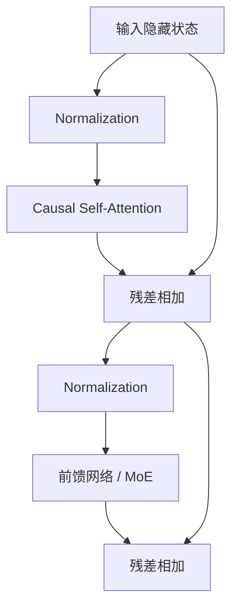

# Transformer：让每个 Token 带着问题去查上下文

想象一场多人会议。轮到“它”发言时，这个代词要回头判断自己指的是“模型”“工具”还是“服务器”。传统做法像按顺序传纸条；注意力机制则像发言者带着一个问题，快速给前文每张名牌打相关分，再把最有用的信息汇总回来。Transformer 就是把这种“查询上下文”的过程和逐位置计算反复堆叠起来。

> 本章目标：理解 Token、Embedding、位置、Q/K/V、自注意力、因果遮罩、多头注意力和 Transformer Block，并能从张量形状与复杂度解释长上下文的系统代价。

## 1. 文本先变成 Token

模型不能直接读取字符串。Tokenizer（分词器）把文本转换成词表中的整数 ID。Token 不一定等于一个汉字或英文单词，也可能是词片段、标点或特殊控制符。

```text
文本：Agent 调用工具
可能的 Token：["Agent", " 调用", "工具"]
Token ID：[3142, 9281, 775]
```

这只是教学示意；真实切分完全取决于具体模型的词表和分词算法。不要用“字符数”直接估计请求成本。英文代码、中文、生僻字符和空白可能产生不同的 Token 数。

分词器还是模型接口的一部分：词表、特殊 Token 和 Chat Template（把角色消息排成模型训练格式的模板）不匹配，即使权重正确也可能输出异常。

## 2. Embedding：把 ID 变成可计算的向量

Token ID 只是编号，`775` 并不天然比 `3142` 大或更重要。Embedding Table（嵌入表）为每个 ID 保存一个可训练向量。

教学上假设向量只有 3 维：

| Token | Embedding |
|---|---|
| Agent | `[0.8, 0.1, -0.2]` |
| 工具 | `[0.7, -0.1, 0.4]` |
| 香蕉 | `[-0.3, 0.9, 0.1]` |

训练会让适合承担相似作用的 Token 在某些方向上形成有用关系，但不能把单个维度强行解释成固定的人类概念。Embedding 是任务中学出的表示，不是人工定义的词典释义。

## 3. 顺序从哪里来

纯注意力只看一组向量，本身分不清“工具调用模型”和“模型调用工具”。因此必须加入位置信息。

原始 Transformer 使用正弦/余弦位置编码；后来的语言模型常使用旋转位置编码等方案。无论具体方法怎样，目标都是让注意力知道 Token 的相对或绝对位置。

位置能力不是“配置里把最大长度改大”就自动获得。超过训练或适配范围时，质量、数值行为和显存需求都要重新验证。

## 4. Q、K、V：问题、索引和内容

对每个 Token 的隐藏向量 `x`，模型通过不同矩阵得到：

```text
Q = xW_Q   Query：我现在想找什么
K = xW_K   Key：我适合被什么问题找到
V = xW_V   Value：找到我后应取走什么信息
```

注意力公式是：

```text
Attention(Q, K, V) = softmax(QKᵀ / √d_k) V
```

分三步看：

1. `QKᵀ`：每个 Query 与各 Key 做点积，得到相关分数；
2. 除以 `√d_k`：避免维度大时点积幅度过大，Softmax 过早饱和；
3. Softmax 后加权求和 `V`：把相关上下文汇总成新表示。

## 5. 手算一次极小注意力

当前 Token 的 Query 与前面三个 Key 的缩放后分数是 `[2, 1, 0]`。Softmax 权重约为：

```text
[0.665, 0.245, 0.090]
```

三个 Value 为：

```text
V1 = [1, 0]
V2 = [0, 2]
V3 = [1, 1]
```

加权结果是：

```text
0.665×V1 + 0.245×V2 + 0.090×V3
= [0.665, 0] + [0, 0.490] + [0.090, 0.090]
= [0.755, 0.580]
```

它不是“复制最相关的一个 Token”，而是按权重混合多个 Value。训练会同时学习怎样产生 Q、K 和 V。

## 6. 因果遮罩：生成时不能偷看答案

自回归语言模型在位置 `t` 预测下一个 Token 时，只能看位置 `≤ t`。训练时整段序列可并行送入 GPU，但会用 Causal Mask（因果遮罩）把未来位置的注意力分数设为不可选。

| Query 位置 | 可见 Key 位置 |
|---:|---|
| 1 | 1 |
| 2 | 1, 2 |
| 3 | 1, 2, 3 |
| 4 | 1, 2, 3, 4 |

如果遮罩写错，训练指标可能异常地好，因为模型偷看了正确后文；真正逐 Token 推理时却无法复现。这是一种严重的数据泄漏。

## 7. 为什么需要多头注意力

一个注意力头只有一套 Q/K/V 投影。多头注意力让模型在多个子空间中并行建立不同关系，再拼接并投影回隐藏维度。

可以把它想成多个阅读视角：一个头可能更容易捕捉局部语法，另一个关注远距离引用。但这是帮助理解的类比，不应宣称某个具体头永远对应固定语言规则。

假设隐藏维度 `d_model = 512`，有 8 个头，则常见设计中每头维度为 `512 / 8 = 64`。头数增加并不自动增加总隐藏维度，也不保证质量变好。

## 8. 一个 Decoder-only Transformer Block

现代自回归 LLM 常把多个类似 Block 堆叠：



- Attention 负责在 Token 之间交换信息；
- 前馈网络（FFN）对每个位置独立做非线性变换；
- 残差连接提供直接信息通路，使深层网络更易训练；
- Normalization 控制激活尺度，改善训练稳定性。

最后一个位置的隐藏向量经过输出层，得到整个词表的 Logit，再由解码策略选择下一个 Token。

## 9. 跟踪张量形状

设：Batch `B=2`，序列长度 `T=4`，隐藏维度 `D=8`，头数 `H=2`，每头维度 `d=4`。

| 张量 | 形状 | 含义 |
|---|---|---|
| 输入隐藏状态 | `[B,T,D] = [2,4,8]` | 两条、每条四个 Token |
| Q/K/V | `[B,H,T,d] = [2,2,4,4]` | 拆成两个头 |
| 注意力分数 | `[B,H,T,T] = [2,2,4,4]` | 每个位置对每个位置打分 |
| 合并后输出 | `[B,T,D] = [2,4,8]` | 回到原隐藏维度 |

面试白板题里，形状比背 API 更重要。很多实现错误都是转置、广播（自动扩展兼容维度）或 Mask 维度不对。

## 10. 长上下文为什么昂贵

标准全注意力的分数矩阵含 `T×T` 个位置关系。序列从 4,000 增加到 8,000，关系数量约增至 4 倍，而不是 2 倍。

训练或 Prefill 阶段需要处理整段关系；Decode 阶段虽然每次只有一个新 Query，却要读取过去 Token 的 Key/Value Cache。FlashAttention 一类算法可以显著减少显存读写和中间矩阵存储，但没有把标准注意力的逻辑依赖变成“完全免费”。

长上下文还会影响：

- Tokenization 和请求排队；
- KV Cache 容量与可并发请求数；
- 首 Token 延迟；
- 模型是否真的能利用远处信息，而不只是“装得下”。

## 11. 一条典型失败路径：Mask 错一位

同一 Batch 中的序列长度不同时，系统常用 Padding（无业务含义的占位 Token）补齐形状，再用 Padding Mask 阻止模型读取占位位置。团队把它与 Causal Mask 合并错了一位，结果可能有两种：

1. 允许看到未来 Token：训练 Loss 异常低，真实生成崩溃；
2. 屏蔽了当前或有效历史：模型无法利用上下文，短文本也表现差。

排查方法：

- 用 3～4 个 Token 的最小序列打印完整 Mask；
- 验证位置 `t` 恰好只能看 `≤t` 且不能看 Padding；
- 比较并行训练输出与逐步解码输出；
- 对不同 Batch 长度和左/右 Padding 分别测试；
- 不要只依赖总体 Loss。

## 12. DeepSeek Agent Infra 面试怎么问

### 30 秒答法

> Transformer 先把 Token ID 映射成向量并加入位置信息。每层用 Q 和 K 点积得到相关权重，再对 V 加权汇总；因果 Mask 保证生成位置不能看未来。多头提供多个表示子空间，FFN 做逐位置变换，残差和归一化帮助深层训练。系统上，Prefill 要处理整段上下文，Decode 要反复读取历史 KV，因此序列长度同时影响计算、缓存和延迟。

### 追问 1：为什么注意力分数要除以 `√d_k`？

维度增大时点积方差会变大，Softmax 容易饱和到几乎把全部权重给一个位置，梯度变差。缩放把数值保持在更合适的范围。

### 追问 2：训练为什么能并行，生成却通常逐 Token？

训练已有完整目标序列，可用因果 Mask 同时计算所有位置；生成时下一个 Token 是未知的，必须先得到前一个 Token 才能继续。

### 追问 3：FlashAttention 是否把复杂度变成线性？

它通过分块和融合减少高带宽内存读写及中间存储，精确注意力的算术关系仍涉及查询与键的配对。应区分算法语义、算术量和实际 I/O 成本。

### 追问 4：为什么 Tokenizer 也要版本化？

Token ID 直接索引模型的 Embedding。词表或特殊 Token 映射错位，相同文本会变成不同输入；Chat Template 不匹配也会破坏角色和停止边界。

## 13. 本章速记

- Token 不是字符或单词的固定同义词，切分由具体 Tokenizer 决定。
- Embedding 把离散 ID 映射成可训练向量。
- Q 提问、K 用于匹配、V 提供被汇总的内容。
- `softmax(QKᵀ/√d_k)V` 是注意力核心。
- Causal Mask 防止训练偷看未来。
- Attention 负责跨位置通信，FFN 负责逐位置变换。
- 标准注意力的关系矩阵随序列长度平方增长；Decode 还受 KV Cache 读取影响。
- 形状、Mask、Tokenizer 和位置处理都是模型服务契约的一部分。

## 一手资料

- [Attention Is All You Need：Transformer 原始论文](https://arxiv.org/abs/1706.03762)
- [SentencePiece：语言无关子词分词论文](https://arxiv.org/abs/1808.06226)
- [FlashAttention：面向 I/O 的精确注意力算法](https://arxiv.org/abs/2205.14135)
- [DeepSeek-V2：MLA 对注意力与 KV Cache 的改造](https://arxiv.org/abs/2405.04434)
