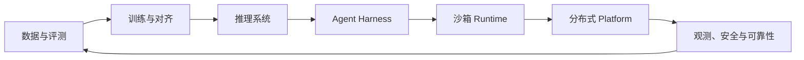

# AI 与 Agent Infra 岗位能力地图

AI 系统岗位并不只有“训练模型”和“调用模型 API（Application Programming Interface，应用程序接口）”两种。一个生产系统从数据、训练、推理延伸到 Agent Harness、安全执行环境和分布式平台，不同岗位负责其中不同边界。理解这些边界，才能判断一个问题属于算法、模型服务、Agent 控制流还是基础设施。

## 1. 从一条请求看岗位分工



这不是组织架构的固定模板，而是一组技术责任：

- 数据与评测决定系统学习什么、怎样判断好坏；
- 训练与对齐更新模型参数；
- 推理系统把冻结的模型参数高效地变成在线输出；
- Harness 管理上下文、工具、计划、状态与验证；
- Runtime 强制执行进程、文件、网络、身份和资源边界；
- Platform 在多机环境中完成调度、存储、恢复、观测和治理。

同一团队可能覆盖多层，但设计时仍应把责任分清。例如，模型输出了错误命令属于模型或上下文质量问题；未经授权就执行命令属于 Harness/权限问题；命令突破文件边界则属于 Runtime 隔离问题。

## 2. 六类常见技术方向

### 2.1 数据、训练与对齐

这一方向把原始样本变成训练信号，并通过优化算法更新参数。核心能力包括：

- 数据清洗、去重、切分和泄漏检测；
- 损失函数、梯度下降、反向传播和优化器；
- 预训练、监督微调、偏好学习与强化学习的目标差异；
- 分布式训练中的数据并行、模型并行、通信和检查点；
- 训练指标、离线评测与真实产品目标之间的偏差。

典型问题不是“会不会背某个算法名”，而是能否说明训练信号来自哪里、参数怎样改变、指标可能怎样被数据污染。

### 2.2 LLM 推理与模型服务

推理岗位让冻结模型稳定、高效地处理请求。核心能力包括：

模型服务通常把一次生成分成两个阶段：**Prefill（预填充）**先处理整段输入，并建立后续可复用的 **KV Cache（键值缓存）**；**Decode（解码）**再按自回归方式逐个生成 Token。TTFT（Time to First Token，首 Token 时间）衡量用户等到第一个输出的时间，TPOT（Time per Output Token，后续每个输出 Token 的平均时间）衡量持续生成速度。先分清这些对象，才知道慢在排队、输入计算还是逐 Token 生成。

- Tokenization、Transformer、Attention 和自回归生成；
- Prefill、Decode、KV Cache 与连续批处理；
- GPU 算力、显存容量、显存带宽和 Kernel 启动开销；
- 量化、并行、路由与缓存对质量和性能的影响；
- TTFT、TPOT、吞吐量、队列时间和过载控制。

这一方向的系统设计必须固定模型、硬件、精度、上下文长度和输出长度。脱离这些条件谈“每秒多少 Token”没有可比性。

### 2.3 Agent Harness 与应用平台

Harness 把模型输出组织成可执行过程。核心能力包括：

这里的 **MCP（Model Context Protocol，模型上下文协议）**定义应用怎样发现并调用外部工具或资源；它解决接口互操作问题，但不会自动授予业务权限。**Context Engineering（上下文工程）**则是选择、组织和更新模型当前能看到的信息。两者都位于模型与真实环境之间，因此还需要确定性的参数校验和授权。

- Context Engineering、Tool Use、MCP、Skills 与结构化输出；
- 短期状态、长期 Memory、检索和引用；
- 规划、子任务、多 Agent 协作和取消传播；
- 权限检查、预算、审批、幂等、验证与人工介入；
- 轨迹评测、失败归因和线上反馈闭环。

模型会提出候选动作，但 Harness 必须决定动作是否有效、是否允许以及失败后怎样继续。

### 2.4 Agent Runtime 与沙箱

Runtime 负责真正执行代码或工具。核心能力包括：

- 进程树、文件描述符、系统调用、信号和资源回收；
- 容器、用户态内核、虚拟机与硬件虚拟化的隔离边界；
- CPU、内存、进程数、磁盘、网络和外部配额限制；
- 根文件系统、临时盘、共享卷、制品和 Checkpoint；
- 虚拟网络、服务发现、租户 ACL（Access Control List，访问控制列表）和出口控制；
- 镜像、依赖和秘密的供应链安全。

Runtime 的正确性标准不是“命令能运行”，而是命令只能在授权范围内运行，资源耗尽不会拖垮邻居，取消后没有孤儿进程，结果和副作用都能审计。

### 2.5 分布式控制面与基础设施

控制面把大量任务分配到许多节点，并维护期望状态。核心能力包括：

- Task、Attempt、Operation、Sandbox 和 Resource 的状态机；
- 队列、公平性、优先级、准入、抢占与拓扑约束；
- 租约、心跳、fencing、幂等、重试与 reconciliation；
- 元数据存储、消息系统、缓存和对象存储的责任边界；
- 节点上下线、滚动发布、容量扩缩和故障域隔离。

控制面发出“创建沙箱”命令后发生超时，不能立刻把请求标成失败并盲目重建。真实状态可能是创建成功但响应丢失，因此需要操作标识、条件更新和对账。

### 2.6 观测、安全与可靠性

这类能力贯穿所有层：

**SLI（Service Level Indicator，服务水平指标）**是实际测得的成功率、延迟等数值；**SLO（Service Level Objective，服务水平目标）**是在一个统计窗口内对 SLI 设定的目标。两者的区别是“现在测到了什么”和“希望至少做到什么”。

- 用指标观察总体趋势，用日志保存离散事件，用 trace 连接一次请求；
- 用 SLI/SLO 和错误预算定义可接受服务；
- 通过限流、背压、熔断、降级和重试预算控制过载；
- 使用身份、能力票据、最小权限和审计限制动作；
- 用故障演练、事故时间线、根因分析和行动项防止复发。

可观测性不是“多打日志”，可靠性也不是“永不失败”。它们共同建立证据，使系统能发现故障、限制影响并恢复。

## 3. 共同系统基础怎样进入 AI 场景

通用计算机基础由系统子书主讲，AI 子书只解释新增语义：

| 通用基础 | 在 Agent Infra 中新增的问题 |
|---|---|
| 进程与线程 | 一次 run 对应哪些进程，取消怎样覆盖整棵进程树 |
| 虚拟内存 | 沙箱怎样限额，工作集和 OOM 怎样影响任务状态 |
| 并发与同步 | 多 worker 怎样领取任务，取消与完成如何避免竞态 |
| 网络 | 工具 RPC（Remote Procedure Call，远程过程调用）怎样设置 deadline、身份、重试与出口策略 |
| 文件系统 | Checkpoint、制品和共享卷的可见性与持久化边界 |
| CPU/I/O 性能 | 模型、沙箱启动、工具和存储分别占多少时间与资源 |
| 分布式系统 | 超时、重复、分区和旧租约怎样影响业务副作用 |

## 4. 岗位能力不是技术名词清单

判断是否真正理解一个主题，可以检查能否完成五件事：

1. **定义对象**：例如 KV Cache 保存什么，Attempt 与 Task 为什么不同；
2. **解释机制**：按时间顺序说明数据或状态怎样变化；
3. **给出数量级**：计算显存、并发、队列、带宽或错误预算；
4. **分析失败**：说明超时、崩溃、重复和过载后会留下什么状态；
5. **提出证据**：选择指标、日志、trace、评测或对照实验验证判断。

只会列 Kubernetes、RAG（Retrieval-Augmented Generation，检索增强生成）、MoE（Mixture of Experts，混合专家）、MCP 等名词，无法说明它们解决的具体问题，不构成可用能力。

## 5. 三条典型跨层追问

### 5.1 为什么首个 Token 很慢

回答需要连接：请求排队 → 输入 Tokenization → Prefill 计算 → 权重与 KV 写入 → 调度和批处理。若工具型 Agent 还要等待沙箱或检索，端到端首响应不能只看模型 Kernel。

### 5.2 为什么取消任务后仍发生外部写入

取消本地进程只阻止未来本地指令，不能撤销已经提交给数据库、支付或邮件服务的动作。系统需要为外部操作保存幂等键和状态，超时后查询事实源，再决定重试或补偿。

### 5.3 为什么平均资源够用仍大量排队

平均 CPU 或内存会隐藏峰值、资源组合和重尾任务。若任务同时需要 GPU、内存和特定镜像，任一维度不足都会阻止调度；重试还可能扩大到达率。需要按 workload class 建立资源向量、分位数和准入规则。

## 6. 一个容量算例

假设平台峰值每秒接收 120 个任务，平均占用沙箱 40 秒。根据 Little 定律，稳定状态下平均并发约为：

```text
L = λW = 120 × 40 = 4,800 个任务
```

若每个任务平均使用 0.5 个 CPU 核、1.2 GiB 内存和 1 GiB 临时盘，仅按平均数得到：

```text
CPU    = 4,800 × 0.5 = 2,400 核
内存   = 4,800 × 1.2 = 5,760 GiB
临时盘 = 4,800 × 1   = 4,800 GiB
```

这只是第一版账本，不能直接作为采购量。还要加入分位数、节点不可用余量、装箱碎片、租户突发、冷启动、镜像拉取、模型服务配额和重试放大。容量岗位的核心能力，是知道公式算出了什么，也知道它遗漏了什么。

## 7. 章末问题

1. 模型、Harness、Runtime 和 Platform 各自负责什么？
2. 为什么模型生成了合法 JSON，仍不能直接执行工具？
3. 推理系统与 Agent Runtime 的容量指标有什么不同？
4. Task、Attempt 和外部 Operation 为什么要分开建模？
5. 容器、用户态内核和 VM 的主要隔离边界是什么？
6. 怎样把一次 Agent 失败从用户请求追到模型、工具、沙箱和主机？
7. 为什么平均资源需求不能直接决定集群容量？
8. 选择一个方向，用“定义、机制、算例、失败、证据”五层解释它。

## 8. 参考答案与解答

<details>
<summary>展开答案</summary>

1. **模型**把输入 Token 映射成输出 Token 或工具调用意图；**Harness**组织 Prompt、上下文、工具协议和循环；**Runtime**实际创建沙箱、调度进程并限制资源；**Platform**提供多租户控制面、存储、网络、观测、可靠性和发布。一次 Agent 请求会依次使用这四层，但任一层的成功都不能替代其他层的承诺。
2. 合法 JSON 只证明语法可解析。执行前仍要校验 Schema 和业务约束、确认调用者对目标资源有权限、限制路径/网络/费用、处理幂等与审批，并把结果纳入审计。模型负责提出意图，确定性系统负责决定能否执行。
3. 推理系统通常以 Token 为核心，关注 TTFT、TPOT、Token/s、Batch、权重和 KV Cache；Agent Runtime 以任务与沙箱为核心，关注并发 run、排队、启动、CPU/内存/磁盘、进程数、工具连接和恢复。二者相连，但“每秒多少 Token”不能直接推出“能同时跑多少个代码任务”。
4. Task 是用户的逻辑目标，Attempt 是一次可失败或重试的执行，Operation 是可能产生外部副作用的一次逻辑动作。分开后，第二次 Attempt 可以继续同一 Task，并复用原 Operation ID 查询是否已经生效；若都用一个 ID，就无法判断迟到结果属于哪次尝试，也容易重复副作用。
5. 容器主要隔离 namespace、cgroup 和文件/网络视图，但共享宿主内核；用户态内核在受限进程或代理中重新实现大量系统接口，减少不可信代码直接接触宿主内核；VM 通过虚拟硬件与 guest kernel 建立更强的内核边界。隔离强度还取决于配置、设备暴露和补丁状态，不由名称单独决定。
6. 给请求分配贯穿全链路的 trace/run ID：先看用户级失败定义，再沿 span 检查模型输入输出、Harness 的工具选择与参数、工具响应、沙箱进程和资源事件，最后关联宿主机 CPU、内存、I/O 与网络。每一跳记录版本、开始/结束时间、状态和错误；用同版本正常请求作对照，才能从“同时发生”走向“有证据的归因”。
7. 平均数隐藏高分位、相关峰值和装箱碎片。即使平均内存是 1 GiB，少量 20 GiB 任务也可能让节点 OOM；节点故障、租户突发、冷启动、重试和不可整除的 CPU/内存组合还需要额外余量。因此容量要按 workload class 的分布和资源向量计算，并经过故障演练，而不是只做平均值乘并发。
8. 示例选择“推理服务”：**定义**是把 Prompt 转为输出 Token 的在线系统；**机制**是排队、Prefill、KV Cache、逐轮 Decode 与流式返回；**算例**是 `总时长≈TTFT+(N-1)×TPOT`，若 TTFT=500 ms、生成 101 Token、TPOT=20 ms，则约 `500+100×20=2500 ms`；**失败**可以是 KV 耗尽导致拒绝或超长 Prefill 阻塞短请求；**证据**是同一 trace 的队列时长、Prompt 长度、KV 占用、Batch、Kernel 时间和停止原因。这个五层结构也可替换成安全、调度或存储方向。

</details>
