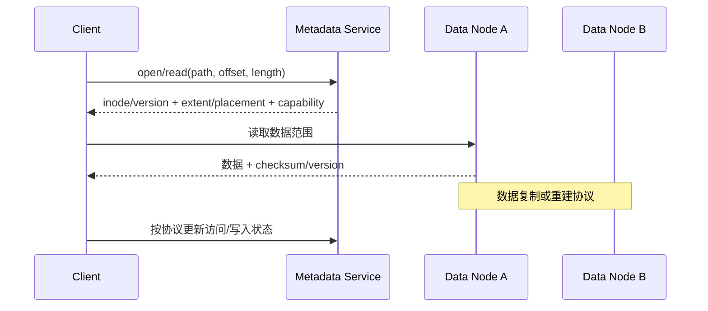
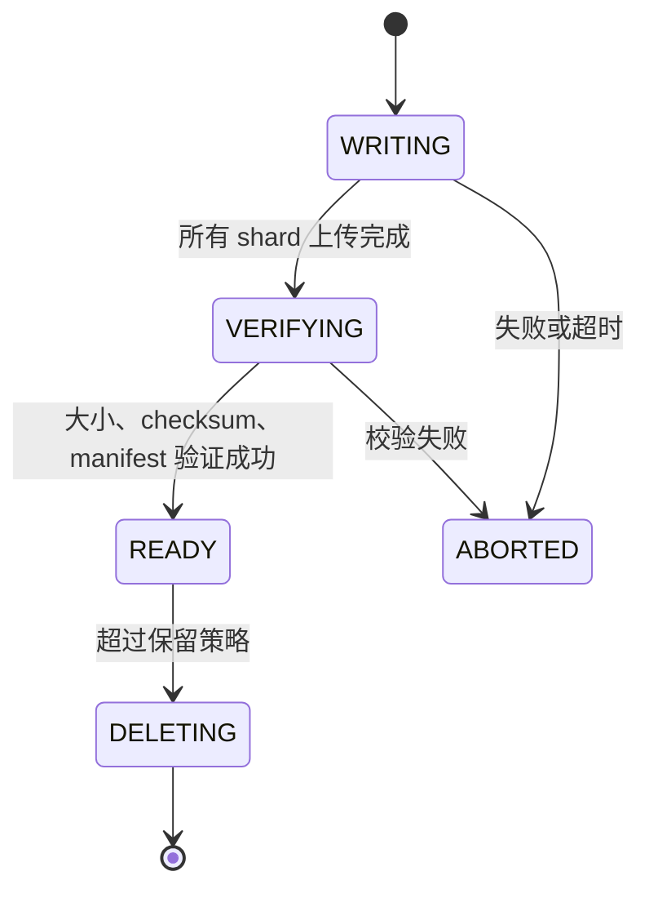

# AI 分布式存储：数据集、Checkpoint 与 KV Cache 怎样落到集群

AI 系统中的“存储”不是一个统一负载。训练数据常是大量并发读取，Checkpoint 是周期性大写入，模型权重需要快速分发，推理 KV Cache 可能产生细粒度、短生命周期的随机访问。若只说“放到分布式文件系统”，就没有回答接口、一致性、容量、热点和故障怎样处理。

本章先从四类负载推导文件、对象和块接口，再解释元数据面、数据面、缓存、复制、RDMA 与恢复。单机 `write/fsync` 的路径由共享册[一次 write 怎样到达持久存储](../../rust-hft/foundations/file_write_path.html)主讲，普通分布式复制与共识见[复制与共识](../../rust-hft/distributed/replication_consensus.html)。

## 1. 先区分四种工作负载

| 负载 | 典型访问 | 关键问题 |
|---|---|---|
| 训练数据集 | 多 worker 并发读，可能随机打散小样本 | 吞吐、热点、小读、数据版本与顺序 |
| 模型权重 | 大对象读，启动时许多节点同时拉取 | 冷启动突发、缓存、一致版本 |
| Checkpoint | 周期性并行大写，之后用于恢复 | 原子发布、写入突发、完整性、保留与恢复时间 |
| 推理 KV Cache | 按模型/请求前缀索引，容量大、命中有时效 | 延迟、淘汰、租户隔离、版本和可重建性 |

它们不能共用一个未经区分的 SLO（Service Level Objective，服务水平目标）。训练吞吐高但 Checkpoint 写入长期排队，恢复仍会失败；平均读带宽高但小样本 p99 很差，GPU 仍可能等数据。

## 2. 文件、对象与块分别给了什么抽象

### 2.1 文件接口

文件有路径、目录、偏移和字节内容，适合现有数据加载器和工具直接使用。系统要处理目录/文件元数据、权限、并发写入、缓存一致性与 rename 等语义。

### 2.2 对象接口

对象通常以 key 访问整个对象或范围，天然适合不可变数据集 shard、模型权重和制品。它不自动提供完整 POSIX 文件语义；应用若需要目录、原地小写或文件锁，必须另建协议。

### 2.3 块接口

块设备暴露固定大小的可寻址块，上层仍需文件系统或专用存储引擎组织名字、空间和一致性。临时盘、数据库或高性能客户端可能使用它，但“块更底层”不代表业务一定更快。

选择接口时问：调用者以路径还是 key 找数据？是否原地修改？是否需要目录事务？单对象多大？谁负责缓存和恢复？不能只比较峰值 GB/s。

## 3. 元数据面与数据面为什么分开



**元数据面**回答名字、权限、版本、大小、extent（文件逻辑范围到存储位置的映射）和副本位置；**数据面**搬运真实字节。分开后，大数据不必经过元数据服务中转，但元数据仍可能成为小文件、频繁 `stat/open` 和目录扫描的瓶颈。

图中的 capability 可以理解为一张有权限范围和过期时间的访问凭证：客户端只能在凭证允许的对象、范围和操作内直接访问数据节点。它减少了每个数据块都回元数据服务鉴权的需要，但签发、撤销和过期仍要由控制面管理。

元数据服务“无状态”通常是指进程本身不独占不可恢复状态，权威元数据存于事务数据库或日志；不表示整个元数据系统没有状态，也不表示请求无需一致性控制。

## 4. 一次分布式读取经历什么

以文件读取为例，典型步骤是：

1. 客户端把路径解析到文件身份和版本；
2. 元数据服务返回目标范围的放置与访问凭证；
3. 客户端选择数据副本或分片；
4. 发起网络读取，把数据送入页缓存、用户缓冲或注册内存；
5. 校验长度、版本和 checksum（校验和）；
6. 失败时换副本、重试或返回明确错误；
7. 上层 DataLoader 把样本解析、解压、转换并交给 GPU。

GPU 等数据时，慢点可能在元数据、存储介质、网络、客户端 CPU 解压、内存复制或 batch 组装。存储服务的“磁盘读完成”不是训练步骤的完成边界。

## 5. 一次 Checkpoint 怎样安全发布

不要让恢复者把“目录里出现一些 shard”误认为完整 Checkpoint。一个常见协议是：



**manifest（清单）**记录 Checkpoint ID、训练 step、世界大小、模型/优化器/随机数/数据进度、每个 shard 的 key、大小、checksum 和格式版本。恢复者只读取状态为 `READY` 且清单完整的版本。

发布事务只需原子改变小元数据；大 shard 可以先以不可见临时 ID 写入。失败上传由后台垃圾回收根据引用和年龄清理。若使用 rename，必须明确目标存储是否真的提供所依赖的原子语义，不能把本地文件系统经验直接套到对象存储。

## 6. Checkpoint 突发怎样压垮系统

假设 256 个 worker 同时各写 8 GiB：

```text
总数据 = 256 × 8 GiB = 2048 GiB = 2 TiB
```

若希望 60 秒完成，仅数据净写吞吐至少：

```text
2 TiB / 60 s ≈ 34.13 GiB/s
```

这还没算复制、纠删码、校验、元数据、网络协议和其他租户。若保存 2 副本，存储后端接收的物理数据可能接近 4 TiB；所需后端吞吐近似翻倍。

控制方法包括分批开始、按存储/网络令牌限速、增量或异步 Checkpoint、独立带宽池和容量准入。但异步写必须定义：训练继续前已经保证什么？节点此刻故障时这版是否可恢复？不能把内存中待上传数据标成 durable（可持久恢复）。

## 7. 数据放置、复制与纠删码

**复制**保存完整副本，读取与恢复直接，但容量成本高。**纠删码（erasure coding）**把数据编码成 `k` 个数据片和 `m` 个校验片。以常见的 MDS（Maximum Distance Separable，最大距离可分）码为例，任意 `k` 个完整片段可重建原数据，因此最多可容忍 `m` 个片段丢失；并非所有编码方案都具有完全相同的恢复条件。纠删码提高容量效率，却增加编码、小写放大和故障重建复杂度。

放置要跨真实故障域：设备、节点、机架、交换机、供电或可用区。三份副本若都在同一机架，无法防机架故障。放得太远又会增加正常读写成本，所以元数据需要记录策略与实际位置，并持续 reconciliation（对账收敛）。

一致性和耐久性是不同维度：强一致回答并发读写看见哪个版本；耐久性回答已确认数据在故障后是否仍存在。多数副本协议既要处理顺序，也要等待足够持久副本，但两个承诺不能用一个“强一致”词代替。

## 8. 小文件为什么特别难

一百万个 4 KiB 样本只有约 3.8 GiB 数据，却可能触发一百万次名字查询、权限检查、对象请求和队列调度。此时瓶颈常是每请求固定成本，而不是介质顺序带宽。

常用办法：

- 把小样本打包成较大 shard，另建索引定位偏移；
- 客户端批量请求、预取并并行解析；
- 缓存元数据和热点索引，同时用版本/租约控制陈旧性；
- 按 key 或目录分片元数据，避免单热点；
- 测试随机小读 IOPS 和 p99，不只跑大块顺序吞吐。

打包也有代价：更新单个样本、随机读取、故障重试和数据版本管理更复杂。训练数据通常不可变或版本化，因此较适合该取舍。

## 9. Cache 需要版本和失效协议

缓存可以位于训练进程、节点本地 NVMe、分布式客户端、数据节点或对象网关。每层都要回答：

- key 是否包含数据集/模型/Tokenizer/格式版本；
- 写入中和 READY 对象怎样区分；
- 谁能驱逐，驱逐后是否可重建；
- 多租户是否共享，权限怎样验证；
- checksum 失败怎样回源；
- 缓存命中是否会返回已经撤回或无权访问的数据。

不可变、内容寻址对象最容易缓存：key 可包含内容 hash，同一内容天然复用。可变路径缓存则需要版本号、租约或失效消息；仅靠一个固定 TTL（Time To Live，存活时间）会存在陈旧窗口。

## 10. KV Cache 存储不是普通网页缓存

推理 KV Cache 的 key 至少与模型版本、权重/适配器、Tokenizer、Prompt Token 序列、位置和数值格式有关。任何一项不同都可能使缓存不兼容。

KV 可分层放在 GPU HBM、主存、本地 NVMe 或远程共享存储：

| 层 | 优点 | 限制 |
|---|---|---|
| GPU HBM | Decode 直接使用 | 最贵、容量最小 |
| 主存 | 容量更大，CPU 可管理 | 传回 GPU 有带宽与延迟 |
| 本地 NVMe | 成本低、容量大 | 节点局部，介质与读取延迟 |
| 远程存储 | 可跨副本复用 | 网络、排队、热点与权限 |

是否值得命中取决于“读取并搬回 KV 的时间”是否小于“重新 Prefill 的时间”，还要考虑命中率、队列和污染。远程缓存容量大不代表每个短 Prompt 都应读取它。

## 11. Direct I/O、FUSE、io_uring、SPDK 和 RDMA 的位置

这些名字解决不同层的问题：

- **FUSE（Filesystem in Userspace）**让用户态文件系统通过内核接口提供文件语义，易集成但路径上有用户/内核交互与复制/调度成本；
- **Direct I/O**尝试绕过普通文件页缓存，带来对齐和文件系统语义约束，不自动保证持久化；
- **io_uring**提供 Linux 异步 I/O 提交/完成接口，减少某些调用与线程管理成本，不替代文件系统和设备；
- **SPDK**是一套用户态存储开发工具，常使用轮询和用户态驱动处理 NVMe 等设备，需要专用资源与工程约束；
- **RDMA**让网卡在注册内存之间搬运数据，减少远端 CPU 参与和复制，但连接、权限、完成、拥塞和错误仍需协议处理。

一个系统可能组合使用它们，但每加一层复杂度都要用 CPU、吞吐、p99 与可靠性证据证明收益。零拷贝也常是“减少特定边界的复制”，不是数据从 SSD 到 GPU 一次都不经过地址映射、协议头或校验。

## 12. 校验和、静默损坏与端到端完整性

设备和网络有各自错误检测，但应用仍应对持久对象保存内容 checksum，并在写入、复制、后台 scrub（巡检）和恢复时验证。

元数据 checksum 只证明清单字节没变，不能证明清单引用的所有 shard 正确；每个 shard 需要自己的长度与 checksum，最终 manifest 再绑定整个集合。发现坏副本时，先隔离并从可信副本修复，不能让读修复把未知坏数据复制成多数。

## 13. 删除、保留与垃圾回收

Checkpoint 和中间数据若只增不删，会耗尽容量。直接按路径年龄删除又可能删掉仍被任务引用的版本。

安全回收可使用：

1. 权威元数据记录对象引用和保留策略；
2. READY/正在恢复/审计保留的对象不可删；
3. 标记待删并等待保护窗口；
4. 删除数据副本后再收口元数据；
5. 对上传失败、无清单引用的 orphan（孤儿对象）另做年龄扫描；
6. 记录删除进度，使重试幂等。

逻辑删除成功与物理空间立刻归还是不同承诺；纠删码、快照或后台 compaction 可能延后空间释放。

## 14. 3FS 作为公开案例怎样读

DeepSeek 开源的 3FS（Fire-Flyer File System）面向训练、数据加载、Checkpoint 和推理 KV Cache 等 AI 工作负载。其公开说明包括：

- 使用现代 SSD 与 RDMA 网络形成共享存储层；
- 分离元数据与数据路径，元数据服务依赖事务型 KV 存储；
- 提供文件接口；
- 数据 chunk 使用 CRAQ（Chain Replication with Apportioned Queries）复制：写入沿复制链传播，公开设计把它描述为 write-all-read-any，并提供强一致读写语义；
- 支持数据准备、DataLoader、并行 Checkpoint 与 KV Cache 等场景。

这些是理解设计取舍的案例，不是“所有 AI 存储都必须照抄 3FS”。阅读源码或报告时，应把公开测试的节点数、NIC/SSD、读写模式、并发和后台流量一起记录，不能把某次聚合吞吐外推到任意集群或小读 p99。

## 15. 一条故障排查路径

假设训练 GPU 利用率周期性降到 20%，恰好与 Checkpoint 重叠：

1. 用训练 step 时间线确认下降发生在数据、计算、collective 还是 Checkpoint；
2. 对齐客户端写队列、网络端口、元数据请求和数据节点设备队列；
3. 检查 256 个 worker 是否同一时刻 flush，是否形成 incast（多发送者同时涌向少数接收者）；
4. 计算逻辑字节、复制/编码后的物理字节和目标完成时间；
5. 用错峰、限速或独立资源池做单变量实验；
6. 验证新方案仍能在节点故障后恢复，不能只让训练曲线变平。

若 GPU 下降发生在下一轮数据读取而非写入本身，还要检查 Checkpoint 是否驱逐了数据缓存或占满共享 NIC。

## 16. 做题方法：先画对象生命周期，再算逻辑与物理两本账

1. **分类负载**：数据集、权重、Checkpoint、KV，各写读写模式、对象大小、并发与生命周期。
2. **选择接口**：文件、对象或块；说明需要的路径、范围读、目录、原地写和一致性语义。
3. **画控制/数据路径**：名字由谁解析、放置由谁决定、字节经过哪些节点和缓存。
4. **算两本账**：应用逻辑字节；复制、纠删码、校验与临时版本后的物理字节和网络流量。
5. **列崩溃点**：写到一半、部分 shard 完成、manifest 发布前后、节点/机架故障；逐个判断可见版本。
6. **验算证据**：大块吞吐、小读 IOPS/p99、元数据、队列、缓存命中、恢复时间和数据完整性必须分别测。

## 17. 章末问题

1. 为什么训练数据、Checkpoint 和 KV Cache 不能只使用一个“平均带宽”SLO？
2. 文件、对象和块接口的主要区别是什么？
3. 元数据面与数据面分开后，元数据为什么仍可能成为瓶颈？
4. 256 个 worker 各写 8 GiB，60 秒完成，逻辑净吞吐至少多少？两副本时后端物理写入约多少？
5. 为什么 Checkpoint 需要 `WRITING → VERIFYING → READY`，不能看到文件就恢复？
6. 一百万个 4 KiB 文件为何可能比一个约 4 GiB 文件难读？
7. KV Cache key 为什么必须包含模型和 Tokenizer 等版本？
8. RDMA、io_uring 和 SPDK 是否等价于“存储已经零拷贝且持久”？
9. 读取吞吐很好，但训练仍等数据，你怎样排查？

## 18. 参考答案与解答

<details>
<summary>展开答案</summary>

1. 三者的大小、并发、访问模式、可变性和生命周期不同。训练数据关心并发随机读与数据版本，Checkpoint 关心突发写、完整发布和恢复，KV 关心命中收益、时效和层级搬运。平均带宽会掩盖元数据、小读 p99、写入突发和热点。
2. 文件提供路径、目录、偏移和较丰富文件语义；对象主要以 key 读写整个对象或范围，适合不可变大对象；块提供可寻址块，上层仍要实现文件系统或引擎。选择取决于调用接口、更新方式和一致性，不是越底层越快。
3. 每次 open/stat、目录遍历、权限、版本和 extent 查询仍经过元数据路径。大量小文件或同时启动的 worker 会让固定请求成本、热点目录和事务冲突先饱和，即使数据节点还有带宽。
4. 总逻辑数据 `256×8 GiB=2048 GiB=2 TiB`。净吞吐 `2048/60≈34.13 GiB/s`。理想两副本约写 `4 TiB` 物理数据，后端接收吞吐约 `68.27 GiB/s`，还未算协议、校验、元数据和临时写放大。
5. 部分 shard 成功时目录已经可能出现文件，但优化器、随机数或某个 rank 状态仍缺失。状态机让恢复者只接受经过大小/checksum/manifest 校验并原子发布的 READY 版本；失败的临时对象可独立回收。
6. 总字节相近，但小文件会放大名字查询、权限、对象请求、队列调度和网络往返等固定成本，还可能制造元数据热点。打包和索引可摊薄固定成本，但要承担随机定位与版本管理复杂度。
7. 相同文本在不同 Tokenizer 下可能变成不同 Token，模型权重、Adapter、位置编码或数值格式不同也会产生不同 K/V。key 少一项可能命中语义不兼容的数据，得到静默错误；内容和权限域也必须绑定。
8. 不等价。RDMA优化网络内存搬运，io_uring优化 Linux I/O 提交/完成，SPDK提供用户态存储组件；它们都不自动给出文件/对象一致性、设备持久缓存刷新、复制确认、权限和崩溃恢复。零拷贝也要明确减少的是哪一个边界。
9. 沿端到端链路分段：元数据 lookup、数据节点队列与介质、网络、客户端缓存、解压/解析、DataLoader 队列、host→device 搬运。按 worker/rank 看 p99 和热点，并检查 Checkpoint 或其他租户是否争用 NIC/缓存。用同样本本地缓存、跳过解析、固定存储副本等消融找到真正边界。

</details>

## 19. 本章小结

- AI 存储至少要分别建模数据集、权重、Checkpoint 与 KV Cache。
- 文件、对象和块提供不同接口语义；选择从访问模式出发。
- 元数据决定名字、版本与放置，数据面搬运字节，两者都可能饱和。
- Checkpoint 要以 manifest 和显式 READY 状态原子发布。
- 容量与带宽计算必须区分逻辑字节和复制/编码后的物理字节。
- 小文件、热点、缓存陈旧和 Checkpoint 突发是不同问题。
- RDMA、FUSE、Direct I/O、io_uring 与 SPDK 位于不同层，不能互相替代。
- 恢复时间、完整性与故障域和正常吞吐同样重要。

## 一手资料

- [DeepSeek 3FS](https://github.com/deepseek-ai/3FS)：面向 AI 训练、Checkpoint 与 KV Cache 的公开分布式文件系统实现和设计资料。
- [DeepSeek 3FS Design Notes](https://github.com/deepseek-ai/3FS/blob/main/docs/design_notes.md)：元数据、复制、客户端与数据路径的公开设计说明。
- [Linux FUSE Documentation](https://docs.kernel.org/filesystems/fuse.html)：用户态文件系统与内核接口。
- [Linux io_uring Documentation](https://docs.kernel.org/io_uring/)：异步 I/O 提交与完成接口。
- [SPDK Documentation](https://spdk.io/doc/)：用户态存储开发组件及其适用边界。
- [Google File System 论文](https://research.google/pubs/the-google-file-system/)：大规模文件系统中元数据、数据块与故障恢复的经典设计。
- [DeepSeek 官方招聘](https://talent.deepseek.com/)：高性能分布式存储、训练/推理框架与超算集群岗位职责。
