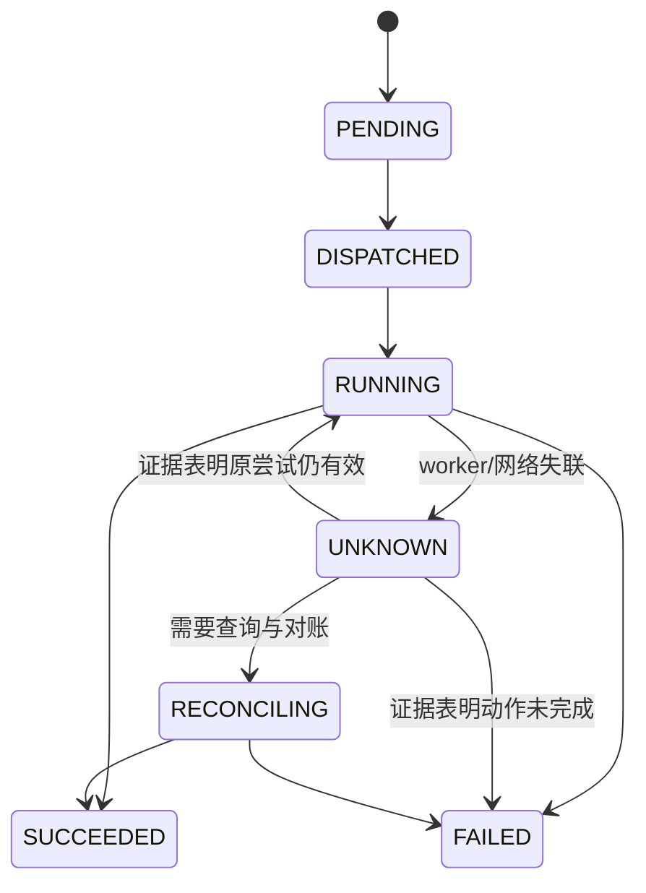

# Agent 控制面分布式专题：让重复与中断变成可恢复状态

部分失败、线性一致性和 CAP 见共享册的[分布式系统起点](../../rust-hft/distributed/distributed_systems_intro.html)，复制、法定人数（quorum）和 Raft 见[复制与共识](../../rust-hft/distributed/replication_consensus.html)。Agent 平台新增的问题是：**当任务持续很久、工具会产生副作用、worker 随时可能消失时，怎样把不确定结果收进可恢复的协议？**

可以把控制面想成机场塔台。塔台不亲自开飞机，却要知道每架飞机属于哪个航班、谁获准使用跑道、通信中断后怎样重新确认，旧指令为什么不能在恢复后继续生效。

首先分清 Task、Attempt、Operation 和 Resource，把副作用超时表示成 `UNKNOWN`，再用幂等、状态机、lease 和资源端 fencing 收口。**Outbox** 是把“业务更新”和“待发事件”写进同一数据库事务，**Saga** 是把长事务拆成步骤与可能失败的补偿动作，**reconciliation** 是根据事实源周期性对账；“exactly-once”若没有下游协议配合，并不自动表示一个业务效果只发生一次。

## 1. 先把四类身份分开

一个“帮我修改仓库并运行测试”的请求，至少包含四类对象：

| 对象 | 含义 | 为什么不能合并 |
|---|---|---|
| Task | 用户想完成的逻辑任务 | 多次重试仍是同一个目标 |
| Attempt | Task 的一次执行尝试 | 不同 worker 或恢复过程要分别归因 |
| Operation | 一次有副作用的工具动作 | 要独立去重、查询和审计 |
| Resource | 沙箱、卷、制品等实际对象 | 生命周期可能长于某次 Attempt |

如果四者都只使用一个 `run_id`，平台很难回答：“这是同一次逻辑操作的重试，还是用户真的要求再创建一份？”

一个最小关联链可以是：

```text
task_id
  └─ attempt_id
       ├─ sandbox_id
       ├─ operation_id
       └─ artifact_id / volume_id
```

这些 ID 要进入状态库、队列消息、工具请求、日志和 trace，恢复时才能对账。

## 2. 副作用工具先分类，再决定能否重试

重试策略不能只看 HTTP 状态码，还要看动作语义：

| 动作 | 例子 | 重试前先问什么 |
|---|---|---|
| 纯读取 | 查询编译状态 | 读的是哪个快照？是否触发昂贵计算？ |
| 条件覆盖 | 把配置从 v7 更新到 v8 | 当前版本仍是 v7 吗？ |
| 追加 | 发布消息、追加日志 | 重复记录能否按稳定键去重？ |
| 创建资源 | 创建卷或沙箱 | 上次是否已经创建，只是响应丢失？ |
| 不可逆动作 | 付款、发布、删除生产数据 | 是否需要审批、查询或人工接管？ |

`timeout` 只表示调用方没有及时得到答案。对于副作用动作，超时后的正确初始状态通常是 `UNKNOWN`，不是未经证据的 `FAILED`。

## 3. 一个可恢复的工具调用协议

以“创建工作卷”为例，平台可以先保存操作意图：

```text
operation_id: op-42
intent_hash: hash(create_volume, task-7, 20GiB)
state: PENDING
attempt: 1
```

然后按以下流程执行：

1. 调用方为同一逻辑意图复用稳定 `operation_id`。
2. 服务端原子地检查 ID 和规范化后的 `intent_hash`：第一次创建记录；ID 与摘要都相同才返回已有状态或结果；同一 ID 携带不同参数时返回冲突。
3. 调用成功后保存资源 ID、结果摘要和完成时间。
4. 调用超时则进入 `UNKNOWN`，先按 `operation_id` 查询，不立刻创建第二份。
5. 只有协议能证明未发生，或动作天然可重复时，才进入下一次尝试。

如果服务端只记录“见过这个 ID”，却没有把记录和真正的业务更新放在同一原子边界，崩溃仍可能落在两者之间。幂等键缩小不确定窗口，但不会自动让第三方系统获得事务能力。

## 4. 数据库、消息与外部动作的缝隙

“先更新数据库，再发送队列消息”会遇到数据库成功、消息未发的窗口；反过来又会遇到消息已发、数据库回滚的窗口。

Transactional Outbox 的应用方式是：

```text
同一数据库事务：
  更新 task/attempt 状态
  + 插入待发布 outbox 事件

事务提交后：
  发布器至少一次发送事件
  消费者在同一本地事务中记录 event_id 并更新业务状态
```

Outbox 让数据库成为可恢复的事实来源，但不是端到端 exactly-once：发布器仍可能重复发送；消费者的去重记录要与本地业务更新共享一个原子事务。若消费动作还会调用外部系统，下游仍需幂等键、结果查询与对账。

对于无法纳入数据库事务的外部动作，可组合使用：

- 状态查询接口；
- 条件写或版本号；
- Saga 补偿；
- 人工审批和人工接管；
- 周期性 reconciliation（对账）。

补偿是新的业务动作，不是时间倒流。已经发送的邮件、已被读取的制品或已发布的版本，可能无法真正“撤回”。

## 5. 工作流状态必须表达“不知道”

长任务不能只有 `RUNNING/SUCCEEDED/FAILED` 三个状态。一个教学状态机是：



每次转换至少带：旧状态条件、状态版本、操作者、原因、时间、`active_attempt_id` 和 fencing epoch。使用类似“只有状态仍为 `RUNNING`、版本为 12、当前 Attempt 与 epoch 都匹配，才能改成 `SUCCEEDED`”的条件更新，可以阻止迟到旧 worker 先读取新版本、再覆盖新结论。

Checkpoint 也要记录工作流进度，而不只是对话文本。恢复时应能判断哪些步骤只需重算、哪些工具必须查询、哪些副作用不能重复。

## 6. Lease 决定暂时所有权，fencing 阻止旧主人

调度器可以给 worker 一段有期限的 lease。worker 周期续租；控制面长时间收不到续租后，可以安排新 Attempt。

困难在于旧 worker 未必真的停止：它可能只是网络分区或长时间暂停。若它恢复后仍能写共享卷，就会出现两个“主人”。

因此每次新授权都携带单调递增的 fencing token：

```text
Attempt A 获得 epoch 41
控制面重新调度 Attempt B，获得 epoch 42
资源端记录当前 epoch = 42
A 的 epoch 41 写入 → 拒绝
B 的 epoch 42 写入 → 接受
```

关键是**资源端必须检查 token**。资源端要在一个原子边界内比较已持久化的高水位、推进高水位并执行写入；只在调度器里记录 epoch，却让存储接受旧写，没有真正完成 fencing。

## 7. 队列重复、乱序与迟到结果

Agent 控制面通常允许队列至少一次投递，因此消费者要预期：

- 同一消息重复出现；
- Attempt 2 的消息先于 Attempt 1 的迟到结果；
- worker 完成后确认消息丢失；
- 一条坏消息反复失败形成 poison message；
- 租户突发占满公共消费能力。

处理时可使用 `event_id` 去重、状态版本条件更新、每租户公平队列、有限重试和 dead-letter 流程。Dead-letter 不是垃圾桶：需要记录失败原因、重放条件和人工处置责任。

<details>
<summary><strong>深入：分片再平衡与跨存储容灾对账</strong></summary>

## 8. 分片从访问模式出发

平台可能按 `task_id`、`tenant_id`、节点或时间查询状态。没有一个分片键同时完美满足所有路径：

- 按 `tenant_id` 便于配额和隔离，但超大租户会形成热点；
- 按随机 `task_id` 分布较均匀，但租户列表查询可能跨分片；
- 按时间便于归档，突发的新任务却会集中到最新分片；
- 热门基础镜像、仓库或共享卷还会形成与主键无关的热点。

再平衡期间要版本化路由。旧 owner 停止写入后，新 owner 追赶增量并达到切换条件，控制面再发布新路由；迟到请求仍由 fencing 拒绝。不要把“复制完文件”当作完成迁移。

## 9. 容灾恢复是一场跨存储对账

先定义两个目标：

- RPO：故障后最多允许回退到多久以前的恢复点，也就是可接受的数据丢失窗口；
- RTO：最多允许多长时间恢复服务。

恢复不能只确认控制面数据库能启动。还要核对：

1. 数据库中的 Task/Attempt 指向哪些卷和制品？
2. 对象存储中有哪些完成但尚未发布引用的孤儿对象？
3. 哪些沙箱仍在运行，但它们的 lease 已经过期？
4. 恢复点之后发出的外部工具动作怎样确认结果？
5. 秘密和身份是否已轮换？新的 fencing generation 是否严格大于灾前所有可能签发值？

fencing 不能跟着一份旧数据库备份一起回退。可以使用不可回滚的高水位，或把 token 表示为 `(recovery_generation, epoch)`；资源端保存的最大 generation/token 同样不能静默回退。若恢复系统无法证明新 token 大于所有旧 token，就必须先隔离旧故障域或更换资源身份，不能直接恢复写流量。

容灾演练要在隔离环境验证恢复后的业务不变量，而不只是“备份文件能够解压”。恢复脚本、权限、依赖和操作手册也要随版本演练。

</details>

## 10. 一条典型失败路径

执行器调用“创建共享卷”后超时，自动用新 ID 重试。第一次其实已经成功，只是回包丢失；第二次又创建一块卷。计算节点挂载第一块，清理器只认识第二块，最后形成泄漏和误删风险。

修复链路是：同一逻辑意图使用稳定 `operation_id`；资源服务保存去重结果；超时进入 `UNKNOWN` 并查询；挂载和清理携带 generation/fencing；孤儿扫描器负责最终对账，而不是充当主要正确性协议。

## 11. 章末面试问题

**题目：怎样保证一个有副作用的 Agent 工具不会因为重试而重复生效？**

**30 秒答法：**网络超时只能得到未知结果，不能直接证明操作失败。我会先按副作用分类，为一个逻辑意图生成稳定 operation ID；服务端把 ID、意图和结果与业务更新放进尽可能相同的原子边界，重复请求返回旧结果。跨外部系统时进入 UNKNOWN，先查询和对账，再使用条件写、Outbox、Saga 或审批处理。长任务由版本化状态机恢复，执行所有权用 lease，资源端用单调 fencing token 拒绝旧 worker。

常见追问：

1. 数据库提交后、队列消息发送前崩溃怎么办？
2. 为什么幂等键仍不能自动解决第三方付款？
3. 取消与完成同时到达，状态机怎样决定谁赢？
4. 新 worker 接管后，怎样阻止旧 worker 写共享卷？
5. 数据库恢复到旧时间点后，怎样与对象存储和运行中沙箱对账？

## 12. 本章速记

- Task、Attempt、Operation 和 Resource 使用不同身份，恢复时才能正确对账。
- 副作用超时先进入 `UNKNOWN`；是否重试取决于操作语义和证据。
- 幂等键必须尽量与业务更新共享原子边界；Outbox 消除一类双写缝隙，但消费者仍需去重。
- 工作流状态机要有版本和条件更新，迟到结果不能覆盖新状态。
- Lease 给临时所有权，资源端 fencing 才能真正拒绝旧主人。
- 分片按访问模式选择；再平衡与容灾都需要版本、对账和演练。

## 一手资料

- [共享基础：时间、一致性与 CAP](../../rust-hft/distributed/distributed_systems_intro.html)
- [共享基础：复制、Quorum 与共识](../../rust-hft/distributed/replication_consensus.html)
- [Raft 原始论文](https://raft.github.io/raft.pdf)
- [The Chubby Lock Service：lease、锁服务与故障处理](https://research.google/pubs/the-chubby-lock-service-for-loosely-coupled-distributed-systems/)
- [Dynamo 原始论文：分片、复制与故障取舍](https://www.allthingsdistributed.com/files/amazon-dynamo-sosp2007.pdf)
- [Sagas 原始论文：长事务与补偿](https://www.cs.cornell.edu/andru/cs711/2002fa/reading/sagas.pdf)
