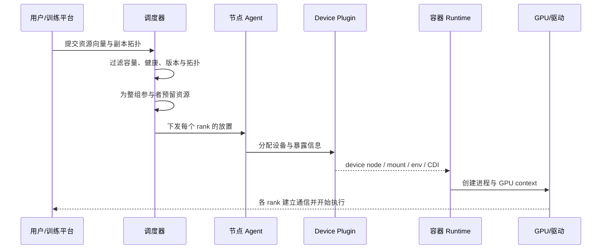
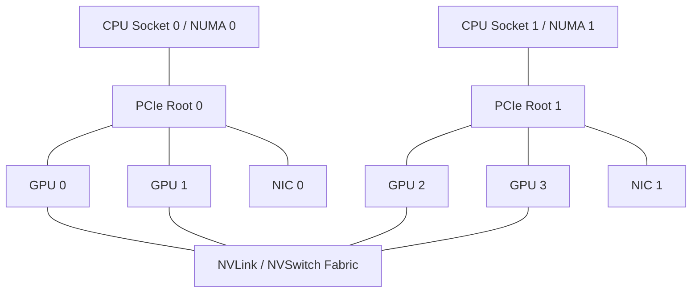
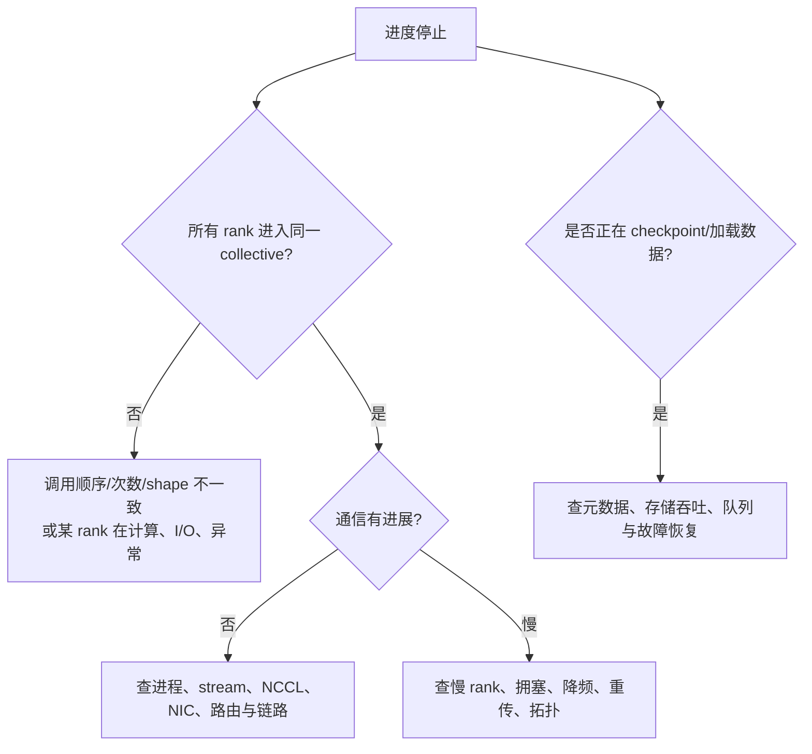

# GPU 集群：拓扑调度、健康检查与卡死排障

一台机器有 8 张 GPU，不等于任意 8 张 GPU 组成的任务都具有相同通信性能；集群总共有 1,000 张空闲卡，也不等于一个需要 64 张卡同时启动的作业一定能被放下。GPU 集群首先是一个多资源、带拓扑、需要成组分配并会部分失败的分布式系统。

本章从一项训练或推理作业怎样获得设备讲起，再解释拓扑、gang scheduling（成组调度）、健康状态、慢卡、通信卡死和恢复。集合通信与 RDMA 的数据路径见[GPU 集合通信与 RDMA](../llm/gpu_collectives_rdma.md)，训练进程组、Checkpoint 与 reshard 见[分布式训练系统](../llm/distributed_training_systems.md)，通用调度、租约和控制面见[沙箱生命周期与调度](../runtime/lifecycle_and_scheduling.md)。

## 1. GPU 为什么不是普通的“8 个 CPU 核”

GPU 任务常同时需要：

- 特定型号、显存容量与计算能力的 GPU；
- 足够的 CPU、主存、Huge Page（大页）或 pinned memory（页锁定内存）；
- 同一 NUMA 节点附近的 CPU、GPU 与高速 NIC；
- 节点内 NVLink/NVSwitch 拓扑；
- 节点间 InfiniBand 或 RoCE 网络；
- 本地 NVMe、共享数据集和 Checkpoint 带宽；
- 一组参与者在相近时间共同启动。

因此资源请求更像一个向量：

```text
(GPU型号, GPU数, 每卡显存, CPU, 主存, 本地盘, NIC, 拓扑, 软件版本)
```

只用“空闲 GPU 数量”做调度，会忽略其余维度并制造碎片。

## 2. 从提交作业到 Kernel 运行



Kubernetes 的 device plugin（设备插件）框架允许厂商组件向 kubelet 报告 GPU、NIC 等扩展资源，并在分配时把设备节点、挂载或 CDI（Container Device Interface，容器设备接口）信息交给容器。它解决“设备怎样被发现和交给容器”，不自动解决训练作业的全局拓扑、通信性能和故障恢复。

## 3. 拓扑决定谁离谁近

典型服务器中存在多层连接：



- **PCIe**连接 CPU、GPU、NIC 等设备；不同 PCIe root 之间可能要跨 CPU 互连；
- **NVLink/NVSwitch**提供 GPU 之间的高速连接，但具体带宽和连通关系依机器；
- **NUMA**表示 CPU 与主存访问不是等距离；
- **RNIC**是支持 RDMA 的网卡，GPU 与其 PCIe 距离会影响跨节点路径。

“同一节点”只是粗粒度条件。拓扑感知调度还要尽量让 CPU、内存、GPU 和 NIC 落在兼容的 NUMA/PCIe 域，并让频繁通信的 rank 使用更近的链接。Kubernetes Topology Manager 的作用是汇总 CPU、内存和设备管理组件给出的 NUMA hint，再按策略决定接受、拒绝或尽力对齐；它不是自动找到所有分布式训练最优映射的全局求解器。

## 4. 为什么需要 gang scheduling

假设一个作业需要 8 个 worker，每个 worker 需要 8 张 GPU。若调度器先启动了 7 个 worker，却永远找不到最后 8 张满足拓扑的 GPU：

- 已启动的 56 张卡可能一直等待；
- 它们占住的资源又阻止其他作业启动；
- 超时重试可能复制预留，进一步恶化碎片。

**Gang scheduling（成组调度）**要求一组任务达到最小可运行规模后再一起进入运行。实现上通常经历 `Pending → Reserved → Starting → Running`，预留带过期时间，并在任一成员失败时释放或按明确策略降级。

成组调度不等于所有进程在同一个纳秒启动。它保证的是资源与参与者集合满足协议，而进程建立通信仍需 rendezvous（会合）和超时处理。

## 5. 拓扑与容灾为什么会冲突

把同一服务的副本放在相邻 GPU 上，可能获得更好通信；把它们分散到不同机架或供电域，则能减少共同故障。调度器需要区分：

- **并行组内部**：常希望连接更近；
- **可替代副本之间**：常希望跨故障域分散；
- **数据与 Checkpoint 副本**：不能与计算作业共享同一单点故障；
- **在线服务**：还要考虑流量入口、模型加载和冷启动。

因此“亲和”与“反亲和”应作用于不同关系，不能写一句“尽量放一起”结束。Kubernetes topology spread constraints（拓扑分布约束）可以按 zone、node 或自定义故障域控制副本分散，但标签、选择器和 `maxSkew` 必须与实际故障模型一致。

## 6. GPU 健康不是一个布尔值

节点可能处于：

| 状态 | 含义 | 常见动作 |
|---|---|---|
| Ready | 软件与被动指标正常，可接任务 | 正常调度 |
| Suspect | 出现错误、降频或性能异常，证据不足 | 停止新任务，保留现场 |
| Draining | 不再接新任务，等待或迁移现有任务 | 有界等待后终止 |
| Quarantined | 隔离，运行主动诊断 | 不参与调度 |
| Repairing | 驱动、固件、硬件或网络处理中 | 记录操作与版本 |
| Validating | 修复后进行分层验证 | 通过才返回 Ready |

**被动健康监控**观察工作负载运行时的温度、功耗、ECC、PCIe、NVLink、驱动等事件；**主动诊断**让设备运行专门测试。前者没有告警不等于设备一定能通过压力测试，后者也会占用设备，不能在未知影响下直接与生产任务并行。

NVIDIA DCGM（Data Center GPU Manager）提供设备清单、遥测、健康、诊断和作业统计等接口。它是证据来源之一，不是自动修复器，也不能替代调度器的状态机与厂商离线诊断。

## 7. Xid、ECC 与降频分别说明什么

- **Xid**是 NVIDIA 驱动写入内核日志的 GPU 错误报告。一个编号是排查起点，不总能单独确定根因；应用非法访问、驱动、PCIe 或硬件问题都可能产生相关错误。
- **ECC**用于检测或纠正存储位错误。可纠正错误增长与不可纠正错误的严重性不同，处理规则应依据硬件与厂商文档。
- **降频（throttling）**可能来自温度、功耗、可靠性策略或配置。GPU 仍在计算，却可能成为同步作业中的慢 rank。
- **链路错误**可能影响 PCIe、NVLink、NVSwitch 或 RNIC，不能只看 GPU 核心利用率。

错误处理策略要绑定错误类别、影响中的作业、设备代次和验证流程。看到任意 Xid 就整机重启，可能丢失诊断现场；看到作业还能跑就忽略不可纠正错误，也可能扩大损坏。

## 8. 为什么“一张慢卡”会拖慢全部卡

同步训练每一步常包含 collective（集合通信）。假设 63 个 rank 的计算用 90 ms，另一个 rank 因降频用 160 ms，那么其他 rank 到达 All-Reduce 后要等待它：

```text
理想每步：90 ms 计算 + 30 ms 通信 = 120 ms
慢卡每步：160 ms 计算 + 30 ms 通信 = 190 ms
吞吐损失约：1 - 120/190 ≈ 36.8%
```

集群平均 GPU 利用率可能仍然很高，但快卡的一部分“忙”是在通信 Kernel 或等待中。要按 rank 对齐同一步骤的 dataloader、forward、backward、collective 和 Checkpoint 时间，寻找最早开始偏离的 rank。

## 9. “训练卡死”先区分四类等待



四类常见原因是：

1. **程序顺序不一致**：某个 rank 少调用或多调用一次 collective；
2. **参与者消失**：进程崩溃、OOM、节点断联或设备错误；
3. **通信路径异常**：NIC、链路、拥塞、配置或异步错误；
4. **通信前已变慢**：数据加载、计算、同步或 Checkpoint 让某个 rank 迟到。

仅把 collective timeout 调大，只会延后发现前三类问题；若本来只是可接受的大 Checkpoint，则过短 timeout 才是配置错误。需要先找到最后一次全体一致进度和每个 rank 当前栈/stream 状态。

## 10. Checkpoint、重试与失败域

大作业失败后从头重跑代价很高，因此要周期性 Checkpoint。间隔存在取舍：

- 太频繁：大量写入挤占训练、网络和存储；
- 太稀疏：故障后重算时间长；
- 同时落盘：形成 checkpoint burst（检查点突发），压垮元数据或共享带宽；
- 状态不完整：恢复后优化器、随机数、数据位置或并行分片不一致。

重启还要考虑资源是否仍按同一 mesh 分配。若 GPU 数或拓扑变化，Checkpoint 是否支持 reshard（重新分片）必须由格式和框架明确保证，不能假定每份 shard 能随意放到任意世界大小。

## 11. 软件版本也是资源约束

训练进程依赖驱动、CUDA runtime、通信库、框架、Kernel、固件和 NIC 软件。版本组合不兼容可能只在特定 collective、shape 或长时间运行后出现。

集群应保存：

- 节点硬件和拓扑清单；
- 驱动、固件、容器镜像与库版本；
- 作业代码、配置和通信环境；
- 调度放置、rank 映射和失败时间线；
- 升级批次与兼容矩阵。

发布时先在代表性拓扑做通信、计算、存储和故障恢复测试，再小批节点上线。不能只验证“容器能 import torch”。

## 12. 一个容量与碎片算例

集群有 10 台机器，每台 8 张 GPU，共 80 张。当前每台空闲 GPU 数为：

```text
[4, 4, 4, 4, 4, 4, 4, 4, 4, 4]
```

总空闲 40 张，但一个要求“4 台完整 8-GPU 节点”的 32-GPU 作业一台也选不出来。问题不是总量不足，而是**节点级碎片**。

若作业允许每节点使用 4 张，理论上可放；但还需检查每组 4 张是否处于期望 NVLink/PCIe/NIC 拓扑，以及剩余资源会不会形成更糟碎片。调度容量报告至少同时显示：总空闲、按节点连续可分配组、按拓扑可分配组和等待队列中的需求分布。

## 13. 做题方法：把资源、拓扑、时间和故障域放进同一张图

1. **列资源向量**：GPU 型号/数/显存、CPU、主存、NIC、盘和软件版本；不要只加总 GPU。
2. **画拓扑**：rank→GPU→PCIe/NVLink→NIC→交换网络，标 NUMA 和故障域。
3. **推演状态机**：Pending、Reserved、Starting、Running、Draining、Quarantined；说明超时由谁释放资源。
4. **对齐时间线**：逐 rank 比较数据、计算、collective、Checkpoint，找第一个偏离者而非只看平均。
5. **区分健康证据**：被动遥测、内核/驱动错误、主动诊断和应用复现回答不同问题。
6. **验算恢复**：Checkpoint 是否完整、能否换世界大小、旧进程是否退出、坏节点是否隔离、重试是否放大负载。

## 14. 章末问题

1. 为什么有足够总 GPU 数，作业仍可能无法调度？
2. Device plugin 解决什么，不解决什么？
3. gang scheduling 为什么需要预留过期与统一释放？
4. 为什么并行组内部亲和、服务副本之间却可能反亲和？
5. Xid 能否单独证明 GPU 硬件损坏？
6. 被动健康监控与主动诊断有什么区别？
7. 64 卡作业中一张卡每步慢 70 ms，为什么可能拖慢全部卡？
8. 一个作业在 All-Reduce 附近卡住，你按什么顺序收集证据？
9. 80 张 GPU 空闲 40 张，为什么仍放不下一个需要 4 台完整 8 卡节点的作业？

## 15. 参考答案与解答

<details>
<summary>展开答案</summary>

1. GPU 还受节点边界、型号、显存、NUMA/PCIe/NVLink/NIC 拓扑、CPU/主存、健康和软件版本约束；成组作业需要一批兼容资源同时可用。总数够可能分散在无法组合的节点或链路上，这叫碎片。
2. Device plugin 向 kubelet 报告扩展设备，并在容器分配时提供 device node、挂载、环境或 CDI 信息。它不自动完成跨节点 gang scheduling、最优 rank 拓扑、网络拥塞控制、训练重启或健康状态机。
3. 若只预留部分成员，作业可能永远等不到最小规模并占住资源。预留需要事务式集合或可回滚协议、唯一操作 ID 和截止时间；任一成员失败或过期时，控制面按同一份预留记录释放整组。新的启动使用更高的执行代次，迟到的旧启动因代次不匹配而不能重新占用资源。
4. 一个张量并行或集合通信组希望链路近，减少通信成本；两个可替代服务副本若放在同一节点、机架或供电域，会同时故障。两种关系的目标不同，应使用不同的亲和/分散约束。
5. 不能。Xid 是驱动报告的错误线索，可能来自应用非法访问、驱动、链路或硬件。应结合编号解释、同时间应用/内核日志、ECC/链路指标、复现、主动诊断和换节点/换工作负载消融判断。
6. 被动监控在正常作业期间读取遥测与已发生事件，扰动较小但不能主动证明设备能承受目标负载；主动诊断运行专门测试，证据更直接却占用设备并可能影响现有任务。两者都应进入节点隔离—验证—恢复流程。
7. 同步步骤以最慢参与者为准。其余 63 个 rank 即使早完成计算，也要在 collective 等待慢卡；每步额外 70 ms 会反复累积。应逐 rank 对齐阶段时间，确认慢发生在数据、计算还是通信，再看降频、错误和拓扑。
8. 先找最后一次全体完成的 step/collective；确认各 rank 是否调用相同 collective、count、dtype 和顺序；检查进程存活、OOM/Xid/栈和 CUDA stream；再看 NCCL 异步错误、NIC/端口/链路/拥塞与拓扑；若通信有进展但慢，按 rank 对比到达时间。保存版本、放置和时间线后再做最小复现，不能先无限增大 timeout。
9. 每台只空闲 4 张，没有任何一台能提供完整 8 张，所以节点级硬约束不满足。总空闲 `10×4=40` 只反映聚合容量，不反映连续可分配组。若不能跨节点拆每个 8 卡组，这个 32 卡作业可调度容量就是 0。

</details>

## 16. 本章小结

- GPU 作业请求的是多维资源和拓扑，不是一个可随意相加的卡数。
- Device plugin 暴露设备；全局调度仍要处理成组启动、碎片、拓扑和故障域。
- GPU、CPU、内存、NIC 与 PCIe/NVLink 的相对位置会改变通信路径。
- 健康管理是 Ready、隔离、诊断、修复和验证的状态机。
- 同步作业的速度由慢 rank 决定，平均利用率会掩盖问题。
- 卡死排障先核对 collective 顺序与参与者，再查计算、通信、存储和硬件证据。
- Checkpoint 必须同时考虑完整状态、写入突发、恢复和重新分片。

## 一手资料

- [DeepSeek 官方招聘](https://talent.deepseek.com/)：超算集群、训练/推理框架和 AI 平台岗位公开职责。
- [Kubernetes Device Plugins](https://kubernetes.io/docs/concepts/extend-kubernetes/compute-storage-net/device-plugins/)：扩展设备发现与容器分配接口。
- [Kubernetes Topology Manager](https://kubernetes.io/docs/tasks/administer-cluster/topology-manager/)：CPU、内存与设备 NUMA hint 协调机制。
- [Kubernetes Pod Topology Spread Constraints](https://kubernetes.io/docs/concepts/scheduling-eviction/topology-spread-constraints/)：跨故障域分散的声明语义。
- [NVIDIA DCGM](https://docs.nvidia.com/datacenter/dcgm/latest/learn/index.html)：GPU 清单、遥测、健康、诊断与作业统计。
- [NVIDIA Xid Errors](https://docs.nvidia.com/deploy/xid-errors/introduction.html)：驱动错误报告的含义与诊断边界。
- [NVIDIA GPU Operator](https://docs.nvidia.com/datacenter/cloud-native/gpu-operator/latest/)：GPU 驱动、容器运行时、device plugin 与监控组件的生命周期案例。
