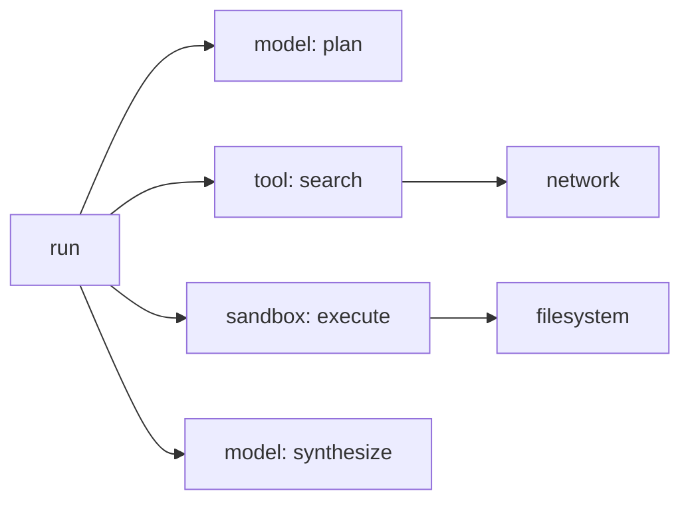

# Agent 可观测性：从“答案错了”追到具体一步

可观测性像飞机黑匣子：不是把所有声音无限录下来，而是让调查者能还原“哪一步发生了什么、当时系统处于什么版本、为何采取这个动作”。Agent 最终答案只是最后一帧。

先认五个词：**span** 是 trace 中一段有起止时间的工作，多个父子 span 串成一次请求；**SLI（Service Level Indicator，服务水平指标）**是实际测量的服务指标；**p99（第 99 百分位数）**表示约 99% 的样本不超过该值，常用来观察少数慢请求；**label** 是指标的分类维度，取值几乎无限就叫高基数；**sampling（采样）**是在成本有限时只保留部分 trace。

## 1. 四类信号各做什么

| 信号 | 适合回答 | Agent 例子 |
|---|---|---|
| Metric | 系统整体是否异常 | 成功率、p99、队列年龄、Token/s |
| Log | 某个离散事件是什么 | 调度拒绝、策略拒绝、工具错误码 |
| Trace | 一次请求时间花在哪里 | 模型、检索、工具、沙箱、存储跨度 |
| Profile | CPU/内存具体耗在哪里 | 序列化、拷贝、锁、分配热点 |

四者应通过 `trace_id`、`run_id`、`step_id`、`tool_call_id` 和版本关联。只在日志中搜索用户问题文本既慢又会泄露隐私。

## 2. 一条 Agent Trace

span 至少记录开始/结束、父子关系、状态、组件版本和资源用量。模型 span 可记录模型标识、输入/输出 Token 数、缓存命中和首 Token 延迟；工具 span 记录工具版本、参数 schema 版本、重试和结果类别；沙箱 span 记录 runtime class、节点、镜像 digest、启动阶段和退出原因。

原始 Prompt、源码、工具输出和推理内容可能敏感，默认不应全部进入遥测。需要内容采样时，应经过分级、脱敏、权限、加密和保留期控制。

## 3. SLI 分层

### 用户结果层

- 任务完成率、正确率或 verifier 通过率。
- 用户取消率、人工接管率、错误副作用数。
- 总延迟、成本和结果新鲜度。

### Agent 行为层

- 平均/分位 step 数、工具选择准确率、无效循环率。
- 工具成功、超时、重试、拒绝与参数校验失败。
- Context 截断、检索命中、引用支持率。

### 模型与推理层

- TTFT（Time to First Token，首 Token 时间）、TPOT（Time per Output Token，后续每个输出 Token 的平均时间）、吞吐、KV Cache（键值缓存）命中。
- 输入/输出 Token、排队、prefill/decode 时间、模型错误码。

### 平台层

- 准入与排队时间、沙箱启动、节点/卷/网络失败、资源利用率。
- 控制面收敛、心跳丢失、孤儿资源和策略下发延迟。

一个总成功率掩盖不了分层原因。模型正确但工具超时，和工具正确但模型误解结果，需要不同团队处理。

## 4. 数字化延迟分解

某次任务总耗时 12.0 s：排队 1.5 s，沙箱启动 2.0 s，首次模型调用 3.0 s，三个工具共 4.0 s，最终模型 1.0 s，其他 0.5 s。

若只把模型加速 20%，理论最多节省 `(3+1)×20%=0.8 s`，总延迟降约 6.7%。若沙箱快照把启动从 2.0 s 降到 0.4 s，则节省 1.6 s；但若任务经常复用已启动环境，收益又不同。Trace 让优化按真实占比排序。

## 5. 高基数与成本

`run_id` 适合 trace/log 字段，不适合直接做 Prometheus label；每个 run 一个时序会让存储爆炸。指标按租户等级、区域、runtime class、模型、工具类别和错误类别做有界聚合，单次 run 下钻交给 trace。

动态错误文本也不应作为 label。先映射稳定 error code，再把详细信息放日志，并限制大小。

<strong>深入：采样策略与 OpenTelemetry 字段边界</strong>

## 6. 采样不能只留成功快请求

- head sampling 在请求开始时决定，成本可控但不知道最后是否失败。
- tail sampling 看完 trace 再决定，可优先保留错误和长尾，但 collector 成本更高。
- 规则可组合：错误全留、p99 候选高比例、普通成功低比例、涉及敏感工具按审计策略保留元数据。

评测 trace 与生产 trace 还要区分，避免测试数据与真实用户数据混入同一权限域。

## 7. OpenTelemetry 与变化中的语义

OpenTelemetry 提供 trace、metric、log 的通用模型，并已维护生成式 AI 相关语义约定。Agent 领域仍快速变化，工程上应在内部建一层稳定 schema 与映射，不要让业务代码散落大量会变化的属性名。

采用标准能改善跨组件关联，但标准不会自动定义你的 `run`、业务成功或安全审批语义。

## 8. 典型失败路径

团队为排查质量问题默认记录完整 Prompt 和工具输出。某个工具输出包含短期凭证，trace 被复制到权限更宽的分析集群并保留半年。观测系统反而成为最大的数据泄露面。

修复包括：默认元数据优先；内容字段显式 opt-in；源端脱敏；秘密模式与大小限制；独立权限和密钥；短保留期；访问审计；事故后能按 trace 和数据主体删除。

## 9. 章末面试问题

**题目：Agent 成功率下降 5%，你如何定位？**

**30 秒答法：**先按模型、Harness、工具、沙箱、区域和版本切片，确认是业务正确性还是基础设施可用性。用 run trace 把失败分到规划、检索、模型、参数校验、工具、网络、存储和 verifier；再比较发布前后及正常对照组。平台同时看队列、启动、TTFT/TPOT、工具错误与节点资源。若有明确版本相关性先止血回滚，再用保留的失败 trace 做确定性重放。内容遥测最小化并脱敏，避免排障制造新风险。

可能追问：

1. 哪些字段放 metric label，哪些放 trace？
2. 怎样观测模型非确定性，而不把每次差异都当故障？
3. tail sampling 的代价是什么？collector 挂了能否影响业务？
4. 如何从一个慢工具调用追到宿主机 I/O？

## 10. 本章速记

- Metric 看群体，trace 看单次链路，log 看事件，profile 看资源热点。
- 用户、Agent、模型、平台四层 SLI 要分开。
- 优化前先做延迟分解，不要只盯模型。
- 高基数 ID 放 trace，不直接做无限 label。
- 遥测内容本身是敏感资产。

## 一手资料

- [OpenTelemetry Trace 规范](https://opentelemetry.io/docs/concepts/signals/traces/)
- [OpenTelemetry GenAI 属性注册表](https://opentelemetry.io/docs/specs/semconv/registry/attributes/gen-ai/)
- [Google SRE Monitoring Distributed Systems](https://sre.google/sre-book/monitoring-distributed-systems/)
