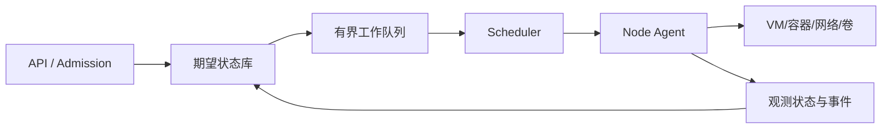

# 控制面与数据面：用期望状态管理成千上万个沙箱

控制面保存期望状态并协调调度、节点、策略和资源；数据面执行这些决定。条件更新、超时不确定性、复制、共识和 fencing 的通用机制见共享册的[分布式系统基础](../../rust-hft/distributed/index.html)，这里说明 Agent 控制面怎样组合它们。

控制面像城市规划与调度中心，数据面像真实道路、车辆和建筑。规划中心告诉系统“这里应该有一个沙箱”，节点运行时才真正创建进程、网络和卷。把两者混在一个同步 RPC（Remote Procedure Call，远程过程调用）里，任何慢启动都会拖垮入口。

先认五个关键词：**期望状态**是用户希望系统最终达到什么，**观测状态**是节点现在实际上怎样；**reconciler（协调器）**反复比较两者，用可重试的小动作推动收敛；**idempotency key（幂等键）**让同一逻辑创建请求重复到达时仍只得到一个对象；**generation** 是期望配置的版本代数；**canary（小流量灰度）**先在少量节点验证新版本，**orphan（孤儿资源）**则是已经存在但控制面没有正确归属的 VM、卷或 IP。API（Application Programming Interface，应用程序接口）是调用者提交和查询这些对象的入口。安全策略 **fail closed** 表示遇到缺失或未知值时拒绝，而不是猜测为允许。它们都服务于同一个目标：控制面重试、升级或短暂失联时，系统仍能收敛而不是重复创建和越权。

## 1. 核心模式：期望状态与观测状态

用户提交：

```json
{
  "run_id": "r-123",
  "runtime_class": "strong-isolation",
  "resources": {"cpu": 2, "memory_mib": 4096},
  "image_digest": "sha256:...",
  "deadline_s": 600
}
```

数据库记录期望状态 `Running`，节点持续报告实际状态 `PullingImage`、`Starting` 或 `Running`。reconciler 比较两者并采取小步、幂等动作，直到收敛或进入明确失败状态。



## 2. 为什么要异步

镜像拉取可能 5 秒，VM 启动可能失败，节点可能重启。API 若一直等待“完全就绪”，会占用连接、难以取消，也让客户端超时后不知道请求是否生效。

更稳的接口是：创建请求携带 idempotency key，服务快速返回 run ID；客户端查询状态或订阅事件。重复提交相同 key 返回同一 run，而不是多创建一个有副作用的环境。

## 3. 控制面不变量

把系统正确性写成可测试句子：

1. 资源服务只接受当前 `(run_id, generation, fencing_epoch)` 的提交；租约过期或网络分区时，不能只靠“控制面认为旧 worker 已停止”保护写入。
2. 任何数据面资源都能追溯到租户和 run。
3. 已终止 run 不再获得新资源。
4. 旧 generation 不能覆盖新 generation 的状态。
5. 删除最终会回收所有资源；暂时失败进入可重试或人工处理队列。
6. 未通过准入的任务不会进入调度队列。

这些不变量比“用了强一致数据库”更接近业务正确性。数据库只能提供原子工具，不能替你定义什么必须原子。

## 4. 事件、快照与版本

只保存最终一行状态，事故时看不到任务为何反复迁移。只保存无限事件，恢复又太慢。常见做法是：关键状态持久化快照，追加不可变事件用于审计与重放；事件有全局或每实体单调序号。

控制面、节点 agent、运行时和 API 会滚动升级。命令与状态必须带 schema/version，节点声明能力；调度器只派发兼容任务。未知字段宜向前兼容，但安全策略的未知值应 fail closed。

## 5. 混合云不是复制一套组件

混合云要先划分“全局决定什么、区域决定什么”：

- 全局：租户、策略、配额、镜像元数据、任务路由。
- 区域：调度、节点租约、数据面资源、快速故障恢复。
- 跨区域：制品复制、审计汇总、灾难恢复与容量借调。

把每个心跳都写入跨区域共识，会把广域网延迟放进快速路径。让各区域完全自治，又会出现全局配额超卖与策略漂移。合理方案通常让快速租约区域化，让全局控制以配额切片和版本化策略协调。

## 6. 一个控制面容量例子

50,000 个运行沙箱每 10 秒上报一次心跳，平均是 5,000 次/s。若每次心跳都触发 3 次数据库写、2 次消息发布，内部操作已达 25,000 次/s，而且节点抖动时会同步突增。

可以采用租约批处理、只在状态变化时持久化详细事件、心跳分片、带抖动周期和分层聚合。但不能为了省写入完全丢掉失联检测依据。

## 7. 控制面高可用

- API 可以无状态水平扩展，但请求去重依赖持久 idempotency 记录。
- scheduler 可分片或主备；同一分片通过租约确定活跃者。
- queue 必须有界并暴露积压年龄，而不只暴露长度。
- 数据库备份必须实际做恢复演练。
- 节点在控制面短暂中断时执行既定任务，但不能无限续租或接收未知命令。

控制面故障时是否“停机保安全”取决于动作。已获授权的纯计算可短暂继续；新网络权限、秘密下发和结果提交可以要求有效租约。

## 8. 典型失败路径

一次控制器发布改变了默认字段，旧节点把缺失的 `network_policy` 解释为 allow-all，新控制面却认为缺失表示 deny-all。滚动升级期间相同任务得到不同安全边界。

修复包括：策略字段显式必填、版本协商、未知或缺失时 fail closed、兼容矩阵、混合版本集成测试，以及先 canary 节点验证数据面真实行为。

## 9. 章末面试问题

**题目：控制面怎样管理数万个不可靠节点与沙箱？**

**30 秒答法：**API 只持久化版本化期望状态并返回 run ID；有界队列、调度器和节点 agent 异步执行，节点持续上报观测状态，reconciler 用幂等动作收敛。执行权由带 generation 的租约和 fencing 保护，重复请求由 idempotency key 去重。快速心跳和调度按区域分片，全局只协调策略、配额与路由。所有状态转移追加审计事件，混合版本靠能力协商和 fail-closed 策略，最后对队列年龄、收敛时间、孤儿资源和错误自动化设 SLO。

可能追问：

1. 数据库写成功、消息发送失败，怎样避免任务丢失？
2. scheduler 脑裂时谁有权派发？
3. 如何发现并回收 orphan VM、卷和 IP？
4. 控制面升级失败怎样回滚，同时不回滚已经创建的数据面资源？

## 10. 本章速记

- API 写期望状态，reconciler 让实际状态逐步收敛。
- 慢资源创建应异步；重试必须配 idempotency key。
- 不变量、generation、租约和 fencing 共同守正确性。
- 快速控制区域化，全局协调配额和策略。
- 混合版本的默认值可能成为安全事故。

## 一手资料

- [Kubernetes API Conventions](https://github.com/kubernetes/community/blob/master/contributors/devel/sig-architecture/api-conventions.md)
- [Kubernetes Lease API](https://kubernetes.io/docs/concepts/architecture/leases/)
- [The Chubby lock service for loosely-coupled distributed systems](https://research.google/pubs/the-chubby-lock-service-for-loosely-coupled-distributed-systems/)
