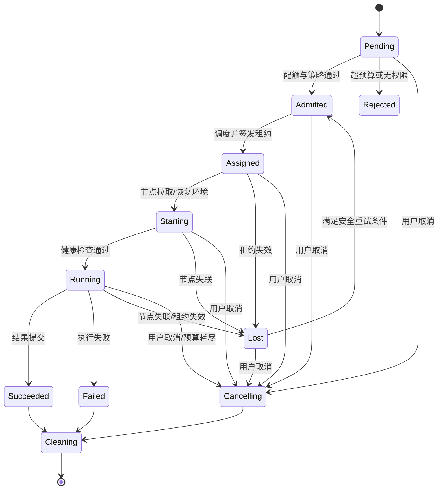

# 沙箱生命周期与调度：把“一次运行”做成可恢复状态机

通用的进程状态和 CPU 调度见系统子书的[进程与文件描述符](../../rust-hft/foundations/processes_fds.html)和[CPU 调度](../../rust-hft/foundations/cpu_scheduling.html)。Agent 平台在这些机制之上还要区分 Task 与 Attempt，并处理沙箱租约、取消传播和节点接管。

调度器不是“找一台 CPU 还空着的机器”。它像机场塔台：要检查机型与跑道是否兼容，安排时隙，处理取消与迫降，还要防止某家航空公司占满所有资源。

先认四组词：**workload class** 是按时长、资源形状和优先级把任务分组；request/limit/usage 分别是“调度时预留多少、运行时最多允许多少、实际用了多少”；**lease（租约）**是有期限的执行权，**epoch** 是每次重新授权递增的代数，**fencing** 是资源端拒绝旧代写入；**oversubscription（超卖）**则是承诺出去的资源多于同时可提供的物理资源。OOM 表示可用内存无法满足需求，系统或 cgroup 必须回收或终止任务。它们解决的是多租户平台中的放置、公平和旧 worker 复活问题，而不是为了给调度算法堆名词。

## 1. 先定义生命周期



每次状态转移都要有：唯一 run ID、期望状态、实际状态、幂等操作、超时、审计事件和负责人。控制面可以重复下发“清理”，节点执行两次也不应误删其他 run 的卷。

## 2. 请求值、上限值与实际用量

- request 是调度器预留资源时相信的估计。
- limit 是运行时强制的安全上限。
- usage 是观测到的真实消耗。

只看 request 会被低报资源的任务挤爆；只按 limit 装箱会浪费大量资源；只看历史平均值又会忽略长尾。实用方案会为不同 workload class 建模，并持续比较 request/usage 偏差。

## 3. 一个容量算例

下面用教学数字演示容量计算。假设有 100 台节点，每台可分配 64 vCPU 和 256 GiB。预留 10% 给系统后，总预算约为：

```text
CPU = 100 × 64 × 0.9 = 5,760 vCPU
内存 = 100 × 256 × 0.9 = 23,040 GiB
```

若平均运行沙箱申请 2 vCPU、4 GiB，只按总量可容纳 `min(5760/2, 23040/4) = 2880` 个。但这仍忽略每节点碎片、镜像盘、网络、启动并发、NUMA、GPU、故障域和 oversubscription 风险。

当到达率为每秒 400 个任务、平均服务时间 30 秒，理论在运行数约 `400 × 30 = 12,000`。这已经远超 2,880 个名义槽位，系统必须排队、扩容、降级或拒绝；“让队列无限长”只会把失败变成超时。

## 4. 调度决策分成过滤与打分

先过滤不能运行的节点：

- CPU、内存、磁盘、设备和运行时是否满足；
- OS、架构、内核能力或镜像是否兼容；
- 安全等级、租户与专用节点策略是否允许；
- 节点是否健康、是否正在下线；
- 数据位置、区域和合规边界是否允许。

再对候选节点打分：资源碎片、镜像命中、数据局部性、拓扑分散、启动队列、能耗和成本。打分函数不能只在模拟器上漂亮，还要能解释为何某次任务被放到某节点。

## 5. 公平、优先级与背压

多租户平台至少需要：每租户并发配额、队列配额、加权公平、优先级和全局准入控制。高优先级不应等于可以无限抢占；抢占会浪费已完成工作并形成重启风暴。

背压信号应从节点逐层返回：节点启动槽位已满，调度器减少派发，队列限制接收，API 给出明确的排队或拒绝响应。隐藏过载只会让各层独立重试。

## 6. 租约、心跳与脑裂

控制面给节点的不是永久所有权，而是带 epoch 的租约。节点只有在租约有效且 epoch 匹配时才能提交结果或续写卷。

如果控制面因网络分区认定节点失联并重新调度，旧节点可能仍在运行。此时 fence token 能让存储或结果服务拒绝旧 epoch 的写入，避免两个实例同时成为“当前任务”。

## 7. 节点安全上下线

上线不是进程启动就接流量：要验证运行时版本、内核配置、时钟、磁盘健康、网络连通、镜像签名与最小自检。下线也不是直接断电：先停止新分配，等待或迁移任务，清理秘密和临时卷，最后从服务发现移除。

自动化需要失败上限。若新版本节点连续出现同类启动失败，控制器应停止扩大故障，而不是忠实地把整个集群升级坏。

## 8. 典型失败路径

心跳超时被设为 5 秒，存储偶发长尾让大批节点同时错过心跳。控制面把任务全部重排，新旧实例并存并争抢共享卷，启动流量又击穿镜像仓库。

改进包括：心跳与业务 I/O 隔离；基于多信号判定节点；带抖动的分批恢复；全局重排速率上限；租约与 fencing；镜像预热；先验证小比例节点再扩大动作。

## 9. 做题方法：用资源向量驱动生命周期

1. 为沙箱画 `QUEUED → ASSIGNED → STARTING → READY → RUNNING → STOPPING → TERMINATED`，每条边写 owner、持久版本、timeout 和失败回退状态。
2. 每个请求带资源向量 `(CPU, memory, GPU/显存, ephemeral storage, network, device)`，过滤阶段逐维检查节点剩余量和硬约束；打分只能在过滤通过的节点间进行。
3. 把 request、limit 与实际 usage 分三列。调度用 request 做承诺，运行时 limit 做边界，usage 用来观测和再规划；不能拿瞬时低 usage 重复超卖不可回收资源。
4. 让调度器分配后失联、节点启动成功但 ACK 丢失、lease 到期后重新分配，再让旧节点恢复。所有完成/心跳必须携带 assignment generation，并由控制面拒绝旧世代。
5. 节点下线按 cordon、drain、迁移/checkpoint、确认无 owner、移除执行；高优先级抢占还要计算被抢任务的恢复成本和公平债务。

验算点：不可回收资源逐维不超过硬容量；CPU 等可超卖资源也不突破显式超卖策略；任一 assignment generation 只有一个合法执行者；状态不会从终态回到 RUNNING；节点移除后无孤儿沙箱；排队和抢占策略能解释每个租户的等待上界或降级动作。

## 10. 章末面试问题

**题目：设计一个支持成千上万沙箱的调度器。**

**30 秒答法：**我会把 run 建成持久状态机，API 先做身份、配额和预算准入；调度先按 OS、架构、运行时、安全等级、资源和故障域过滤，再按碎片、镜像/数据局部性、负载和公平性打分。节点通过带 epoch 的租约获得执行权，心跳丢失后用 fencing 防止旧实例写入。控制面需要有界队列、分层背压、每租户公平、自动上下线和恢复速率限制；最后用排队时间、启动延迟、利用率、失败率和重调度风暴指标验证。

常见追问：

1. request 经常不准时怎样避免过度预留或节点 OOM？
2. 何时值得抢占？被抢占任务从哪里恢复？
3. 控制面宕机时，已运行沙箱继续还是停止？
4. 怎样防止热点镜像、热点租户和热点故障域？

### 参考答案与解答

<details>
<summary>展开答案</summary>

1. request 用历史高分位和任务特征预测，运行后用实际 usage 持续校准；对不确定任务采用分级 request、硬 limit 和节点安全余量。估低时通过准入、内存压力信号和安全驱逐防 OOM，估高时可在有保障的前提下超卖或回收空闲预留；连续偏差应回写到该 workload class，而不是永久手调单个任务。
2. 高优先级任务等待成本明显大于被抢占任务的重做成本，而且后者有一致 Checkpoint 时才值得抢占。流程是停止新副作用、写并验证 Checkpoint、释放资源、把任务重新排队；没有可恢复点、不可重复外部动作进行中或即将完成的任务通常不应抢占。
3. 先定义故障策略，不能临时猜。短时故障可让沙箱在本地 lease 期限内继续，但禁止取得新权限或开始高风险步骤；控制面恢复后对账。超过期限后，要求强一致授权的任务应停住或终止，可独立完成的纯计算可保存本地结果等待接管。无界继续会产生旧 owner，无条件立即停止又会浪费工作。
4. 镜像按节点/机架预热并限制同时拉取，使用分层缓存和源站限速；租户采用公平队列、并发配额和热点键分片；调度时设置故障域 spread 约束并限制单域占比。通过打散启动、负缓存和恢复速率限制避免所有节点同时向同一依赖发请求。

</details>

## 11. 本章速记

- 先有持久状态机，后有调度算法。
- request 用于规划，limit 用于强制，usage 用于校准。
- 过滤保证可行，打分优化目标；决策应可解释。
- 租约解决暂时所有权，fencing 阻止旧主人继续写。
- 队列必须有界，恢复和自动化也必须限速。

## 一手资料

- [Kubernetes Scheduling, Preemption and Eviction](https://kubernetes.io/docs/concepts/scheduling-eviction/)
- [Kubernetes Resource Management](https://kubernetes.io/docs/concepts/configuration/manage-resources-containers/)
- [The Datacenter as a Computer（Google 公开专著）](https://research.google/pubs/the-datacenter-as-a-computer-an-introduction-to-the-design-of-warehouse-scale-machines-second-edition/)
