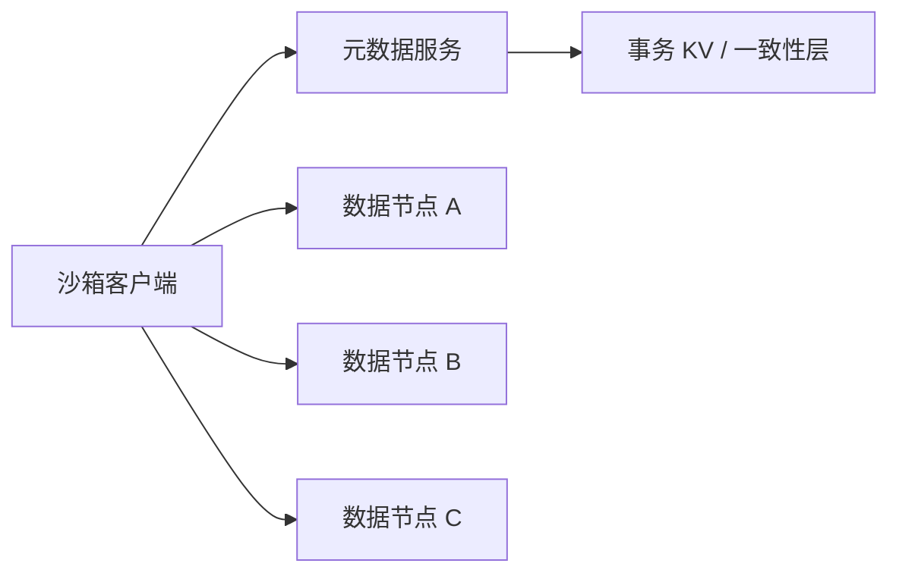

# 沙箱存储：根文件系统、临时块设备、共享卷与制品

沙箱存储要同时支持快速创建、租户隔离、任务内可写状态、跨任务共享和长期制品。页缓存、文件系统与普通写入持久化见系统子书的[一次文件写入](../../rust-hft/foundations/file_write_path.html)；Agent 平台还要管理工作层、共享卷、Checkpoint 与任务生命周期的对应关系。

Agent 工作区像一张实验台：基础工具应能重复使用，本次实验的草稿要相互隔离，需要交付的结果要长期保存，多个合作者有时还要共享材料。把所有东西塞进同一个网络盘，既慢又难定责。

先认清对象：**块设备**给文件系统一段按块读写的空间，**卷**是平台管理和挂载的存储单元，**制品（artifact）**是任务完成后要长期保留的补丁、日志或 checkpoint。overlay/COW（Copy-on-Write，写时复制）让多个沙箱共享只读基础内容、首次修改时才保存差异；inode 是文件系统描述文件元数据的对象，IOPS 表示每秒 I/O 次数；POSIX 语义在这里指应用熟悉的文件、目录、权限、`rename` 和锁等接口承诺。

## 1. 四类数据先分开

| 数据 | 典型介质/接口 | 主要目标 | 生命周期 |
|---|---|---|---|
| 只读基础层 | 镜像、快照、内容寻址缓存 | 快速启动、去重 | 随版本发布 |
| 沙箱工作层 | 临时块设备、overlay writable layer | 低延迟、强隔离 | 随 run 删除 |
| 共享协作层 | 共享文件卷 | 多实例并发访问 | 随项目或任务组 |
| 持久制品 | 对象/制品存储 | 结果、日志、checkpoint | 按保留策略 |

这样划分后，系统可以让基础层只读并跨租户去重，让工作层按租户加密和限额，只把明确选择的文件导出到制品库。共享卷不应成为所有临时垃圾的默认归宿。

## 2. 临时块设备的关键问题

对沙箱暴露一个普通块设备或文件系统，兼容性很好，但控制面要回答：

- 创建和挂载是否幂等？重复请求会不会生成两块盘？
- 从哪个干净快照克隆，克隆时是否 Copy-on-Write？
- 容量、inode、IOPS、带宽和写放大如何限制？
- 节点故障后盘还能否附到另一节点？需要多久？
- run 结束后，密钥销毁、TRIM 与物理擦除分别承诺什么？
- 快照与 VM 内存状态如何建立一致点？

临时不等于不重要。编译过程可以重跑，但长程 Agent 已执行 40 分钟后丢失整个工作区，恢复成本可能远高于保留一个增量 checkpoint。

## 3. 共享卷先定义一致性语义

“像本地文件一样”包含许多隐含问题：

- 一个客户端写入后，另一个何时可见？
- 多个 writer 同时写同一文件，谁赢？
- `rename` 是否原子？锁是否跨节点有效？
- 客户端缓存多久失效？网络分区时读旧值还是报错？
- 节点超时重连后，旧挂载是否还能写？

如果 Agent 只交换不可变制品，用对象存储加内容哈希可能比完整 POSIX 共享卷简单。如果要共同编译一个仓库，则目录项、锁、小文件和元数据延迟会成为核心负载。

## 4. 元数据面与数据面

元数据服务处理路径、权限、目录和块位置；数据节点承载字节。拆开后可以独立扩展，但也产生新的原子性问题：元数据已经指向新块，而块副本尚未达到要求怎么办？删除元数据后，孤儿块何时回收？

DeepSeek 公开的 3FS 使用解耦架构、强一致性、无状态元数据服务和事务 KV，并面向训练数据、checkpoint 与 KV Cache 等 AI 负载。它可以说明现代 AI 存储的一组取舍，但不代表所有沙箱卷都应采用同一设计。

## 5. 一个容量与写放大例子

假设每天创建 100,000 个沙箱，每个工作层平均写 2 GiB，原始日写入约 195 TiB。若三副本，网络与介质写入名义上变为约 586 TiB/日；再叠加日志、校验、压缩、垃圾回收与 Copy-on-Write，小块随机覆盖可能产生更高写放大。

若 95% 的依赖内容可通过只读内容寻址层共享，而每个沙箱只写 100 MiB 的差异层，日写入约降到 9.5 TiB，再乘副本仍明显更小。这里的数字只是教学假设，说明镜像去重和工作层分离会改变系统量级。

## 6. Fencing 与重复挂载

节点 A 持有卷的 epoch 7。控制面认为 A 失联，把卷以 epoch 8 挂到节点 B。即使 A 稍后恢复，它的所有写入也必须被存储服务拒绝，否则会出现两个 writer 都认为自己合法。

所以“控制面更新数据库状态”不够，数据面必须验证 fencing token。租约负责判断所有权是否过期，epoch 负责让旧所有者永久失效。

## 7. 缓存设计

- 基础镜像和依赖缓存适合按内容哈希校验，错误时可重新拉取。
- 可变共享文件缓存必须有一致性协议或明确的 stale-read 语义。
- 写回缓存改善延迟，却扩大丢失窗口并让回收更复杂。
- 多租户缓存要防侧信道和数据串租；缓存命中不能绕过权限检查。

缓存键至少应包含内容/版本、平台、权限域和影响输出的构建参数。只以文件名为键，迟早会返回“名字相同、内容不同”的对象。

## 8. 典型失败路径

平台删除 run 后立即回收卷 ID，但后台擦除尚未完成。新 run 获得同一底层块映射，在文件系统空闲区读到旧租户残留。

修复要把逻辑删除、密钥销毁、物理回收和 ID 再利用分开建模。每卷独立加密密钥能让密钥销毁快速切断可读性；后台再做可审计的回收。新映射必须初始化或保证不可读旧块。

## 9. 章末面试问题

**题目：如何为十万级短命沙箱设计临时存储和共享卷？**

**30 秒答法：**我会先按只读基础层、每 run 工作层、共享协作层和持久制品分离数据。临时层优化快速克隆、租户加密、配额和批量回收；共享卷先定义 POSIX 兼容、一致性、锁与故障语义，再分离元数据和数据扩展。挂载采用租约加 fencing 防旧节点复写，快照要保证内存与磁盘一致点。容量模型同时计算字节、IOPS、小文件元数据、网络副本和删除速率，最后用真实 checkout、安装、编译与测试 trace 压测，而不只测大文件顺序读写。

可能追问：

1. 什么时候对象存储比共享 POSIX 卷更合适？
2. 快照克隆、全量复制和远端读之间如何权衡？
3. 元数据热点怎样分片，跨目录 `rename` 怎么办？
4. 如何验证删除后不会发生数据串租？

## 10. 本章速记

- 只读基座、工作层、共享层、制品层承担不同承诺。
- 共享卷设计从一致性语义开始，不从产品名开始。
- 字节吞吐之外还要估算 IOPS、inode、元数据和删除速率。
- 租约加 fencing 才能阻止失联旧节点继续写。
- 3FS 是公开案例，结论必须绑定其文档和适用负载。

## 一手资料

- [DeepSeek 3FS 官方仓库](https://github.com/deepseek-ai/3fs)
- [Linux OverlayFS 文档](https://docs.kernel.org/filesystems/overlayfs.html)
- [Linux `mount_namespaces(7)`](https://man7.org/linux/man-pages/man7/mount_namespaces.7.html)
