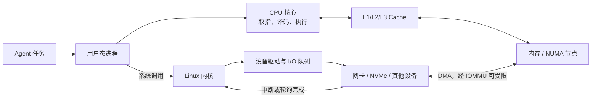

# 计算机怎样执行一次任务：CPU、缓存、内核与设备

> 学习优先级：**P0 掌握执行主链，P1 理解 NUMA、DMA 与性能计数器。** 本章讲通用 Linux 原理，不代表 DeepSeek 内部硬件或实现。

你让 Agent 执行一次“编译并测试”，屏幕上只看到一条命令。 机器内部却像一间繁忙工厂：CPU 取指令，缓存搬运常用材料，内核分配资源，网卡和 SSD 通过队列完成外部工作。 如果只会说“CPU 忙”或“磁盘慢”，就很难解释真正的瓶颈在哪里。

## 1. 先看学习地图

| 优先级 | 必须回答的问题 | 本章位置 |
|---|---|---|
| P0 | 程序、CPU、内核和设备怎样连成一条链？ | 第 2～4 节 |
| P0 | 为什么 CPU 利用率不高，任务仍可能很慢？ | 第 5～6 节 |
| P0 | 怎样在 Linux 上获得证据，而不是猜？ | 第 8 节 |
| P1 | Cache、NUMA、DMA、IOMMU 为什么影响隔离与尾延迟？ | 第 5～7 节 |

概念地图如下：



先记一句：**CPU 执行指令，内核管理共享资源，设备完成外部 I/O，缓存和队列决定等待发生在哪里。**

## 2. 从程序到 CPU

源代码不会被 CPU 直接理解。 编译器把 Rust 或 C 代码变成机器指令，加载器把可执行文件映射进进程地址空间，CPU 才能逐条执行。

一个核心可以粗略理解为重复下面的循环：

1. 从当前指令地址取得指令。
2. 译码，判断要做加法、读取内存还是跳转。
3. 执行，并更新寄存器或内存。
4. 前往下一条指令；遇到分支时预测下一条路径。

现代 CPU 会并行处理多条指令，也会乱序执行。 面试不必先背流水线每一级，但要知道“主频 × 时间”不等于实际完成的有效工作。

常用粗略指标是 IPC：

```text
IPC = instructions / cycles
```

IPC 低可能来自 Cache miss、分支预测失败、数据依赖或执行单元不足。 它不是跨 CPU 型号直接比较程序好坏的万能分数。

“4 核 8 线程”中的线程通常指硬件线程，也叫逻辑 CPU。 它和操作系统线程不是同一个概念：操作系统把可运行任务调度到逻辑 CPU 上。

## 3. 用户态与内核态

普通程序运行在用户态，不能随意配置页表、读写设备寄存器或访问其他进程内存。 需要打开文件、建立网络连接或创建进程时，它通过系统调用进入内核。

```text
用户代码
  → libc / Rust 标准库封装
  → syscall 指令进入内核
  → 内核校验参数、权限与资源
  → 文件系统 / 网络栈 / 调度器 / 驱动
  → 返回用户态
```

系统调用是一次权限边界切换，但**不一定发生任务上下文切换**。 如果调用立刻完成，仍可能由同一个线程继续运行；如果等待 I/O，调度器才可能运行别的线程。

同理，中断也不是“程序主动调用的函数”。 设备可用中断通知 CPU 有事件完成；高速设备也可能配合轮询，减少每次完成都打断 CPU 的成本。Linux 的具体系统调用接口可以从 [`syscalls(2)`](https://man7.org/linux/man-pages/man2/syscalls.2.html) 开始查。

## 4. 内核为什么存在

如果每个程序都能直接控制整块内存和网卡，一个错误 Agent 就可能影响整台机器。 内核的核心工作可以归成四类：

- **抽象**：用进程、文件、socket 等统一接口隐藏设备差异。
- **隔离**：用地址空间、权限和命名空间分开不同工作负载。
- **调度**：决定 CPU、内存、I/O 与网络资源先给谁。
- **恢复**：处理进程退出、设备错误、超时和资源回收。

内核并不让硬件成本消失。 例如 `read()` 接口看起来相同，数据可能来自 Cache、内存页缓存、本地 NVMe 或远端文件系统，延迟能相差很多数量级。

所以跨层排障必须问：这次请求实际走了哪条路径？在哪一级等待？

## 5. Cache：CPU 身边的小仓库

CPU 运算速度通常比访问主内存快得多，因此硬件设置了多级 Cache。 常见层次是每核心附近的 L1、L2，以及多个核心共享或分片的末级 Cache；具体结构依处理器而异。Cache 通常按 cache line 搬运相邻字节，而不是每次只取一个整数。 这带来两类局部性：

- 时间局部性：刚访问的数据很可能马上再访问。
- 空间局部性：访问某地址后，很可能访问它附近的数据。

连续扫描数组通常比随机追逐指针更容易利用 Cache。 两个核心频繁写同一 cache line，即使写不同变量，也可能反复传递该行的所有权；这叫 false sharing，将在并发章继续讲。

下面只是建立数量级直觉的教学假设，不是目标机器参数：

```text
CPU 频率：3 GHz，即每周期约 0.33 ns
一次主内存等待：假设 100 ns
对应周期：100 / 0.33 ≈ 300 cycles
```

如果一段循环每次都因随机访问等 300 个周期，再多算术优化也未必有效。 真实数据必须在同一硬件、同一负载上测量。Linux 内核对 CPU Cache 与 TLB 刷新的解释见[官方文档](https://docs.kernel.org/core-api/cachetlb.html)。

## 6. NUMA：内存也有“远近”

在多插槽服务器上，CPU 与内存可能组成多个 NUMA 节点。 核心访问本地节点内存通常更近；访问另一个节点需要经过互连，延迟与带宽可能不同。

这不是说“远端内存一定慢某个固定百分比”。 影响取决于硬件、访问模式、并发和内存策略，必须实测。Agent Infra 中容易出现这类问题：

- 沙箱的 vCPU 在节点 0，主要内存却分配在节点 1。
- 网卡靠近某个 NUMA 节点，但处理线程被调到另一侧。
- 大量沙箱争用同一内存通道，CPU 利用率没有满，内存带宽已饱和。P0 阶段只需知道 NUMA 会改变“所有内存都一样”的假设。P1 再学习 CPU 亲和性、内存策略和设备拓扑；参考 Linux [NUMA Memory Policy](https://docs.kernel.org/admin-guide/mm/numa_memory_policy.html)。

## 7. 设备、队列、DMA 与 IOMMU

CPU 不应亲自把网络包的每个字节搬到内存。 常见路径是：驱动准备内存缓冲区，把描述符写入设备队列，设备通过 DMA 直接读写内存，完成后再通知 CPU。DMA 是 Direct Memory Access，直译为“直接内存访问”。 “直接”指数据传输不需要 CPU 逐字节复制，不代表设备可以不受限制地访问所有内存。IOMMU 可以把设备看到的 DMA 地址映射到允许的物理页。 这既支持地址转换，也能缩小故障或恶意设备越界访问的范围。Linux [DMA API HOWTO](https://docs.kernel.org/core-api/dma-api-howto.html)明确区分 CPU 虚拟地址、物理地址和 DMA 地址。

一个简化的 NVMe 或网卡请求如下：

```text
进程发起 I/O
  → 内核与驱动准备描述符
  → 描述符进入设备提交队列
  → 设备 DMA 读写内存缓冲区
  → 完成队列出现结果
  → 中断或轮询发现完成
  → 等待线程被唤醒
```

因此“磁盘利用率不高”也不能证明 I/O 路径健康。 瓶颈可能是队列锁、请求太小、内存拷贝、中断集中、DMA 映射或单个提交线程。

## 8. 在 Linux 上怎样看见证据

以下命令以读取信息为主，仍应在自己的 Linux VM、容器或测试机执行。 不要在共享生产机运行长时间 `perf`，不要修改 CPU/NUMA 绑定，也不要对未知设备做压力测试。

```bash
# CPU、核心、逻辑 CPU 与 NUMA 拓扑
lscpu
lscpu -e=CPU,CORE,SOCKET,NODE,ONLINE

# 内核看到的 CPU 信息；内容随架构而异
sed -n '1,40p' /proc/cpuinfo

# NUMA 节点与内存分布；没有 NUMA 时可能只有 node0
find /sys/devices/system/node -maxdepth 2 -name meminfo -print

# 设备与中断计数，只读观察即可
lsblk
sed -n '1,30p' /proc/interrupts
```

若测试机允许使用 `perf`，可以观察一个**短命、低负载**命令：

```bash
perf stat -e cycles,instructions,cache-references,cache-misses -- sleep 0.2
```

结果受权限、虚拟化环境和 CPU 支持影响。 计数器可能被复用，也可能因 `perf_event_paranoid` 被禁止；不要把一次结果写成普遍规律。 接口与安全限制见 [`perf_event_open(2)`](https://man7.org/linux/man-pages/man2/perf_event_open.2.html)和 Linux [perf 安全文档](https://docs.kernel.org/admin-guide/perf-security.html)。

观察时按三步记录：

1. 机器拓扑、内核版本与命令版本。
2. workload、持续时间、并发度和缓存冷热。
3. cycles、instructions、cache miss 与实际业务延迟是否同时变化。

相关性不是因果性。Cache miss 增加可能是根因，也可能只是 workload 改变后的伴随现象。

## 9. 与 Agent Infra 有什么关系

一台宿主机同时运行许多沙箱，资源争用会跨越软件边界：

- CPU 配额相同，不代表 Cache、内存带宽和中断负载相同。
- 网络或存储队列拥塞，会让看似独立的沙箱共同出现 p99 尖刺。
- vCPU、内存与设备跨 NUMA 节点放置，可能增加远端访问。
- 设备 DMA 与直通能力必须受 IOMMU、运行时和权限策略约束。
- 观测 Agent 自己也消耗 CPU、内存、队列和带宽，不能无限采样。

设计容量时，至少同时看 CPU 时间、内存容量、内存带宽、I/O 队列、网络包率和尾延迟。 这些是通用设计原则，不能据此推断 DeepSeek 采用了某款 CPU、网卡或拓扑。

## 10. 常见误区

**误区一：CPU 50%，所以机器还有一半容量。** 可能只有一个核心、内存带宽、锁或设备队列饱和。

**误区二：系统调用一定会切换到另一个线程。** 用户态进入内核态与调度器切换任务是两件事。

**误区三：DMA 就是零成本、零拷贝。** 描述符、映射、Cache 一致性、队列和完成通知都有成本；有些路径仍会复制。

**误区四：Cache 越大，任何程序越快。** 收益取决于工作集、访问局部性与共享争用。

**误区五：知道硬件名词就等于定位了瓶颈。** 正确做法是先提出假设，再用计数器、trace 和对照实验验证。

## 11. 30 秒面试答案

> 一次 Agent 任务先在用户态进程中执行机器指令；需要文件、网络或进程管理时，通过系统调用进入 Linux 内核。CPU 用多级 Cache 缩短常用数据访问，Cache miss 后才逐步访问更远的内存；多插槽机器还要考虑 NUMA。网卡或 NVMe 通常通过驱动队列和 DMA 搬运数据，IOMMU可限制设备地址范围，完成再由中断或轮询通知内核。我不会用单一 CPU 利用率判断瓶颈，而会结合 cycles/IPC、Cache miss、NUMA、I/O 队列与端到端 p99，在相同 workload 下找证据。

常见追问：

1. 用户态进入内核态和线程上下文切换有什么不同？
2. CPU 不满但任务慢，如何判断是 Cache、锁还是 I/O？
3. DMA 为什么还需要 IOMMU？
4. NUMA 下 vCPU、内存和网卡怎样放置？
5. `perf stat` 的一次结果为什么不能直接下结论？

## 12. 章末自测

1. 画出从用户进程到 NVMe 完成一次读取的最小链路。
2. 用一句话分别解释 CPU Cache、页缓存和 TLB；不要把三者混在一起。
3. 为什么 3 GHz CPU 等待 100 ns 可能浪费约 300 个周期？
4. 系统调用返回前一定发生线程切换吗？为什么？
5. DMA 地址、CPU 虚拟地址和物理地址有什么不同？
6. 在测试机运行一次 `lscpu`，指出 core、socket、CPU、NUMA node 的区别。
7. 给出“CPU 利用率低但 p99 高”的三种不同假设及对应证据。

## 13. 本章小结

- CPU 执行指令，内核管理共享资源，设备通过驱动和队列完成 I/O。
- 用户态/内核态切换不等于任务上下文切换。
- Cache、内存、NUMA 和设备队列都能制造尾延迟。
- DMA 减少 CPU 搬运，IOMMU为设备访问增加地址转换与隔离。
- Agent Infra 的容量不是只有“多少核、多少 GiB”，还要看共享硬件瓶颈。
- 性能判断必须绑定具体机器、workload 和可复现证据。

## 一手资料

- [Linux Cache 与 TLB 刷新](https://docs.kernel.org/core-api/cachetlb.html)
- [Linux Dynamic DMA Mapping Guide](https://docs.kernel.org/core-api/dma-api-howto.html)
- [Linux NUMA Memory Policy](https://docs.kernel.org/admin-guide/mm/numa_memory_policy.html)
- [Linux `perf_event_open(2)`](https://man7.org/linux/man-pages/man2/perf_event_open.2.html)
- [Linux perf security](https://docs.kernel.org/admin-guide/perf-security.html)
- [Linux `syscalls(2)`](https://man7.org/linux/man-pages/man2/syscalls.2.html)
