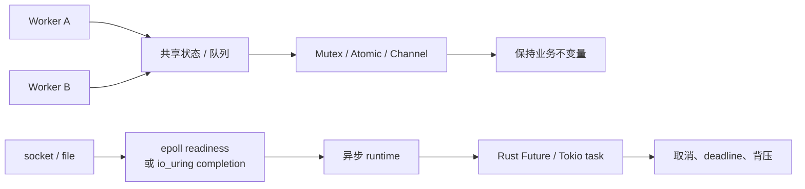

# 并发与异步 I/O：锁、原子、futex、epoll、io_uring 与 Tokio

> 学习优先级：**P0 掌握竞态、锁、死锁、取消和背压；P1 理解内存序、futex、epoll 与 io_uring。** 本章不代表 DeepSeek 采用某种 Rust runtime 或 I/O 框架。

两个 worker 同时领取同一个 Agent 任务，都看到状态是 `Pending`，然后都把它改成 `Running`。 代码每一行单独看都正确，组合起来却执行了两次。 这就是并发最难的地方：问题不只来自某行代码，还来自多个执行流之间的顺序。

## 1. 学习地图

| 优先级 | 必须回答的问题 | 关键词 |
|---|---|---|
| P0 | 并发、并行和竞态有什么区别？ | interleaving、invariant |
| P0 | 何时使用锁、channel、semaphore 或有界队列？ | ownership、critical section、backpressure |
| P0 | 怎样避免死锁，并让 timeout 不破坏副作用语义？ | lock order、cancellation、idempotency |
| P1 | 原子变量的 Ordering 在约束什么？ | Relaxed、Acquire、Release、SeqCst |
| P1 | futex、epoll、io_uring 各解决哪一层？ | wait/wake、readiness、completion |



## 2. 并发不等于并行

并发表示多个任务的生命周期重叠，执行步骤可能交错。并行表示同一时刻确实有多个计算在不同核心或设备上进行。

单核机器也能并发：任务 A 运行一会儿，等待 I/O 时任务 B 继续。多核机器可以并行，但共享内存会引入可见性与顺序问题。

异步也不等于并行。一个单线程 event loop 可并发管理许多 socket；CPU 密集计算若不主动让出，仍会堵住整个线程。先问 workload：

- CPU 密集：可能需要受控线程池或并行计算。
- 大量等待 I/O：异步事件驱动通常能减少阻塞线程数量。
- 有阻塞库：需要隔离到阻塞线程池，不能直接塞进 event loop。
- 有共享可变状态：必须定义所有权和同步协议。

## 3. 数据竞争与逻辑竞态

最小例子是两个线程同时执行：

```text
读取 counter = 0
各自计算 0 + 1
各自写回 1
最终结果是 1，而不是 2
```

底层 data race 指未同步的并发内存访问，其中至少一个是写；在 Rust 中，安全类型系统会阻止许多 data race，含 `unsafe` 的代码仍需维护规则。

但没有 data race 不代表没有逻辑竞态。例如两个 worker 都执行“先查询任务未领取，再更新为已领取”。每次数据库访问单独是线程安全的，查询与更新之间仍有竞态。正确协议可能是带条件的原子更新：

```sql
UPDATE jobs
SET state = 'Running', owner = :worker
WHERE id = :id AND state = 'Pending';
```

只有受影响行数为 1 的 worker 获得执行权。并发正确性的中心不是“用了锁”，而是**不变量在所有交错顺序下都成立**。

## 4. 同步工具怎样选

| 工具 | 适合解决 | 常见代价或风险 |
|---|---|---|
| Mutex | 同一时间只有一个执行流修改临界区 | 争用、阻塞、死锁 |
| RwLock | 读多写少，允许并发读 | 写者饥饿或实现开销，未必比 Mutex 快 |
| Condvar | 等待某个受锁保护的条件改变 | 必须循环检查条件，处理伪唤醒 |
| Semaphore | 限制并发许可数量 | 许可泄漏、公平性和饥饿 |
| Channel | 转移消息或所有权，降低共享状态 | 队列增长、断连、复制/序列化成本 |
| Atomic | 很小的无锁状态或计数 | 内存序难，难维护复合不变量 |

一个好原则是先缩小共享状态，再选择最容易证明正确的工具。“无锁”不自动等于更快，也不自动等于 wait-free。

锁的临界区应包含保持不变量所需的最小完整动作。临界区过大会增加争用，过小又可能把一个原子业务动作拆开。

不要在持锁时执行无法控制时长的网络请求。否则一个慢依赖会把所有等待者绑在同一把锁后面。Rust 标准库的同步原语见 [`std::sync`](https://doc.rust-lang.org/std/sync/index.html)。

## 5. 原子操作与内存序

Atomic 不只要保证“某个整数不会写一半”。 多核 CPU 和编译器都可能在不破坏单线程语义的前提下重排操作，内存序用于约束线程之间何时能观察到哪些写入。Rust 的常用 Ordering 可以先这样理解：

- `Relaxed`：保证该原子对象上的原子性与修改顺序，不建立其他内存访问的同步关系。
- `Release` store：发布之前的写。
- `Acquire` load：当它观察到配对的 release 时，之后的读可看到发布前的写。
- `AcqRel`：对读改写操作同时提供 acquire 与 release 作用。
- `SeqCst`：除 acquire/release 约束外，所有 SeqCst 操作参与一个一致的全序，推理更直观但仍不是“全程序自动串行”。

正式定义以 Rust [`std::sync::atomic::Ordering`](https://doc.rust-lang.org/std/sync/atomic/enum.Ordering.html)为准。不要用 `Relaxed` 发布一个普通指针和它指向的数据，除非能另外证明可见性。也不要为了“性能”先选最弱内存序，再让未来维护者猜证明。

一个计数器适合 `fetch_add`，但“余额足够才扣款”包含检查与更新两个条件，单个 relaxed atomic 计数不一定能表达完整不变量。此时锁、compare-exchange 循环或数据库条件事务可能更清楚。

Linux 内核关于 CPU 与编译器内存屏障的原始说明见 [Memory Barriers](https://docs.kernel.org/core-api/wrappers/memory-barriers.html)。

## 6. futex：无争用留在用户态，争用时请内核帮忙

Mutex 的快路径不希望每次都陷入内核。Linux futex 允许用户态先原子检查一个整数；只有无法取得锁时，才调用内核等待，解锁方再唤醒等待者。 简化路径：

```text
尝试原子地把 lock 从 0 改为 1
  ├─ 成功：直接进入临界区
  └─ 失败：futex(FUTEX_WAIT, expected=1)
              ↓
           内核挂起线程
              ↓
解锁方写 0，并在需要时 FUTEX_WAKE
```

`FUTEX_WAIT` 会再次检查用户内存中的值，只在仍等于期望值时睡眠，从而避免“检查后、睡眠前错过唤醒”的经典竞态。 完整语义见 [`futex(2)`](https://man7.org/linux/man-pages/man2/futex.2.html)和 [`FUTEX_WAIT(2const)`](https://man7.org/linux/man-pages/man2/FUTEX_WAIT.2const.html)。futex 是构建阻塞原语的底层工具，不是应用层拿来随意替代 Mutex 的简单 API。 公平、优先级反转、超时和进程共享等细节都很复杂。

## 7. 死锁：每个人都在等别人先放手

经典死锁通常与四个条件同时存在有关：

1. 资源互斥使用。
2. 已持有资源时继续等待其他资源。
3. 资源不能被强制抢走。
4. 等待关系形成环。

打破任意一个条件就能预防相应死锁。 工程中最常用的是固定全局锁顺序、避免持锁跨 I/O、一次性申请资源，或用 `try_lock`/timeout 后释放并重试。 例子：

```text
线程 A：持有 job_lock，等待 volume_lock
线程 B：持有 volume_lock，等待 job_lock
```

规定永远先拿 `job_lock` 再拿 `volume_lock` 可以消除这个环，但顺序必须覆盖所有代码路径。timeout 只能让系统可能脱困，不自动恢复业务一致性。 超时退出前必须知道已修改了什么、需要释放或补偿什么。 除了死锁，还要区分：

- livelock：线程都在动作和退让，却没有进展。
- starvation：某个线程长期得不到机会。
- priority inversion：高优先级任务等待低优先级任务持有的资源。

## 8. epoll：告诉我“现在可能可以做”

阻塞 `read` 会让调用线程等待。非阻塞 fd 在暂时不能完成时返回 `EAGAIN`；程序需要一种方式等待许多 fd 中任意一个变得就绪。

`epoll` 维护关注集合，并返回当前就绪的 fd。它是 readiness 模型：通知你“现在读或写可能不会阻塞”，程序仍要真正调用 `read`/`write` 并处理 `EAGAIN`、短读写和关闭。

Level-triggered 模式在条件仍成立时会继续报告。Edge-triggered 模式主要报告状态变化，通常要求 fd 非阻塞并一直处理到 `EAGAIN`，否则可能留下数据却等不到新边沿。

`epoll` 不自动提供消息边界。TCP 仍是字节流，应用必须自己做长度前缀、分隔符或其他 framing。接口定义见 [`epoll(7)`](https://man7.org/linux/man-pages/man7/epoll.7.html)。

## 9. io_uring：提交操作，再收完成结果

`io_uring` 提供共享环形队列：应用把请求放入 submission queue，内核把结果放入 completion queue。 它更接近 completion 模型，而不是只通知 fd 就绪。

```text
准备 SQE
  → 提交一个或一批操作
  → 内核/设备执行
  → CQE 返回结果
  → 应用按 user_data 关联原请求
```

批量提交与共享队列可以减少部分系统调用和复制开销，但不是所有 workload 都必然更快。 操作支持、内核版本、固定缓冲区/文件、队列深度、取消语义和安全边界都需验证。 尤其不要把“收到 timeout CQE”简单理解成目标 I/O 一定从未产生副作用。 取消与竞态必须按具体 opcode 和返回状态处理。Linux 接口可从 [`io_uring_setup(2)`](https://man7.org/linux/man-pages/man2/io_uring_setup.2.html)与 [`io_uring_enter(2)`](https://man7.org/linux/man-pages/man2/io_uring_enter.2.html)开始。

## 10. Rust Future 与 Tokio

Rust `Future` 表示一个稍后可能完成的值。异步 runtime 反复 poll future；future 尚未就绪时返回 `Pending`，并通过 waker 要求事件发生后再次 poll。

Tokio task 是协作式调度的异步任务。task 只有到达 `.await` 等让出点，runtime 才有机会运行同一 worker 上的其他 task。因此在 async task 中长时间做 CPU 密集循环或阻塞系统调用，会堵住 runtime worker。

阻塞工作可放入 [`spawn_blocking`](https://docs.rs/tokio/latest/tokio/task/fn.spawn_blocking.html) 的专用线程池，但任务开始运行后通常不能靠 `abort` 强制停止闭包。真正不可控的命令更适合放进可由操作系统强制回收的子进程或沙箱。

一个有界 Tokio channel 的形状如下；示例标为忽略，因为本书自身不要求安装 Tokio 依赖：

```rust,ignore
use tokio::sync::mpsc;
let (tx, mut rx) = mpsc::channel::<Job>(128);
tx.send(job).await?;        // 队列满时等待，形成背压
let next = rx.recv().await; // 所有 sender 关闭后返回 None
```

Tokio channel 指南见[官方教程](https://tokio.rs/tokio/tutorial/channels)。

## 11. 取消、deadline 与副作用

异步任务被取消，通常意味着 future 被丢弃，之后不再 poll。这不会自动撤销已经发出的 HTTP 请求、数据库写或子进程。

Tokio 的优雅停止建议通常包含三个阶段：发现停止条件、通知各任务、等待它们完成清理；见[Graceful Shutdown](https://tokio.rs/tokio/topics/shutdown)。设计取消时要问：

- 取消发生在等待前、等待中还是结果已提交后？
- 被 drop 的 future 是否 cancellation-safe？
- 外部操作有稳定 operation ID 吗？
- 子进程、许可、锁、临时文件与连接怎样释放？
- 清理也超时怎么办？

全链路 deadline 应逐层传递剩余时间。 每一层各自重新给 30 秒，会让用户的 30 秒预算膨胀成数分钟。

## 12. 背压：让慢消费者能说“不”

假设每秒进入 10,000 个任务，worker 每秒只能完成 8,000 个：

```text
积压增长 = 10,000 - 8,000 = 2,000 tasks/s
一分钟新增 = 2,000 × 60 = 120,000 tasks
```

无界队列只是把过载从“立即拒绝”变成“晚些时候内存耗尽和全体超时”。 背压可以组合：

- 有界 channel；
- semaphore 限制在途操作；
- 每租户配额与公平队列；
- API 返回明确 overload/retry-after；
- 全局 deadline 和重试预算；
- 过载时丢弃低优先级新任务，保护已运行任务。

队列不仅看长度，还要看最老任务年龄。 长度相同，处理 1 ms 小任务与 10 min 长任务的风险完全不同。

## 13. 在 Linux 上观察

只在自己的测试程序上使用这些命令。 `strace` 和 `perf` 会扰动时序，并可能记录敏感参数；不要未经授权附加共享或生产进程。

```bash
CONCURRENCY_LAB_DIR=$(mktemp -d) || exit 1
trap 'rm -f -- "$CONCURRENCY_LAB_DIR/trace"; rmdir -- "$CONCURRENCY_LAB_DIR"' EXIT

# 看一个进程的线程与当前所在 CPU
ps -L -p $$ -o pid,tid,stat,psr,comm

# 只读查看内核记录的文件锁；这不是 pthread Mutex 清单
sed -n '1,40p' /proc/locks

# 跟踪一个短小测试命令是否调用 futex/epoll/io_uring
strace -f -e trace=futex,epoll_ctl,epoll_wait,io_uring_setup,io_uring_enter \
  -o "$CONCURRENCY_LAB_DIR/trace" -- true
sed -n '1,80p' "$CONCURRENCY_LAB_DIR/trace"
```

`true` 很可能不调用这些接口，空结果也是证据：目标 workload 没走该路径。要观察 Tokio 程序，应在你自己编写的小实验上运行，并限制持续时间和输出大小。

如果测试机允许，可用 `perf sched` 或 `perf lock` 收集短时间样本，但功能依内核配置与权限而定。先阅读 [`perf_event_open(2)`](https://man7.org/linux/man-pages/man2/perf_event_open.2.html)，再决定是否采样。

排障顺序：

1. 任务是在 CPU 上运行，还是等待？
2. 等待的是锁、fd、timer、channel 还是 semaphore？
3. 队列长度和年龄是否持续增长？
4. 谁持有许可或锁，是否跨 I/O？
5. 取消后还有无子进程或外部操作在继续？

## 14. 与 Agent Infra 的联系

- 调度器用条件更新、租约和 fencing，防两个 worker 同时成为任务主人。
- 节点 agent 用有界队列和 semaphore 控制并发启动、镜像拉取与卷挂载。
- stdout/stderr 必须并发且有界地读取；runtime event loop 不应直接运行未知用户代码，阻塞或恶意循环要进入可强制回收的沙箱。
- timeout 进入 `Unknown` 时先查询外部状态，不能盲重试有副作用工具。
- 锁、队列、task 和 I/O 都要带 trace 关联，才能解释尾延迟来自哪里。

这些是候选设计，不说明 DeepSeek 内部使用 Tokio、epoll 或 io_uring。

## 15. 常见误区

**误区一：用了 Rust，就没有并发 bug。** 安全 Rust 能防很多 data race，不能自动防重复领取、死锁和业务顺序竞态。

**误区二：Atomic 一定比 Mutex 快。** 争用、Cache line 抖动与复杂重试可能让无锁方案更慢、更难证明。

**误区三：`Relaxed` 只是“稍微放松但仍能发布数据”。** 它不为其他普通内存访问建立同步关系。

**误区四：async 会让 CPU 密集代码自动并行。** 异步主要让等待可并发；不让出的计算会阻塞 executor worker。

**误区五：timeout 表示操作失败且未发生。** 超时只表示期限内没有得到确定结果。

**误区六：无界队列能减少拒绝，所以更可靠。** 它常把过载推迟成更大范围的超时和 OOM。

## 16. 30 秒面试答案

> 并发正确性的核心是让业务不变量在所有交错顺序下成立。我会先减少共享可变状态，再按需求选择 Mutex、channel、semaphore 或 atomic；atomic 的内存序要有明确同步证明，不能用 Relaxed 猜性能。Linux 锁常用 futex 做用户态快路径、内核争用等待；大量 socket 可用 epoll 的 readiness，io_uring 则提交操作并读取 completion。Tokio task 是协作调度，阻塞代码要隔离。Agent Infra 中我会用有界队列、全链路 deadline、可传播取消、幂等键与进程级强制回收；timeout 后把外部副作用视为未知，而不是假定没发生。

常见追问：

1. data race 与逻辑竞态有什么区别？
2. Acquire/Release 建立了什么关系？Relaxed 缺少什么？
3. futex 怎样避免“刚准备睡就错过唤醒”？
4. epoll edge-triggered 为什么通常要读到 `EAGAIN`？
5. Tokio task 被 abort 后，`spawn_blocking` 和外部 HTTP 请求会怎样？
6. 如何给 10,000 个任务设计背压？

## 17. 章末自测

1. 写出两个 worker 重复领取任务的交错顺序，并给出原子修复协议。
2. 哪些场景适合 Mutex、semaphore、channel 和 atomic？各举一例。
3. 为什么“无 data race”仍可能重复付款？
4. 画出 futex 的无争用路径与争用路径。
5. 说明 epoll readiness 与 io_uring completion 的区别。
6. 列出死锁四个条件，并为双锁例子打破其中一个。
7. 到达率持续高于服务率时，无界队列怎样增长？
8. 设计一次取消，列出 future、子进程、外部副作用和清理四种状态。

## 18. 本章小结

- 并发是生命周期重叠，并行是同一时刻真正同时执行。
- 锁或 atomic 只是实现工具，业务不变量才是正确性目标。
- Acquire/Release 可发布和获取写入，Relaxed 不建立其他内存同步。
- futex 支持用户态快路径和内核等待；epoll 看就绪，io_uring 收完成。
- Tokio task 协作调度，阻塞工作与不可控代码必须隔离。
- timeout 不撤销外部副作用；取消要配合幂等、查询与清理，有界队列和背压也是可靠性机制。

## 一手资料

- Rust：[同步原语](https://doc.rust-lang.org/std/sync/index.html)、[Atomic Ordering](https://doc.rust-lang.org/std/sync/atomic/enum.Ordering.html)
- Linux：[内存屏障](https://docs.kernel.org/core-api/wrappers/memory-barriers.html)、[`futex(2)`](https://man7.org/linux/man-pages/man2/futex.2.html)、[epoll](https://man7.org/linux/man-pages/man7/epoll.7.html)、[io_uring](https://man7.org/linux/man-pages/man2/io_uring_setup.2.html)
- Tokio：[Runtime](https://docs.rs/tokio/latest/tokio/runtime/index.html)、[Channels](https://tokio.rs/tokio/tutorial/channels)、[Graceful Shutdown](https://tokio.rs/tokio/topics/shutdown)
