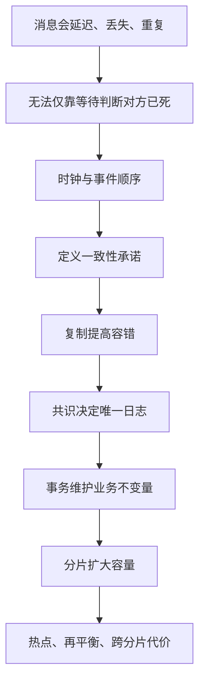

# 分布式系统地基：时间、顺序、一致性与共识

一台机器出错，程序可能直接失败；多台机器出错，最麻烦的是大家看到的世界不一样。A 认为 B 已死，B 只是网络慢；客户端认为超时，服务端其实已经提交。分布式系统的核心不是“机器很多”，而是**没有一个永远可靠的共同视角**。

Agent Infra 的控制面、调度器、worker、共享卷和任务队列都会遇到这种问题。本章先建立推理工具，再谈具体产品。

## 1. 学习优先级

| 优先级 | 必须掌握 | 能回答什么 |
|---|---|---|
| P0 | 超时、部分失败、时钟与事件顺序 | 为什么不能仅凭心跳宣布节点死亡 |
| P0 | 线性一致性、复制、quorum | 一次读写向用户承诺什么 |
| P0 | Raft 的 leader、term、log、commit | 控制面怎样维持单一决策序列 |
| P0 | 网络分区、脑裂、lease 与 fencing | 如何阻止旧 worker 继续写 |
| P0 | 事务、2PC、幂等与 Outbox | 如何跨数据库和消息安全更新 |
| P1 | 分片、再平衡、热点与跨分片事务 | 系统扩到大量租户后怎样取舍 |

P0 不是要求从零实现生产级 Raft，而是能说明它解决什么、没有解决什么，以及失败时看什么证据。

## 2. 概念地图



顺序很重要：没有先定义承诺，就不能判断复制或共识方案是否正确。

## 3. 部分失败：超时不是事实

调用超时至少有三种解释：请求没到、请求到了但响应没回来、请求完成了但响应丢了。客户端只观察到“在截止时间前没收到回答”，不能从中推出“操作没执行”。

因此每个有副作用的命令都要考虑：

- request ID 或幂等键能否识别同一意图？
- 服务端能否查询上一次结果？
- 重复执行是否安全？
- 无法确定时是否进入 `UNKNOWN`，而不是谎报失败？

这也是为什么“exactly once”不能只靠消息队列标签获得；业务存储、去重状态和副作用目标必须共同参与协议。

## 4. 物理时钟与逻辑顺序

不同机器的物理时钟会漂移，校时也可能产生调整。日志时间戳适合帮助观察，但不能天然成为严格的全局事件顺序。

Lamport 在原始论文 [Time, Clocks, and the Ordering of Events](https://lamport.azurewebsites.net/pubs/time-clocks.pdf) 中定义了 happens-before：同一进程内的先后，以及消息发送先于对应接收；再通过传递性扩展。两个事件若互相都推不出先后，就可能是并发的。

逻辑时钟能保证：若 `a → b`，则时间戳 `L(a) < L(b)`；反过来并不成立。数字更小不一定证明真实因果。

Linux 程序中还要区分时钟：[`clock_gettime(2)`](https://man7.org/linux/man-pages/man2/clock_gettime.2.html)中的 wall clock 可表示日历时间，monotonic clock 更适合测持续时间，因为它不应受日历时钟跳变直接影响。

## 5. 一致性先说人话

“一致性”不是一个开关。先问客户端能观察到什么：

- **最终一致**：停止新写，并且通信与故障恢复能继续推进后，副本最终趋于相同；没有承诺立刻读到最新值。永久分区下不能承诺收敛。
- **read-your-writes**：同一会话写完后，后续读取至少看见自己的写。
- **线性一致**：每个操作看起来在调用与返回之间某个瞬间生效，并尊重真实时间先后。

Herlihy 与 Wing 的原始论文 [Linearizability](https://cs.brown.edu/~mph/HerlihyW90/p463-herlihy.pdf)给出了可组合的并发对象定义。线性一致性很强，但跨区域协调常增加延迟或降低分区时可用性。

不要把线性一致性与数据库“可串行化事务”混为一谈：前者常讨论单个对象操作的实时顺序，后者讨论多个事务的执行结果等价于某种串行顺序；系统可以在一个维度强、另一个维度弱。

## 6. 复制与 quorum

复制把数据放到多个故障域，可以提高耐故障能力和读容量，但也引入副本同步、冲突、落后和修复。

一个经典教学例子：`N=3` 个副本，写等待 `W=2`，读查询 `R=2`，因为 `R + W > N`，读集合与最近成功写集合至少相交一个副本。

但集合相交本身不自动等于线性一致：还要定义版本顺序、并发写冲突、失败写、读修复以及谁能确认提交。面试中只写 `R + W > N` 不够。

同步复制等待更多副本，故障时承诺更清晰但延迟更高；异步复制延迟低，却存在已确认写尚未到达备机的窗口。选择要绑定 RPO、RTO 和故障域。

## 7. Raft：让多数节点同意一条日志

Raft 将共识拆成 leader election、log replication 和 safety。原始 [Raft 论文](https://raft.github.io/raft.pdf)使用 term 区分任期，通常由 leader 接受日志项并复制给 follower；满足提交条件后再交给状态机应用。

最小心智模型：

```text
客户端命令
→ leader 追加日志
→ 当前任期日志复制到多数节点并满足 commit rule
→ 当前日志与此前日志成为 committed
→ 各节点按顺序应用到状态机
```

这里有一个容易在面试中漏掉的安全条件：leader 不能只凭“某条**旧任期**日志已经出现在多数节点”就直接提交它；Raft 用当前任期日志的多数复制来推进 `commitIndex`，更早的日志随之被间接提交。完整规则以论文第 5.4.2 节为准。

Raft 保持日志顺序，不替业务完成以下工作：

- 判断“创建沙箱”外部副作用是否可重复。
- 自动选择正确的数据库 schema。
- 阻止一个仍持有旧凭证的 worker 写共享卷。
- 保证慢状态机不会拖垮服务。

成员变更、日志压缩、快照、读路径和磁盘持久化都属于实现中必须处理的边界。

## 8. 网络分区、CAP 与脑裂

网络分区时，一部分节点彼此无法通信，但各自可能仍能服务本地请求。Gilbert 与 Lynch 的 [CAP 形式化论文](https://groups.csail.mit.edu/tds/papers/Gilbert/Brewer2.pdf)中的一致性对应原子对象规范，可用性要求每个请求最终得到符合规范的响应；在异步网络发生分区时，两者不能同时保证。任意错误响应不应被偷换成“可用”。

这不是“永远从 C、A、P 三选二”的产品口号。正常无分区时仍要在延迟、一致性和成本间取舍；分区发生时，应明确哪些请求拒绝、阻塞、降级或接受陈旧结果。

脑裂是两个控制者都以为自己有权写。lease 能限制授权时间，但时钟、暂停和网络延迟会让旧持有者继续运行。fencing token 用单调递增 epoch 解决：存储端只接受不小于当前 epoch 的写，旧 controller 即使恢复也会被拒绝。

## 9. 事务：从本地原子到跨服务协调

本地数据库事务可以让多行更新一起提交或回滚。跨资源时，Two-Phase Commit（2PC）由协调者先让参与者 prepare，再决定 commit/abort。PostgreSQL 的 [`PREPARE TRANSACTION`](https://www.postgresql.org/docs/current/sql-prepare-transaction.html)展示了数据库对两阶段提交参与者的支持。

2PC 的代价包括持久协调状态、悬挂 prepared transaction 和协调者恢复。它也不能把一个不支持事务的外部 HTTP 副作用神奇地纳入原子提交。

常见替代模式：

- **Outbox**：业务更新与待发布事件写入同一数据库事务，再异步投递；消费者仍需幂等。
- **Saga**：把长事务拆成步骤和补偿；补偿是新的业务动作，不是时间倒流。原始 [Sagas 论文](https://www.cs.cornell.edu/andru/cs711/2002fa/reading/sagas.pdf)讨论了长事务分解。
- **状态机**：显式保存 `PENDING/RUNNING/SUCCEEDED/FAILED/UNKNOWN`，让恢复过程可重放。

## 10. 分片与再平衡

单个复制组容量有限，分片把 key 空间分给多个组。常见方式包括：

- 范围分片：范围扫描自然，但连续热点可能压在一个分片。
- 哈希分片：分布通常更均匀，但范围查询和有序遍历更难。
- 目录路由：映射灵活，但目录本身需要高可用和缓存一致性。

分片键应从 workload 推导。只用 `tenant_id` 可能让超大租户形成热点；只用随机 task ID 又可能让按租户查询跨越全部分片。

再平衡不是简单复制文件：迁移期间有旧路由、新路由、双写或增量追赶，还要防止旧 owner 接受写。版本化路由和 fencing 仍然重要。

## 11. 一个带数字的控制面例子

假设 3 个控制面副本分布在 3 个故障域，leader 每秒接收 6,000 条状态更新，每条日志持久化后约 1 KiB：

```text
leader 逻辑日志流量约 6,000 KiB/s ≈ 5.9 MiB/s
复制到两个 follower 的出站下界约 11.7 MiB/s
```

这不是容量结论。还需加入协议头、批处理、快照、重传、磁盘写放大以及状态机开销。若一个 follower 变慢，多数派仍可能提交，但落后日志会增长；恢复时的大量追赶又可能抢占前台 I/O。

容量设计要同时限制进入速率、未提交日志、单租户份额、快照耗时和恢复带宽。

## 12. Linux 上怎样观察与安全实验

先验证时间和连接，而不是直接破坏网络：

```bash
date +%s.%N
cat /proc/uptime
ss -tanp
ping -c 3 127.0.0.1
```

wall-clock 日志用于跨服务对齐时，要同时记录 monotonic duration、request ID 和事件序号。仅凭两台机器的日志时间先后不能证明因果。

故障注入应在可丢弃的 network namespace、VM 或专用测试环境。`tc netem` 能模拟延迟、丢包和重复，语义见 [`tc-netem(8)`](https://man7.org/linux/man-pages/man8/tc-netem.8.html)，但本书不提供可直接复制到宿主接口的 `qdisc add/del` 命令：删除 root qdisc 可能破坏已有配置。

安全实验应先创建专用 namespace 与全新 veth，只在 namespace 内注入故障，并用 `trap` 删除**整个实验 namespace**；实验进程还应有超时和第二条管理通道。若不能证明接口是本实验刚创建的，就不要修改它。

## 13. 与 Agent Infra 的联系

Agent 任务比普通短请求更需要显式状态：一次运行可能持续数小时，worker 会重启，工具有外部副作用，checkpoint 和共享卷又跨多个存储系统。

平台应至少定义：

- task 与 attempt 的唯一标识和状态机。
- scheduler lease 的 epoch 与存储端 fencing。
- 重复队列消息、重复工具调用和不确定结果的处理。
- 控制面数据库、对象存储和运行中沙箱的对账流程。
- 分区时哪些操作停止，哪些只读降级，哪些允许继续。

这些是业界通用推导，不表示 DeepSeek 使用 Raft、某数据库或某消息系统。

## 14. 常见误区

1. **“超时等于失败。”** 只能证明调用方没及时收到结果。
2. **“时间戳大就一定后发生。”** 物理时钟和逻辑时钟都要看语义。
3. **“多数派读写自动线性一致。”** 还缺版本、提交和冲突协议。
4. **“用了 Raft 就不会重复执行。”** 共识日志与外部副作用是两层问题。
5. **“CAP 就是平时三选二。”** 它讨论分区下特定一致性与可用性保证。
6. **“lease 足以防脑裂。”** 资源端还需要 fencing。
7. **“Saga 回滚一切。”** 补偿可能失败，也无法撤回已经被外界观察的事实。

## 15. 面试怎么答

### 30 秒答案

> 分布式系统先接受部分失败：超时不等于操作没发生，物理时间也不天然给出全局顺序。我会先定义线性一致或最终一致等客户端承诺，再选择复制和 quorum；需要单一日志顺序时可用 Raft 一类共识。网络分区时明确拒绝或降级策略，写权限用单调 epoch 做 fencing。跨服务副作用用幂等键、Outbox、状态机或 Saga，而不是声称消息队列自动提供 exactly once。

### 常见追问

- 为什么 `R + W > N` 仍不足以证明线性一致？
- Raft committed 与状态机 applied 有什么区别？
- 节点心跳超时后为什么不能立刻重调度？
- lease 和 fencing token 各解决什么？
- 2PC 为什么可能留下悬挂事务？
- 怎样为大租户选择分片键？

## 16. 章末自测

1. 为“请求超时但可能已执行”画出三条时间线。
2. 举例说明 happens-before 与物理时间戳的区别。
3. 写出一个需要线性一致和一个只需最终一致的 Agent 数据对象。
4. 用 `N=5` 设计读写 quorum，并说明失败边界。
5. 画出旧 worker 被新 epoch 拒绝写入的过程。
6. 为“更新任务状态并发布事件”设计 Outbox 恢复流程。

## 17. 本章小结

- 多机系统最难的是视角不一致和结果不确定。
- 一致性必须先定义观察语义，再讨论复制与共识。
- Raft 决定日志顺序，但业务幂等、外部副作用和资源 fencing 仍需单独设计。
- 分区时没有无代价答案；拒绝、等待、降级和陈旧读取都应明确。
- 分片带来容量，也带来热点、再平衡和跨分片协调。

## 一手资料

- [Lamport：Time, Clocks, and the Ordering of Events](https://lamport.azurewebsites.net/pubs/time-clocks.pdf)
- [Herlihy & Wing：Linearizability](https://cs.brown.edu/~mph/HerlihyW90/p463-herlihy.pdf)
- [Gilbert & Lynch：Brewer's Conjecture and the Feasibility of Consistent, Available, Partition-Tolerant Web Services](https://groups.csail.mit.edu/tds/papers/Gilbert/Brewer2.pdf)
- [Ongaro & Ousterhout：In Search of an Understandable Consensus Algorithm](https://raft.github.io/raft.pdf)
- [Garcia-Molina & Salem：Sagas](https://www.cs.cornell.edu/andru/cs711/2002fa/reading/sagas.pdf)
