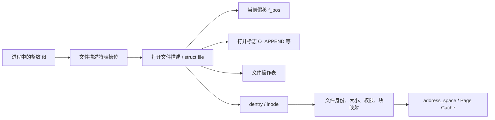
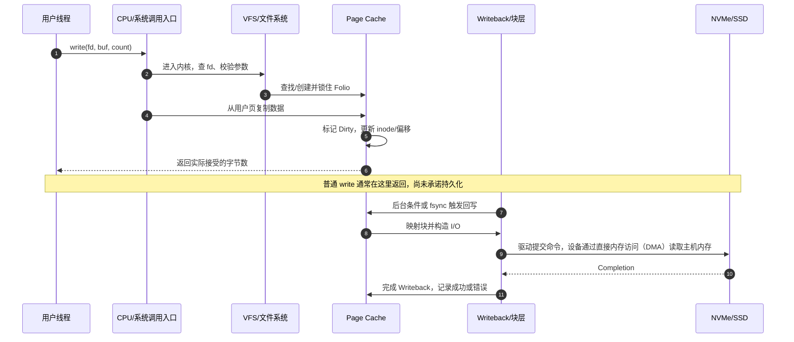
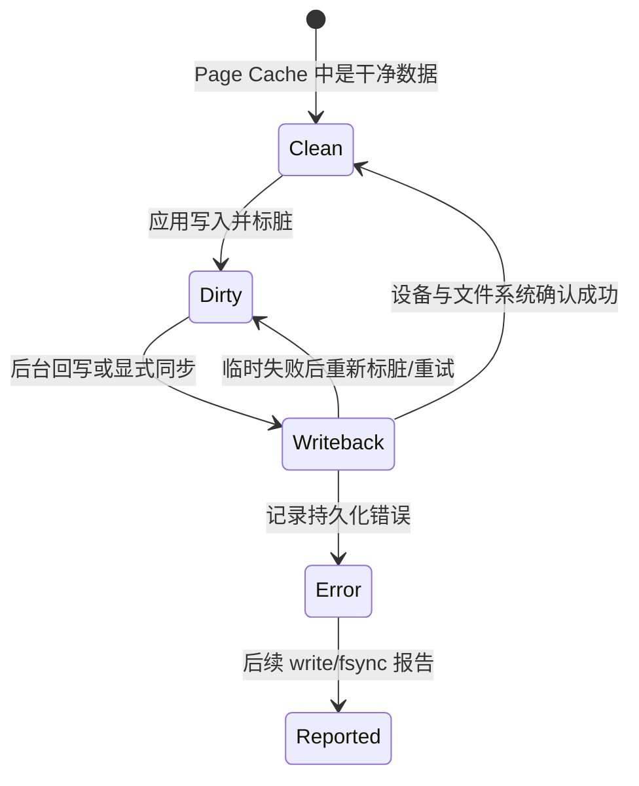
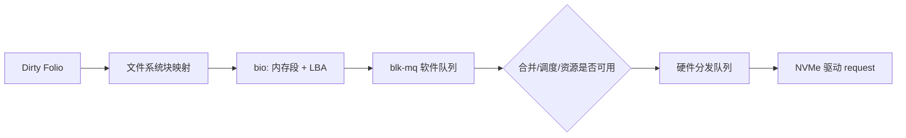
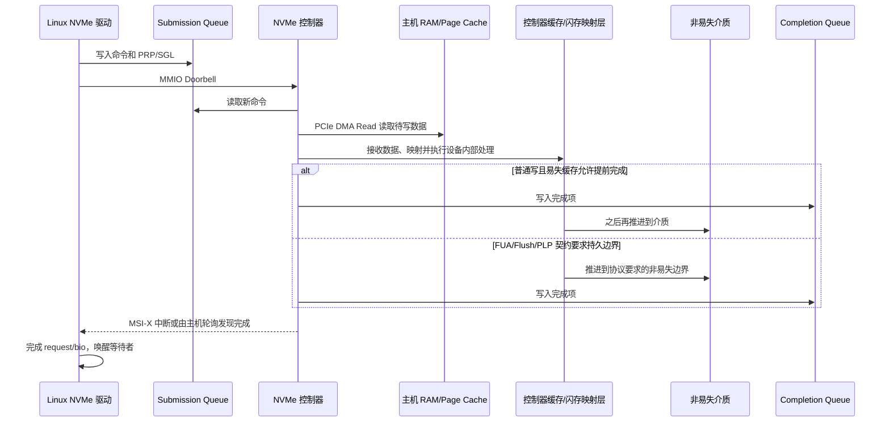
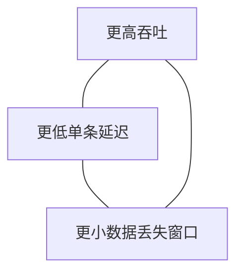

# 一次文件写入：从 `write()` 到真正落盘

> 系统基础面试经常问“`write()` 返回后，数据到底在哪里”。你必须讲清稳定的主路径和完成语义；内核辅助结构、设备直接访存描述符和 SSD 内部实现只在面试官继续追问时展开，不需要背具体调用栈。

> 先修桥梁：若系统调用、页缓存、inode 或 WAL 还陌生，先读[进程、线程、系统调用与调度](process_threads_syscalls.md)、[虚拟内存](virtual_memory.md)与[文件系统和数据库](filesystem_database.md)。本章把这些概念串成一次真实操作。

## 本章怎么读

| 优先级 | 阅读范围 | 面试通过标准 |
|---|---|---|
| **P0：必会** | 第 0～5、8～10、16～19 节的主线 | 能用 30 秒区分 `write`、`fsync` 与真正持久化，能解释短写和晚到错误 |
| **P1：理解** | Writeback、块层、文件系统一致性、慢路径与诊断 | 面试官追问延迟或故障时，能沿层次提出证据，而不是只背名词 |
| **P2：选读** | 折叠起来的页缓存、处理器缓存、设备直接访存与 SSD 内部细节 | 只在被追到内核版本或硬件数据路径时展开；记住因果，不背结构名 |

第一次阅读先沿 P0 走通“用户缓冲 → 内核页缓存 → 后台回写 → 设备持久边界”。折叠内容用于回答读者常追问的“软硬件具体做了什么”，不是每位候选人的背诵清单。

## 0. 先限定问题：这里讲的是哪一种 `write`

“调用一次 `write()`，系统做了什么？”这个问题没有脱离场景的唯一答案。本章固定讨论下面这条典型路径：

- 现代 Linux；
- 本地普通文件，而不是 TCP Socket、Pipe、终端或设备文件；
- 文件已经打开，应用持有可写文件描述符 `fd`；
- 普通 Buffered I/O（缓冲 I/O）；
- 没有设置 `O_DIRECT`、`O_SYNC` 或 `O_DSYNC`；
- 以 ext4/XFS 一类本地文件系统和 NVMe（Non-Volatile Memory Express，一种面向非易失存储的高速协议）SSD 帮助建立画面；
- 示例假设页面大小为 4 KiB，但真实值应从目标机器查询。

具体函数名、锁和数据结构会随内核版本、文件系统与设备变化。本章给出的是**稳定的分层模型**，不是要求背诵某个 Linux 版本的调用栈。

同名 `write()` 根据 `fd` 类型会进入完全不同的子系统：

| `fd` 指向什么 | 数据通常先进入哪里 | 成功返回不代表什么 |
|---|---|---|
| 本地普通文件 | 文件页缓存（Page Cache） | 已经断电不丢 |
| TCP Socket | 本机 Socket 发送缓冲区和 TCP 发送路径 | 对端应用已经收到，更不代表业务 ACK |
| UDP Socket | 本机数据报发送路径 | 网络没有丢包或对端已经处理 |
| Pipe/FIFO | 内核 Pipe Buffer | 读取方已经消费 |
| 终端 | TTY 子系统和驱动队列 | 人已经看到输出 |

本章只深入第一行。网络发送路径请看[网络与 RPC](network_rpc.md)。

## 1. 先记住结论：`write` 返回不是“落盘证明”

假设程序调用：

```c
ssize_t n = write(fd, buf, 4096);
```

如果返回 `4096`，在本章的默认 Buffered I/O 场景下，通常只说明：

> 内核已经接受这 4096 字节，并把文件的逻辑内容更新到了可以继续管理的状态。

它通常**不说明**：

- 数据已经交给 NVMe 驱动；
- SSD 控制器已经收到数据；
- 数据已经离开 SSD 的易失缓存；
- NAND 闪存已经完成编程；
- 整机此刻掉电后一定能恢复这 4096 字节。

可以把完成程度看成一架梯子：

| 层级 | 数据到达哪里 | 常见事件 | 进程崩溃 | 内核崩溃/断电 |
|---:|---|---|---|---|
| 0 | 只在应用缓冲区 | 还没调用 `write` | 可能丢失 | 丢失 |
| 1 | 用户态运行库缓冲区 | `BufWriter::write_all` / `fwrite` | 可能丢失 | 丢失 |
| 2 | 内核页缓存中的脏页（现代 Linux 常以 Folio 管理） | 普通 `write` 返回 | 通常仍可由内核回写 | 可能丢失 |
| 3 | 块 I/O 已提交或设备已完成普通写 | 后台 Writeback | 取决于后续完成 | 若设备缓存易失，仍可能丢失 |
| 4 | 文件数据和所需元数据达到设备承诺的持久化边界 | `fdatasync` / `fsync` 成功 | 应可恢复 | 取决于文件系统、设备是否正确兑现协议及故障范围 |
| 5 | 远端副本或业务系统确认 | 复制 ACK / 业务 ACK | 由上层协议定义 | 由副本与故障模型定义 |

这张表是本章最重要的面试结论：**接受、可见、提交、持久和业务确认是不同的完成点。**

## 2. 调用之前：用户态已经发生了什么

### 2.1 你的代码不一定直接调用系统调用

以 Rust 为例：

```rust,ignore
use std::io::Write;

file.write_all(record)?;
```

这行代码可能经过几层：

```text
业务代码
  → std::io::Write::write_all（处理短写并循环）
  → std::fs::File 的平台实现
  → libc/系统调用包装
  → Linux write/pwrite/writev 系统调用
```

如果外面还有 `BufWriter<File>`，数据会先积累在**用户态缓冲区**。此时多次小写入可能只是在内存里复制，直到缓冲区满或调用 `flush()`，才真正进入内核。

> `BufWriter::flush()` 或 C 的 `fflush()` 主要解决“用户态缓冲 → 内核”问题，不等于 `fsync()`，也不等于断电安全。

### 2.2 `fd` 不是文件内容，也不是路径

文件描述符 `fd` 是进程文件描述符表中的一个小整数索引。简化关系如下：



几个容易混淆的点：

- `open("/path/file")` 时才需要解析路径；后续 `write(fd, ...)` 通常直接从 `fd` 找文件对象，不会重新遍历整条路径。
- `inode` 表示文件身份和元数据，不是文件名本身；文件名属于目录项。
- 通过 `dup` 或 `fork` 共享同一个打开文件描述时，调用者可能共享当前文件偏移。
- `pwrite(fd, buf, n, offset)` 显式给出偏移，通常不改变共享的当前偏移，更适合并发的定位写入。Linux 还有一个需要核对的特殊行为：若该 `fd` 带 `O_APPEND`，`pwrite` 仍可能忽略显式 offset 而追加到文件末尾；不要把“定位写”协议建立在未验证的 flags 组合上。

### 2.3 用户缓冲区只是虚拟地址范围

`buf` 是用户虚拟地址。对应页面可能：

- 已在 RAM 中并有有效页表映射；
- 尚未首次触达，会在复制时发生 Minor Page Fault；
- 被换出，需要更慢的恢复路径；
- 根本无效，最终得到 `EFAULT`；
- 跨越多个页面，需要分段处理。

因此，概念上的“用户态到内核复制”不是“永远固定成本的一次 memcpy”。

<details>
<summary><strong>P2 选读：为什么源码里未必直接出现 <code>copy_from_user</code></strong></summary>

现代 Linux 的通用 Buffered Write 通常通过 `iov_iter` 和 Folio Copy Helper 分段复制，而不是由文件系统公共入口裸调用一次名为 `copy_from_user` 的函数。具体辅助函数会随内核路径变化；稳定结论是 User Access 校验、缺页与 `EFAULT` 等机制仍然存在。

</details>

## 3. 第一道边界：CPU 怎样从用户态进入内核态

### 3.1 系统调用 ABI 做了什么

系统调用包装器会按照当前 CPU 架构的 ABI：

1. 把系统调用号放入规定寄存器；
2. 把 `fd`、`buf`、`count` 放入参数寄存器；
3. 执行架构提供的系统调用指令；
4. 等待内核返回结果；
5. 把内核错误码转换成运行库或语言的错误类型。

以 x86-64 为例，CPU 执行 `syscall` 后会切换到内核入口并开始执行内核代码。入口汇编和低层 C 代码建立内核需要的寄存器/栈状态，随后还可能处理：

- `seccomp` 过滤；
- `ptrace`；
- 审计；
- 系统调用 Tracepoint；
- 待处理信号和返回用户态前的任务工作。

### 3.2 模式切换不等于线程上下文切换

这是面试中最常见的概念错误之一：

| 事件 | 含义 |
|---|---|
| 用户态 → 内核态 | 同一线程跨越权限边界，开始执行内核代码 |
| 线程上下文切换 | 调度器停止当前线程，改为运行另一个线程 |

一次很顺利的 `write()` 可以进入内核、执行并返回，期间仍然是同一个线程，没有切换给其他任务。只有当它因为缺页、内存回收、文件系统锁、脏页节流或 I/O 等待而睡眠，或者被抢占时，才可能发生调度意义上的上下文切换。

### 3.3 软硬件在入口处怎样分工

| 动作 | 主要执行者 | 作用 |
|---|---|---|
| 准备系统调用号和参数 | 用户态库 + 编译器生成的机器码 | 遵守 ABI |
| 权限级切换和入口跳转 | CPU 硬件 | 从受限用户态进入内核入口 |
| 建立内核入口状态 | Linux 汇编/低层代码 | 保存必要状态，切换到安全执行环境 |
| 审计、过滤、追踪 | Linux 内核 | 执行安全和观测策略 |
| 分派到 `write` 实现 | Linux 内核 | 根据系统调用号调用对应处理逻辑 |

CPU 硬件只负责提供安全的进入机制，它不会自己理解“ext4 文件”或“页缓存”。文件语义全部由操作系统软件实现。

## 4. 从 `fd` 到 VFS：内核先决定“你到底在写什么”

进入 Linux 后，典型逻辑可以理解为：

```text
系统调用入口
  → 根据 fd 查找打开文件对象
  → 检查是否允许写、长度与地址范围是否合理
  → 确定当前偏移或显式 offset
  → 执行安全钩子和文件类型检查
  → 通过 VFS 分派到具体文件系统的 write_iter
```

VFS（Virtual File System，虚拟文件系统）是一层共同接口。应用都使用 `open/read/write/fsync`，但后面可以是 ext4、XFS、tmpfs、NFS、FUSE 或别的实现。

VFS 这一层要关心：

- 文件是否以可写方式打开；
- 当前偏移与最大文件大小；
- `O_APPEND` 等标志；
- LSM（Linux Security Module）等安全策略；
- 用户地址是否处于可访问范围；
- 本次允许处理的最大字节数；
- 具体文件对象提供哪一种写入实现。

> 详细讲函数名时应说“某个内核版本中的典型调用链”。`ksys_write`、`vfs_write`、`write_iter` 等名称有助于读源码，但不是用户空间 ABI，未来可以变化。

## 5. Buffered Write 的核心：复制到 Page Cache

### 5.1 Page、Folio 与文件偏移

Page Cache 用 RAM 缓存文件内容。现代 Linux 常用 Folio 管理一页或多页相关内存；初学时可以先把它理解成“页缓存中的一块文件数据”。

假设教学机器的页面大小是 4096 字节，程序从文件偏移 3000 写 6000 字节：

```text
文件页 0: [0, 4096)       写入 [3000, 4096)  = 1096 B
文件页 1: [4096, 8192)    写入整页            = 4096 B
文件页 2: [8192, 12288)   写入 [8192, 9000)   =  808 B
```

一次 `write` 因此可能触碰三个页缓存 Folio；它绝不天然对应“一次磁盘写”。反过来，多次相邻小写也可能在回写阶段被合并为更大的设备请求。

### 5.2 每一段数据的典型处理

现代 Linux 通用 Buffered Write 大致按 Folio 循环：

1. 判断当前写线程是否需要因脏页过多而节流；
2. 在文件的 Page Cache 中查找或创建目标 Folio；
3. 由文件系统准备写入范围和块映射状态；
4. 锁住目标 Folio，保护并发修改；
5. 把用户缓冲区对应字节复制到 Page Cache；
6. 文件系统完成该段写入，更新文件大小等必要状态；
7. 标记 Folio 和相关 inode 状态为 Dirty；
8. 移动到下一段，直到写完、发生短写或遇到错误。

若只覆盖已有文件的一部分，而目标页尚未包含有效旧数据，文件系统可能需要先保留未覆盖区域；具体是否读旧块、怎样准备由文件系统、块大小和文件状态决定。

### 5.3 用户数据复制期间硬件还在工作

<details>
<summary><strong>P2 选读：把一次 4 KiB 复制继续追到地址翻译与处理器缓存</strong></summary>

复制看似只是“把 4096 字节从 A 搬到 B”，实际涉及：

- MMU（Memory Management Unit，内存管理单元）把用户虚拟地址和内核页缓存地址翻译成物理地址；
- TLB（Translation Lookaside Buffer，地址翻译缓存）保存近期的翻译结果；
- CPU 从用户缓冲对应的缓存行/内存读取；
- CPU 把数据写入页缓存对应的缓存行；
- Cache Coherence 保证多个核心对这些缓存行的观察符合架构规则；
- 用户页不存在时触发缺页处理；
- 内核的 Usercopy 机制避免直接信任用户指针。

以 4096 字节、常见 64 字节 Cache Line 为教学假设，它覆盖 64 条缓存行。仅计算数据本体，复制至少涉及约 4 KiB 读取和 4 KiB 写入；真实内存流量还可能包含写分配、回写和元数据访问。

不要把这个算术直接换成生产延迟。缓存命中、NUMA、内存带宽竞争、预取和实现方式都会改变结果。

</details>

### 5.4 文件系统还要更新什么

除了文件数据，文件系统还可能更新：

- 当前文件偏移；
- 文件大小 `st_size`；
- 修改时间等 inode 元数据；
- 逻辑文件偏移到物理块/Extent 的映射；
- 配额统计；
- 日志或 Copy-on-Write 元数据；
- 加密、校验和或压缩状态。

一些文件系统使用 Delayed Allocation（延迟分配）：先让数据进入 Page Cache，稍后回写时再决定具体物理块。这样有利于聚合和布局，但也意味着 `write` 成功时，底层空间不一定已经完成最终分配，`ENOSPC` 或 `EDQUOT` 有可能在后续回写或同步时才暴露。

### 5.5 `write` 在哪里返回

下面的时序图把“返回点”画出来：



### 5.6 Buffered Write 也可能突然变慢

“只写内存，所以一定快”是错误结论。当前写线程可能在下面任何一步停顿：

| 慢路径 | 为什么发生 | 可能看到什么 |
|---|---|---|
| 用户页缺页 | 源缓冲尚未映射或已被换出 | `write` 偶发长尾、Page Fault 增加 |
| Page Cache 分配 | 内存紧张，需要回收或压缩 | 内核态时间升高、内存压力增加 |
| Dirty Throttling | 进程制造脏页速度超过回写能力 | `write` 本身开始睡眠/参与回写 |
| 文件系统锁竞争 | 多线程写同一 inode、日志或分配结构 | P99/P999 尖刺 |
| 元数据/Extent 分配 | 文件扩展、碎片化、配额检查 | CPU 与 I/O 同时上升 |
| cgroup 限制 | 租户达到 I/O 或内存控制策略 | 单租户延迟上升或被节流 |

Linux 的 `dirty_background_bytes/ratio` 控制后台何时开始回写，`dirty_bytes/ratio` 影响产生脏页的进程何时被限制。它们是系统级策略，不应在不了解整机负载时随意调大。

## 6. `write` 返回之后：Dirty Page 怎样变成块 I/O

### 6.1 谁会触发 Writeback

脏页回写常由下面几类条件触发：

- 后台 Flusher 发现脏数据达到阈值；
- 脏数据超过年龄阈值；
- 内存回收需要释放可回收页面；
- 应用调用 `fsync`、`fdatasync` 或类似同步接口；
- 文件系统卸载等管理操作需要推进状态；
- 当前写线程被 Dirty Throttling，必须减慢或帮助回写。

状态可以简化为：



Dirty 变为 Writeback 不代表已经落盘，它只表示这批页正在由写回路径处理。I/O 安全完成后，内核才能清除 Writeback 状态；失败则需要记录错误、重试或向调用者报告。

这里的 `Clean` 只表示 Page Cache 不再记录“需要普通回写”的修改，不自动等于数据已经跨越设备易失缓存并具备断电持久性。页缓存状态和存储持久性必须分开判断。

### 6.2 文件系统把逻辑偏移映射成物理存储

应用只知道“文件偏移 8192”。设备只理解“逻辑块地址 LBA”。文件系统要在两者之间完成：

1. 查找或分配 Extent/数据块；
2. 保证文件数据、文件大小和元数据具有可恢复的一致性；
3. 按文件系统策略处理日志、Copy-on-Write、校验和或加密；
4. 把内存段和目标块组织成可提交的 I/O。

Journaling（日志型文件系统）不等于“用户数据永不丢失”。不同模式可能只记录元数据，也可能对数据和元数据采用特定顺序。正确问题是：

- 哪些内容进入日志？
- 数据写与日志提交的顺序怎样表达？
- 崩溃恢复能保证看到旧版本、新版本，还是可能看到部分结果？
- `fsync` 在该文件系统上具体等待哪些步骤？

### 6.3 `bio` 与 blk-mq

块层位于文件系统和块设备驱动之间。可以把它看成“把文件系统 I/O 变成设备可消费请求的交通枢纽”。

典型过程：

1. 文件系统把目标块和内存段组织为 `bio`；
2. 块层可能拆分过大的请求；
3. 相邻请求可能合并；
4. I/O Scheduler 可以排队或调整顺序；
5. blk-mq 使用每 CPU 软件提交队列和硬件分发队列；
6. 一个 `request` 可包含一个或多个 BIO；
7. 低层驱动取得请求并转换为设备协议命令。



所以：

- 一次 `write` 可以产生零个、一个或多个设备请求；
- 多次 `write` 也可能被合并成更少请求；
- 设备看到的顺序不应由“我先调用了哪个 `write`”猜测，持久化依赖关系要通过文件系统和块层协议明确表达。

<details>
<summary><strong>P2 选读：从驱动、DMA 继续追到 NVMe 控制器与 NAND</strong></summary>

## 7. 从驱动到 SSD：硬件具体做了什么

### 7.1 驱动不是把虚拟地址直接塞给设备

设备不能安全地把任意进程虚拟地址当作 DMA 地址。NVMe 驱动通常会：

1. 取得块请求引用的内核内存页；
2. 使用 Linux DMA API 把内存映射为设备可访问的 DMA 地址；
3. IOMMU 可能把设备地址转换到受限的物理页集合；
4. 必要时由平台处理 Cache Coherency 或 Bounce Buffer；
5. 构造 PRP/SGL 等数据描述；
6. 把 NVMe 命令写入 Submission Queue；
7. 通过 MMIO Doorbell 告诉控制器“有新命令”。

在本章 Buffered Write 路径里，DMA 的源通常是**页缓存对应的内核内存**，不是应用原始 `buf`。`O_DIRECT` 才可能 pin/map 用户页并让设备更直接地访问用户缓冲区。

### 7.2 对“写盘”而言，设备执行的是 DMA Read

这点很反直觉：

- 从应用角度看，它在“写 SSD”；
- 从 NVMe 控制器角度看，它需要通过 PCIe **读取主机内存中的数据**。

因此主机向设备写数据时，设备进行的核心 DMA 方向是从主机 RAM 取走数据。驱动和 DMA API 负责让设备只访问被授权的内存范围，并满足平台的可见性要求。

### 7.3 NVMe 队列与完成

简化后的 NVMe 路径如下：



控制器内部还可能做：

- FTL（Flash Translation Layer）把主机 LBA 映射到 NAND 物理位置；
- ECC 编码与校验；
- Wear Leveling（磨损均衡）；
- Garbage Collection（垃圾回收）；
- 写合并；
- 维护易失或带掉电保护的写缓存。

因此“一次 4 KiB 主机写”也不等于“一次 4 KiB NAND 原地覆盖”。NAND 通常以页编程、按更大擦除块回收，FTL 会把更新写到新位置并维护映射。

### 7.4 Completion 仍要问“完成到哪一层”

若设备启用了 Volatile Write Cache，普通写命令完成时，数据可能仍只在易失缓存。Linux 块层和设备协议可使用：

- **Preflush/Flush**：要求此前写入推进到非易失存储；
- **FUA（Force Unit Access）**：要求该写在完成时满足非易失语义；
- **PLP（Power Loss Protection）**：设备用电容等手段在掉电时保护缓存数据。

文件系统通过正确的 Flush/FUA/Barrier 顺序表达崩溃一致性。应用不应自己猜测“NVMe 很快，所以普通完成肯定已经安全”。

</details>

## 8. `fsync` 到底比 `write` 多做了什么

### 8.1 典型 `fsync` 工作

调用 `fsync(fd)` 时，Linux 通常要：

1. 找到该文件尚未完成的脏数据；
2. 发起并等待相关数据回写；
3. 同步恢复这些数据所需的文件元数据；
4. 按文件系统规则提交日志或等价的持久化状态；
5. 必要时向块设备发出 Flush/FUA；
6. 等设备报告完成；
7. 检查并报告此前积累的 Writeback Error。

这解释了为什么 `fsync` 的延迟可能远大于普通 `write`：普通 `write` 往往只走到内存，而 `fsync` 需要等待之前异步积累的工作和设备承诺。

### 8.2 常见接口对比

| 操作 | 主要目标 | 关键边界 |
|---|---|---|
| `BufWriter::flush` / `fflush` | 把用户态缓冲交给内核 | 不等于设备持久化 |
| `write_all` | 循环处理短写，直到全部字节被接受或报错 | 可能执行多次系统调用；不等于原子记录，也不等于持久化 |
| `fdatasync` / Rust `sync_data` | 同步数据和正确读取所必需的元数据 | 不是“完全不写元数据”；文件大小等可能必须同步 |
| `fsync` / Rust `sync_all` | 同步文件数据和相关元数据 | 新文件名/重命名的目录项还需考虑父目录 |
| `O_DSYNC` | 让每次写具有类似 Data Sync 的完成要求 | 把同步成本放进每次写 |
| `O_SYNC` | 让每次写具有更完整的文件同步要求 | 通常比批量写后一次同步更昂贵 |
| `O_DIRECT` | 尝试减少 Page Cache 参与和一次复制 | 不自动提供 `O_SYNC` 的持久化保证，且有对齐/文件系统限制 |
| `close` / Rust `drop(File)` | 释放文件描述符和引用 | 不应当作持久化协议 |

### 8.3 为什么新建文件还要同步父目录

文件数据和“目录中存在这个名字”是两个对象。只同步文件本身，不一定同步了包含它的目录项。

崩溃安全更新常采用：

```text
1. 在同一文件系统创建临时文件
2. 写完整内容并校验
3. fsync(临时文件)
4. rename(临时文件, 正式文件)
5. fsync(父目录)
```

`rename` 解决的是同一文件系统内名称切换的原子可见性；`fsync` 文件与目录解决的是崩溃后的持久性。两者不是一回事。

下面的 Rust 片段只展示接口关系，不是完整的跨平台原子文件库：

```rust,ignore
use std::fs::{self, File, OpenOptions};
use std::io::{self, Write};
use std::path::Path;

fn replace_file_durably(target: &Path, bytes: &[u8]) -> io::Result<()> {
    let parent = target.parent().unwrap_or_else(|| Path::new("."));
    let temporary = target.with_extension("tmp");

    let mut file = OpenOptions::new()
        .write(true)
        .create_new(true)
        .open(&temporary)?;

    file.write_all(bytes)?; // 处理短写，但不等于持久化。
    file.sync_all()?;       // 同步临时文件的数据与元数据。
    drop(file);

    fs::rename(&temporary, target)?;

    // 在 Unix 本地文件系统上，同步父目录用于持久化目录项变化。
    // 跨平台行为、覆盖策略、清理和并发协议仍需单独设计。
    File::open(parent)?.sync_all()?;
    Ok(())
}
```

真实实现还要处理临时文件名冲突、目标已存在、权限继承、错误清理、同文件系统约束和并发写者。

## 9. 返回值和错误：不能只判断“有没有报错”

### 9.1 Partial Write

`write(fd, buf, 4096)` 成功时也可能只返回 `1024`。这表示前 1024 字节已被接受，剩余 3072 字节尚未完成。正确重试位置是：

```text
下一次地址 = buf + 1024
下一次长度 = 4096 - 1024
```

从头重写可能造成重复数据。Rust 的 `write_all` 会帮助循环，但如果先写入一部分、随后调用失败，文件仍可能已经发生部分修改；业务格式必须能够检测和恢复半条记录。

### 9.2 错误可能延迟出现

| 错误 | 可能含义 | 为什么可能晚报 |
|---|---|---|
| `EINTR` | 信号在任何字节写入前中断调用 | 若已写入部分，通常以成功短写返回 |
| `EFAULT` | 用户地址无效 | 复制用户内存时才发现 |
| `ENOSPC` | 没有可用空间 | Delayed Allocation 可能在 Writeback/`fsync` 才真正分配 |
| `EDQUOT` | 用户/租户配额耗尽 | 配额结算或分配发生在后续阶段 |
| `EIO` | 底层 I/O 或文件系统错误 | 普通写早已返回，错误由后续 `write` 或 `fsync` 报告 |
| `EROFS` | 文件系统只读 | 可能由故障后自动切只读触发 |
| `EINVAL` | 参数或文件类型不支持；Direct I/O 还可能是对齐错误 | 与 flags、文件系统、地址和 offset 有关 |

Linux 会追踪 Writeback Error。某批脏页稍后写设备失败时，错误不一定能准确归因到最初那次 `write`；后续 `fsync` 是应用必须检查的错误边界。

### 9.3 可见性、原子性、顺序和持久性

这四个词不能互换：

| 性质 | 问题 |
|---|---|
| 可见性 | 另一个读取者何时能看到新字节？ |
| 原子性 | 读取者会看到全旧或全新，还是可能看到中间状态？ |
| 顺序性 | A、B 两次更新在崩溃恢复后以什么顺序出现？ |
| 持久性 | 断电/重启后新数据是否仍存在？ |

`O_APPEND` 能让文件偏移移动到末尾和该次写入作为一个步骤处理，但不能据此推导“任意大小业务记录都具备断电原子性”。`write_all` 可能由多次 `write` 组成，更不能自动提供记录原子性。

## 10. 其他 I/O 模式改变了哪里，没有改变什么

| 方式 | 主要变化 | 没有消失的责任 |
|---|---|---|
| Buffered I/O | 先进入 Page Cache，便于缓存、合并与异步回写 | 要定义何时同步、怎样处理脏页长尾 |
| `O_DIRECT` | 尝试从用户页更直接地提交设备 I/O，减少 Page Cache 和复制 | 对齐、Buffer 生命周期、错误恢复、元数据和持久性仍存在 |
| `mmap` | 应用通过内存映射修改页缓存 | 脏页回写仍存在；需要按语义使用 `msync`/`fsync` |
| `io_uring` | 改变提交、批处理和完成通知方式 | 文件系统、块层、设备成本与持久化语义仍存在 |
| `O_SYNC/O_DSYNC` | 每次写都等待更强完成边界 | 设备排队、错误、文件系统语义仍存在 |
| tmpfs | 数据主要驻留内存/Swap，不走本地块设备文件的同一路径 | 内存压力、配额、崩溃丢失语义仍要定义 |
| NFS/分布式文件系统 | 增加客户端、网络、服务端、复制和一致性协议 | 本地 `write` 返回更不能直接等同业务持久化 |

“异步”只表示调用线程不用在原地等待全部工作，不表示工作量消失；“零拷贝”也必须说明省掉的是哪一次复制。

## 11. 五种容易混淆的 Cache

| Cache | 在哪里 | 保存什么 | 谁管理 |
|---|---|---|---|
| 用户态缓冲 | 进程虚拟内存 | 应用尚未交给内核的数据 | Rust/C 运行库或应用 |
| CPU 高速缓存（CPU Cache） | CPU 核心/共享缓存层次 | 最近访问的内存 Cache Line | CPU 硬件与一致性协议 |
| TLB（地址翻译缓存） | CPU | 虚拟页到物理页的地址翻译 | CPU + OS 页表维护 |
| Page Cache | 内核管理的 RAM | 文件内容和 Dirty/Writeback 状态 | Linux VM + 文件系统 |
| SSD Write Cache | 存储控制器 | 等待落到非易失介质的数据 | 设备固件和协议 |

说“数据在缓存里”没有信息量。面试中必须说清是哪一种 Cache，以及进程崩溃、内核崩溃、整机掉电时它是否仍然存在。

## 12. 带数字的完整教学案例

假设 10,000 个 Agent 沙箱，每个沙箱每秒产生 20 条 512 B 日志：

```text
逻辑吞吐 = 10,000 × 20 × 512 B
         = 102,400,000 B/s
         ≈ 97.7 MiB/s

逻辑记录数 = 10,000 × 20
           = 200,000 records/s
```

如果每条记录都单独 `write + fsync`，系统面对的不是“约 98 MiB/s 顺序写”这么简单，而是每秒 20 万次小写和同步边界。固定协议开销、队列、日志提交和设备 Flush 可能成为主要成本。

若每 100 条合成一批：

```text
批次大小约 = 100 × 512 B = 50 KiB
同步次数约 = 200,000 / 100 = 2,000 syncs/s
```

同步次数教学上下降约 100 倍，但代价是：

- 第一条记录要等待批次凑齐；
- 进程或机器崩溃时，可能丢失尚未同步的一批；
- 大批次增加单次占用和恢复扫描成本；
- 多租户同时 Flush 可能形成周期性尖峰。

这就是面试要讨论的三角：



没有一个批大小在所有系统都最优。必须把批量策略绑定到 RPO（允许丢多少数据）、延迟 SLO、设备能力和故障恢复协议。

## 13. 怎样逐层定位慢在哪里

### 13.1 不要只看一个 MB/s

一次可信压测至少要记录：

- 请求大小和对齐；
- 顺序写还是随机写；
- Buffered 还是 Direct；
- 是否调用 `fsync`/`fdatasync`；
- 并发度与队列深度；
- 数据集是否大于内存；
- 文件系统、挂载参数和内核版本；
- 设备型号、固件、写缓存和 PLP；
- P50、P95、P99、P99.9 和最大值；
- 稳态运行时间，而不是只测几秒钟的缓存阶段。

### 13.2 观测矩阵

| 想回答的问题 | 可用证据 | 只能说明什么 |
|---|---|---|
| 应用真的调用了几次 `write`？ | `strace`、系统调用 Tracepoint | 用户到内核的调用次数与返回耗时 |
| `write` 是否被 Dirty Throttling？ | 内核 Tracepoint、BPF、调度事件 | 线程在哪些内核原因上停顿 |
| 页缓存脏数据是否积压？ | `/proc/meminfo` 的 Dirty/Writeback、`/proc/vmstat` | 内核内存状态，不直接等于设备队列 |
| 块请求何时提交/完成？ | Block Tracepoint、`blktrace`、BPF | 文件系统以下的 I/O 时间线 |
| 设备是否拥塞？ | `iostat -x`、NVMe 统计、队列深度 | 设备层利用率和排队，不能单独解释应用延迟 |
| 哪个进程/租户制造压力？ | cgroup I/O/Memory 统计、进程指标 | 归属和隔离效果 |
| 系统是否整体在等 I/O？ | `/proc/pressure/io`、调度延迟 | 压力范围，不告诉你具体哪条记录 |

Linux 上可先做一个最小观察：

```bash
strace -ttT -e trace=write,pwrite64,fsync,fdatasync ./your_program
```

它能告诉你系统调用何时发生、返回值和耗时，但看不到后台 Writeback 与 NVMe 内部过程。下一步必须把系统调用时间线与文件系统、块层和设备指标按时间对齐。

### 13.3 现象到假设

| 现象 | 优先假设 | 下一步证据 |
|---|---|---|
| `write` 平时快，偶尔突然很慢 | Dirty Throttling、缺页、内存回收、锁竞争 | Fault、Dirty、调度和文件系统 Tracepoint |
| `write` 快但 `fsync` 很慢 | 之前积累大量脏页、日志提交、设备 Flush 或排队 | Writeback、块层完成和设备队列 |
| CPU 很高但设备不忙 | 小写入、复制、序列化、校验、锁 | CPU Profile、系统调用次数、请求大小 |
| 设备繁忙但吞吐低 | 大量小随机 I/O、同步屏障、GC | IOPS、请求大小、队列深度、设备延迟 |
| `ENOSPC` 但容量看似还有 | inode、配额、保留空间、快照或延迟分配 | 文件系统与租户配额统计 |
| 多租户一起出现长尾 | 共享 Writeback/设备/中断/内存带宽 | cgroup 与每设备、每租户时间线 |

## 14. 故障实验：怎样证明恢复语义

性能基准不能证明持久性。需要单独的故障实验：

1. 每条记录带长度、序号和 Checksum；
2. 写入并按策略同步；
3. 在不同完成点终止进程或重启测试环境；
4. 恢复后扫描文件；
5. 验证只出现完整前缀、允许的尾部截断，还是出现中间损坏；
6. 注入 `ENOSPC`、`EDQUOT`、只读文件系统和 I/O Error；
7. 检查所有错误是否被业务状态机正确处理。

注意故障范围：

| 实验 | 能模拟什么 | 不能证明什么 |
|---|---|---|
| `kill -9` 进程 | 用户态缓冲丢失、未执行清理 | 内核页缓存和设备掉电行为 |
| 容器重启 | 进程/命名空间生命周期 | 宿主机内核崩溃和真实断电 |
| 虚拟机硬重启 | 更接近内核崩溃 | 真实设备缓存、PLP 和固件行为可能仍被虚拟化隐藏 |
| 真机断电测试 | 整机电源故障 | 仍需安全环境、可恢复测试盘和硬件设计 |

不要在生产机器直接做破坏性实验。使用临时文件系统、测试盘或隔离虚拟机，并预先定义恢复方式。

## 15. Agent 沙箱与低延迟系统为什么都关心这条路径

Agent 沙箱会创建仓库、安装依赖、编译、写日志、生成检查点，再突然删除环境。一次文件写入会受到：

- 每租户字节和 inode 配额；
- cgroup I/O 与内存限制；
- OverlayFS/镜像层；
- 加密、压缩、快照；
- 共享卷、远端副本与元数据服务；
- 日志洪水和并发 `fsync` 风暴。

HFT 或其他低延迟系统则常把持久化移出热路径：生产线程写入有界队列，独立线程批量编码和落盘。但“异步日志”没有自动解决可靠性：

- 队列满时是阻塞、丢诊断日志、停止新单还是切换备用？
- 批量带来多大的数据丢失窗口？
- 日志线程与交易线程是否争夺同一 NUMA 节点、CPU、内存带宽或 NVMe 中断？
- 崩溃后怎样用序号、Checksum、场所回报和独立副本对账？

低延迟设计不是删掉 `fsync` 三个字，而是明确**哪个线程在什么边界为哪类数据承担持久化责任**。

## 16. 面试怎样回答

### 16.1 30 秒版本

> 我先限定为 Linux 本地普通文件的 Buffered I/O。`write` 进入内核后根据 fd 找到文件对象，经 VFS 分派给具体文件系统，把用户缓冲复制到 Page Cache，标记为 Dirty 并更新文件状态，通常到这里就可以返回。之后后台 Writeback 或 `fsync` 才把脏页经文件系统和块层提交给设备。普通 `write` 成功不等于断电安全，需要根据恢复要求使用 `fdatasync`、`fsync`，新建或重命名文件时还要考虑父目录同步。若面试官继续追硬件，再补充驱动、DMA、设备缓存和非易失介质的完成边界。

### 16.2 90 秒答题骨架

1. **限定场景**：普通文件、Buffered I/O、本地文件系统、无 Direct/Sync flags。
2. **入口**：语言库按 ABI 发起系统调用；模式切换不一定是线程上下文切换。
3. **内核对象**：fd table → 打开文件对象 → VFS → 文件系统。
4. **快速返回路径**：按 Folio 复制到 Page Cache、标脏、更新 offset/inode、返回实际字节数。
5. **异步设备路径**：Writeback → 块映射 → 块层 → 驱动 → 设备；被追问时再展开 DMA、NVMe 控制器和介质内部处理。
6. **完成语义**：`write`、`fdatasync`、`fsync`、目录同步和业务 ACK 不同。
7. **慢路径和错误**：缺页、Dirty Throttling、锁、空间、队列、晚到的 EIO。
8. **工程取舍**：批量、RPO、P99、隔离和故障验证。

### 16.3 高频追问

**系统调用一定发生上下文切换吗？**

不一定。系统调用必然跨用户态/内核态权限边界，但只要同一线程没有睡眠、被抢占或被调度器切走，就没有任务切换意义上的 Context Switch。

**为什么 `write` 可能比 SSD 一次持久化写快很多？**

因为 Buffered `write` 往往只复制到 RAM 中的 Page Cache 就返回，设备 I/O 在后面异步发生。比较的是不同完成点，不能据此说 SSD 已经完成。

**`fsync` 成功就绝对不会丢吗？**

Linux 会推进文件数据和相关元数据，并等待设备报告满足同步语义。但最终保证仍依赖文件系统、驱动、设备缓存、固件和硬件正确兑现协议，也要限定是单机掉电还是介质损坏、控制器故障等更大故障。

**`O_DIRECT` 一定更快吗？**

不一定。它可以减少 Page Cache 和一次复制，也失去了缓存与合并的一些帮助，还带来对齐、Buffer 生命周期和小 I/O 成本。它本身也不等于 `O_SYNC`。

**为什么 `fsync(file)` 后还要 `fsync(directory)`？**

文件内容和目录中的名字属于不同持久化对象。新建、删除或重命名后，要让目录项在崩溃后可靠存在，通常还需同步父目录。

**异步 I/O 是否消除了 I/O 延迟？**

没有。它主要改变等待方式与批处理机会，文件系统、块层和设备仍要完成同样或相近的工作；过载时队列只会把延迟藏到后面。

## 17. 常见错误说法

- “`write` 返回就是落盘。”——通常只到内核接受/Page Cache。
- “一次系统调用必然切换线程。”——模式切换和任务切换不是一回事。
- “`fflush` 等于 `fsync`。”——前者主要清用户态缓冲，后者推进存储同步。
- “`fdatasync` 完全不写元数据。”——正确读取数据所需的元数据仍需同步。
- “`close` 会替我保证持久化。”——不要把资源释放当持久化协议。
- “`O_DIRECT` 自动断电安全。”——Direct 与 Durable 是不同维度。
- “4 KiB 写天然原子。”——原子性取决于接口、文件系统、设备与故障模型。
- “Journaling 表示用户数据绝不会丢。”——先问日志覆盖什么以及提交顺序。
- “一次 `write` 对应一次 NVMe 命令。”——Page Cache、回写、合并和拆分都会改变映射。
- “主机写 SSD 时设备做 DMA Write。”——从设备视角，它通常 DMA Read 主机内存。
- “Page Cache 不涉及硬件。”——复制、页表、TLB、CPU Cache 和内存控制器都在参与。
- “异步和零拷贝让成本消失。”——必须指出谁在何时做剩余工作。

## 18. 练习与参考答案

### 练习 1：给状态排序

把下面事件按默认 Buffered Write 的典型先后关系排列：

```text
NVMe DMA 读取内存
VFS 根据 fd 分派
Page Cache Folio 标记 Dirty
CPU 执行系统调用入口
blk-mq 提交 request
write 返回
```

<details>
<summary>参考答案</summary>

CPU 执行系统调用入口 → VFS 根据 fd 分派 → Page Cache Folio 标记 Dirty → `write` 返回 → blk-mq 提交 request → NVMe DMA 读取内存。

实际系统中后台回写可以并发发生，但对这一批新写数据，必须先成为 Dirty，后续才可能被提交。

</details>

### 练习 2：判断哪种崩溃会丢

应用已经看到 `write` 返回 4096，但没有调用 `fsync`：

1. 仅进程 `kill -9`；
2. Linux 内核崩溃；
3. 整机断电。

<details>
<summary>参考答案</summary>

仅进程退出时，数据可能仍在内核 Page Cache，后台仍可回写，所以不必然丢；内核崩溃或整机断电时，Dirty Page 可能丢失。即使数据已到设备，若仍在易失写缓存且没有满足 Flush/FUA/PLP 语义，断电仍可能丢。

</details>

### 练习 3：批量的等待成本

日志每 10 微秒到达一条，16 条合成一批。忽略处理耗时，第一条日志最多要等多久才能凑满？

<details>
<summary>参考答案</summary>

第一条之后还需要等待 15 条：`15 × 10 μs = 150 μs`。批量降低系统调用和同步次数，却给最早一条增加最多约 150 微秒的凑批等待。还要加真实编码、排队和 I/O 时间。

</details>

### 练习 4：设计一个可恢复日志

要求进程崩溃后最多丢 10 ms 日志，文件尾出现半条记录时可自动恢复。请说明：

- 记录格式；
- 批量与同步周期；
- 队列满策略；
- 恢复扫描；
- 需要采集的 P99 指标。

<details>
<summary>参考答案骨架</summary>

- 记录包含 Magic、版本、长度、序号、Payload 和 Checksum；
- 同步周期不得超过允许的 10 ms 窗口，并结合字节/条数上限提前触发；
- 关键审计日志不能静默丢弃，队列满应进入安全降级或停止制造新副作用；
- 恢复时顺序扫描，校验长度、序号和 Checksum，在最后一条完整记录后截断；
- 同时看生产队列 Age、批量等待、`write`、`fdatasync/fsync`、块设备和整体端到端 P99/P99.9。

</details>

## 19. 本章速记

1. 先限定 `fd` 类型、I/O 模式、文件系统和故障模型。
2. Buffered `write` 的常见快速路径是：Syscall → fd/VFS → 文件系统 → Page Cache Dirty。
3. 模式切换不等于线程上下文切换。
4. 用户页缺页、内存回收和 Dirty Throttling都可能让 `write` 产生长尾。
5. Writeback 再经过文件系统块映射、块层和驱动提交给设备。
6. `write`、`fflush`、`fdatasync`、`fsync`、目录同步与业务 ACK 是不同完成点。
7. `O_DIRECT` 改变数据路径，不自动提供持久性。
8. Partial Write 和延迟错误必须进入业务恢复协议。
9. 优化必须同时写清吞吐、尾延迟、数据丢失窗口和验证方法。

> **P2 被追问再补**：对主机“写 SSD”而言，控制器通常通过 DMA Read 读取主机内存；NVMe 队列、设备缓存、FTL 与 NAND 又构成设备内部的下一段路径。

## 20. 一手资料

- [Linux `write(2)` 手册](https://man7.org/linux/man-pages/man2/write.2.html)
- [Linux `pread/pwrite(2)` 手册](https://man7.org/linux/man-pages/man2/pread.2.html)
- [Linux `fsync(2)` 手册](https://man7.org/linux/man-pages/man2/fsync.2.html)
- [Linux `open(2)`：`O_SYNC`、`O_DSYNC` 与 `O_DIRECT`](https://man7.org/linux/man-pages/man2/open.2.html)
- [Linux `close(2)` 手册](https://man7.org/linux/man-pages/man2/close.2.html)
- [Linux 内核：系统调用入口与退出](https://docs.kernel.org/core-api/entry.html)
- [Linux 内核：VFS 与 Page Cache Address Space](https://docs.kernel.org/filesystems/vfs.html)
- [Linux 内核：iomap Buffered I/O](https://docs.kernel.org/filesystems/iomap/operations.html)
- [Linux 内核：blk-mq](https://docs.kernel.org/block/blk-mq.html)
- [Linux 内核：DMA API 使用说明](https://docs.kernel.org/core-api/dma-api-howto.html)
- [Linux 内核：存储写缓存、Flush 与 FUA](https://docs.kernel.org/block/writeback_cache_control.html)
- [Linux 内核：VM Dirty Page 参数](https://docs.kernel.org/admin-guide/sysctl/vm.html)
- [NVM Express 官方规范入口](https://nvmexpress.org/specifications/)
- [POSIX：文件与数据完整性定义](https://pubs.opengroup.org/onlinepubs/9799919799/basedefs/V1_chap04.html)

阅读内核源码时，可从 `fs/read_write.c`、`mm/filemap.c`、具体文件系统的 `write_iter/writepages/fsync`，以及 `drivers/nvme/host/` 逐层跟踪；但要始终区分“当前实现细节”和“用户空间接口保证”。
