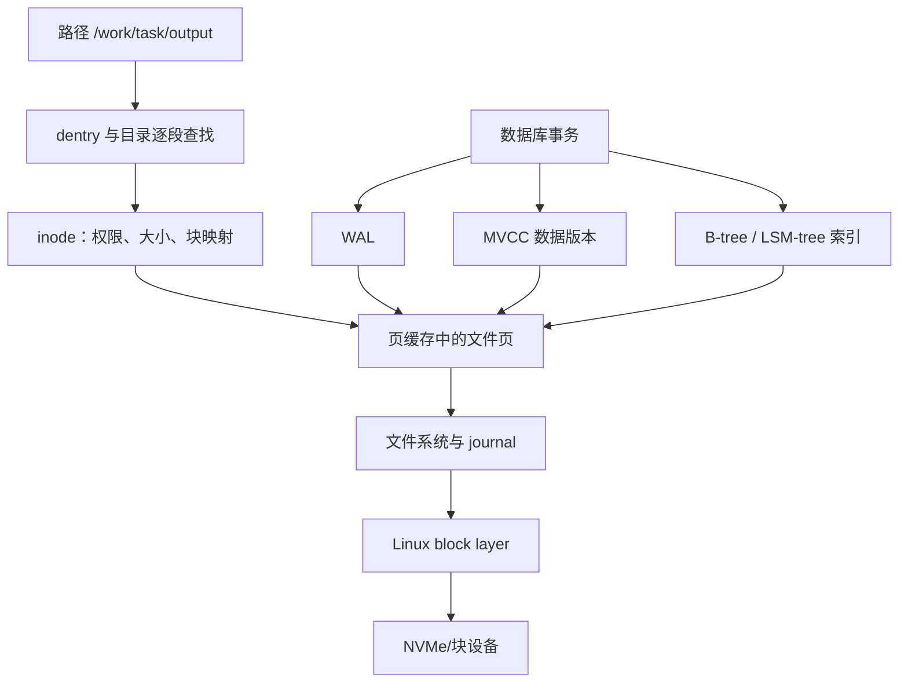

# 文件系统与数据库：从路径名到可恢复状态

把文件系统想成图书馆：路径是索书号，目录项是目录卡，inode 是书籍档案，数据块才是书的正文。数据库又在这座图书馆上增加了流水账、版本和索引，目的是在并发与崩溃后仍能回答“哪些修改算成功”。

Agent Infra 会频繁创建工作目录、写日志、保存 checkpoint、挂载共享卷和更新任务状态。只会调用 `write()` 不够；你还要知道数据停在哪一层、崩溃后能恢复什么。

## 1. 学习优先级

| 优先级 | 必须掌握 | 面试用途 |
|---|---|---|
| P0 | inode、dentry、路径解析、页缓存、`fsync` | 解释文件写入和“成功”语义 |
| P0 | journal、块层、NVMe、原子替换 | 解释崩溃恢复和 I/O 长尾 |
| P0 | WAL、事务、隔离级别、MVCC | 设计控制面状态库 |
| P0 | B-tree、LSM-tree、缓存一致性 | 解释读写放大与查询路径 |
| P1 | Direct I/O、异步 I/O、compaction、checkpoint | 深入性能与存储引擎 |

不要一开始背 ext4、XFS、PostgreSQL 的所有参数。先掌握“不变量”和端到端路径，再比较实现。

## 2. 概念地图



这张图强调层次，不代表每次读写都同步经过所有持久化动作。

## 3. 路径、dentry 与 inode

程序打开 `/work/task/output` 时，内核要逐段解析 `/`、`work`、`task`、`output`。dentry 可以理解成“名字到文件对象的目录缓存”；inode 保存文件类型、权限、大小、时间戳以及指向数据的元信息。

同一个 inode 可以有多个硬链接名字，所以“文件名”和“文件对象”不是同一个概念。删除一个名字也不一定立即释放数据：只要还有链接或进程持有打开的文件描述符，inode 仍可能存在。具体字段与语义见 [`inode(7)`](https://man7.org/linux/man-pages/man7/inode.7.html)和 [`path_resolution(7)`](https://man7.org/linux/man-pages/man7/path_resolution.7.html)。

这解释了两个常见现象：

- 进程删除大日志后，磁盘空间没有立刻回来，可能仍有进程打开它。
- 路径很深、目录含海量条目或元数据服务变慢时，小文件操作也会出现长尾。

## 4. 页缓存：写成功可能只是写进内存

普通 buffered I/O 常先把数据复制到内核页缓存，对应页面变成 dirty，之后由 writeback 写向存储。于是 `write()` 返回通常表示数据已被内核接受，不等于介质已经持久化。

[`write(2)`](https://man7.org/linux/man-pages/man2/write.2.html)还提醒：成功返回的字节数可能小于请求值，调用方必须处理 short write。磁盘满、配额、信号和底层错误都可能使写入不完整。

读取也可能命中页缓存。第一次读 1 GiB 文件需要设备 I/O，第二次更快，不能直接推断“磁盘突然变快”；实验必须说明缓存是冷还是热。

如果你想把这条路径从系统调用一直追到 VFS、Folio、脏页限流、blk-mq、DMA、NVMe 以及 Flush/FUA，请继续阅读[一次文件写入：从 `write()` 到真正落盘](file_write_path.md)。

## 5. `fsync`、原子可见与目录持久化

`fsync(fd)` 请求把文件数据和关联元数据刷新到存储，但它不自动保证包含该文件的目录项也已持久化。[`fsync(2)`](https://man7.org/linux/man-pages/man2/fsync.2.html)明确说明，新建或重命名文件需要对目录单独 `fsync` 才能同步目录项。

可靠替换配置或 checkpoint 的常见骨架是：

```text
在同目录创建临时文件
→ 完整写入并检查 short write
→ fsync(临时文件)
→ rename(临时文件, 正式文件)
→ fsync(父目录)
```

同一挂载文件系统中的 `rename` 可以按具体文件系统语义提供命名空间原子替换；跨文件系统不能依赖该保证。“读者看不到半个新文件”和“掉电后一定保留新名字”仍是两种不同承诺。

## 6. Journal 保护什么

journal 像文件系统的施工日志。修改复杂元数据前，先记录可恢复的信息；崩溃后重放已提交事务，避免文件系统结构停在半更新状态。

Linux 的 [ext4 JBD2 文档](https://www.kernel.org/doc/html/latest/filesystems/ext4/journal.html)说明：ext4 默认主要把元数据写入 journal；不同 data mode 对文件数据的保证不同。因此“有 journal”不能直接推出“刚写的业务数据绝不会丢”。

要区分：

- 文件系统一致：元数据结构可挂载、可遍历。
- 应用状态正确：业务记录满足自己的事务不变量。
- 数据持久：承诺成功的数据在目标故障模型下仍存在。

数据库的 WAL 正是为第三和第二类问题建立更明确的应用级恢复协议。

## 7. 从块层到 NVMe

文件系统把文件偏移映射到块，再通过 Linux block layer 向设备提交 I/O。设备可能是本地 NVMe、虚拟块设备、网络卷或多层映射；每层都有队列、缓存和失败模式。

NVMe 并不是“零延迟磁盘”。它减少了一些传统接口开销并支持并行队列，但仍可能受到队列积压、写放大、热节流、固件暂停、介质回收和上层同步写的影响。Linux NVMe 子系统入口见[内核 NVMe 文档](https://www.kernel.org/doc/html/latest/nvme/index.html)。

观察到设备利用率高时还不能立刻断言“盘坏了”：可能是工作负载从批量顺序写变成小随机同步写，也可能是上游重试放大。

## 8. WAL：先记流水账，再改正文

Write-Ahead Logging 的核心顺序是：描述修改的日志记录必须先达到所要求的持久点，数据页才可以随后慢慢落盘。崩溃后，数据库从日志重做已经承诺的修改。

[PostgreSQL WAL 介绍](https://www.postgresql.org/docs/current/wal-intro.html)说明了先写日志再写数据页的基本原则。WAL 让许多随机数据页写变成更连续的日志写，但会增加日志空间、恢复时间和 checkpoint 管理成本。

事务 `COMMIT` 返回前究竟等待到哪里，是持久性与延迟的重要取舍。异步提交可能更快，但故障窗口更大；面试回答必须先定义故障模型和承诺。

## 9. MVCC：让读者看到合适的版本

Multiversion Concurrency Control（多版本并发控制）不是“完全没有锁”，而是通过保留多个行版本和快照，减少读写之间不必要的阻塞。[PostgreSQL MVCC 文档](https://www.postgresql.org/docs/current/mvcc-intro.html)给出了其一致性视图。

一个事务读取余额时，可能看到事务开始时可见的旧版本；另一个事务同时写入新版本。旧版本不能立即删除，因为仍可能有读者需要它。这会带来版本清理、空间膨胀和长事务问题。

隔离级别决定允许看到哪些并发现象。不要只背“读已提交、可重复读、串行化”名称，要能举出脏读、不可重复读、幻读或写偏斜，并说明数据库具体实现可能比标准最低要求更强。

## 10. B-tree 与 LSM-tree

B-tree 是多路平衡搜索树，适合点查、范围扫描和有序访问。PostgreSQL 的 [B-tree 官方文档](https://www.postgresql.org/docs/current/btree.html)也说明了比较操作与索引条目的关系。

LSM-tree 把写入先积累在内存和顺序结构中，再分层合并到磁盘。原始 [LSM-tree 论文](https://doi.org/10.1007/s002360050048)讨论了为高插入负载减少昂贵随机访问的思路。

| 维度 | B-tree 直觉 | LSM-tree 直觉 |
|---|---|---|
| 写入 | 原地附近更新树页 | 追加后后台合并 |
| 点查 | 路径稳定 | 可能查多层，常借助过滤器 |
| 范围扫描 | 天然有序 | 需要合并多层有序结果 |
| 后台成本 | 页分裂与维护 | compaction、写放大和空间放大 |

不是“写多就一定选 LSM”。延迟目标、范围查询、存储介质、放大系数和运维成熟度都要实测。

## 11. 事务、缓存与一个数字例子

假设每个 Agent step 更新一次任务状态，并写 4 KiB WAL。平台每秒完成 5,000 step：

```text
仅 WAL 逻辑写入量 = 5,000 × 4 KiB ≈ 19.5 MiB/s
```

这只是下界。还要加入 WAL 头、对齐、索引更新、复制、checkpoint、文件系统/设备写放大，以及某些引擎和配置中的 page image/full-page write。若每个事务都单独等待 1 次持久化，延迟可能受设备同步点支配；group commit 可以合并等待，但会引入批次与排队取舍。

缓存同样是正确性协议：

- cache-aside 读取未命中后加载，更新时要处理失效窗口。
- write-through 先经过缓存层写后端，路径更长。
- write-back 延后落盘，性能高但恢复责任更重。

缓存键必须包含租户、版本和权限边界。Agent 读取到别的租户或旧 checkpoint，不是普通 miss，而是安全或正确性事故。

## 12. Linux 可观察证据

先用只读命令确认“文件在哪一层”：

下面的 `/path/to/file` 是**占位符**，不是要求你原样执行的路径。请把它替换成已获授权的测试文件；这个字面路径通常并不存在。

```bash
# 占位符：把 /path/to/file 换成你有权检查的测试文件
stat /path/to/file
namei -l /path/to/file
findmnt -T /path/to/file
lsblk -o NAME,TYPE,SIZE,FSTYPE,MOUNTPOINTS
grep -E 'Dirty|Writeback|Cached' /proc/meminfo
iostat -xz 1 5
```

- `stat` 看 inode 元数据，`namei` 看逐段路径权限。
- `findmnt` 和 `lsblk` 识别挂载与块设备关系。
- `/proc/meminfo` 给出系统级 dirty/writeback 线索。
- `iostat` 观察设备吞吐、队列和延迟趋势，不能单独证明应用根因。

工具可能未预装，也可能因容器权限受限；`iostat` 通常来自 `sysstat` 包。“命令不存在”不是机制不存在。

再用有边界的 syscall 观察：

`your_test_program` 同样是**占位符**，要替换成自己可控、短命且不会接触敏感数据的测试命令。

```bash
# 占位符：把 your_test_program 换成有界的测试命令
strace -f -ttT -e trace=openat,write,fsync,fdatasync,rename your_test_program
```

`strace` 会增加开销并可能暴露路径或参数，只用于授权的测试进程。不要对生产数据库随意附加。尤其不要把 `fio` 指向裸设备；写盘基准应在可丢弃的隔离目录或专用测试卷中进行。

## 13. 与 Agent Infra 的联系

Agent 平台至少要分开四类数据：只读基础镜像、任务临时工作区、共享卷、不可变制品/checkpoint。每类数据的寿命、共享范围、持久性和恢复目标不同。

控制面数据库还要回答：

- task、attempt、sandbox、lease 谁是主记录？
- 状态更新与消息投递怎样避免丢一个或重复一个？
- checkpoint 对象写完后，引用何时才可见？
- 旧 worker 如何被 fencing token 永久拒绝？
- 数据库恢复到旧时间点时，对象存储和运行中沙箱怎样对账？

这些是通用设计问题，不代表 DeepSeek 使用某一种文件系统、数据库或设备。

## 14. 常见误区

1. **“`write` 返回就是落盘。”** 它可能只进入页缓存。
2. **“`fsync(file)` 保证新文件名存在。”** 父目录项还需要考虑。
3. **“journal 保护所有业务数据。”** journal mode 和应用协议决定实际保证。
4. **“MVCC 不用锁。”** 写冲突、元数据和约束仍可能需要锁。
5. **“B-tree 读快，LSM 写快。”** 这是起点，不是脱离 workload 的结论。
6. **“缓存只是性能优化。”** 陈旧、越权和恢复都会让缓存成为正确性边界。

## 15. 面试怎么答

### 30 秒答案

> 路径先经 dentry 逐段解析到 inode，普通写常先进入页缓存，再由文件系统、journal、块层和设备持久化。`write`、原子可见和持久化不是一回事；可靠替换通常要临时文件、文件 `fsync`、`rename` 和目录 `fsync`。数据库在其上用 WAL 定义恢复顺序、用 MVCC 管理并发版本、用 B-tree 或 LSM 组织查询。排障时我会先确认路径和挂载，再看 dirty 页、syscall、设备队列与数据库等待。

### 常见追问

- 为什么删除文件后空间可能没有释放？
- `rename` 原子为什么仍不等于掉电持久？
- journal 与 WAL 分别保护哪一层？
- MVCC 为什么会产生膨胀？
- B-tree 与 LSM 的读写放大怎样比较？
- checkpoint 对象与数据库引用怎样原子发布？

## 16. 章末自测

1. 画出 `/a/b/c` 从路径到设备的写入链路。
2. 写出可靠替换一个 JSON 状态文件的步骤。
3. 解释文件系统一致与业务事务正确的区别。
4. 用一个余额例子解释 MVCC 快照和写冲突。
5. 根据查询模式选择 B-tree 或 LSM，并写出反例。
6. 看到 I/O p99 上升时，列出应用、文件系统、块层、设备四层证据。

## 17. 本章小结

- dentry 管名字，inode 管文件元数据，数据页再映射到底层块。
- 页缓存提高吞吐，也让“写成功”和“持久化”分离。
- journal 保文件系统恢复，WAL 保数据库事务恢复；二者不能互相替代。
- MVCC、索引和缓存都用额外空间与后台工作换取并发或速度。
- Agent Infra 必须明确临时数据、共享状态和 checkpoint 的不同承诺。

## 一手资料

- [`inode(7)`](https://man7.org/linux/man-pages/man7/inode.7.html)、[`path_resolution(7)`](https://man7.org/linux/man-pages/man7/path_resolution.7.html)、[`write(2)`](https://man7.org/linux/man-pages/man2/write.2.html)、[`fsync(2)`](https://man7.org/linux/man-pages/man2/fsync.2.html)与 [`rename(2)`](https://man7.org/linux/man-pages/man2/rename.2.html)
- [Linux ext4 journal 文档](https://www.kernel.org/doc/html/latest/filesystems/ext4/journal.html)
- PostgreSQL：[WAL](https://www.postgresql.org/docs/current/wal-intro.html)、[MVCC](https://www.postgresql.org/docs/current/mvcc-intro.html)、[事务隔离](https://www.postgresql.org/docs/current/transaction-iso.html)与 [B-tree](https://www.postgresql.org/docs/current/btree.html)
- [The Log-Structured Merge-Tree 原始论文](https://doi.org/10.1007/s002360050048)
