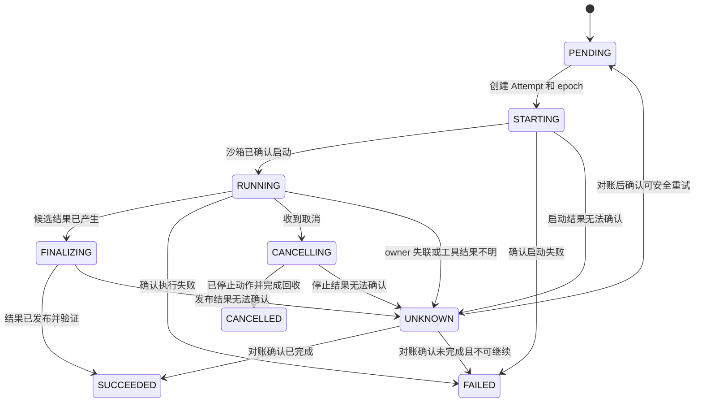

# Agent 的权威状态、Checkpoint 与恢复

worker 完成了工具调用，却在写回任务状态前崩溃。调度器只看到 `RUNNING`，不知道动作没有发生、已经成功，还是仍在远端执行。Agent 控制面的核心问题因此不是“选哪种磁盘”，而是：**哪些记录是权威事实，谁仍有推进任务的权限，无法确认的外部结果怎样收口。**

文件、页缓存、`write()` 与 `fsync()` 由共享册的[一次文件写入](../../rust-hft/foundations/file_write_path.html)主讲；表和索引见[关系模型与 SQL](../../rust-hft/databases/relational_sql.html)与[存储、索引和查询执行](../../rust-hft/databases/storage_indexes.html)。本章只讨论这些机制进入 Agent 控制面后新增的状态与恢复协议。

## 1. 先分清五种身份与四类状态

- **Task** 是用户想完成的一次逻辑任务；重试后仍是同一个 Task。
- **Attempt** 是 Task 的一次执行尝试；旧 Attempt 失败后可以创建新 Attempt。
- **lease**（租约）是在一段有限时间内推进 Attempt 的权利；**epoch** 是每次重新授权时单调递增的编号，让资源端通过 fencing（栅栏检查）拒绝旧 worker。
- **operation ID** 标识一次可能产生外部副作用的逻辑动作，例如发信或创建工单。
- **Checkpoint** 是 Attempt 在某个执行位置发布的可恢复保存点。

这些身份不能合并成一个 `task_id`。否则系统无法区分“同一任务的第二次尝试”和“第一次尝试的迟到结果”，也无法判断一次外部动作是否已经执行。

| 状态类别 | 例子 | 保存与恢复要求 |
|---|---|---|
| 权威控制状态 | Task 当前状态、active Attempt、lease epoch、状态版本 | 由明确事务和条件更新维护；恢复决策以它为准 |
| 可重建状态 | 缓存、派生索引、临时统计 | 丢失后能从权威记录或事件重新生成 |
| 不可变大对象 | Checkpoint 内容、模型输出、构建产物 | 放对象存储；数据库保存对象引用、大小、哈希和发布状态 |
| 外部副作用 | 邮件、支付、第三方工单 | 本地事务通常管不到；保存 operation ID、请求和结果收据并对账 |

**权威状态**是组件发生争议时，恢复程序最终相信的记录。它可以在数据库内部有多个物理副本，但在逻辑上必须只有一套判定规则；不能同时把缓存、队列和数据库都当成各自独立的“真相”。

## 2. 通用事务、WAL 与 Outbox 在这里负责什么

**事务**把一组数据库读写作为一个提交单位，并用隔离机制保护并发不变量。**WAL**（Write-Ahead Log，预写日志）让数据库在崩溃后恢复自己已经提交的状态。它们的完整机制分别见[事务与并发控制](../../rust-hft/databases/transactions_concurrency.html)和[WAL、恢复、复制与分片](../../rust-hft/databases/wal_recovery_replication.html)。WAL 只恢复数据库管理的内容，不会证明对象存储上传或第三方 API 已经成功。

**Outbox** 是把业务状态和“待发送事件”写进同一数据库事务，再由发布器重试发送的表或记录。它收口“状态已提交、事件却没发出”的窗口，但消费者仍可能收到重复事件；完整的幂等、Saga 与对账机制见[可靠性与跨服务事务](../../rust-hft/distributed/reliability_transactions.html)。

Agent 领取任务时，下面四步应成为一个数据库事务：

```text
确认 Task 仍为 PENDING，且 version 没有变化
→ 创建新的 Attempt
→ 为 Attempt 分配更大的 lease epoch
→ 把 Task.active_attempt_id 指向它并改为 STARTING
```

如果四步分开提交，崩溃可能留下“Task 已运行但没有 owner”或“Attempt 已创建但仍可被第二个 worker 领取”。更新还应带旧状态、旧版本和 active Attempt 条件；影响 0 行表示前提已经变化，调用者必须重新读取，不能覆盖新 owner。

## 3. 状态机让每次恢复都有依据



`UNKNOWN` 表示现有证据不足，既不是成功，也不是失败。创建新 Attempt 前，受控资源必须已经拒绝旧 epoch，未决外部动作也应先得到确定结论。若某个动作仍为 UNKNOWN，只有新 Attempt 会沿用同一幂等 operation ID、并且不会绕过该未决步骤重复副作用时才能继续；否则必须停留在对账或人工处理。新的尝试沿用 Task ID，但取得更大的 epoch。

每次状态转换至少保存：

- Task、Attempt 和当前 epoch；
- 旧状态、新状态与状态版本；
- 触发原因、操作者和时间；
- 关联的 Checkpoint、产物与 operation ID；
- 可供恢复程序查询的沙箱或外部系统标识。

旧 worker 即使恢复，也只能提交旧 epoch。数据库条件更新和资源端的 fencing 检查都应拒绝它，防止迟到结果覆盖新 Attempt。

## 4. Checkpoint 是内容与元数据共同发布

Checkpoint 不是“某个路径下看起来有文件”，而是**内容对象、执行位置和已发布元数据**的组合。一个可恢复 Checkpoint 至少包含：

- Checkpoint ID、Task、Attempt 与 lease epoch；
- 对象位置、字节数、内容哈希和格式版本；
- 代码、模型、依赖和配置版本；
- 已完成到哪个 step 或事件序号；
- 已确认的外部 operation ID 与结果收据；
- `WRITING`、`READY` 或 `INVALID` 等发布状态。

安全发布可以按下面的顺序进行：

1. 为当前 Attempt 创建 `WRITING` 元数据，记录预期对象和 epoch。
2. 把内容写到不可变临时对象；中途崩溃不会覆盖旧 Checkpoint。
3. 校验大小、哈希、格式和依赖版本，必要时做一次恢复试读。
4. 在数据库事务中确认 Attempt 与 epoch 仍有效，把对象标成 `READY`，再条件更新 Task 的 Checkpoint 指针。
5. 后台清理长期停在 `WRITING`、又没有被任何 `READY` 指针引用的对象。

对象存储写入和数据库事务通常没有共同提交点，所以步骤 2 与步骤 4 之间必须允许崩溃。先发布内容、后切换元数据指针，可以让读者始终看见旧的完整版本或新的完整版本，而不是半个上传对象。

## 5. 外部副作用的 UNKNOWN 必须单独对账

RPC 超时只说明调用方没有按时收到结果，不说明远端没有执行。对发信、支付、发布或创建工单等动作，执行前应生成稳定的 operation ID，并记录目标、参数摘要和 Attempt；重试时继续使用同一个逻辑 ID，而不是生成一笔“新动作”。

对账可能得到三种结论：

1. **确认成功**：保存远端收据，并推进本地状态。
2. **确认未发生**：在权限、预算和重试政策允许时重新执行。
3. **仍然未知**：保持 `UNKNOWN` 或 `WAITING_RECONCILIATION`，继续查询或转人工处理。

只有远端明确支持同一 operation ID 的幂等语义，重复调用才不会产生第二份副作用。若远端没有查询接口、幂等键或补偿方法，平台就不能用“多重试几次”假装获得确定性。

## 6. 控制面重启后的恢复顺序

1. 数据库先用自己的 WAL 恢复到已提交状态；控制面再从这个权威状态开始工作。
2. 找出 lease 已过期、owner 失联或长时间停在 `STARTING`、`FINALIZING` 的 Attempt。
3. 比较 Task 的 active Attempt 与 epoch；先 fencing 旧 owner，再决定是否允许新 Attempt。
4. 按保存的标识查询沙箱、对象存储和外部工具，不能只根据心跳缺失猜结果。
5. 只使用状态为 `READY` 且哈希、版本均匹配的 Checkpoint；未发布对象进入延迟清理。
6. 对每个 UNKNOWN operation 查询收据：确认成功、确认未发生或继续保持未知。
7. 重放未发布的 Outbox 事件；消费者按事件 ID 去重。
8. 只有完成上述对账后，才创建更高 epoch 的 Attempt 或把 Task 收口到最终状态。

恢复程序本身也可能中途崩溃，因此每一步都要可重复执行。相同输入再次运行应保持原结果或继续向前，这种性质叫**幂等**；它不等于所有外部服务天然支持幂等。

## 7. 持久化不等于业务完成

需要区分四个完成点：

1. 客户端库已经接收本地数据；
2. 数据库事务已经提交；
3. Checkpoint 内容和 `READY` 元数据都达到各自承诺的持久边界；
4. 用户能够读取经过验证的完整结果，必要外部副作用也已有确定结论。

例如数据库已经写入 `SUCCEEDED`，但结果对象随后校验失败，业务仍不完整。更安全的做法是先进入 `FINALIZING`，验证对象可读、元数据已发布且必要 operation 有收据后，再条件更新为 `SUCCEEDED`。

## 8. 常见误区

1. **“数据库提交就是所有外部操作一起提交。”** 对象存储和第三方 API 通常不在本地事务内。
2. **“WAL 能恢复整个 Agent 世界。”** 它恢复数据库；沙箱、对象和外部副作用仍需查询与对账。
3. **“Checkpoint 文件存在就能恢复。”** 还要有 `READY` 元数据、哈希、版本、执行位置和有效 Attempt。
4. **“超时就是失败，可以直接开新 Attempt。”** 旧 worker 或远端动作可能仍在运行，必须先 fencing 和对账。
5. **“队列会保证消息只来一次。”** 崩溃恢复常造成重复投递，消费者仍需按事件 ID 幂等处理。
6. **“Task 和 Attempt 用一个状态就够了。”** Task 可以继续存在，而某次 Attempt 已失败、失联或被接管。

## 9. 30 秒面试答案

> 我会先区分 Task、Attempt、lease epoch、Checkpoint 和外部 operation，再把状态分成权威控制状态、可重建状态、不可变大对象和外部副作用。任务领取用数据库事务和条件更新保护 active Attempt，资源端用 epoch 拒绝旧 worker。Checkpoint 先写不可变内容并校验，再原子发布 `READY` 元数据指针。超时结果进入 UNKNOWN，按 operation ID 查询远端收据，不能盲目重试。重启后以数据库已提交状态为起点，依次 fencing、检查 Checkpoint、对账副作用、重放 Outbox，最后才创建新 Attempt 或进入最终状态。

## 10. 做题方法：从权威状态和 checkpoint 恢复

1. 先分别编号 task、attempt、sandbox、checkpoint 和外部 operation，标出数据库、对象存储、工作目录中哪一份是每类状态的权威来源。
2. checkpoint 按两阶段推演：先把内容写到不可变对象并校验大小/hash，再在数据库事务中发布指向该对象的元数据。若内容上传失败，元数据不能可见；若元数据提交失败，未引用对象只能作为可回收垃圾。
3. 为工作流状态画允许转移，并给每次转移写预期旧版本。恢复进程只能根据持久状态重建，不能从临时目录“看起来有文件”推断业务已提交。
4. 外部副作用使用 `NOT_STARTED / IN_FLIGHT / SUCCEEDED / UNKNOWN`。在远端成功、写本地结果前崩溃时，恢复逻辑应先按稳定 operation ID 查询或对账，不能直接生成新 ID 重试。
5. 控制面重启时按“加载权威状态—核对 lease/owner—验证 checkpoint—查询 UNKNOWN—重新排队可重试步骤”执行，并把孤儿目录、孤儿对象放入延迟回收清单。

验算点：任何已发布 checkpoint 都指向完整可校验的内容根；共享内容对象的每条引用都可追踪，回收前引用计数或可达性扫描结果为零；恢复不会让已完成副作用重复发生；临时文件存在与业务完成状态始终分离。

## 11. 章末自测

1. Task 与 Attempt 为什么不能共用一个身份和状态？
2. 权威状态可以有数据库副本，为什么仍说逻辑上只有一个事实源？
3. 领取任务的哪四步必须在同一事务中完成？
4. WAL 能恢复哪些状态，为什么不能证明第三方 API 已成功？
5. Checkpoint 为什么需要 `WRITING → READY` 发布协议？
6. RPC 超时后，对账可能得到哪三种结论？
7. lease 和 epoch 分别解决重新分配与旧 owner 写入的什么问题？
8. 为什么恢复程序必须幂等，而且仍不能假设外部副作用幂等？

### 参考答案与解答

<details>
<summary>展开答案</summary>

1. **Task 表示逻辑目标，Attempt 表示一次执行历史。** 同一个 Task 可以先后有多个 Attempt；若二者共用身份，系统就无法区分“第一次尝试的迟到结果”和“第二次尝试的当前结果”，也无法保留每次失败、资源使用和 Checkpoint 证据。Task 指向当前 active Attempt，只有当前 epoch 的 Attempt 能推进状态。
2. **物理副本可以很多，判定规则只能有一套。** 数据库主从、日志和备份都可以保存同一事实的副本，但它们必须服从同一个提交顺序和一致性协议。若缓存说 `RUNNING`、队列说待领取、数据库说 `SUCCEEDED`，恢复程序必须预先规定相信谁；否则“副本”就变成三个互相冲突的事实源。
3. **四步是：**确认 Task 仍为 `PENDING` 且 version 未变；创建新的 Attempt；为它分配更大的 lease epoch；把 `Task.active_attempt_id` 指向该 Attempt 并把 Task 改成 `STARTING`。把四步放在同一事务中，其他并发领取者只能看到提交前或提交后的完整状态，不会看到“有 Attempt 无 owner”等半成品。
4. **WAL 恢复数据库自己已提交的数据页和事务结果。** 它可以恢复 Task、Attempt、epoch、Outbox 等数据库记录，却没有包含第三方系统内部是否发送邮件或完成支付的事实。第三方调用必须靠稳定 operation ID、远端收据或对账接口确认。
5. **它把“内容写完”和“对读者可见”分成两个阶段。** 上传期间只处于 `WRITING`；大小、哈希、格式和版本校验全部成功，而且发布事务确认当前 Attempt/epoch 仍有效后，才切到 `READY` 并更新指针。任一处崩溃时，读者仍使用旧的完整 Checkpoint；未被引用的半成品以后清理，不会被误当成恢复点。
6. **三种结论是确认成功、确认未发生、仍然未知。** 确认成功就保存收据并推进状态；确认未发生且策略允许时才可重试；仍未知则保持 `UNKNOWN`/`WAITING_RECONCILIATION`，继续查询或交给人工，不能猜测。
7. **lease 处理时间，epoch 处理迟到写。** lease 到期后允许把 Attempt 重新分配给新 worker，但旧 worker 可能只是网络隔离并未停止。新授权得到更大的 epoch，数据库和资源端拒绝旧 epoch，于是旧 owner 即使恢复也不能覆盖新状态。
8. **恢复程序可能在任一步再次崩溃，所以自身动作必须可重复。** 例如重复扫描同一 Outbox 记录或同一孤儿对象不能创建第二份业务结果。可是“恢复程序幂等”只约束本地实现，不能自动改变第三方 API；若远端不支持幂等键或查询，重复付款仍可能付款两次。因此本地用相同 operation ID 记录意图，远端能力不足时必须对账、补偿或人工处理。

</details>

## 本章小结

- Task 表示逻辑任务，Attempt 表示一次尝试，epoch 保护当前 owner。
- 数据库事务维护控制面不变量；WAL 只恢复数据库管理的已提交事实。
- Checkpoint 必须先完成内容校验，再发布 `READY` 元数据指针。
- 外部结果无法确认时进入 UNKNOWN，并用稳定 operation ID 查询和对账。
- 恢复流程先 fencing 和收集证据，再决定继续、重试或结束。
