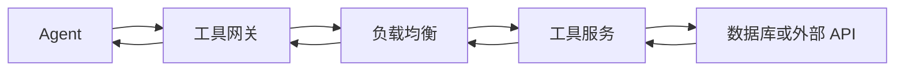

# Agent 的 RPC、重试与工具网络

Agent 调用一个“查询订单”工具时，代码看起来像一次函数调用，真实路径却跨越网络、网关和另一个服务。调用方超时后，远端可能完全没收到请求，也可能已经完成查询或写入，只是响应没有回来。

本章回答：**怎样为 Agent 工具调用设计协议、deadline、重试和出口安全，并在失败时说明结果是否确定。**

如果 IP、路由、TCP、socket 或网络 I/O 还不熟悉，先读第一册的[网络基础](../../rust-hft/network/basics.html)与[网络 I/O 模型](../../rust-hft/network/io_models.html)。链路层到传输层的通用原理统一放在那里；这里从 RPC 开始。

## 1. 先认识一条工具调用链

RPC 是 Remote Procedure Call，意思是“通过网络请求另一个服务执行操作”。它让代码看起来像调用函数，但仍保留网络可能延迟、断开和重复的事实。



- **工具网关**负责验证工具名、参数、调用者身份和策略。
- **负载均衡**把请求分给多个健康服务实例，避免所有请求只到一台机器。
- **工具服务**真正执行业务动作，例如查询数据或创建工单。

每一跳都有排队和失败可能，所以“网络通”不等于“工具调用成功”。

## 2. TLS、HTTP 和 gRPC 各做什么

- **TLS** 提供传输加密和对端身份校验。这里需要它，是为了避免令牌、参数和结果被中间人读取或篡改。
- **HTTP** 定义请求方法、头、状态码和响应等应用语义。JSON over HTTP 易于人工调试，常用于公开工具接口。
- **gRPC** 用预先定义的消息和服务接口进行 RPC，常用于内部强类型调用和流式结果。

HTTP 和 gRPC 是接口选择，不是可靠性保证。无论选择哪一个，都要另外定义鉴权、版本、大小上限、deadline、幂等和错误分类。

负载均衡也不能保证一次操作只执行一次。连接可能在服务端提交后断开，下一次重试又被分到另一台实例。

## 3. 错误必须按阶段分类

把所有失败都记录成 `tool_error`，排障时几乎没有信息。最少应区分：

| 阶段 | 例子 | 调用方能否确定业务未发生 |
|---|---|---|
| 连接前 | 域名无法解析、连接被拒绝 | 通常较确定请求未到服务 |
| 建立安全连接 | 证书或 TLS 校验失败 | 通常较确定应用请求未执行 |
| 发送或等待中 | 连接中断、deadline 到期 | 不确定，远端可能已经收到 |
| 服务响应 | 参数错误、权限不足、限流 | 由明确错误码决定是否可重试 |
| 业务结果 | 支付被拒绝、记录冲突 | 通常不应当成网络错误重试 |

“通常”不是绝对证明，所以高风险副作用仍应使用 operation ID 查询权威结果。

## 4. deadline 是整个调用的预算

假设用户给一次工具调用 2 秒预算：

```text
网关排队 150 ms
连接与 TLS 200 ms
服务排队 300 ms
业务执行 900 ms
返回与解析 150 ms
合计 1,700 ms，剩余 300 ms
```

下游收到的应是同一个截止时刻或剩余预算，而不是新的 2 秒。这样服务可以在预算不足时尽早拒绝，避免完成一个调用方已经不再等待的昂贵操作。

需要区分：

- connect timeout：最多等多久建立连接；
- idle timeout：流式调用多久没有新数据就认为停滞；
- total deadline：整个业务调用最晚何时结束。

这些名字存在的原因是故障动作不同：连不上可以换实例，长流暂时没数据可能仍正常，业务总预算耗尽则应停止继续扩张工作。

## 5. 什么时候可以重试

重试前同时回答四个问题：

1. **错误是否暂时性？** 例如短暂过载可能恢复，参数错误不会靠重试变正确。
2. **是否还有 deadline 预算？** 没有预算的重试只会增加无用负载。
3. **操作是否可安全重复？** 查询通常容易重复，创建订单未必。
4. **系统是否允许这次重试？** 全局重试预算防止所有客户端一起放大故障。

幂等表示相同意图重复执行后，业务结果与执行一次相同。常见做法是让调用方生成稳定的 `operation_id`，服务端保存它与结果的对应关系；后续相同 ID 返回原结果，而不是再次产生副作用。

重试还应使用退避和随机抖动。退避让两次尝试之间逐渐等待更久；抖动让大量客户端不要在同一毫秒再次冲击服务。

## 6. 为什么重试会放大故障

假设 Agent、网关和工具服务三层都“失败后最多再试 2 次”，一次最初调用在最坏情况下可能触发：

```text
3 × 3 × 3 = 27 次下游尝试
```

过载时这 27 次尝试进一步占用队列，让更多原始请求超时并重试，形成正反馈。更稳妥的设计是只在最了解业务语义的一层重试，并传递 attempt 编号和剩余预算。

## 7. 工具出口为什么默认受限

egress 是工作负载主动向外发起的网络流量。Agent 会处理用户提供的 URL 和代码，因此不能默认允许它访问宿主机能访问的一切。

最小出口策略包括：

- 默认拒绝内网控制面、宿主机服务和云元数据地址；
- 按工具、租户和任务配置允许的目标与端口；
- DNS 把域名转换为 IP 地址；解析后仍要按实际目标地址执行策略，不能只检查原始域名文本；
- HTTP 重定向到新地址时重新检查策略；
- 限制连接数、请求数、响应大小和总流量；
- 不把平台长期凭证直接交给不可信沙箱，改用短期、最小权限凭证；
- 记录 task、tool、目标、结果和策略决定，供审计与追责。

SSRF 是 Server-Side Request Forgery，指攻击者借服务端的网络权限请求本来无法访问的地址。这里限制出口，就是为了让 Agent 不能被提示或不可信网页诱导去探测内网与秘密服务。

## 8. 长任务与流式结果

工具可能持续返回编译日志或训练进度。流式连接断开后，如果客户端只能从头重试，就可能重复昂贵工作。

更可恢复的协议会提供：

- 稳定的 operation ID；
- 单调递增的事件序号或 cursor；
- 客户端确认已消费到的位置；
- 重新连接后从该位置继续；
- 有界缓冲和慢消费者处理策略。

cursor 是“已经读到哪里”的位置标记。它不需要暴露底层存储实现，只需在协议中具有明确、稳定的恢复语义。

## 9. 怎样建立诊断证据

每次工具调用至少传播同一个 trace ID，并记录：

- task、tool、operation ID 和 attempt；
- 排队、连接、TLS、首字节、服务执行和总耗时；
- 请求与响应大小，不记录秘密正文；
- deadline、错误阶段和是否重试；
- 实际目标服务与策略决定。

trace 是把同一次请求跨服务片段关联起来的记录。先用 trace 找到慢在哪一段，再去第一册使用网络和性能工具验证；不要先抓包再猜它对应哪个用户请求。

## 10. 常见误区

1. **“TCP 可靠，所以 RPC 恰好执行一次。”** TCP 管字节传输，不管理业务副作用。
2. **“超时说明远端没有执行。”** 响应可能在返回途中丢失。
3. **“所有 HTTP 5xx 服务端错误都应该重试。”** 没有预算或不幂等时，重试可能更糟。
4. **“有 TLS 就可以访问任意地址。”** TLS 保护传输，不决定目标是否被授权。
5. **“只允许域名就足够安全。”** 最终地址和重定向仍需要重新校验。
6. **“流式 RPC 断开后从头开始最简单。”** 对有副作用或昂贵任务，这会制造重复工作。

## 11. 30 秒面试答案

> 我把工具调用拆成网关、负载均衡、工具服务和业务依赖，并为整条链传递同一个 deadline。错误按连接前、传输中、服务响应和业务结果分类；只有错误暂时、仍有预算且操作幂等时才重试。副作用使用稳定 operation ID 去重或查询，避免把 TCP 可靠误解成业务恰好一次。Agent 出口默认拒绝内网和元数据服务，对 DNS 结果与重定向重新校验，并限制连接、流量和凭证权限。跨服务用 trace ID 关联每次 attempt。

## 12. 章末自测

1. RPC 为什么看似函数调用，却不能拥有本地函数相同的失败语义？
2. TLS、HTTP/gRPC 和负载均衡分别解决什么问题？
3. 超时后为什么不能直接断言操作未发生？
4. 一次安全重试需要满足哪四个条件？
5. 三层各重试两次为什么可能产生 27 次尝试？
6. Agent 的 URL 工具怎样防止访问内网服务？

## 本章小结

- RPC 仍然受网络延迟、断开、重复和部分失败影响。
- deadline 应沿整条调用链传递剩余预算。
- 重试必须结合错误分类、幂等、退避和全局预算。
- operation ID 让不确定结果可以查询和去重。
- Agent 工具网络需要默认拒绝、最小权限、资源上限和审计。
