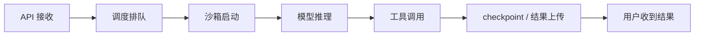

# Agent 的性能目标、容量与跨层诊断

用户说“Agent 很慢”，这句话还不能指导排障。它可能在等模型首个 token、等沙箱启动、等工具服务、等队列，或者已经失败后反复重试。性能工作的第一步不是打开某个工具，而是把“慢”变成有上下文、可分解的指标。

本章回答：**Agent 平台应测什么、怎样估算容量、如何在多租户过载时保护系统，以及怎样从一次超时找到第一处证据。**

通用的 p99、性能采样和 Linux 工具使用统一放在第一册的[性能分析](../../rust-hft/optimization/profiling.html)与[指标系统](../../rust-hft/infrastructure/metrics.html)。本章只讲 Agent 工作负载特有的指标和推理顺序。

## 1. 从 SLI 和 SLO 开始

SLI 是 Service Level Indicator，即实际测得的服务指标；SLO 是 Service Level Objective，即团队希望这个指标达到的目标。

例如：

```text
SLI：过去 7 天，成功 run 中有多少在 60 秒内开始执行
SLO：至少 99% 在 60 秒内开始执行
```

这比“调度很快”清楚，因为它包含时间窗、样本、成功定义和阈值。Agent 平台至少按层定义：

| 层次 | 典型 SLI | 它回答什么 |
|---|---|---|
| run | 成功率、端到端时长、取消完成时间 | 用户最终体验怎样 |
| step | 排队时间、执行时间、重试次数 | 哪个步骤拖慢 run |
| model | 首 token 时间、每 token 时间、生成长度 | 模型服务慢在等待还是生成 |
| tool | 调用成功率、deadline 超时、结果未知率 | 外部依赖是否稳定 |
| sandbox | 启动时间、OOM、输出截断、回收时间 | 执行环境是否成为瓶颈 |
| node | 资源压力、可用容量、驱逐数 | 宿主机是否过载 |

指标必须带 task 类型、版本和结果等上下文，但不要把用户输入正文、密钥或无限 task ID 直接做指标标签；那会泄露数据，并产生高基数，也就是标签取值数量多到难以存储和查询。

## 2. 一次 run 的延迟怎样分解



端到端时长应拆成这些阶段，并用同一个 trace ID 关联。trace 是一次请求跨组件的时间线；它存在的目的，是回答“这一秒花在哪里”，而不是只收集更多日志。

同一指标还要按冷启动、任务类型、输入规模、租户等级和成功/失败拆分。冷启动指运行环境尚未准备好、必须先加载依赖或创建沙箱的首次启动。把毫秒级健康检查和小时级代码任务混在一个 p99 中，得到的数字没有明确业务含义。

## 3. Agent 容量是一组资源，不是 CPU 一个数

resource vector（资源向量）表示一个任务同时需要的多种资源：

```text
CPU 时间、内存 working set（近期持续使用的内存）、临时盘容量与每秒 I/O 操作数（IOPS）、
网络带宽、进程数、文件数、模型并发和工具调用配额
```

一台节点还有 40% CPU，不代表还能接收新任务；它可能已经没有足够内存，或临时盘 I/O 正在饱和。调度和容量估算必须检查整个向量中的限制项。

对稳定流量，可以用一个基础关系建立量级直觉：

```text
平均在途任务数 ≈ 每秒完成任务数 × 平均任务时长
```

如果每秒开始 20 个任务，平均运行 30 秒，平均在途约 600 个。这个数不是最终容量，因为任务时长和内存可能有长尾，还要加入峰值、故障余量和每租户公平性。

## 4. 为什么平均值会掩盖风险

假设 99 个任务各用 1 GiB，1 个任务用 40 GiB：平均约 1.39 GiB。若按平均值装箱，大任务同时到达时仍会 OOM。

因此容量至少同时看：

- 中位数，了解典型任务；
- p95/p99，表示约 95%/99% 的样本不超过该值，用来观察高分位任务；
- 最大值与异常输入，决定硬上限；
- 随时间变化的峰值，判断启动和 checkpoint 突发；
- 成功、失败和取消任务各自消耗，因为失败也可能占用大量资源。

p99 是“约 99% 样本不高于这个值”的分位数，不是最慢请求，也不会自动解释原因。具体统计方法与测量陷阱请回到通用性能章节。

## 5. 准入控制保护正在运行的任务

admission control（准入控制）是在资源不足时决定“现在是否接收新工作”。它与扩容互补：扩容需要时间，准入必须立即阻止队列和资源继续恶化。

触发信号可以包括：

- 队列最老任务等待时间超过目标；
- 节点内存或 I/O 压力持续升高；
- 可用沙箱许可耗尽；
- 某租户超过并发或资源配额；
- 下游模型或工具已明确过载。

拒绝也要有语义。可重试请求返回清晰的过载结果和建议等待时间；不可安全重试的操作则需要保留 operation ID，让调用方查询结果。无界接受最终会让所有请求同时超时，比尽早拒绝少量新请求更糟。

## 6. noisy neighbor 与公平性

noisy neighbor 是共享资源上的一个租户影响其他租户。Agent 任务差异大，常见路径包括：

- 一个任务创建大量子进程，耗尽 PID 或文件描述符；
- 大输出占满日志带宽和存储队列；
- 扫描大仓库挤出共享页缓存；
- 高频工具调用压满连接池；
- 集中 checkpoint 让节点 I/O 延迟一起升高。

硬 limit 防止无限使用，公平调度决定“有限资源先给谁”。平台需要每租户并发、资源份额和队列权重，并为控制面与回收任务保留容量；否则系统过载时连清理工作都无法运行。

## 7. 重试怎样把慢依赖变成雪崩

假设工具服务容量下降一半，客户端因超时立即重试。新请求加重队列，队列让更多原请求超时，更多超时又产生重试，这就是 retry amplification（重试放大）。

诊断时应同时画出：

```text
原始请求速率
重试请求速率
下游完成速率
队列年龄
timeout 与错误率
```

如果只看总 QPS，可能误以为流量自然上涨。恢复措施通常包括限制重试预算、指数退避、随机抖动、降低准入，并优先完成已经接近成功的在途任务。

## 8. 跨层诊断的固定顺序

一次可靠诊断可以按以下顺序进行：

1. **固定现象**：哪个 SLI、哪些租户、哪个版本、哪个时间窗发生变化？
2. **定位阶段**：从 trace 判断慢在排队、启动、模型、工具还是存储。
3. **确认资源**：该阶段对应的 CPU、内存、I/O、网络或下游配额是否有压力。
4. **关联 owner**：确认压力来自目标 task、同节点邻居还是平台后台任务。
5. **提出一个假设**：例如“重试让 checkpoint 并发翻倍”。
6. **做受控对照**：限制重试或并发后，目标 SLI 是否恢复？
7. **修复并防复发**：补上预算、告警、容量模型和回归测试。

若需要继续下钻：系统调用等待看通用 OS 工具，CPU 热点看 profiler，块设备看 I/O 指标，网络看连接和分段耗时。工具选择应由第 2、3 步的假设决定，而不是从最复杂的观测手段开始。

## 9. 一个证据链示例

现象：checkpoint p99 从 1 秒升到 8 秒。

```text
trace：慢在本地持久化阶段
节点维度：只集中在少数节点
资源向量：这些节点 I/O 压力升高，CPU 正常
attempt 维度：同一 task 出现多次并发重试
对照：限制每节点 checkpoint 并发后，p99 恢复
结论：重试放大了存储队列，而不是“所有磁盘都变慢”
```

这个结论连接了用户现象、请求阶段、节点资源、业务重试和对照实验。只有这样的链条才足以指导修复。

## 10. 常见误区

1. **“平均时长低，系统就健康。”** 少量长任务可能占住大量沙箱和 lease。
2. **“CPU 没满，所以还有容量。”** 内存、I/O、PID 或下游配额可能先耗尽。
3. **“p99 就是最慢请求。”** 它是分位数，还要按业务维度拆分。
4. **“扩容能立刻解决过载。”** 扩容有延迟，准入控制仍不可少。
5. **“所有失败重试一次影响不大。”** 多层重试会相乘并挤占原始请求。
6. **“某个指标同时升高就是根因。”** 还需要请求级关联和对照实验。

## 11. 30 秒面试答案

> 我先把“Agent 慢”定义成带时间窗和成功口径的 SLI，再用 trace 把 run 分成排队、沙箱启动、模型、工具和 checkpoint。容量按 CPU、内存、I/O、网络、进程数和下游配额组成的资源向量评估，不用单一 CPU 利用率。接近边界时用有界队列、租户配额和准入控制保护在途任务。p99 恶化时先定位阶段，再关联节点资源与 task owner，特别检查 noisy neighbor 和重试放大，最后用受控对照实验验证原因。

## 12. 章末自测

1. SLI 与 SLO 分别是什么？请为沙箱启动各写一个例子。
2. 一次 Agent run 的端到端时长应拆成哪些阶段？
3. 为什么 CPU 还有余量时，节点仍可能无法接收新任务？
4. 平均内存为什么会低估高分位大任务的风险？
5. 准入控制与自动扩容为什么都需要？
6. 为“工具超时上升”写一条从 trace 到对照实验的证据链。

## 本章小结

- 性能目标必须包含对象、时间窗、成功定义和阈值。
- Agent 延迟应拆成排队、启动、模型、工具和持久化阶段。
- 容量是多资源向量，还要覆盖高分位与故障余量。
- 准入、配额和公平调度保护系统免于过载扩散。
- 跨层诊断以 trace 定位，以资源证据和对照实验收尾。
