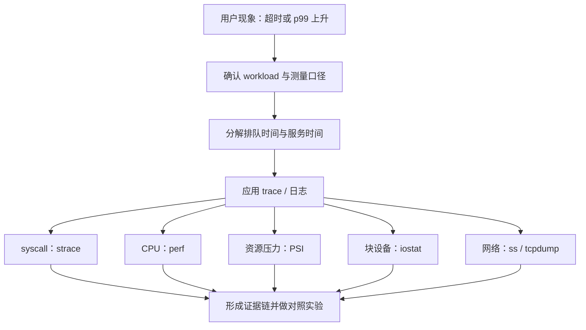

# 性能与跨层诊断：从 p99 现象找到第一处证据

性能排障像医生看病：p99 高只是“发烧”，不是病因。你要先确认测量可靠，再判断请求是在排队、运行、等待 CPU、等待内存、等待 I/O，还是等待网络和下游。

Agent Infra 的任务长短、资源用量和工具调用差异很大。平均值尤其容易骗人：99 个任务 1 秒完成、1 个任务卡 100 秒，平均数看似还能接受，那个卡住的任务却可能占住沙箱和 lease 很久。

## 1. 学习优先级

| 优先级 | 必须掌握 | 面试用途 |
|---|---|---|
| P0 | workload、吞吐、并发、延迟分布 | 先统一测量口径 |
| P0 | Little's Law、利用率、排队与背压 | 做容量估算和解释雪崩 |
| P0 | p50/p95/p99、coordinated omission | 避免错误 benchmark |
| P0 | `strace`、`perf`、PSI、`iostat`、`ss` | 从应用跨到内核找证据 |
| P1 | `tcpdump`、eBPF、off-CPU 分析 | 处理短暂或高基数问题 |
| P1 | 自动扩缩容和多资源装箱 | 大规模平台设计 |

工具不是收藏品。每次运行前先写下假设：“如果我的判断正确，我预期看到什么？”

## 2. 诊断概念地图



正确顺序通常是从请求和时间窗出发，再逐层下钻；不是先开最重的工具再寻找故事。

## 3. 先定义 workload

性能数字必须带上下文。至少写清：

- 请求类型、输入大小、读写比例和租户分布。
- 到达模式：均匀、突发、定时批量还是重尾。
- 并发数、持续时间、预热时间和冷/热缓存。
- 硬件、内核、程序版本、资源限制和拓扑。
- 成功、错误、超时、取消是否都进入统计。

例如“吞吐 5,000 QPS”缺少响应时间和错误率就没有意义。如果系统靠立即返回 503 达到 5,000 QPS，它并没有完成 5,000 个业务请求。

## 4. Little's Law：并发、速率和时间的第一把尺

在稳定系统和一致统计边界下，Little's Law 写作：

```text
L = λ × W
```

`L` 是系统内平均任务数，`λ` 是平均完成/到达速率，`W` 是任务平均停留时间。原始证明见 John Little 的 [A Proof for the Queuing Formula: L = λW](https://doi.org/10.1287/opre.9.3.383)。

假设峰值每秒进入 200 个任务，平均持续 50 秒：

```text
平均并发 L = 200 task/s × 50 s = 10,000 task
```

若每个任务平均占 1.5 GiB 内存，仅平均工作集就是约 15,000 GiB。它仍不是节点数结论，因为任务时长和内存可能重尾，还要考虑碎片、系统预留、故障余量和多资源装箱。

Little's Law 是恒等关系，不会告诉你怎样调度，也不会保证系统稳定。输入长期超过服务能力时，队列会持续增长，稳定前提已经失效。

## 5. 利用率为何会放大长尾

利用率是忙碌程度，不是效率勋章。CPU、磁盘或 worker 接近饱和后，短暂抖动和大请求更容易形成队列；后来的小请求也要等待。

假设 10 个 worker，每个平均每秒处理 10 个请求，名义容量约 100 req/s：

- 50 req/s 时有较多吸收突发的余量。
- 95 req/s 时平均仍未超过容量，但服务时间波动就可能让队列明显增长。
- 110 req/s 持续进入时，没有限流或扩容，积压必然增长。

真实系统还受请求大小、同步点、锁、CPU 频率和共享下游影响，不能仅用平均服务率预测 p99。

背压的含义是让上游感知下游容量：限制并发、队列长度、每租户配额或进入速率。无限队列只是把失败变成更晚、更贵的失败。

## 6. p99 到底在说什么

p99 表示约 99% 的样本不高于该分位值，剩余约 1% 更慢。它不是“最慢请求”，也不能告诉你那 1% 为什么慢。

一个例子：一小时有 100 万次工具调用，p99 为 2 秒，意味着大约一万次调用可能超过 2 秒。对交互式 Agent，这不是“小概率可以忽略”。

分位数必须按有意义的维度拆分：请求类型、租户、节点、状态码、冷/热启动、输入大小。把快健康检查和慢代码执行混在一起，整体 p99 可能掩盖两边的问题。

不要直接平均多个节点的 p99。正确做法通常是合并可比较的原始分布或直方图，再计算全局分位数；各节点请求量不同，平均分位数没有清晰统计语义。

## 7. Coordinated omission：压测器也会撒谎

想象闭环压测器：发一个请求，等响应后才发下一个。服务卡住 10 秒时，压测器也一起停发，于是本应在这 10 秒到达并排队的请求根本没有被测量，尾延迟看起来反而没那么糟。

这就是 coordinated omission：测量过程与被测系统的停顿协调，遗漏了潜在等待。相关实证分析见 [Coordinated Omission in NoSQL Database Benchmarking](https://vsis-www.informatik.uni-hamburg.de/getDoc.php/publications/569/Coordinated_Omission_in_NoSQL_Database_Benchmarking-Friedrich.pdf)。

两种负载模型要明确区分：

- **闭环**：固定并发用户，请求完成后再发；适合模拟会等待的用户，但会自然降低到达率。
- **开环**：按预定到达时间发送；更能暴露系统跟不上固定外部流量时的排队。

开环压测也必须有限制，否则可能把测试环境打垮。记录计划发送时间、实际发送时间、完成时间和丢弃原因，才能区分压测器自身饱和。

## 8. `strace`：程序在等哪个系统调用

`strace` 观察系统调用和信号，适合回答：是否频繁打开文件、是否大量小写、`fsync` 是否很慢、进程是否卡在 `futex`、网络调用返回什么错误。完整选项见 [`strace(1)`](https://man7.org/linux/man-pages/man1/strace.1.html)。

```bash
# 汇总次数与时间；支持 wall-time 汇总的新版本可另查 `-w`
strace -f -c -- sleep 0.2

# 逐调用观察停留时间；只跟踪短命测试进程
strace -f -ttT -e trace=%network,read,write,fsync -- sleep 0.2
```

`-T` 展示逐次 syscall 内停留时间，`-c` 则切换到汇总模式并抑制逐行输出；不要把两种输出混读。syscall 慢也不一定是内核代码慢：`read` 可能在等待远端、磁盘或另一个线程提供数据。

追踪会增加开销并可能暴露参数。优先追踪可控测试进程，限定 syscall 和持续时间，不要未经评估附加到生产关键进程。

## 9. `perf`：CPU 时间花在哪里

`perf stat` 给出整体计数，`perf record/report` 对调用栈采样。用法以 [`perf-stat(1)`](https://man7.org/linux/man-pages/man1/perf-stat.1.html)和 [`perf-record(1)`](https://man7.org/linux/man-pages/man1/perf-record.1.html)为准。

```bash
# 用短命、只读写 /dev/null 的命令做工具冒烟测试
perf stat -- dd if=/dev/zero of=/dev/null bs=1M count=128 status=none

# 采样文件放入唯一临时目录；报告打印后自动清理
(
  perf_dir="$(mktemp -d "${TMPDIR:-/tmp}/agent-perf.XXXXXX")" || exit 1
  trap 'rm -f -- "$perf_dir/perf.data"; rmdir -- "$perf_dir"' EXIT HUP INT TERM

  perf record -F 99 -g -o "$perf_dir/perf.data" -- \
    dd if=/dev/zero of=/dev/null bs=1M count=128 status=none
  perf report --stdio -i "$perf_dir/perf.data" | sed -n '1,80p'
)
```

这里的采样输出文件明确是 `$perf_dir/perf.data`，退出小括号中的子 shell 时会删除。`dd` 只用于确认 `perf` 能否运行，任务有 128 MiB 的硬上限；它不代表真实 Agent workload。正式分析时再把 `dd ...` 替换为自己的有界测试命令，并继续使用独立输出目录。某些系统还会因内核权限设置而拒绝采样。

先问进程是 on-CPU 还是 off-CPU。CPU profile 里找不到热点，可能是它大部分时间在睡眠、锁、I/O 或网络等待，而不是“perf 失效”。

采样频率越高开销越大；符号、栈展开方式、JIT 和编译优化都会影响结果。火焰图展示样本分布，不自动证明因果。

## 10. PSI 与 `iostat`：资源是否在造成停顿

Linux Pressure Stall Information（PSI）统计 CPU、内存和 I/O 资源竞争造成的 stall，系统级入口通常在 `/proc/pressure/`。`some` 表示至少一些任务受阻，`full` 一般表示所有非空闲任务同时受阻；但 system-level CPU `full` 没有定义，自 Linux 5.13 起为兼容固定报告 0，不能把它读成“CPU 没压力”。准确字段见[内核 PSI 文档](https://www.kernel.org/doc/html/latest/accounting/psi.html)。

```bash
cat /proc/pressure/cpu
cat /proc/pressure/memory
cat /proc/pressure/io
iostat -xz 1 5
```

PSI 回答“任务因资源紧张损失了多少推进时间”，`iostat` 则从块设备角度展示吞吐、请求、队列和等待趋势，字段定义见 [`iostat(1)`](https://man7.org/linux/man-pages/man1/iostat.1.html)。

这些工具不一定预装：`iostat` 通常来自 `sysstat`，`strace`、`perf`、`tcpdump` 也随发行版和权限而异。缺少命令不表示底层机制不存在。

高 I/O PSI 加高设备等待支持“存储压力”方向，但仍要连接到目标 cgroup、进程和请求；宿主机可能有别的租户制造压力。

## 11. `ss`、`tcpdump` 与 eBPF

`ss` 适合看 socket 状态、发送/接收队列和 TCP 信息：

```bash
ss -s
ss -tin '( dport = :443 or sport = :443 )'
```

若怀疑重传、握手或 MTU，再在授权环境做短时、过滤后的抓包：

```bash
sudo timeout 20 tcpdump -i test0 -nn -s 128 'host 203.0.113.10 and tcp port 443'
```

抓包包含通信元数据，甚至可能包含明文载荷；必须限定接口、目标、snaplen、时长和输出权限。

eBPF 可以在内核受控挂点运行程序并通过 map/ring buffer 输出事件，适合按 cgroup、PID、延迟桶等维度做低侵入观测。内核接口与 verifier 约束以 [Linux eBPF 文档](https://www.kernel.org/doc/html/latest/bpf/index.html)为准。

eBPF 不是“零开销万能探针”。挂点选择、事件频率、map 大小、符号解析和权限都会影响成本与安全；优先使用经过审核的现成工具，再考虑自写程序。

## 12. 一次跨层诊断示例

现象：沙箱 checkpoint p99 从 800 ms 升到 8 s，但平均值只升到 1.1 s。

按证据推进：

1. 从 trace 确认慢在上传前本地 `fsync`，不是对象存储响应。
2. 按节点拆分，发现问题集中在 5% 节点。
3. `strace` 的 `fsync` 时间与慢 trace 对齐。
4. 问题节点的 I/O PSI 和 `iostat` 队列同时升高。
5. 查看 workload，发现重试使同一节点的并发 checkpoint 翻倍。
6. 限制每节点同步写并发后做对照，p99 恢复；再调查为何重试未受预算约束。

这个结论链比“磁盘慢，换更快 NVMe”更可靠，因为它连接了用户请求、syscall、资源压力、设备和上游放大机制。

## 13. 与 Agent Infra 的联系

Agent 工作负载至少要按资源向量测量，而不只是 CPU 百分比：CPU、内存 working set、临时盘容量/IOPS、网络带宽、进程数、文件数和模型/工具调用配额。

平台设计还应包括：

- task、step、tool call、sandbox、node 五层 SLI。
- 冷启动、执行、checkpoint、上传和排队的延迟分解。
- 每租户并发和重试预算，避免 noisy neighbor。
- p99 恶化时的 admission control、降级和安全驱逐。
- 固定 workload 的回归基准，以及版本、硬件、缓存状态记录。

这些是通用诊断方法，不代表 DeepSeek 使用某一种指标系统或 eBPF 工具。

## 14. 常见误区

1. **“平均延迟低就够了。”** 长尾会占住资源并伤害交互体验。
2. **“CPU 100% 一定不好。”** 要结合吞吐、队列、SLO 和是否有可运行工作。
3. **“利用率没到 100%，所以不会排队。”** 波动和共享资源会提前制造队列。
4. **“火焰图最高的函数就是根因。”** 它只显示样本归属，还需对照实验。
5. **“压测器发得越猛越真实。”** 自身饱和或 coordinated omission 都会扭曲结果。
6. **“eBPF 没有开销。”** 事件频率和聚合设计仍会消耗资源。
7. **“一次漂亮 benchmark 能证明优化。”** 必须有基线、重复、误差和相同 workload。

## 15. 面试怎么答

### 30 秒答案

> 我先固定 workload、统计边界和成功定义，再把端到端延迟拆成排队与各阶段服务时间。容量先用 Little's Law 粗算并发，但会检查重尾和稳定前提。p99 上升时，从 trace 定位慢阶段，再用 `strace` 看 syscall、`perf` 看 on-CPU、PSI 看资源 stall、`iostat` 看块设备、`ss/tcpdump` 看网络，必要时用受控 eBPF。最后通过对照实验验证，而不是从一个指标直接猜根因。

### 常见追问

- Little's Law 为什么不是扩容公式？
- 利用率未到 100% 为什么 p99 已经恶化？
- coordinated omission 怎样让结果过于乐观？
- `strace` 与 `perf` 分别适合回答什么？
- PSI `some` 和 `full` 有何不同？
- 怎样证明 checkpoint 慢来自设备而不是上游重试？

## 16. 章末自测

1. 用 `λ=120 task/s`、`W=30 s` 计算平均并发，再列出三个遗漏因素。
2. 设计一个不会漏掉超时和错误的延迟统计口径。
3. 画出闭环压测器发生 coordinated omission 的时间线。
4. 给“CPU 低但请求慢”提出至少四个可验证假设。
5. 为一次 `strace`、抓包和 eBPF 观测分别写安全边界。
6. 从 Agent 超时出发，写一条跨应用、内核、设备或网络的证据链。

## 17. 本章小结

- 性能数字必须绑定 workload、版本、硬件、错误和统计边界。
- Little's Law 连接并发、速率与时间，但不替代稳定性和重尾分析。
- p99 要分维度看；coordinated omission 会系统性漏掉最坏等待。
- `strace`、`perf`、PSI、`iostat`、`ss`、`tcpdump` 和 eBPF 各回答不同层的问题。
- 高质量排障以请求为线索，以证据链和对照实验收尾。

## 一手资料

- [Little：A Proof for the Queuing Formula](https://doi.org/10.1287/opre.9.3.383)
- [Linux PSI 文档](https://www.kernel.org/doc/html/latest/accounting/psi.html)
- [`strace(1)`、`perf-stat(1)` 与 `iostat(1)`](https://man7.org/linux/man-pages/man1/strace.1.html)
- [Linux eBPF 文档](https://www.kernel.org/doc/html/latest/bpf/index.html)
- [Coordinated Omission in NoSQL Database Benchmarking](https://vsis-www.informatik.uni-hamburg.de/getDoc.php/publications/569/Coordinated_Omission_in_NoSQL_Database_Benchmarking-Friedrich.pdf)
