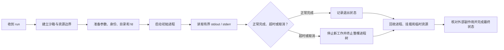

# Agent 沙箱的执行生命周期

用户让 Agent 执行“编译并测试”时，平台不能只启动一个进程然后等待。编译器可能再启动链接器，测试程序还可能创建子进程。如果平台只记住最初那个进程的编号，超时后就可能留下仍在运行的后代进程。

本章回答：**怎样安全启动、观察、取消并回收一次不可信的 Agent 执行？**

进程、文件描述符与系统调用的通用原理由第一册的[进程、线程与文件描述符](../../rust-hft/foundations/processes_fds.html)主讲。本章只讨论 Agent 沙箱多出来的生命周期设计。

## 1. 先定义本章对象

- **run**：用户发起的一次完整 Agent 运行。一次 run 可以包含多个步骤。
- **sandbox**：限制代码能看到什么、使用多少资源的执行环境。它可以由容器或虚拟机承载，但“沙箱”强调的是安全边界，而不是某个产品名。
- **进程树**：最初进程以及它创建的全部子进程和后代进程。
- **文件描述符（fd）**：进程用来引用打开文件、管道或网络连接的小整数。
- **cgroup**：Linux 用来统计并限制一组进程资源的机制。这里使用它，是因为只限制单个进程无法覆盖整棵进程树。

这几个对象必须分开。run 是业务对象，进程树是操作系统对象，cgroup 是资源边界；它们需要通过稳定的 `run_id` 关联起来。

## 2. 一次执行的完整路径



顺序很重要。先建立边界再启动代码，才能避免进程在限制生效前逃出控制；先停止新工作再清理，才能避免一边删除资源、一边又创建新资源。

## 3. 启动前要固定哪些上下文

安全启动不是“把用户字符串交给 shell”。平台至少要明确：

| 上下文 | 它是什么 | 为什么必须明确 |
|---|---|---|
| 参数 `argv` | 程序名和参数列表 | 直接传参数可避免把不可信文本误当作 shell 语法 |
| 工作目录 | 程序看到的当前目录 | 防止任务意外读写平台目录 |
| 环境变量 | 进程启动时获得的键值配置 | 只传白名单，避免泄露令牌和宿主机信息 |
| 用户身份 | 进程使用的操作系统账号；Linux 常用 uid/gid 编号表示 | 决定它能访问哪些文件和设备 |
| 网络策略 | 允许访问的地址和服务 | 防止访问内网控制面或云元数据服务 |
| 资源上限 | CPU、内存、进程数、运行时长和输出大小 | 防止一个任务拖垮宿主机 |

还要控制 fd 继承。父进程中打开的数据库连接、日志文件或秘密管道如果被子进程继承，沙箱就可能绕过原有权限。工程上通常采用“默认关闭，只显式传入标准输入、标准输出、标准错误和确有需要的 fd”的策略。

## 4. 为什么输出也必须有界

平台通常通过 pipe 读取子进程的标准输出（stdout，程序的正常输出）和标准错误（stderr，诊断信息）。pipe 是内核中的字节缓冲通道：写端放入数据，读端取出数据。

如果平台不持续读取，缓冲区写满后，子进程会阻塞；如果平台无限把输出保存在内存，恶意程序又能靠打印拖垮服务。因此需要同时做到：

- 持续读取 stdout 和 stderr，不能只读其中一个；
- 设置每个流和整个 run 的字节上限；
- 超过上限时记录“输出被截断”，而不是假装日志完整；
- 将读取过程纳入取消，避免主任务结束后仍有后台读取者存活。

这里的关键不是 pipe 的内部实现，而是理解**输出本身也是一种需要计量和回收的资源**。

## 5. 取消必须覆盖整棵进程树

PID 是操作系统分配给每个进程的编号。只向初始 PID 发送终止信号，通常只影响那个进程；它的后代可能已经脱离父进程继续运行。因此平台需要一个能够覆盖整次执行的边界，例如受控的进程组加 cgroup，或直接销毁承载它的虚拟机。

一个可解释的取消流程是：

1. 把 run 标为“正在取消”，不再启动新步骤。
2. 先请求进程优雅退出，让它有短暂机会刷新缓冲和释放资源。
3. 到达宽限期后，强制终止边界内仍存活的进程。
4. 等待并回收所有退出状态，确认 cgroup 中不再有进程。
5. 卸载工作目录、关闭 fd，并删除属于本次 run 的临时资源。

**deadline** 是整个操作最晚完成的时刻；**timeout** 是某一层愿意等待的时长。每层都应从同一个 deadline 计算剩余时间，否则五层各等 30 秒会把用户的 30 秒请求拖成数分钟。

## 6. 回收不只是“进程不见了”

子进程退出后，父进程仍要读取它的退出状态；这个动作叫回收。没有及时回收的已退出进程会留下少量内核记录，通常称为 zombie（僵尸进程）。它已经不执行代码，但大量累积会耗尽进程表资源。

一次 run 结束时至少核对：

- 进程树是否为空；
- stdout/stderr 读取者是否结束；
- 打开的 pipe、socket 和文件是否关闭；
- 临时目录、挂载和网络配置是否释放；
- cgroup 的 CPU、内存和进程数统计是否保存；
- 业务状态是否记录退出码、信号、超时或平台错误。

“命令返回非零退出码”和“平台没能启动命令”不是同一类失败。前者是用户程序运行后的结果，后者是平台生命周期故障；面试中应分开建模。

## 7. `kill` 不会回滚外部副作用

终止进程只能阻止它继续执行本机指令，不能撤销已经发送的邮件、支付请求、数据库提交或远端 API 调用。甚至在进程收到取消前，请求可能已经被远端接受，只是响应还没回来。

因此平台还需要业务层措施：

- 给每个有副作用的操作稳定的 operation ID；
- 服务端用这个 ID 去重，或允许查询既有结果；
- 无法确认结果时进入 `UNKNOWN`，由恢复任务对账；
- 补偿是一个新的业务动作，不是假装过去从未发生。

这就是为什么“整树取消”和“副作用恢复”是两个问题。前者由执行边界解决，后者由业务协议解决。

## 8. 最小状态机

```text
PENDING → STARTING → RUNNING → SUCCEEDED
                    ├────────→ FAILED
                    └────────→ CANCELLING → CANCELLED
                                      └──→ UNKNOWN
```

状态机是“允许哪些状态转换”的明确规则。`UNKNOWN` 表示平台知道结果不确定，例如 worker 失联且外部工具可能已执行。保留这个状态比直接写成 `FAILED` 更诚实，也为后续对账留下入口。

## 9. 常见误区

1. **“杀掉父进程就取消成功。”** 后代进程可能仍在运行。
2. **“容器会自动处理所有生命周期问题。”** 容器提供边界，平台仍要设计 deadline、输出、状态和回收。
3. **“退出码 0 就代表任务完全成功。”** 外部状态持久化或结果上传仍可能失败。
4. **“强制终止等于事务回滚。”** 已发生的远端副作用不会自动消失。
5. **“日志只是调试信息。”** 无限日志会消耗内存、磁盘和网络，必须纳入配额。

## 10. 30 秒面试答案

> 我把一次 Agent run 当成业务对象，把它关联到受控沙箱、整棵进程树和 cgroup。启动前先固定参数、身份、工作目录、环境变量、网络和资源上限，并默认关闭无关 fd。运行时持续读取但限制 stdout/stderr。取消时先阻止新步骤，再在宽限期后终止整个执行边界，回收退出状态和临时资源。最后单独对账外部副作用，因为 kill 只能停止本机进程，不能回滚已经提交的远端操作。

## 11. 做题方法：按状态机回收一次执行

1. 先给 `run_id`、`attempt_id`、`sandbox_id`、根 PID 和进程组分别编号，避免把一次业务任务、一次重试和一棵 OS 进程树混成同一对象。
2. 画状态 `CREATED → SPAWNING → RUNNING → STOPPING → EXITED/FAILED`。每条边标出负责组件、持久化记录和可能失败的系统调用；只有观测到 `wait`/等价回收结果后，才能把根进程视为已经退出。
3. 建资源账：namespace/cgroup、文件描述符、管道、临时目录、网络连接、输出配额。每分配一项就写唯一 owner 和释放动作，终态逐项勾销。
4. 在 fork/exec 之间失败、子进程再 fork、取消信号丢失、TERM 后不退出、输出管道堵塞处分别插入故障。取消必须覆盖进程组或 cgroup，并经过“停止接收新任务—TERM—继续有界排空输出—宽限期—KILL—wait—资源清理”。
5. 外部工具调用要单列 `NOT_STARTED / SUCCEEDED / UNKNOWN`；杀掉本地进程只能停止继续执行，不能证明远端副作用未发生。

验算点：业务状态最多进入一个终态；终态后没有仍可运行的后代进程；所有输出都有字节上限；所有资源项最终归零；UNKNOWN 副作用进入查询或对账，而不是被当作失败重放。

## 12. 章末自测

1. 为什么只记录初始 PID 不足以完成取消？
2. fd 继承可能怎样泄露权限？
3. 为什么 stdout 和 stderr 都需要持续读取并设置上限？
4. timeout 与 deadline 有什么区别？
5. worker 失联后，为什么任务有时应进入 `UNKNOWN` 而不是 `FAILED`？
6. 设计一次取消流程，并指出哪一步处理本地资源，哪一步处理外部副作用。

### 参考答案与解答

<details>
<summary>展开答案</summary>

1. **初始 PID 只标识一个进程，不代表它后来创建的整棵树。** 子进程可以再创建孙进程，父进程退出后它们仍可能运行；PID 还可能在进程退出后被系统复用。平台应在启动时建立进程组或 cgroup 边界，取消时按该边界停止全部成员，并通过 `wait` 和 cgroup 为空确认回收完成。
2. **子进程会继承父进程未关闭且未设置 close-on-exec 的 fd。** 若父进程持有密钥文件、控制 socket 或日志管道，执行不可信程序后，它可能直接使用这些已有权限，绕过路径权限或网络策略；多余的管道写端还会让读者永远等不到 EOF。启动前应采用“默认不继承”，只显式传入 stdin/stdout/stderr 等必要 fd。
3. **不持续读取会形成管道反压。** 子进程写满 stdout 或 stderr 的内核管道后会阻塞；若父进程只等退出而不读，二者会互相等待。两个流都要并发排空；但若无限保存，恶意或失控程序又能耗尽内存和磁盘，所以应设置字节上限，并在截断后继续排空或按策略终止任务。
4. **timeout 是一段时长，deadline 是一个绝对完成时刻。** 例如总 deadline 为 12:00:10，第一步耗时 4 秒后，下游只剩约 6 秒（还要留收尾余量），而不是再获得新的 10 秒 timeout。deadline 向下传递可以防止多层各自重新计时而突破总预算。
5. **失联只说明控制面没有新证据。** worker 可能已完成本地计算、上传结果或调用远端工具，只是确认消息未送达。直接标记 `FAILED` 并重试可能重复副作用；因此先进入 `UNKNOWN`，根据 sandbox ID、Checkpoint 和 operation ID 查询真实状态，再收口为成功、失败或可安全重试。
6. **一种完整流程是：**先把 run 条件更新为 `STOPPING`，停止派发新步骤；向进程组/cgroup 发送 TERM，同时继续有界读取输出；宽限期后对剩余进程发送 KILL；用 `wait` 回收退出状态，关闭 fd，卸载并删除临时目录。这些步骤处理本地资源。与此同时，把已发出的远端 operation 单独标为 `UNKNOWN`，按原 operation ID 查询收据或执行补偿；这一步处理外部副作用。只有本地清理和远端对账都达到定义好的终态，才能把 run 标为 `CANCELLED`。

</details>

## 本章小结

- Agent 执行的真实对象通常是一棵进程树，不是单个 PID。
- 启动前应先建立身份、fd、网络和资源边界。
- 取消需要停止新工作、终止整树、回收状态并清理资源。
- 有界输出既防阻塞，也防资源耗尽。
- 强制终止不会回滚远端副作用；结果不确定时要对账。
