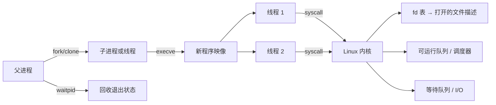

# 进程、线程与系统调用：Linux 怎样安排“谁来做事”

> 学习优先级：**P0 全章必会，P1 深入调度策略与 `clone` 标志。** 本章描述通用 Linux 语义，不推断 DeepSeek 的运行时实现。Agent 要执行 `cargo test`，平台不能只“运行一个字符串”。
它要创建进程、传入文件描述符、限制资源、收集输出、处理超时，并在取消时杀掉整个进程树。 理解这些动作，必须先分清进程、线程、系统调用和调度。

## 1. 学习地图

| 优先级 | 问题 | 关键词 |
|---|---|---|
| P0 | 进程和线程分别拥有什么、共享什么？ | 地址空间、资源、线程组 |
| P0 | 文件描述符到底指向什么？ | fd table、open file description |
| P0 | 系统调用与上下文切换是不是一回事？ | user/kernel、阻塞、调度 |
| P0 | 怎样正确启动、等待、取消和回收子进程？ | `fork`、`execve`、`waitpid`、signal |
| P1 | Linux 调度器怎样选择可运行任务？ | state、policy、priority、affinity |



## 2. 进程是资源容器，线程是执行流

初学时可以把进程想成一间工作室，把线程想成工作室里的工人。 工作室有地址空间、文件描述符和权限；多个工人共享大部分材料，但各自有调用栈和寄存器状态。

典型进程资源包括：

- 虚拟地址空间与内存映射；
- 文件描述符表；
- 当前工作目录、根目录和 umask；
- 身份、权限、namespace 与资源限制；
- 信号处理设置等进程属性。

同一进程内的线程通常共享地址空间和打开的文件，因此通信便宜，也更容易出现数据竞争。 每个线程仍有自己的寄存器、栈、线程局部存储、调度状态与信号屏蔽字。Linux 内核把可调度实体表示为 task。 通过 `clone()` 的共享标志，可以选择共享地址空间、文件表、信号处理等资源；POSIX 线程库为应用封装了这些细节。 不要把“Linux 线程也是 task”简化成“线程与进程完全相同”。

官方语义可查 [`pthreads(7)`](https://man7.org/linux/man-pages/man7/pthreads.7.html)和 [`clone(2)`](https://man7.org/linux/man-pages/man2/clone.2.html)。

## 3. `fork`、`execve` 与 `waitpid`

启动一个新程序常见的心智模型是三步：

1. `fork()` 创建当前进程的子进程。
2. 子进程用 `execve()` 把自身程序映像替换成目标程序。
3. 父进程用 `waitpid()` 等待并回收退出状态。

`fork()` 返回两次：父进程得到子 PID，子进程得到 0。 内存通常用写时复制实现，刚创建时不必立即复制所有物理页；细节见下一章。

`execve()` 成功后不会返回原程序。PID 可以保持，但代码、数据、栈和大部分用户态状态被新程序替换；哪些属性保留或重置应查手册，不能凭直觉。

子进程退出后，内核会暂留 PID、退出码和资源统计，等待父进程领取。 这段已退出但尚未被 `wait` 的记录称为 zombie。 僵尸进程不再执行代码，却会占用进程表项；父进程必须回收。

参考 [`fork(2)`](https://man7.org/linux/man-pages/man2/fork.2.html)、[`execve(2)`](https://man7.org/linux/man-pages/man2/execve.2.html)与 [`waitpid(2)`](https://man7.org/linux/man-pages/man2/waitpid.2.html)。

## 4. 文件描述符：不是文件本身

文件描述符 fd 是进程内的一枚小整数，例如 0、1、2 通常对应标准输入、输出和错误。 它是文件描述符表的索引，不是磁盘上的 inode，也不是全局唯一 ID。

```text
进程 fd 3
  → fd 表项（含 close-on-exec 等标志）
  → open file description（含当前偏移、状态标志）
  → inode / socket / pipe / 设备等对象
```

`open()` 创建一个 open file description，再让当前进程的 fd 指向它。 `dup()` 得到的新 fd 仍可指向同一个 open file description，因此共享文件偏移与部分状态。 `fork()` 后父子进程继承的 fd 也指向相同 open file description。

这解释了一个常见现象：父子进程同时从继承的 fd 读取，会共同推进文件偏移。 如果它们分别调用 `open()`，通常会得到不同的 open file description 和独立偏移。

`FD_CLOEXEC` 或 `O_CLOEXEC` 用于在成功 `execve` 时关闭不应泄露给新程序的 fd。 并发程序应优先在创建 fd 时原子设置 `O_CLOEXEC`，避免“先打开、后设置”之间的竞态。

完整定义见 [`open(2)`](https://man7.org/linux/man-pages/man2/open.2.html)和 [`dup(2)`](https://man7.org/linux/man-pages/man2/dup.2.html)。

## 5. 系统调用不是普通函数，也不必然切线程

用户程序通过特定指令进入内核，内核在更高权限级别执行系统调用处理逻辑。 这叫 privilege-mode transition，中文可说权限态切换。

任务上下文切换是另一件事：调度器保存当前任务寄存器，恢复另一个任务的寄存器与执行状态。 一次快速 `getpid()` 可以进入并离开内核，却不一定换到另一个任务。 一次阻塞 `read()` 若暂时没有数据，则当前线程会睡眠，调度器通常运行其他可运行任务。

系统调用还必须处理：

- 用户指针可能无效；
- 权限或配额可能不允许；
- 信号可能中断等待；
- `read`/`write` 可能短读或短写；
- 返回 `-1` 时用户态通过 `errno` 区分原因。

所以“调用返回”只说明接口给出的承诺，不能擅自扩大为“数据已经持久化”或“远端没有执行”。

## 6. 线程状态与调度

从应用视角，线程常见状态可以简化为：

```text
Running：正在某个逻辑 CPU 上执行
Runnable：可以执行，正在等待 CPU
Sleeping：等待 I/O、锁、定时器或事件
Stopped：被调试或停止信号暂停
Zombie：已退出，等待父进程回收
```

`ps` 的状态字符比这更细，且是观测快照。 不要从一次 `R` 或 `S` 就推断长期行为。Linux 有普通分时策略以及实时策略等多种调度类别。 普通业务一般不应随意提高实时优先级；配置错误的实时线程可能让系统管理任务得不到 CPU。 调度接口与策略见 [`sched(7)`](https://man7.org/linux/man-pages/man7/sched.7.html)。

调度器必须在公平、吞吐、响应时间与缓存局部性之间取舍。 迁移线程到另一核心可能得到空闲 CPU，也可能失去热 Cache。

上下文切换的成本不只是保存少量寄存器。 它还可能扰动 Cache、TLB 与分支预测状态；实际成本依硬件和工作集而变，不能背一个固定纳秒数。

## 7. 一个带数字的沙箱例子

假设平台同时运行 5,000 个沙箱，每个沙箱允许最多 256 个进程或线程：

```text
理论上限 = 5,000 × 256 = 1,280,000 tasks
```

这不是建议值，只说明 PIDs 与内核对象也需要容量规划。 如果每个沙箱的测试脚本失控创建 10,000 个子进程，仅限制 CPU 并不能保护宿主机。

需要同时考虑：

- cgroup `pids.max` 或等价的任务数硬上限；
- 用户级 `RLIMIT_NPROC` 的语义与适用范围；
- fd 上限、pipe 缓冲、内核栈与调度开销；
- 创建速率与退出回收速率；
- 宿主机保留给节点 agent、日志和应急登录的余量。Linux cgroup v2 的 PID 控制器见[官方文档](https://docs.kernel.org/admin-guide/cgroup-v2.html#pid)。

## 8. 取消为什么要管整个进程树

父进程启动 shell，shell 再启动编译器，编译器又启动 linker。 只向最外层父进程发信号，孙进程可能继续运行、占用 CPU 或持有 pipe，导致平台以为任务已经结束。

常见方案是给一次执行建立独立的进程组、session、PID namespace 或 cgroup，再按边界取消。 温和取消可先发 `SIGTERM`，给清理宽限期；超过期限再强制终止。

但 `SIGKILL` 也不是“事务回滚”：

- 已写到外部服务的数据不会自动撤销；
- 文件可能只写了一半；
- 子进程可能已把任务交给别的服务；
- 内核仍需回收资源，状态变化不是瞬时魔法。

因此进程取消必须与工具幂等、checkpoint、fencing 和资源清理一起设计。

信号模型见 [`signal(7)`](https://man7.org/linux/man-pages/man7/signal.7.html)，进程组操作可从 [`kill(2)`](https://man7.org/linux/man-pages/man2/kill.2.html)开始。

## 9. 在 Linux 上观察

以下命令应在自己的测试环境执行。 `strace` 会明显改变时序并可能捕获路径、参数或敏感数据；不要随意附加生产进程，也不要把输出上传到公共位置。

```bash
AGENT_LAB_DIR=$(mktemp -d) || exit 1
trap 'rm -f -- "$AGENT_LAB_DIR/output.txt" "$AGENT_LAB_DIR/trace"; rmdir -- "$AGENT_LAB_DIR"' EXIT

# 查看进程和线程；LWP/TID 是线程 ID，NLWP 是线程数
ps -eLo pid,ppid,lwp,nlwp,stat,psr,comm | head -n 30

# 查看当前 shell 的状态、线程与 fd
sed -n '1,80p' /proc/$$/status
ls -l /proc/$$/fd

# 在测试命令上跟踪进程创建和文件系统调用
strace -f -e trace=%process,%file -o "$AGENT_LAB_DIR/trace" -- \
  sh -c 'printf ok >"$1/output.txt"' sh "$AGENT_LAB_DIR"

# 完成后只查看少量内容；shell 退出时 trap 清理独占目录
sed -n '1,80p' "$AGENT_LAB_DIR/trace"
```

`mktemp -d` 创建本次实验独占目录；不要把通配符、用户输入或不确定目录交给清理命令。

还可用只读方式比较某个进程的线程：

```bash
ls /proc/$$/task
cat /proc/$$/stat
```

`/proc/PID/status` 和其他进程接口见 [`proc_pid_status(5)`](https://man7.org/linux/man-pages/man5/proc_pid_status.5.html)。 读取其他用户进程可能受权限限制，这正是预期的安全边界。

观察时回答四个问题：

1. 任务在运行、可运行，还是等待？
2. 等待的是 CPU、I/O、锁还是子进程？
3. 谁创建了它，谁负责回收？
4. 它继承了哪些 fd、权限和环境？

## 10. 与 Agent Infra 的联系

Agent 执行器必须把“启动一个命令”扩展成完整生命周期：

- 采用参数数组而非拼接 shell 文本，降低命令注入面；
- 明确工作目录、环境、uid/gid、fd 继承和网络权限；
- 为 stdout/stderr 设置有界读取，避免日志塞满内存或 pipe；
- 记录 PID、进程组、cgroup、退出码、signal 与资源用量；
- 取消时阻止新子进程，终止整个边界，并验证资源已回收；
- 将外部副作用视为独立状态，不能指望杀进程撤销。

进程模型还是容器与 VM 的基础。 容器首先运行进程；PID namespace 改变可见的 PID 视图，cgroup 负责计量和限制，但都不替代正确的父子进程管理。

## 11. 常见误区

**误区一：进程有代码，线程只有一个函数。** 更准确的说法是进程持有资源边界，线程是可调度执行流；线程共享哪些资源由系统语义决定。

**误区二：fd 3 就是某个文件的全局编号。** fd 只在该进程的 fd 表中有意义，背后还隔着 open file description。

**误区三：系统调用等于上下文切换。** 进入内核不代表调度到另一个任务。

**误区四：杀掉父进程就完成取消。** 孙进程、外部副作用、卷和网络连接都可能继续存在。

**误区五：僵尸进程还在偷偷消耗 CPU。** 僵尸已经退出，不运行代码；问题是父进程尚未回收其记录。

## 12. 30 秒面试答案

> 我把进程理解为地址空间、fd、身份等资源容器，把线程理解为共享大部分进程资源的可调度执行流。程序常通过 fork/clone 创建执行实体，以 execve 替换程序映像，父进程用 waitpid 回收。fd 是进程表的索引，可能与其他 fd 共享同一个 open file description。系统调用是用户态进入内核态，不必然发生任务切换；只有阻塞、抢占等情况下调度器才选择别的任务。Agent 沙箱执行时我会控制 fd 继承、进程数、输出与进程组，并把取消、回收和外部副作用分开处理。

常见追问：

1. `fork` 后父子进程的文件偏移为什么可能互相影响？
2. `execve` 成功后 PID、fd 和信号处理分别怎样变化？
3. 用户态/内核态切换与线程上下文切换有何区别？
4. zombie 与 orphan 有什么不同？谁负责回收？
5. 如何确保命令超时后没有残留孙进程？

## 13. 章末自测

1. 画出 fd、open file description 与 inode/socket 的关系。
2. 为什么应优先使用 `O_CLOEXEC`，而不是打开后再设置？
3. `fork → execve → waitpid` 三步各改变了什么？
4. 举出一次进入内核但未切换任务的可能情况。
5. 举出一次线程睡眠并触发其他任务运行的情况。
6. 一个沙箱有 CPU 上限但没有 PID 上限，会怎样被 fork bomb 影响？
7. 设计取消流程时，为什么还要考虑 pipe、fd 和外部服务？

## 14. 本章小结

- 进程是资源边界，线程是执行流；同进程线程共享地址空间等资源。
- `fork/clone` 创建，`execve` 替换程序，`waitpid` 回收退出状态。
- fd 是进程内索引，open file description 才保存偏移和状态。
- 权限态切换、任务上下文切换和 CPU 核迁移是不同事件。
- 调度要在公平、延迟与局部性之间取舍，固定“切换成本”没有普适答案。
- Agent 取消需要管住整个执行边界，并单独处理外部副作用。

## 一手资料

- [Linux `pthreads(7)`](https://man7.org/linux/man-pages/man7/pthreads.7.html)
- [Linux `clone(2)`](https://man7.org/linux/man-pages/man2/clone.2.html)
- [Linux `fork(2)`](https://man7.org/linux/man-pages/man2/fork.2.html)
- [Linux `execve(2)`](https://man7.org/linux/man-pages/man2/execve.2.html)
- [Linux `waitpid(2)`](https://man7.org/linux/man-pages/man2/waitpid.2.html)
- [Linux `open(2)`](https://man7.org/linux/man-pages/man2/open.2.html)
- [Linux `sched(7)`](https://man7.org/linux/man-pages/man7/sched.7.html)
- [Linux cgroup v2](https://docs.kernel.org/admin-guide/cgroup-v2.html)
