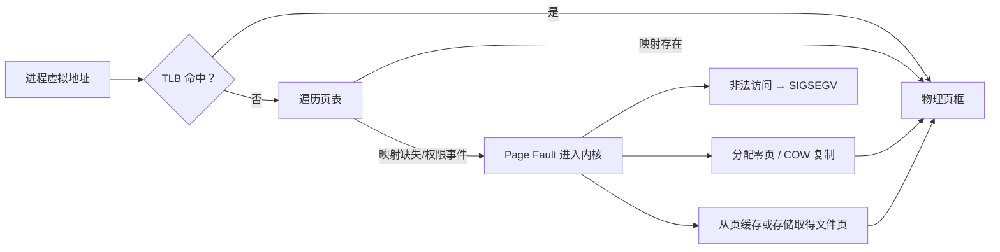

# 虚拟内存：地址空间、页表、缺页、COW 与 OOM

> 学习优先级：**P0 掌握地址翻译、TLB、缺页、COW、`mmap` 与 OOM；P1 深入回收策略、cgroup 记账和性能证据。** 本章只讲公开 Linux 机制。

程序打印“申请了 8 GiB 内存”，不代表机器此刻立刻少了 8 GiB 物理内存。 一个进程显示 20 GiB 虚拟地址，也不代表它独占 20 GiB RAM。 要解释这种差异，需要把“地址”“映射”“物理页”和“页缓存”分开。

## 1. 学习地图

| 优先级 | 问题 | 关键词 |
|---|---|---|
| P0 | 每个进程为何能使用相似地址却互不覆盖？ | 虚拟地址空间、VMA、页表 |
| P0 | 访问内存时为什么会缺页？ | TLB、page fault、demand paging |
| P0 | `fork` 为什么不立即复制全部内存？ | Copy-on-Write |
| P0 | `mmap` 与普通读写、页缓存是什么关系？ | anonymous、file-backed、shared/private |
| P0 | 内存耗尽时谁会失败或被终止？ | reclaim、cgroup、OOM |
| P1 | 怎样从 `/proc` 与性能事件找到证据？ | RSS、PSS、fault、memory events |



## 2. 为什么需要虚拟地址

如果程序直接使用物理地址，它必须知道机器插了多少内存，还可能误写别的程序数据。 虚拟内存给每个进程一个受保护的地址视图，再由硬件与内核把虚拟页映射到物理页框。 它带来三类核心能力：

- **隔离**：进程 A 的某个虚拟地址与进程 B 的相同数值可以映射到不同物理页。
- **共享**：不同进程也可以被允许映射同一个文件页或共享内存页。
- **按需使用**：先保留地址范围，在真正访问时再分配或读入物理页。

虚拟内存不是“磁盘假装成无限 RAM”。 交换空间只是可能的后备机制；地址空间、物理内存与 swap 是三个概念。

## 3. 地址空间与 VMA

一个进程的地址空间通常包含：

```text
可执行代码与只读数据
可写数据
堆
动态库与文件映射
匿名 mmap 区域
每个线程的栈
内核保留或架构相关区域
```

Linux 用 Virtual Memory Area（VMA）描述一段连续虚拟地址的属性，例如可读、可写、可执行，以及由文件还是匿名内存支撑。VMA 说明“这一段地址允许怎样使用”，不等于每一页都已经有物理内存。 地址空间像酒店的房间号规划。VMA 是前台登记“100～199 号房属于某位客人”，页表才记录某个房间当前对应哪间真实房屋。 进程映射可从 [`proc_pid_maps(5)`](https://man7.org/linux/man-pages/man5/proc_pid_maps.5.html)观察。

## 4. 页、页表、MMU 与 TLB

内存被按页管理。 基础页大小随架构和配置变化；在许多 x86-64 Linux 系统上常见 4 KiB，但代码不应把这个例子当作所有机器的固定事实。 页表是分层映射：

```text
虚拟页号
  → 多级页表索引
  → 页表项：物理页框号 + present/writable/executable 等属性
  → 页内偏移保持不变
```

分层设计让巨大而稀疏的地址空间不必为每个可能地址预先分配页表项。Linux 当前用通用五级抽象描述页表，具体架构可折叠不需要的级别；见内核[页表文档](https://docs.kernel.org/mm/page_tables.html)。MMU 是执行地址转换的硬件单元。 逐次遍历多级页表太贵，因此 CPU 用 TLB 缓存近期虚拟页到物理页的翻译。TLB miss 不一定是 page fault。TLB 中没有翻译时，硬件仍可能从完整页表找到有效映射；只有映射不存在、尚未建立或权限不符时，才触发缺页异常交给内核。 页表改变后，旧 TLB 翻译必须按架构规则失效。 跨核心 TLB shootdown 会产生协调成本，因此频繁修改大范围映射也可能影响性能。

## 5. Page fault 不总是错误

“fault”听起来像程序坏了，但按需分页本来就依赖缺页异常。 常见处理路径：

1. 首次读取匿名映射，内核提供零填充页。
2. 首次写入匿名页，分配可写物理页。
3. 访问已在页缓存中的文件页，建立进程页表映射。
4. 文件页不在内存，需要从存储读入。
5. 写入 COW 页，复制出当前进程的私有页。
6. 地址未映射或权限不允许，向线程发送 `SIGSEGV` 等信号。Linux 资源统计通常把无需 I/O 的缺页计为 minor fault，把需要 I/O 的计为 major fault；定义可查 [`getrusage(2)`](https://man7.org/linux/man-pages/man2/getrusage.2.html)。minor 不等于零成本，major 也不保证只涉及某一种设备。

一个教学算例：程序顺序首次触碰 1 GiB 匿名内存，若基础页为 4 KiB，页数约为：

```text
1 GiB / 4 KiB = 262,144 pages
```

这可能产生大量首次建页工作。 真实 fault 数会受大页、运行时、编译器和内核策略影响，必须测量。

## 6. Copy-on-Write：先共享，写时再复制

`fork()` 后，父子进程起初可以让页表指向相同物理页，并把相关映射标为不可直接写。 只读访问继续共享；某一方写入时触发 fault，内核为写入方复制该页，再更新映射。 这就是 Copy-on-Write（COW）。 它优化的是“很多页不会马上被写”的常见情况，不是免费复制。 如果一个 4 GiB 父进程在 `fork` 后，父子双方很快改写几乎所有页，最终仍会产生大量复制与内存压力。 多线程进程在 `fork()` 后、`execve()` 前还能安全调用的函数受严格限制；参见 [`fork(2)`](https://man7.org/linux/man-pages/man2/fork.2.html)。COW 也用于镜像层、快照和文件系统，但这些系统的粒度与一致性语义不一定等同于进程页 COW。 不要看到“COW”就假设所有实现成本一样。

## 7. `mmap` 的四个问题

`mmap()` 把一段地址范围与匿名内存或文件建立映射。 理解它时依次问：

1. 匿名还是文件支撑？
2. `MAP_PRIVATE` 还是 `MAP_SHARED`？
3. 允许读、写还是执行？
4. 需要怎样的可见性与持久性？

匿名映射常用于堆、大对象或运行时分配，首次访问时按需得到物理页。 文件映射让进程通过内存访问文件内容，相关物理页通常属于页缓存。 `MAP_PRIVATE` 的写入对调用进程私有，以 COW 方式处理，不写回底层文件。 `MAP_SHARED` 的修改可对映射同一对象的进程可见，并可写到底层文件；具体同步需按 [`mmap(2)`](https://man7.org/linux/man-pages/man2/mmap.2.html)和 [`msync(2)`](https://man7.org/linux/man-pages/man2/msync.2.html)定义处理。 “另一个进程看见更新”“数据进入页缓存”“文件系统提交”“掉电后仍存在”仍是不同承诺。 不能因为用了 `mmap` 就跳过崩溃恢复设计。

## 8. 匿名内存与页缓存的边界

匿名内存没有普通文件作为直接后备，例如堆、栈和匿名 `mmap`。 文件页缓存保存近期读写的文件内容，用来避免每次都访问存储。 两者都占用物理内存，也都受内存压力影响。 页缓存不是“RAM 之外的额外空间”，RSS 也不是“所有系统内存”的简单总和。 几个常见观测口径：

- VSZ/VmSize：进程虚拟地址空间规模，可能包括尚未驻留的范围。
- RSS/VmRSS：当前驻留在物理内存中的映射页，可能包含匿名页和文件页。
- PSS：共享页按共享者比例分摊，更适合估算多个进程合计占用。
- Page cache：系统级文件缓存；某些页同时出现在进程 RSS 统计中。

所以不能把所有进程 RSS 简单相加后断言“物理内存应该等于这个数”。 共享页会重复计算，内核自身和未映射页缓存又可能漏在这种相加之外。Linux 概念总览对匿名内存、页缓存与回收有直接说明，见[内核 MM Concepts](https://docs.kernel.org/admin-guide/mm/concepts.html)。

## 9. 回收、swap、cgroup 与 OOM

内存紧张时，内核会尝试回收可回收页，例如丢弃干净文件缓存，必要时回写脏页；系统配置允许时也可能把匿名页换出。 回收本身会消耗 CPU 与 I/O，并可能带来明显尾延迟。 当无法满足必要分配，Linux 可能进入 OOM 处理。 在 cgroup v2 下，工作负载还能有独立的 `memory.max` 等边界；触碰 cgroup 上限可能在该 cgroup 范围内触发 OOM，而不是先耗尽整个宿主机。 重要区别：

- `memory.high` 更像节流和回收压力边界；
- `memory.max` 是硬限制；
- `memory.current` 是当前记账值；
- `memory.events` 记录 high、max、oom、oom_kill 等事件计数。

具体语义以当前内核 [cgroup v2 memory controller](https://docs.kernel.org/admin-guide/cgroup-v2.html#memory)为准。 不要在面试中把“设置内存 limit”说成“完全没有邻居干扰”；宿主内核、页缓存、I/O 与共享硬件仍可能相互影响。

## 10. 一个 Agent 容量例子

假设 2,000 个沙箱都保留 4 GiB 虚拟地址，但平均只触碰 600 MiB，其中 200 MiB 是可共享的只读文件页。 粗略看：

```text
虚拟地址总量 = 2,000 × 4 GiB = 8,000 GiB
平均驻留总量上界式估算 = 2,000 × 600 MiB ≈ 1,172 GiB
```

第二个数仍不能直接当作物理内存需求，因为共享页可能被重复计入每个进程 RSS，而且工作集有长尾。 还应测：PSS、匿名页、文件页、峰值、回收、major fault、OOM 和启动并发。 快照恢复也会改变曲线。 大量沙箱同时恢复并首次触碰相同或不同页面，可能形成 page-fault storm、存储读突发和内存回收抖动。

## 11. 在 Linux 上观察

以下命令均应在自己的 Linux 测试环境执行。 **不要在宿主机故意制造 OOM。** 如需实验，应在资源受限的临时容器或 VM 中设置很小且明确的上限，并保留终止手段。

```bash
# 当前 shell 的虚拟与驻留内存分类
grep -E 'VmSize|VmRSS|RssAnon|RssFile|RssShmem' /proc/$$/status

# 汇总映射；某些系统因权限或内核版本可能不可用
sed -n '1,80p' /proc/$$/smaps_rollup

# 地址范围、权限与后备文件
sed -n '1,40p' /proc/$$/maps

# 系统内存与短时回收/换页趋势
grep -E 'MemTotal|MemAvailable|Cached|SwapTotal|SwapFree' /proc/meminfo
vmstat 1 3
```

若允许使用 `perf`，可在一个小命令上观察 fault 事件：

```bash
perf stat -e page-faults,minor-faults,major-faults -- \
  dd if=/dev/zero of=/dev/null bs=1M count=16 status=none
```

`perf` 会受权限与事件支持影响。 测试只有 16 MiB，不应自行改成占满内存的数值。cgroup v2 测试环境可只读查看当前边界：

```bash
test -r /sys/fs/cgroup/memory.current && cat /sys/fs/cgroup/memory.current
test -r /sys/fs/cgroup/memory.events && cat /sys/fs/cgroup/memory.events
```

不要直接向 `/sys/fs/cgroup` 写值，除非你明确拥有该测试 cgroup、知道限制对象并有恢复方案。

## 12. 与 Agent Infra 的联系

- 沙箱 request 用于调度，limit 用于强制，RSS/PSS 与工作集用于校准；三者不能混为一谈。
- `fork`/COW、镜像共享和快照可降低启动复制，但集中写入会打破共享并放大内存。
- 文件页缓存提高依赖与仓库读取速度，也可能被某租户的扫描挤出。
- 内存压力会变成回收 I/O、fault 与 p99，不一定先表现为 OOM。
- cgroup OOM 需要记录 run、节点、限制、峰值和 `memory.events`，不能只留下“进程被杀”。
- VM 内存快照与工作卷必须处于可解释的一致点；恢复后还要刷新身份和秘密。

这些是通用系统设计联系，不代表 DSec 使用某种具体快照、swap 或内存策略。

## 13. 常见误区

**误区一：虚拟内存就是 swap。** 虚拟内存首先是地址翻译、保护与共享机制；swap 只是可能的后备手段。

**误区二：TLB miss 就是 page fault。** TLB miss 后仍可能从有效页表完成翻译。

**误区三：minor fault 很严重，major fault 才叫真正故障。** 两者是统计类别；minor 是正常按需分配的常见组成，仍有成本。

**误区四：RSS 相加等于机器实际用量。** 共享页会重复计算，页缓存与内核内存口径也不同。

**误区五：`mmap` 修改已经掉电安全。** 可见、写回和持久化需要分别定义。

**误区六：设置 `memory.max` 后，沙箱之间完全互不影响。** 共享内核、回收、I/O 和硬件队列仍可能产生邻居效应。

## 14. 30 秒面试答案

> 每个进程看到独立虚拟地址空间，VMA 定义地址范围与权限，多级页表把虚拟页映射到物理页，TLB 缓存近期翻译。首次访问、COW 写入或文件页不在内存时会触发 page fault；非法映射则可能收到 SIGSEGV。fork 通常先共享页，写时再复制。匿名内存和文件页缓存都占物理内存，VSZ、RSS、PSS 口径不同。Agent 沙箱中我会结合 cgroup memory.current/events、RSS/PSS、fault、回收和 p99 校准 request/limit，并在受限测试环境验证，绝不在宿主机靠制造 OOM 排障。

常见追问：

1. TLB miss 与 page fault 的区别是什么？
2. `fork` 后什么操作会真正复制物理页？
3. `MAP_PRIVATE` 与 `MAP_SHARED` 怎样影响可见性和写回？
4. 为什么删除页缓存可能让 CPU 不高但任务变慢？
5. cgroup OOM 与全局 OOM 的影响范围有何不同？

## 15. 章末自测

1. 画出虚拟地址经 TLB、页表到物理页的路径。
2. 举出三个正常 page fault 和一个非法访问 fault。
3. 为什么保留 8 GiB 地址不一定立即占用 8 GiB RAM？
4. `fork` 后父子只读同一页与分别写同一页时有何不同？
5. 文件映射页、页缓存和 RSS 可能是什么关系？
6. 为什么 PSS 比简单相加 RSS 更适合估算共享进程总占用？
7. 设计一个不会危及宿主机的内存限制实验，需要哪些边界？

## 16. 本章小结

- 虚拟地址空间提供隔离、共享与按需分配。
- VMA 描述范围与权限，页表记录翻译，TLB 缓存翻译。
- Page fault 是需求分页的正常机制，也可能表示非法访问。
- COW 延迟复制，不消灭最终写入与内存成本。
- `mmap` 的匿名/文件、private/shared、权限与持久性必须分别说明。
- 匿名页和页缓存都占物理内存；VSZ、RSS、PSS 不能混用。
- 回收、cgroup 限制与 OOM 都会影响 Agent 的延迟和恢复语义。

## 一手资料

- [Linux Memory Management Concepts](https://docs.kernel.org/admin-guide/mm/concepts.html)
- [Linux Page Tables](https://docs.kernel.org/mm/page_tables.html)
- [Linux Cache and TLB Flushing](https://docs.kernel.org/core-api/cachetlb.html)
- [Linux `mmap(2)`](https://man7.org/linux/man-pages/man2/mmap.2.html)
- [Linux `msync(2)`](https://man7.org/linux/man-pages/man2/msync.2.html)
- [Linux `fork(2)`](https://man7.org/linux/man-pages/man2/fork.2.html)
- [Linux `proc_pid_smaps(5)`](https://man7.org/linux/man-pages/man5/proc_pid_smaps.5.html)
- [Linux cgroup v2 memory controller](https://docs.kernel.org/admin-guide/cgroup-v2.html#memory)
