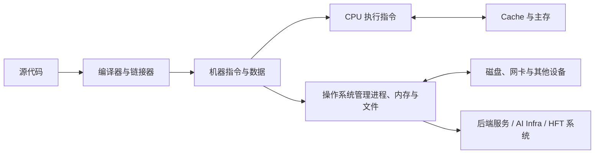

# 系统、Rust、C++ 与 HFT 基础宝典

  
INTERVIEW-FIRST · 从零建立可解释的知识体系

  
先看懂程序怎样经过 CPU、Linux、内存、网络与存储运行，再用 Rust、C++ 与 Python 解决后端、AI 基础设施和 HFT 问题。

  

    计算机系统LinuxRustC++Python算法编码网络与并发HFT系统设计
  

程序本质上是指令和数据。CPU 取出并执行指令，内存暂存正在使用的数据，操作系统负责分配 CPU 时间和内存，并把文件、网络连接、进程等资源包装成程序可以使用的抽象。磁盘、网卡等设备通过控制器、总线、中断和 DMA 与 CPU、内存协作。Rust 与 C++ 则帮助程序员表达对象生命周期、数据布局、并发关系和错误处理。

## 同一套基础怎样支撑三个领域

| 共同机制 | 传统互联网后端 | AI / Agent Infra | HFT |
|---|---|---|---|
| 进程、线程与异步任务 | 并发处理请求和后台任务 | 隔离工具进程、调度模型任务 | 分离行情、策略和订单处理 |
| 虚拟内存与缓存 | 控制服务内存和数据库缓存 | 管理模型权重、KV Cache 和沙箱内存 | 安排固定容量状态和热点数据 |
| 文件与持久化 | 保存日志、数据库和配置 | 保存检查点、工件和任务状态 | 保存审计日志、回放数据和订单状态 |
| TCP、UDP 与应用协议 | HTTP、RPC、服务发现 | 模型 API、流式输出、工具调用 | 行情分发、订单接入和会话恢复 |
| 队列、背压与观测 | 防止服务过载并定位故障 | 限制任务堆积和重试放大 | 控制消息积压并发现数据缺口 |

这些领域使用相同的底层机制，但约束不同：后端更关注吞吐、可靠性和可运维性；AI Infra 还要处理模型资源、长任务与外部工具副作用；HFT 还要处理市场规则、订单状态和延迟波动。基础章节先解释机制本身，应用章节再说明这些约束怎样改变设计。

## 全书知识结构

| 部分 | 主讲内容 | 典型问题 |
|---|---|---|
| 计算机组成与操作系统 | 数据表示、指令、CPU、存储层次、进程、同步、内存、文件与 I/O | 一条指令、一次缺页或一次 `write` 在软硬件中怎样完成 |
| Rust、C++、Python 与算法 | 所有权、RAII、对象布局、Python 对象/并发边界、类型系统、数据结构与算法 | 程序为什么正确，资源由谁拥有，跨语言时是否复制，时间和空间成本是多少 |
| 基础设施与网络 | 队列、背压、配置、日志、指标、分层网络、TCP/UDP 与 Linux I/O | 数据怎样流动，系统怎样处理拥塞、部分失败和重试 |
| 数据库与分布式系统 | 关系模型、索引、事务、恢复、复制、共识、分片与跨服务可靠性 | 多个请求或节点同时读写时怎样保持约束，崩溃后怎样恢复 |
| HFT 系统 | 市场微观结构、行情、订单、风控、撮合、回放与性能工程 | 一个订单从决策到成交经历哪些状态，断线或数据缺口怎样恢复 |

机器学习、大模型、PyTorch、GPU、分布式训推与 Agent 平台的专属内容位于同站点的 <a href="../ai/index.html">《AI 系统与 Agent Infra 基础宝典》</a>。CPU、Linux、内存、并发、网络和数据库的通用原理只在本书主讲，AI 子书直接引用这些定义，避免维护两套互相矛盾的解释。
