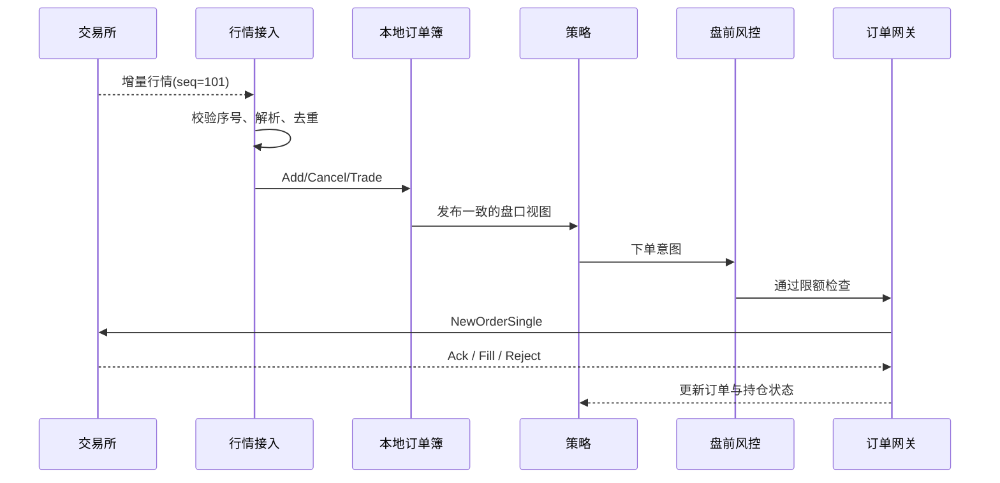

# 系统、Rust、C++ 与 HFT 基础宝典

  
INTERVIEW-FIRST · 从零建立可解释的知识体系

  
先看懂程序怎样经过 CPU、Linux、内存、网络与存储运行，再用 Rust 与 C++ 构建和解释低延迟交易系统。

  

    市场微观结构RustC++算法编码低延迟系统交易引擎系统设计面试题
  

欢迎来到《系统、Rust、C++ 与 HFT 基础宝典》。这本书同时承担两项任务：先为零基础读者建立可复用的计算机系统常识，再把这些常识用到 Rust、C++ 和低延迟交易系统。你会知道一个程序为什么能运行、一次系统调用或文件写入经过哪些层，也会理解行情、订单、撮合、风控和性能工程怎样组成真实交易链路。

## 三条主线怎样汇合

| 主线 | 本书覆盖范围 | 最终面试能力 |
|---|---|---|
| HFT | 从市场微观结构、订单生命周期和行情恢复，到交易引擎、风控、执行与回测 | 能推演撮合、订单状态、故障恢复，并画出端到端交易架构 |
| 计算机系统与 Rust/C++ | 从程序执行、进程、虚拟内存和文件写入，到所有权、RAII、并发、网络 I/O、测试与剖析 | 能解释一个操作从代码到软硬件发生了什么，以及实现选择的成本和边界 |
| 算法笔试与面试编码 | 从暴力基线、伪代码和不变量，到 C++20、边界测试、随机对拍与岗位场景题 | 能在限时条件下独立解决数据结构与算法题，并清楚解释正确性和复杂度 |

三条主线不会各讲各的。HFT 提供真实问题和正确性约束，Rust 与 C++ 提供两套实现和思考工具，算法训练强化从题意到正确实现的推理链，测试、回放与性能分析负责把它们连成证据链。例如，理解 SPSC 队列之前先明确谁生产、谁消费；讨论“更快”之前先证明订单状态和风险检查没有被破坏。

AI 专属内容已经拆分为另一册。如果你的目标是机器学习、大模型或 Agent 平台，请前往部署后的 <a href="../ai/index.html">《AI 与 Agent Infra 面试宝典》</a>。CPU、Linux、内存、并发、网络、存储和性能诊断等通用基础只在本书主讲；AI 书通过先修链接复用它们，再解释沙箱、模型服务和 Agent 工作流新增的问题。

> **给第一次接触 HFT 的读者**
>
> 你不需要预先懂金融、Rust、C++ 或 CPU 微架构。本书会先说人话，再给术语；先画出数据流，再深入实现；先建立正确性，再谈纳秒优化。

## 这本书要帮你解决什么

面试官通常不满足于听到一个术语。他会继续追问：“为什么？”“代价是什么？”“出故障怎么办？”“你怎么证明它更快？”因此，本书的目标不是让你背诵结论，而是形成下面这条推理链：

学完 HFT 主线后，你应该能清楚回答：

- 一笔订单从策略产生到交易所确认，经过哪些组件？
- 市价单、限价单、IOC、FOK、Post-Only 分别解决什么问题？
- 价格优先、时间优先和 Pro-Rata 会怎样改变成交结果？
- 为什么平均延迟很低，系统仍可能在开盘时失效？
- 行情丢包后为什么不能“先凑合交易”，怎样恢复订单簿？
- 为什么线程绑核、预分配和 SPSC 队列常见，却都不是无条件正确？
- 如何画出一个可落地的 HFT 系统，并解释降级、风控和可观测性？

## 全书知识地图

| 层次 | 你要掌握的核心问题 | 对应面试能力 |
|---|---|---|
| HFT 与市场 | 谁在交易、订单如何成交、盘口如何变化 | 能用一个算例手工推演订单簿 |
| 交易链路 | 行情、策略、风控、网关、回报怎样协作 | 能画端到端架构并讲清状态流转 |
| 系统基础 | CPU、缓存、调度、内存、网络有哪些成本 | 能解释延迟来源，而不是只背优化参数 |
| Rust/C++ 成本模型 | 所有权、RAII、布局、原子、`unsafe` 与 UB 如何影响热路径 | 能说明安全边界和抽象代价 |
| 算法编码 | 数组、哈希、堆、树图、贪心、DP 和流式问题怎样从思路落到 C++ | 能完成笔试、白板编码、复杂度分析与连续追问 |
| 性能与验证 | 怎样测量、定位、回归和上线 | 能给出证据链、失败预案与验收指标 |

## 五条推荐学习路线

### 路线 A：零基础求职（推荐）

1. 先读“如何使用本书”和 HFT 基础六章，知道整本书最终要解决什么业务问题。
2. 再读系统基础的“程序执行总览 → 进程与文件描述符 → 虚拟内存 → 操作系统 → 文件写入”。
3. 回到市场数据、订单簿、订单路由、风控与执行，把系统概念放进真实链路。
4. 最后完成 Rust/C++、性能工程、测试、回放和系统设计题。

这条路线先建立全景图，避免一开始掉进 `Acquire/Release` 或 `io_uring` 的细节里，却不知道这些技术要解决什么业务问题。

### 路线 B：Rust 开发者转低延迟

先读 HFT 总览与交易生命周期，再按“内存布局 → 并发模型 → 原子操作 → 队列 → 网络 I/O → 基准与剖析”的顺序学习。重点不是重新学语法，而是建立 **成本模型**：一次分配、一次跨核共享、一次系统调用分别可能带来什么后果。

### 路线 C：C++ 零基础准备量化开发

先读 C++ 部分导论。完全没学过时按“最小语法 → 基础复习练习”起步；以前学过但忘了时直接做“基础复习”的 30～90 分钟诊断。随后按“编译与内存 → 指针与引用 → RAII → 拷贝和移动 → STL”的顺序学习。此时进入[算法笔试专题](algorithms/)，再继续原子、无锁和性能工具。最后完成 C++ HFT 贯穿项目，并用 Sanitizer、测试和基准检查它。

### 路线 D：DeepSeek/九坤算法笔试与编码面试

先用[C++ 基础复习](cpp/basics_refresher.md)找回手感，再进入[算法专题导论](algorithms/)。每道题按“暴力基线 → 不变量 → 伪代码 → 正确性与复杂度 → C++20 → 边界测试 → 追问”完成，不用背题号。最后完成[基础两套限时模拟](algorithms/mock_exams.md)与[两套追加盲测](algorithms/mock_exams_extra.md)，并按目标岗位补系统、数学、机器学习或 HFT 业务。专题中的公司场景是能力训练，不冒充官方真题。

### 路线 E：面试前冲刺

先做 HFT 高频面试题库，不会的题回跳到对应章节；随后限时完成系统设计题，并用“结论—原因—权衡—验证”四步法复述。最后用附录速查表和术语表查漏补缺。

## 每章应该怎样读

本书尽量让重要章节形成统一闭环：

1. **本章目标**：先知道要解决什么问题。
2. **直觉模型**：用生活类比或小盘口建立画面。
3. **工作原理**：补上准确术语、状态机、公式或内存模型。
4. **工程实现**：给出 Rust、C++、伪代码、表格或架构图。
5. **面试现场**：展示基础问法、追问路径和参考答题骨架。
6. **易错点与练习**：暴露边界条件，检查你是否真的理解。

> **阅读提示：先正确，再快速**
>
> HFT 系统最昂贵的错误通常不是“慢了几十纳秒”，而是使用了错误行情、重复报单、越过限额或丢失订单状态。优化前先定义不变量，再测量关键路径，最后用回放和测试证明语义没有变化。

## 贯穿全书的示例链路

后续章节会反复回到同一条链路，逐层放大细节：

你会看到，所谓“低延迟”不是某个函数跑得快，而是整条链路在 **正确、可预测、可恢复** 的前提下足够快。

## 内容边界与责任

- 本书是工程与面试学习材料，不构成投资建议，也不承诺任何收益。
- 市场规则因资产类别、交易所、会员协议和地区监管而异；实现前必须阅读目标场所的最新官方规范。
- 延迟数字若标为“教学算例”，只用于演算；真实结论必须来自你的硬件、编译器、数据和生产负载。
- `unsafe`、内核旁路、CPU 隔离等技术会增加风险和运维成本，只有在测量证明必要时才应采用。

## 从哪里开始

第一次阅读请进入 [如何使用本书：从零基础到面试表达](introduction/how_to_use.md)，然后开始 HFT 基础部分。如果你已经能画出完整交易链路，可以直接从市场微观结构或系统设计章节自测；如果你熟悉 Rust 但不了解交易业务，也仍建议先读 HFT 总览，避免只会谈技术组件却说不清它们服务的业务约束。
