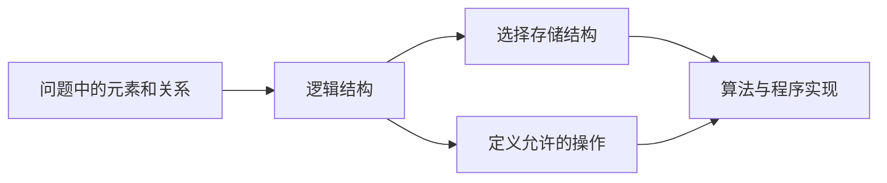

# 数据结构总论：逻辑、存储与抽象类型

程序不仅要保存数据，还要保存数据之间的关系。通讯录要知道姓名对应哪条记录，文件系统要知道目录包含哪些文件，任务调度器要知道谁先执行。若只记录零散数值，却不规定它们怎样关联、允许怎样操作，程序仍然无法可靠地使用这些数据。

**数据结构**研究的正是三个问题：数据元素之间有什么逻辑关系，这种关系怎样存进计算机，以及在这种表示上怎样完成查找、插入、删除等操作。

## 1. 数据、数据元素与数据项

这些词看起来相近，但描述的层次不同。

- **数据**是计算机能够输入、保存、处理和输出的符号集合。整数、文字、图片像素和网络消息都属于数据。
- **数据元素**是一个问题中作为整体处理的基本单位。例如学生表中的“一名学生记录”。
- **数据项**是组成数据元素的字段。例如学生记录中的学号、姓名和成绩。
- **数据对象**是具有相同性质的数据元素的集合。例如某班全部学生记录。

```text
学生数据对象
├── 学生元素 1：{学号, 姓名, 成绩}
├── 学生元素 2：{学号, 姓名, 成绩}
└── 学生元素 3：{学号, 姓名, 成绩}
                  └──── 数据项
```

“基本单位”取决于当前问题。在教务系统中，一名学生可以是一个元素；在姓名字符串处理中，一个字符又可以成为元素。不能脱离问题背景问“哪个一定是数据元素”。

### 1.1 关键字是什么

**关键字**（key）是用于识别或比较数据元素的数据项。若某字段能在集合中唯一识别元素，就称为主关键字，例如学号；允许重复的成绩也能作为排序或查找关键字，但不能唯一定位学生。

选择关键字会改变接口语义。`find_by_id(42)` 期望最多一个结果，`find_by_score(90)` 可能返回很多结果。数据结构必须和这种语义匹配。

## 2. 数据结构的三个组成部分

一个完整数据结构包含：

1. **逻辑结构**：元素之间在问题中的关系；
2. **存储结构**：这些元素和关系怎样放进内存；
3. **数据运算**：允许对数据执行哪些操作，以及操作结果应满足什么条件。



逻辑结构回答“数据是什么关系”，存储结构回答“计算机怎样表示这种关系”。同一种逻辑结构可以有多种存储方式。例如线性表既可以用连续数组保存，也可以用节点和指针连接。

## 3. 四类常见逻辑结构

### 3.1 集合结构

集合中的元素同属一个集合，除此以外不强调顺序关系。例如一个不重复用户 ID 集合。

数学集合通常不关心元素排列，而程序中的具体集合实现可能为了查找使用哈希表或平衡树。实现的遍历顺序不应被误认为集合逻辑本身的顺序。

### 3.2 线性结构

在线性结构中，元素排成一个序列。除首尾外，每个元素有唯一直接前驱和唯一直接后继。

```text
a₀ -> a₁ -> a₂ -> ... -> aₙ₋₁
```

线性表、栈、队列和字符串都属于线性关系的不同抽象。线性只表示前后关系，不表示元素值已经从小到大排序。

### 3.3 树形结构

树形结构表示一对多的层次关系。除根以外，每个节点有一个直接父节点，一个节点可以有多个子节点。例如文件目录、组织结构和语法树。

### 3.4 图结构

图结构表示更一般的多对多关系。道路网络中的城市和道路、社交网络中的用户和关注关系都可以建模为图。

这四类是建立直觉的分类，不是说真实系统只能选择一个。一个数据库可以用树组织索引，同时用链表维护页面，再用图表达查询计划。

## 4. 逻辑关系怎样存进内存

**存储结构**也常叫物理结构。它不仅要保存元素本身，还要让程序能够恢复元素之间的关系。

### 4.1 顺序存储

**顺序存储**把逻辑上相邻的元素放在连续内存位置。给定首地址和元素宽度，可以直接算出第 `i` 个元素的地址。

数组和顺序表是典型例子。优点是随机访问直接、空间紧凑、容易利用缓存；中间插入或删除通常要移动后续元素。

### 4.2 链式存储

**链式存储**允许节点分散在内存中，每个节点额外保存指向相关节点的链接。单链表节点保存 `next`，双链表还保存 `prev`。

优点是已知插入位置附近节点时，不必移动所有后续元素；代价是链接占空间，按下标访问必须沿链接逐个走，并且节点分散可能不利于缓存。

### 4.3 索引存储

**索引存储**额外建立“关键字或位置到数据地址”的索引项。像书的目录一样，先查较小的索引，再定位正文。

索引能减少查找范围，但需要额外空间，数据更新时还要同步维护索引。数据库 B+ 树索引就是更复杂的实例。

### 4.4 散列存储

**散列存储**使用散列函数把关键字映射到表中位置。理想情况下可以平均快速查找，但不同关键字可能映射到同一位置，这叫散列冲突，必须通过开放寻址或链地址等方法处理。

散列函数、负载因子与最坏退化会在查找章节展开。本章只需知道：散列不是一种新的逻辑关系，而是一种按关键字组织和定位数据的存储方法。

| 存储方式 | 关系怎样表示 | 典型优势 | 典型代价 |
|---|---|---|---|
| 顺序 | 相对位置 | 按下标直接访问、紧凑 | 中间增删要移动 |
| 链式 | 节点中的链接 | 局部接链方便 | 定位慢、链接有开销 |
| 索引 | 额外索引表 | 缩小查找范围 | 占空间且更新要维护 |
| 散列 | 散列函数与冲突结构 | 平均快速按键访问 | 无自然顺序，存在冲突与退化 |

## 5. ADT：先规定“能做什么”，再决定“怎样做”

**抽象数据类型**（Abstract Data Type，ADT）由一组值、允许的操作以及每个操作的语义组成。ADT 对使用者承诺行为，但隐藏内部表示。

例如“集合”ADT 可以规定：

```text
insert(x)    把 x 加入集合
contains(x)  判断 x 是否存在
erase(x)     删除 x
size()       返回元素数量
```

这个接口没有规定内部必须使用数组、链表、哈希表还是树。接口相同，不同实现的复杂度、遍历顺序和内存开销可以不同。

### 5.1 接口、实现和客户端

- **接口**说明调用者可以做什么；
- **实现**说明数据如何保存以及操作如何完成；
- **客户端**是使用这个 ADT 的程序。

下面的完整 C++20 程序用抽象类定义一个整数集合接口，再用动态数组给出简单实现。此处重点不是造一个比标准库更好的集合，而是观察客户端只依赖接口。

```cpp
#include <algorithm>
#include <cassert>
#include <cstddef>
#include <iostream>
#include <vector>

class IntegerSet {
public:
    virtual ~IntegerSet() = default;
    virtual bool insert(int value) = 0;
    virtual bool contains(int value) const = 0;
    virtual bool erase(int value) = 0;
    virtual std::size_t size() const noexcept = 0;
};

class VectorIntegerSet final : public IntegerSet {
public:
    bool insert(int value) override {
        if (contains(value)) {
            return false;
        }
        values_.push_back(value);
        return true;
    }

    bool contains(int value) const override {
        return std::find(values_.begin(), values_.end(), value) != values_.end();
    }

    bool erase(int value) override {
        const auto found = std::find(values_.begin(), values_.end(), value);
        if (found == values_.end()) {
            return false;
        }
        values_.erase(found);
        return true;
    }

    std::size_t size() const noexcept override {
        return values_.size();
    }

private:
    std::vector<int> values_;
};

void use_set(IntegerSet& numbers) {
    assert(numbers.insert(7));
    assert(!numbers.insert(7));
    assert(numbers.contains(7));
    assert(numbers.erase(7));
    assert(!numbers.contains(7));
}

int main() {
    VectorIntegerSet numbers;
    use_set(numbers);
    assert(numbers.size() == 0);
    std::cout << "ADT contract satisfied\n";
}
```

该实现的 `contains` 是线性查找。以后可以换成哈希表实现而不改变客户端的四个操作，但如果接口还承诺“按插入顺序遍历”，替换实现时就必须继续维护这项语义。

### 5.2 操作契约：前置、后置与不变量

一个操作不能只有函数名，还要说明边界：

- **前置条件**：调用前必须成立，例如插入位置满足 `0 <= i <= size`；
- **后置条件**：成功返回后必须成立，例如原下标 `i..n-1` 的元素后移一位；
- **不变量**：每次公开操作前后都成立，例如 `size <= capacity`，链表尾节点的 `next` 为空。

契约能区分“调用者传错参数”和“实现破坏结构”。C++ 可以用异常、返回 `optional`、错误码或断言表达不同失败语义；接口应明确选择一种。

## 6. 数据结构与算法不能分开评价

**算法**是解决问题的一组有限步骤，**数据结构**是算法操作数据的组织方式。同一个算法思想落在不同结构上，成本可能完全不同。

例如“取得第 `i` 个元素”：

- 连续数组可以由地址公式直接定位，通常为 `O(1)`；
- 单链表必须从头沿 `next` 走 `i` 次，为 `O(i)`，最坏 `O(n)`。

反过来，“在已知节点后插入”：

- 链表只需改变少量链接，连接步骤为 `O(1)`；
- 顺序表要为后续元素腾位置，最坏移动 `O(n)` 个元素。

这里特意说“已知节点”。若先按值寻找插入位置，链表查找仍需 `O(n)`。面试中把“链表插入 O(1)”说成无条件结论，是最常见的不完整回答之一。

## 7. 时间复杂度：数随规模增长的主要操作

**输入规模**通常记作 `n`。对线性表，`n` 常表示元素数量。时间复杂度不直接记录某台机器的秒数，而描述主要操作次数随 `n` 的增长趋势。

### 7.1 从语句次数建立直觉

```text
读取 a[5]                 固定次数 -> O(1)
从头扫描 n 个元素         约 n 次  -> O(n)
两个独立的 n 次循环       约 2n 次 -> O(n)
两层各执行 n 次的嵌套循环 约 n² 次 -> O(n²)
每轮把范围减半            约 log₂n 次 -> O(log n)
```

渐近记号忽略常数和低阶项，是为了比较规模变大后的增长。例如 `3n + 100` 属于 `O(n)`。这不表示常数在真实性能中不重要，也不表示两个 `O(n)` 实现速度一定相同。

严格的上界、下界、不变量与正确性证明见[复杂度、正确性与测试](complexity_correctness.md)。本章只建立选择数据结构所需的成本直觉。

### 7.2 最坏、平均和最好情况

线性查找目标值：

- 最好情况是第一个元素就匹配，`O(1)`；
- 最坏情况是最后才匹配或根本不存在，`O(n)`；
- 平均情况必须先说明目标位置和存在概率等输入分布，不能凭空写 `O(n/2)`。

大 O 忽略常数，所以 `O(n/2)` 仍写成 `O(n)`。面试若只问复杂度，通常优先给最坏情况，再补充平均或摊还条件。

## 8. 空间复杂度与递归空间

空间分析至少区分：

- 输入本身占用的空间；
- 输出结果空间；
- 算法为了工作额外申请的**辅助空间**；
- 递归调用栈。

一个只用三个局部整数扫描数组的算法，额外空间是 `O(1)`，即使输入数组本身占 `O(n)`。若先复制整个数组，额外空间变为 `O(n)`。

### 8.1 递归为什么也占空间

每次函数调用都需要一个**栈帧**，保存参数、局部变量、返回地址等信息。递归深度为 `h` 且每层使用固定空间时，调用栈通常为 `O(h)`。

```text
solve(4)
└── solve(3)
    └── solve(2)
        └── solve(1)
```

即使每层只有几个变量，四层也同时存在四个栈帧。二分递归深度通常为 `O(log n)`；在退化链表上递归处理每个节点，深度可能是 `O(n)`，并可能耗尽调用栈。

不能只数代码中显式的 `new` 或容器，漏掉递归栈。

## 9. 摊还分析：偶尔很贵，长期仍然便宜

动态数组空间满时，常申请更大连续区域并搬移旧元素。那一次尾插可能是 `O(n)`，为什么仍常说尾插“摊还 `O(1)`”？

假设容量每次翻倍，从 1 扩到 2、4、8，插入 `n` 个元素期间，旧元素总搬移量小于：

`1 + 2 + 4 + ... + 不超过 n/2 < n`

再加上每次新元素自身的写入，`n` 次尾插总工作仍为 `O(n)`，平均分摊到每次为 `O(1)`。

**摊还分析**不需要假设输入随机，它对一整串操作给出总成本上界。它也不表示每次操作都便宜：触发扩容的那一次仍可能移动许多元素。

### 9.1 为什么不每次只增加一个槽位

若容量每满一次只增加 1，搬移量会是：

`1 + 2 + 3 + ... + (n-1)`

总量为 `O(n²)`，尾插不再具有常数摊还成本。几何增长用一定比例的暂时空闲，换取显著减少搬迁次数。

缩容也要留出滞后。例如刚低于满容量就减半、下一次插入又扩容，可能在边界附近反复搬移。常见策略在低于四分之一容量时才减半，避免这种**抖动**。

## 10. 怎样为问题选择数据结构

不要从“我最熟悉哪个容器”出发，而要列出最频繁和最关键的操作：

1. 数据的逻辑关系是什么：集合、序列、树还是图？
2. 需要按位置、按关键字，还是按最小/最大值访问？
3. 查找、插入、删除、遍历各有多频繁？
4. 是否要求保持顺序、允许重复或支持范围查询？
5. 数据规模和内存预算是多少？
6. 最坏情况、平均情况还是单次尖峰最重要？
7. 接口是否需要稳定引用、迭代器或并发访问？

例如，日志批次主要追加并顺序扫描，动态数组往往是自然起点；若任务需要不断取最小优先级，堆比每次扫描整个数组更合适；若要按键平均快速查询，哈希表可能合适；若还要有序范围查询，则需要有序树结构。

## 11. 常见错误

- **把逻辑结构等同于存储结构。** 线性表是逻辑结构，数组和链表是它的不同实现。
- **只背整体标签。** “链表插入 O(1)”遗漏了寻找位置和内存分配成本。
- **把有序和线性混为一谈。** 线性表示前后关系，不保证值排序。
- **忽略操作契约。** `erase(5)` 是删下标 5，还是删值 5，必须由接口说清楚。
- **混用平均与摊还。** 平均复杂度依赖输入分布；摊还复杂度分析操作序列总成本。
- **漏算递归栈。** 没有显式申请堆内存不等于额外空间为 `O(1)`。
- **只看复杂度，不看布局。** 同为 `O(n)`，连续数组和分散链表的常数、缓存行为和分配成本可能差很多。
- **过早发明复杂结构。** 先根据操作需求选最简单正确结构，再用测量判断是否需要调整。

## 12. 三类系统中的实际用途

- **传统后端**会用数组保存批量结果、哈希表按 ID 查询、树索引支持有序范围、队列传递任务。
- **AI Infra** 会用连续张量和批次利用顺序访问，用图表示计算依赖，用队列安排推理请求。
- **系统与 HFT** 会用环形数组传递有界消息、用哈希表维护按键状态、用有序结构聚合价格层级。

这些行业名称不改变数据结构的定义。真正决定选择的是操作集合、数据规模、顺序要求与成本边界。

## 13. 本章小结

- 数据元素是问题中整体处理的单位，数据项是组成元素的字段；关键字用于识别或比较元素。
- 数据结构包含逻辑结构、存储结构和定义在其上的运算。
- 集合、线性、树和图描述逻辑关系；顺序、链式、索引和散列描述常见存储方式。
- ADT 规定值、操作和语义，接口不应无故暴露内部表示。
- 时间复杂度描述主要操作次数的增长，空间分析还要计算辅助结构和递归栈。
- 摊还 `O(1)` 表示长操作序列的平均分摊上界，不表示每一次都是最坏 `O(1)`。
- 选择结构要从所需操作与约束出发，而不是背诵“哪一种最快”。

## 14. 思考题与面试、408 追问

1. 以学生管理系统为例，分别指出数据对象、数据元素、数据项和可能的关键字。
2. 逻辑结构与存储结构有什么区别？为什么线性表既能顺序存储也能链式存储？
3. 集合、线性、树和图结构中，元素关系分别有什么特点？
4. 比较顺序、链式、索引和散列存储。它们分别额外保存了什么关系信息？
5. 什么是 ADT？“栈必须用数组实现”这句话错在哪里？
6. 为一个线性表的 `insert(i, x)` 写出前置条件、后置条件和至少一个结构不变量。
7. 为什么“链表插入是 `O(1)`”必须补充前提？若按值先查找再插入，总成本是什么？
8. 两个连续的 `O(n)` 循环与两个嵌套的 `O(n)` 循环分别是什么复杂度？为什么？
9. 平均复杂度与摊还复杂度依赖的条件有什么不同？动态数组扩容属于哪一种？
10. 容量每次翻倍时，连续插入 `n` 个元素为什么总搬移量是 `O(n)`？若每次只增加一个槽位会怎样？
11. 一个递归函数每层申请 32 byte 局部状态，最大深度为 `n`。渐近额外空间是多少？实际还要警惕什么？
12. 为“按用户 ID 查询，同时按注册时间遍历”的需求选择一种或组合多种结构，并说明更新时要维护什么。
13. 若哈希表平均查询 `O(1)`，是否一定比数组线性扫描快？请给出至少三个还需考虑的条件。
14. 一种实现把所有内部节点地址暴露给客户端。以后若从链表换成数组，会遇到什么接口兼容问题？

## 15. 权威依据与延伸阅读

- [2025 年 408 公开考试大纲：数据结构基本概念与线性表](https://www.csgraduates.com/study_methods/outline/2025/)：用于核对逻辑结构、存储结构、算法分析与线性表范围。
- [清华大学出版社：严蔚敏、吴伟民《数据结构（C语言版）》](https://www.tup.tsinghua.edu.cn/bookscenter/book_02564806.html)：教材主干按绪论、线性表及其顺序和链式实现展开。
- [MIT 6.006 官方课程：Data Structures and Dynamic Arrays](https://ocw.mit.edu/courses/6-006-introduction-to-algorithms-spring-2020/851ae1c98f7a73382b76732f977bb92f_CHhwJjR0mZA.pdf)：用于核对接口、动态数组和摊还扩容的组织方式。
- [Princeton Algorithms 官方材料：链表与扩容数组](https://algs4.cs.princeton.edu/13stacks/)：提供数组、链表及操作成本的经典实现对照。
