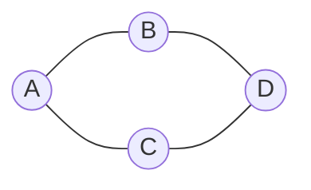

# 图：表示关系、遍历网络

线性表描述一前一后的关系，树描述一对多的层次关系。现实中的道路、依赖、社交关系和网络连接更一般：一个对象可以和任意多个对象相连。**图（graph）**就是表示这种多对多关系的数据结构。

## 1. 顶点与边

图记作 `G = (V, E)`：

- `V` 是**顶点（vertex）**集合，表示对象；
- `E` 是**边（edge）**集合，表示对象之间的关系。



若边没有方向，`{A,B}` 与 `{B,A}` 是同一条边，称为**无向图**。若边从一个顶点指向另一个顶点，`<A,B>` 与 `<B,A>` 不同，称为**有向图**。

边还可以带**权重（weight）**，例如道路距离、通信费用或任务耗时。没有显式权重时，很多算法把每条边看作相同代价。

## 2. 图中常用术语

| 术语 | 含义 |
|---|---|
| 邻接 | 两个顶点之间存在边 |
| 无向顶点的度 | 与它相连的边数 |
| 入度 | 有向边进入该顶点的数量 |
| 出度 | 从该顶点发出的边数量 |
| 路径 | 首尾相接的一串顶点与边 |
| 路径长度 | 无权图常指边数；带权图常指权重之和 |
| 简单路径 | 顶点不重复的路径 |
| 环/回路 | 起点和终点相同的路径 |
| 简单图 | 通常指没有自环和重边的图 |
| 完全图 | 任意两个不同顶点之间都有边 |

无向图每条边为两个端点各贡献 1 度，因此：

```text
所有顶点度数之和 = 2|E|
```

所以无向图中奇数度顶点的数量一定是偶数。

有向图每条边贡献一个入度和一个出度：

```text
所有顶点入度之和 = 所有顶点出度之和 = |E|
```

## 3. 连通、强连通与连通分量

无向图中，若任意两顶点之间都有路径，图是**连通图**。不连通图可以分成若干最大连通子图，称为**连通分量**。

有向图需要区分方向：若任意 `u` 都能沿有向边到 `v`，且 `v` 也能到 `u`，图是**强连通图**；最大强连通子图称为强连通分量。

“弱连通”通常表示忽略边方向后连通。它不能推出有向路径双向存在。

## 4. 邻接矩阵

有 `n` 个顶点时，用 `n×n` 数组 `A` 表示边：

```text
无权图：A[i][j] = 1 表示 i 到 j 有边，否则为 0
带权图：A[i][j] = 边权；无边用特殊值表示
```

上图按 A、B、C、D 排列的无向邻接矩阵为：

```text
    A B C D
A   0 1 1 0
B   1 0 0 1
C   1 0 0 1
D   0 1 1 0
```

无向图的矩阵关于主对角线对称。顶点 `i` 的一行元素和就是其度；有向图的一行和是出度，一列和是入度。

| 操作 | 邻接矩阵成本 |
|---|---|
| 判断 `u→v` 是否有边 | O(1) |
| 枚举一个顶点的所有邻居 | O(V) |
| 空间 | O(V²) |

矩阵适合顶点少而边多的稠密图，或频繁判断任意两点是否相邻的场景。

## 5. 邻接表

**邻接表（adjacency list）**为每个顶点保存一张出边/邻居列表：

```text
A: B, C
B: A, D
C: A, D
D: B, C
```

| 操作 | 邻接表成本 |
|---|---|
| 枚举 `u` 的邻居 | O(deg(u)) |
| 判断 `u→v` 是否有边 | 普通列表 O(deg(u)) |
| 空间 | O(V+E)；无向边通常存两次 |

它适合现实中常见的稀疏图。若每个邻接表改用哈希集合，可改善平均边查询，却增加空间且失去稳定遍历顺序；表示法要服从主要操作。

下面是有向图的 C++20 邻接表：

```cpp,ignore
#include <cstddef>
#include <stdexcept>
#include <vector>

class Graph {
public:
    explicit Graph(int n) {
        if (n < 0) throw std::invalid_argument("negative vertex count");
        adj_.resize(static_cast<std::size_t>(n));
    }

    void add_directed_edge(int from, int to) {
        check(from);
        check(to);
        adj_[from].push_back(to);
    }

    const std::vector<int>& neighbors(int v) const {
        check(v);
        return adj_[v];
    }

    int size() const { return static_cast<int>(adj_.size()); }

private:
    void check(int v) const {
        if (v < 0 || v >= size()) throw std::out_of_range("vertex");
    }
    std::vector<std::vector<int>> adj_;
};
```

无向边要向两个方向各加入一次。若输入可能重复，需决定重边是合法数据、合并权重还是错误。

## 6. 十字链表与邻接多重表解决什么

408 会区分两种针对边的链式表示：

- **十字链表**用于有向图。每条边结点同时挂在起点的出边链和终点的入边链上，所以既能枚举出边，也能枚举入边；
- **邻接多重表**用于无向图。一条无向边只保存一个边结点，同时连接到两个端点的边链，适合删除或更新边。

它们解决普通邻接表的特定不便：有向邻接表若只存出边，找入边要扫描全图；无向邻接表把一条边复制两份，修改时要同步两处。

工程代码常直接使用边数组、入边/出边双表或数据库索引实现相同目的。考试重点是理解“一条边怎样同时归属于两个顶点”，不必死记具体字段名。

## 7. 广度优先搜索 BFS

**广度优先搜索（Breadth-First Search，BFS）**从起点开始，先访问距离为 1 的顶点，再访问距离为 2 的顶点，因此使用 FIFO 队列。

```text
BFS(start):
    visited[start] = true
    queue.push(start)
    while queue not empty:
        u = queue.pop_front()
        visit(u)
        for each v in neighbors(u):
            if not visited[v]:
                visited[v] = true
                queue.push_back(v)
```

**必须在入队时标记 visited。** 若等到出队才标记，同一顶点可能被多个前驱重复入队，浪费时间和空间。

在无权图中，BFS 第一次到达顶点时经过的边数最少。保存 `parent[v] = u` 可以从终点反向恢复一条最短路径。

```cpp,ignore
#include <algorithm>
#include <queue>
#include <stdexcept>
#include <vector>

std::vector<int> shortest_path(
    const std::vector<std::vector<int>>& graph, int start, int target) {
    const int n = static_cast<int>(graph.size());
    if (start < 0 || start >= n || target < 0 || target >= n) return {};

    std::vector<int> parent(n, -1);
    std::vector<bool> visited(n, false);
    std::queue<int> q;
    visited[start] = true;
    q.push(start);

    while (!q.empty()) {
        int u = q.front();
        q.pop();
        if (u == target) break;
        for (int v : graph[u]) {
            if (v < 0 || v >= n) {
                throw std::invalid_argument("neighbor index out of range");
            }
            if (!visited[v]) {
                visited[v] = true;
                parent[v] = u;
                q.push(v);
            }
        }
    }

    if (!visited[target]) return {};
    std::vector<int> path;
    for (int v = target; v != -1; v = parent[v]) path.push_back(v);
    std::reverse(path.begin(), path.end());
    return path;
}
```

## 8. 深度优先搜索 DFS

**深度优先搜索（Depth-First Search，DFS）**沿一条路径尽量深入，走不下去再回退。递归调用栈或显式栈都可保存尚未处理完的路径。

```text
DFS(u):
    visited[u] = true
    visit(u)
    for each v in neighbors(u):
        if not visited[v]:
            DFS(v)
```

递归版简洁，但极深图可能耗尽调用栈。显式栈可以控制内存和遍历过程；若希望遍历顺序与递归版一致，邻居压栈顺序通常要反过来。

DFS 可用于连通分量、环检测、拓扑排序和强连通分量等问题。不同问题除 `visited` 外还可能需要“正在当前递归路径中”等额外状态，不能把一份模板不加解释地套用。

## 9. 遍历不连通图

只从一个起点 BFS/DFS，只会访问该起点所在分量。遍历整张图要在外层扫描全部顶点：

```text
for u in all vertices:
    if not visited[u]:
        DFS(u)   // 每次开始一个新的 DFS 树
```

无向图中，启动 DFS/BFS 的次数就是连通分量数量；遍历边形成的多棵树组成**生成森林**。

邻接表下，每个顶点访问一次，每条有向边检查一次，因此 BFS/DFS 为 O(V+E)。邻接矩阵需要为每个顶点扫描整行，时间 O(V²)。

## 10. 生成树

连通无向图的一棵**生成树（spanning tree）**包含全部 `V` 个顶点，使用 `V-1` 条边，并且连通且无环。DFS 或 BFS 首次发现新顶点所用的边就构成一棵生成树。

以下命题等价地描述 n 个顶点的一棵树：

- 连通且有 n−1 条边；
- 无环且有 n−1 条边；
- 任意两点之间恰有一条简单路径；
- 删除任意边都会不连通；
- 加入任意非树边都会形成一个环。

带权图中，总权重最小的生成树叫最小生成树，Prim 与 Kruskal 的推演见[进阶数据结构与图算法](advanced_structures.md)。普通 BFS/DFS 生成树不保证权重最小。

## 11. DAG 与拓扑关系

没有有向环的图叫**有向无环图（Directed Acyclic Graph，DAG）**。它可以表示“必须先完成”的依赖：若 `A→B` 表示 B 依赖 A，则合法执行顺序必须让 A 在 B 前面。

把 DAG 顶点排成满足所有边方向的线性序列叫**拓扑排序**。一个 DAG 可能有多个合法拓扑序；存在有向环时没有拓扑序。Kahn 入度算法和 DFS 方法见[图、并查集、最短路与回溯](graph_search.md)。

## 12. 408 中四类典型图应用怎样区分

图的表示和遍历是基础，最小生成树、最短路径、拓扑排序和关键路径则回答四种不同问题。先分清目标，才能选择算法。

| 问题 | 输入与目标 | 常见算法 | 关键前提 |
|---|---|---|---|
| 最小生成树 | 连通带权无向图；连接全部顶点且总边权最小 | Prim、Kruskal | 优化的是整棵树的边权总和，不是某两点路径 |
| 单源最短路径 | 从一个起点到其余顶点的路径代价最小 | 无权图 BFS；非负权 Dijkstra；含负边可考虑 Bellman–Ford | Dijkstra 不能处理可达负边 |
| 全源最短路径 | 求每一对顶点之间的最短距离 | Floyd–Warshall | 可含负边；若存在相关负环，就没有有限最短路；时间 `O(V³)`、空间 `O(V²)` |
| 拓扑排序 | 为有向依赖安排合法先后顺序 | Kahn 入度法、DFS | 图必须是 DAG，结果可能不唯一 |

最小生成树与最短路径尤其容易混淆。最小生成树让“所有顶点连起来”的总成本最小；从根沿这棵树到某个顶点的路径却不一定是原图最短路径。最短路径算法分别优化每条起点到终点的路径，不要求最终选出的边组成一棵总权最小的树。完整代码和证明分别见[图、并查集、最短路与回溯](graph_search.md)与[进阶数据结构与图算法](advanced_structures.md)。

### 12.1 AOV 网与 AOE 网

**AOV 网（Activity on Vertex network）**用顶点表示活动，用有向边 `u→v` 表示活动 `u` 必须先于 `v`。拓扑排序就是给 AOV 网找一个满足全部依赖的执行次序。

**AOE 网（Activity on Edge network）**用有向边表示活动，边权表示活动持续时间，顶点表示“前面的活动已经完成、后面的活动可以开始”的事件。AOE 网必须是 DAG；否则项目依赖形成循环，无法得到有限完成顺序。

### 12.2 关键路径为何决定最短工期

AOE 网中，从源点到汇点的最长带权路径叫**关键路径**。它之所以取最长路径，是因为汇点必须等待所有前置分支完成；最长的那条依赖链决定项目最早何时结束。关键路径上的活动没有可推迟余量，任何一个延迟都会直接推迟总工期。

对边 `u→v`、持续时间 `w`：

```text
活动最早开始时间 e = ve[u]
活动最迟开始时间 l = vl[v] - w
时间余量 = l - e
```

`ve[x]` 是事件 `x` 的最早发生时间：按拓扑序向前扫描，对所有入边取最大完成时间。`vl[x]` 是在不延误总工期的前提下，事件 `x` 最迟可发生的时间：先把汇点最迟时间设为最早完工时间，再按逆拓扑序向后取最小值。当某项活动满足 `e == l` 时，它是关键活动。

例如两条并行路径耗时分别为 `3+4=7` 与 `2+2=4`，汇点最早只能在第 7 个时间单位发生；第一条路径是关键路径，第二条路径最多有 3 个时间单位的总余量。若网络有多个源点或汇点，可以连接持续时间为 0 的超级源点或超级汇点，再统一计算。

## 13. 常见错误

- 把无向边只加入一侧邻接表；
- BFS 到出队才标记 visited，造成重复入队；
- 只从顶点 0 遍历，却声称处理了不连通图；
- 把 BFS 的“最少边数”误认为任意带权最短路；
- 把最小生成树误认为从某个根到所有顶点的最短路径树；
- 在含可达负边的图上使用 Dijkstra；
- 把 AOV 的顶点活动与 AOE 的边活动混为一谈，或把关键路径理解成最短路径；
- 用矩阵的 O(V²) 遍历复杂度评价邻接表实现；
- 混淆有向图弱连通和强连通；
- 看到 n−1 条边就断言一定是树，忘了还要连通或无环条件；
- 用邻接表遍历顺序当作图的唯一顺序，忽略插边顺序会改变输出。

## 14. 应用中的图

| 场景 | 顶点 | 边 | 常见问题 |
|---|---|---|---|
| 服务依赖 | 服务 | 调用或依赖 | 环、拓扑顺序、故障影响范围 |
| AI 工作流 | 任务步骤 | 数据依赖 | DAG 调度、关键路径 |
| 网络路由 | 路由器 | 链路与代价 | 可达性、最短路径 |
| 社交关系 | 用户 | 关注/好友 | 分量、邻域、推荐 |
| 市场关联 | 证券或场所 | 套利/路由关系 | 连通、路径和动态更新 |

先定义边的方向、权重、重复与更新语义，再选择表示和算法。

## 15. 章末做题方法：先画图，再决定遍历

1. **读题定义顶点和边**：关系是否有向、是否带权、是否允许自环/重边，输入是否可能不连通；先确认边代表什么再写邻接表。
2. **画最小图并编号**：列邻接表/矩阵，核对无向边要写两次、有向边只写一次；同时计算入度和出度。
3. **推演遍历容器**：BFS 逐层写队列，DFS 写递归栈/显式栈；在入队或首次发现时标记，避免同一节点重复进入。
4. **覆盖所有分量**：外层遍历每个未访问顶点；生成树边只在首次发现新顶点时记录。
5. **验算**：无向图度数和等于 `2|E|`；遍历每个顶点一次；连通图生成树恰有 `|V|-1` 条边；DAG 才可能有完整拓扑序。

常见陷阱：混淆路径与简单路径；无向图漏反向边；标记太晚导致队列重复；从 0 号点一次遍历就声称覆盖不连通图；把 BFS 生成树当唯一生成树。

## 16. 思考题与面试追问

1. 无向图度数总和为什么是 `2|E|`？奇数度顶点为何必为偶数个？

<details><summary>参考答案</summary>

每条无向边在两个端点的度数中各贡献 1，所以度数总和为 `2|E|`，必为偶数。偶数度顶点贡献偶数，若奇数度顶点个数为奇数，总和就会是奇数，矛盾。因此奇数度顶点数必为偶数。

</details>

2. 有向图的入度总和与出度总和为什么相等？

<details><summary>参考答案</summary>

每条有向边 `u→v` 给 `u` 的出度加 1、给 `v` 的入度加 1。把所有边计数后，两种总和都恰好等于 `|E|`。可用它验算邻接表或度数统计是否漏边。

</details>

3. 邻接矩阵和邻接表在空间、查边和枚举邻居上怎样取舍？

<details><summary>参考答案</summary>

邻接矩阵空间 `Θ(V²)`、查任意边 `O(1)`、枚举一顶点邻居 `O(V)`；邻接表空间 `Θ(V+E)`、枚举邻居 `O(deg(v))`，查边最坏扫描该表。稠密图或频繁查边偏矩阵，稀疏图和遍历偏邻接表；还要说明是否需要权重和多重边。

</details>

4. 十字链表和邻接多重表分别解决普通邻接表的什么问题？

<details><summary>参考答案</summary>

有向图普通邻接表便于找出边却不便找入边，十字链表让每条弧同时链接进出两个方向；无向图普通邻接表把一条边存两份，删除/标记要同步，邻接多重表让一条边记录同时挂在两个端点链中。代价是指针更多、实现更复杂。

</details>

5. BFS 为什么要在入队时标记 visited？构造一个重复入队例子。

<details><summary>参考答案</summary>

若到出队才标记，菱形图 `s→a,s→b,a→c,b→c` 中，处理 a 和 b 时都会认为 c 未访问并各入队一次。入队即标记可保证每个顶点只入队一次；不变量是“队列中和已处理的顶点都已标记”。时间为邻接表上的 `O(V+E)`。

</details>

6. 为什么 BFS 只保证无权图中的最少边数路径？

<details><summary>参考答案</summary>

BFS 按从源点经过 0、1、2… 条边的层次访问，第一次到达顶点时边数最少。若边权不同，较少边可能代价更大，例如直接边权 100、两条边各权 1；BFS 选 1 条边却不是最小权重。非负加权图应使用 Dijkstra 等适用算法。

</details>

7. 递归 DFS 与显式栈 DFS 的空间分别由谁管理？

<details><summary>参考答案</summary>

递归 DFS 由语言运行时/线程调用栈保存返回位置和局部状态；显式 DFS 由程序自己的栈容器保存待处理顶点或迭代位置。两者最坏辅助空间都可达 `O(V)`，但显式栈可控制内存、避免调用栈溢出；邻居压栈顺序会改变遍历顺序。

</details>

8. 怎样用遍历次数统计无向图连通分量？

<details><summary>参考答案</summary>

初始化所有顶点未访问；按顶点扫描，每遇到一个未访问顶点就把分量计数加 1，并从它做一次 BFS/DFS 标记整个可达集合。每个顶点和边至多处理常数次，邻接表时间 `O(V+E)`、空间 `O(V)`；孤立顶点本身也是一个分量。

</details>

9. n 个顶点、n−1 条边为什么还不足以单独证明是一棵树？

<details><summary>参考答案</summary>

边数条件不排除“一部分成环、另一部分不连通”。例如 4 个顶点中三个组成三角形、第四个孤立，共 3=`n-1` 条边但不是树。还需证明连通；等价地，也可证明无环且边数为 `n-1`。

</details>

10. 为什么有向环会让拓扑排序不存在？

<details><summary>参考答案</summary>

环 `v1→v2→...→v1` 要求每个顶点都排在下一个之前，最终又要求最后一个排在 `v1` 之前，形成矛盾。Kahn 算法中环内节点入度不会降为 0；若输出数小于 `V`，即可验出存在环。

</details>

11. 最小生成树与单源最短路径分别优化什么？为什么一个结果不能代替另一个？

<details><summary>参考答案</summary>

MST 在连通所有顶点的树中最小化所选边总权重；SSSP 从一个源点分别最小化到每个顶点的路径权重。三角图边权 `s-a=2,a-b=2,s-b=3` 的 MST 选前两边，但从 s 到 b 的最短路是直接权 3，不在该 MST 路径中，因此目标不同。

</details>

12. AOV 网和 AOE 网分别把活动放在顶点还是边上？

<details><summary>参考答案</summary>

AOV（顶点表示活动）用有向边表示活动先后依赖，常用拓扑排序检查顺序与环；AOE（边表示活动）用边表示有持续时间的活动，顶点表示事件完成时刻，常用于关键路径。答题先看“权重/工期”落在点还是边。

</details>

13. 为什么 AOE 网要计算最长路径才能得到最短完工时间？怎样从 `e` 与 `l` 判断关键活动？

<details><summary>参考答案</summary>

汇点只有在所有前置活动完成后才能发生，因此其最早时刻受各条依赖路径工期和的最大值约束；这个最长值就是在无限资源且满足依赖时的最短工期。活动 `<u,v>` 工期 `w` 的最早开始 `e=ve[u]`，最迟开始 `l=vl[v]-w`；`e=l`、机动时间 0 时为关键活动。

</details>

## 参考依据

- 2025 年全国硕士研究生招生考试计算机学科专业基础考试大纲，数据结构“图”部分。
- 严蔚敏、吴伟民，《数据结构（C 语言版）》，图章节。
- Thomas H. Cormen 等，《Introduction to Algorithms》，Elementary Graph Algorithms 章节。
- Robert Sedgewick、Kevin Wayne，《Algorithms》，Graphs 章节。
