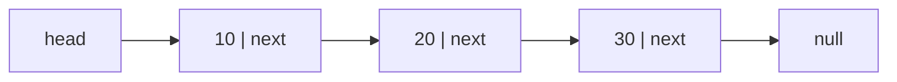
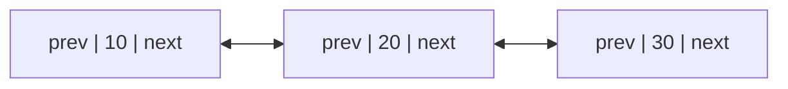

# 线性表：顺序表与链表

**线性表**（linear list）是由零个或多个同类型元素组成的有限序列，通常写作：

```text
L = (a₀, a₁, a₂, ..., aₙ₋₁)
```

`n` 是表长；`n = 0` 时称为空表。元素的位置决定前后关系：`a₀` 没有直接前驱，`aₙ₋₁` 没有直接后继，其余元素各有唯一直接前驱和后继。

“线性”不等于“按值有序”。`(8, 2, 9)` 仍是线性表，只是没有按数值排序。本章所说的“第 `i` 个位置”采用 C++ 常见的 0 基下标；阅读使用 1 基位置的教材时，要先完成转换再写代码。

## 1. 线性表 ADT 规定哪些操作

线性表关注**位置顺序**，一组常见操作是：

```text
empty()          表是否为空
size()           元素数量
at(i)            读取位置 i
find(x)          找到第一个值为 x 的位置
insert(i, x)     在位置 i 插入 x，原 i 及以后元素后移
erase(i)         删除位置 i，后续元素前移
clear()          删除全部元素
```

接口边界必须说清：

- `at(i)` 和 `erase(i)` 要求 `0 <= i < size`；
- `insert(i, x)` 允许 `i == size`，此时表示尾插；
- `find(x)` 找不到时不能返回一个会和合法下标混淆的值，可以返回 `optional<size_t>`；
- 表中的“同类型”可以由 C++ 模板参数表达，本章为突出结构，完整手写实现使用 `int`。

同一个 ADT 可以用顺序表、单链表或双链表实现。客户端看到的元素顺序相同，但每种操作的硬件路径和复杂度不同。

## 2. 顺序表：用连续地址保存序列

**顺序表**（sequential list）把逻辑上相邻的元素放进一段连续存储空间。若首元素地址为 `base`，每个元素占 `w` byte，那么第 `i` 个元素的地址是：

`address(a_i) = base + i × w`

这条公式解释了为什么按下标访问是 `O(1)`：地址计算次数不会随表长增加。

```text
低地址                                                     高地址
base
 ↓
┌────────┬────────┬────────┬────────┬────────┐
│  a₀    │  a₁    │  a₂    │  a₃    │ 未使用 │
└────────┴────────┴────────┴────────┴────────┘
   i=0      i=1      i=2      i=3
```

### 2.1 size 与 capacity 为什么不同

- **size** 是已经存在的元素数量；
- **capacity** 是当前存储空间最多能容纳的元素数量。

必须始终满足 `0 <= size <= capacity`。`size` 之外、`capacity` 以内的槽位只是预留空间，不是表中可读取的元素。

C++ `std::vector::reserve(k)` 只保证容量至少为 `k`，不会创建 `k` 个逻辑元素；`resize(k)` 会改变元素数量。这两个名字相近但语义不同。

### 2.2 插入为什么要从后往前移动

表 `[10, 20, 30, 40]` 在下标 1 插入 15，需要给新元素腾出槽位：

```text
初始： [10, 20, 30, 40, _]
移动： [10, 20, 30, 40, 40]
移动： [10, 20, 30, 30, 40]
移动： [10, 20, 20, 30, 40]
写入： [10, 15, 20, 30, 40]
```

必须从尾部向插入点移动。若从前往后先把 20 写到 30 的位置，原来的 30 会在复制前被覆盖。

插入位置 `i` 时要移动 `n-i` 个元素：头插最坏 `O(n)`，尾部容量足够时不移动旧元素。删除位置 `i` 时把 `i+1..n-1` 左移，共移动 `n-i-1` 个元素。

### 2.3 扩容发生了什么

连续区域后面未必有空闲地址，所以容量满时不能只要求“原地再加一个槽位”。通常要：

1. 申请更大的连续区域；
2. 复制或移动现有元素；
3. 释放旧区域；
4. 更新首地址和容量；
5. 再插入新元素。

因此触发扩容的一次尾插是 `O(n)`；若容量按固定倍数增长，一串尾插的摊还成本为 `O(1)`。扩容还会使指向旧区域的指针、引用和迭代器失效。

### 2.4 完整 C++20 顺序表

下面的实现手工展示 size、capacity、扩容和元素移动。它只保存 `int`，不处理通用类型的构造、析构与异常安全；生产代码应优先使用 `std::vector`。

```cpp
#include <cassert>
#include <cstddef>
#include <iostream>
#include <memory>
#include <optional>
#include <stdexcept>
#include <utility>

class SequentialList {
public:
    std::size_t size() const noexcept {
        return size_;
    }

    std::size_t capacity() const noexcept {
        return capacity_;
    }

    bool empty() const noexcept {
        return size_ == 0;
    }

    int at(std::size_t index) const {
        check_existing(index);
        return data_[index];
    }

    std::optional<std::size_t> find(int value) const noexcept {
        for (std::size_t index = 0; index < size_; ++index) {
            if (data_[index] == value) {
                return index;
            }
        }
        return std::nullopt;
    }

    void insert(std::size_t index, int value) {
        if (index > size_) {
            throw std::out_of_range{"insert position"};
        }
        ensure_capacity(size_ + 1);
        for (std::size_t position = size_; position > index; --position) {
            data_[position] = data_[position - 1];
        }
        data_[index] = value;
        ++size_;
    }

    void push_back(int value) {
        insert(size_, value);
    }

    int erase(std::size_t index) {
        check_existing(index);
        const int removed = data_[index];
        for (std::size_t position = index + 1; position < size_; ++position) {
            data_[position - 1] = data_[position];
        }
        --size_;
        return removed;
    }

    void clear() noexcept {
        size_ = 0;
    }

private:
    void check_existing(std::size_t index) const {
        if (index >= size_) {
            throw std::out_of_range{"list index"};
        }
    }

    void ensure_capacity(std::size_t required) {
        if (required <= capacity_) {
            return;
        }
        std::size_t new_capacity = capacity_ == 0 ? 1 : capacity_ * 2;
        while (new_capacity < required) {
            new_capacity *= 2;
        }

        auto replacement = std::make_unique<int[]>(new_capacity);
        for (std::size_t index = 0; index < size_; ++index) {
            replacement[index] = data_[index];
        }
        data_ = std::move(replacement);
        capacity_ = new_capacity;
    }

    std::unique_ptr<int[]> data_;
    std::size_t size_{0};
    std::size_t capacity_{0};
};

int main() {
    SequentialList list;
    assert(list.empty());

    list.push_back(10);
    list.push_back(20);
    list.push_back(30);
    list.insert(1, 15);
    assert(list.size() == 4);
    assert(list.at(0) == 10);
    assert(list.at(1) == 15);
    assert(list.at(2) == 20);
    assert(list.find(30) == std::optional<std::size_t>{3});

    assert(list.erase(2) == 20);
    assert(list.size() == 3);
    assert(list.at(2) == 30);
    assert(list.capacity() >= list.size());

    list.clear();
    assert(list.empty());
    std::cout << "sequential list ok\n";
}
```

`clear()` 在这个 `int` 教学实现中只把 size 设为 0。通用容器还要及时析构被删除的对象；这正是手写通用动态数组比表面代码更复杂的原因。

## 3. 单链表：节点通过 next 串成序列

**单链表**（singly linked list）的每个节点包含元素和指向后继节点的链接 `next`。节点不要求连续存放。



`head` 是指向第一个数据节点的头指针。若 `head == null`，表为空。最后节点的 `next == null`，表示链结束。

### 3.1 为什么不能按下标直接跳转

节点地址之间没有固定公式。要取得位置 3，必须从 head 依次读取前三个 `next`。因此单链表的按位置访问为 `O(i)`，最坏 `O(n)`。

若已经拿到某节点 `p`，在它后面插入新节点 `s` 只需：

```text
s.next = p.next
p.next = s
```

顺序不能反。若先执行 `p.next = s`，却没有提前保存原后继，后半条链会丢失。

### 3.2 已知位置和寻找位置要分开计数

- 已知前驱节点后，接链步骤是 `O(1)`；
- 只有目标下标时，先找前驱要 `O(n)`；
- 只有目标值时，线性查找也要 `O(n)`；
- 创建节点还可能涉及动态内存分配，其实际成本不能从大 O 标签中消失。

链表的优势是“不移动后续元素”，而不是“任何插入都自动常数时间”。

## 4. 不带头结点的完整单链表

下面的实现用 `unique_ptr` 表达节点所有权：表拥有首节点，每个节点拥有后继节点。`tail_` 是不拥有对象的观察指针，用来让尾插为 `O(1)`。

代码实现查找、按位置插删、逆转和两个有序表的合并。为避免掩盖核心结构，合并创建新节点，不修改输入表。

```cpp
#include <cassert>
#include <cstddef>
#include <iostream>
#include <memory>
#include <optional>
#include <stdexcept>
#include <utility>
#include <vector>

class IntSinglyList {
private:
    struct Node {
        int value;
        std::unique_ptr<Node> next;
    };

public:
    IntSinglyList() = default;
    IntSinglyList(const IntSinglyList&) = delete;
    IntSinglyList& operator=(const IntSinglyList&) = delete;

    IntSinglyList(IntSinglyList&& other) noexcept
        : head_(std::move(other.head_)),
          tail_(std::exchange(other.tail_, nullptr)),
          size_(std::exchange(other.size_, 0)) {}

    IntSinglyList& operator=(IntSinglyList&& other) noexcept {
        if (this != &other) {
            head_ = std::move(other.head_);
            tail_ = std::exchange(other.tail_, nullptr);
            size_ = std::exchange(other.size_, 0);
        }
        return *this;
    }

    std::size_t size() const noexcept {
        return size_;
    }

    bool empty() const noexcept {
        return size_ == 0;
    }

    void push_back(int value) {
        auto node = std::make_unique<Node>(Node{value, nullptr});
        Node* raw = node.get();
        if (tail_ == nullptr) {
            head_ = std::move(node);
        } else {
            tail_->next = std::move(node);
        }
        tail_ = raw;
        ++size_;
    }

    void insert(std::size_t index, int value) {
        if (index > size_) {
            throw std::out_of_range{"insert position"};
        }
        if (index == size_) {
            push_back(value);
            return;
        }

        auto node = std::make_unique<Node>(Node{value, nullptr});
        if (index == 0) {
            node->next = std::move(head_);
            head_ = std::move(node);
        } else {
            Node* previous = node_at(index - 1);
            node->next = std::move(previous->next);
            previous->next = std::move(node);
        }
        ++size_;
    }

    int erase(std::size_t index) {
        check_existing(index);
        int removed = 0;

        if (index == 0) {
            removed = head_->value;
            head_ = std::move(head_->next);
            --size_;
            if (size_ == 0) {
                tail_ = nullptr;
            }
            return removed;
        }

        Node* previous = node_at(index - 1);
        auto victim = std::move(previous->next);
        removed = victim->value;
        previous->next = std::move(victim->next);
        if (index == size_ - 1) {
            tail_ = previous;
        }
        --size_;
        return removed;
    }

    std::optional<std::size_t> find(int value) const noexcept {
        std::size_t index = 0;
        for (const Node* node = head_.get(); node != nullptr;
             node = node->next.get(), ++index) {
            if (node->value == value) {
                return index;
            }
        }
        return std::nullopt;
    }

    void reverse() noexcept {
        tail_ = head_.get();
        std::unique_ptr<Node> previous;
        auto current = std::move(head_);

        while (current != nullptr) {
            auto next = std::move(current->next);
            current->next = std::move(previous);
            previous = std::move(current);
            current = std::move(next);
        }
        head_ = std::move(previous);
    }

    std::vector<int> values() const {
        std::vector<int> result;
        result.reserve(size_);
        for (const Node* node = head_.get(); node != nullptr; node = node->next.get()) {
            result.push_back(node->value);
        }
        return result;
    }

    static IntSinglyList merge_sorted(const IntSinglyList& left,
                                       const IntSinglyList& right) {
        IntSinglyList result;
        const Node* a = left.head_.get();
        const Node* b = right.head_.get();

        while (a != nullptr && b != nullptr) {
            if (a->value <= b->value) {
                result.push_back(a->value);
                a = a->next.get();
            } else {
                result.push_back(b->value);
                b = b->next.get();
            }
        }
        while (a != nullptr) {
            result.push_back(a->value);
            a = a->next.get();
        }
        while (b != nullptr) {
            result.push_back(b->value);
            b = b->next.get();
        }
        return result;
    }

private:
    void check_existing(std::size_t index) const {
        if (index >= size_) {
            throw std::out_of_range{"list index"};
        }
    }

    Node* node_at(std::size_t index) {
        Node* node = head_.get();
        for (std::size_t step = 0; step < index; ++step) {
            node = node->next.get();
        }
        return node;
    }

    std::unique_ptr<Node> head_;
    Node* tail_{nullptr};
    std::size_t size_{0};
};

int main() {
    IntSinglyList list;
    list.push_back(10);
    list.push_back(30);
    list.insert(1, 20);
    list.insert(0, 5);
    assert((list.values() == std::vector<int>{5, 10, 20, 30}));
    assert(list.find(20) == std::optional<std::size_t>{2});

    assert(list.erase(0) == 5);
    assert(list.erase(2) == 30);
    list.reverse();
    assert((list.values() == std::vector<int>{20, 10}));

    IntSinglyList left;
    left.push_back(1);
    left.push_back(4);
    left.push_back(7);
    IntSinglyList right;
    right.push_back(2);
    right.push_back(3);
    right.push_back(8);

    auto merged = IntSinglyList::merge_sorted(left, right);
    assert((merged.values() == std::vector<int>{1, 2, 3, 4, 7, 8}));
    std::cout << "singly linked list ok\n";
}
```

### 4.1 逆转为什么要先保存 next

逆转循环维护三部分：

```text
previous：已经逆转好的前缀
current：当前待处理节点
next：尚未处理的后缀入口
```

每轮必须先保存 `current.next`，再把链接反向。否则原后缀入口会丢失。处理完成后，旧 head 变成 tail，previous 变成新 head。空表和单节点表也应自然得到正确结果，而不是靠访问不存在的第二个节点。

### 4.2 合并两个有序表

两个输入都按非降序排列时，只需比较各自当前首个未处理元素：较小者一定是合并结果的下一个元素。每个节点只前进一次，所以若两表长度为 `m` 和 `n`，时间为 `O(m+n)`。

上面实现复制数值并创建新节点，额外节点空间为 `O(m+n)`。若允许修改输入，可以重新连接原节点，把额外辅助空间降为 `O(1)`；但所有权转移和输入失效语义必须在接口中明确。

## 5. 头指针、头结点与哨兵不是一回事

- **头指针**保存首节点地址；它是一个指针变量，不一定指向额外节点。
- **头结点**位于第一个数据节点之前，通常不保存普通表元素。
- **哨兵节点**（sentinel）是为了统一边界操作而放置的特殊节点。头结点是常见哨兵形式。

不带头结点的单链表在头插、删首节点时必须单独修改 head。带头结点后，每个数据节点都有前驱，许多操作可统一成“修改前驱的 next”。代价是多一个节点，并要求遍历时跳过它。

```text
不带头结点：head -> [a₀] -> [a₁] -> null

带头结点：  head -> [sentinel] -> [a₀] -> [a₁] -> null
                        不属于逻辑元素
```

哨兵值不应拿来和业务数据比较。若用“值等于 -1”表示哨兵，而合法数据也可能是 -1，结构语义就会混乱。哨兵应由位置或独立类型识别。

## 6. 双链表：用额外链接换取反向移动

**双链表**（doubly linked list）节点同时保存 `prev` 和 `next`：



已知某个节点时，双链表可以直接找到前驱并在 `O(1)` 链接步骤中删除该节点；单链表若只拿到当前节点，通常还需从头寻找前驱。

代价是每个节点多一个链接，每次插删要维护更多不变量：

```text
node.next != null 时：node.next.prev == node
node.prev != null 时：node.prev.next == node
```

漏改任何一侧都可能出现“正向遍历正常、反向遍历损坏”的隐蔽错误。

## 7. 循环链表：末尾重新连回开头

**循环链表**（circular linked list）让最后节点的 next 不再是 null，而是指向首节点或头哨兵。双向循环链表还让首节点的 prev 指向末节点。

循环结构适合反复轮转，例如轮询调度和循环播放。它没有 null 作为天然终止条件，所以遍历必须记住起点、元素数量或哨兵；仍写 `while (node != null)` 会形成无限循环。

### 7.1 带哨兵的双向循环链表

把双向、循环和哨兵组合后，空表也能保持统一关系：

```text
空表：sentinel.next == &sentinel
      sentinel.prev == &sentinel

非空：sentinel <-> first <-> ... <-> last <-> sentinel
```

在任意位置 `position` 前插入节点，只需连接 `position->prev`、新节点和 `position`。头插就是在 first 前插入，尾插就是在 sentinel 前插入，不需要两套边界代码。

下面给出完整 C++20 实现。它用原始指针展示双向链接，因此类负责析构所有动态节点，并禁止默认复制，避免两个表误以为自己拥有同一批节点。

```cpp
#include <cassert>
#include <cstddef>
#include <iostream>
#include <vector>

class DoublyCircularList {
private:
    struct Node {
        int value;
        Node* prev;
        Node* next;
    };

public:
    DoublyCircularList() : sentinel_{0, nullptr, nullptr} {
        sentinel_.prev = &sentinel_;
        sentinel_.next = &sentinel_;
    }

    ~DoublyCircularList() {
        clear();
    }

    DoublyCircularList(const DoublyCircularList&) = delete;
    DoublyCircularList& operator=(const DoublyCircularList&) = delete;

    bool empty() const noexcept {
        return size_ == 0;
    }

    std::size_t size() const noexcept {
        return size_;
    }

    void push_front(int value) {
        insert_before(sentinel_.next, value);
    }

    void push_back(int value) {
        insert_before(&sentinel_, value);
    }

    bool erase_first(int value) noexcept {
        for (Node* node = sentinel_.next; node != &sentinel_; node = node->next) {
            if (node->value == value) {
                erase_node(node);
                return true;
            }
        }
        return false;
    }

    std::vector<int> forward_values() const {
        std::vector<int> result;
        result.reserve(size_);
        for (const Node* node = sentinel_.next;
             node != &sentinel_; node = node->next) {
            result.push_back(node->value);
        }
        return result;
    }

    std::vector<int> backward_values() const {
        std::vector<int> result;
        result.reserve(size_);
        for (const Node* node = sentinel_.prev;
             node != &sentinel_; node = node->prev) {
            result.push_back(node->value);
        }
        return result;
    }

    void clear() noexcept {
        while (sentinel_.next != &sentinel_) {
            erase_node(sentinel_.next);
        }
    }

private:
    void insert_before(Node* position, int value) {
        Node* node = new Node{value, position->prev, position};
        position->prev->next = node;
        position->prev = node;
        ++size_;
    }

    void erase_node(Node* node) noexcept {
        node->prev->next = node->next;
        node->next->prev = node->prev;
        delete node;
        --size_;
    }

    Node sentinel_;
    std::size_t size_{0};
};

int main() {
    DoublyCircularList list;
    assert(list.empty());

    list.push_back(20);
    list.push_front(10);
    list.push_back(30);
    assert((list.forward_values() == std::vector<int>{10, 20, 30}));
    assert((list.backward_values() == std::vector<int>{30, 20, 10}));

    assert(list.erase_first(20));
    assert(!list.erase_first(99));
    assert((list.forward_values() == std::vector<int>{10, 30}));

    list.clear();
    assert(list.empty());
    list.push_back(7); // 清空后哨兵关系仍然有效。
    assert((list.forward_values() == std::vector<int>{7}));
    std::cout << "doubly circular list ok\n";
}
```

`erase_first` 的查找仍是 `O(n)`，找到节点后的断链为 `O(1)`。若接口直接提供有效迭代器，删除可以从已知位置开始，但迭代器所属容器和失效条件必须明确。

## 8. 静态链表：不用指针也能表达链接

**静态链表**使用数组下标代替内存指针，节点中保存“下一个节点位于数组哪个槽位”。未使用槽位可以再组成空闲链表。

```text
数组槽位   0       1       2       3
value     20      空闲     10      30
next       3       ...      0      -1

逻辑顺序：槽位 2 -> 槽位 0 -> 槽位 3
```

它在不支持动态指针、需要固定内存池或需要可序列化索引的环境中有用。它仍是链式关系：逻辑相邻元素不要求数组下标相邻。需要自己管理空闲槽位，是换来的额外责任。

## 9. 常见操作复杂度对比

下表假设顺序表容量足够，单链表维护 tail，双链表已给定目标节点。`n` 是元素数量。

| 操作 | 顺序表 | 单链表 | 双链表 |
|---|---:|---:|---:|
| 按下标读取 | `O(1)` | `O(n)` | `O(n)` |
| 按值查找 | `O(n)` | `O(n)` | `O(n)` |
| 头部插入 | `O(n)` | `O(1)` | `O(1)` |
| 尾部插入 | 摊还 `O(1)` | 有 tail 时 `O(1)` | 有尾/哨兵时 `O(1)` |
| 已知位置附近插入 | 移动导致 `O(n)` | 已知前驱时 `O(1)` | 已知节点时 `O(1)` |
| 按下标删除 | `O(n)` | 找位置 `O(n)` | 找位置 `O(n)` |
| 已知节点删除 | 移动导致 `O(n)` | 缺前驱时通常不能直接删 | `O(1)` |
| 额外链接空间 | 无逐节点链接 | 每节点 1 个 next | 每节点 prev + next |

复杂度表没有展示所有实际差异：

- 顺序表连续存储，遍历通常更容易利用缓存；
- 链表节点可能分别分配，存在分配器开销和指针跳转；
- 顺序表扩容会使旧引用失效；
- 链表插入通常不移动其他节点，未被删除节点的地址较稳定；
- 小数据规模下，简单连续数组即使理论操作需要移动，也可能比链表更合适。

内存连续性、缓存行和指针跳转的原因见[内存布局与缓存效率](../foundations/memory_layout.md)。

## 10. 怎样选择数组还是链表

优先考虑顺序表的场景：

- 经常按下标访问；
- 主要在尾部追加并顺序遍历；
- 元素数量可预估，能提前 reserve；
- 希望存储紧凑、减少逐节点分配；
- 需要与接收连续内存的 API 交互。

考虑链表的场景：

- 已经持有插入或删除位置的节点/迭代器，并频繁做局部修改；
- 不希望插入导致其他节点整体搬迁；
- 需要稳定地把节点从一个链中接到另一个链；
- 数据天然由链接关系产生，或者使用固定节点池。

“不知道就用链表”不是可靠规则。现代 C++ 中，普通可增长序列通常先考虑 `std::vector`；确有节点稳定性或接链需求时，再评估 `std::list`、`std::forward_list` 或专门结构。

## 11. 最容易写错的边界

### 11.1 空表和单节点表

每个操作都要检查：

- 空表删除应怎样报告失败；
- 单节点删除后 head 和 tail 是否都恢复为空；
- 循环哨兵是否重新指向自己；
- 逆转空表时是否错误解引用 head。

### 11.2 下标边界

长度为 `n` 时：读取和删除合法范围是 `[0,n)`，插入合法范围是 `[0,n]`。把三者都写成同一判断会错误拒绝尾插，或错误允许读取 `a[n]`。

### 11.3 丢链、成环与悬空指针

- 改链接前没保存后继，会丢失整段节点；
- 把 next 指回错误节点，可能意外形成环；
- 删除节点后继续使用它的地址，会产生悬空指针；
- raw pointer 链表忘记析构会泄漏，默认浅复制会导致重复释放；
- 维护 tail 时，删除末节点后必须让 tail 指向新末节点或空。

### 11.4 修改时遍历

删除当前节点后再读取 `current->next` 已经太晚。安全做法是先保存下一位置，或使用容器操作返回的下一个有效迭代器。不同标准容器的失效规则不同，不能凭链表经验推断 vector。

### 11.5 循环链表的终止条件

循环链表不会遇到 null。遍历条件应是“回到起点/哨兵”或“已走 size 个节点”。若结构已经损坏形成非预期环，普通遍历还可能永久不结束，需要另行使用环检测方法诊断。

## 12. 三类系统中的实际用途

- **传统后端**：批量查询结果、序列化缓冲常用动态数组；LRU 缓存常把双链表与哈希表组合，实现按键查找和已知节点移动。
- **AI Infra**：张量元数据和批次通常需要连续数组；任务依赖更适合图，不应只因“要动态增加”就改用链表。
- **系统与 HFT**：对象池中的空闲对象可以用侵入式链表连接；有界消息流常用环形数组，因为容量固定且连续布局便于访问。

应用场景只提供操作需求。最终选择仍应回到随机访问、局部增删、节点稳定性、容量和遍历方式。

## 13. 本章小结

- 线性表描述有限序列，元素有确定前后位置，但值不一定有序。
- 顺序表用连续地址保存元素，按下标 `O(1)`；中间增删需要移动，扩容需要新区域并可能使引用失效。
- 单链表用 next 连接分散节点，按位置访问为 `O(n)`；已知前驱后的接链为 `O(1)`。
- 双链表增加 prev，可从已知节点直接访问前驱；代价是更多空间和更多链接不变量。
- 循环链表末尾连回开头，必须使用起点、计数或哨兵终止遍历。
- 头指针是变量，头结点是额外节点，哨兵是统一边界的特殊节点，三者不能混称。
- 逆转时要先保存后继；合并两个有序链表可以让两个游标各前进一次。
- 比较结构时要把“寻找位置”和“修改链接”分别计数，并考虑布局、分配和失效规则。

## 14. 章末做题方法：下标移动与指针改链

1. **读题确定表示**：是否需要随机访问、频繁中间插删、稳定地址或已知最大容量；再选顺序表、单链表、双链表或静态链表。
2. **顺序表画区间**：插入位置 `i` 时标出要右移的 `[i,n)`，删除时标出要左移的 `(i,n)`；先检查容量和合法下标。
3. **链表画节点格**：每个节点分数据域和指针域，修改前先保存会丢失的后继；双链表同时核对前后两个方向。
4. **逐操作验算**：空表、头尾插删、单节点、找不到目标；维护 `head/tail/size` 与实际链长一致，检查是否有环或断链。

常见陷阱：把第 `i` 个元素与下标 `i` 混淆；先改指针导致后继丢失；删除节点后继续解引用；有头结点与无头结点模板混用；声称链表任意删除是 `O(1)` 却忽略寻找节点。

## 15. 思考题与面试、408 追问

1. 线性表与有序表有什么区别？空表是否仍是线性表？

<details><summary>参考答案</summary>

线性表只规定元素有前后次序，不要求键值排序；有序表还要求值按给定比较关系单调排列。空表长度为 0，仍满足线性表定义，许多不变量和操作必须把它作为合法边界处理。

</details>

2. 线性表长度为 `n` 时，读取、删除和插入各自允许哪些 0 基位置？

<details><summary>参考答案</summary>

读取和删除必须指向已有元素，合法范围 `[0,n)`；插入指定缝隙，合法范围 `[0,n]`，其中 `i=n` 是尾插。验算空表 `n=0`：读删都无合法位置，但插入位置 0 合法。

</details>

3. 已知首地址 `base=1000`，每元素 8 byte，第 7 个 0 基元素地址是多少？地址公式依赖哪些前提？

<details><summary>参考答案</summary>

`addr=base+7×8=1056`。公式依赖元素定长、连续无额外间隙、使用 0 基下标且 `base` 指向首元素；若问“第 7 个”按 1 基则下标为 6，地址 1048，必须先辨明措辞。

</details>

4. 顺序表在位置 `i` 插入和删除分别移动多少个元素？最好与最坏情况是什么？

<details><summary>参考答案</summary>

长度为 n 时，在 `i∈[0,n]` 插入要右移旧 `[i,n)`，共 `n-i` 个；尾插最好 0 个、头插最坏 n 个。删除 `i∈[0,n)` 后左移 `(i,n)`，共 `n-i-1` 个；删尾最好 0 个、删头最坏 `n-1` 个。都不含寻找位置或扩容成本。

</details>

5. 动态数组扩容为什么会使指针和迭代器失效？提前 `reserve` 能保证什么、不能保证什么？

<details><summary>参考答案</summary>

扩容通常申请更大连续区域并搬移元素，旧区域释放，所以指针、引用和迭代器悬空。`reserve(k)` 可在容量未超过 k 前避免因容量不足再分配，但不能保证超过 k 后稳定，也不能阻止 erase/insert 等操作按容器规则使迭代器失效。

</details>

6. 为什么顺序表插入要从后往前搬，而删除可以从前往后搬？

<details><summary>参考答案</summary>

右移时若从前往后，写 `a[i+1]=a[i]` 会覆盖尚未搬走的旧 `a[i+1]`；应从末元素倒序搬。左移删除时写 `a[k]=a[k+1]`，源在更右侧，按前向次序读取源后再覆盖左侧不会破坏后续源。用 `[A,B,C]` 在 0 插入即可验出错误方向会复制 A。

</details>

7. 单链表已知节点 `p` 后插入 `s` 时，两条赋值应按什么顺序执行？反过来会丢失什么？

<details><summary>参考答案</summary>

先 `s->next=p->next` 保存原后继，再 `p->next=s` 接入新节点。不使用临时变量而反过来会先把 `p->next` 改为 s，随后 `s->next=p->next` 变成 s 自环，原后继链失去入口。验算插入前后从 p 遍历应是 `p,s,old_next`。

</details>

8. “链表插入删除都是 `O(1)`”缺少哪些前提？按下标删除单链表节点的总成本是多少？

<details><summary>参考答案</summary>

要已知目标节点及所需前驱、忽略/单独计算分配释放，并能维护 head/tail。按下标 i 删除需从 head 找到前驱，最坏 `O(n)`，改链 `O(1)`，总计 `O(n)`；删头可特判 `O(1)`。

</details>

9. 头指针、头结点和哨兵分别是什么？带哨兵怎样统一空表与头部操作？

<details><summary>参考答案</summary>

头指针是保存入口地址的变量；头结点是链首额外节点；哨兵是不代表业务数据、用于统一边界的特殊节点。带头哨兵时真实首节点恒为 `sentinel->next`，空表就是该指针为空；在首部插删也始终有一个前驱哨兵，减少特殊分支。

</details>

10. 只有待删除单链表节点的地址、没有 head 或前驱时，能否总在 `O(1)` 删除？末节点为什么是边界反例？

<details><summary>参考答案</summary>

非末节点可把后继数据复制到当前节点，再绕过并删除后继，表面 `O(1)`，但改变的是节点身份且不适合不可复制数据。末节点没有后继可复制，要找到前驱才能把其 next 置空，而单链表只能从 head 扫描；没有 head/前驱甚至无法正确完成。

</details>

11. 写出单链表逆转循环中 previous、current、next 的含义，并说明每轮保持什么不变量。

<details><summary>参考答案</summary>

`previous` 是已逆转前缀的头，`current` 是尚未处理后缀的首节点，`next` 临时保存 `current` 原后继。循环为 `next=current->next; current->next=previous; previous=current; current=next`。不变量：原链被分成“previous 指向的已逆前缀”和“current 指向的未处理后缀”，节点不重不漏；结束时 current 为空，previous 为新头。时间 `O(n)`、空间 `O(1)`。

</details>

12. 合并两个长度为 `m`、`n` 的有序链表为何是 `O(m+n)`？复制节点与重连节点的空间语义有何不同？

<details><summary>参考答案</summary>

两个游标每次比较后至少前进一个，所有节点最多取一次，总访问 `m+n`，时间 `O(m+n)`。重连复用原节点只需 `O(1)` 辅助空间但会改变输入所有权；复制会新建 `m+n` 个节点，额外空间 `O(m+n)` 并保留原链。相等键的取法决定稳定性。

</details>

13. 双链表删除节点 `x` 时要修改哪两侧链接？漏掉 `x->next->prev` 会出现什么现象？

<details><summary>参考答案</summary>

一般要执行 `x->prev->next=x->next` 和 `x->next->prev=x->prev`，边界由哨兵或分支处理。漏第二条后，向前遍历似乎正常，向后遍历却仍会到已删除的 x，造成悬空引用、错误链或释放后访问。

</details>

14. 循环链表为什么不能用 `node != nullptr` 结束遍历？空的哨兵循环表满足什么指针关系？

<details><summary>参考答案</summary>

循环链表末节点指回起点/哨兵，正常遍历永远不会遇到 null；应在回到起点或走够 size 次时停止。空的双向哨兵循环表通常满足 `sentinel.next==&sentinel` 且 `sentinel.prev==&sentinel`，插入首节点后两侧都要更新。

</details>

15. 静态链表为什么仍叫链表？数组下标在其中扮演什么角色？

<details><summary>参考答案</summary>

它的逻辑次序仍由链接字段决定，而不是由数组物理相邻决定；只是把指针换成数组下标（游标），指向下一个节点槽。需要另维护空闲槽链，不变量包括有效链无意外环且业务链与空闲链不重叠。

</details>

16. 一个工作负载包含 90% 按下标读取、9% 尾插、1% 中间删除，你会先选顺序表还是链表？说明依据。

<details><summary>参考答案</summary>

先选动态顺序表：90% 下标读为 `O(1)` 且局部性好，尾插通常摊还 `O(1)`；只有 1% 中间删除付 `O(n)` 搬移。链表按下标读是 `O(n)`，会把主要操作变慢。再用真实规模测量，并确认删除是否需要稳定地址、容量是否可预留。

</details>

17. LRU 缓存为什么常组合哈希表和双链表？两者分别承担什么操作？

<details><summary>参考答案</summary>

哈希表把 key 映射到双链表节点，平均 `O(1)` 查找；双链表按最近使用顺序排列，已知节点可 `O(1)` 移到表头，尾部可 `O(1)` 淘汰。每次插入、访问、更新、淘汰都要同步两者，不变量是哈希项与链节点一一对应且容量不超限。

</details>

18. 设计覆盖顺序表和链表实现的边界测试：至少包含空表、单节点、首尾插删、找不到、逆转和重复值。

<details><summary>参考答案</summary>

建立操作表：空表读删应失败、在 0 插入成功；单节点删首/尾后恢复空；多节点分别首插、尾插、中插并核对 size/顺序；删除不存在值不改变结构；逆转空、单节点、`[1,2,3]` 得 `[3,2,1]`，再逆转还原；重复 `[1,2,1]` 明确删首个还是全部。顺序表同时测扩容后值正确，链表每步做链长、tail、无环检查；可与 `std::vector` 小规模随机对拍。

</details>

## 16. 权威依据与延伸阅读

- [2025 年 408 公开考试大纲：线性表顺序与链式存储](https://www.csgraduates.com/study_methods/outline/2025/)：用于核对定义、基本操作与实现范围。
- [清华大学出版社：严蔚敏、吴伟民《数据结构（C语言版）》](https://www.tup.tsinghua.edu.cn/bookscenter/book_02564806.html)：第 2 章按线性表的顺序表示和链式表示组织主干。
- [MIT 6.006：Data Structures and Dynamic Arrays](https://ocw.mit.edu/courses/6-006-introduction-to-algorithms-spring-2020/851ae1c98f7a73382b76732f977bb92f_CHhwJjR0mZA.pdf)：用于核对数组序列、链表序列、扩容和操作成本。
- [MIT 6.006 官方 Recitation 2](https://live.ocw.mit.edu/courses/6-006-introduction-to-algorithms-spring-2020/c08a3b63dfe5f6f6b32257d35f86ae63_MIT6_006S20_r02.pdf)：提供序列接口在数组、链表和动态数组上的复杂度对照。
- [Princeton Algorithms：Bags, Queues, and Stacks](https://algs4.cs.princeton.edu/13stacks/)：官方材料展示链表构造、遍历及扩容数组的摊还实现。
